# 【マネしたい】カッコいいパワポの「マトリックス」スライド９選

[note原文](https://note.com/powerpoint_jp/n/na3237006af1c)

みなさんこんにちは。
資料デザインのリサーチや分析に取り組むパワーポイントのスペシャリスト、パワポ研です。

今回は久しぶりに【マネしたい】シリーズの新作です。**パワポの「マトリックス」スライドに焦点を当て、上場企業のIR資料から参考になりそうなパワーポイント資料を抜粋して紹介**していきます。

【マネしたい】シリーズのまとめ記事はこちら。

では早速行きましょう！

## マトリックス図の使い方とポイント

参考となるスライドを見ていく前に、パワポにおけるマトリックス図の使い方と作成上のポイントについて簡単に整理しておきましょう。

**マトリックス図が決算説明資料等のパワーポイント資料で使われるのは、主に３つのパターンになります。**

- 市場における自社のポジショニングを示す

- 自社の複数サービスの相関関係を示す

- 自社のポジショニングを今後どう変化させるかを示す

### 市場における自社のポジショニングを示す

世の中には、競合するサービスや製品が多くあるので、自社のサービスや製品に何かしらの強みや特徴がない場合、競争に勝つことはできません。
つまり**自社のサービスや製品をアピールするという観点では、強みや特徴をわかりやすく説明する必要があります。**そうした場合に四象限のマトリックス図を使うことで、パワポの資料が引き締まるわけですね。

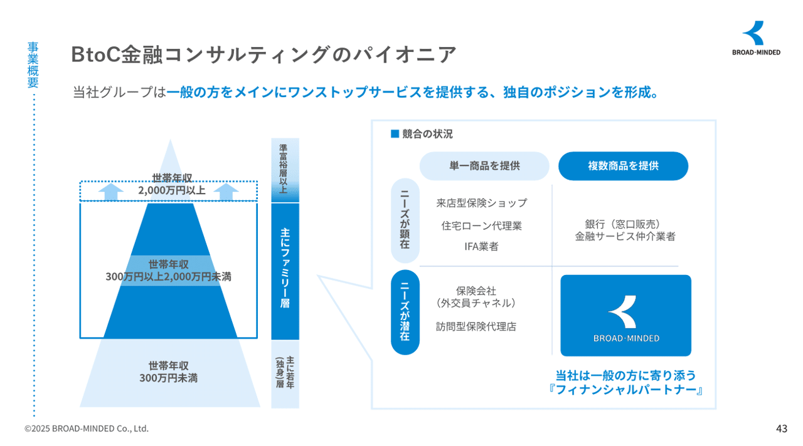
*引用元：ブロードマインド株式会社の2025年3月期決算説明資料*

### 自社の複数サービスの相関関係を示す

**自社内に類似のサービスが複数ある場合、それぞれの位置づけを明確にしないと、顧客も投資家も混乱してしまいます。**
投資家の視点では、類似するサービスを複数持つことで非効率になっていないか、統合あるいは片方をやめるという選択はないのか、という問いが生まれてきます。
決算説明資料などのパワーポイントでは、そうした疑問へのアンサーが必要になりますが、マトリックス図は一目でわかりやすいので有効です。

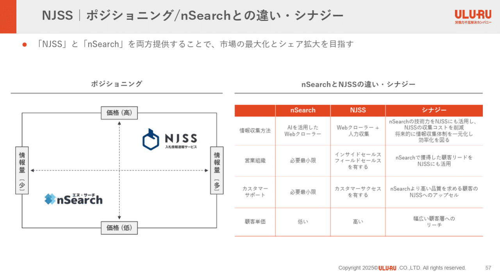
*引用元：株式会社うるるの2025年3月期 決算説明資料*

### 自社の成長戦略を示す

自社のポジショニングというのは、ずっと変わらないものでなく、世の中の変化や自社の戦略や競合の動きなどによって変わってきます。
中長期戦略においては、自社の強みを強化し、独自のポジションを築くことが非常に重要です。**中期経営計画のパワーポイントでは自社のポジションをどう変化させるかは必須の１枚**となりますが、Ｌ型のマトリックス図が使われることが多いですね。

*引用元：株式会社JDSCの2025年6月期 通期決算説明資料*

### マトリックス図の作成のポイント

マトリックス図の作成のポイントは一つといっても過言ではありません。
**最も重要なポイントは、適切な軸**を選ぶことです。

- 競合比較：**顧客の購買決定要素（KBF、Key Buying Factor）の中で、自社のユニークさが目立つ軸**は何か

- サービスの相関関係：**顧客セグメントが分かれる要素の中で、それぞれのサービスの差分が目立つ軸**は何か

- 成長戦略：**自社の企業価値向上に直結する要素の中で、戦略の実行を通じて向上できる軸**は何か

実際の作成方法については、お手本となるスライド例を見た後に記載していますので、最後まで読んでみてくださいね。

## 競合比較のマトリックス図の見本３選

まずは市場における自社のポジショニングを示す、いわゆる競合比較のパワポスライド例から見ていきましょう。競合比較においては、四象限で区切るタイプのマトリックス図が使われるのが一般的です。

### 株式会社Liberawareのスライド例

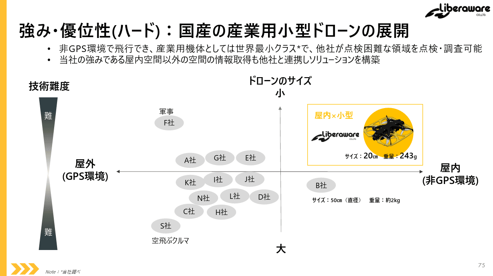
> 引用元：[> 2025年7月期 通期決算説明資料](https://ssl4.eir-parts.net/doc/218A/tdnet/2687217/00.pdf)

*https://liberaware.co.jp/ir/library/presentation/*

まずは最もベーシックな競合比較のパワーポイントから見ていきましょう。
この事例では、「屋内用ドローンか屋外用ドローンか」「ドローンのサイズが小さいか大きいか」の２軸でマトリックスを作っています。そうすることで、屋内で使える小型ドローンの領域が自社のみで、独自性が際立つわけですね。

このスライドのポイントはいくつかあるのですが、まず軸に説明を追加している点が挙げられます。**「小型か大型か」という軸に対し、より極に振ると技術難易度が上がるという説明を追加し**、自社の技術優位性をアピールしています。「屋内か屋外か」もGPS環境の有無が関係していることがわかって親切です。

また、あえて競合他社を多数表示することで、多くのドローン事業者は屋外型、さらに言うと屋外の大型ということを見せることで、対極にある自社のユニークさを見せています。

### 株式会社グリッドのスライド例

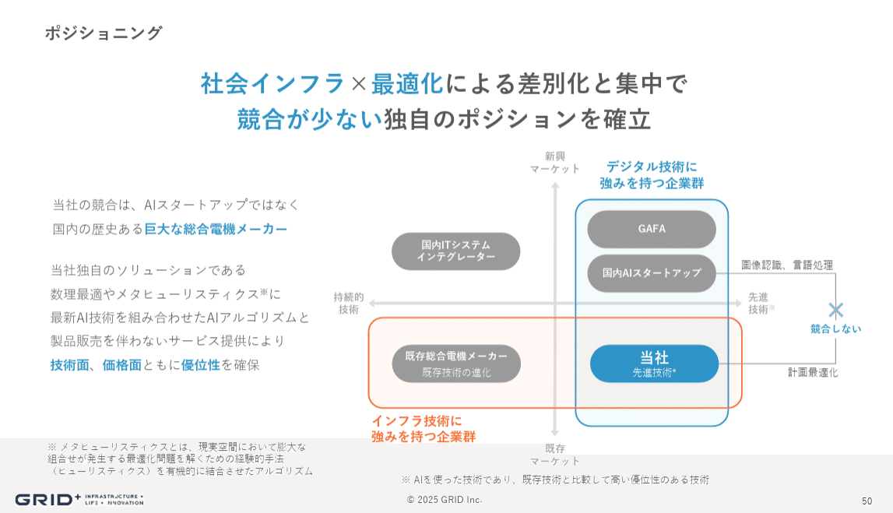
> 引用元：[> 2025年６月期 決算説明資料](https://contents.xj-storage.jp/xcontents/AS82605/288c0a33/fb7b/4571/96cd/daef4ca70f50/140120250812538840.pdf)

*https://gridpredict.jp/ir/presentations*

次はマトリックス図にテキスト情報を付加しているパワーポイントを見ていきましょう。
この事例では、**「新規マーケットか既存マーケットか」「持続的技術か先端技術か」を軸に取った**マトリックス図に加えて、**競合も含む事業者カテゴリのグループと、カテゴリー間の競合状況について説明**しています。

まず、マトリックス下側の既存マーケットのプレイヤー群を「インフラ技術に強みを持つ企業群」、マトリックス右側の先進技術に強い企業群を「デジタル技術に強みを持つ企業群」としてまとめた上で、自社はその両方を満たしているということをアピールしています。
加えて、国内AIスタートアップとは競合しないということを矢印とテキストで示すことで、自社のユニークさをアピールしています。

### 株式会社TENTIALのスライド例

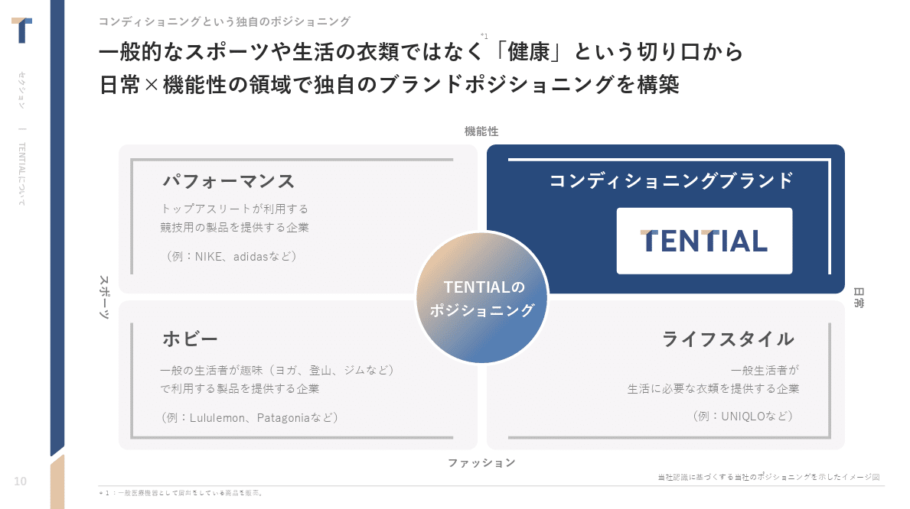
> 引用元：[> 2025年8月期 通期決算説明資料（事業計画及び成長可能性に関する資料）](https://ssl4.eir-parts.net/doc/325A/tdnet/2698232/00.pdf)

*https://corp.tential.jp/ir/library/presentations/*

最後に競合をマッピングするのではなく、四象限をそれぞれカテゴライズしているパワーポイントを見ていきましょう。

この事例では、**衣類を「機能性かファッションか」と「スポーツか日常か」の２軸で分類**し、パフォーマンス、コンディショニング、ホビー、ライフスタイルという４つのカテゴリーにしています。
そのうえで、**コンディショニングブランドという新たな領域に自社を位置づけることで、自社が新たなカテゴリーの先駆者である**ことを示しています。

株式会社TENTIALのプレゼンテーション資料は非常に洗練されており、資金調達を目指す方や、IRのレベルを上げたい方が是非見るべき資料となっているので、[【パワポ研直伝】パワポの「資金調達ピッチ」作成ポイントと参考スライド集](https://note.com/powerpoint_jp/n/n6b6db49c6081)でも取り上げています。

## 事業ポートフォリオのマトリックス図の見本３選

ここからは自社における複数サービスの相関関係を見せる、いわゆる事業ポートフォリオのパワポスライド例を見ていきましょう。事業ポートフォリオにおいては、四象限もＬ字もありますし、もっとマス数が多いパターンもあります。

### 株式会社うるるのスライド例

> 引用元：[> 2025年3月期 決算説明資料（2025年5月15日および26日に訂正済](https://ssl4.eir-parts.net/doc/3979/ir_material_for_fiscal_ym2/178580/00.pdf)> ）

*https://www.uluru.biz/ir/presentation.html*

まずは類似する二つの事業の関係性を示しているパワーポイントから見ていきましょう。
この事例では、**価格と情報量という二つの軸を取る**ことで、片方のサービスは価格が高くて情報量が多い、もう一つのサービスは価格が安くて情報量が少ないということを示しています。それにより、**類似のサービスでも片方はヘビーユーザー向け、片方はライトユーザー向けのエントリーサービス**であることがわかるわけですね。

この情報を示すうえでは、必ずしも四象限のマトリックスにする必要はないのですが、左側にマトリックス図を置いて視覚的に理解させ、より詳細を右側の表で説明するという構造にするためにマトリックスを使っています。

### 株式会社yutoriのスライド例

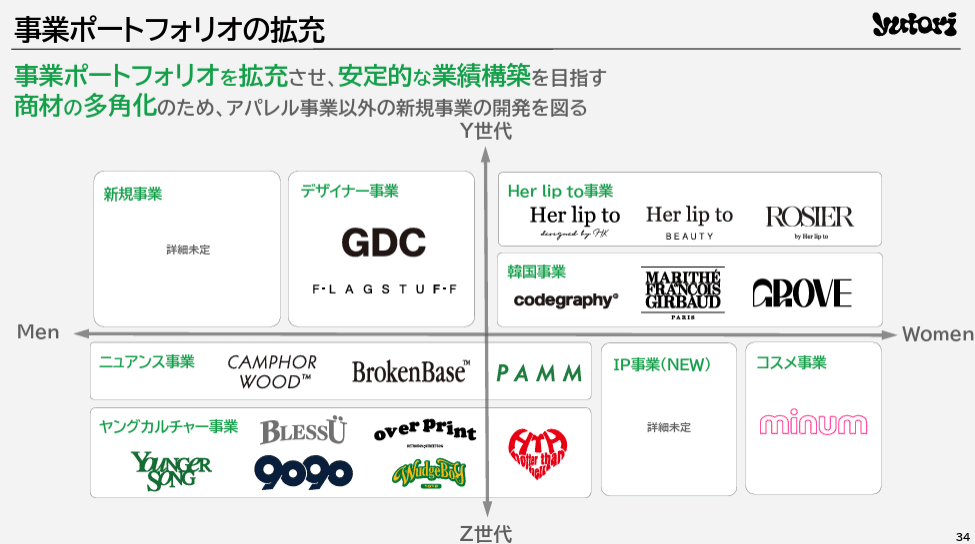
> 引用元：[> 2025年3月期 決算説明資料](https://contents.xj-storage.jp/xcontents/AS09313/a330e38b/15fe/4334/8611/27c979b7a67d/140120250514550109.pdf)

*https://yutori.tokyo/ir/presentations/*

次は自社の事業ポートフォリオが市場をどうカバーしているか説明しているパワーポイントを見てみましょう。
この事例では、**自社のターゲット市場を「Ｙ世代かＺ世代か」「男性か女性か」の２軸で分けた**うえで、自社のブランドをマッピングしています。

ここでのポイントは、ただブランドをプロットするだけでなく、デザイナー事業、ニュアンス事業、ヤングカルチャー事業など、**事業カテゴリー名を入れていることで、よりカテゴリーのニュアンスが伝わりやすくしている**ことです。

### BASE株式会社のスライド例

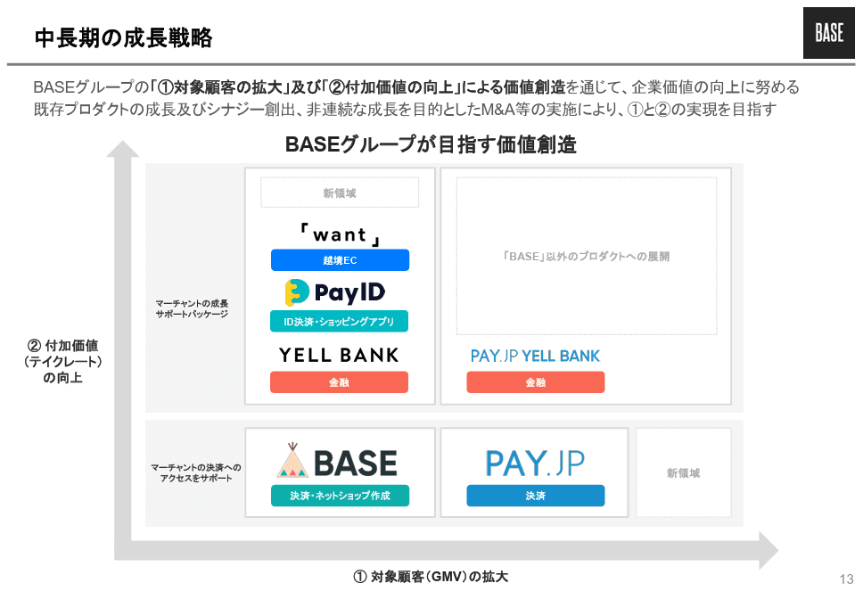
> 引用元：[> 2024年12月期 第4四半期決算説明会資料](https://contents.xj-storage.jp/xcontents/AS08546/afce6670/2a24/4e87/b5ca/4d1edbce548f/140120250214576086.pdf)

*https://binc.jp/ir/library*

次はＬ型のマトリックスで事業ポートフォリオを説明しているパワーポイントを見てみましょう。このスライドは成長戦略のパワポなので、**「対象顧客（ＧＭＶ）の拡大」と「付加価値（テイクレート）の向上」の２軸**を取り、各事業がどのような役割を担っているのかを示しています。

そのうえで、下のBASEとPAY.JPについては「マーチャントの決済へのアクセスをサポート」として、エントリー事業であること、上のwantとpayIDとYELL BANKについてはマーチャントの成長サポートパッケージとして、収益獲得事業であることを示しています。

また余白にも新領域といった枠を作っておくことで、今後さらに事業を増やしていくことも示唆されていますね。

## 成長イメージのマトリックス図の見本３選

ここからは、自社の成長戦略や成長イメージを見せるマトリックス図について見ていきましょう。一般にはＬ型が多いですが、事業ポートフォリオの拡張を見せる場合など、四象限のマトリックスのこともあります。

### 株式会社JDSCのスライド例

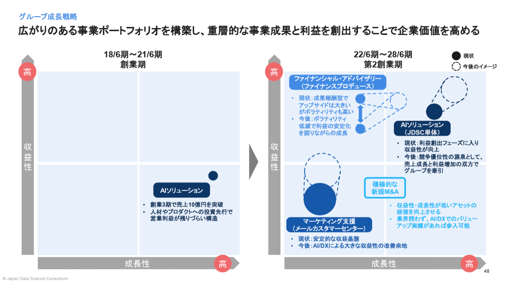
> 引用元：[> 2025年6月期 通期決算説明資料](https://ssl4.eir-parts.net/doc/4418/tdnet/2672275/00.pdf)

*https://jdsc.ai/ir/library/presentation/*

まずは最もベーシックな、収益性と成長性のＬ字マトリックスのパワーポイントを見てみましょう。
この事例では**現状を実線の円で書いたうえで、将来の目指すイメージを点線の円**で示しています。またその将来への変化に向けたドライバーをテキストで書くことで、**事業がどう進化するか、なぜ進化するかが一目でわかる**ようになっています。

またこの事例のポイントとして、2021年6月期までのマトリックスは左側に示しています。**過去⇒現在⇒将来としてしまうとさすがにビジーになるので**、過去だけ切り出すというのは、進化の過程を見えるようにしつつ見やすくするという意味でいいテクニックといえますね。

### 株式会社モンスターラボホールディングスのスライド例

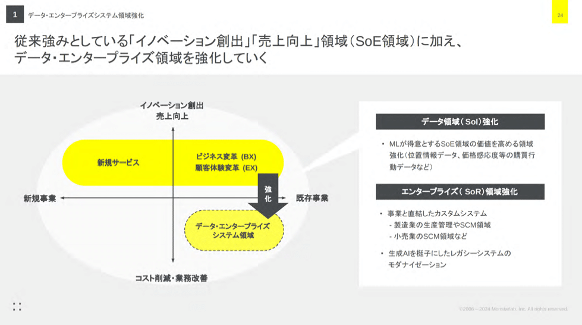
> 引用元：[> 2024年12月期 決算説明資料](https://ssl4.eir-parts.net/doc/5255/tdnet/2569520/00.pdf)

*https://monstar-lab.com/ir/library/presentation*

次は、四象限のマトリックスで、事業領域の拡大方針を見せるパワーポイントを見てみましょう。
この事例では、**「イノベーション創出や売上向上かコスト削減や業務改善か」「新規事業か既存事業か」という２軸**でマトリックスを作り、その中に自社の既存サービスと、今後伸ばしたいサービスをマッピングしています。

事業内容がなかなかわかりづらいので、マトリックス内ではあまりテキストを入れず、右側に吹き出しで具体を記載しています。また灰色ベースでマトリックスの部分を楕円の白背景にし、黄色でマッピングしているのは、見やすい工夫がされたパワポといえますね。

### AICROSS株式会社のスライド例

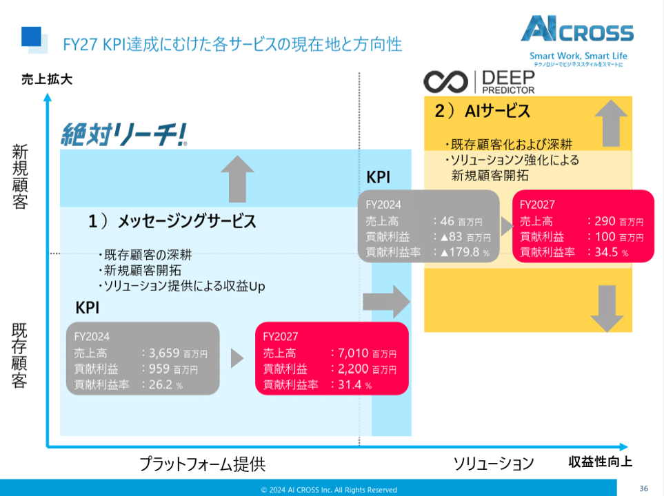
> 引用元：[> 決算説明資料](https://aicross.co.jp/corporate/uploads/2025/02/1f374261c836c0432a95bc04c191ce0f.pdf)

*https://aicross.co.jp/ir/irlibrary/*

最後はＬ字と四象限を組み合わせたマトリックス図のパワーポイントを見てみましょう。
**売上拡大と収益性向上の２軸でマトリックスを作っている点は一般的**ですが、その中に**「新規顧客か既存顧客か」「プラットフォーム提供かソリューションか」という要素**を入れています。

新規が拡大することが売上向上につながる、プラットフォームよりソリューションの利益率が高いということで、こういった構造が明確になっている場合にはＬ字と四象限の組み合わせが可能になりますね。

またマトリックスの中に事業イメージをプロットするだけでなく、具体なKPIを入れている点も、見せ方の一つとして覚えておくとよさそうです。

## マトリックス図の作り方

ここまで様々なマトリックスを使ったパワーポイントの事例を見てきましたが、最後に簡単にだけマトリックス図の作り方を説明します。

まず最初に、四象限かＬ型かを決めて、矢印を選びます。四象限の場合は両側が矢印、Ｌ型は片側が矢印のものを選びます。次にテキストボックスを選んで軸の説明を入れましょう。

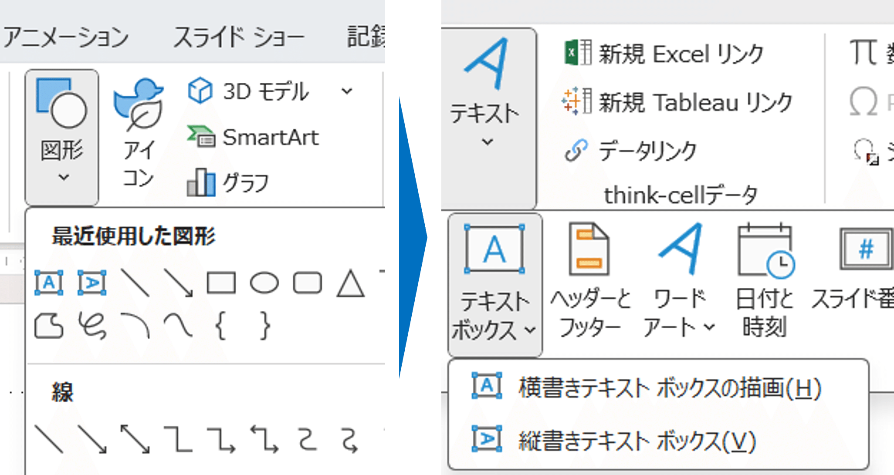
次にロゴや図形を選んでマッピングしましょう。文字を入れたい場合はテキストボックスを使うのも手ですが、図形の自動調整のチェックを外しておきましょう。

あとはさらに図形でグルーピングをする、矢印を入れるなど自由です。今回紹介したスライドを参考にいろいろと試してみてくださいね。

また四象限にラベルを付けたい場合などは、以前紹介したきれいな表の作り方のNoteに詳細がまとまっております。

## 【マネしたい】カッコいいパワポの「マトリックス」スライド９選まとめ

いかがでしたでしょうか。パワポの「マトリックス」スライドは、IR資料において、競合に対する強みの説明、事業ポートフォリオの説明、事業戦略の説明に使われます。いずれもパワーポイントの説明資料においては非常に重要なスライドなので、マトリックス図を使いこなせるようになることで、プレゼンテーション全体の印象をよくすることができますよ。ぜひ今回の事例をストックして、使ってみてくださいね。

## パワポ研オリジナルテンプレート

パワポ研では、「ビジネスシーンで使える」パワーポイントテンプレートを公開しております。デザインを整えるのみならず、**ロジックやストーリーを整理するのにも役立つパッケージ**になっておりますので、関心のある方は下記ページも併せてご覧ください！

上記の記事のように、noteでは**フォローしているだけでビジネスにおける「資料作成のコツ」と「デザインのセンス」が身に付くアカウント**を目指して情報配信を行っています。
今後もコンスタントに記事を配信していく予定なので、関心のある方は是非アカウントのフォローをお願いします！

**> Template販売　**[> https://powerpointjp.stores.jp/](https://powerpointjp.stores.jp/%EF%BF%BCnote)
**> note　**[> パワポ研の資料作成術](https://note.com/powerpoint_jp/m/mc291407396da)
**> X（旧Twitter)　**[> https://twitter.com/powerpoint_jp](https://twitter.com/powerpoint_jp)

## レックスアドバイザーズからのお知らせ

パワポ研は株式会社レックスアドバイザーズが運営しています。
レックスアドバイザーズは**経営企画職や経営管理職に特化した転職エージェント**です。
上場企業や上場準備企業を中心に、**経営企画、IR、経理財務、法務、内部監査等の職種の求人**をご紹介しているほか、**CFOなどのコンフィデンシャル求人**もご紹介可能です。
またコンサルティングファームや監査法人、会計事務所の求人も豊富にあるため、プロフェッショナルファームを目指す方のご支援も得意です。
求人紹介やキャリア相談を希望の方は、[**無料転職サポート**](https://www.career-adv.jp/job_search/entryform_exp/)よりサービス利用登録をしてみてください。

*レックスアドバイザーズのサービスサイトはこちら*

**> 求人紹介をご希望の方　**[> 無料転職サポート](https://www.career-adv.jp/job_search/entryform_exp/)**
> 採用支援をご希望の方　**[> 採用サポート](https://www.career-adv.jp/request3/)
**> その他　**[> お問い合わせフォーム](https://www.rex-adv.co.jp/contact)
**> 書籍　**[> 注目企業の実例から学ぶパワポ作成術](https://www.amazon.co.jp/dp/4046060476)

