# 【マネしたい】おしゃれなパワポの表紙スライド３０選 （2026年更新）

[note原文](https://note.com/powerpoint_jp/n/na7d0cb4925f3)

みなさんこんにちは。
資料デザインのリサーチや分析に取り組むパワーポイントのスペシャリスト、パワポ研です。多くの人がよりよいパワポを作成できるよう、様々なスライド例を紹介をしています。

突然ですが、「ジャケ買い」という言葉をご存じでしょうか？

> "**> ジャケ買い**> （ジャケがい）とは、レコード、CD、VHS、LD、DVD、本などのメディア商品を内容を全く知らない状態で、店頭などで見かけたパッケージデザインから好印象を受けたということを動機として購入すること。**> ジャケット買い**> とも言われる"

*ジャケ買い（フリー百科事典『ウィキペディア（Wikipedia）』）*

ジャケ買いとは、CDや本などをジャケットや表紙の印象で**「これいいじゃん！」と言って買うこと**です。デザインする側からすれば、ジャケ買いしてもらえるように、デザインに創意工夫を凝らしているといえますね。

例えば、ビートルズのアビイ・ロードのジャケットはとても有名です。横断歩道のデザインと言えば、多くの人がイメージできると思います。

 
[
**
アビイ・ロード(紙ジャケット仕様) - ザ・ビートルズ
**

www.amazon.co.jp

 
2,530円

(2025年09月12日 22:32時点
詳しくはこちら)

 
 
 
 

Amazon.co.jpで購入する

 
 
 
](https://www.amazon.co.jp/dp/B00P1J69HI?tag=note0e2a-22&linkCode=ogi&th=1&psc=1)

 
話をパワポに戻しましょう。**パワポのスライドにおいて、表紙のデザインを要視することは少ない**でしょう。作る側もそこまで表紙のデザインには気は配りませんよね？　ビジネスなので、もちろん中身が圧倒的に大事です。

しかしビジネスにおいても、パワポの表紙の印象は意外に重要かもしれません。特に株主向けの決算報告資料では、プレゼンテーションの開始まで表紙のスライドが投影され続けることもあります。聞き手は開始まで表紙のスライドを見続けることになるので、その**印象が多少なりともその後のプレゼンの感想へと繋がる**ということは十分に考えられる話です。

ということで、今回はパワポのおしゃれな表紙スライドのをたくさん紹介していきます。デザインに正解はないので、是非自社の参考になる表紙スライド例を見つけてくださいね。

## おしゃれなパワポの表紙をデザインするには

まずパワポの表紙スライドを作る上での大前提となりますが、**パワポでおしゃれな表紙スライドをデザインするというのは、ビジネスパーソンからするとかなり難易度が高いです**。頑張ってはみたものの深みにはまって、結果的に妙に独特な表紙スライドが出来上がる可能性もあります。

パワポ研としては、**過去に作られたパワポのかっこいい表紙スライドやかわいい表紙スライドの例からエッセンスを吸収**することが、おしゃれなパワポの表紙スライドをデザインする一番の近道ではないかと思います！

ちなみにごくまれに独創的なパワポの表紙スライドもあるのですが、今回はそうした表紙スライドは対象にはしません。考え方がわかる表紙スライドはまだしも、考え方すらわからない表紙スライドとなると、どんなにおしゃれなスライドだとしても参考にしようがないからです。

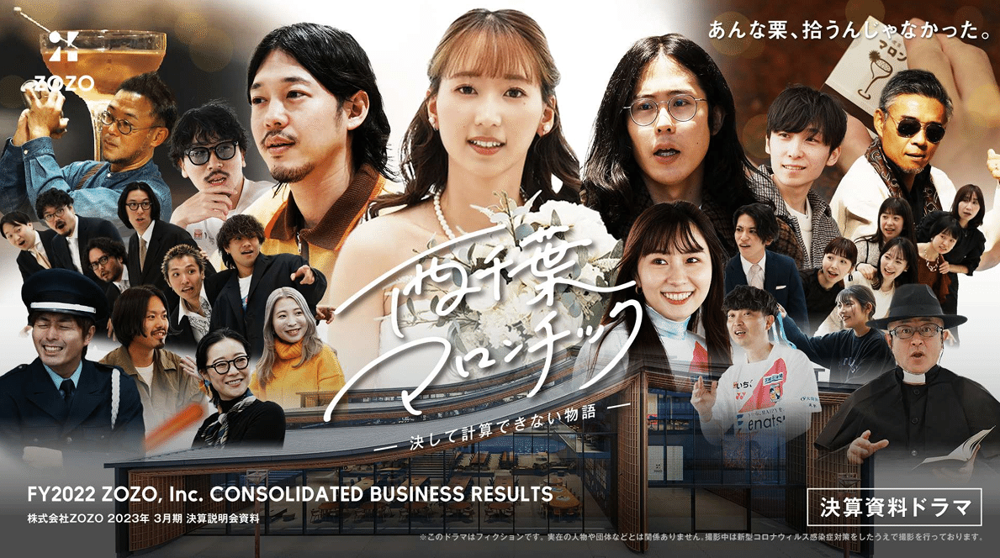
*ZOZOのパワポの表紙スライド*

> 引用元：[> 2023年3月期 通期決算説明会資料](https://corp.zozo.com/ir-info/files/pdf/ba452434985271cc939173687f9b08123e6b8fb6.pdf)

*https://corp.zozo.com/ir-info/library/past/*

パワポの表紙スライドのデザインは難易度が高いと伝えましたが、おしゃれな表紙スライドには**いくつかのデザインのパターン**があります。

- おしゃれな写真を軸に表紙スライドをデザインする

- かわいいイラストを軸に表紙スライドをデザインする

- 写真やイラストを使わずにシンプルな表紙スライドをデザインする

- 経営理念やミッションビジョンバリューを表紙スライドに入れる

ここまで前置きが少し長くなってしまったのですが、ここからは実際にパワポのおしゃれな表紙スライド例を見ていきましょう！

## おしゃれな写真のパワポ表紙スライド例

まずは写真を使ったおしゃれなパワポの表紙スライド例から見ていきましょう。
写真を使うことで**事業イメージが湧きやすい場合や、会社として特徴的な取り組みをしている場合**に有効なパワポの表紙デザインです。
表紙スライドに写真を使う場合、写真の選定に加えて、資料として必要な文字やロゴをいかに調和させるかが重要です。写真と文字の位置関係や、文字の背景色、白抜きでの文字の目立たせ方などがデザインのポイントになっています。

### 写真とレイアウトのおしゃれなパワポ表紙

株式会社ダイブの2025年6月期 通期決算説明資料（事業計画及び成長可能性に関する事項）におけるパワポの表紙スライドです。
表紙スライドの右側にスマートフォンサイトの写真、左側に表紙のタイトルが入っています。リゾートバイトの青い海をイメージさせるターコイズブルーの背景色や、斜めにカットするレイアウトのデザインもおしゃれです。

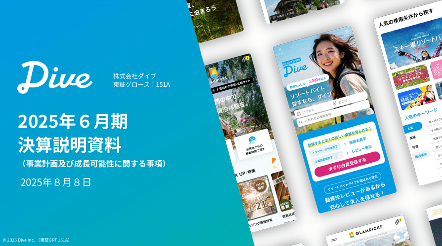
*株式会社ダイブのパワポの表紙スライド*

> 引用元：[> 2025年6月期 通期決算説明資料（事業計画及び成長可能性に関する事項）](https://ssl4.eir-parts.net/doc/151A/tdnet/2671665/00.pdf)

*https://dive.design/ir/library/presentation*

### 写真の画像が背景のおしゃれなパワポ表紙

ローランド株式会社の2026年12月期－2028年12月期 中期経営計画説明資料におけるパワポの表紙スライドです。
パワポの表紙の背景に、ローランド社の商品が使われているライブ写真の画像を用いた、おしゃれなデザインとなっています。パワポの表紙に写真の画像を使う場合、全体に画像を使ってタイトルを重ねる場合と、タイトル部分には画像を重ねない場合がありますが、ローランドは全体に写真の画像を使っていますね。

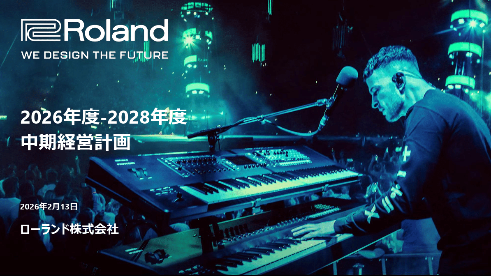
*ローランド株式会社のパワポの表紙スライド*

> 引用元：[> 2026年12月期－2028年12月期 中期経営計画説明資料](https://ir.roland.com/ja/ir/news/news3789159793319840105/main/0/link/MTP_2026-2028_J.pdf)

*https://ir.roland.com/ja/ir/news.html*

### イメージ画像が背景のおしゃれパワポ表紙

株式会社アストロスケールホールディングスの2025年4月期下期 事業説明会資料におけるパワポの表紙スライドです。
パワポの表紙の背景に、宇宙をイメージした画像を入れたデザインとなっています。ローランド同様、パワポの表紙の背景全体に画像を入れています。

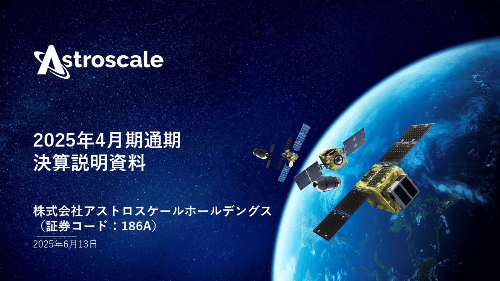
*株式会社アストロスケールホールディングスのパワポ表紙スライド*

> 引用元：[> 2025年4月期下期 事業説明会資料](https://contents.xj-storage.jp/xcontents/AS82438/7acb88c3/fccf/4f4f/86f8/c5d388e39b49/20250127004923959s.pdf)

*https://www.astroscale.com/ja/ir/news?category=presentations*

### タイトルが写真下のおしゃれなパワポ表紙

株式会社ブッキングリゾートの事業計画及び成長可能性に関する事項におけるパワポの表紙スライドです。
パワポの表紙の背景に、プール付きのロッジ写真のおしゃれな画像が使われています。表紙スライド全体に写真の画像を使うのでなく、タイトルやロゴは下に青色背景で入れるデザインです。

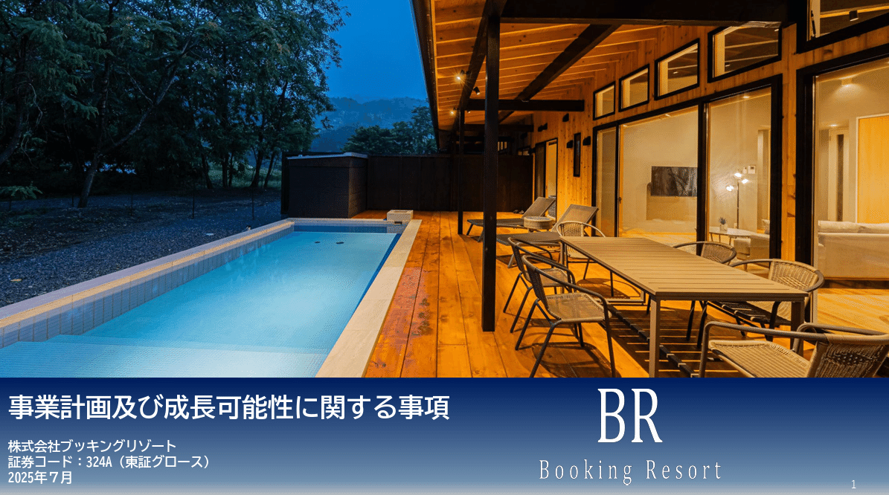
*株式会社ブッキングリゾートのパワポの表紙スライド*

> 引用元：[> 事業計画及び成長可能性に関する事項](https://contents.xj-storage.jp/xcontents/AS83144/93e6a241/395c/42fb/ab35/e81f15c55c97/140120250731525568.pdf)

*https://www.booking-resort.jp/ir_news/*

### 背景が商品画像のおしゃれなパワポ表紙

株式会社ブラスの2025年7月期決算補足説明資料におけるパワポの表紙スライドです。
パワポの表紙の背景に、自社が実際に持っている結婚式場の写真を使うデザインです。結婚式場の写真をメインとし、タイトルは透明な白ベースのボックスを真ん中にもってきていますが、左上に「顧客満足度ランキング ハウスウェディング総合ウェディングプランナーNo.1」を入れるなど、自社の魅力もしっかりと伝えるデザインです。

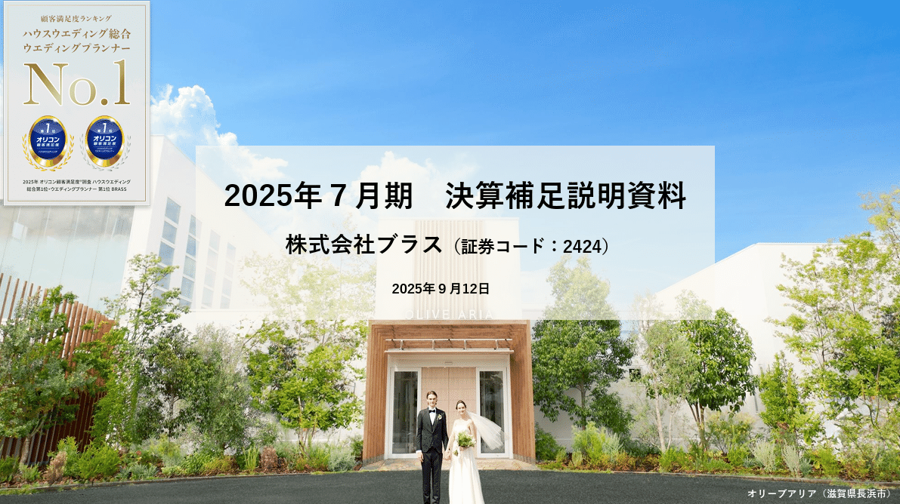
*株式会社ブラスのパワポ表紙スライド*

> 引用元：[> 2025年7月期　決算補足説明資料](https://ssl4.eir-parts.net/doc/2424/ir_material_for_fiscal_ym2/187111/00.pdf)

*https://brass.ne.jp/corporate/ir/material.html*

## デザインがかっこいいパワポ表紙スライド例

次はオリジナルの背景デザインを使ったかっこいいパワポの表紙スライドの例を見ていきましょう。
今度は逆に、**事業イメージが湧きにくい場合に有効なデザイン**となっています。創薬ベンチャーやAIベンチャーと相性が良いです。
ポイントは事業内容を連想させるようなデザインとしつつ、**他社と被らないようにオリジナリティを出していく**ことです。コーポレートカラーとの連動も効果的なほか、文字色に関する工夫も、全体に合わせたり白抜きしたりとデザインも様々なので、意識的に見てみてください。

### 蛍光色を活かしたかっこいいパワポ表紙

インフォメティス株式会社の2025年12月期決算説明資料におけるパワポの表紙スライドです。
パワポの表紙の背景を黒色にし、蛍光色の黄緑色を合わせたかっこいいデザインの表紙スライドとなっています。未来感のあるデザインでありながら、光が灯る様な温かみも感じられるデザインです。右にENERGY × AI × LIFEという文字が蛍光色の黄緑色で入っているのもかっこいいですね。

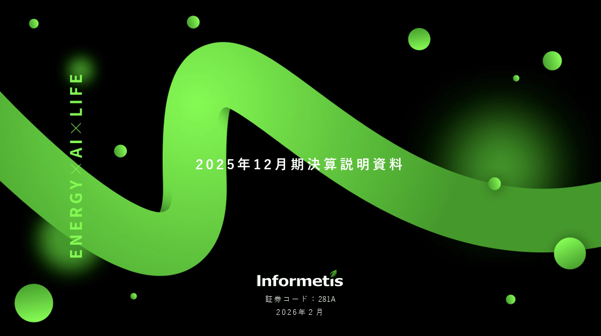
*インフォメティス株式会社のパワポ表紙スライド*

> 引用元：[> 2025年12月期決算説明資料](https://contents.xj-storage.jp/xcontents/AS04931a/b5e9a74f/147c/43b3/aaa4/c61ffbe79533/140120260217564060.pdf)

*https://www.informetis.com/ir/news/*

### 真紅色が映えるかっこいいパワポ表紙

株式会社カウリスの2025年12月期　通期決算説明資料におけるパワポの表紙スライドです。
パワポの表紙の背景を黒色にし、深紅色を合わせたかっこいいデザインの表紙スライドとなっています。右側は人などのアイコンが複数の線でつながっており、インターネットセキュリティ事業をイメージさせるデザインとなっています。

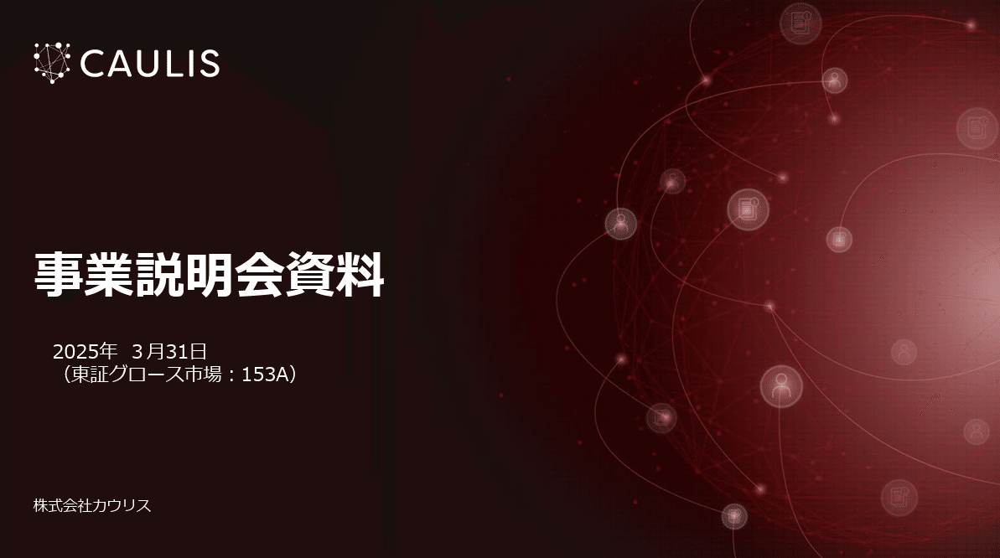
*株式会社カウリスのパワポの表紙スライド*

> 引用元：[> 2025年12月期　通期決算説明資料](https://ssl4.eir-parts.net/doc/153A/tdnet/2761525/00.pdf)

*https://caulis.jp/ir/library-presentation/*

### 写真の使い方がかっこいいパワポ表紙

ミーク株式会社の2025年3月期第4四半期決算説明資料におけるパワポの表紙スライドです。
上下に分かれたシンプルなパワポの表紙スライドかと思いきや、右側に窓のような形で写真を入れこんだカッコいいデザインの表紙スライドです。

*ミーク株式会社のパワポの表紙スライド*

> 引用元：[> 2025年3月期第4四半期決算説明資料](https://ssl4.eir-parts.net/doc/332A/tdnet/2618350/00.pdf)

*https://www.meeq.com/ir/library/presentation/*

### 写真とイラストのかっこいいパワポ表紙

デジタルグリッド株式会社の事業計画及び成長可能性に関する事項におけるパワポの表紙スライドです。
パワポの表紙の右側に、同心円のデザインのイラストと、風力発電や太陽光発電の写真の画像を合わせています。表紙スライドのタイトルは右側で、少しだけイラストに重ねることで全体のデザインの調和を取っています。

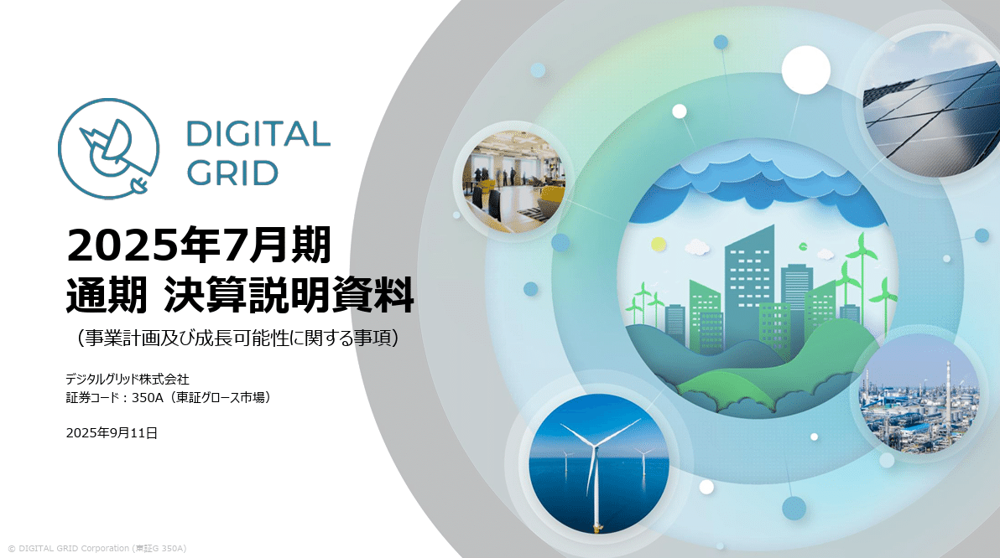
*デジタルグリッド株式会社のパワポ表紙スライド*

> 引用元：[> 2025年7月期通期_決算説明資料（事業計画及び成長可能性に関する事項）](https://ssl4.eir-parts.net/doc/350A/tdnet/2686461/00.pdf)

*https://www.digitalgrid.com/ir/news/*

### イラストを合わせたかっこいいパワポ表紙

株式会社タウンズの2025年6月期 決算説明資料におけるパワポの表紙スライドです。
パワポの表紙の背景に、バイオやヘルスケアに関するイラストが帯のように入っているデザインとなっています。パワポの表紙のタイトルが真ん中に入っていますが、タイトルの背景も薬品のようなデザインになっており、事業内容が伝わるかっこいい表紙スライドといえますね。

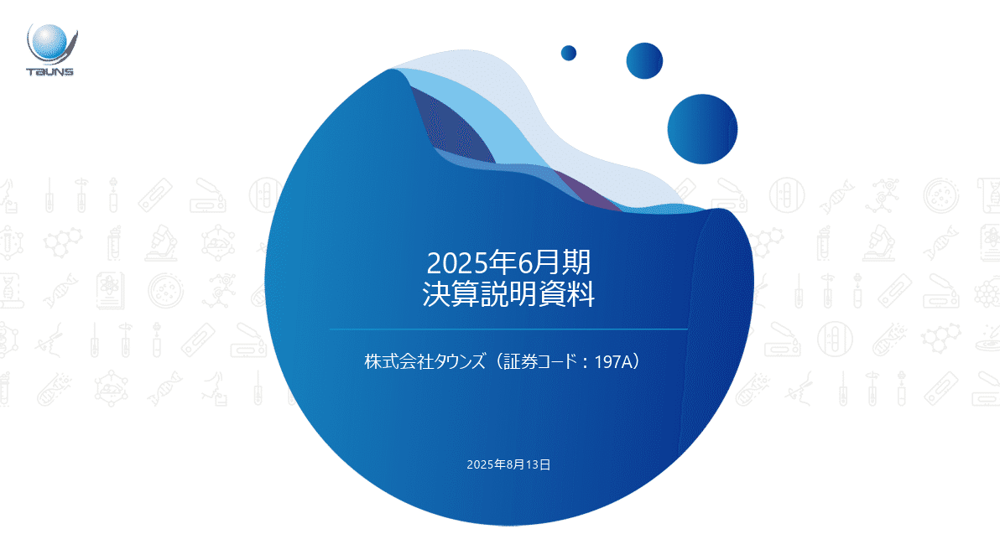
> 引用元：[> 2025年6月期 決算説明資料](https://ssl4.eir-parts.net/doc/197A/ir_material_for_fiscal_ym/185160/00.pdf)

*https://www.tauns.co.jp/investors/library/presentations/*

## イラストがかわいいパワポ表紙スライド例

次はイラストを使ったパワポの表紙スライドを見ていきましょう。
イラストを使うことで、表紙スライドにポップで温かみのある印象を与えることができます。**聞き手になじみのある事業の場合や、人にやさしい事業の場合**などと相性が良いです。
ポイントは、デザインを重視しつつ、事業内容がきちんと連想できるようにすることです。**さりげなくサービスイメージを盛り込む、背景に入れるなど**、いろいろな工夫が見えます。

### コンセプトが伝わるかわいいパワポ表紙

株式会社Noteの事業計画及び成長可能性に関する事項におけるパワポの表紙スライドです。
パワポの表紙のイラストは「インターネット上の街」というnoteのビジネスコンセプトを表現しています。noteの目指す世界観をデザインに落としており、おしゃれでかわいいデザインとなっています。

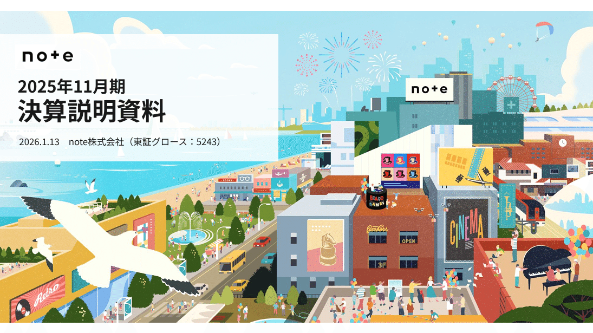
*note株式会社のパワポ表紙スライド*

> 引用元：[> 事業計画及び成長可能性に関する事項](https://contents.xj-storage.jp/xcontents/AS05592/70fe228d/70f4/43e7/aa8a/4ce605b55967/140120260227570258.pdf)

*https://ir.note.jp/library*

### 目指す姿が伝わるかわいいパワポ表紙

株式会社ミライロの事業計画及び成長可能性に関する事項におけるパワポの表紙スライドです。
パワポの表紙のイラストはミライロIDを核としたプラットフォームをイメージしたデザインとなっており、ミライロのビジネスが目指す世界を表現しています。ユニバーサルな世界をイラストで表現した、おしゃれでかわいいデザインとなっています。

*株式会社ミライロのパワポ表紙スライド*

> 引用元：[> 事業計画及び成長可能性に関する事項](https://ssl4.eir-parts.net/doc/335A/tdnet/2583569/00.pdf)

*https://www.mirairo.co.jp/ir/news*

### 柔らかいイラストのかわいいパワポ表紙

株式会社Schooの事業計画及び成長可能性に関する事項におけるパワポの表紙スライドです。
パワポの表紙のイラストはSchooのロゴを中心に「学び続ける人」をイメージしたイラストを合わせたデザインとなっています。パワポの表紙の背景は光を浴びるような温かみのあるデザインとなっているほか、イラストとタイトルの境界線も柔らかい曲線となっており、おしゃれでかわいいデザインとなっています。

*株式会社Schooのパワポ表紙スライド*

> 引用元：[> 2025年9月期通期 決算説明資料 事業計画及び成長可能性に関する事項](https://ssl4.eir-parts.net/doc/264A/tdnet/2719649/00.pdf)

*https://corp.schoo.jp/ir/news/*

### 背景のイラストがかわいいパワポ表紙

ラクサス・テクノロジー株式会社の2025年3月期 決算説明資料におけるパワポの表紙スライドです。
パワポの表紙の背景に、ラクサステクノロジーのビジネスであるバッグレンタルのイラストが規則的に並んでいます。バックのイラストをそのまま並べると色が多くわかりづらいので、その上にベージュのカバーをかけることで、見やすくてかわいいデザインとなっています。

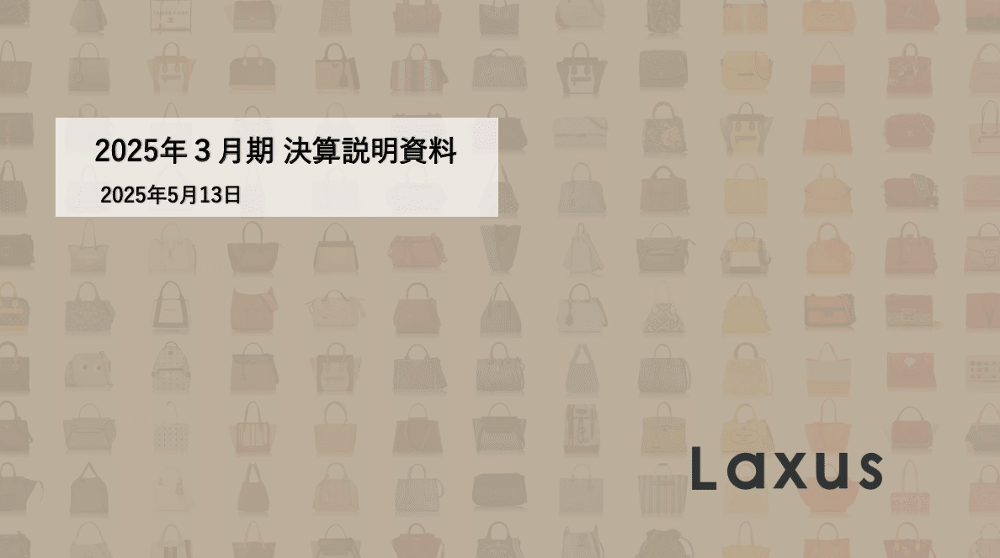
*ラクサス・テクノロジー株式会社のパワポ表紙スライド*

> 引用元：[> 2025年3月期 決算説明資料](https://ssl4.eir-parts.net/doc/288A/tdnet/2611558/00.pdf)

*https://corp.laxus.co/ir/library/presentation*

### ゆるめのイラストがかわいいパワポ表紙

株式会社カヤックの事業計画及び成長可能性に関する事項におけるパワポの表紙スライドです。
パワポの表紙の背景には、ゆるめのイラストが規則的に並んでいます。表紙スライドの真ん中にはロゴと社名があり、右下には人を模したこちらも緩めのイラストが入っています。フォントも含め、オリジナリティの高い、かわいいデザインです。

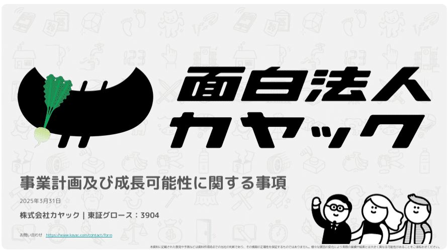
*株式会社カヤックのパワポ表紙スライド*

> 引用元：[> 事業計画及び成長可能性に関する事項](https://contents.xj-storage.jp/xcontents/AS01527/2ef71bff/4a5f/4523/9489/7f4b9a02183b/140120250327501647.pdf)

*https://www.kayac.com/en/ir/news*

## シンプルでおしゃれなパワポ表紙スライド例

次は写真の画像やイラストを使わずにコーポレートカラーやロゴをメインに使ったパワポの表紙スライドです。
事業内容を選ばず、どんな企業でも使えるデザインのため、IR資料においてもよく使われています。逆に言うと何でもありなので、**このパターンの場合はデザイナーを入れるのも手**といえます。

### 白地のシンプルでおしゃれなパワポ表紙

雪印メグミルク株式会社の雪印メグミルクグループ経営計画「Next Design2030」説明会資料におけるパワポの表紙スライドです。
上下の帯と文字以外は一切色を使わず、シンプルでおしゃれに仕上げたデザインですね。帯も文字も雪印メグミルクのコーポレートカラーの青色を使っていますが、グラデーションでおしゃれな仕上がりになっています。雪印の場合、雪が白なので、表紙スライドの背景を白色のままにしているのもあえてのデザインとみて間違いないでしょう。

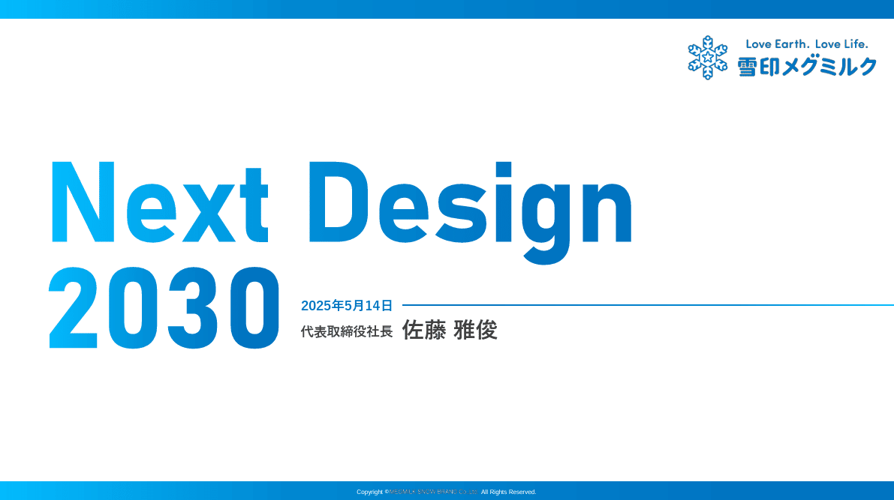
*雪印メグミルク株式会社のパワポの表紙スライド*

> 引用元：[> 雪印メグミルクグループ経営計画「Next Design2030」説明会資料](https://contents.xj-storage.jp/xcontents/AS08619/a9b41d9b/eaf5/40e3/831c/ce9646e82c7c/20250514081918914s.pdf)

*https://www.meg-snow.com/ir/library/presentation/*

### ロゴ色のシンプルでおしゃれなパワポ表紙

株式会社タイミーの事業計画及び成長可能性に関する事項におけるパワポの表紙スライドです。
黄色の背景とタイトルのみで、写真やイラストは使っていませんが、シンプルでおしゃれなパワポの表紙スライドとなっています。一本線を入れて円形のグラデーションにしていますが、その部分が曲がり角にも見えるおしゃれなデザインです。

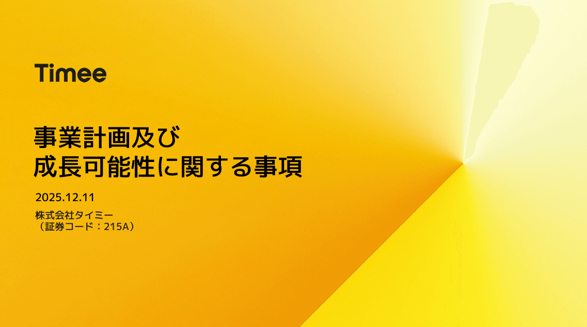
*株式会社タイミーのパワポ表紙スライド*

> 引用元：[> 事業計画及び成長可能性に関する事項](https://contents.xj-storage.jp/xcontents/AS05113/edac4ae8/c8d8/4d42/ae51/e2d031c7c2ff/140120251211518011.pdf)

*https://corp.timee.co.jp/ir/*

### 白文字のシンプルでおしゃれなパワポ表紙

株式会社ABEJAの2025年8月期決算説明資料におけるパワポの表紙スライドです。
ロゴとタイトルのみのパワポの表紙スライドですが、ロゴや白文字が映える濃紺を背景に持ってくることで、シンプルながらおしゃれなパワポの表紙スライドとなっています。

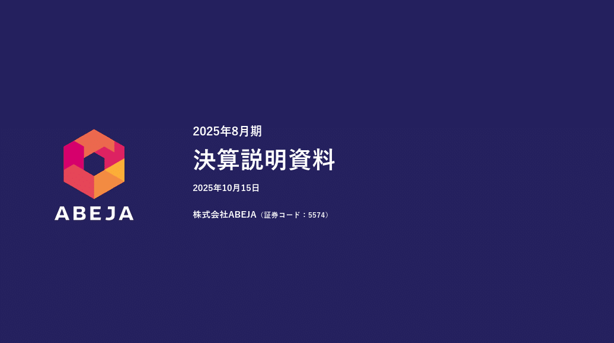
*株式会社ABEJAのパワポ表紙スライド*

> 引用元：[> 2025年8月期　決算説明資料](https://ssl4.eir-parts.net/doc/5574/tdnet/2698143/00.pdf)

*https://www.abejainc.com/ir-presentation*

### ロゴ色を活かしたおしゃれなパワポ表紙

株式会社リンクアンドモチベーションの2025年12月期 決算説明会におけるパワポの表紙スライドです。
ロゴ色のピンク色を活かすべく、色なじみの良いグレーをベースにタイトルとデザインの色をピンク色で統一し、シンプルでおしゃれなパワポの表紙スライドに仕上げています。

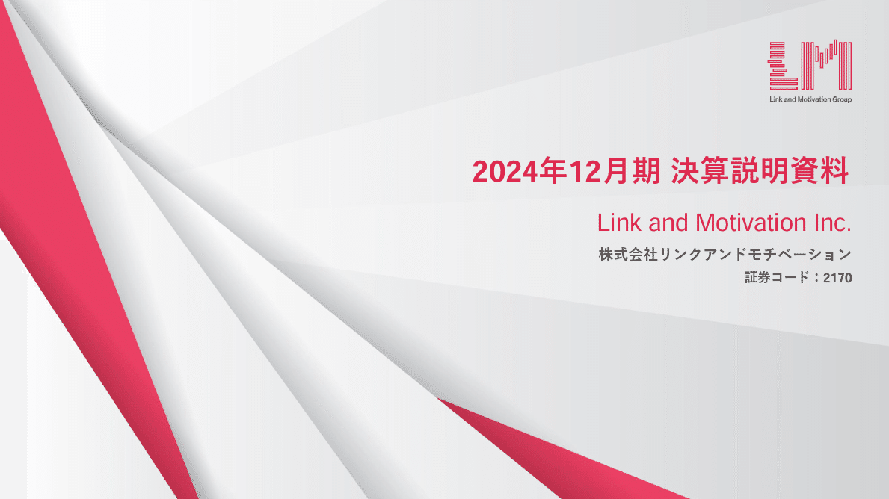
*株式会社リンクアンドモチベーションのパワポ表紙スライド*

> 引用元： [> 2025年12月期 決算説明会 スライド](https://ssl4.eir-parts.net/doc/2170/ir_material_for_fiscal_ym/198130/00.pdf)

*https://www.lmi.ne.jp/ir/*

### ロゴ色を反転させたおしゃれなパワポ表紙

株式会社U-NEXT HOLDINGSの2025年8月期決算説明資料におけるパワポの表紙スライドです。
通常のロゴに使っている黒と水色を反転させ、背景を黒色にし文字を白と水色で構成するというテクニックを使っています。結果としてロゴを中心にしつつ色数を絞ることができ、シンプルでおしゃれなパワポの表紙スライドに仕上がっています。

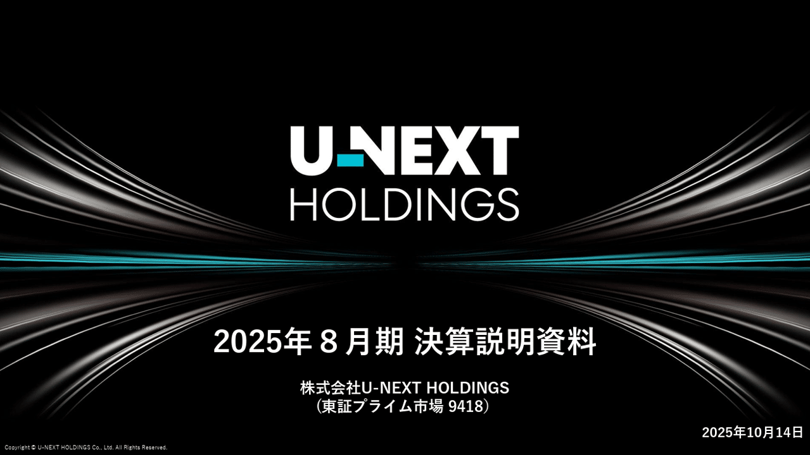
*株式会社U-NEXT HOLDINGSのパワポ表紙スライド*

> 引用元：[> 2025年8月期　通期決算説明資料](https://ssl4.eir-parts.net/doc/9418/ir_material_for_fiscal_ym5/188477/00.pdf)

*https://unext-hd.co.jp/ir/news.html*

## ビジネスの理念が伝わるパワポ表紙５選

次はパワポの表紙スライドにミッションやメッセージを入れ込む事例です。
ビジョンドリブンな企業の場合や、先進的な領域に取り組んでいる場合に有効なデザインです。
ポイントは**ミッションやメッセージの配置と、メッセージに合う背景の選択**です。特にメッセージは一番見やすい左上にもってくる、背景に持ってくる、右側に持ってくる、ロゴに合わせるなど様々なデザイン例がありますです。

### 背景がビジネスのビジョンのパワポ表紙

マテリアルグループ株式会社の中期経営計画におけるパワポの表紙スライドです。
赤色ベースのパワポの表紙の背景に「Switch to Red すべての個性に情熱を灯せ」というビジネスのビジョンが記載されています。ビジョンの文言と表紙スライドの背景色の赤がリンクしており、かっこいいパワポの表紙スライドとなっています。

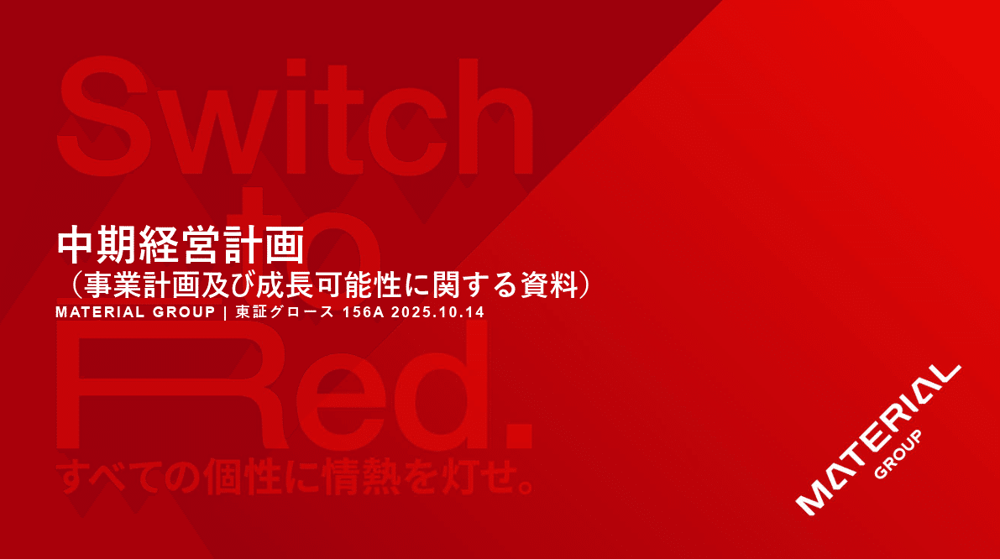
*マテリアルグループ株式会社のパワポ表紙スライド*

> 引用元：[> 事業計画及び成長可能性に関する事項](https://ssl4.eir-parts.net/doc/156A/ir_material3/248892/00.pdf)

*https://materialgroup.jp/ir/*

### ビジネスのミッションを添えたパワポ表紙

Sansan株式会社の2025年5月期 決算説明資料におけるパワポの表紙スライドです。
Sansanのイメージの石像が握手しているイラストに、ビジネス上のミッションを軽く添えてあるデザインです。青色ベースの背景に対してSansanのSの様なカーブを使っている点や石像の影がある点など作りが細かく、おしゃれなデザインとなっています。

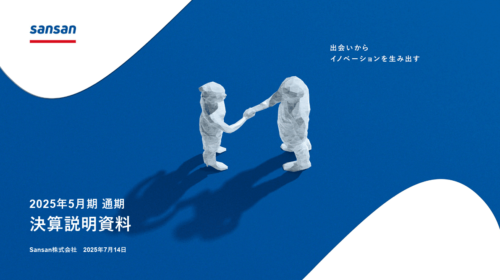
*Sansan株式会社のパワポ表紙スライド*

> 引用元：[> 決算説明資料](https://data.swcms.net/file/corp-sansan-ir/dam/jcr:6b9509c2-7708-4fef-bacf-9ebb56def1d7/140120250714513500.pdf)

*https://ir.corp-sansan.com/ja/ir/library/presentation.html*

### ビジネスメッセージが中心のパワポ表紙

Appier Group 株式会社の2024年12月期通期 決算説明資料におけるパワポの表紙スライドです。
「MAKING AI EASY BY MAKING SOFTWARE INTELLIGENT」というビジネスのメッセージが表紙スライドの核になっており、それに合わせたおしゃれなイラストが表紙スライドの背景として合わせられています。

*Appier Group 株式会社のパワポ表紙スライド*

> 引用元：[> 2024年12月期通期 決算説明資料](https://ssl4.eir-parts.net/doc/4180/tdnet/2569687/00.pdf)

*https://www.appier.com/ja-jp/ir-news*

### 理念がイラストに入っているパワポ表紙

株式会社ぐるなびの決算説明会資料におけるパワポの表紙スライドです。
「職でつな額。人を満たす」というビジネスのメッセージが、表紙スライド右のイラストの中に盛り込まれています。ビジネスのメッセージを入れても仰々しくならないよう、割とラフなイラストに合わせ込んでおり、B2Cならではの工夫がみられるパワポの表紙スライドといえるでしょう。

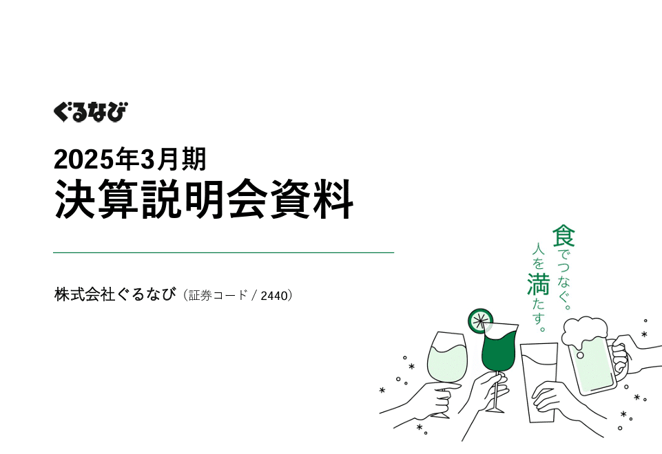
*株式会社ぐるなびのパワポ表紙スライド*

> 引用元：[> 決算説明会資料](https://ssl4.eir-parts.net/doc/2440/tdnet/2606923/00.pdf)

*https://corporate.gnavi.co.jp/ir/library/presentation/*

### ビジネス理念とおしゃれ写真のパワポ表紙

株式会社リップスの2025年8月期 決算説明資料 （事業計画及び成長可能性に関する事項）におけるパワポの表紙スライドです。
パワポの表紙の中心にビジネスの経営理念があり、背景には写真の画像が合わせられています。パワポの表紙の背景の写真は、一見無造作に置かれているように見えますが、よく見ると」LIPPS」の文字が窓の様に切り抜かれているデザインで、おしゃれなパワポの表紙スライドとなっています。

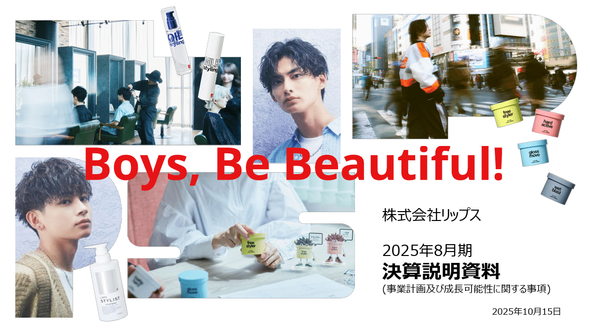
*株式会社リップスのパワポ表紙スライド*

> 引用元：[> 2025年8月期 決算説明資料 （事業計画及び成長可能性に関する事項）](https://contents.xj-storage.jp/xcontents/AS83314/01e25629/8f3d/43c7/b864/caa7fe055679/140120251015573538.pdf)

*https://lipps.co.jp/ir/news/*

## 特徴的なデザインのパワポ表紙スライド例

最後に特徴的なデザインのパワポ表紙スライド例をお見せします。
マネしようと思っても難しいデザインのパワポの表紙スライドもあるので、あくまでおまけ程度で見てみてください。

### デザイン会社のおしゃれなパワポ表紙

株式会社グッドパッチの2025年８月期 通期決算説明資料におけるパワポの表紙スライドです。
背景のデザインがおしゃれなパワポの表紙スライドですが、実は背景のデザインは毎四半期ごとに異なっています。またパワポの後半には解説のスライドもあり、2025年８月期 通期決算説明資料では”DRIVE 180°"というコンセプトでパワポの表紙スライドがデザインされたことがわかります。

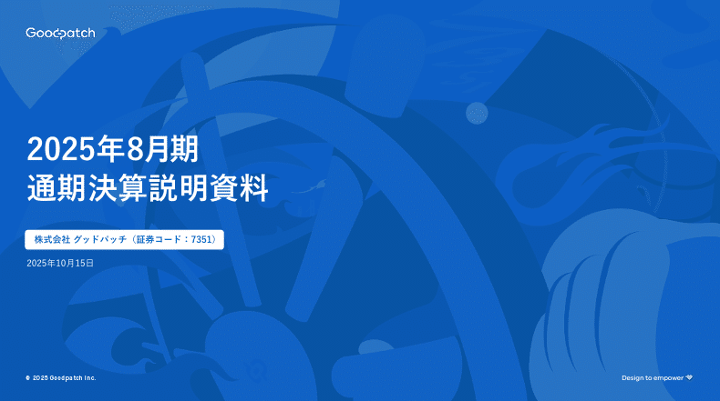
*株式会社グッドパッチのパワポ表紙スライド*

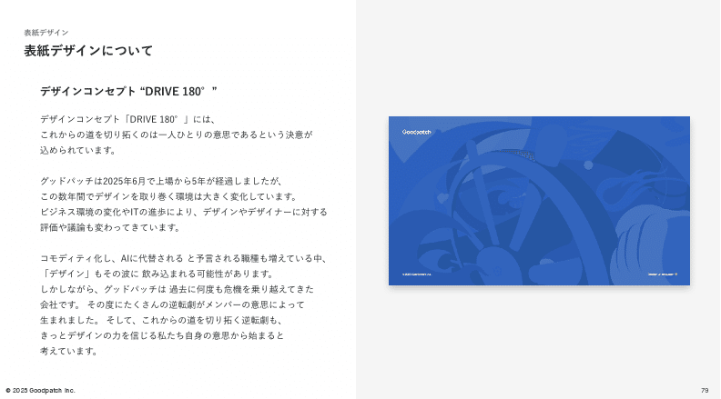
*株式会社グッドパッチのパワポ表紙スライドの解説*

> 引用元：[> 2025年８月期 通期決算説明資料](https://contents.xj-storage.jp/xcontents/AS04618/30ba49e0/124b/4772/828d/3e3b8b3ef180/20251016131652962s.pdf)

*https://goodpatch.com/ir/presentation*

### 人材会社のおしゃれなパワポ表紙

株式会社パソナグループの2025年5月期 通期決算説明資料におけるパワポの表紙スライドです。
絵画の様なおしゃれなパワポの表紙スライドですが、実はパソナの子会社である「パソナハートフル」のアーティストのデザインとなっています。グループで障害者アーティストの支援を行っているからこそ可能な、かっこいいパワポ表紙スライドといえますね。

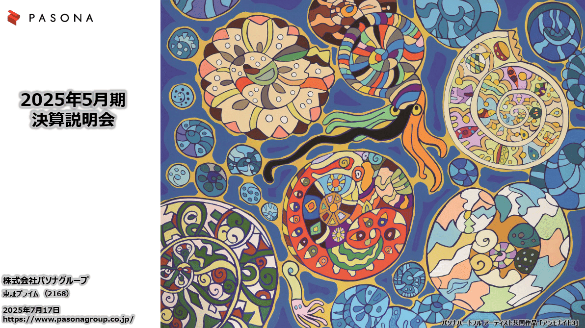
*株式会社パソナグループのパワポ表紙スライド*

> 引用元：[> 説明会：資料](https://www.pasonagroup.co.jp/Portals/0/resources/ir/data/presentation/FY2024Q4_presentation_0717.pdf)

*https://www.pasonagroup.co.jp/ir/library/presentation.html*

### キャラクター会社のおしゃれなパワポ表紙

株式会社colyの2025年5月期 通期決算説明資料におけるパワポの表紙スライドです。
パワポの表紙スライド全体に、コーポレートロゴとＩＰを合わせたロゴが散在しているおしゃれなデザインとなっています。たくさんのＩＰを保有しているだけでなく、それの見せ方がうまい、おしゃれなパワポ表紙スライドといえます。

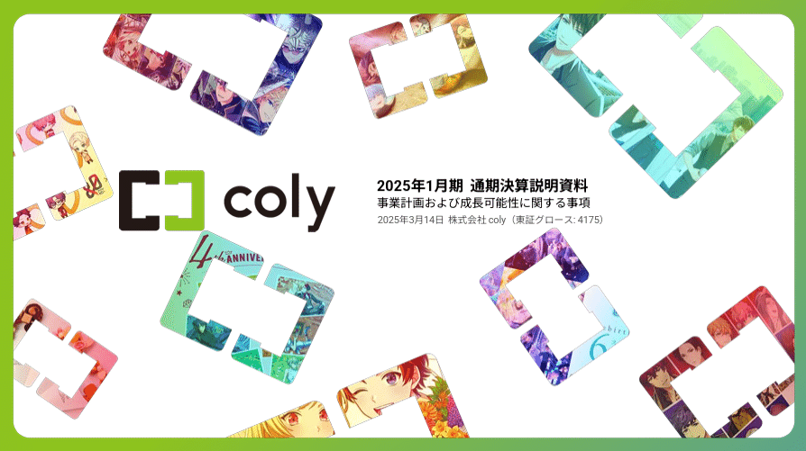
*株式会社colyのパワポ表紙スライド*

> 引用元：[> 2026年1月期 通期 決算説明資料(事業計画及び成長可能性に関する事項)](https://contents.xj-storage.jp/xcontents/AS04659/b8f1b292/9170/4f0b/b75b/4597de4597f8/20260313153743895s.pdf)

*https://colyinc.com/ir/*

### 文房具会社のおしゃれなパワポ表紙

三菱鉛筆株式会社の2025年12月期 決算補足説明資料におけるおしゃれなパワポの表紙スライドです。
パワポの表紙スライド全体を広場に見立て、たくさんの筆記用具を立てていますが、その影が筆記用具ではなく一つひとつ異なる人の影になっているというデザインです。アイデアの勝利という感じですが、面白いアイデアなので覚えておいてもいでしょう。

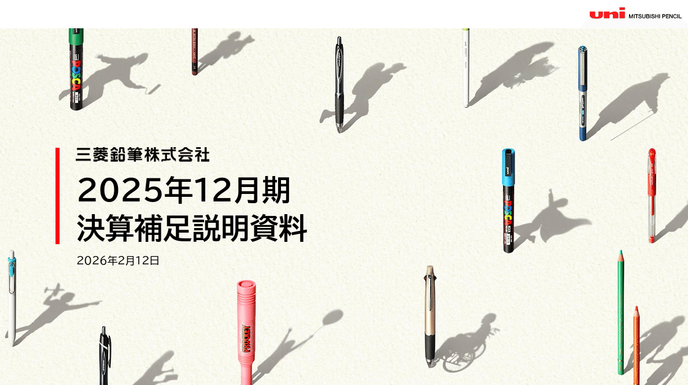
*三菱鉛筆株式会社のパワポ表紙スライド*

> 引用元：[> 三菱鉛筆_2025年12月期 決算補足説明資料](https://ssl4.eir-parts.net/doc/7976/tdnet/2756975/00.pdf)

*https://www.mpuni.co.jp/ir/finance/index.html*

### ２枚で完結するおしゃれなパワポ表紙

最後は株式会社True Dataの決算説明資料（事業計画及び成長可能性に関する事項）におけるおしゃれなパワポの表紙スライドです。
２枚組で完結するデザインはビジネスのパワポでも取り入れられるようになっており、かっこいいパワポの表紙スライドを作る時におススメのテクニックです。LENZ & Coが好んで使うデザインでもありますね。

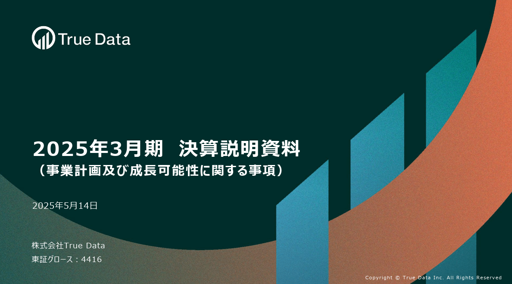
*株式会社True Dataのパワポ表紙スライド*

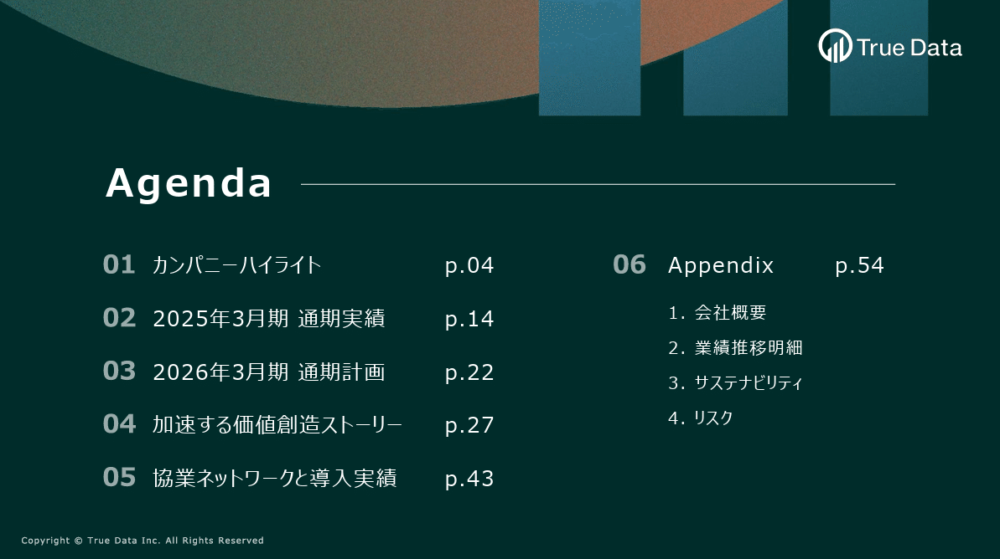
*株式会社True Dataの表紙スライドの次のスライド*

> 引用元：[> 決算説明資料（事業計画及び成長可能性に関する事項）](https://contents.xj-storage.jp/xcontents/AS02849/1fd20b36/5516/454f/aa1d/02d004cb5114/140120250513545549.pdf)

*https://www.truedata.co.jp/ir/presentations/*

## 【マネしたい】おしゃれなパワポの表紙スライド３０選

いかがでしたでしょうか。最初にお伝えした通り、パワポの表紙スライドに正解は無いので、色々な表紙スライド例を見ながら良いものを取り入れていくのが一番です。なお真似すると今一つ、という例もあります。ここで挙げるのは憚られるので、以下に特徴だけ列挙しておきます。

> ・そもそも文字が見づらい
> ・スペース（空白）が余り過ぎている
> ・事業や決算そのものと関係がない画像（従業員の集合写真等）
> ・画像が粗い
> ・日付など、必要な情報が不足している

なおパワポ研では、パワポの表紙スライドにおける「タイトル」に絞ったNoteも公開していますので、気になる方は是非見てみてくださいね。

## パワポ研オリジナルテンプレート

パワポ研では、「ビジネスシーンで使える」パワーポイントテンプレートを公開しております。デザインを整えるのみならず、**ロジックやストーリーを整理するのにも役立つパッケージ**になっておりますので、関心のある方は下記ページも併せてご覧ください！

上記の記事のように、noteでは**フォローしているだけでビジネスにおける「資料作成のコツ」と「デザインのセンス」が身に付くアカウント**を目指して情報配信を行っています。
今後もコンスタントに記事を配信しいく予定なので、関心のある方は是非アカウントのフォローをお願いします！

**> Template販売　**[> https://powerpointjp.stores.jp/](https://powerpointjp.stores.jp/%EF%BF%BCnote)
**> note　**[> パワポ研の資料作成術](https://note.com/powerpoint_jp/m/mc291407396da)
**> X（旧Twitter)　**[> https://twitter.com/powerpoint_jp](https://twitter.com/powerpoint_jp)

## レックスアドバイザーズからのお知らせ

パワポ研は株式会社レックスアドバイザーズが運営しています。
レックスアドバイザーズは**経営企画職や経営管理職に特化した転職エージェント**です。
上場企業や上場準備企業を中心に、**経営企画、IR、経理財務、法務、内部監査等の職種の求人**をご紹介しているほか、**CFOなどのコンフィデンシャル求人**もご紹介可能です。
またコンサルティングファームや監査法人、会計事務所の求人も豊富にあるため、プロフェッショナルファームを目指す方のご支援も得意です。
求人紹介やキャリア相談を希望の方は、[**無料転職サポート**](https://www.career-adv.jp/job_search/entryform_exp/)よりサービス利用登録をしてみてください。

*レックスアドバイザーズのサービスサイトはこちら*

**> 求人をご希望の方　**[> 無料転職サポート](https://www.career-adv.jp/job_search/entryform_exp/)**
> 採用支援をご希望の方　**[> 採用サポート](https://www.career-adv.jp/request3/)
**> その他　**[> お問い合わせフォーム](https://www.rex-adv.co.jp/contact)
**> 書籍　**[> 注目企業の実例から学ぶパワポ作成術](https://www.amazon.co.jp/dp/4046060476)

