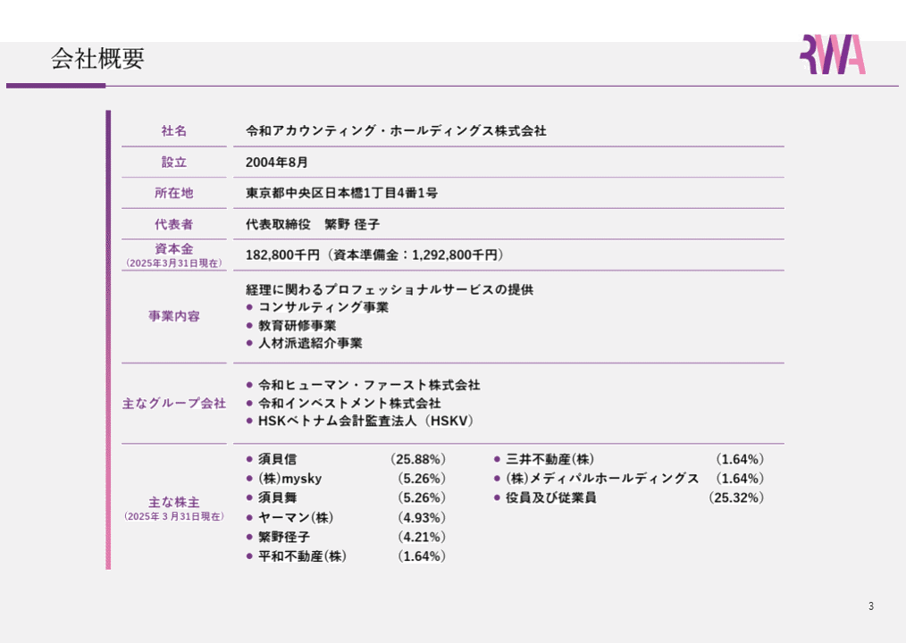
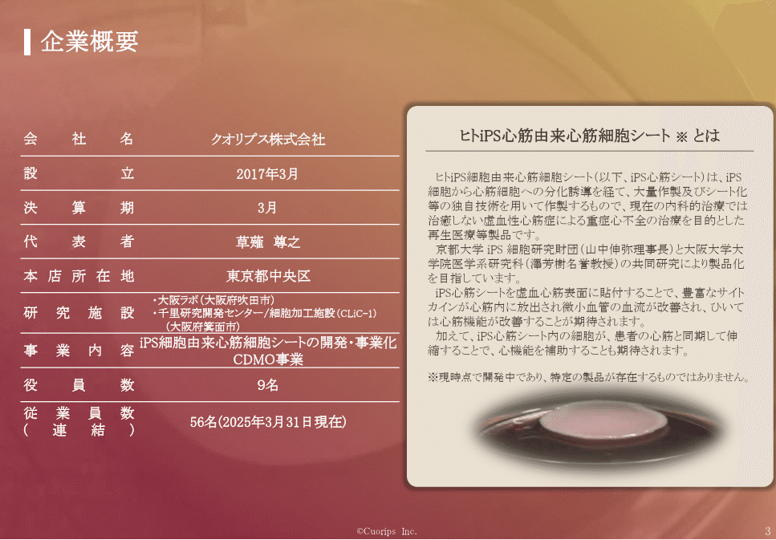
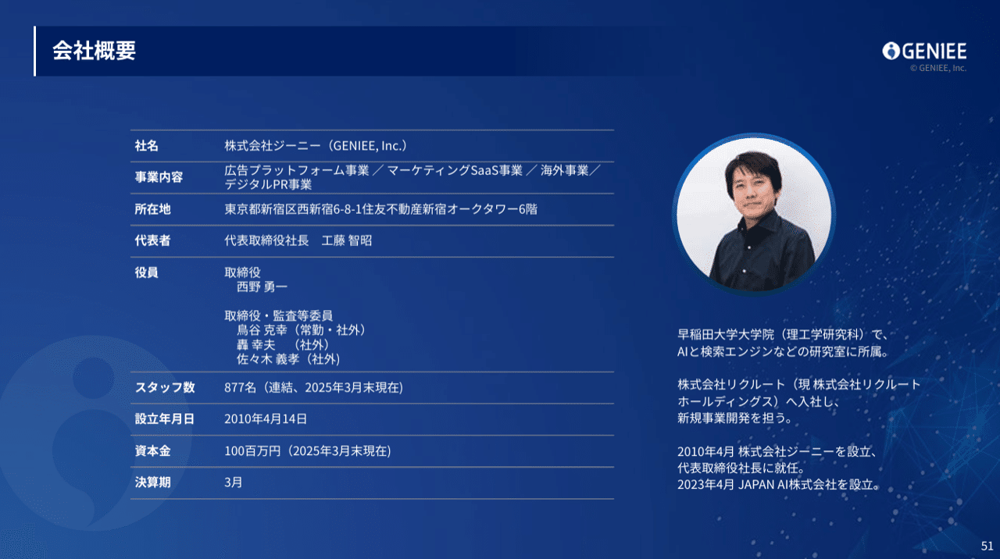
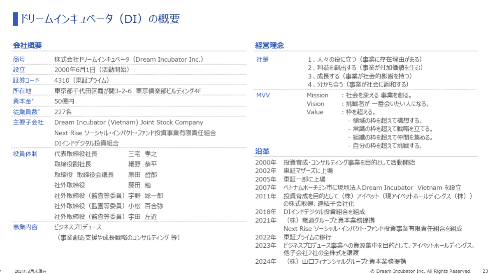
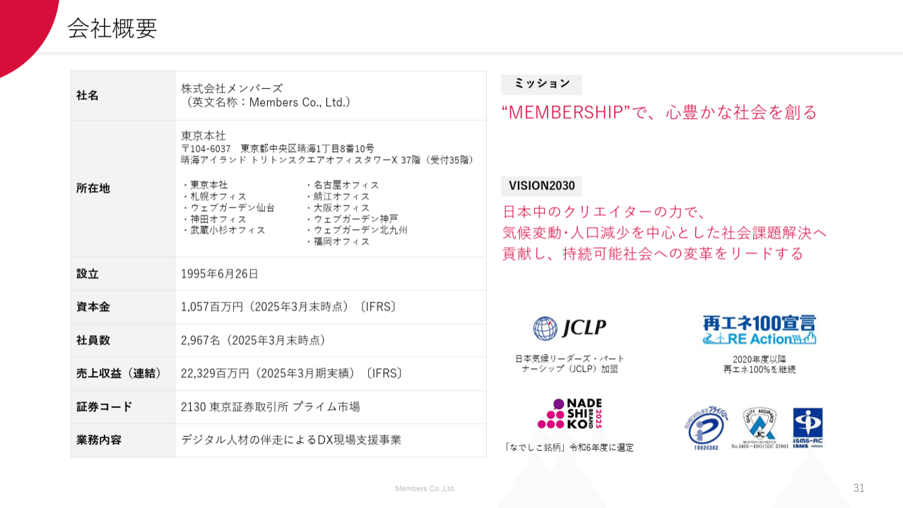
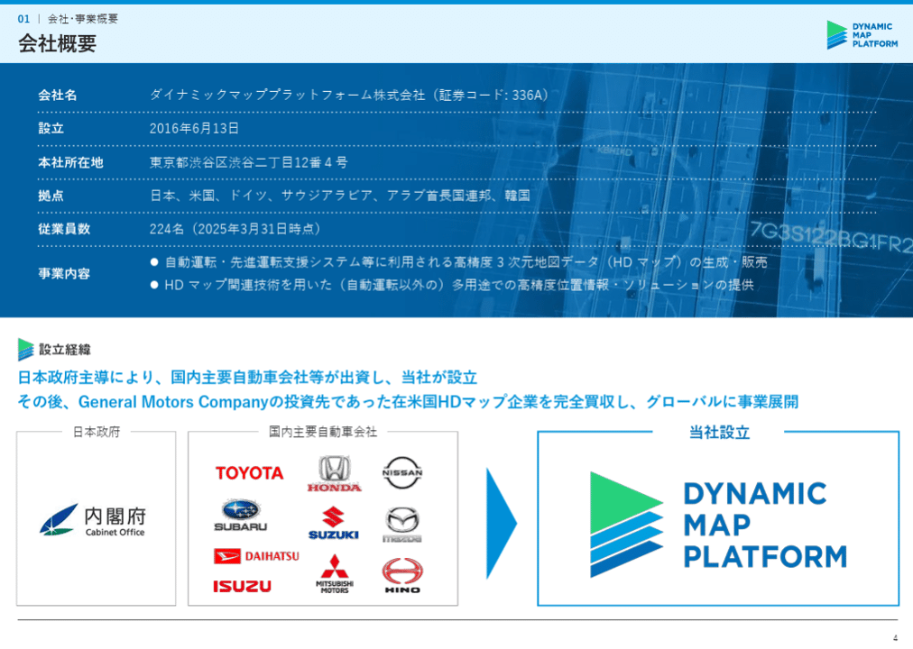
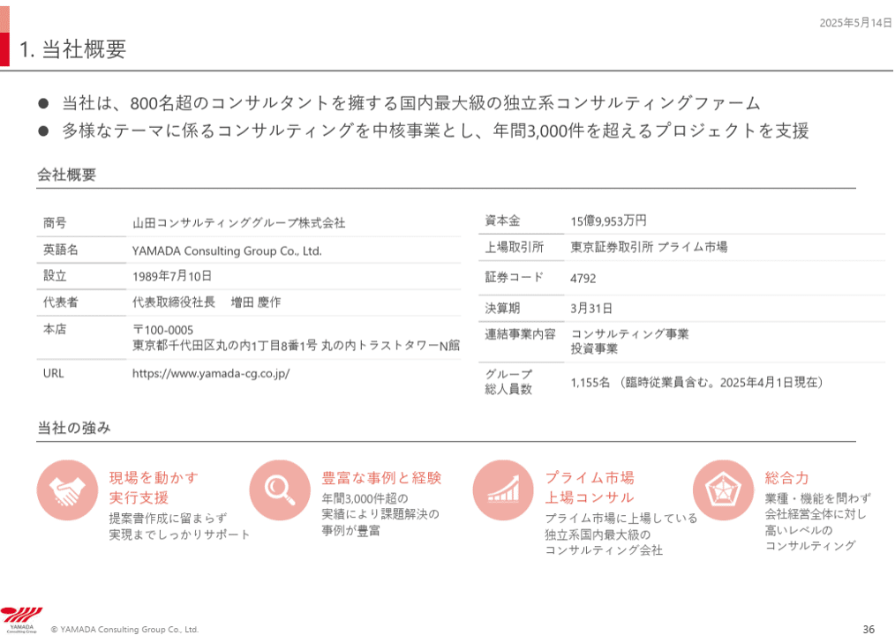
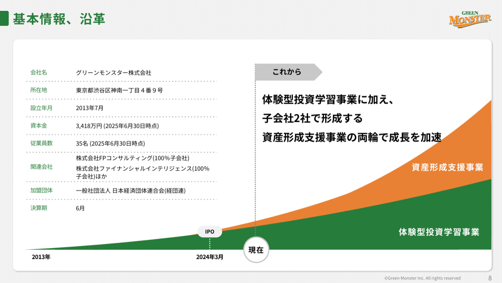

# 【マネしたい】カッコいいパワポの「会社概要」スライド９選 （2025年更新）

[note原文](https://note.com/powerpoint_jp/n/na98a8a3288b8)

みなさんこんにちは。
資料デザインのリサーチや分析に取り組むパワーポイントのスペシャリスト、パワポ研です。

今回は、パワーポイントの**「会社概要」スライドに焦点を当て、上場企業のIR資料から参考になるものを抜粋**して紹介していきます。

会社概要のパワポは、企業の基本情報や特徴を紹介するスライドです。基本情報中心なので読み飛ばされるかと思いきや、**会社の全体感を把握するために、意外とよく見られているスライド**です。
事業概要に加え、創業年や従業員数も、実は読み手にとっては有益な情報です。また基本情報に加えて企業の特徴やミッションなどの紹介をするケースもあり、会社概要スライド１枚で企業の全体像を紹介することが可能です。また、画像でオフィスのイメージも伝えられるので、そのように利用している企業も多いですね。

会社概要スライドは、以前紹介した表スライド同様、いくつかのパターンがあるため、**パワポのパターンをテンプレートとして覚えておくことで、自分がプレゼンテーションを作る際に参考**にできます。

今後こうしたテーマ別記事はどんどん最新資料にアップデートしていく予定ですので、気になる方は下のノートをチェックしてみてくださいね。

それでは早速見ていきましょう。

## カッコいい会社紹介のパワポ見本４選

### シンプルな会社紹介のパワポ事例

まずは令和アカウンティング・ホールディングス株式会社のパワポの会社概要のスライドを見ていきましょう。2025年3月期決算補足説明資料のプレゼン資料にある会社紹介スライドです。

> 引用元：[> 2025年3月期決算補足説明資料](https://ssl4.eir-parts.net/doc/296A/tdnet/2596677/00.pdf)

*https://rw-ah.net/ir/library/presentation/*

テキストのみのシンプルなデザインのスライドです。
コーポレートカラーをグラデーションで使うことで、スタイリッシュでかっこいいデザインになっています。企業の必要情報は網羅されているので、これらから厳選して、紹介したい項目を選択できると思います。**余白の広さや太線の使い方、ロゴの位置、線や文字色の選定が参考に**なるパワポです。

### 補足情報のある会社紹介のパワポ事例

続いてクオリプス株式会社のパワポの会社概要のスライドを見ていきましょう。事業計画及び成長可能性に関する事項のプレゼン資料にある会社紹介スライドです。

> 引用元：[> 事業計画及び成長可能性に関する事項](https://ssl4.eir-parts.net/doc/4894/tdnet/2648833/00.pdf)

*https://cuorips.co.jp/irrelation/irnews/*

左にテキスト、右に事業内容の補足を入れるデザインの会社説明です。
バイオベンチャーなど、**事業内容がわかりづらい企業においては、何をやっているのかが一目でわかることが重要**です。クオリプスはIPS細胞を扱う企業なので、IPS細胞の説明を写真付きで入れることで、すごいことをやっている会社なんだ！ということがわかるようになっています。
ポイントは背景で、事業領域である「生命」を感じさせる赤ベースのデザインです。決してスタイリッシュとは言えないデザインですが、**事業内容と背景や右の写真がマッチしている**からこそ、かっこよく見えるパワポです。

### 創業者情報のある会社紹介のパワポ事例

次は株式会社ジーニーのパワポの会社概要のスライドを見ていきましょう。2025年3月期 決算説明資料のプレゼンにある会社紹介スライドです。

> 引用元：[> 2025年3月期 決算説明資料](https://geniee.co.jp/datas/library_briefing/pdf/020250514234259_68p0.pdf)

*https://geniee.co.jp/ir/library/briefing/*

創業者のプロフィールを載せ投資家に訴求するデザインのスライドです。
構造として難しいスライドではありませんが、創業者が有名人であったり、一定のバックグラウンドを持っていたりする必要があり、このテンプレートの会社紹介をパワポに入れられる企業は限られてきます。
ただ、**背景色を濃い青にしつつ白文字を使ってスタイリッシュに見せている**点や、ロゴの使い方なども、参考になる事例といえるでしょう。

### オフィス画像のある会社紹介のパワポ事例

最後に株式会社グッドパッチのパワポの会社概要のスライドを見ていきましょう。2024年8月期 通期決算説明資料のプレゼンにある会社紹介スライドです。

> 引用元：[> 2024年8月期 通期決算説明資料](https://contents.xj-storage.jp/xcontents/AS04618/22fe3e47/ca7e/482f/a421/0edb53ca8ab0/20241015143845871s.pdf)

*https://goodpatch.com/ir/presentation*

コーポレートカラーを使用しないデザインの珍しいスライドです。
必要最低限の情報に加えて、デザイン企業らしいオフィスの紹介を右側に挿入しています。一見するとそこまで難しい企業概要パワポには見えませんが、自社の象徴としてオフィスの写真を選んで見せている点が特徴的です。
従業員の方がどのような環境で、業務にあたっているのかが見える点は、読み手の会社に対する解像度が高くなりますし、**採用面においてもポジティブな効果がある**会社概要のパワポテンプレートです。

## プレゼン向きの会社紹介のパワポ見本５選

### 情報の網羅性が高い会社紹介のパワポ事例

まずは株式会社ドリームインキュベータのパワポの会社概要のスライドを見ていきましょう。2024年3月期 決算説明会資料のプレゼンにある会社紹介スライドです。

> 引用元：[> 2024年3月期 決算説明会資料](https://www.dreamincubator.co.jp/wp/wp-content/uploads/2024/07/240513-DIIR_4Q_KS3.pdf)

*https://www.dreamincubator.co.jp/news/ir/2024/ir_27376/*

テキストのみ、かつ経営理念や沿革など大量の情報を入れながらも、すっきりと見せているスライドです。
これ１枚で基本情報、経営理念、沿革の説明ができ、企業の紹介を完了ができるパワポとなっているのは、コンサルならではといえますね。
情報量が多くても見やすいのは、横線はあるものの薄くてぎりぎり気にならないレベルであること、文字が等間隔であり違和感なく読み進められることなどによります。**会社を紹介する上で１枚のスライドに情報を詰め込みたい場合に**参考になる事例です。

### MVVを入れた会社紹介のパワポ事例

次は株式会社メンバーズのパワポの会社概要のスライドを見ていきましょう。2025年3月期 決算説明資料のプレゼンにある会社紹介スライドです。

> 引用元：[> 2025年3月期 決算説明資料](https://ssl4.eir-parts.net/doc/2130/tdnet/2614245/00.pdf)

*https://www.members.co.jp/ir/news*

会社の細かな情報よりもミッションとビジョンを前面に押し出したデザインのスライドです。
**会社として達成したいことが明確になっており、逆に色のあるスライドである**と感じます。右側の項目も厳選されているので、十分な情報量があり、かつ企業がミッションに本気であることがわかる取組みのロゴが紹介されている点が優れています。**パーパス経営やミッションビジョンを押し出したい場合に参考にしたい**パワポのテンプレートですね。

### 顧客ロゴを使う会社紹介のパワポ事例

続いてダイナミックマッププラットフォーム株式会社のパワポの会社概要のスライドを見ていきましょう。2025年３月期 決算説明資料のプレゼンにある会社紹介スライドです。

> 引用元：[> 2025年３月期 決算説明資料](https://contents.xj-storage.jp/xcontents/AS05208/cc77ce37/9002/4b71/9a3c/f890bd47588a/140120250514550473.pdf)

*https://www.dynamic-maps.co.jp/ir/presentations/*

会社の最大の特徴である設立経緯、つまり沿革を前面に押し出したデザインのスライドです。
業界大手2社の合併など、沿革に特徴のある企業は多いですが、本企業は内閣府や日系の自動車大手の全面的なバックアップを受けており、**各企業のロゴも紹介できる**ことから、設立経緯を前面に押し出しています。
沿革でなくとも、**強い後ろ盾や、それを証明するロゴ活用などができる場合に参考にしたい**会社概要パワポのテンプレートです。

### 強みを入れた会社紹介のパワポ事例

次は山田コンサルティンググループ株式会社のパワポの会社概要のスライドを見ていきましょう。2025年3月期 決算説明会動画のプレゼンにある会社紹介スライドです。

> 引用元：[> 2025年3月期 決算説明会動画](https://www.net-presentations.com/4792/20250514/fkcy437/)

*https://www.yamada-cg.co.jp/ir/library/briefing_session/*

基本情報と特徴に加え、企業概要スライドにメッセージが入っているデザインのスライドです。
中々他社との差分がわかりづらいコンサルティング業態において、会社概要のページにアイコンとともに企業の強みを紹介することで特徴を印象付けることに成功しています。加えて、サマリーを入れている点も珍しく、目を引くスライドとなっています。**企業概要ページも全体のプレゼンの主要な一要素として説明に使っていきたい場合に参考にしたい**会社概要のパワポテンプレートです。

### グラフを入れた会社紹介のパワポ事例

最後にグリーンモンスター株式会社のパワポの会社概要のスライドを見ていきましょう。2025年6月期 通期決算説明資料（事業計画及び成長可能性に関する事項）のプレゼンにある会社紹介スライドです。

[> 2025年6月期 通期決算説明資料（事業計画及び成長可能性に関する事項）](https://contents.xj-storage.jp/xcontents/AS04869/8f57059a/8b77/4d01/a3a0/7f208f8a43a6/140120250814542608.pdf)

*https://greenmonster.co.jp/ir/*

基本情報と沿革の組み合わせの企業概要パワポは多いですが、企業の沿革を文字ではなくビジュアルで紹介しているデザインがユニークなスライドです。
改めてみるとそこまで難しいことをやっているわけではないのですが、ややもすると見づらくなってしまいそうな構造をすっきりと見せているのは、**左右のバランスや色遣いがうまい**からといえるでしょう。
**企業概要ページで今後の成長に対する期待を持たせたい場合に参考にしたい**パワポの会社概要です。

## カッコいいパワポの「会社概要」スライド９選まとめ

シンプルなパワポスライドから、MVVや強みを合わせるような難易度が高めのパワポスライドまで９つの会社概要スライドを紹介してきました。いくつかの会社紹介スライドはそのままテンプレートとしても使えるスライドなので、是非スライド作成の参考にしてみてくださいね。

また今回のNoteでは会社概要のパワポスライドを紹介してきましたが、事業紹介のパワポスライドを紹介しているNoteもありますので、気になる方は是非読んでみてください。

## パワポ研オリジナルテンプレート

パワポ研では「ビジネスシーンで使える」パワーポイントテンプレートを公開しております。デザインを整えるのみならず、**ロジックやストーリーを整理するのにも役立つパッケージ**になっておりますので、関心のある方は下記ページも併せてご覧ください！

上記の記事のように、noteでは**フォローしているだけでビジネスにおける「資料作成のコツ」と「デザインのセンス」が身に付くアカウント**を目指して情報配信を行っています。
今後もコンスタントに記事を配信しいく予定なので、関心のある方は是非アカウントのフォローをお願いします！

**> Template販売　**[> https://powerpointjp.stores.jp/
](https://powerpointjp.stores.jp/note)**> note　**[> パワポ研の資料作成術](https://note.com/powerpoint_jp/m/mc291407396da)
**> X（旧Twitter)　**[> https://twitter.com/powerpoint_jp](https://twitter.com/powerpoint_jp)

## レックスアドバイザーズからのお知らせ

パワポ研は株式会社レックスアドバイザーズが運営しています。
レックスアドバイザーズは**経営企画職や経営管理職に特化した転職エージェント**です。
上場企業や上場準備企業を中心に、**経営企画、IR、経理財務、法務、内部監査等の職種の求人**をご紹介しているほか、**CFOなどのコンフィデンシャル求人**もご紹介可能です。
またコンサルティングファームや監査法人、会計事務所の求人も豊富にあるため、プロフェッショナルファームを目指す方のご支援も得意です。
求人紹介やキャリア相談を希望の方は、[**無料転職サポート**](https://www.career-adv.jp/job_search/entryform_exp/)よりサービス利用登録をしてみてください。

*レックスアドバイザーズのサービスサイトはこちら*

**> 求人をご希望の方　**[> 無料転職サポート](https://www.career-adv.jp/job_search/entryform_exp/)**
> 採用支援をご希望の方　**[> 採用サポート](https://www.career-adv.jp/request3/)
**> その他　**[> お問い合わせフォーム](https://www.rex-adv.co.jp/contact)
**> 書籍　**[> 注目企業の実例から学ぶパワポ作成術](https://www.amazon.co.jp/dp/4046060476)

