# 【マネしたい】１枚で戦略が伝わるパワポの「事業紹介」スライド９選 （2026年更新）

[note原文](https://note.com/powerpoint_jp/n/nabc9e703e7b9)

みなさんこんにちは。
資料デザインのリサーチや分析に取り組むパワーポイントのスペシャリスト、パワポ研です。

今回は、パワポの**「事業紹介」スライドに焦点を当て、上場企業のIR資料から参考になるものを抜粋して紹介**していきます。パワポのプレゼンテーション資料で、事業やサービス、商品や製品を紹介するスライドの中でも、１枚で商品や製品の内容を紹介するだけでなく、戦略まで伝わる様なスライドを中心に紹介していきますよ。

同じように好評いただいているテーマ別のスライド紹介の記事は、大半がアップデート済となっています。新規に作成した記事も含め、今どんな記事があるか知りたい方は下記のノートを参照ください。

では早速行きましょう！

## パワポの「事業紹介」スライドの構成

早速パワーポイント資料を見ていきたいところですが、その前に「事業紹介」スライドの構成についておさらいしておきましょう。なお事業内容によって、「サービス紹介」「製品紹介」「商品紹介」など、タイトルは変わります。

パワポの「事業紹介」スライドは大きく分けて、以下の様なパターンに分類されます。

- **企業の事業ドメインを紹介するスライド**

- **商品やサービスを紹介するスライド**

- **サービスや製品の優位性を紹介するスライド**

また決算説明資料や成長性資料といったプレゼンテーション全体の中の位置づけでいうと、会社概要のページの後に事業紹介のパートが来ることが多いです。会社の概要を把握したうえで、**実際にどのようなことをやっているのか、詳細を紹介する役割を担っており**、会社紹介の重要なパートを担っているわけですね。

ここからは、上の３つのパターンに沿って、パワポの「事業紹介」スライドの事例をご案内していきますね。

## 事業ドメインを紹介するスライド３選

まずは企業がどういった領域で事業展開をしているのか、どのような商品やサービスを持っているのか紹介するスライドから見ていきましょう。事業ポートフォリオのスライドとも近いものがありますね。

### 事業コンセプトを紹介するスライド例

まずはグリーンモンスター株式会社のパワポにおける「事業紹介」スライドの事例から見ていきましょう。
2025年6月期 通期決算説明資料（事業計画及び成長可能性に関する事項）のパワーポイントにある、「グリーンモンスターの事業ドメイン」のスライドです。

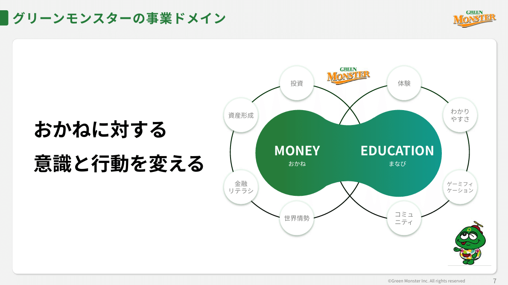
*グリーンモンスター株式会社の事業ドメイン紹介スライド*

> 引用元：[> 2025年6月期 通期決算説明資料（事業計画及び成長可能性に関する事項）](https://contents.xj-storage.jp/xcontents/AS04869/8f57059a/8b77/4d01/a3a0/7f208f8a43a6/140120250814542608.pdf)

*https://greenmonster.co.jp/ir/*

パワポの「事業紹介」スライドの特徴としては、**極めて抽象的でコンセプト寄りである点**が挙げられます。事業ドメインが「お金」と「学び」にかかわるサービスであるということを、二つの円をつなぎ合わせるデザインで見せています。

**左側に大きめの文字で企業の目的を表し、右側に具体な事業ドメインを見せることで**、多くを語らなくとも当社がどのような商品やサービスを提供している会社かわかるようになっている点がポイントです。

### 事業モデルを紹介するスライド例

次は株式会社ソラコムのパワポにおける「事業紹介」スライドの事例です。
2025年3月期 通期決算説明資料のパワーポイントにある、「ソラコムのIoT事業」のスライドを見てみましょう。

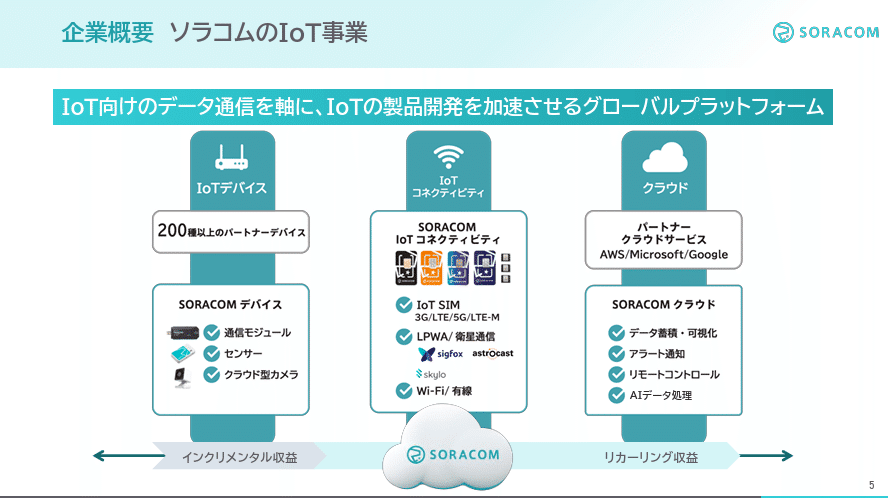
*株式会社ソラコムの事業ドメイン紹介スライド*

> 引用元：[> 2025年3月期 通期決算説明資料](https://contents.xj-storage.jp/xcontents/AS05199/fccbbead/29d4/4f62/be29/89a80f679169/140120250514550030.pdf)

*https://soracom.com/ja/ir/library/presentations*

パワポの「事業紹介」スライドの特徴としては、**わかりやすいビジュアルで各サービスの収益上の位置づけを紹介している点**が挙げられます。起点となるソラコムのプラットフォームを下のレイヤーに入れ、立体的なメインビジュアルで、連携する様々なサービスを上のレイヤーに表示することで、事業の構造をビジュアル化しています。

ポイントとしては、イメージが湧きづらいIoT事業であることを鑑み、**３つのサービスドメインはしっかりとビジュアルで見せつつも、収益のタイプは下の矢印でシンプルに見せている**ことです。真ん中に空のイラストで自社サービスを表現していること、コーポレートカラーでもある空色を使うことなどを通じて、全体をうまく調和させ、すっきりしたデザインに仕上げています。

### 商品戦略を紹介するスライド例

続いて株式会社Arentのパワポにおける「事業紹介」スライドの事例を見てみましょう。
2025年6月期決算説明資料のパワーポイントにある、「プロダクト戦略群」のスライドです。

*株式会社Arentの事業ドメイン紹介スライド*

> 引用元：[> 2025年6月期決算説明資料](https://ssl4.eir-parts.net/doc/5254/tdnet/2669039/00.pdf)

*https://arent.co.jp/ir/library/presentation/*

パワポの「事業紹介」スライドの特徴としては、**市場の全体像を円グラフで示した上で、１枚のスライド内で商品戦略の紹介までつなげている点**が挙げられます。円グラフの中でもサンバーストと呼ばれる階層構造の円グラフを使って建設DX市場がどのような市場構造になっているのか紹介しています。

とにかくビジュアルが優れた「事業紹介」スライドで、一目見れば商品戦略がわかるようになっています。ここまで市場を細かく見せている場合には難しいのですが、円グラフを使うことで各ドメインの市場規模を可視化することも可能です。市場規模に合わせて円グラフのセルの大きさを変えれば、各ドメインをどの程度カバーできているか、逆に言うとどの程度成長ポテンシャルがあるのか、見ることができるようになります。

## 商品を１枚で紹介するスライド例３選

次に、企業の商品や製品を１枚のスライドで紹介するスライド例を見ていきましょう。どのような特徴を持つ商品やサービスなのか、どのような製品戦略なのか等を１枚にまとめたスライドです。

### 製品やサービス特徴を紹介するスライド例

まずは株式会社Liberawareのパワポにおける「商品紹介」スライドの事例から見ていきましょう。
事業計画及び成長可能性に関する事項のパワーポイントにある、「ビジネスモデル」のスライドです。

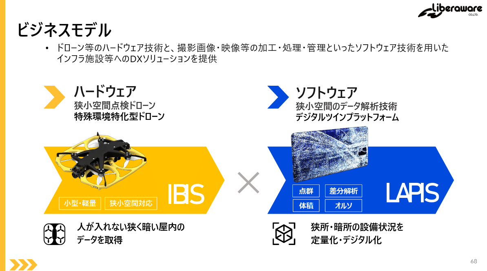
*株式会社Liberawareの製品やサービス紹介のスライド*

> 引用元：[> 事業計画及び成長可能性に関する事項](https://ssl4.eir-parts.net/doc/218A/tdnet/2703522/00.pdf)

*https://liberaware.co.jp/ir/news/*

パワポの「商品紹介」スライドの特徴としては、**情報を必要最低限に抑えて１枚のスライドにすっきりとまとめている点**が挙げられます。大きくハードウェア製品とソフトウェア製品に分けた上で、それぞれの特徴と用途を簡潔に紹介しています。

商品や製品を紹介するスライドでは、どうしてもたくさんの情報を紹介したくなりがちですが、１枚のスライドの中に情報が多すぎると、逆に伝わらなくなってしまいます。そこで、**主な顧客、価値提供の源泉、事業の位置づけをそれぞれ簡潔に記載する位にとどめる**ことで、伝わりやすい商品紹介の１枚スライドになりますよ。

### 商品特徴をシンプルに紹介するスライド例

続いて株式会社unerryのパワポにおける「商品紹介」スライドの事例を見てみましょう。
事業計画及び成長可能性に関する説明資料のパワーポイントにある、「提供サービス」のスライドです。

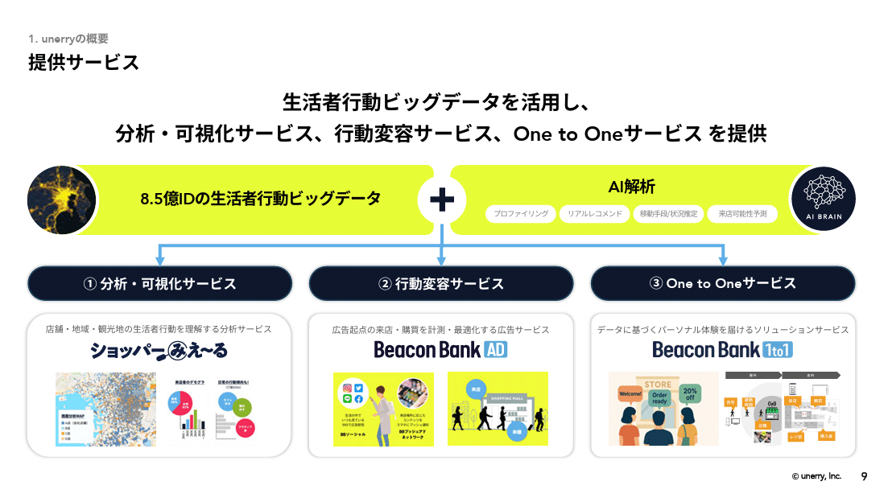
*株式会社unerryの商品紹介のスライド*

> 引用元：[> 事業計画及び成長可能性に関する説明資料](https://contents.xj-storage.jp/xcontents/AS82460/a1aaf712/6ced/466f/b651/5d15be9204a3/140120250925562011.pdf)

*https://www.unerry.co.jp/ir/news/*

パワポの「商品紹介」スライドの特徴としては、**記号や矢印をうまく使って顧客のニーズと各サービスを紐づけて見せている点**が挙げられます。8.5億IDの生活者行動ビッグデータとAI解析を足し合わせて、そこから「分析・可視化サービス」「行動変容サービス」「One to Oneサービス」の3つを展開していることがわかります。

AIやITの事業のスライドでは、商品やサービスの詳細な説明をされても、正直理解が困難なこともあります。そこで、サービスの特徴である重要な点に絞って、１枚の視覚的にわかりやすいスライドにするのは有効な手です。
また複数の商品やサービスが明確にクロスセルやアップセルにつながることが一目で見えるように１枚のスライドの中にまとめている点も良いですね。

### おしゃれなパワポの商品紹介スライド例

次はBRANU株式会社のパワポにおける「商品紹介」スライドの事例を見てみましょう。
2025年10月期決算説明会資料のパワーポイントにある、「マーケティング、採用管理、施工管理、経営管理の全プロセスを一元管理するユーザー利便性の高い統合がビジネスツール　CAREECON Plus」のスライドです。

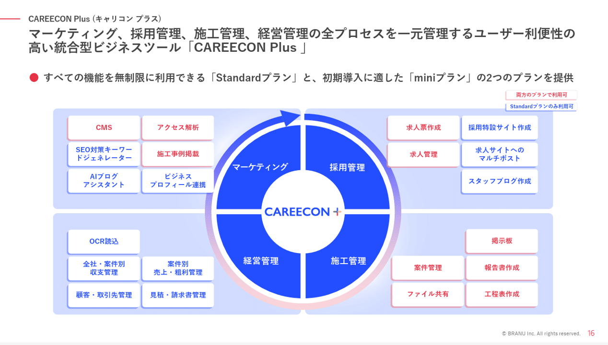
*BRANU株式会社の商品紹介のスライド*

> 引用元：[> 2025年10月期決算説明会資料](https://ssl4.eir-parts.net/doc/460A/ir_material_for_fiscal_ym/195452/00.pdf)

*https://branu.jp/library-presentation*

パワポの「商品紹介」スライドの特徴としては、**４象限のレイアウトでおしゃれに仕上げている点**が挙げられます。真ん中に商品名のCAREECON＋があり、採用管理、施工管理、経営管理、マーケティングの４つのサービスカテゴリを４象限に分け、それぞれの象限で利用可能な機能が紹介されています。

各カテゴリのサービスには、Standardプランでのみ利用可能なものとMiniプランで利用可能なものがあり、それらを色分けしています。また４つのカテゴリをグラデーションの矢印で循環するように見せるデザインもおしゃれですね。

## 事業の優位性を紹介するスライド例３選

事業内容や優位性を紹介する事例の一つ目は、表を使ったオーソドックスな比較資料です。
創薬ベンチャーなど、ぱっと見で競合優位性がわかりづらい事業者においては、自社の製品がなぜ競合よりも優れているのか、比較しながら紹介する必要があります。この場合大切なのは、**価値評価の軸をきちんと定義することと、その中で他社との差分を明確に示す**ことです。〇✕を使う表や、点数をつける星取表は視覚的にわかりやすいので良いですね。

### １枚でサービス特徴を紹介するスライド例

まずは株式会社アトラエのパワポにおける「サービス紹介」の１枚スライドの事例から見ていきましょう。
2025年9月期 通期決算説明資料のパワーポイントにある、「IT系人材に強みを持つ成功報酬型求人メディア」のスライドです。

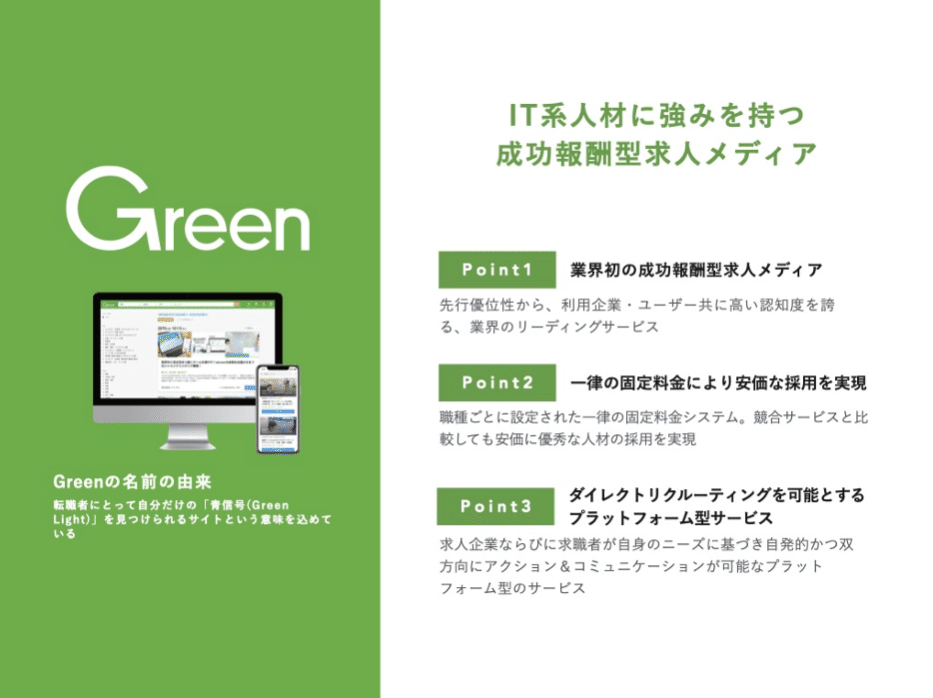
*株式会社アトラエの「サービス紹介」スライド*

> 引用元：[> 2025年9月期 通期決算説明資料](https://ssl4.eir-parts.net/doc/6194/ir_material_for_fiscal_ym1/191192/00.pdf)

*https://atrae.co.jp/ir/presentation/*

パワポの「サービス紹介」スライドの特徴としては、**３つのポイントでサービスの優位性を整理し、１枚のスライドに簡潔にまとめている点**が挙げられます。左側にサービスのイメージ画像、右側に「業界初の成功報酬型求人目ディア」「一律の固定領域んにより安価な採用を実現」「ダイレクトリクルーティングを可能とするプラットフォーム型サービス」の３つの優位性を整理しています。

グリーンというサービス名に合わせて、左側の背景色を緑色にしているほか、同じトーンの緑色で３つのポイントを整理しており、１枚のスライドですっきりとサービスの特徴を整理したおしゃれなスライドです。

### 製品特徴を比較形式で紹介するスライド例

続いてセーフィー株式会社のパワポにおける「製品紹介」の１枚スライドの事例です。
成長可能性資料のパワーポイントにある、「Safieは現場DXソリューションを提供するプラットフォーマー」のスライドです。

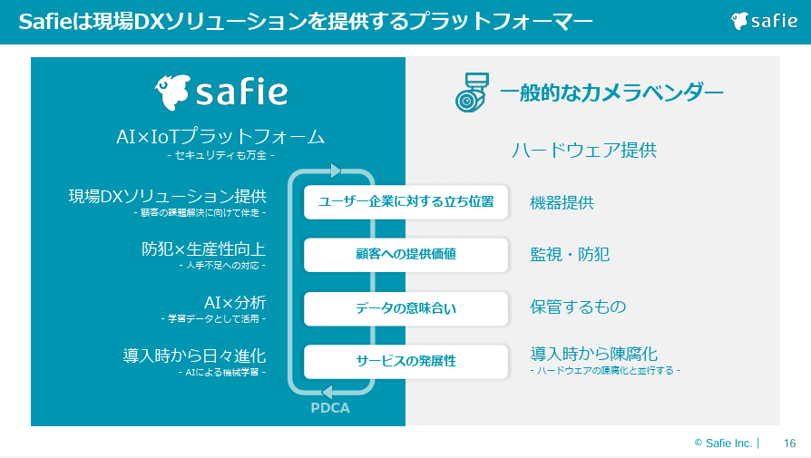
*セーフィー株式会社の「製品紹介」スライド*

> 引用元：[> 成長可能性資料](https://ssl4.eir-parts.net/doc/4375/tdnet/2584982/00.pdf)

*https://safie.co.jp/ir/library/*

パワポの「サービス紹介」スライドの特徴としては、**競合比較をする上で表の形をとりつつもビジュアルを入れることでよりわかりやすく見せている点**が挙げられます。左側にセーフィーの製品、右側に一般的なカメラベンダーの製品を置き４つの観点から自社商品の優位性を紹介しています。

同じ評価軸を入れながらも自社側にはPDCAの矢印を入れていること、また**左右で配色を真逆にすることで自社側の優位性を強調**できているデザインが特に優れています。

### １枚で商品の凄さを紹介するスライド例

最後は株式会社イルグルムのパワポにおける「商品紹介」の１枚スライドの事例です。
成長可能性資料のパワーポイントにある、「EC-CUBE：サービス概要」のスライドです。

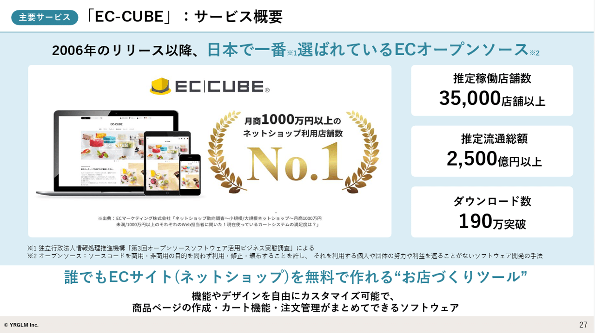
*株式会社イルグルムの「商品紹介」スライド*

> 引用元：引用元：[> 2025年 9月期年通期決算説明資料](https://ssl4.eir-parts.net/doc/3690/tdnet/2708482/00.pdf)

*https://yrglm.co.jp/ir/irnews/*

パワポの「商品紹介」スライドの特徴としては、**No1商品であることや豊富に実績があることを全面に押し出している点**が挙げられます。紙面の半分以上を商品のイメージと「月商1,000万円以上のネットショップ利用店舗数No1」という実績紹介に使っているだけでなく、残りのも部分も、推定稼働店舗数、推定流通総額、ダウンロード数といった実績に使っています。

これだけの実績があれば、細かい商品特徴を紹介するよりも、実績を紹介してしまった方がよほど魅力が伝わる、という例ですね。

## 戦略が伝わるパワポの「事業紹介」スライド９選まとめ

いかがだったでしょうか。事業紹介のスライドにおいて、事業ドメインを紹介するスライド、商品を１枚で紹介するスライド、事業の優位性を紹介するスライドの３つのパターンに分けて解説いたしました。全体を通して見てみると、やはり**情報を絞って簡潔なキーワードと画像で、サービスを紹介できているものがわかりやすい**印象を受けました。気になったものから是非参考にしてみて下さい。

またパワポ研のオリジナルテンプレートには、製品紹介や商品紹介のスライドに使えるフォーマットも多数あるので、気になる方は下記のリンクから見てみてくださいね。

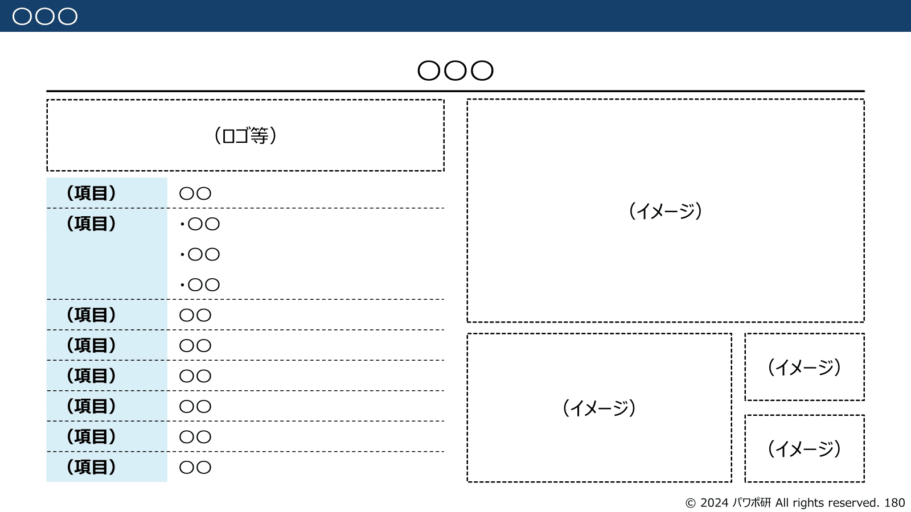
*パワポ研オリジナルテンプレートのサービス紹介スライド*

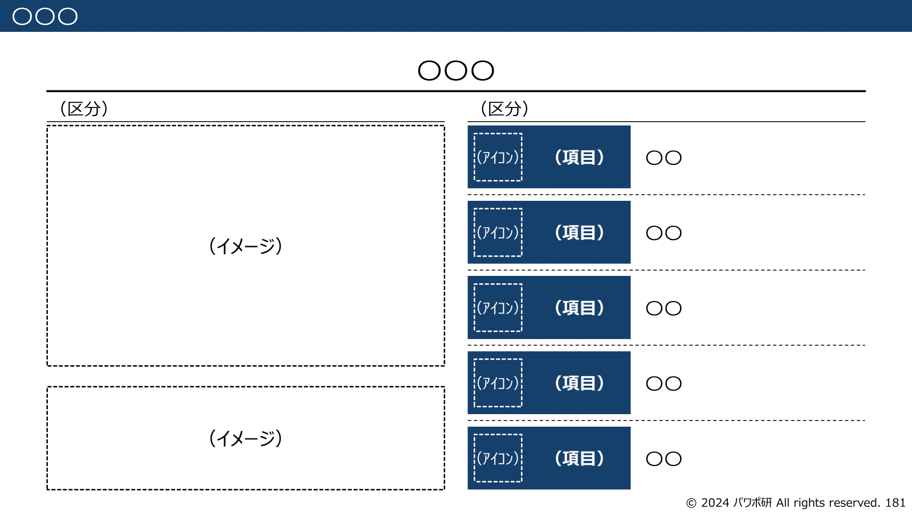
*パワポ研オリジナルテンプレートの製品紹介スライド*

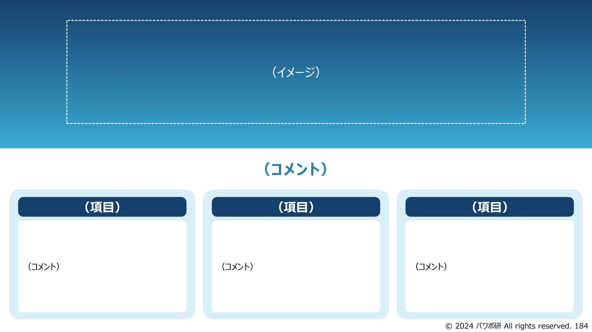
*パワポ研オリジナルテンプレートのおしゃれな商品紹介スライド*

## パワポ研オリジナルテンプレート

パワポ研では、「ビジネスシーンで使える」パワーポイントテンプレートを公開しております。デザインを整えるのみならず、**ロジックやストーリーを整理するのにも役立つパッケージ**になっておりますので、関心のある方は下記ページも併せてご覧ください！

上記の記事のように、noteでは**フォローしているだけでビジネスにおける「資料作成のコツ」と「デザインのセンス」が身に付くアカウント**を目指して情報配信を行っています。
今後もコンスタントに記事を配信していく予定なので、関心のある方は是非アカウントのフォローをお願いします！

**> Template販売　**[> https://powerpointjp.stores.jp/](https://powerpointjp.stores.jp/%EF%BF%BCnote)
**> note　**[> パワポ研の資料作成術](https://note.com/powerpoint_jp/m/mc291407396da)
**> X（旧Twitter)　**[> https://twitter.com/powerpoint_jp](https://twitter.com/powerpoint_jp)

## レックスアドバイザーズからのお知らせ

パワポ研は株式会社レックスアドバイザーズが運営しています。
レックスアドバイザーズは**経営企画職や経営管理職に特化した転職エージェント**です。
上場企業や上場準備企業を中心に、**経営企画、IR、経理財務、法務、内部監査等の職種の求人**をご紹介しているほか、**CFOなどのコンフィデンシャル求人**もご紹介可能です。
またコンサルティングファームや監査法人、会計事務所の求人も豊富にあるため、プロフェッショナルファームを目指す方のご支援も得意です。
求人紹介やキャリア相談を希望の方は、[**無料転職サポート**](https://www.career-adv.jp/job_search/entryform_exp/)よりサービス利用登録をしてみてください。

*レックスアドバイザーズのサービスサイトはこちら*

**> 求人をご希望の方　**[> 無料転職サポート](https://www.career-adv.jp/job_search/entryform_exp/)**
> 採用支援をご希望の方　**[> 採用サポート](https://www.career-adv.jp/request3/)
**> その他　**[> お問い合わせフォーム](https://www.rex-adv.co.jp/contact)
**> 書籍　**[> 注目企業の実例から学ぶパワポ作成術](https://www.amazon.co.jp/dp/4046060476)

