# 【マネしたい】パワポの「KPIツリー」スライド事例９選

[note原文](https://note.com/powerpoint_jp/n/nadabd5641868)

みなさんこんにちは。
資料デザインのリサーチや分析に取り組むパワーポイントのスペシャリスト、パワポ研です。

今回は、**パワポの「KPIツリー」スライドに焦点を当て、上場企業のIR資料から参考事例を紹介**していきます。KPIツリーは、経営の状態を見るに当たって重要な指標であるKPI（Key Performance Indicator）の全体像を見せる際に使われるパワポのテンプレートです。パワポ以外にも、エクセルやスプレッドシートで使われることもあります。

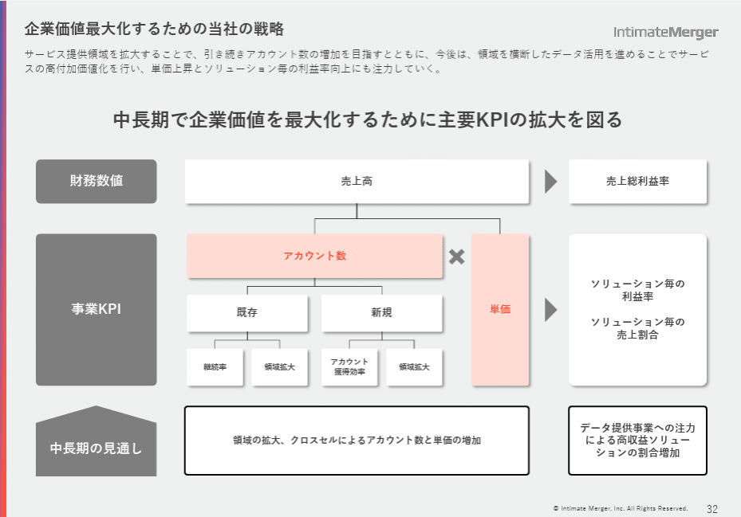
*株式会社インティメート・マージャーのKPIツリー*

> 引用元：[> 事業計画及び成長可能性に関する事項](https://pdf.irpocket.com/C7072/hvir/pSug/VMim.pdf)

*https://corp.intimatemerger.com/ir/lib-presen/*

具体的なKPIツリーの事例を紹介していく前に、まずはKPIツリーとは何かから説明していきます。そのあとに様々なKPIツリーの事例を見ていきましょう。では早速行きます！

## KPIツリーとは

まず最初に、KPIツリーになじみの無い方に向けて、KPIツリーとは、という説明から入りましょう。

KPI（Key Performance Indicator）というのは、直訳すると「カギとなるパフォーマンス指標」ということで、経営の状態を見る上で重要な数値のことを指します。例えば、サブスク型のビジネスにおいては、解約率（チャーンレート）が重要なので、KPIには解約率が入っていることが多いです。一方で宿泊施設であれば、解約率という概念はなく、代わりに部屋の稼働率が重要なので、KPIに入ってくるわけです。なので、KPIは企業のビジネスモデルによっても変わってきます。

ではKPIツリーとは？ということになりますが、**経営としての最終的なアウトプットである売上や利益と、重視する指標であるKPIがどのような関係にあるのかを見せる**テンプレートになります。売上や利益がどのようなKPIで構成されているのか、各KPIがどのような関係性になっているのかを一覧で見せることを通じて、読み手にビジネスのポイントを簡潔に伝えると同時に、何に注力して企業を運営していくのかを伝えるわけですね。

こうしたKPIツリーですが、特に新規のビジネスや、ビジネスモデルがわかりづらい企業の場合に、効果を発揮します。また新規上場時等、新しくお披露目される企業の場合に、どこに着目してほしいかを伝えるのにも適しているため、「事業計画及び成長可能性に関する事項」の資料でもよく使われるわけですね。

## 売上構造が伝わるKPIツリー事例３選

最初は売上の構造を説明するためにKPIツリーを使っているパワポの例から見ていきましょう。売上をユーザー数とCVRに分解したり、契約件数とLTVに分解したりしたうえで、さらにユーザー数や契約件数をもう一段細かく分解します。ここで選ばれるKPIはビジネスによって異なり、読み手からするとビジネスの構造を理解するのに役に立ちます。

### Webメディア事業のKPIツリー例

まずは株式会社GunosyのパワポにおけるWebメディア事業の「KPIツリー」の例から見ていきましょう。
2025年5月期　決算説明資料のパワーポイントにある、メディア事業｜グノシーの重要KPIの進捗サマリーのスライドです。

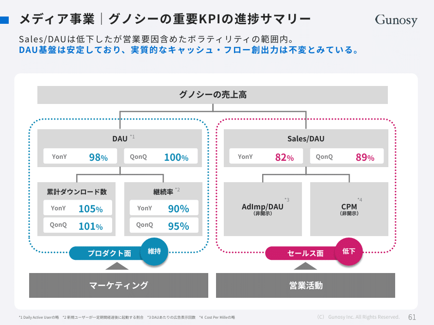
*株式会社GunosyのKPIツリー例*

> 引用元：[> 2025年5月期　決算説明資料](https://ssl4.eir-parts.net/doc/6047/tdnet/2655071/00.pdf)

*https://gunosy.co.jp/ir/library/*

パワポの「KPIツリー」の特徴としては、各指標に関して、**昨年比と前四半期比を入れている点**が挙げられます。また一般には横型のツリーが多い中で、縦型のツリーの構造も珍しいですね。KPIツリーは三段で以下のような構成になっています。

- １段目：Webメディア事業の売上高

- ２段目：DAU、Sales/DAU

- ３段目：累計ダウンロード数、継続率、Adimp/DAU、CPM

KPIツリーの数値については、堅調なプロダクト面を青に、低下しているセールス面を赤にして、文字や箱の色をそろえたうえで、それぞれの基盤となるマーケティングや営業活動にも言及しています。

### サブスク事業のKPIツリー例

続いて株式会社うるるのパワポにおけるサブスク事業の「KPIツリー」の例です。
2025年3月期 決算説明資料のパワーポイントにある、NJSS｜KPIツリーのスライドを見てみましょう。

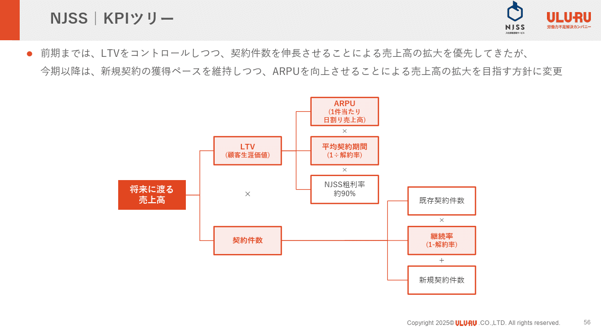
*株式会社うるるのKPIツリー例*

> 引用元：[> 2025年3月期 決算説明資料(2025年5月15日および26日に訂正済)](https://ssl4.eir-parts.net/doc/3979/ir_material_for_fiscal_ym2/178580/00.pdf)

*https://www.uluru.biz/ir/presentation.html*

パワポの「KPIツリー」の特徴としては、**新たに重視するKPIをハイライトしている点**が挙げられます。KPIツリーは三段で以下のような構成になっています。

- １段目：サブスク事業の将来に渡る売上高

- ２段目：LTV（顧客生涯価値）、契約件数

- ３段目：ARPU（１件あたり日割り売上高）、平均契約期間（１÷解約率）、NJSS粗利率、既存契約件数、継続率（１-解約率）、新規契約件数

これまでの契約件数重視から、ARPUの向上重視による売上拡大に方針転換するということを示しています。そのため、契約件数は白背景、ＡＲＰＵやサブスク事業上重要な契約期間や継続率などをオレンジ背景でハイライトしています。

### ECサイト事業のKPIツリー例

次に株式会社ラクーンホールディングスのパワポにおけるECサイト事業の「KPIツリー」の例を見てみましょう。
決算説明資料のパワーポイントにある、EC事業｜スーパーデリバリー　事業構造と事業環境サマリのスライドです。

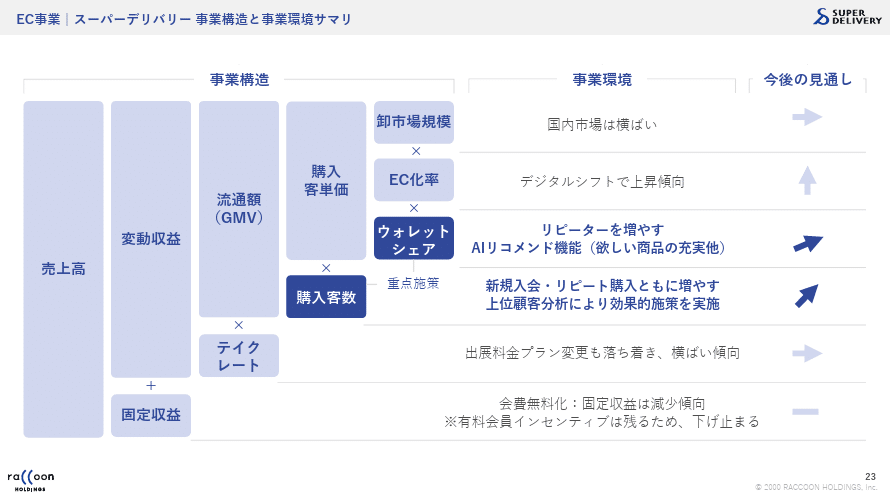
*株式会社ラクーンホールディングスのKPIツリー例*

> 引用元：[> 決算説明資料](https://pdf.irpocket.com/C3031/A2Jy/YNFW/RW6M.pdf)

*https://www.raccoon.ne.jp/investor/financial_info*

パワポの「KPIツリー」の特徴としては、**５段階に分解した上でそれぞれの事業環境と今後の見通しを整理していること**が挙げられます。ECサイト事業の売上高を、卸市場規模、EC化率、ウォレットシェア、購入客数、テイクレートの掛け算と、固定収益の足し算に分解をしています。KPIツリーは五段で以下のような構成になっています。

- １段目：ECサイト事業の売上高

- ２段目：変動収益、固定収益

- ３段目：流通額、テイクレート

- ４段目：購入客単価、購入客数

- ５段目：卸市場規模、EC化率、ウォレットシェア

ECサイト事業の売上を構成するKPIのうち、営業努力で向上させやすい「ウォレットシェア」「購入客数」を重点施策の対象としてハイライトし、事業環境も太字で記載、今後の見通しも上向きにしています。

## 利益構造が伝わるKPIツリー事例３選

続いて利益の構造を説明するためにKPIツリーを使っているパワポの例を見ていきます。利益を売上とコストに分解して細分化していくのが一般的ですが、ビジネスによってはコストの概念が異なる例もあるので、そうした事例も含めてみていきましょう。

### 製造小売業のKPIツリー例

まずは株式会社クラシコのパワポにおける「KPIツリー」の例を見ていきましょう。製造小売業における一般的なKPIツリーです。
事業計画及び成長可能性に関する事項のパワーポイントにある、クラシコの企業価値・ブランド価値の源泉のスライドです。

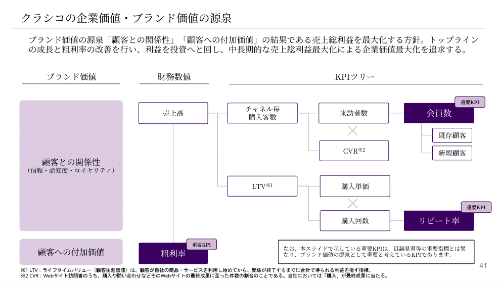
*株式会社クラシコのKPIツリー例*

> 引用元：[> 事業計画及び成長可能性に関する事項](https://contents.xj-storage.jp/xcontents/AS05759/3b99ab26/2d5d/4152/98f7/536fac940d35/140120260130542735.pdf)

*https://classico.co.jp/ir/*

パワポの「KPIツリー」の特徴としては、**会員数やリピート率といった、表のKPIツリーの裏にあるKPIをハイライトしている点**が挙げられます。KPIツリーは四段で以下のような構成になっています。

- １段目：製造小売業の売上高、粗利率

- ２段目：チャネル毎購入客数、LTV

- ３段目：来訪者数、CVR、購入単価、購入回数

- ４段目：会員数（既存顧客、新規顧客）、リピート率

製造小売業のツリーとして３段目までは一般的ですが、その後ろに会員数や購入回数というストック的な指標を入れています。KPIツリーはフロー的な要素になりがちながら、実はストック部分が大切なので、そこをうまく合わせたツリーといえますね。

### 営業利益の全体像を示したKPIツリー例

株式会社 TWOSTONE&Sonsのパワポにおける「KPIツリー」の例です。
2025年８月期 通期決算説明資料（事業計画及び成長可能性に関する事項）のパワーポイントにある、エンジニアプラットフォームサービス（Midworks）のビジネスモデルのスライドになります。

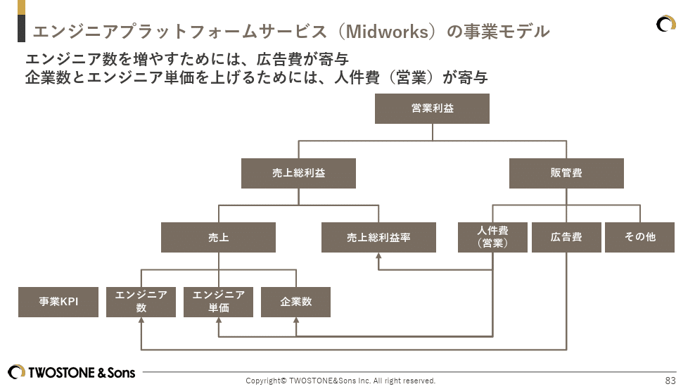
*株式会社 TWOSTONE&SonsのKPIツリー例*

> 引用元：[> 2025年８月期 通期決算説明資料（事業計画及び成長可能性に関する事項）](https://contents.xj-storage.jp/xcontents/AS08579/c3e03c77/9cb5/4565/8125/c60c69454e2a/140120251015573956.pdf)

*https://twostone-s.com/ir/presentations/*

パワポの「KPIツリー」の特徴としては、**コストのKPIが売上のKPIにどうつながるかが矢印で記載されている点**が挙げられます。
KPIツリーは四段で以下のような構成になっています。

- １段目：プラットフォームサービスの営業利益

- ２段目：売上総利益、販管費

- ３段目：売上、売上総利益率、人件費、広告費、その他

- ４段目：エンジニア数、エンジニア単価、企業数

３段目まではKGIと経営上のKPI、４段目に事業KPIと分けています。
広告費がエンジニア数、人件費がエンジニア単価と企業数につながるということが示されており、読み手の理解が深まりやすいKPIツリーです。

### 暗号通貨事業のKPIツリー例

最後は株式会社セレスのパワポにおける「KPIツリー」の例を見ていきましょう。
2025年12月期　決算説明資料のパワーポイントにある、暗号資産交換業のビジネスモデルのスライドです。

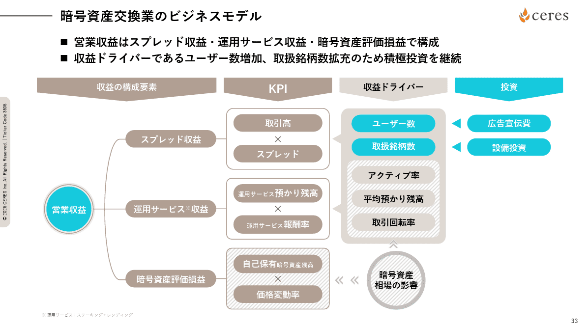
> 引用元：[> 2025年12月期　決算説明資料](https://ssl4.eir-parts.net/doc/3696/ir_material_for_fiscal_ym1/198436/00.pdf)

*https://ceres-inc.jp/ir/presentation/*

パワポの営業収益の「KPIツリー」の特徴としては、**コストという概念がなく、スプレッドや価格変動率といったKPIがあること**が挙げられます。
KPIツリーは三段で以下のような構成になっていますが、その右に収益ドライバーや投資という段が広がっています。

- １段目：金融業の営業収益

- ２段目：スプレッド収益、運用サービス収益、暗号資産評価損益

- ３段目：取引高、スプレッド、預かり残高、報酬率、自己保有残高、価格変動率

- 収益ドライバー：ユーザー数、取り扱い銘柄数、アクティブ率、平均預かり残高、取引回転率

- 投資：広告宣伝費、設備投資

KPIツリーは丸みを帯びた四角、その後ろの収益ドライバーは吹き出し、その後ろの投資は矢印と、見やすいおしゃれなデザインになっています。ベージュ系とターコイズブルーの組み合わせもよいですね

## 経営戦略が伝わるKPIツリー３選

最後はKPIツリーを使って経営戦略を説明している事例を見ていきます。力を入れていくKPIをハイライトしたうえで、どのような施策を打っていくのかアクションを記載しています。

### 不動産事業のKPIツリー例

まずは株式会社AlbaLinkのパワポにおける「KPIツリー」の例から見ていきましょう。
事業計画及び成長可能性に関する事項についてのパワーポイントにある、基本となるオーガニック成長のスライドです。

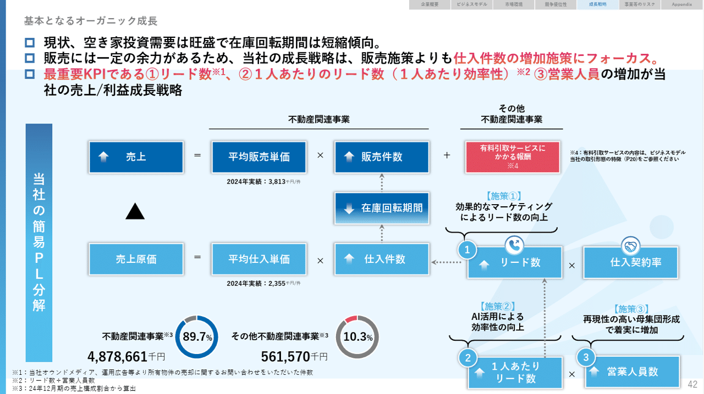
*株式会社AlbaLinkのKPIツリー例*

> 引用元：[> 事業計画及び成長可能性に関する事項について](https://ssl4.eir-parts.net/doc/5537/tdnet/2731013/00.pdf)

*https://albalink.co.jp/ir/news/*

パワポの「KPIツリー」の特徴としては、**売上と原価に分けてKPIを詳細に分解したうえで、重要なKPIについてそれぞれ施策を記載している点**が挙げられます。KPIツリーは四段で以下のような構成になっています。

- １段目：売上、売上原価

- ２段目：平均販売単価、販売件数、平均仕入単価、仕入件数、在庫回転期間、有料引取サービスにかかる報酬

- ３段目：リード数、仕入契約率

- ４段目：１人あたりリード数、営業人員数

ツリー上の各KPIについて、上がる方がよいのか、下がる方がよいのか、矢印で表現している点も地味にわかりやすいです。また重要なKPIについて、①②③とナンバリングして、施策と紐づけている点もよいですね。

### ECサイト事業のKPIツリーと施策例

続いて株式会社ジグザグのパワポにおけるECサイト事業の「KPIツリー」の例を見ていきましょう。
事業計画及び成長可能性に関する事項のパワーポイントにある、収益及びKPIの構造とアクションプランのスライドです。

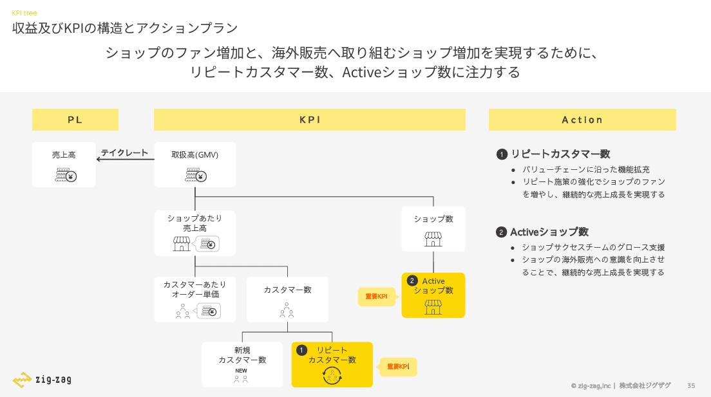
*株式会社ジグザグのKPIツリー例*

> 引用元：[> 事業計画及び成長可能性に関する事項](https://ssl4.eir-parts.net/doc/340A/tdnet/2587239/00.pdf)

*https://ir.zig-zag.co.jp/news/*

パワポの「KPIツリー」の特徴としては、**縦型のツリー構造とアイコンで見やすいツリーにしつつ重要なKPIに対するアクションは右側に別途書き出している点**が挙げられます。KPIツリーは四段で以下のような構成になっています。

- １段目：売上高、取扱高

- ２段目：ショップあたり売上高、ショップ数

- ３段目：カスタマーあたりオーダー単価、カスタマー数、Activeショップ数

- ４段目：新規カスタマー数、リピートカスタマー数

アイコンを使って初心者でも見やすい構造にしつつ、重要KPIについては黄色背景にして、アクションも箇条書きのテキストでしっかりと書き下しています。色遣いがグレーと黄色でシンプルなだけに、強調したいKPIを黄色でハイライトする効果が強力に出ています。

### 製造小売業のROICのKPIツリー例

最後は株式会社イトーキのパワポにおけるROICの「KPIツリー」のデザインを見てみましょう。
2025年12月期 決算説明会資料のパワーポイントにある、資本コストや株価を意識した経営の実現に向けた対応のスライドです。

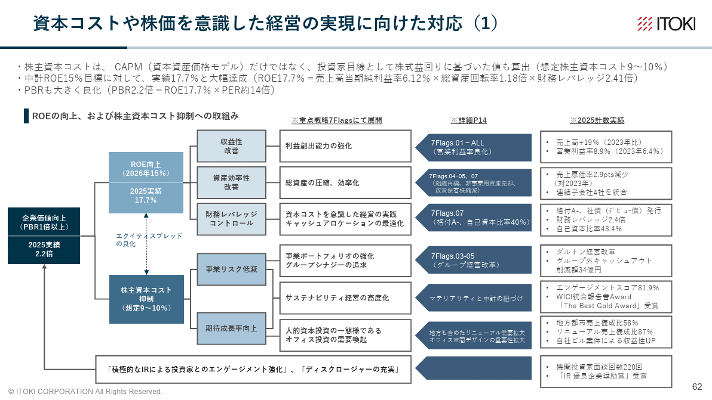
*株式会社イトーキのKPIツリー例*

> 引用元：[> 2025年12月期 決算説明会資料](https://ssl4.eir-parts.net/doc/7972/ir_material_for_fiscal_ym10/198834/00.pdf)

*https://www.itoki.jp/company/ir/accounts/*

パワポの「KPIツリー」の特徴としては、**ROICの向上にあたって重要なKPIを定義したうえで、別ページの重点戦略とリンクさせ、実績まで挙げている点**が挙げられます。KPIツリーは三段で以下のような構成になっていますが、その後ろに重点戦略、詳細、計数実績が紐づいています。

- １段目：企業価値向上

- ２段目：ROE向上、株主資本コスト抑制

- ３段目：収益性改善、資産効率性改善、財務レバレッジコントロール、事業リスク低減、期待成長率向上

ROICのように明確に定義が決まっているものについては、KPIツリーもさることながら、具体的なアプローチを書き切り、現状の数値から改善が期待できることを示すことが大切です。その意味で、前段の中期経営計画の重点戦略とリンクしているのは非常に大切なわけですね。

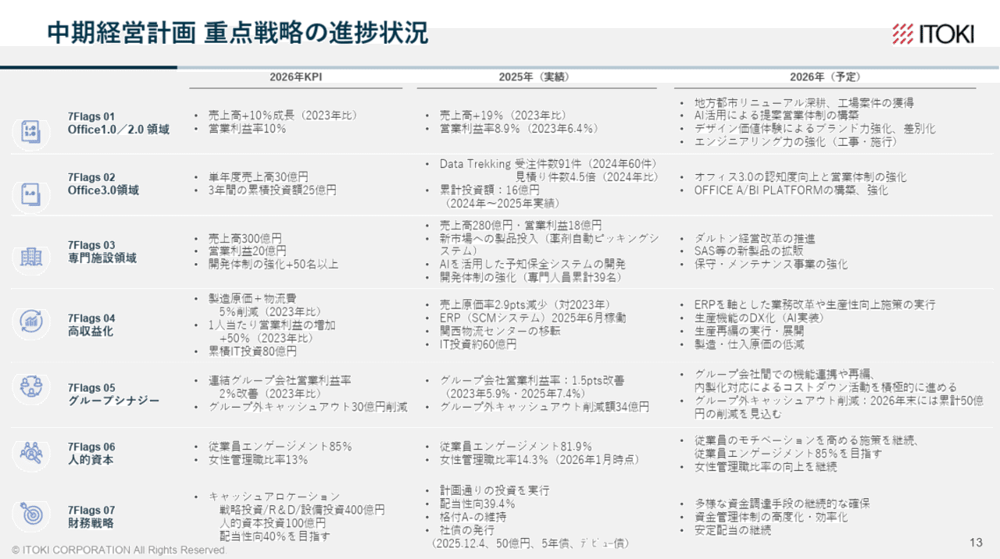
*KPIツリーに紐づけられている重点戦略*

## KPIツリーの作り方

最後に簡単にKPIツリーの作り方についても解説しておきましょう。
見やすいKPIツリーを作るには、ツリー自体が簡潔でありながら、施策等の補足とうまくリンクしていることが重要です。以下のような基本を守れば、見やすいKPIツリーが作れますよ。

- ツリーを構成するKPIのサイズをそろえる

- ツリーを構成するKPIを等間隔に配置する

- ツリーのKPIをつなぐ線は最低限見える程度にする

- KPIと同じ行あるいは列に施策などの補足を入れる

- あるいは余白を活用してKPIに吹き出し等をつける

### パワポのKPIツリーの作り方

上の説明を読んで、間のいい方は気付いたと思いますが、実はKPIツリーの作り方は表の作り方に似ています。同じサイズの箱を用意し、上下を揃えて並べるからです。なお表を作る場合はボックスをなるべく大きくしますが、KPIツリーはすっきり見せて余白を作るのが大切なので、文字がしっかり入る最低限の大きさでそろえます。

### エクセルのKPIツリーの作り方

エクセルのKPIツリーの作り方はもっとシンプルです。なぜなら箱のサイズが上下で勝手にそろってくれる仕様だからです。スプレッドシートでも同様なので、KPIとKPIの間のサイズだけ気を付けて作成しましょう。なおKPIの間の余白については、白色で塗りつぶしておくと罫線が見えなくなるのでお勧めですよ。

## 【マネしたい】パワポの「KPIツリー」スライド事例９選のまとめ

以上、サブスク、ECサイト、製造小売業、不動産業など、様々な業種のKPIツリーを紹介したほか、近年増えてきているROICのKPIツリーについても紹介しました。
今回見ていただいたように、KPIツリーは業種によっても異なりますし、単純にビジネスモデルを見せたいのか、施策など戦略を見せたいのかでも見せ方が変わるので、是非自社の使い方に近いものを見つけてくださいね。

なおパワポ研のテンプレート集には、KPIツリーのテンプレートはありませんが、応用することで使えるスライドがありますので、気になる方は是非見てみてくださいね。

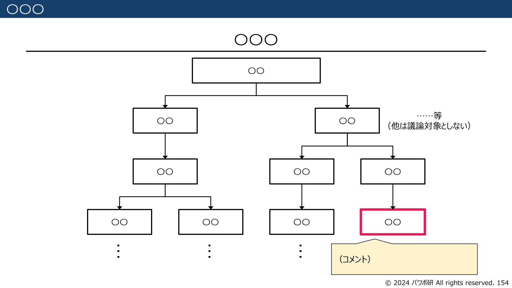
*パワポ研テンプレート集のKPIツリーの作り方に役立つスライド１*

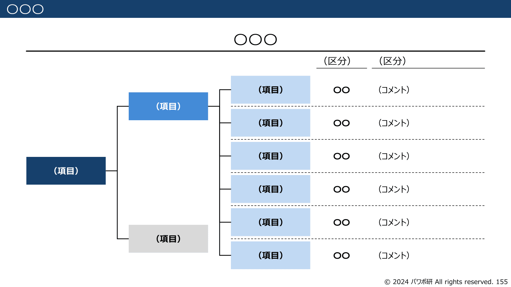
*パワポ研テンプレート集のKPIツリーの作り方に役立つスライド２*

## パワポ研オリジナルテンプレート

パワポ研では**「ビジネスシーンで使える」パワーポイントテンプレート**を公開しております。デザインを整えるのみならず、**ロジックやストーリーを整理する**のにも役立つパッケージになっておりますので、関心のある方は下記ページも併せてご覧ください！

[
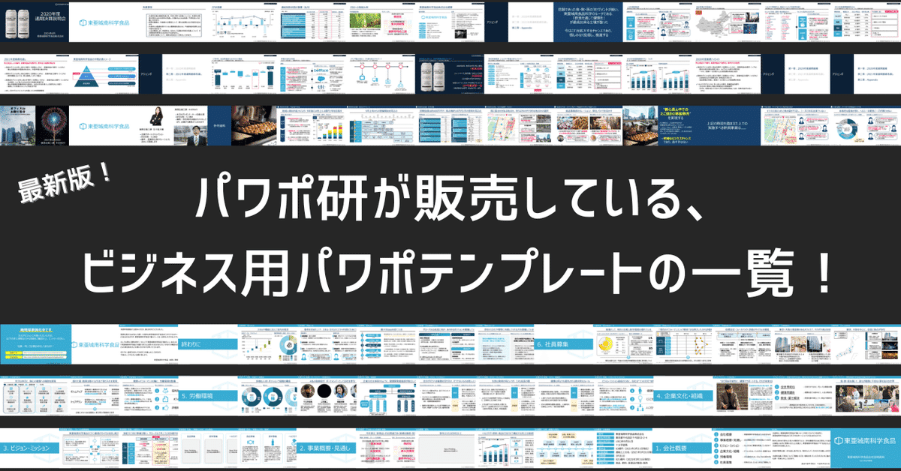
](https://note.com/powerpoint_jp/n/n50d02ec3162f)上記の記事のように、noteでは**フォローしているだけでビジネスにおける「資料作成のコツ」と「デザインのセンス」が身に付くアカウント**を目指して情報配信を行っています。
今後もコンスタントに記事を配信していく予定なので、関心のある方は是非アカウントのフォローをお願いします！

**> Template販売　**[> https://powerpointjp.stores.jp/](https://powerpointjp.stores.jp/%EF%BF%BCnote)
**> note　**[> パワポ研の資料作成術](https://note.com/powerpoint_jp/m/mc291407396da)
**> X（旧Twitter)　**[> https://twitter.com/powerpoint_jp](https://twitter.com/powerpoint_jp)

## レックスアドバイザーズからのお知らせ

パワポ研は株式会社レックスアドバイザーズが運営しています。
レックスアドバイザーズは**経営企画職や経営管理職に特化した転職エージェント**です。
上場企業や上場準備企業を中心に、**経営企画、IR、経理財務、法務、内部監査等の職種の求人**をご紹介しているほか、**CFOなどのコンフィデンシャル求人**もご紹介可能です。
またコンサルティングファームや監査法人、会計事務所の求人も豊富にあるため、プロフェッショナルファームを目指す方のご支援も得意です。
求人紹介やキャリア相談を希望の方は、[**無料転職サポート**](https://www.career-adv.jp/job_search/entryform_exp/)よりサービス利用登録をしてみてください。

*レックスアドバイザーズのサービスサイトはこちらから*

**> 求人をご希望の方　**[> 無料転職サポート](https://www.career-adv.jp/job_search/entryform_exp/)**
> 採用支援をご希望の方　**[> 採用サポート](https://www.career-adv.jp/request3/)
**> その他　**[> お問い合わせフォーム](https://www.rex-adv.co.jp/contact)
**> 書籍　**[> 注目企業の実例から学ぶパワポ作成術](https://www.amazon.co.jp/dp/4046060476)

