# 【コンサルのパワポ紹介】上場しているM&A仲介会社のスライド資料

[note原文](https://note.com/powerpoint_jp/n/nb076f32afe70)

みなさんこんにちは。
資料デザインのリサーチや分析に取り組むパワーポイントのスペシャリスト、パワポ研です。

パワポ研ではこれまで、戦略コンサルティングファームや上場コンサルティングファームのパワーポイント資料など、プロフェッショナルファームの資料を紹介してきましたが、今回は上場しているM&A仲介会社の資料を紹介していこうと思います。

上場しているM&A仲介会社への転職を考えている方、M&A仲介会社の資料を見てみたい方など、ぜひ最後まで読んでいただければと思います！
なおM&A仲介会社の営業資料などは公開されていないため、今回はIR資料が中心です。**各社構成が似ているものの、アピールしている点などは微妙に異なる**ので、違いを見ていくと面白いですよ。
では早速行きましょう！

## 日本M&Aセンターのパワポ資料

まずは株式会社日本M&Aセンターホールディングスのパワポスライドです。
日本M&Aセンターは1991年に創業し、2006年に東証マザーズ上場、2007年に東証1部に鞍替えした、老舗のM&A仲介会社です。
現在では**J-AdviserとしてTOKYO PRO Market上場支援サービスを行ったり、PMIコンサルティングを行ったり**と、M&A仲介に閉じない様々なサービスを提供しています。

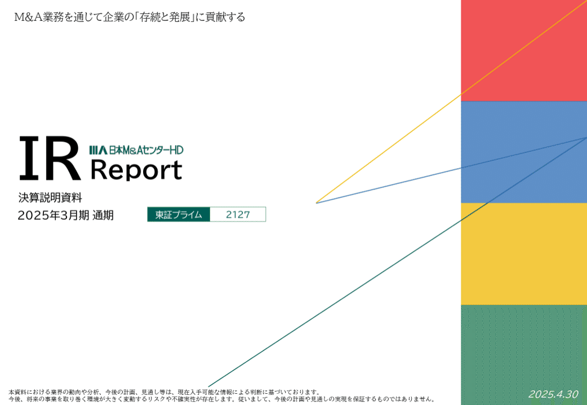
> 引用元：[> 2025年３月期 決算説明資料](https://www.nihon-ma.co.jp/ir/pdf/250430_presentation2.pdf)

*https://www.nihon-ma.co.jp/page/category/ir_presentation/*

### M&Aセンターの経営理念

M&Aセンターのパーパスは「最高のM&Aをより身近に」ということで、安心してM&Aに取り組める社会を目指すことです。高い理想を掲げていることをイメージさせるような青空の画像が背景となっているスライドです。

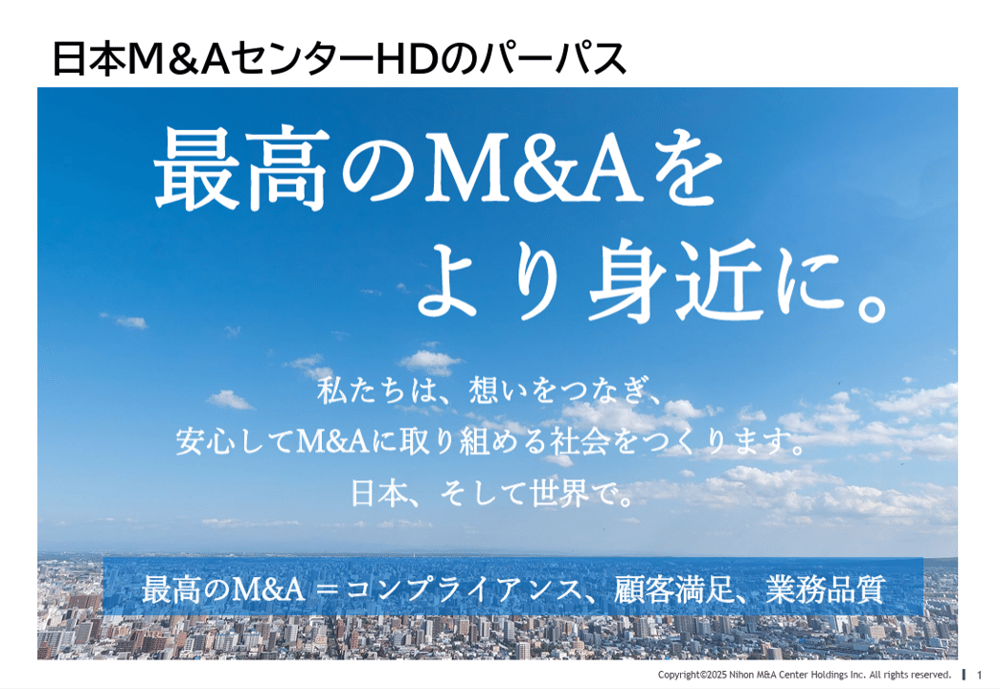

### M&Aセンターの強み

M&Aセンターの強みは４つに分けて整理されていますが、競合比較の観点で際立つのは、M&Aを中心に様々なケイパビリティを兼ね備えていることです。ケイパビリティの豊富さを見せるために、グループ会社群をロゴ付きでこれでもかと並べて見せています。

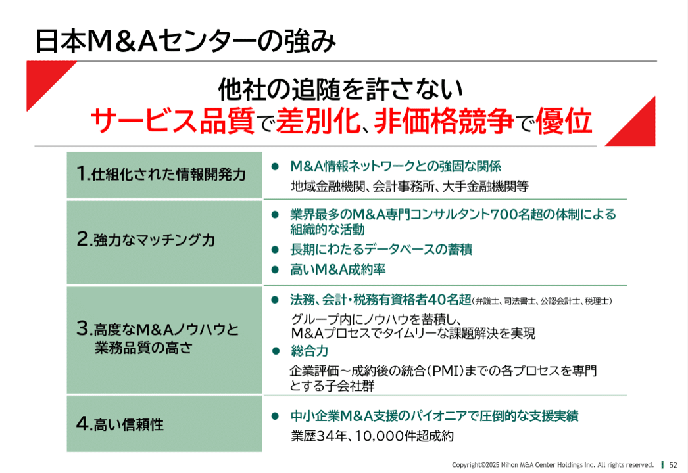

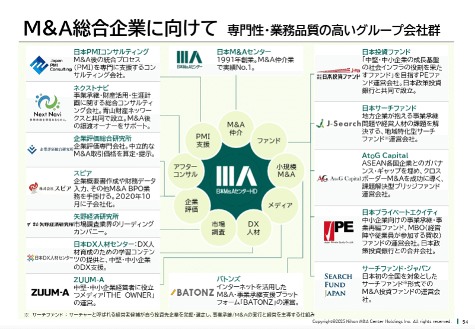

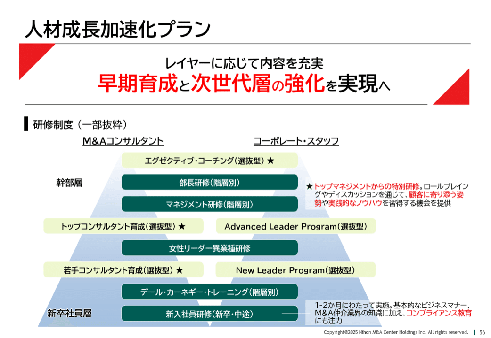

### M&Aセンターの成長戦略

M&Aセンターの成長戦略の核は、こうしたケイパビリティをフルに生かしてM&Aのフルサービス企業としてサービス提供をしていくことです。**PMIコンサルティングやTOKYO PRO Market上場支援**はそれらの最たるものといえますね。

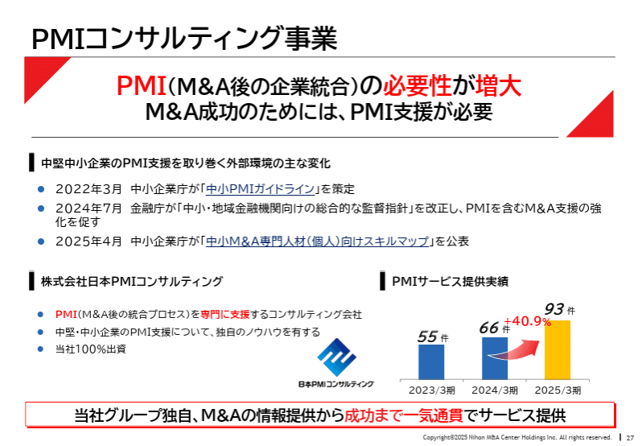

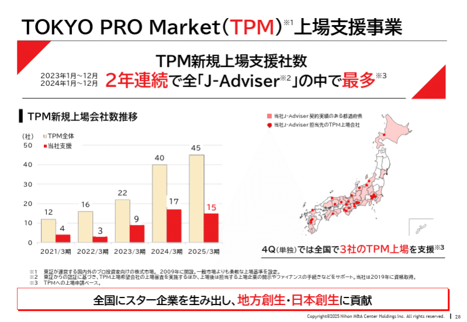

### M&Aセンターの経営数字

続いてM&Aセンターの中期経営計画の数字や足元の数字です。中期経営計画については、足元を固めながら着実に進めるべく、従来の正常な業績達成サイクルに戻し、上振れ着地を狙っています。**修正前後の中継を左右に並べることで、どのように計画を修正したのか、比較しやすく**なっています。

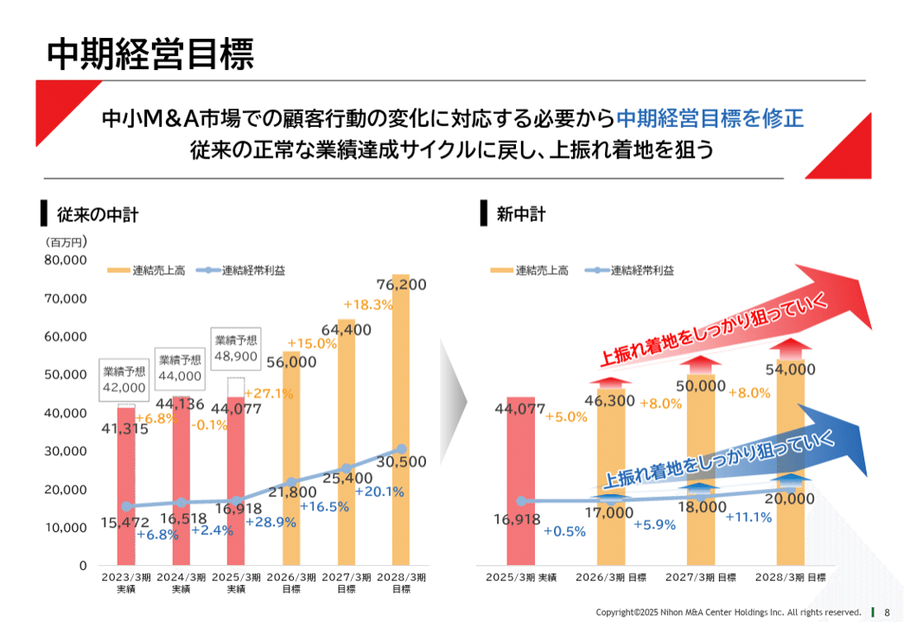
また足元好調であることがわかるように、M&Aの成約に関する先行指標の数字をKPIとして示しています。**成約までのフローにおける各段階の数字を見せることで、投資家により具体な状況を伝えている**、良いスライドです。

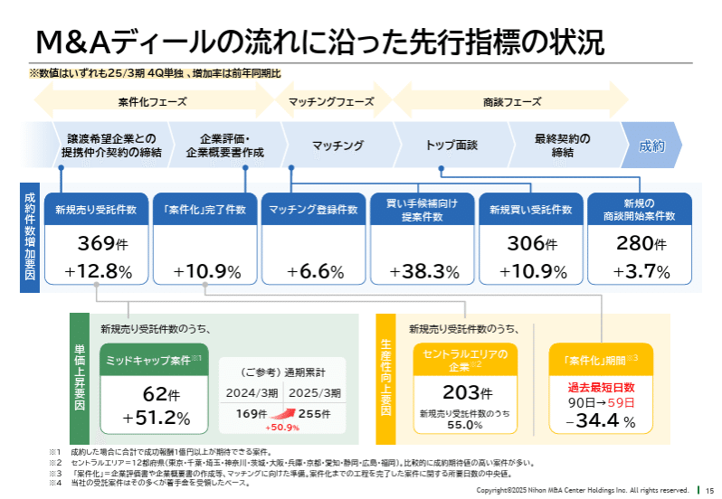

### M&A業界に対する市場環境認識

M&AセンターがM&A業界の市場環境をどのように認識しているかのスライドです。**業界全体として品質やモラルの向上が求められるというマクロ的な要素と、一方で目の前にどのようなポテンシャルがあるかというミクロ的な要素の両方**から外部環境を整理しています。

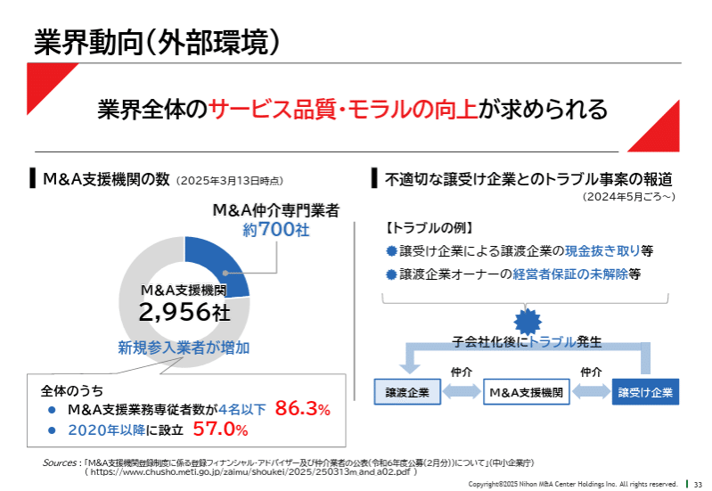
市場規模のポテンシャルを示す表においては、**売上高規模と事業承継か否かの２軸のマトリックスの表で整理**しています。シンプルですがわかりやすいスライドです。

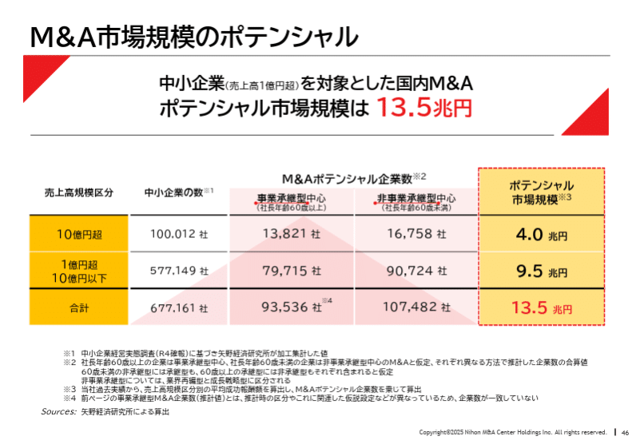

### M&Aセンターの成約実績

最後に、どのようなM&Aが実際に成約しているのかをまとめたスライドです。競合他社はここまで細かくは出していないですね。
円グラフで、**売上高や従業員規模別や業種別の割合を見せているのと、業種と地域のマトリックスで割合を見せて**います。
かなり幅広に案件を扱っていることがわかることに加えて、異業種かつ異なる地域のM&Aが多いことがわかります。

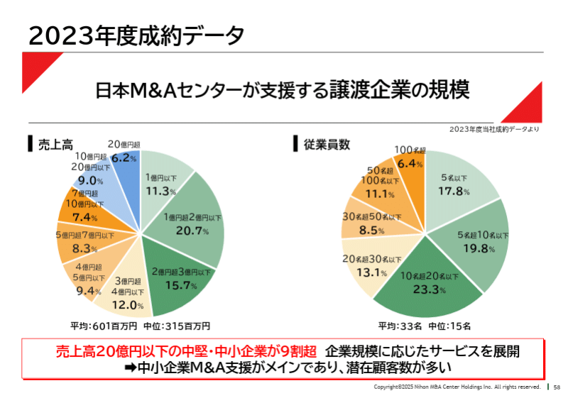

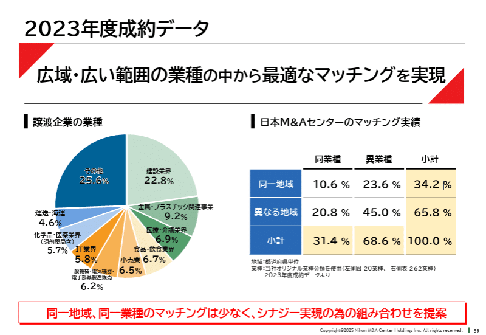
レックスアドバイザーズでは日本M&Aセンターの求人を多数取り扱っております。興味のある方はこちらから[エントリー](https://assets.st-note.com/img/1765019813-shlA1KJXLgC4TkfdUM0eWOiQ.png?width=2000&height=2000&fit=bounds&quality=85)ください。

[
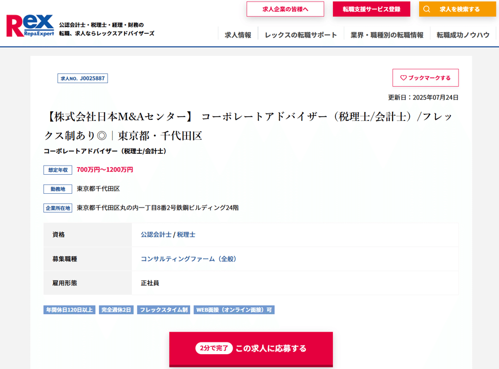
](https://www.career-adv.jp/job_search/tax/detail/J0025887/)*クリックすると求人（東京）の詳細に飛びます*

[
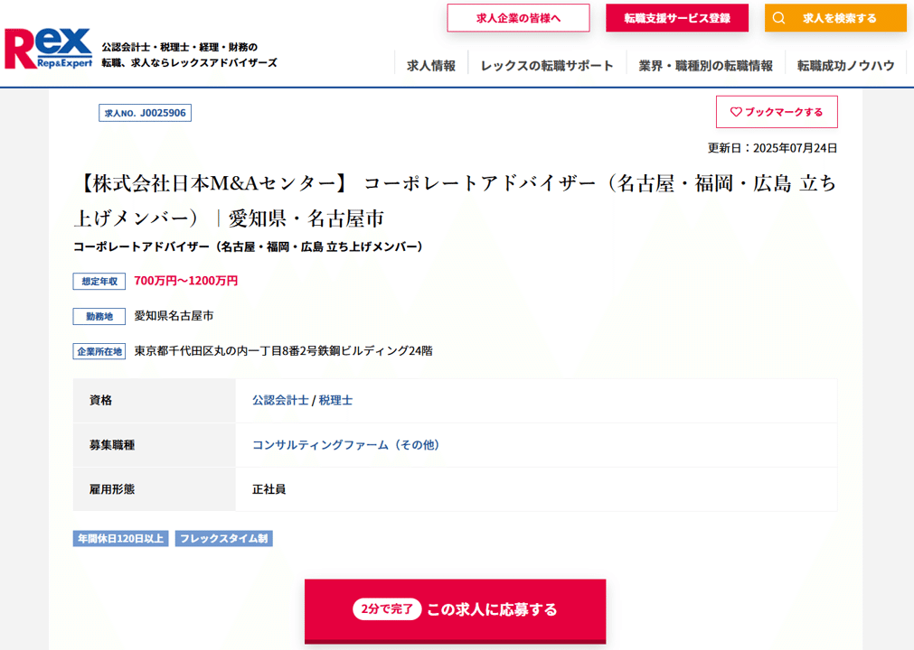
](https://www.career-adv.jp/job_search/tax/detail/J0025906/)*クリックすると求人（名古屋・福岡・広島）の詳細に飛びます*

## M&Aキャピタルパートナーズのパワポ資料

まずはM&Aキャピタルパートナーズ株式会社のパワポスライドを見ていきましょう。
M&Aキャピタルパートナーズは2005年に創業し、2013年に東証マザーズに上場、2014年に東証１部に鞍替えしたM&A仲介会社です。2016年に株式会社レコフをM&Aしています。

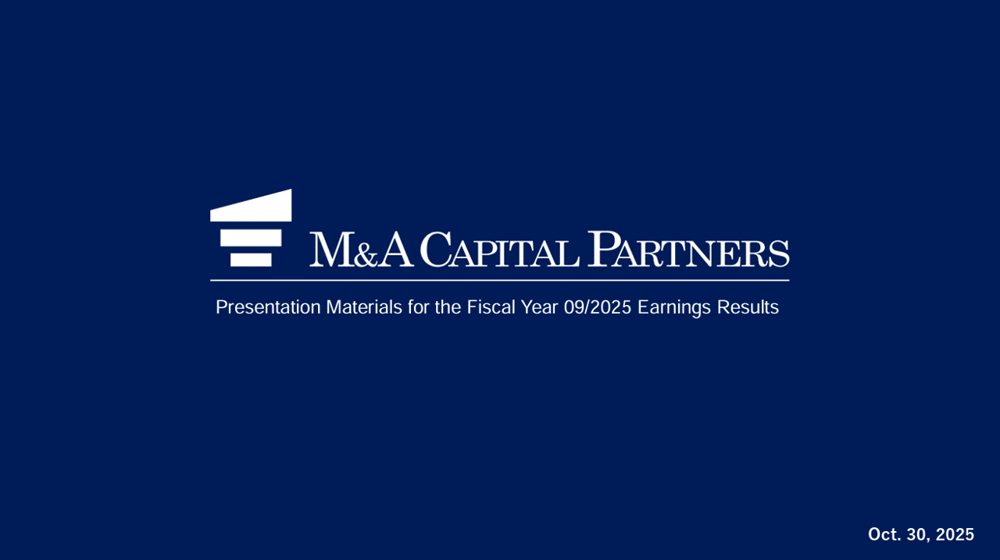
> 引用元：[> 2025年９月期　決算説明資料](https://www.ma-cp.com/pdf_files/202510311516261770792651.pdf)

*https://www.ma-cp.com/ir/settlement/*

### M&Aキャピタルパートナーズの経営理念

M&Aキャピタルパートナーズの経営理念は、「クライアントへの最大貢献と全従業員の幸せを求め世界最高峰の投信銀行を目指す」です。**投資銀行というワードを使い、M&A仲介にとどまらないアドバイザリー的な付加価値**の提供を目指していることをアピールしています。

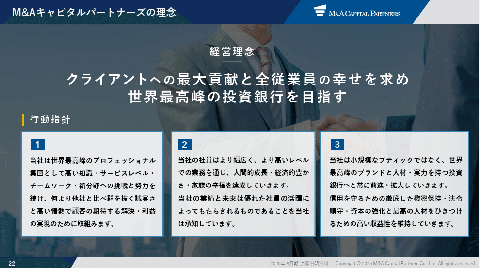

### M&Aキャピタルパートナーズの強み

M&Aキャピタルパートナーズの強みのスライドです。強みを7つに分解して、ブランド、生産性、手数料体系、ビジネスモデル、案件サイズ、採用力、教育力で自社がどのように強いのかを見せています。

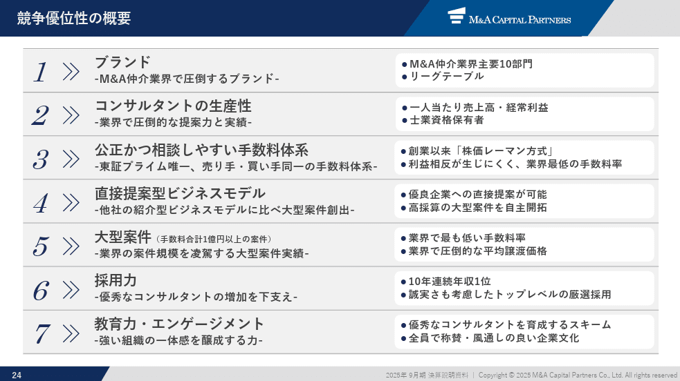
コンサルタントの提案力のカギである教育については、具体的な人材育成プログラムの紹介をすることで、自社のレベルの高さが伝わるようにしています。人材育成プログラムは各社のIR資料に入っているので、見比べると面白いですよ。

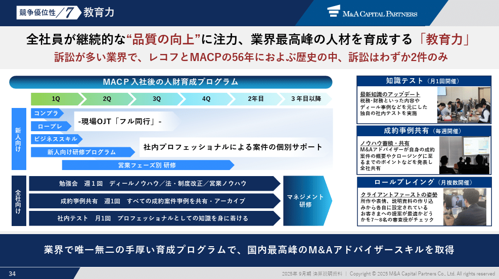

### M&Aキャピタルパートナーズの成長戦略

成長戦略のスライドにおいても、再び「世界最高峰の投資銀行へ」というメッセージが打ち出されています。スライドの背景もウォール街など金融大都市のイメージの画像になっています。

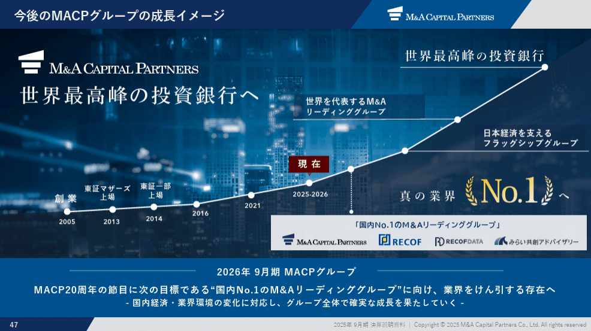
M&Aの周辺領域に成長投資をしていくということが説明されています。中心に既存事業を置いたうえで、具体ニーズをテキストでまとめ、既に他社と連携している領域と、これからやっていくべき領域を塗り分けています。

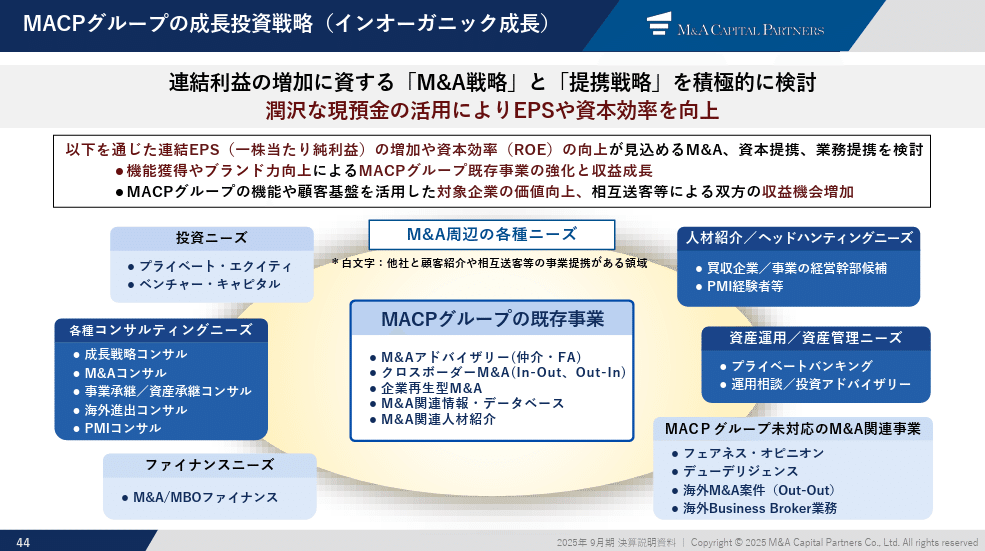

### M&Aキャピタルパートナーズの経営数字

M&Aキャピタルパートナーズの決算ハイライトのスライドです。売上高をはじめとする各種KPIについて、数字と前年同期比が入っています。結果のKPIとプロセスKPIを色分けすることで見やすい資料になっています。

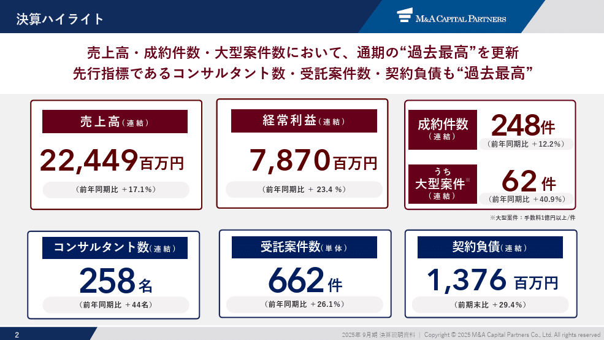
成約件数のページは左側にグラフ、右側に予想との差異と単体での成約件数を見せるという構成になっています。

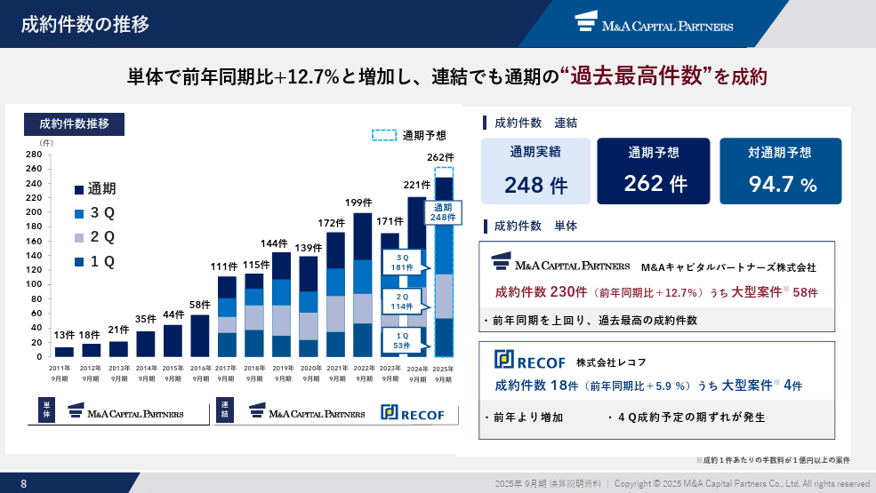

### M&Aキャピタルパートナーズの市場認識

M&Aキャピタルパートナーズの市場環境認識のページでは、中小企業の事業承継ニーズについて詳細に書かれています。**休廃業・解散件数、倒産件数、社長の平均年齢、企業の後継者不在率という４つの要素に紙面を４分割**したレイアウトで読み手がイメージをつけやすくしています。
前段で中小企業のM&Aが増えている背景を整理したうえで、次のページで市場規模を見せるという構成によって、市場の大きさが伝わるような工夫をしています。

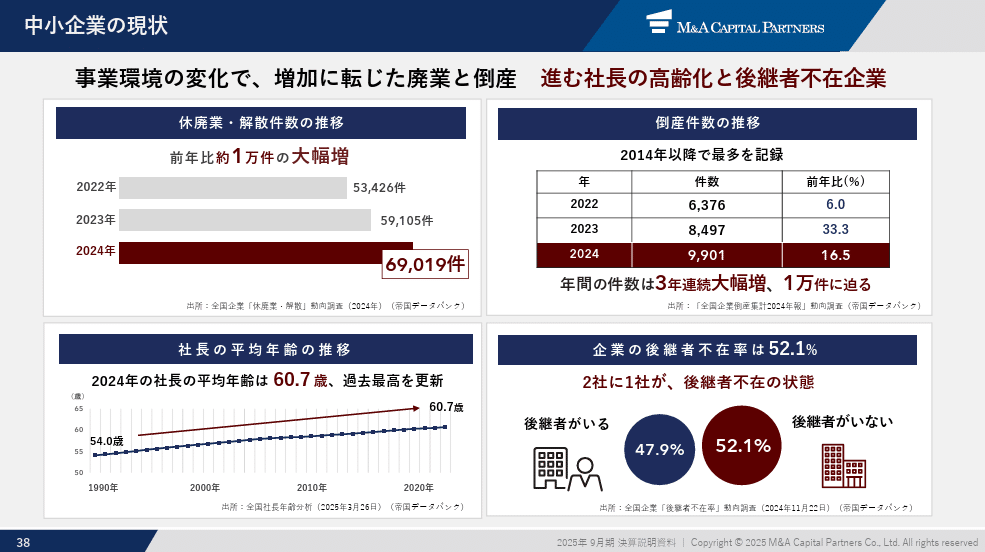

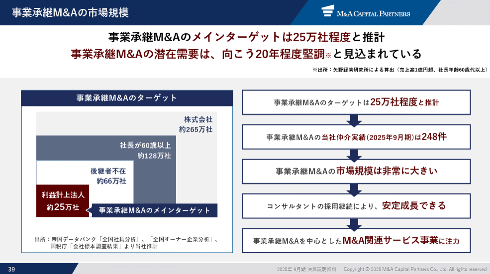
レックスアドバイザーズではM&Aキャピタルパートナーズの求人を取り扱っております。興味のある方はこちらから[エントリー](https://assets.st-note.com/img/1765019813-shlA1KJXLgC4TkfdUM0eWOiQ.png?width=2000&height=2000&fit=bounds&quality=85)ください。

[
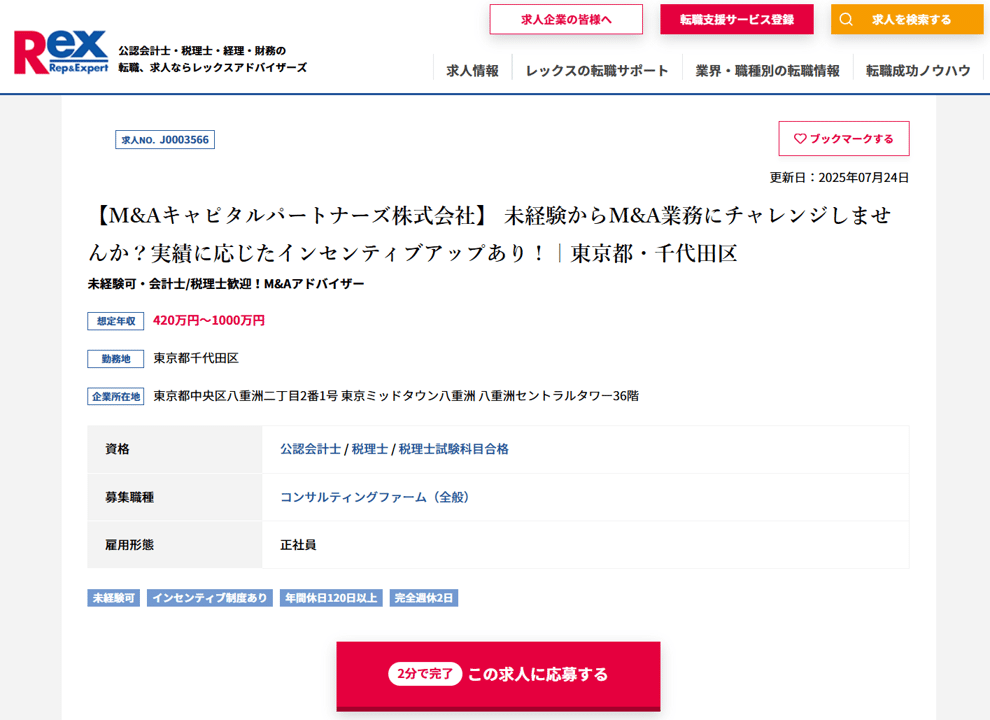
](https://www.career-adv.jp/job_search/tax/detail/J0003566/)*クリックすると求人の詳細に飛びます*

## M&A総研HDのパワポ資料

最後に株式会社M&A総研ホールディングスのパワーポイント資料を見ていきましょう！
M&A総研HDは2018年創業のM&A総合研究所を中核会社として急成長するM&A仲介会社です。2022年に東証マザーズ上場、2023年に東証１部鞍替えをしています。経営ビジョンとして「DX・AIを駆使したテクノロジーによりM&A業界を変革する」ことを掲げています。

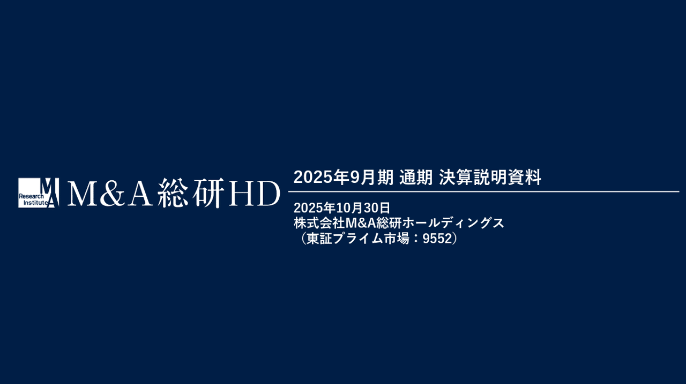
> 引用元：[> 2025年9月期 通期決算説明資料](https://s3-ap-northeast-1.amazonaws.com/cdn.ma-site.com/production/ir_materials/materials/000/000/237/%E5%85%AC%E8%A1%A8%E7%94%A8%E3%80%80%E6%97%A5%E6%9C%AC%E8%AA%9E%E7%89%88%E3%80%802025%E5%B9%B49%E6%9C%88%E6%9C%9F4Q.pdf?1765519509)

*https://masouken.com/holdings/ir/library/financial_statements*

### M&A総研HDの強み

M&A総合研究所の強みのスライドです。強みを「サービスの優位性」「採用の優位性」「下支えしている仕組みと考え方」の3つに分解して整理しています。**顕在化している強みと背景にある土台という見せ方**は競合他社と異なりますね。

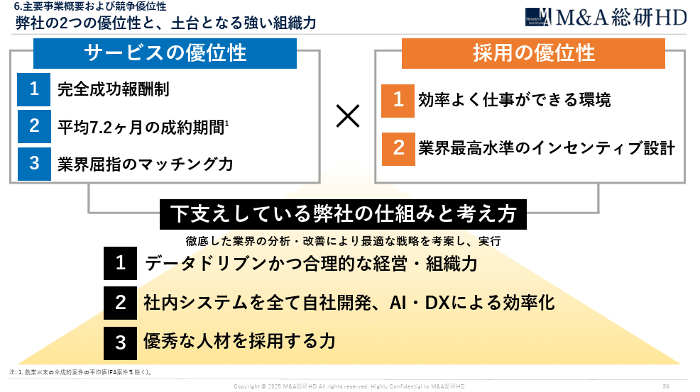
競合他社と同じように育成カリキュラムの話も入っています。他社に比べるとより具体的な内容がテキストベースで箇条書きにされています。

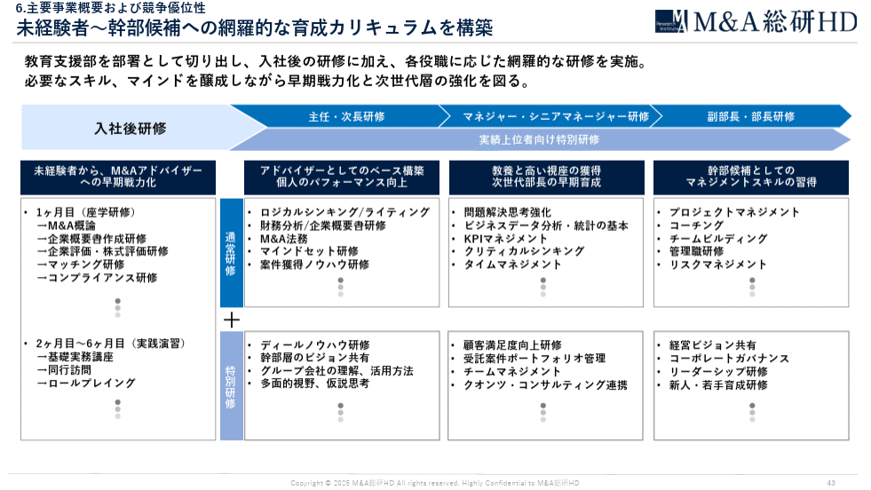

### M&A総研HDの成長戦略

M&A総合研究所の成長戦略のスライドです。**M&A仲介の事業に加えてコンサルティング事業を拡大**することで、M&A総研全体としての売上を増大化せていくことを目指しています。

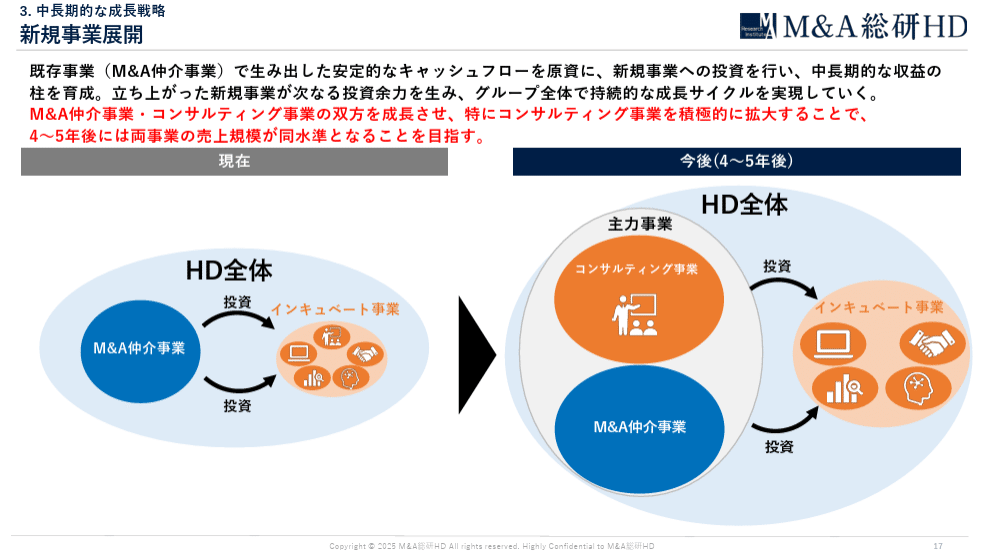
M&A仲介事業においては、**事業部ごとに異なる課題があり、それに対してどのように施策を打っていくか**を、表形式でまとめています。テキスト中心なので表の面積が大きいですが、その結果としての成長イメージを面積グラフで見せていますね。

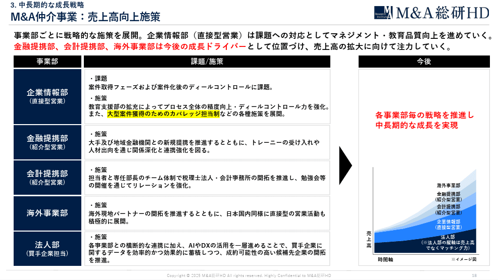
コンサルティング事業については、３つの優位性に基づき、コンサルタントが増えていくことが期待されています。

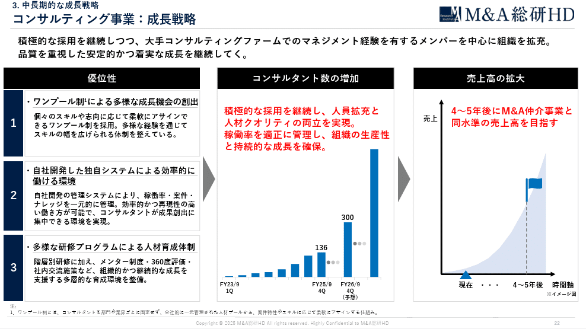

### M&A総研HDの経営数字

M&A総合研究所の経営数字のスライドです。経営数字のスライドは割とプレーンな表形式です。KPIにおいては、**M&Aアドバイザー数と1人当たり売上高、成約件数、成約単価、成約リードタイム**が置かれています。

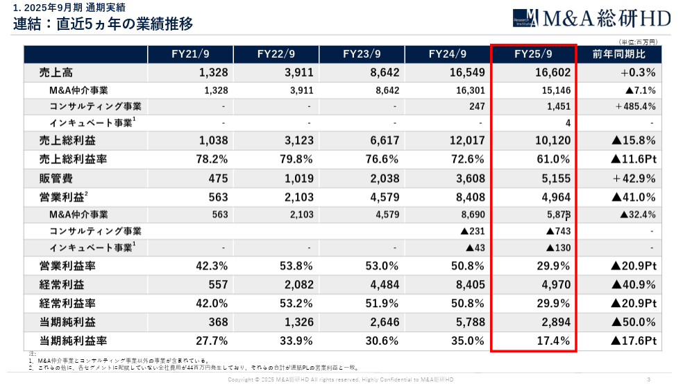

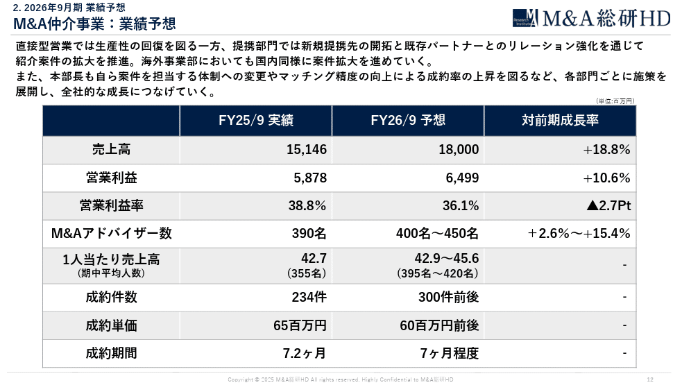

### M&A総研HDの市場環境認識

最後にM&A総合研究所の市場環境認識のスライドです。まず市場規模を対象企業と手数料単価から計算し、年数で割り戻すということをしています。

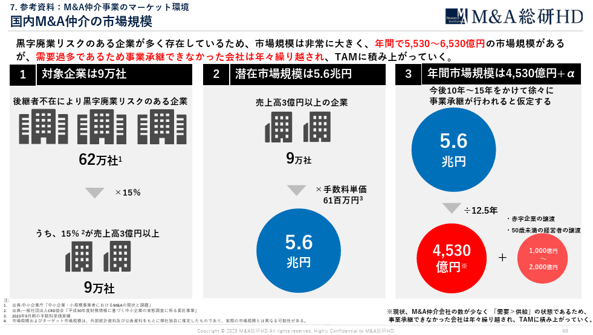
M&A仲介会社の競争環境についてもまとめています。M&A仲介事業者の捌くことのできる数よりも黒字廃業リスクのある会社の方が多く、需要が引き続き旺盛であるというメッセージを出しています。

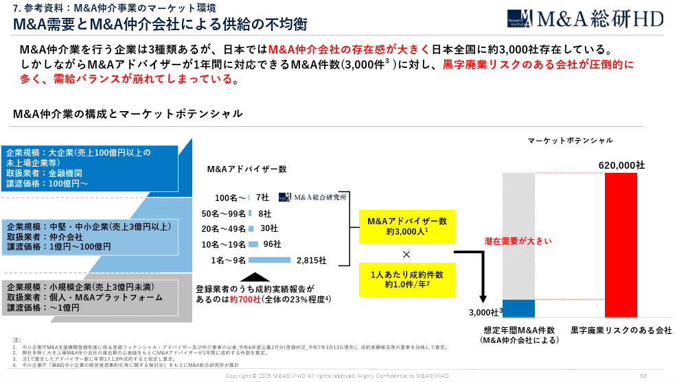

## M&Aコンサルへの転職を考えている方へ

パワポ研は株式会社レックスアドバイザーズが運営しています。
**レックスアドバイザーズは公認会計士や税理士の転職サポートに強みを持つ転職エージェント**です。日本M&AセンターやM&Aキャピタルパートナーズに興味がある方は、[無料相談フォーム](https://www.career-adv.jp/job_search/entryform_exp/?utm_source=note&utm_medium=referral&utm_campaign=note_pp)から相談してみてくださいね。M&A仲介コンサルタントのポジションだけでなく、上場支援やPMI支援のポジションなどもご紹介可能です。

## パワポ研オリジナルテンプレート

パワポ研では「ビジネスシーンで使える」パワーポイントテンプレートを公開しております。**M&Aに関しては、公認会計士やコンサルタントの方に向けた、財務デューデリジェンスに特化したテンプレート**もあります。下記にページのサンプルを載せておきますね。

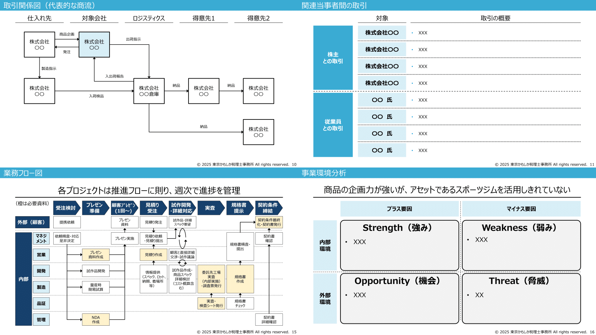
*パワポ研テンプレート「財務デューデリジェンスパッケージ」企業概要*

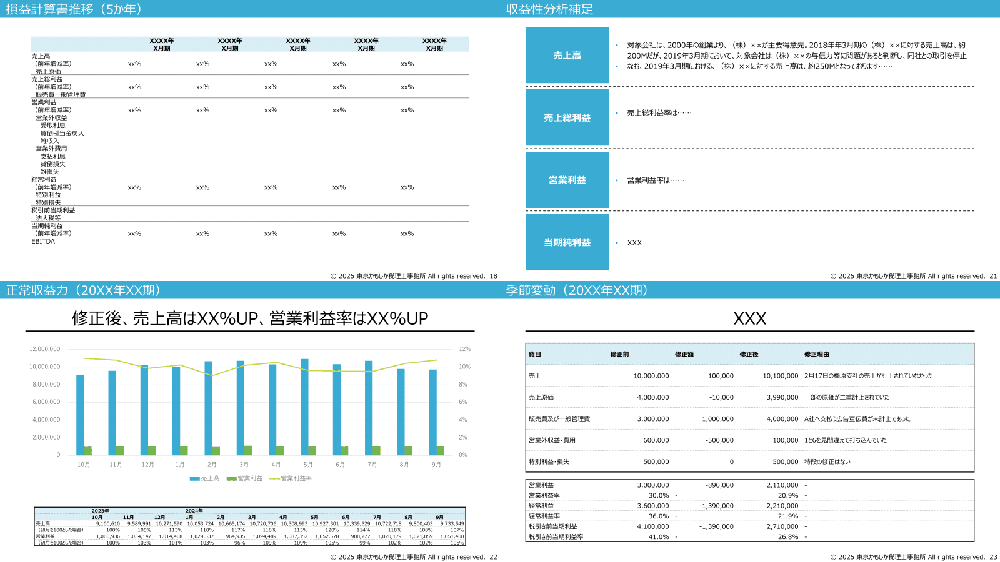
*パワポ研テンプレート「財務デューデリジェンスパッケージ」収益性分析*

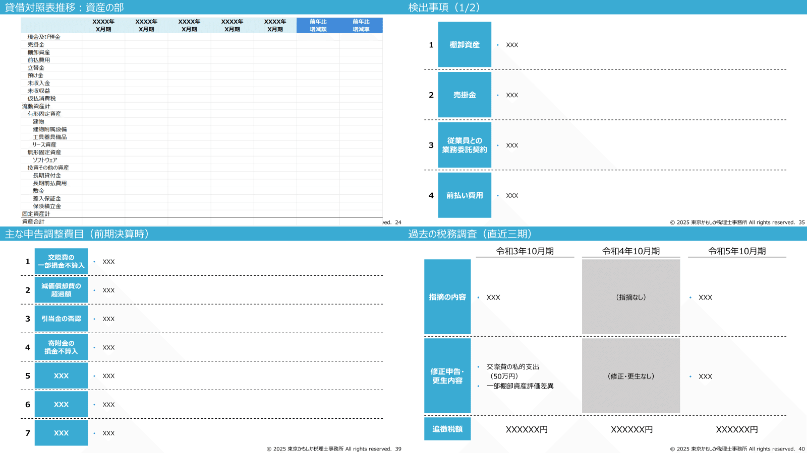
*パワポ研テンプレート「財務デューデリジェンスパッケージ」資産分析・税務申告*

デザインを整えるのみならず、**ロジックやストーリーを整理するのにも役立つパッケージになっております**ので、関心のある方は下記ページも併せてご覧ください！

[
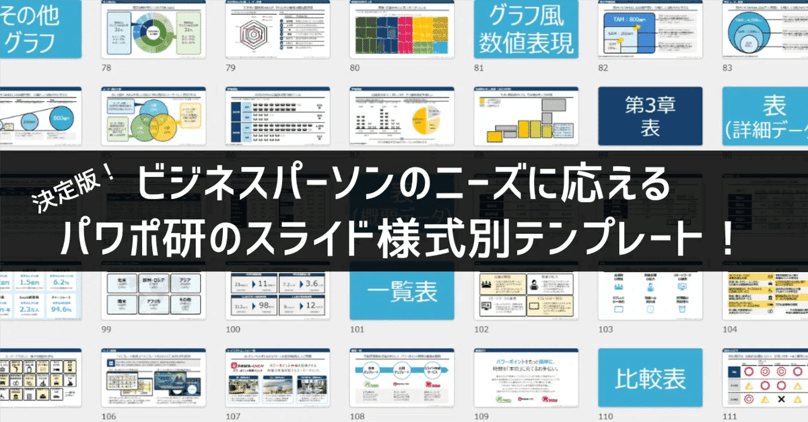
](https://note.com/powerpoint_jp/n/n50d02ec3162f)上記の記事のように、noteでは**フォローしているだけでビジネスにおける「資料作成のコツ」と「デザインのセンス」が身に付くアカウント**を目指して情報配信を行っています。
今後もコンスタントに記事を配信していく予定なので、関心のある方は是非アカウントのフォローをお願いします！

**> Template販売　**[> https://powerpointjp.stores.jp/](https://powerpointjp.stores.jp/%EF%BF%BCnote)
**> note　**[> パワポ研の資料作成術](https://note.com/powerpoint_jp/m/mc291407396da)
**> X（旧Twitter)　**[> https://twitter.com/powerpoint_jp](https://twitter.com/powerpoint_jp)

## レックスアドバイザーズからのお知らせ

パワポ研は株式会社レックスアドバイザーズが運営しています。
レックスアドバイザーズは**経営企画職や経営管理職に特化した転職エージェント**です。
上場企業や上場準備企業を中心に、**経営企画、IR、経理財務、法務、内部監査等の職種の求人**をご紹介しているほか、**CFOなどのコンフィデンシャル求人**もご紹介可能です。
またコンサルティングファームや監査法人、会計事務所の求人も豊富にあるため、プロフェッショナルファームを目指す方のご支援も得意です。
求人紹介やキャリア相談を希望の方は、[**無料転職サポート**](https://www.career-adv.jp/job_search/entryform_exp/)よりサービス利用登録をしてみてください。

*レックスアドバイザーズのサービスサイトはこちらから*

**> 求人をご希望の方　**[> 無料転職サポート](https://www.career-adv.jp/job_search/entryform_exp/)**
> 採用支援をご希望の方　**[> 採用サポート](https://www.career-adv.jp/request3/)
**> その他　**[> お問い合わせフォーム](https://www.rex-adv.co.jp/contact)
**> 書籍　**[> 注目企業の実例から学ぶパワポ作成術](https://www.amazon.co.jp/dp/4046060476)

