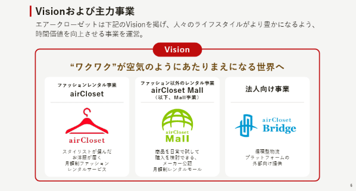
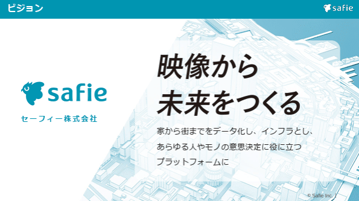
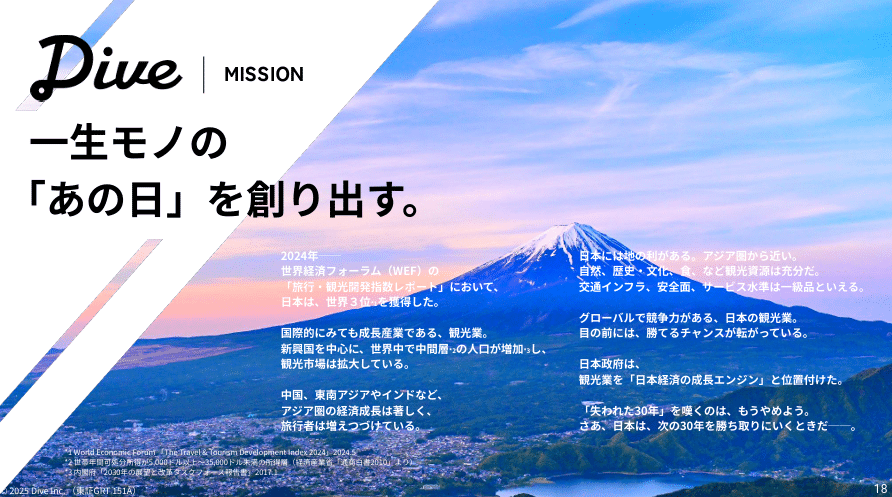
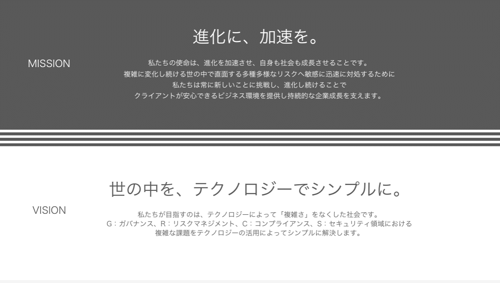
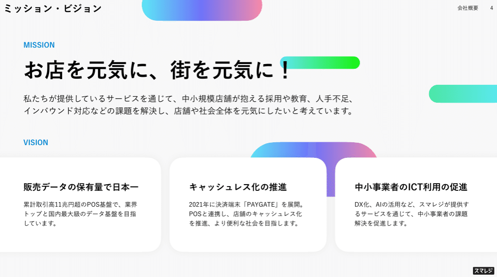
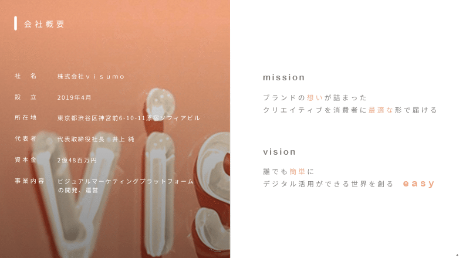
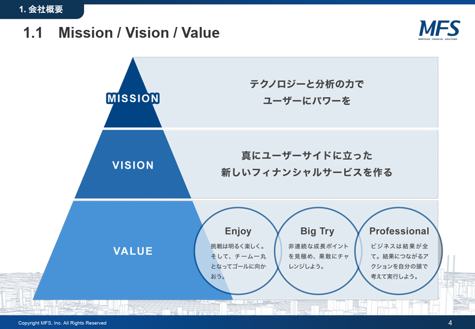
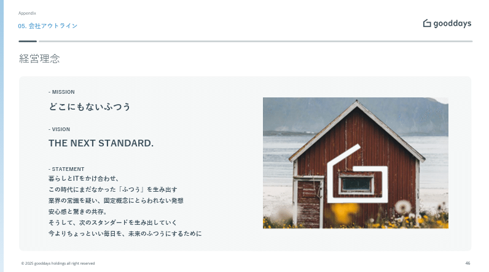
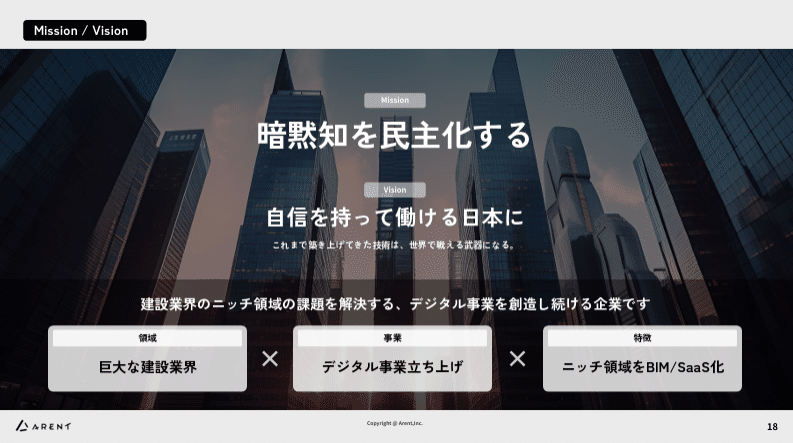
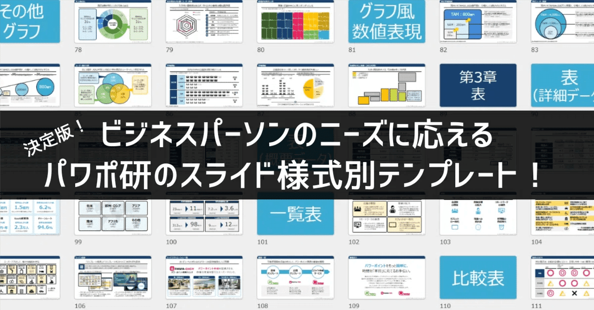

# 【マネしたい】パワポの「ミッション」「ビジョン」「バリュー」スライド９選 （2025年更新）

[note原文](https://note.com/powerpoint_jp/n/nb17a4621ac07)

みなさんこんにちは。
資料デザインのリサーチや分析に取り組むパワーポイントのスペシャリスト、パワポ研です。

突然ですが、「パーパス経営」という言葉はご存じでしょうか。パーパス（Purpose）は、目的や意図という意味の英単語ですが、経営の文脈において「存在意義」という意味で使われます。つまり**パーパス経営というのは、「社会に対する存在意義を掲げて経営を行う」こと**です。経営理念の最上位にパーパスがある、というイメージですね。

例えばパーパス経営で有名なSonyのパーパスは、**クリエイティビティとテクノロジーの力で、世界を感動で満たす。**となっています。
経営の方針を定めたり、M&Aをしたりするにあたって、「それによって世界は感動で満たされるのか？」という問いを常に繰り返していくということですね。

「パーパス経営」とまではいかなくても、**企業経営において企業理念や経営理念の重要性はますます高まっています**。特に上場企業においては、投資家の判断基準として、優れた経営理念を持っているか、またそれが実践されているかを見られるので、経営理念を対外的に示していく必要があります。

そこで今回は、経営理念を示す「ミッション」「ビジョン」「バリュー
」のパワポスライドに焦点を当て、上場企業のIR資料から参考になりそうなものを抜粋して紹介していきます。

なおテーマ別パワーポイントシリーズは、これからどんどん最新事例に資料例をアップデートしていく予定です。気になる方は下のまとめページをチェックしておいてくださいね。

## ミッション・ビジョン・バリューとは

まずはさらっと、企業理念を構成する「ミッション」「ビジョン」「バリュー」（通称MVV）について整理しておきましょう。またスライドの中で一緒に語られることのある「ステートメント」にも触れておきますね。

- **ミッション：組織として果たすべき使命**

- **ビジョン：組織としての理想の姿**

- **バリュー：組織として守るべき価値観**

- **ステートメント：組織としての行動指針や宣言**

ミッションが使命、ビジョンが理想の姿、バリューが価値観なので、ミッションビジョンバリューは一貫性が一貫性があります。
ミッションが最上位、ミッションが実現した状態を定義したのがビジョン、実現を支える価値観がバリュー、価値観を行動指針に落としたものがステートメントです。

## 「ミッション」「ビジョン」「バリュー」スライドの使い方

ミッション・ビジョン・バリューを示すことは、投資家や顧客へのアピールに加えて、従業員に対するインナーブランディングにもなります。**魅力的な経営理念を掲げられれば、採用ブランディングの観点**でも効果的です。

よく使われるのは「事業計画及び成長可能性に関する資料」などのプレゼンテーション資料です。経営理念は企業概要の後に入ることが多く、資料の序盤やAppendixに入ります。テキストが多いスライドなので**「何を伝えたいのか？」を明確に言語化し、適切なレイアウトで表現**することが重要です。

また企業によって、ミッションのみのスライド、ミッションビジョンバリュー（MVV）のスライド、会社概要と合わせて1枚のスライドなど、見せ方は様々です。今回は「ミッションのみ」「ミッションとビジョン」「ミッションとビジョンとバリュー」の3パターンに分けて紹介しますね。

*おまけ）ビジョンと事業概要がセットになっているスライド*

> 引用元：[> 2025年6月期　決算説明資料](https://ssl4.eir-parts.net/doc/9557/tdnet/2676375/00.pdf)

*https://corp.air-closet.com/ir/library/presentation/*

## ミッションビジョン単体のスライド見本３選

### Note株式会社のパワポ

ミッション単体のスライドを作る場合、ミッションや事業内容をイメージできるようなビジュアルを入れたデザインにするのが一般的です。
Noteの事例では、真ん中にミッションを配置し周辺をミッションに関するイラストで囲んでいます。**左右の余白を大いに活用し、視覚を中央に集めることで、ミッションを際立たせる**ことに成功しています。
Noteのようにミッション自体がイメージしやすい場合、有効なデザインといえますね。

> 引用元：[> 事業計画及び成長可能性に関する事項](https://contents.xj-storage.jp/xcontents/AS05592/1ef48ab9/bad7/4875/a87f/f4508f778fd7/140120250213572773.pdf)

*https://ir.note.jp/library*

### セーフィー株式会社のパワポ

次のスライドは、左側に企業ロゴ、右側にビジョンとその説明を入れているデザインです。枠無しで透過の**ミッションの背景にイラストを入れることでおしゃれなデザイン**になっています。
「映像から未来を作る」といったビジョンの場合、どういった事業なのかがわかりづらいため、**イラストや写真や文字で具体的なイメージを補完することが必要**です。ここでは「家から町までをデータ化する」という文字と都市のイラストで具体が伝わるようになっています。
[【マネしたい】戦略が伝わるパワポの「事業紹介」スライド９選](https://note.com/powerpoint_jp/n/nabc9e703e7b9#9754c043-89d0-4208-9f9e-8be694cd1094)でも紹介しましたが、セーフィーは青緑のデザインですっきりとパワーポイントを見せるのが非常にうまいですね。

> 引用元：[> 成長可能性資料](https://ssl4.eir-parts.net/doc/4375/tdnet/2584982/00.pdf)

*https://safie.co.jp/ir/library/*

### 株式会社ダイブのパワポ

次のスライドは、左上に企業ロゴとミッションを入れ、右側にストーリーを入れています。メインビジュアルは美しい朝焼けの写真です。このパワポは様々点にこだわりが感じられますね。
**美しい写真をできるだけクリアに見せるためにロゴとミッションは左上に寄せ**、左下まで山のすそ野が見えるようにしています。右側には白抜きの文字でストーリーが書いてあり、メインはあくまでで写真だが興味を持ったらストーリーをどうぞ、という感じです。
[【マネしたい】要点がまとまっているパワポの「エグゼクティブサマリー」スライド９選](https://note.com/powerpoint_jp/n/nfa3e08dcd6f5#dedbac65-ea90-4308-915b-08f002ff3e04)でも取り上げましたが、ダイブはリゾートをイメージするような色遣いですっきりと見せるパワーポイントが非常にうまいですね。

> 引用元：[> 2025年6月期 通期決算説明資料（事業計画及び成長可能性に関する事項）](https://ssl4.eir-parts.net/doc/151A/tdnet/2671665/00.pdf)

*https://dive.design/ir/library/presentation*

## ミッションとビジョンのスライド見本３選

### GRCS株式会社のパワポ

一つ目のスライドは、上半分にミッション、下半分にビジョンを記載しています。特徴的なのは、上は黒地に白抜き、下は白地に黒文字にすることで、スタイリッシュに見せている点です。
比較的文字が多いパワポではあるものの、**モノクロで最もインパクトがあるデザイン**で、全体として見栄えの良い構成になっています。特に、他のスライドで画像やグラフを多用している場合には、効果的な手法ですね。

> 引用元：[> 2024年11月期 決算説明資料](https://ssl4.eir-parts.net/doc/9250/tdnet/2548797/00.pdf)

*https://www.grcs.co.jp/ir/library/presentation*

### 株式会社スマレジのパワポ

次のスライドも上下の構成ですが、下にビジョンが3つ挙げられています。こうした構成の場合、**ミッションとそれを実現する3つの柱というような形で、階層構造にするのが直感的に理解しやすい**ですね。
ミッションが理解しやすい一方で、どういったサービスなのかまではわからないところ、**下の3つのビジョンを見ることで、何をしている会社なのかがわかる**ようになっています。
またミッションは灰色の背景に記載する一方、ビジョンは枠無しの白背景の箱を3つ用意している点も、見やすいパワポにするための細かな工夫が光っています。

> 引用元：[> 事業計画及び成長可能性に関する事項](https://corp.smaregi.jp/ir/library/FY2025_Business_Plan_and_Growth_Potential.pdf)

*https://corp.smaregi.jp/ir/management/growth-potential.php*

### 株式会社Visumoのパワポ

*お*

> 引用元：[> 事業計画及び成長可能性に関する事項](https://ssl4.eir-parts.net/doc/303A/tdnet/2648534/00.pdf)

*https://visumo.asia/ir/news*

最後のスライドは会社概要とミッションビジョンを左右に配置しています。**ミッションもビジョンもただただ壮大なものを作ればいいというわけではありません**。社員が納得してそこに向かえることが重要なので、地に足をついたミッションやビジョンを掲げる会社も多いです。
そうした場合、無理に経営理念のミッションビジョンバリューのページを作らず、**会社概要とセットにした方がかえって効果的**な場合もあります。このスライドは左の背景でオレンジを使っていますが、右のミッションとバリューの強調ポイントに太字のオレンジにしており、見やすいパワポにする工夫がみられます。

## ミッションとビジョンとバリューのスライド見本３選

### 株式会社MFSのパワポ

ここからはMVVをすべて入れているスライドを見ていきます。
最もベーシックなのは、このように三角形でミッションビジョンバリューをみせるデザインですね。**ミッションの色をより濃く、グラデーションでバリューは薄く**しています。
このスライドの良い点は、バリューの中身を3つの円で表現している点で、**テキスト中心のスライドながらも動きがある**パワポに見せています。

> 引用元：[> 2025年6月期 通期決算説明会資料](https://contents.xj-storage.jp/xcontents/AS05136/517ef57e/b0a4/4c9c/bfb7/a6875b2363b4/140120250813540090.pdf)

*https://ir.mortgagefss.jp/presentations/*

### gooddaysホールディングス株式会社のパワポ

次のスライドは左にミッションビジョンそしてステートメント、右に写真を載せることで、シンプルながらも経営理念が伝わりやすいスライドになっています。
**経営理念が抽象的な場合、MVVやミッションビジョンステートメントのスライドだとどうしても具体な部分が伝わりづらい**ことがあります。このスライドでは暮らしとITに関する事業を行っていることを伝えると同時に、コーポレートイメージのGが入り、おしゃれなデザインに仕上がっています。

> 引用元：[> 2025年３月期決算説明資料](https://contents.xj-storage.jp/xcontents/AS04564/394f95ee/8a66/4784/a366/79ac21a74130/140120250512543588.pdf)

*https://gooddays.jp/ir/library/presentation/*

### Arent株式会社のパワポ

最後のスライドもミッションビジョンバリューの階層構造ですが、ミッションを強調しつつバリューの部分の具体もわかりやすい、高度なスライドとなっています。
まず**文字サイズですが、ミッションが一番大きく、ビジョン、バリューと進むにつれて小さく**なっています。
次に、バリューを領域と事業と特徴の掛け算で示しており、ここだけ3つの箱を使って具体がわかりやすいようにしています。
また背景に建設をイメージさせるビル群を使いつつ、白文字で見やすく仕上げたり、一番下は一度黒の透過の背景を使ったうえで箱を置くなど、細かい工夫がされています。
Arentは[【マネしたい】見やすいパワポの「円グラフ」スライド９選](https://note.com/powerpoint_jp/n/n6bafe5e67864#3a12d4a3-d99b-48fc-8772-3cd87d8950b3)でも取り上げた通り、ロジカルかつデザインにも優れたパワーポイントの宝庫なので、今後も是非参考にしていきたいですね。

> 引用元：[> 2025年6月期決算説明資料](https://ssl4.eir-parts.net/doc/5254/tdnet/2669039/00.pdf)

*https://arent.co.jp/ir/library/presentation/*

## パワポの「ミッション」「ビジョン」「バリュー」スライド９選のまとめ

いかがだったでしょうか。**ミッションビジョンバリューのスライドは、標語と説明が混在する形式が多く、また、テキストのみで表現されることがほとんど**です。配色やテキストの位置（スライド構成）で読み手の印象が大きくことなってしまうため、「何を伝えたいのか？」を明確に言語化し、適切なレイアウトで表現することが求められます。各社でレイアウトも大きく異なっていると思いますので、ぜひ取り入れやすいものを参考にしてみて下さい。

## パワポ研オリジナルテンプレート

パワポ研では、「ビジネスシーンで使える」パワーポイントテンプレートを公開しております。デザインを整えるのみならず、**ロジックやストーリーを整理するのにも役立つパッケージ**になっておりますので、関心のある方は下記ページも併せてご覧ください！

上記の記事のように、noteでは**フォローしているだけでビジネスにおける「資料作成のコツ」と「デザインのセンス」が身に付くアカウント**を目指して情報配信を行っています。
今後もコンスタントに記事を配信していく予定なので、関心のある方は是非アカウントのフォローをお願いします！

**> Template販売　**[> https://powerpointjp.stores.jp/](https://powerpointjp.stores.jp/%EF%BF%BCnote)
**> note　**[> パワポ研の資料作成術](https://note.com/powerpoint_jp/m/mc291407396da)
**> X（旧Twitter)　**[> https://twitter.com/powerpoint_jp](https://twitter.com/powerpoint_jp)

## レックスアドバイザーズからのお知らせ

パワポ研は株式会社レックスアドバイザーズが運営しています。
レックスアドバイザーズは**経営企画職や経営管理職に特化した転職エージェント**です。
上場企業や上場準備企業を中心に、**経営企画、IR、経理財務、法務、内部監査等の職種の求人**をご紹介しているほか、**CFOなどのコンフィデンシャル求人**もご紹介可能です。
またコンサルティングファームや監査法人、会計事務所の求人も豊富にあるため、プロフェッショナルファームを目指す方のご支援も得意です。
求人紹介やキャリア相談を希望の方は、[**無料転職サポート**](https://www.career-adv.jp/job_search/entryform_exp/)よりサービス利用登録をしてみてください。

*レックスアドバイザーズのサービスサイトはこちら*

**> 求人をご希望の方　**[> 無料転職サポート](https://www.career-adv.jp/job_search/entryform_exp/)**
> 採用支援をご希望の方　**[> 採用サポート](https://www.career-adv.jp/request3/)
**> その他　**[> お問い合わせフォーム](https://www.rex-adv.co.jp/contact)
**> 書籍　**[> 注目企業の実例から学ぶパワポ作成術](https://www.amazon.co.jp/dp/4046060476)

