# 【BIG4のパワポ紹介】デロイトトーマツグループのプレゼン資料（2025年）

[note原文](https://note.com/powerpoint_jp/n/nb285a73c1c4d)

みなさんこんにちは。
資料デザインのリサーチや分析に取り組むパワーポイントのスペシャリスト、パワポ研です。

このシリーズでは**BIG4のパワーポイント資料に焦点を当てて、デロイトトーマツ、PwC、KPMG、EYのパワポを紹介**していきます。
各グループとも、コンサルティングファーム、フィナンシャルアドバイザリーサービス（FAS）、監査法人、税理士法人を持っていますので、それぞれのファンクションのスライドを紹介していきますね。これまでに紹介したNoteは以下の通りです。

第一弾はデロイトトーマツグループです！今回は４つの法人のパワーポイントを見ていきます。

- デロイトトーマツコンサルティング合同会社

- デロイトトーマツフィナンシャルアドバイザリー合同会社

- 有限責任監査法人トーマツ

- デロイトトーマツ税理士法人

資料はいつものように、[経産省の委託調査報告書](https://www.meti.go.jp/topic/data/e90622aj.html)から引用しております。

## デロイトトーマツコンサルティング合同会社の報告書

まずはデロイトトーマツコンサルティング、通称DTCの調査報告資料を見ていきましょう。ここでは「将来のAAM（Advanced Air Mobility）市場獲得・参入可能性検討事業」の最終報告書を見ていきます。

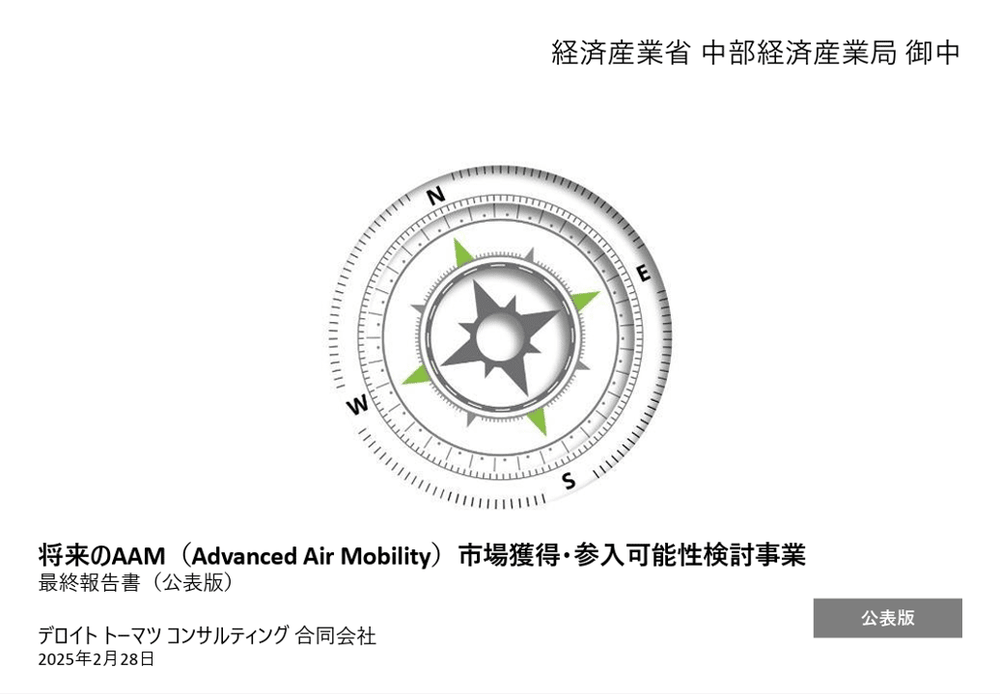
> 引用元：[> 令和６年度将来のAAM（Advanced Air Mobility）市場獲得・参入可能性検討事業最終報告書（公表版）](https://www.meti.go.jp/meti_lib/report/2024FY/000037.pdf)

*https://www.meti.go.jp/meti_lib/report/2024FY/itakuichiran2024FY.pdf*

### 目的と論点のスライド

まずは目的と論点のパワポから見ていきましょう。この事業は調査に加えて検討会のファシリテーションも行っているため、調査事業及び検討会開催の目的と論点が記載されています。

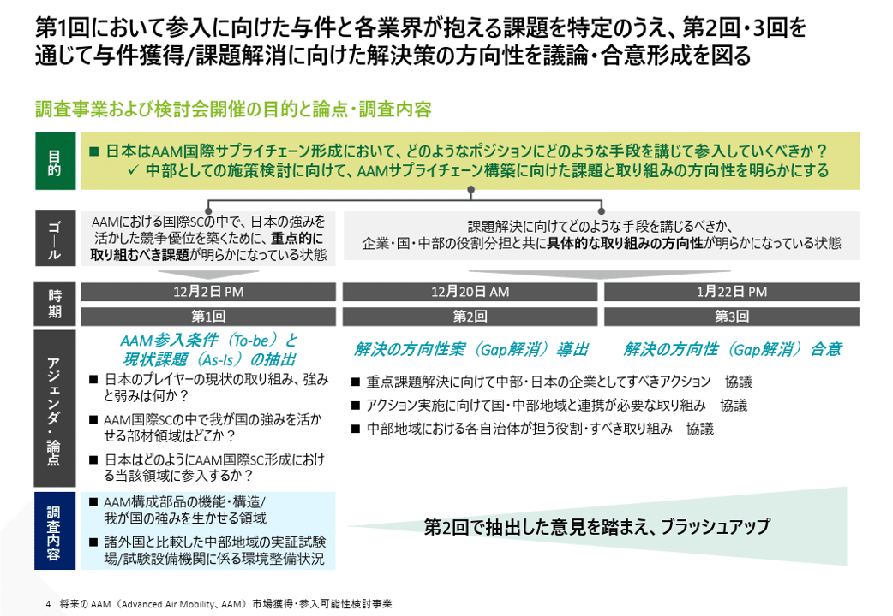
パワーポイント上部はメッセージのみでサマリー、その下にスライドタイトルと目的とゴール、ゴールを踏まえた検討スケジュールとアジェンダ及び論点、それを踏まえた調査内容という構成になっています。
**アンサーファーストかつボディも構造化されていて見やすいスライドといえますね。**

配色でいうと、ボディのタイトルと目的はデロイトトーマツのカラーである緑色、ゴールからアジェンダまでは黒ベース、調査内容は青色炉では以来としています。ゴールからアジェンダはテキスト中心なので、アジェンダ・論点のサマリーを青色にすることでバランスを取っています。

### 検討テーマのスライド

検討テーマのスライドです。調査事業において何の議論をするのかをビジュアルで見せています。

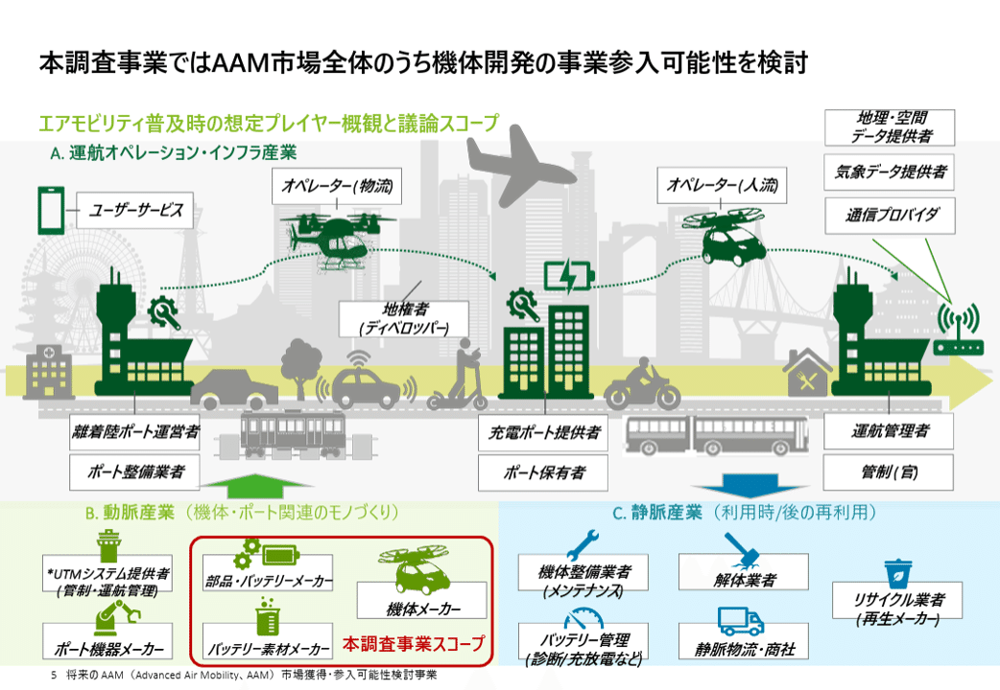
プレゼンテーションにおいては、「何の議論をするのか」という、スコープの話が重要です。このスライドでは、エアモビリティ普及時の想定プレイヤーの全体像をイラストで見せ、その中のどの部分を議論するのかを見せています。

このスライドは表で作ることもできますが、**エアモビリティという新しい領域の全体像をテキストでつかむのは中々難しいので、このようにイラストで見せるのは有効な手段**といえますね。

### 課題仮説のスライド

コンサルティング会社のプレゼンテーションの肝である課題仮説のスライドを見ていきましょう。課題の立て方ひとつで調査のクオリティは大きく変わるので、非常に重要なスライドです。

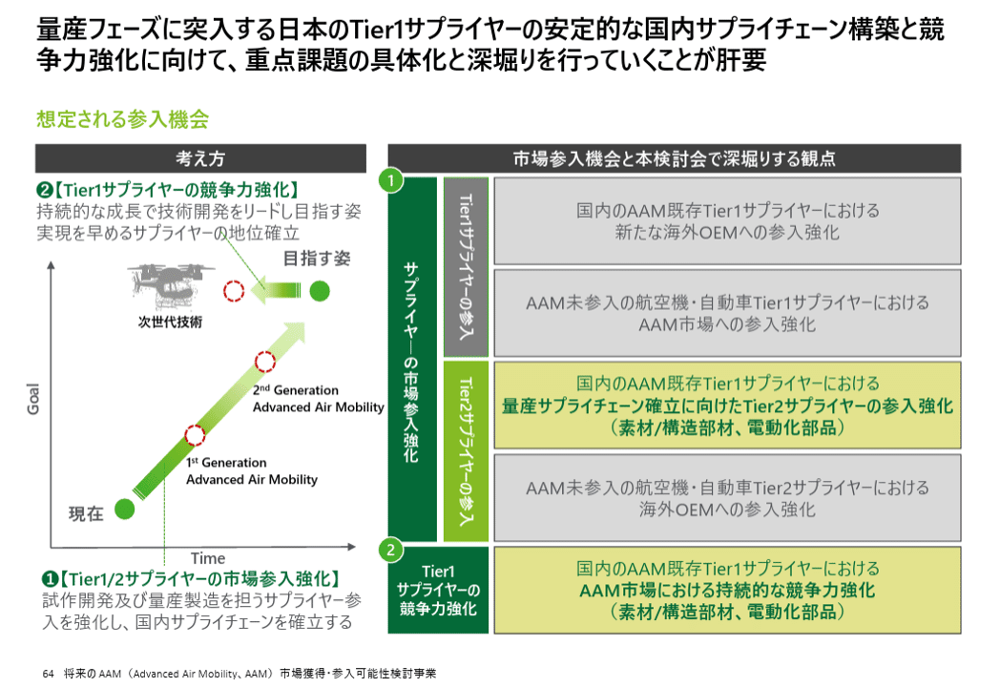
Tier1サプライヤーの安定的な国内サプライチェーンの構築に向けて、参入強化と競争力強化が重要であることが説明されているスライドです。

左側に考え方、右側に観点の全体像を示して重要なものをハイライトするという構成になっています。**考え方を時間軸とゴールのマトリックスでシンプルにまとめ、右側の観点に注目させる構図**が読みやすいですね。

メッセージにおいてはいきなり右側のハイライト部分を説明してしまうと読み手がついてこれなくなる可能性があるので、「重点課題の具体化と深堀りを行っていくことが重要」にとどめています。

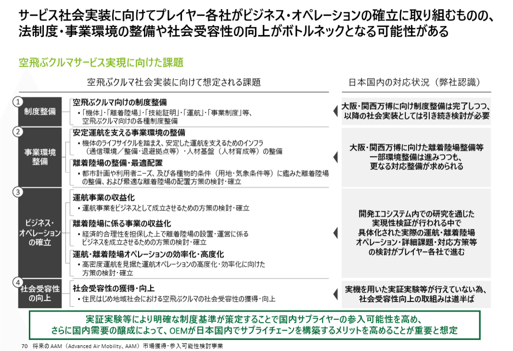
こちらのページは表形式で課題と対応状況の仮説を整理しています。
**課題を大カテゴリと小カテゴリに分けて構造的に見せるのはコンサルティング会社の基本スライド**という感じです。
メッセージラインが上下にあり、上が問い、下が答えの仮説という構造です。調査資料なのでこの構造になっていますが、民間向けの報告資料では、下の答えの仮説をトップラインメッセージに持ってくることが多いです。

### 分析内容のスライド

分析内容のスライドを3枚ほど見ていきましょう。比較のスライドや相関図のスライド、散布図グラフのスライド等、参考になるスライドが多いです。

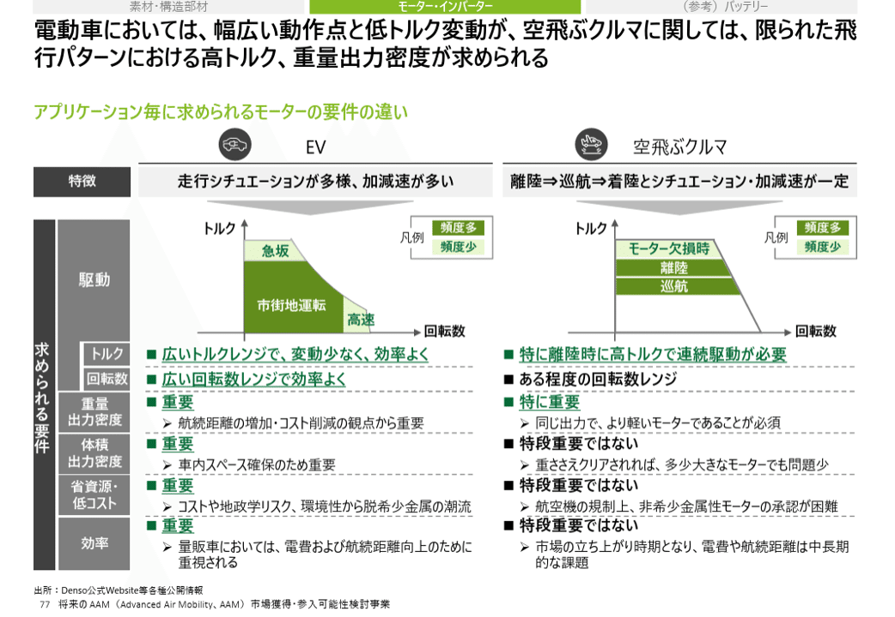
EVと空飛ぶ車のモーター要件の違いを比較したスライドです。
モーター要件を決めるトルクと回転数を軸に取り、求められる性能が違うことをマトリックスの比較で見せています。
もちろんマトリックス図だけではわからないので、要素を左のブロックで整理して、それぞれに対して「重要か否か」とその理由を記載しています。
**マトリックスと表を組み合わせたユニークな比較スライド**なので覚えておいてもよいでしょう。

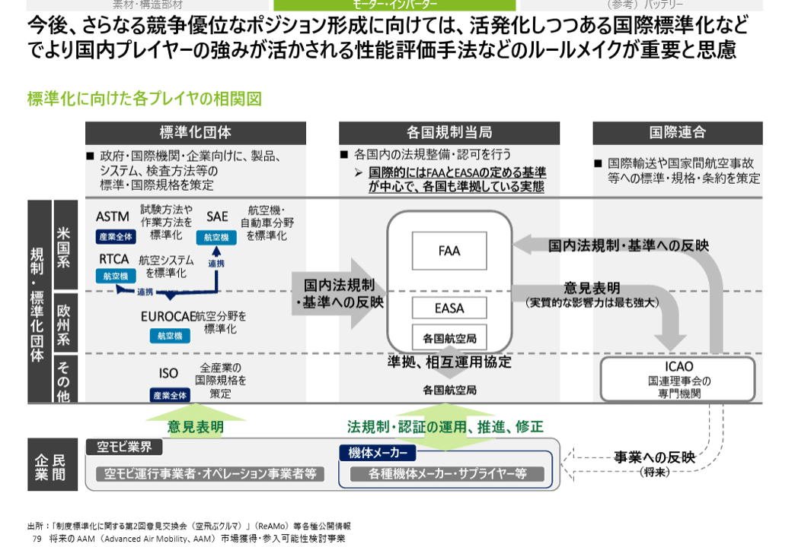
標準化に向けた各プレイヤーの相関図を、「標準化団体」「規制当局」「国際連合」というプレイヤーのカテゴリーと、「米国系」「欧州系」「その他」というエリアのカテゴリーで分けて示しています。
スライド自体はややビジーなものの、**構造がわかりやすいので、どのようなプレイヤーがいて、どのような関係になっているのかはざっくりわかる**よいスライドです。

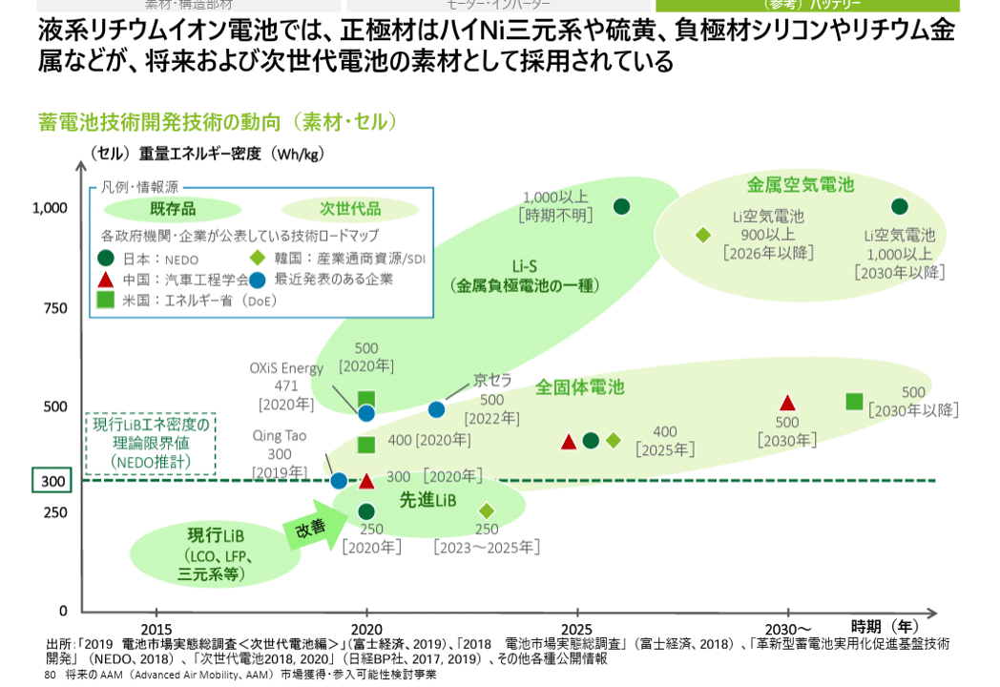
蓄電池技術の開発動向をまとめた散布図グラフです。
横軸に実現時期、縦軸に性能を表す重量エネルギー密度を取り、全個体電池、金属空気電池、Li-S、先進LiBといったカテゴリーごとの状況を可視化しています。
**技術カテゴリーに加えて、各国の機関の見立てを入れることで各国の戦略も見えるようになっており**、散布図をうまく使ったスライドといえます。

### 結論のスライド

最後に調査報告資料のサマリーである、結論のスライドを見ていきましょう。ここでは検討会で出た課題感をまとめています。

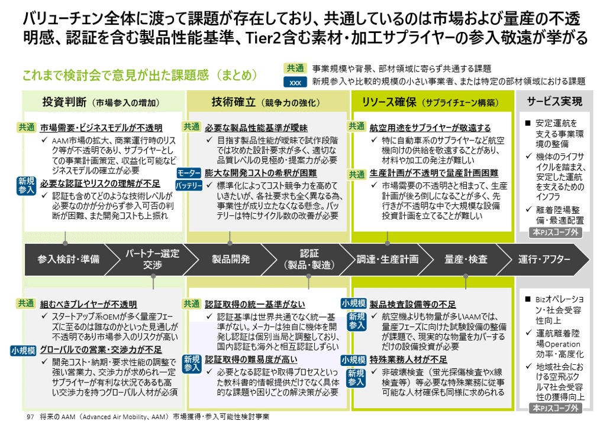
真ん中にAAMの参入に向けたのアクションの流れを取り、それぞれにおける課題を、マーケットの共通課題と、個別課題に分けて記載しています。
配色としては、下流ほど濃い緑に近づいていあ須賀、ここは見やすさ重視という感じで特に意味はなさそうです。
**各個別課題に「新規参入」「モーター」「バッテリー」「小規模」といったラベルを付けるのは何の話をしているのか一目瞭然になるので良いですね**。

なおデロイトトーマツコンサルティングは他ファームからの転職者も多いので、作成者の元ファームのスライドの癖が反映されていることも多く、資料によってテイストがだいぶ変わります。笑

## デロイトトーマツフィナンシャルアドバイザリー合同会社の報告書

次はデロイトトーマツフィナンシャルアドバイザリー、通称DTFAの調査報告資料を見ていきましょう。ここでは「令和6年度成長志向の高い関西中堅企業のM&A実態調査事業」の最終報告書を見ていきます。

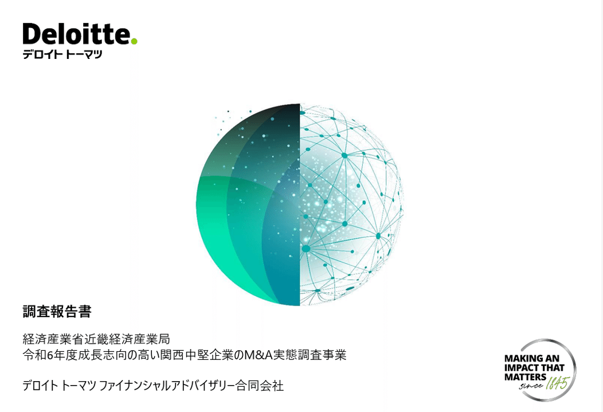
> 引用元：[> 令和6年度成長志向の高い関西中堅企業のM&A実態調査事業](https://www.meti.go.jp/meti_lib/report/2024FY/000740.pdf)

*https://www.meti.go.jp/meti_lib/report/2024FY/itakuichiran2024FY.pdf*

### 目的と論点のスライド

まずは目的と論点です。文字ベースで４ページにわたって背景と目的が記載されています。

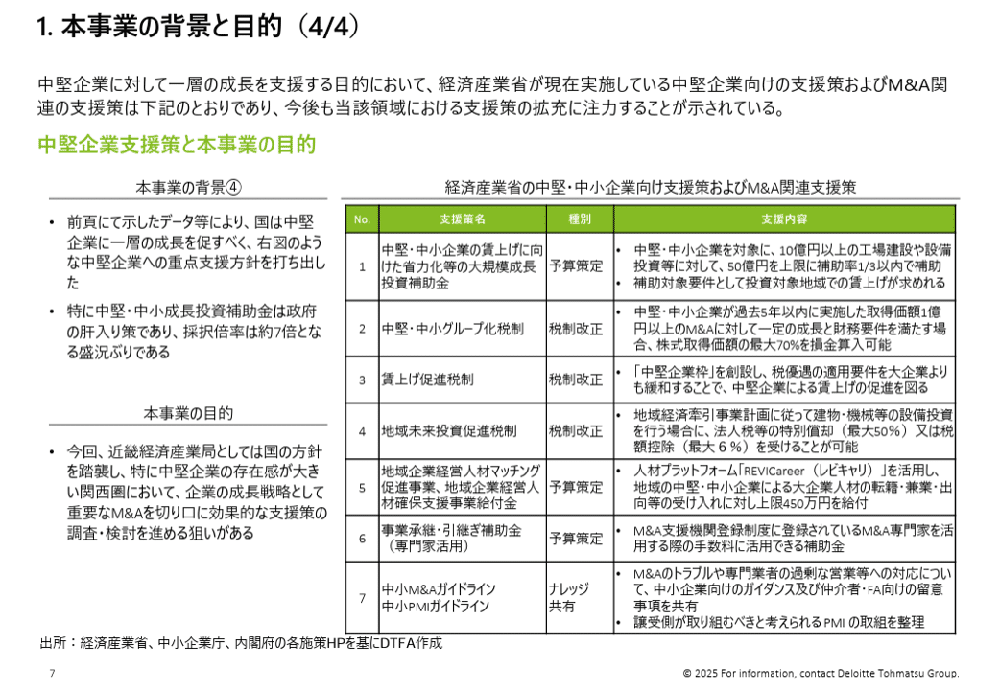
本件調査資料ということもあり、全体的に文字が多いスライドとなっています。**財務DDなどでも前提条件は丁寧に前段でまとめますが、それと同じような印象**を受けます。

### 分析内容のスライド

分析内容のスライドを見ていきましょう。なおこの事業は調査がメインのため、課題仮説のスライドは特にありません。

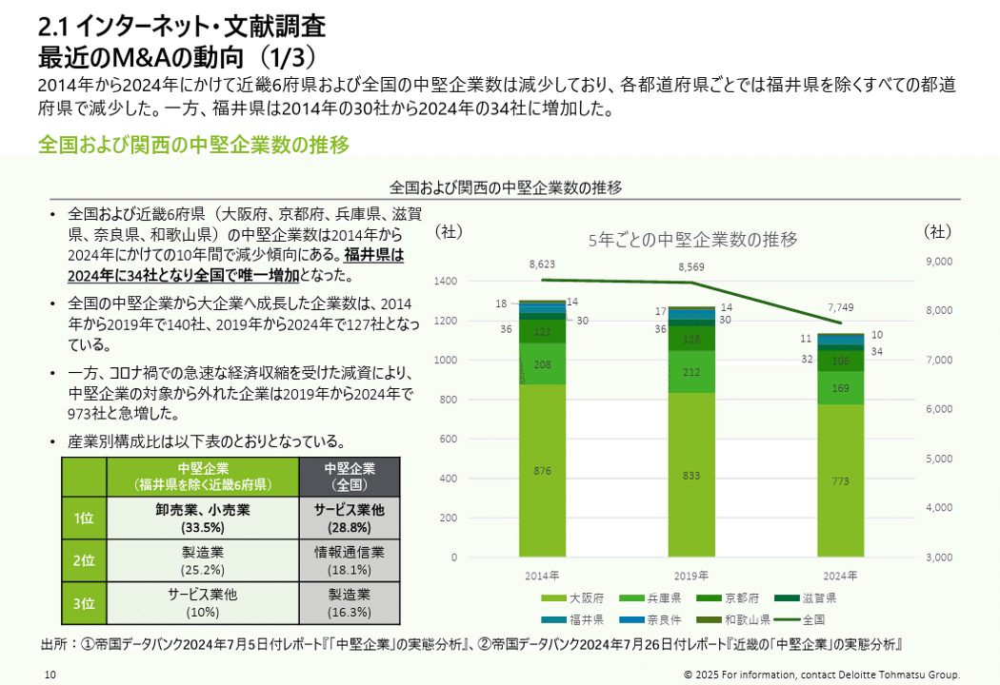
調査スライドの中の、インターネット・文献調査のスライドです。全国及び関西の中堅企業数の推移を表とグラフで示しています。
先ほどの資料とは異なり、上部の最初にページのタイトルがあり、その下にページのサマリーメッセージが入っています。**調査資料ということもあり、メッセージはファクトが中心**になっています。
色遣いはデロイトトーマツグループの緑のグラデーションですね。

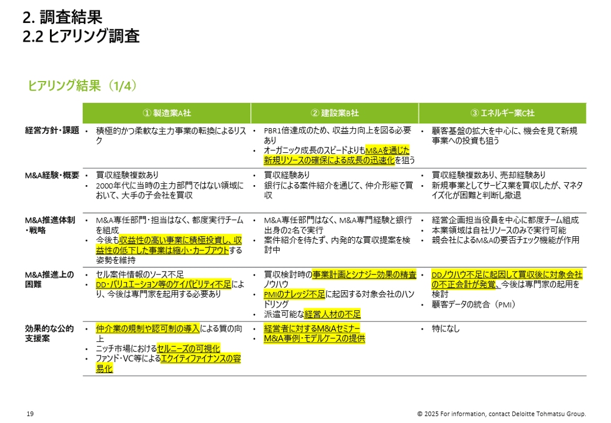

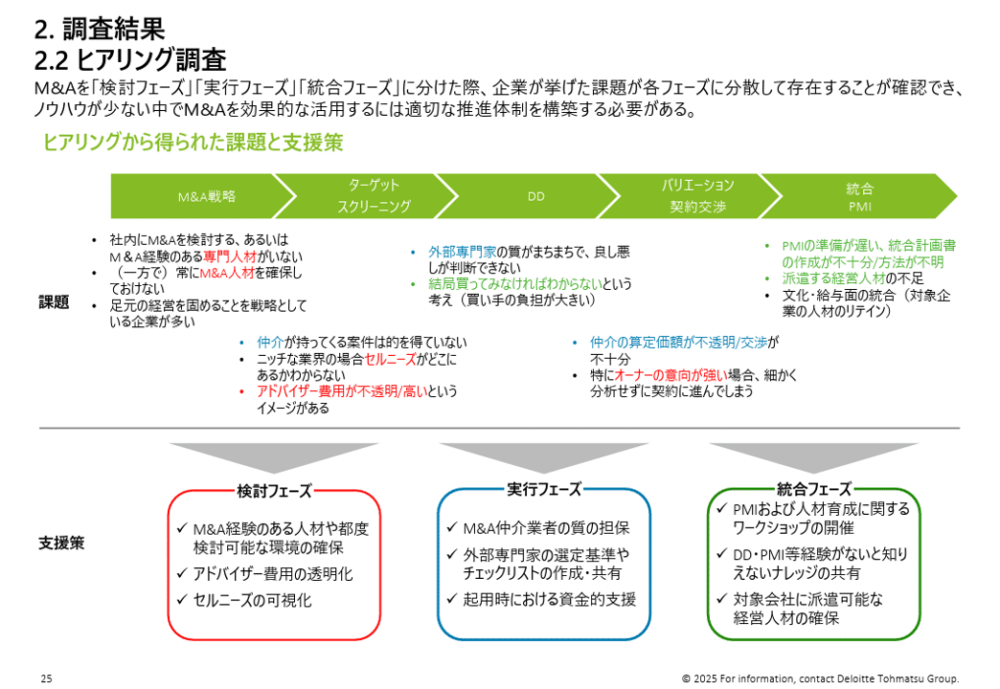
ヒアリング調査の結果をまとめたスライドです。最初はファクトの積み上げで、各社に対して同じ項目でヒアリングした内容を表形式でまとめ、**重要なファインディングスを下線と黄色**で強調しています。
そのうえで、ヒアリング内容をM&Aの実際のフローに再度マッピングし、３つの支援策に整理し直しています。情報の積上げ⇒再構築という流れはきれいでよいですね。

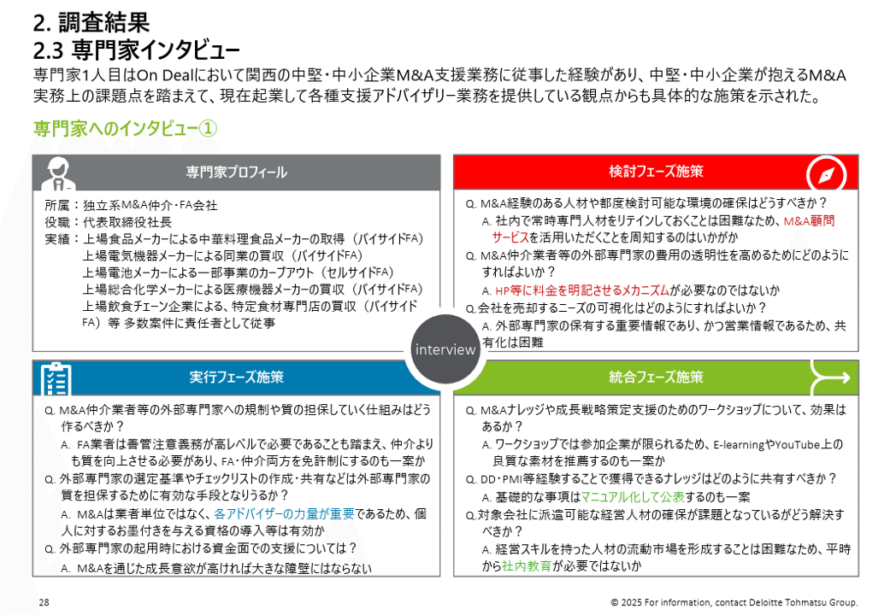
専門家インタビューの結果をまとめたスライドです。先ほどまとめた３つのフェーズの支援策ごとに、インタビューを行っています。
横に矢印を伸ばすとそれぞれの箱が縦書きになってしまって行数が増えるので、こうした形にするのはありですね。

### 結論のスライド

調査を踏まえた結論のスライドです。M&A関連支援について、検討フェーズと実行・統合フェーズの支援策をまとめています。

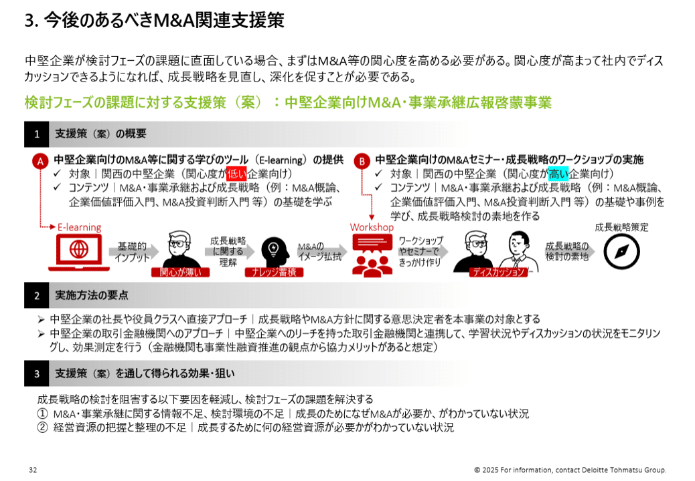

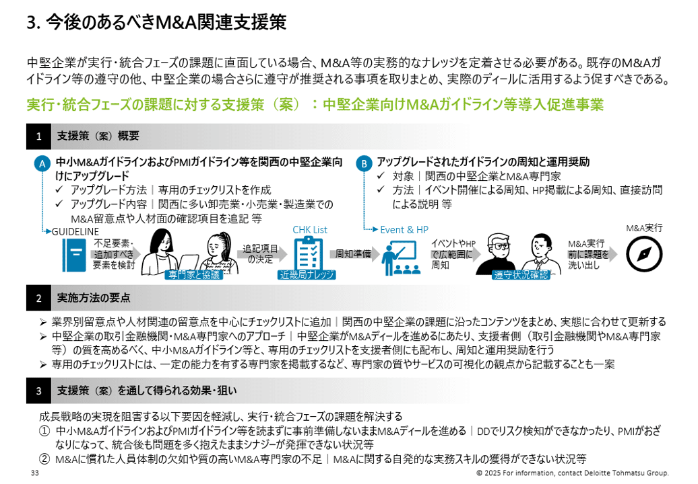
いずれのページも、支援策の概要、実施方法の論点、支援策を通して得られる効果・狙い、という３つの項目で構成されています。全体的にテキスト中心のため、支援策の部分はイラストも入れて全体のバランスを取っています。**スライド全体で見ても真ん中にイラストが来ており**、バランスがとれているといえますね。

デロイトトーマツフィナンシャルアドバイザリーへの転職を検討されている方は[こちら](https://www.career-adv.jp/lp/casual/)から。

## 有限責任監査法人トーマツの報告書

続いて監査法人トーマツの調査報告資料を見ていきましょう！令和６年度電力取引監視等業務委託事業（インバランス料金制度等の海外事例調査等事業）のパワーポイントを見ていきます。

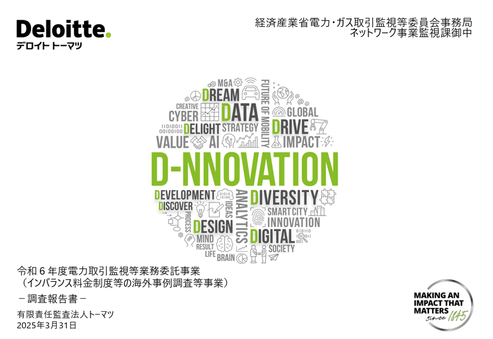
> 引用元：[> 令和６年度電力取引監視等業務委託事業（インバランス料金制度等の海外事例調査等事業）](https://www.meti.go.jp/meti_lib/report/2024FY/1000019.pdf)

*https://www.meti.go.jp/meti_lib/report/2024FY/itakuichiran2024FY.pdf*

### 調査結果のサマリーのスライド

こちらの資料はまさに調査報告書という感じで、調査結果のまとめと、その詳細で構成されています。まずは調査結果のまとめから見てみましょう。

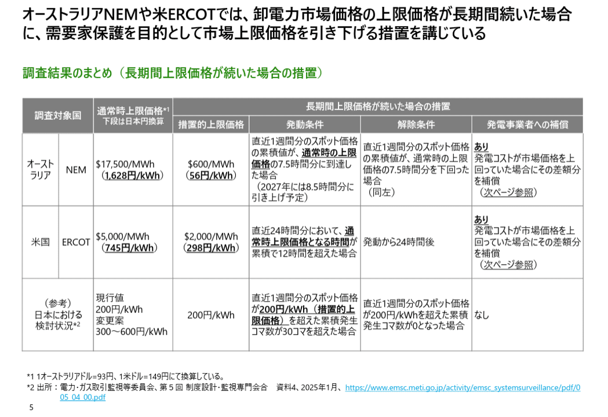

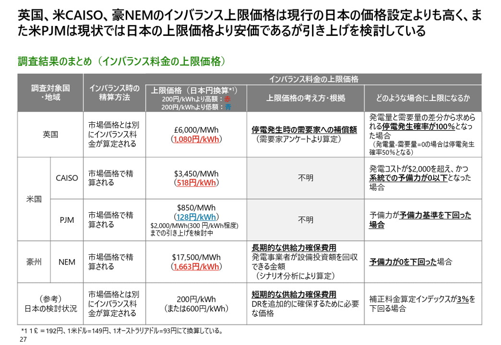

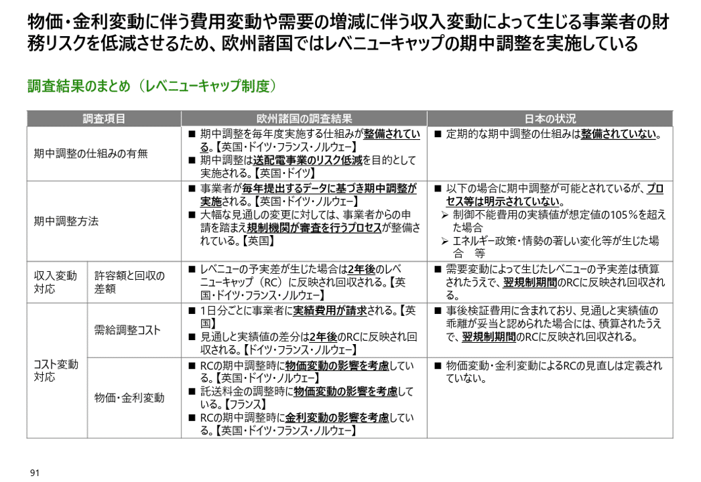
調査結果のまとめのページは、いずれもシンプルな表形式のスライドになっています。トップラインがメッセージで、その下にスライドのタイトルが来るのはデロイトトーマツコンサルティングと同じ構成ですね。

表においては、グレーと黒をベースに、太字と下線で強調していくスタイルですが、200円/kWhより高いか低いかというメッセージにかかわる部分のみ、赤と青を使って見えるようにしています。

### 調査内容の詳細のスライド

続いて調査内容の詳細のスライドです。極めて専門的な内容です。

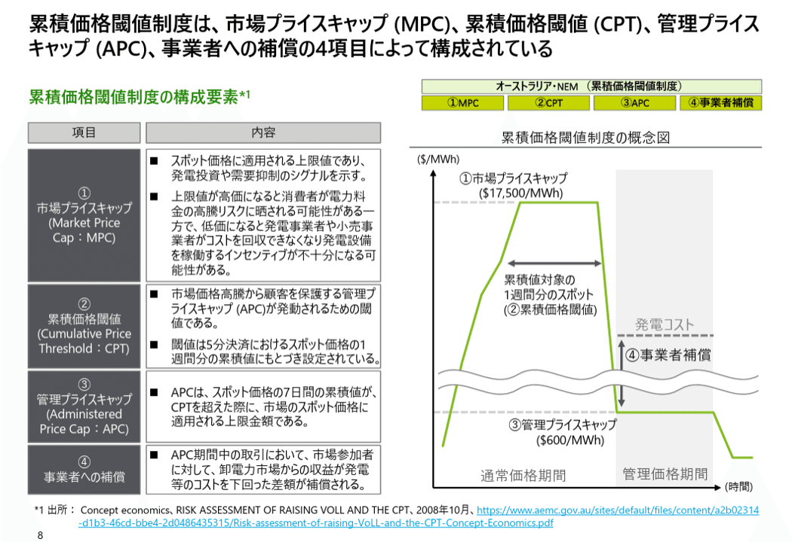

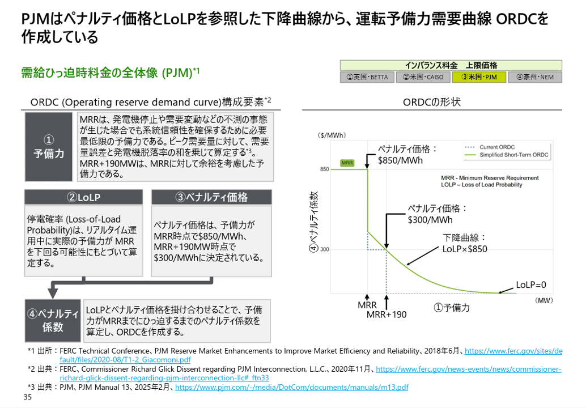

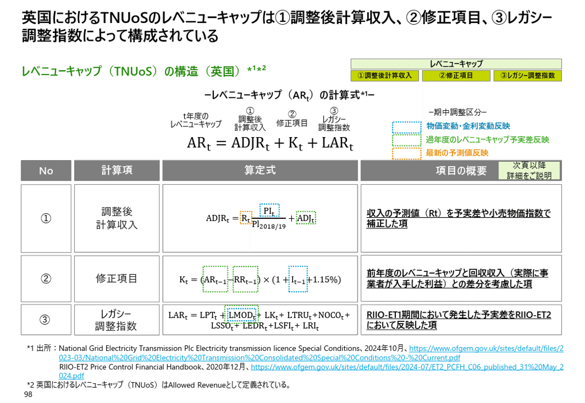
内容の専門性の高さもあって、テキストだけだとかなり難解になってしまうことから、グラフを入れて直感的に理解しやすいようにしています。**またボディの右肩に凡例を付けて、今どこの話をしているのかがわかりやすくするのも、基本的ながら重要な工夫**です。

またパワーポイント資料ではかなり珍しいのですが、計算式が大量に記載されたページもあります。ここに「期中調整区分」を載せるにあたって、うるさくなりすぎないよう、破線の資格で囲っているのも珍しい工夫です。

有限責任監査法人トーマツへの転職を検討されている方は[こちら](https://www.career-adv.jp/lp/casual/)から。

## デロイトトーマツ税理士法人の報告書

続いてデロイトトーマツ税理士法人の調査報告資料を見ていきましょう！産業競争力強化法に基づくエネルギー利用環境負荷低減事業適応の利用状況等に関する調査のパワーポイントを見ていきます。

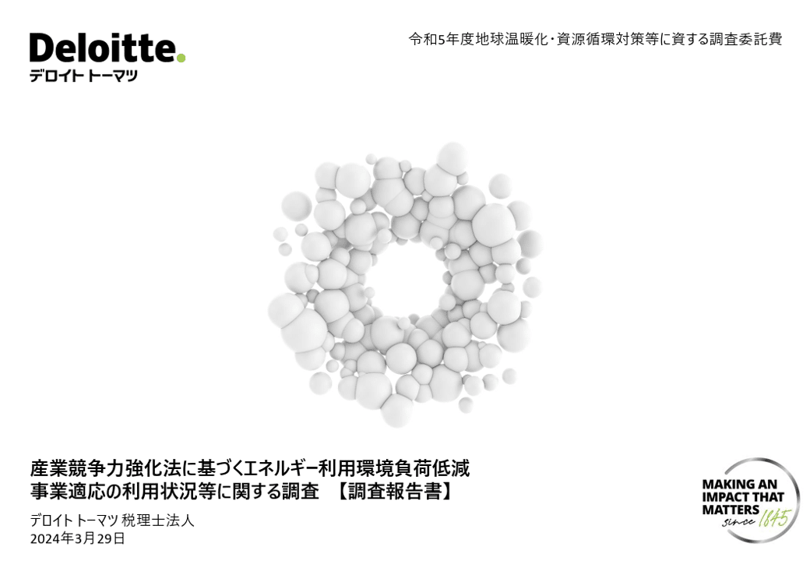
> 引用元：[> 産業競争力強化法に基づくエネルギー利用環境負荷低減事業適応の利用状況等に関する調査](https://www.meti.go.jp/meti_lib/report/2023FY/000219.pdf)

*https://www.meti.go.jp/meti_lib/report/2023FY/itakuichiran2023FY.pdf*

### 目的と概要のスライド

まずは目的のスライドです。調査事業の目的として、CN税制の政策効果検証および次年度以降の改正を検討することとなっています。

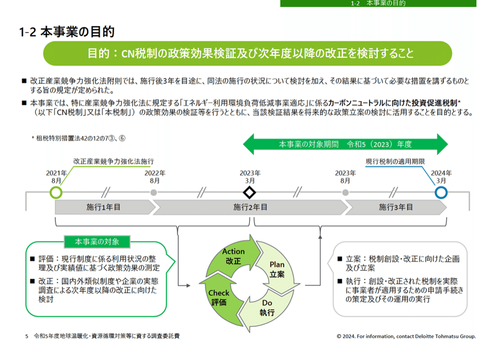
構成としては、改正産業競争力強化法の施行後、**今がどのような位置にいるかを矢羽で示す**と同時に、どの中で今回の調査事業がどのような役割を果たすのか、また何を対象として行われるのかを示しています。

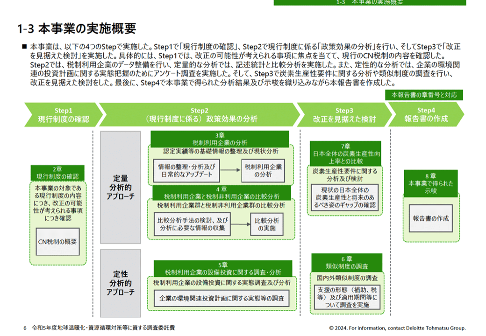
そこからさらに事業のステップを「現行制度の確認」「政策効果の分析」「改正を見据えた検討」「報告書の作成」の４つに分解し、その中で本事業がどのような検討を行うのかを示しています。

デロイトトーマツ税理士法人以外の３企業の資料と比較すると、**ややトップラインメッセージの文字が多い印象**を受けますね。

### 分析内容のスライド

ここからは分析内容のスライドですが、多岐にわたる分析で非常に見ごたえのある内容となっています。監査法人もそうですが、**実務家らしい骨っぽいスライドが多い**です。

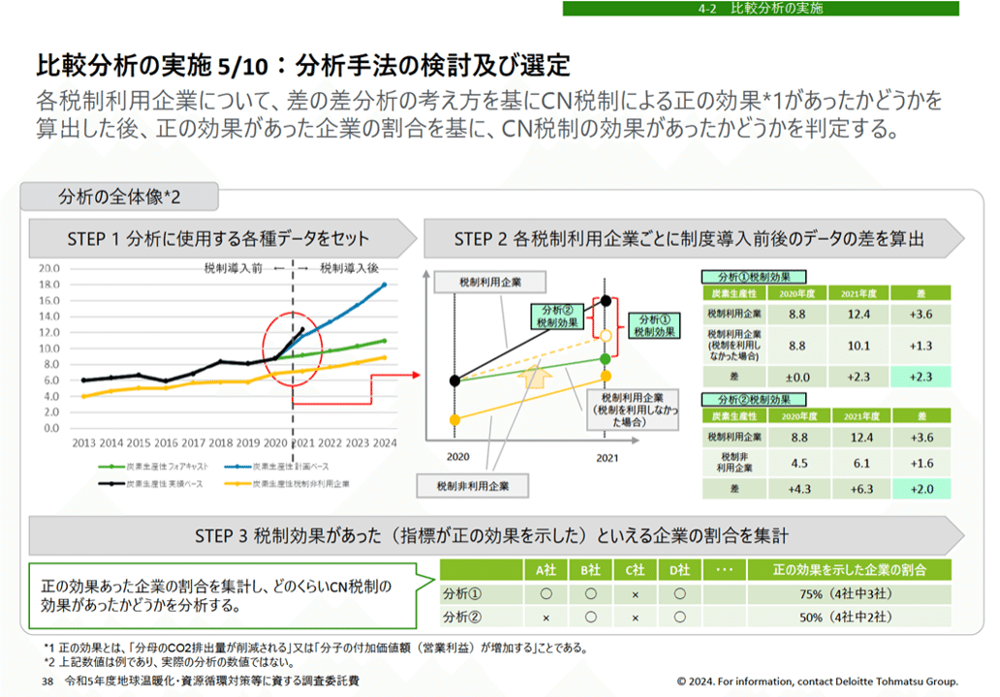
分析手法について説明しているスライドです。全体像として、どのようなデータをセットするか、どのように差分を抽出するか、どのように集計するのかを、グラフや表を使って説明しています。中々ビジーですが、構造とグラフや表で、さほど見づらくは感じません。

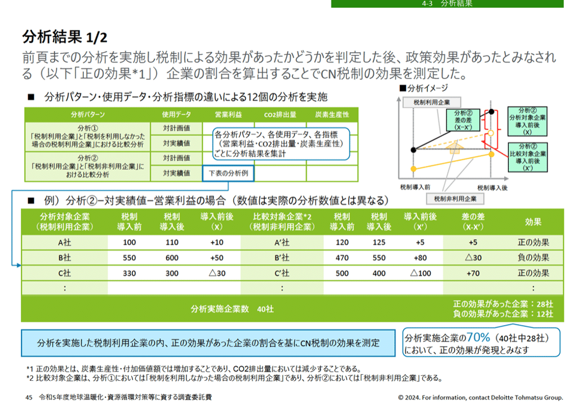

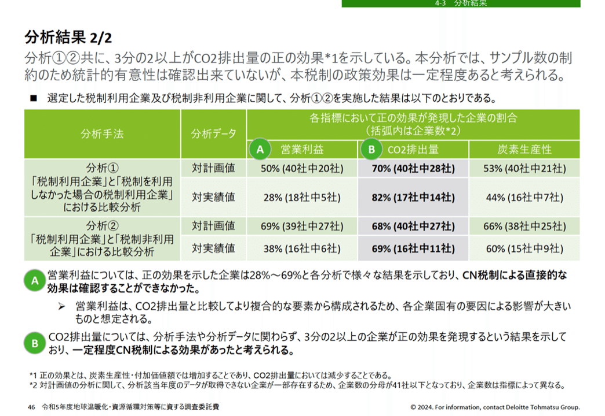
分析結果のスライドも、一般向けにまとめるというよりは、分析結果をそのまま示すようなスタイルです。まとめは、**「本調査の示唆」として最後に丁寧に説明**されます。

### 結論のスライド

最後に調査報告書のサマリーである結論のページです。ここまで骨っぽい分析が続きましたが、最後に本調査からの示唆が丁寧にまとめられています。

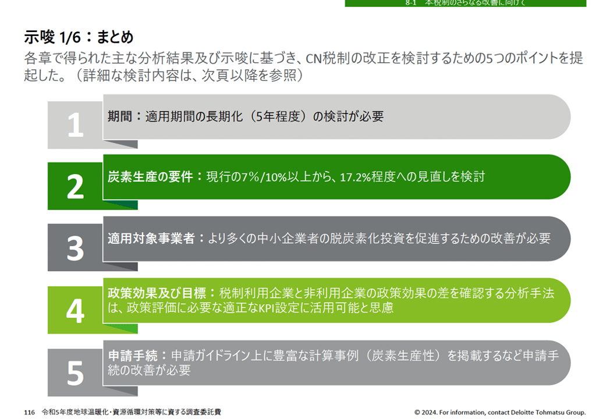
示唆のサマリーページです。配色はデロイトトーマツのカラーで書かれていますが、特に緑が特別ということはなさそうです。どちらかというとデザイン重視に見えますね。

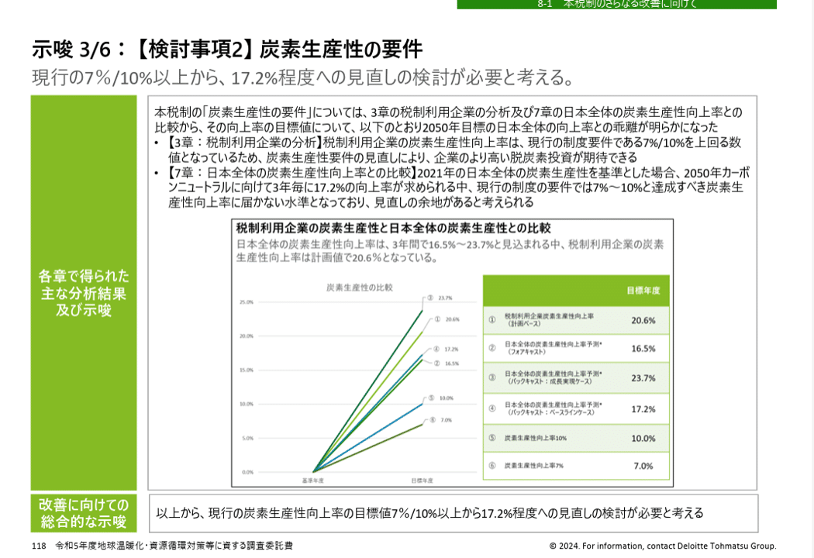
示唆についても、本調査で得られたファクトをベースに、テキストで丁寧にまとめられています。ここでは実際に、設定すべき数字までを示しており、中々踏み込んだスライドといえますね。引き続きボディの文字は多めです。

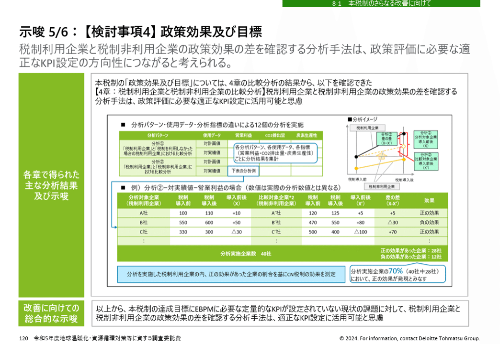
また最後の示唆で、「分析手法」について触れているのも、実務家らしくてGoodです。**ここまでのスライドを画像化して縮小し、スライドに入れ込む手法は参考になりますね**。

デロイトトーマツ税理士法人への転職を検討されている方は[こちら](https://www.career-adv.jp/lp/casual/)から。

## デロイトトーマツへの転職を考えている方へ

パワポ研は株式会社レックスアドバイザーズが運営しています。
**レックスアドバイザーズは会計ファームへの転職支援に強みを持つ転職エージェント**です。デロイトトーマツフィナンシャルアドバイザリー、デロイトトーマツ税理士法人、有限責任監査法人トーマツへの転職を考えている方は、[無料相談フォーム](https://www.career-adv.jp/job_search/entryform_exp/)から相談してみてくださいね。

[
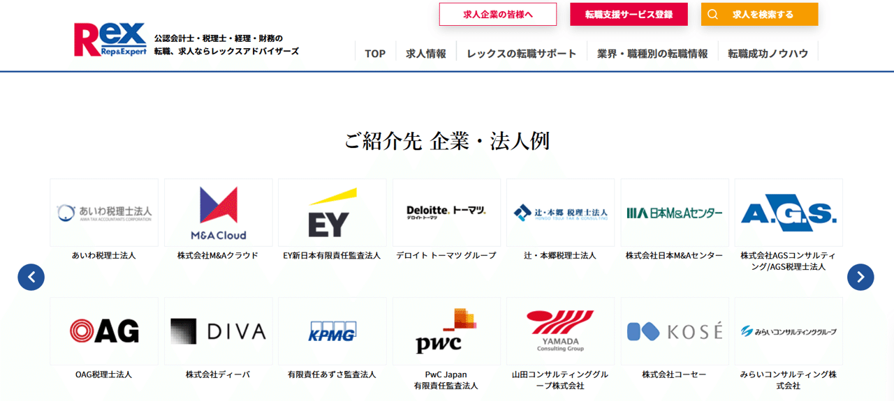
](https://www.career-adv.jp/)*レックスアドバイザーズのサービスサイトはこちら*

## パワポ研オリジナルテンプレート

パワポ研では「ビジネスシーンで使える」パワーポイントテンプレートを公開しております。デザインを整えるのみならず、**ロジックやストーリーを整理するのにも役立つパッケージになっております**ので、関心のある方は下記ページも併せてご覧ください！

[
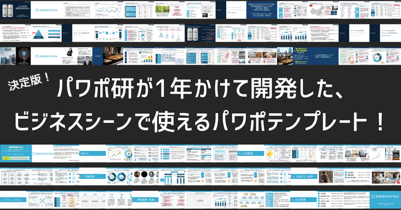
](https://note.com/powerpoint_jp/n/n0380d0556127)またパワポ研では、上記の記事のように、noteでは**フォローしているだけでビジネスにおける「資料作成のコツ」と「デザインのセンス」が身に付くアカウント**を目指して情報配信を行っています。
今後もコンスタントに記事を配信していく予定なので、関心のある方は是非アカウントのフォローをお願いします！

**> Template販売　**[> https://powerpointjp.stores.jp/](https://powerpointjp.stores.jp/%EF%BF%BCnote)
**> note　**[> パワポ研の資料作成術](https://note.com/powerpoint_jp/m/mc291407396da)
**> X（旧Twitter)　**[> https://twitter.com/powerpoint_jp](https://twitter.com/powerpoint_jp)
**> 求人紹介をご希望の方　**[> 無料転職サポート](https://www.career-adv.jp/job_search/entryform_exp/)
**> 採用支援をご希望の方　**[> 採用サポート](https://www.career-adv.jp/request3/)
**> その他　**[> お問い合わせフォーム](https://www.rex-adv.co.jp/contact)
**> 書籍　**[> 注目企業の実例から学ぶパワポ作成術](https://www.amazon.co.jp/dp/4046060476)

