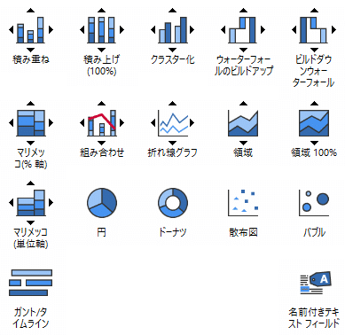
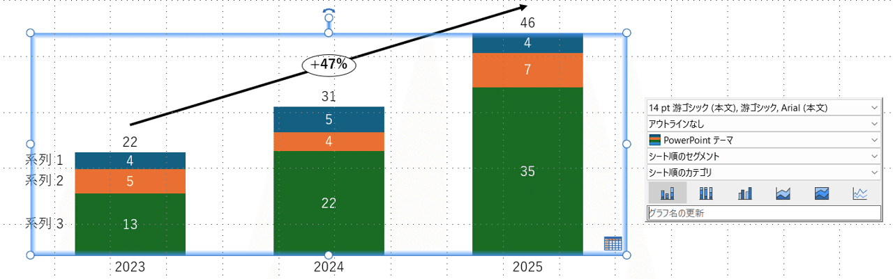
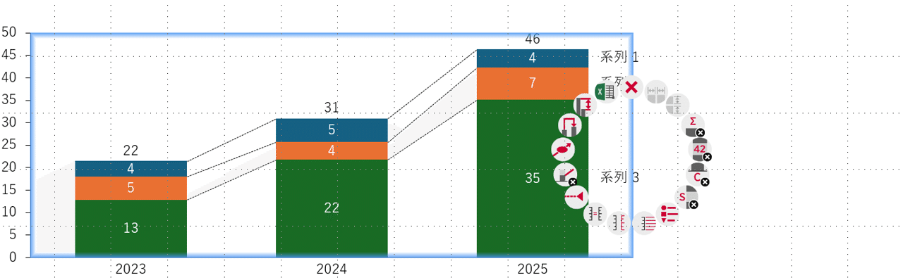
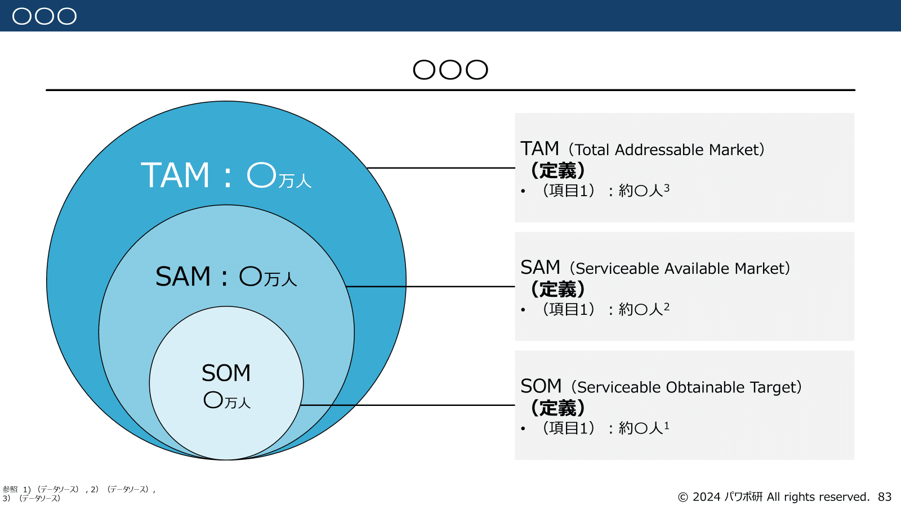

# 【意外？】コンサルから事業会社に転職して、一番の苦労はパワポ作成という話

[note原文](https://note.com/powerpoint_jp/n/nb7bdac067e21)

みなさんこんにちは。
資料デザインのリサーチや分析に取り組むパワーポイントのスペシャリスト、パワポ研です。

今日は少し趣向を変えて、先日コンサルファームから日系事業会社（いわゆるJTC）に転職した友人から聞いた話を紹介しようと思います。

そんな話は興味がないので良質なパワポを見せて！という方はこちらのまとめページをどうぞ。

逆にタイトルを読んで共感しすぎてしまう方はこちらもおススメです。

本題に入りますが、先日、戦略コンサルティングファームを卒業して日系大手企業の経営企画部門で働く友人と久しぶりに会いました。彼はすごく優秀な人なので、新天地でもバリバリ活躍している（らしい）のですが、日系大手企業に転職して、一番苦労しているのが、実はパワーポイントの作成だというのです。

コンサルタントといえば、スライド作成のプロであり、パワポ研でも[コンサルティングファームの報告書](https://note.com/powerpoint_jp/n/n812a673ce2ab)は日々参考にしています。そんな彼が苦労するというのはいったいなぜなのでしょうか。

## ストレスを感じる最大の理由

## Think-cellが使えない！

コンサルタントの資料作成を支えるひみつ道具ならぬパワーポイントアドインがThink-cellです。戦略系や総合系を問わず、大手のコンサルティングファームでThink-cellを入れていないファームはないといってよいでしょう。

Think-cellといきなり言われてもなじみのない方も多いと思うので、簡単に説明しますね。Think-cellはパワーポイントで様々なグラフを作ることができるアドインです。棒グラフ、円グラフ、折れ線グラフ、コンビネーション、ウォーターフォール、バブルチャートなどなんでもござれ。

*Think-cellで使えるグラフ*

**グラフの豊富さに加え、グラフの操作性も抜群。ボタン一つで何でもできます。**

- グラフの色や枠線、文字フォントなどのデザインを変更できる

- グラフの並び順や、系列の並び順を変更できる

- グラフが気に入らなければ、数値をそのまま別のグラフに変更できる

- 年平均成長率を自動で計算して矢印まで出してくれる

- グラフ間の補助線やメモリを出してくれる

- 凡例を好きな場所に出せる（グラフの上下左右）

*グラフのフォント、太字、グラフの枠線、色、グラフの並び順、系列の並び順など変更できる*

*CAGR、縦軸目盛り、補助目盛、グラフの数値表示、判例など変更できる*

世のコンサルタントたちは、コンサル生活のDay1からこの便利なツールにどっぷりつかっているのです。ではThink-cellが使えないとなるとどうなるか、それはもう、ひみつ道具のないネコ型ロボットのようになってしまいます。
**コンサル時代には5分で作れていたコンビネーショングラフに30分かかり**、かつクオリティも若干微妙、バブルチャートの微妙な調整に30分かかり、そりゃストレスもかかりますよね。

彼曰く、「Think-cellのない世界を想像したことがなかったし、パワーポイントの基本機能がここまで自由度がないとは思わなかった」とのこと。失って気づくありがたみというやつですね。

ちなみにThink-cellはドイツのThink-cell gmbhが販売しているパワーポイントのアドインツールで、2002年に設立されました。

 
[
**
About the company | think-cell
**

think-cell, founded in 2002 and now led by Alexander von Frit

www.think-cell.com

](https://www.think-cell.com/en/company/about)

 
HPのユーザーリストを見てみるとGoogle、Metlife、Vodafone、LVMHとなどグローバルの大手企業の名前が並びますが、残念ながら日系の大手グローバル企業の名前はありません。日系大手（特にJTC）だと中々契約しづらいかもしれませんが、IPOベンチャーであれば、決裁者に頼めば契約してくれるかもしれません。

## ストレスを感じる理由その②

## プレゼンテーションのテンプレートがない

大手のコンサルティングファームにおいては、**あらゆるテーマやシーンで使える資料のテンプレート**があります。プロジェクトが終わると、そこで使ったアウトプットから機密情報等を削除し、だれでも使える状態にして保存します。
そうすると、メーカーの新規事業の時はこのテンプレ、IT企業のM&Aの時はこのテンプレ、といったように、ありとあらゆるシーンで使えるテンプレが蓄積されていくわけですね。

こうしたテンプレートは、もちろん1から作れないものではないものの、使うことで大幅に時間をショートカットでき、データ収集や分析や提案づくりといった本来時間を使うべき業務に集中できるわけです。

ではそうしたテンプレがないとどうなるかというと、スライドの報告資料の作成にすごく時間がかかるわけです。しかもThink-cellがないので、一つ一つのグラフの体裁を整えるのにバカみたいに時間がかかります。
コンサルタントは「時間を無駄にするな、効率をとにかく高めろ」という教育を受けてきた人たちなので、資料作成の無駄な時間は非常なストレスになります。

彼曰く「資料作成に馬鹿みたいに時間がかかるので、自分的には7割の出来でも、伝わればいいかで完成にしてしまう」とのこと。当然メッセージはシャープでロジックも完ぺきではありますが、見た目がちょっと、、、ということですね。

ちなみにパワポ研ではこうしたストレスを解消すべく、[1年かけて開発したビジネスシーン別で使えるスライドテンプレートを販売](https://note.com/powerpoint_jp/n/n0380d0556127)していますが、今回の本筋ではないのでその話はまた今度。

## ストレスを感じる理由その③

## スライドのライブラリーがない

大手のコンサルティングファームでは、プレゼンテーションのテンプレートのほかに、**1枚単位で使えるスライドのフォーマットを大量に持っています**。その中でも特に役に立つのが”ポンチ絵”と呼ばれる、見るだけでロジックが伝わる魔法のフォーマットです。

色々なパターンのものがありますが、例えば市場規模を示すTAM・SAM・SOMのスライドであったり、ファネルっぽいスライドであったり、様々です。よりコンセプチュアルなものだと、パルテノン神殿のようなスライドや、パズルのピースのようなものもあります。

*パワポ研で販売しているスライド様式別テンプレ（市場規模）*

*パワポ研で販売しているスライド様式別テンプレ：ファネル*

こうしたスライドも、そこまで頻繁に使うものではないのですが、**「見せ方が悩ましいな」と思ったときにヒントになることもある**ので、あると意外に役立ちます。

彼曰く「あまり使うものではないけど、たまに使っていたフォーマットがあり、それを再現したいけどできないつらさがある」とのこと。たまにどうやって作ったの？というフォーマットがあるんですよね。

## パワポに関するその他の悩み

パワポ作成については今お話ししたような3点が主な悩みの種のようです。「日系の大手の経営企画だと、説明のために大量のスライドを作らされて大変じゃない？」ということも聞いてみましたが、「コンサル時代のデマンディングなクライアントよりはまし」とのことでした。

ちなみに、IPOベンチャーなどだと、パワーポイントではなくグーグルスライドを使っていて、ショートカットが異なるなどの悩みもあるのですが、最悪パワポで作って画像貼り付けしてしまえばいいので、そこまで深刻な悩みにはなっていなさそうです。

## パワポ以外で苦労している点

コンサルティングファームから事業会社に転職すると、パワポ作成以外にもいろいろな点が変わります。それこそ会社によっては朝9時の出社がマストであったり、細かい申請が多かったり。

彼曰く「確かに朝9時出社がつらいコンサルタントもいそうだけど普通は大丈夫じゃない？それよりも10時以降働けないから、時間の使い方が制限される」とのこと。転職して役員などになるケースはよいですが、従業員の場合10時以降就業すると深夜残業で割増賃金が発生するため、制限しているところがほとんどです。時間に縛られず働きたい人にとってはストレスになる可能性がありますね。

以上、コンサルファームから事業会社の経営企画職に転職した友人の生の声でした。コンサルファームからの転職を考えている人は是非参考にしてみてくださいね。

## さいごに

パワポ研は株式会社レックスアドバイザーズが運営しています。
レックスアドバイザーズは**経営企画職や経営管理職に特化した転職エージェント**です。
公認会計士や税理士の転職サポートを祖業としているため、**監査法人や会計事務所や証券会社との関係が深く、彼ら経由で依頼されたコンフィデンシャルな求人**も保有しています。CFO、経営企画、M&A、経営管理、経理といった職種で転職を考えている方は是非一度ご相談ください。
求人紹介やキャリア相談を希望の方は、[**無料転職サポート**](https://www.career-adv.jp/job_search/entryform_exp/)よりサービス利用登録をしてみてください。

*レックスアドバイザーズのサービスサイトはこちら*

**> 求人をご希望の方　**[> 無料転職サポート](https://www.career-adv.jp/job_search/entryform_exp/)**
> 採用支援をご希望の方　**[> 採用サポート](https://www.career-adv.jp/request3/)
**> その他　**[> お問い合わせフォーム](https://www.rex-adv.co.jp/contact)
**> 書籍　**[> 注目企業の実例から学ぶパワポ作成術](https://www.amazon.co.jp/dp/4046060476)

