# 【徹底解説】パワポのページ番号の編集方法とデザイン例２５選

[note原文](https://note.com/powerpoint_jp/n/nbaf520b586e6)

みなさんこんにちは。
資料デザインのリサーチや分析に取り組むパワーポイントのスペシャリスト、パワポ研です。

今回は新シリーズ「徹底解説してみた」のNoteになります。
普段あまり着目されない**パワポの「ページ番号」に焦点を当て、おしゃれなページ番号のデザインや、スライドマスターでの編集方法**を解説していきますよ。

前半は【マネしたい】シリーズのように上場企業のIR資料スライドのデザイン紹介をし、後半でページ番号の入れ方や位置の変更や大きさの変え方といった編集方法を解説していきます。

なお【マネしたい】シリーズのまとめ記事はこちらです。

では早速行きましょう！

## パワポのページ番号のデザイン

おしゃれなパワポの「ページ番号」のデザインを見ていく前に、パワーポイントのページ番号のデザインを考えるポイントを確認しておきましょう。

パワポのページ番号を考える上で重要なのは２つだけです。

- **パワポのページ番号の位置**

- **パワポのページ番号周辺のデザイン**

- **パワポのページ番号のサイズ**

### パワポのページ番号の位置

まずはページ番号の位置です。最も多いのは右下になりますが、それ以外にも左下、真ん中下、右上などのパターンがあります。
デザインにおいては、絶対にこれという正解はない事が多いので、後ほど紹介する事例を見ながら、自社に合うパターンを見つけてみてくださいね。

### パワポのページ番号周辺のデザイン

もう一つがページ周辺番号のデザインです。シンプルにページ番号を振っているパワポもあれば、ページ番号の横に色を入れたり、ページ番号を丸で囲ったり、ページ番号に色を付けたりと、様々なパワポがあります。

### パワポのページ番号のサイズ

最後にページ番号のサイズです。ページ番号は主役ではないので目立たない方がよく、小さい方が理想的ですが、小さすぎると見づらくなります。
この辺りは聞き手をイメージしながら作ることが大切です。

## ページ番号の位置別パワポデザイン例

パワポのページ番号の位置で最も多いのが右下です。ページ番号が右下のスライドについては、後ほどページ番号周辺のデザインを見るチャプターで見ていくとしましょう。

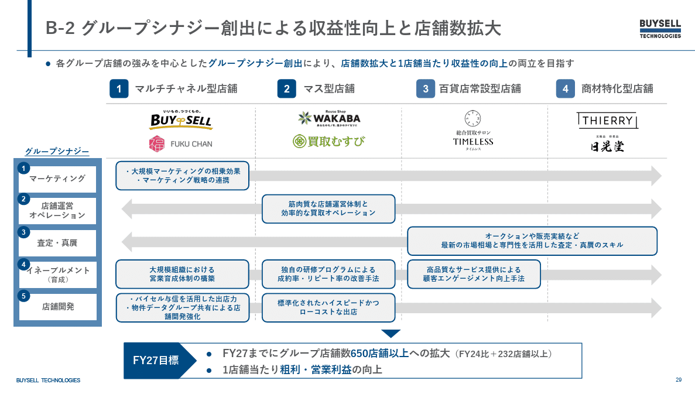
*パワポの右下にページ番号があるスライド例：バイセルテクノロジーズ社*

> 引用元：[> 2024年12月期 通期決算説明資料](https://ssl4.eir-parts.net/doc/7685/tdnet/2568273/00.pdf)

*https://buysell-technologies.com/ir/settlement/*

### ページ番号が右上にあるパワポ例

まずはパワポのページ番号が右上にあるスライド例を見ていきましょう。
**右下同様にプレーンな背景にページ番号をデザイン**しているケースもあれば、**ヘッダーの中にページ番号をデザイン**するケース、その中でも**チャプター名とセットでページ番号をデザイン**するケースなど様々です。

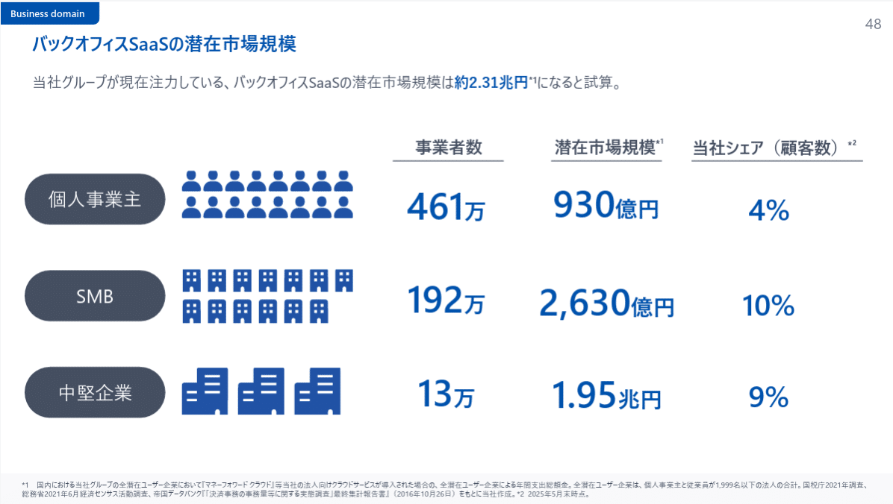
*パワポの右上にページ番号があるスライド例：マネーフォワード社*

> 引用元：[> 2025年11月期 第2四半期決算説明資料](https://contents.xj-storage.jp/xcontents/AS71106/0b98287f/f7f1/49ca/8e1e/261cab0da6f5/140120250714513764.pdf)

*https://corp.moneyforward.com/ir/library/presentation/*

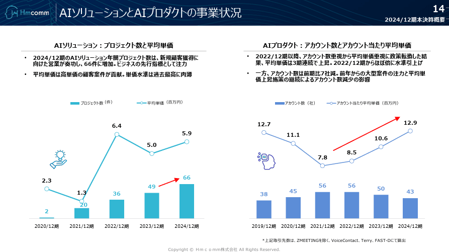
*パワポのヘッダー右上にページ番号があるスライド例：Hmcomm社*

> 引用元：[> 2024年12月期 決算説明資料](https://ssl4.eir-parts.net/doc/265A/tdnet/2568211/00.pdf)

*https://hmcom.co.jp/ir/library/presentation/*

*パワポの右上チャプター横にページ番号があるスライド例：スマレジ社*

> 引用元：[> 事業計画及び成長可能性に関する事項](https://corp.smaregi.jp/ir/library/FY2025_Business_Plan_and_Growth_Potential.pdf)

*https://corp.smaregi.jp/ir/management/growth-potential.php*

### ページ番号が左下にあるパワポ例

続いてパワポのページ番号が左下にあるスライド例を見ていきましょう。
**右下同様にプレーンな背景にページ番号をデザイン**しているケースが多いですが、企業名や資料名とセットになっていることが多いです。
上級者向けのパワポでは、**スライド左にラインが入っており、ラインに合わせてページ番号がデザイン**されていることもあります。

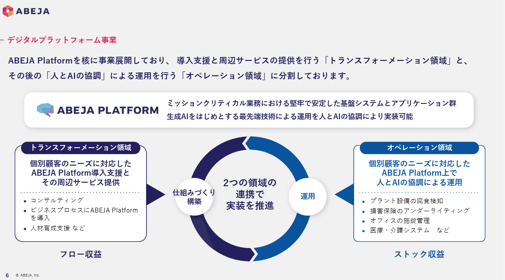
*パワポの左下にページ番号があるスライド例：ABEJA社*

> 引用元：[> 2025年8月期 決算説明資料](https://ssl4.eir-parts.net/doc/5574/tdnet/2698143/00.pdf)

*https://www.abejainc.com/ir-presentation*

*パワポの左下にページ番号があるスライド例：SCALA社*

> 引用元：[> 2025年6月期 決算説明資料](https://scalagrp.jp/pdf/ir/library/gyoseki/20250814_setsumeikai_2506-4Q.pdf)

*https://scalagrp.jp/ir/documents/*

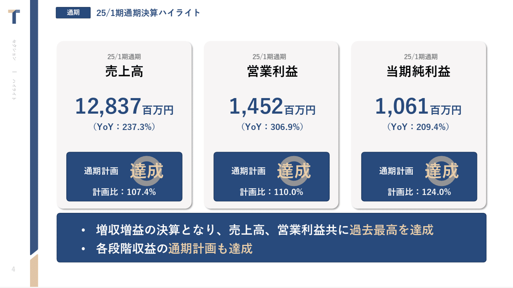
*左のラインに合わせてパワポの左下にページ番号があるスライド例：TENTIAL社*

> 引用元：[> 2025年1月期 通期決算説明資料](https://ssl4.eir-parts.net/doc/325A/tdnet/2581792/00.pdf)

*https://corp.tential.jp/ir/library/presentations/*

TENTIAL社のスライドは、パワーポイント全体を通して左側にＴのロゴと青と金色のラインが入っており、チャプター名が入っています。こうしたデザインのパワポでは左下にページ番号がなじみやすいですね。

### ページ番号が真ん中下にあるパワポ例

最後にパワポのページ番号が真ん中下にあるスライド例を見ましょう。
**右下同様にプレーンな背景にページ番号をデザイン**しているケースに加え、**パワポのフッターの中にページ番号をデザイン**しているケースが多いです。
上級者向けのパワポでは、スライド左にラインが入っており、ラインに合わせてページ番号がデザインされていることもあります。

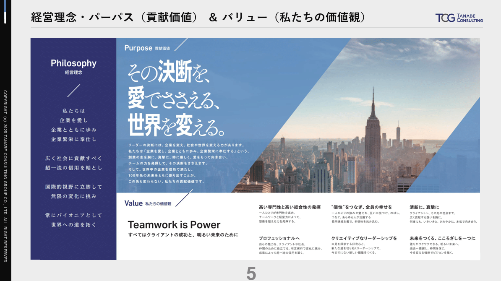
*パワポの真ん中下にページ番号があるスライド例：タナベコンサルティング社*

> 引用元：[> 2025年３月期　決算説明会資料](https://pdf.irpocket.com/C9644/A2Jy/IGX3/gNiX.pdf)

*https://www.tanabeconsulting-group.com/ir/briefing_list*

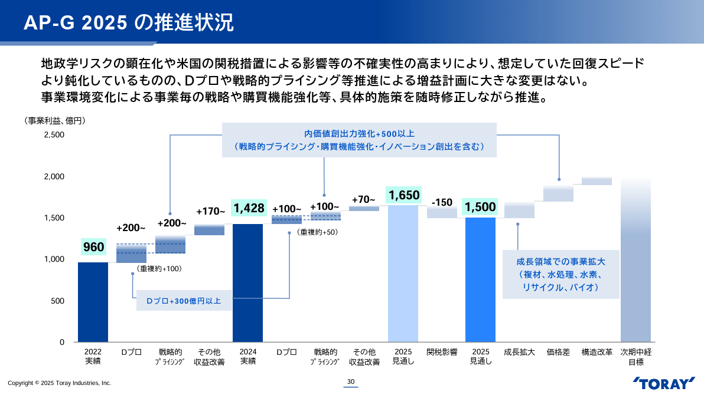
*パワポの真ん中下に下線付きのページ番号があるスライド例：東レ社*

> 引用元：[> 説明資料](https://www.toray.co.jp/ir/pdf/lib/lib_a643.pdf)

*https://www.toray.co.jp/ir/library/data/*

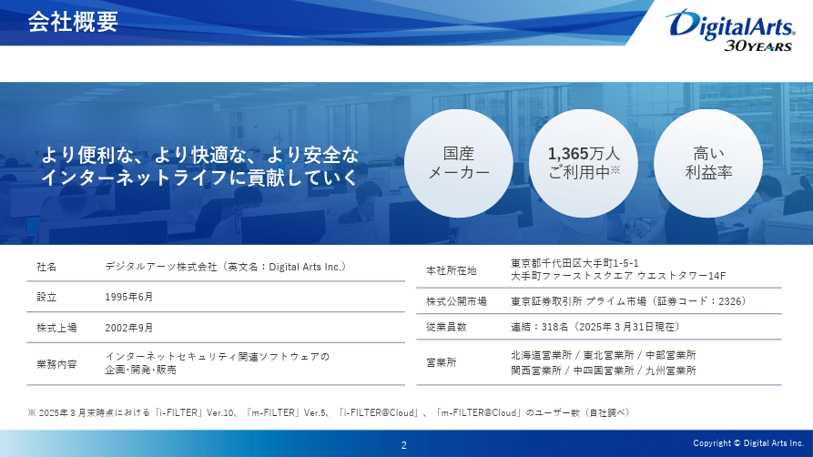
*パワポのフッター真ん中にページ番号があるスライド例：デジタルアーツ社*

> 引用元：[> 2025年3月期 決算短信 補足資料](https://www.daj.jp/ir/data/daj2326_202503_4q_ref.pdf)

*https://www.daj.jp/ir/library/result/*

## ページ番号がおしゃれなパワポデザイン例

ここからは右下にページ番号があるパワポを中心に、ページ番号をどのようなデザインにするとおしゃれに見えるのか確認していきましょう。

### おしゃれな白抜き文字のページ番号

一つ目は**パワポのページ番号を、四角形の白抜きで見せるデザイン**です。
オンデック社のケースはコーポレートカラーを使って白抜き文字と合わせることでおしゃれに見せています。

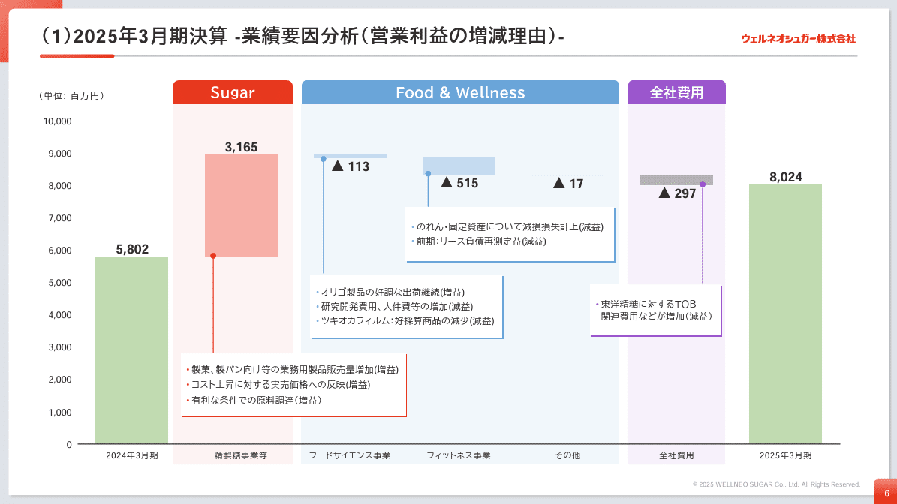
*ページ番号を白抜き文字にするスライド例：ウェルネオシュガー社*

> 引用元：[> 2025年3月期決算・中期経営計画説明会](https://ssl4.eir-parts.net/doc/2117/ir_material_for_fiscal_ym3/180104/00.pdf)

*https://www.wellneo-sugar.co.jp/ir/library/explain/*

*ページ番号をコーポレートカラーの白抜きにするスライド例：オンデック社*

> 引用元：[> 2024年11月期 決算説明資料](https://contents.xj-storage.jp/xcontents/AS04983/9a14a9ae/d1de/43a8/80cb/0a55aba970a6/140120250110548974.pdf)

*https://www.ondeck.jp/ir/presentations*

### 背景色でおしゃれに見せるページ番号

続いては、**パワポのページ番号を黒文字にして何らかの背景色と合わせているデザイン**です。
パワポのページ番号だけにデザインを入れる場合と、背景色の上にページ番号を載せるケースがありますね。

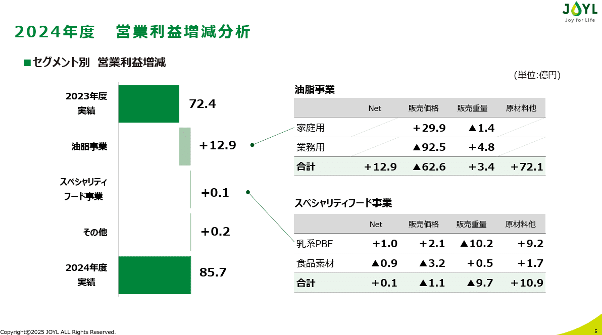
*黒文字のページ番号と背景色のスライド例：Ｊオイルミルズ社*

> 引用元：[> 2025年3月期 通期決算補足資料](https://ssl4.eir-parts.net/doc/2613/tdnet/2609772/00.pdf)

*https://www.j-oil.com/ir/library/presentation.html*

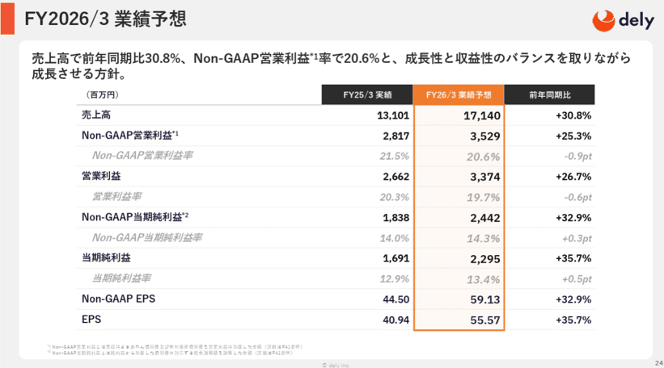
*黒文字のページ番号とグレー背景のスライド例：クラシル社*

> 引用元：[> 2025年3月期 通期決算説明資料](https://contents.xj-storage.jp/xcontents/AS06568/76d2831c/2948/4c2e/a07e/303e1385569e/140120250501529217.pdf)

*https://kurashiru.co.jp/ir/library/presentation/*

### 横線と合わせるデザインのページ番号

続いては、パワポ右下のページ番号に、同系色の横線を合わせるデザインです。**右下のページ番号で完結する場合と、パワーポイント左上にも同色の線が入っているデザイン**があります。

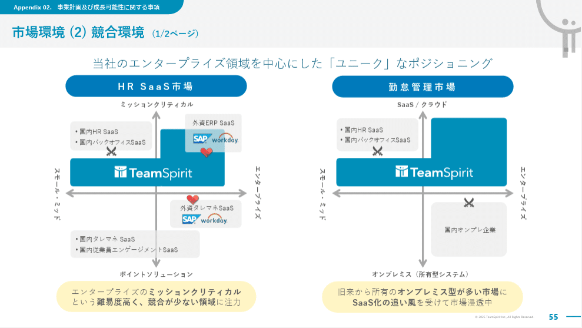
*パワポ右下のページ番号に横線を合わせたスライド例：チームスピリット社*

> 引用元：[> 事業計画及び成長可能性に関する事項のアップデート](https://ssl4.eir-parts.net/doc/4397/ir_material_for_fiscal_ym/188438/00.pdf)

*https://corp.teamspirit.com/ir/ir-library/presentation/*

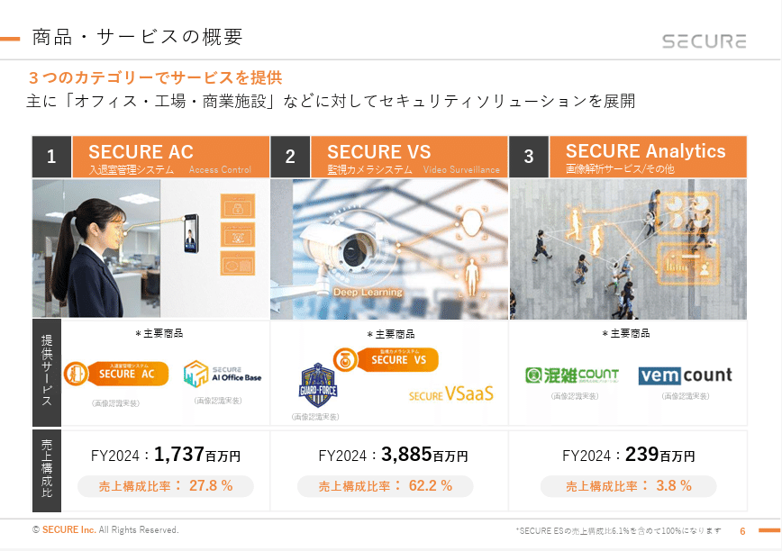
*パワポ右下のページ番号の右横に左上の横線を合わせたスライド例：セキュア社*

> 引用元：[> 2024年12月期決算説明資料](https://contents.xj-storage.jp/xcontents/AS02669/8c71028c/dd72/470c/8f85/5461d1f34732/140120250214576643.pdf)

*https://secureinc.co.jp/ir/presentations/*

### 仕切り線と合わせるデザインのページ番号

最後はパワポのページ番号の左右に仕切り線を入れるデザインです。
**左側のみに仕切り線を入れるデザインと、右側にも仕切り線を入れるデザイン**があります。

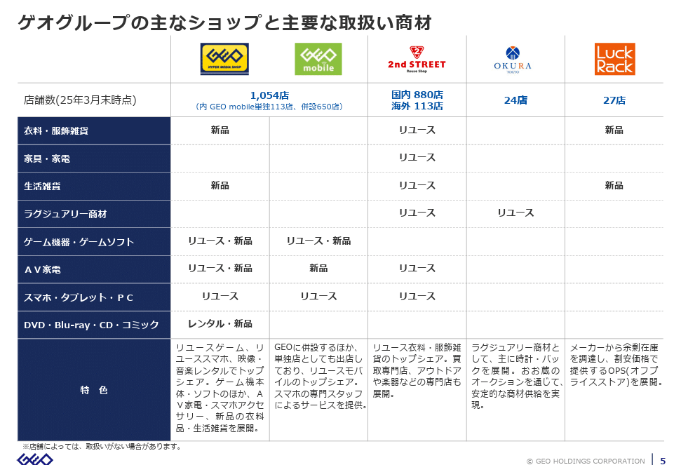
*パワポ右下のページ番号左に仕切りを入れたスライド例：ゲオ社*

> 引用元：[> 2025年3月期　決算説明資料](https://www.geonet.co.jp/geo_wp/wp-content/uploads/2025/05/2681_20250509_presentation_4Q_J_Sebu09.pdf)

*https://www.geonet.co.jp/ir/library/presentation/*

*パワポ右下のページ番号左にスラッシュを入れたスライド例：三井住友FG社*

> 引用元：[> プレゼンテーション資料](https://www.smfg.co.jp/investor/financial/latest_statement/2025_3/2025_fy_setumei.pdf)

*https://www.smfg.co.jp/investor/financial/presentation.html*

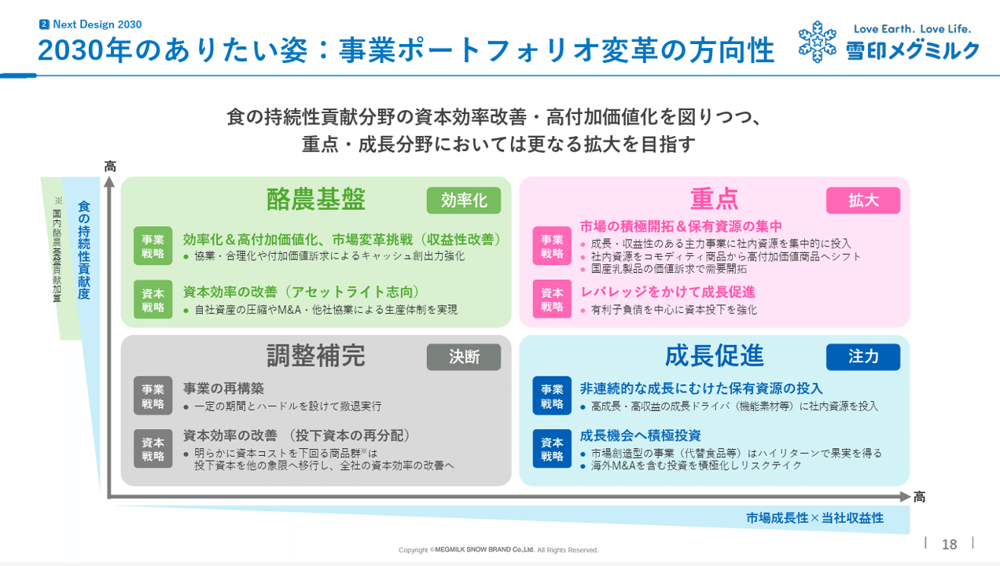
*パワポ右下のページ番号の左右に仕切りを入れたスライド例：雪印メグミルク社*

> 引用元：[> 雪印メグミルクグループ経営計画「Next Design2030」説明会資料](https://contents.xj-storage.jp/xcontents/AS08619/a9b41d9b/eaf5/40e3/831c/ce9646e82c7c/20250514081918914s.pdf)

*https://www.meg-snow.com/ir/library/presentation/*

## ページ番号の大きさ別パワポデザイン例

ここからは、パワポのページ番号の大きさによる印象の違いを見ていきましょう。とはいえあくまでページ番号なので、大きさによる差分はそこまでないと思ってよいでしょう。

### ページ番号が大きいパワポデザイン例

パワポのページ番号が比較的大きいデザインです。傾向として、パワーポイント全体を通して文字が大きいケース、フッターの色が濃いケースなどが挙げられますが、例外的に本文よりページ番号が大きいパワポも存在します。

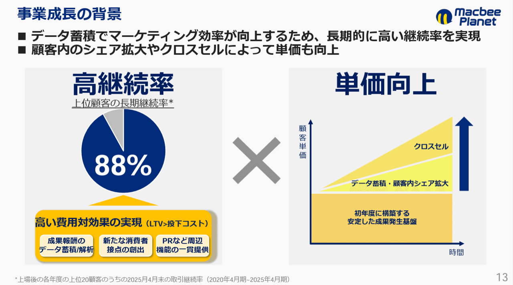
*ページ番号が比較的大きいスライド例：マクビープラネット社*

> 引用元：[> 2025年４月期 通期 決算説明資料](https://macbee-planet.com/ir/upload_file/tdnrelease/7095_20250612588262_P01_.pdf)

*https://macbee-planet.com/ir/library/briefing_materials.html*

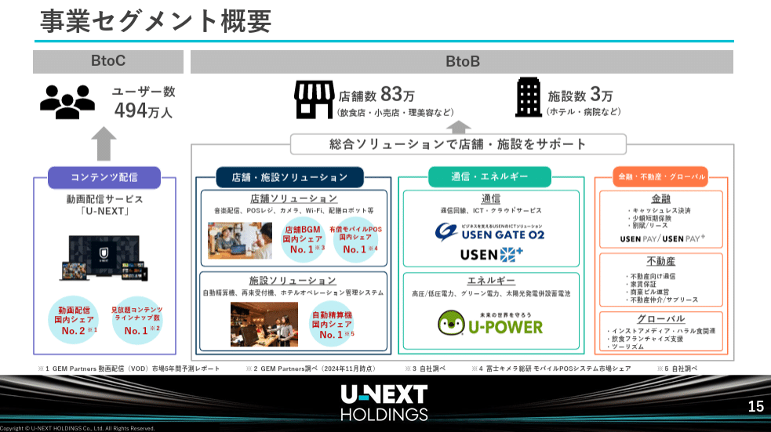
*ページ番号が比較的大きいスライド例：ユーネクスト社*

> 引用元：[> 2025年8月期　通期決算説明資料](https://ssl4.eir-parts.net/doc/9418/ir_material_for_fiscal_ym5/188477/00.pdf)

*https://unext-hd.co.jp/ir/*

さすがに本文よりページ番号が大きいと若干違和感は感じるものの、プレゼンテーションの中で頻繁にページ移動をする場合は、ページ番号が見やすいことが重要になるため、ページ番号の大きさを工夫すると思われます。

### ページ番号が太字のパワポデザイン例

最後に、パワポのページ番号の大きさを変更するのではなく、ページ番号の太さを変えることで見やすくしているデザインです。
とはいえこれも、そこまで大きな差分はないと思ってよいでしょう。

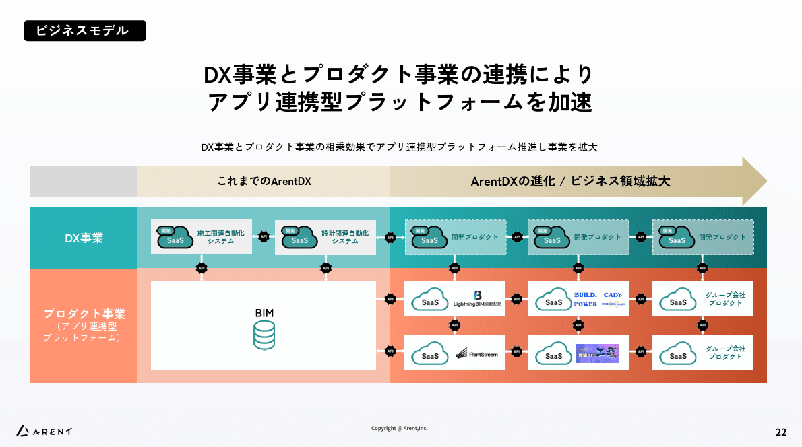
*ページ番号が太字のパワポデザイン例：Arent社*

> 引用元：[> 【訂正】2025年6月期決算説明資料](https://ssl4.eir-parts.net/doc/5254/tdnet/2669039/00.pdf)

*https://arent.co.jp/ir/library/presentation/*

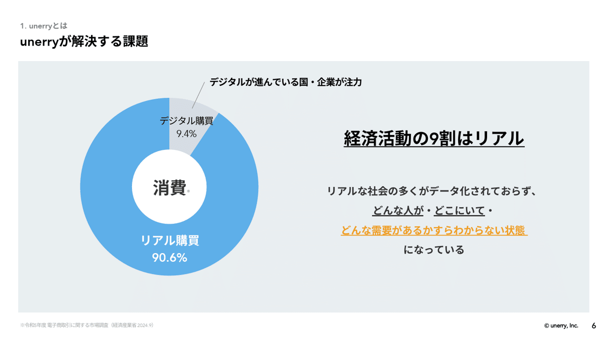
*ページ番号が太字のパワポデザイン例：Unerry社*

> 引用元：[> 2025年6月期通期 決算説明資料](https://contents.xj-storage.jp/xcontents/AS82460/42cb224e/d3dc/493d/aced/dd7acff9c7b3/140120250812539357.pdf)

*https://www.unerry.co.jp/ir/presentations/*

*ページ番号が太字のパワポデザイン例：スカラ社*

## パワポのページ番号の編集方法

ここからはパワポのページ番号の編集方法について解説していきますね。
内容にかかわらず、**ページ番号を編集したい場合に使うのはパワポのスライドマスターの機能**になります。

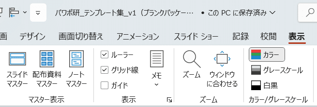
*スライドマスターのタブ*

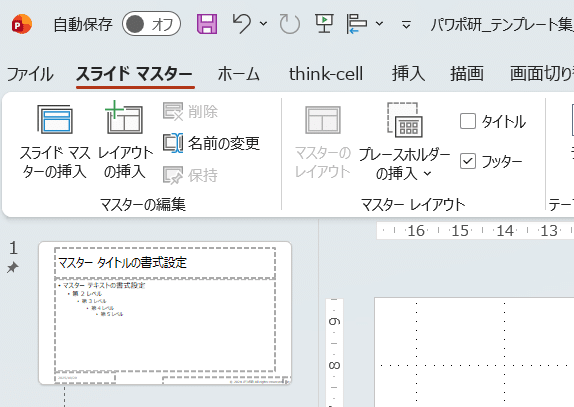
*スライドマスターモード*

ここからは編集したい内容に応じて解説をしていきます。

### パワポのページ番号を自動で入れる方法

まずはパワポのページ番号が自動で入るようにする方法から行きましょう。
**スライドマスターを開いて左側の部分で右クリックし、「スライドマスターの挿入」を選択**します。

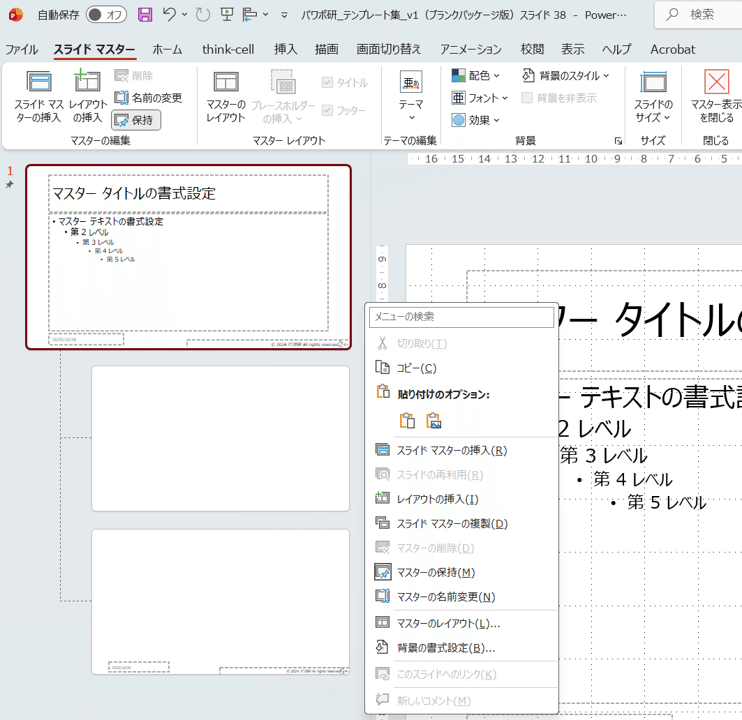
*新しいスライドマスターの挿入*

新しいスライドマスターの右下に＜#＞が入っていれば、パワポに自動でページ番号が入るようになりますよ。

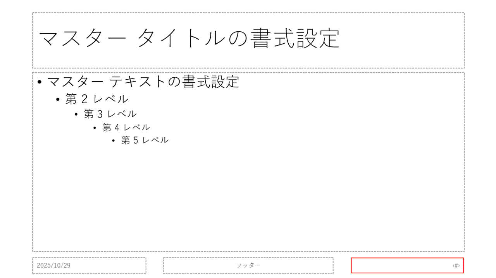
*ページ番号の入る場所*

＜#＞が入っているテキストボックスを移動させれば、左下、右上、真ん中など、**パワポの好きな位置にページ番号を入れることができる**ようになります。

### パワポのページ番号を消す方法

先ほどの方法で、パワポのページ番号が自動で入るようになりましたが、

- パワポのページ番号は入れたいが表紙以外にしたい

- パワポのページ番号は途中から入れたい

- パワポのページ番号を消す方がいいスライドがある

など、**すべてのスライドにページ番号が入るのは困る**、といったこともあると思います。その場合は、対象のスライドからスライドマスターを開いたうえで、ページ番号の無いスライドを選びましょう。

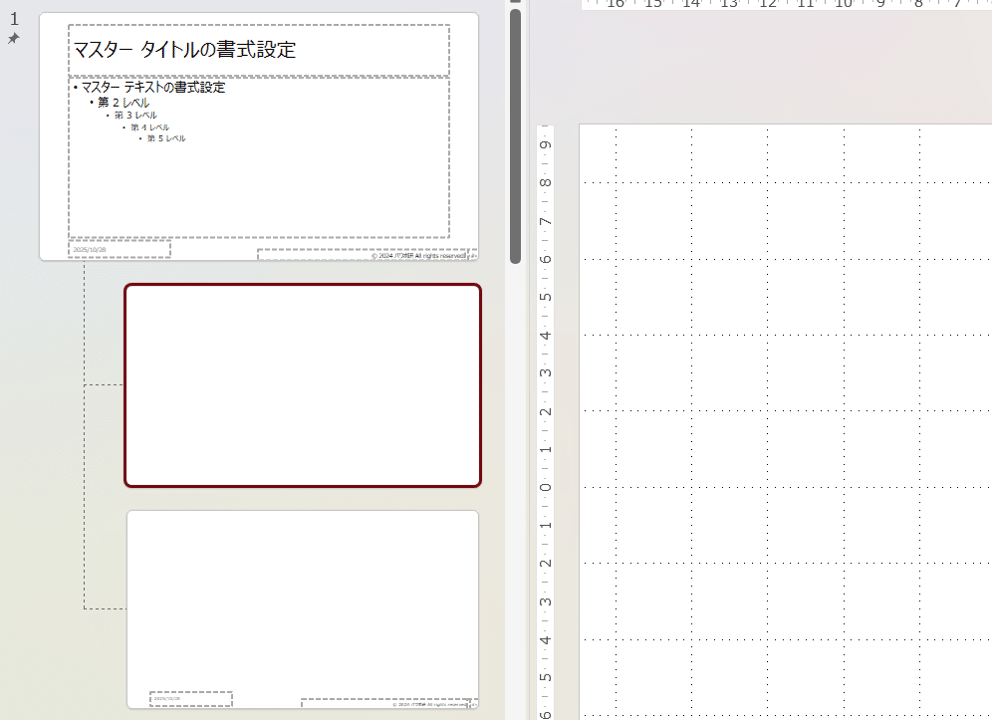
*ページ番号の無いスライドマスター*

上の赤枠のスライドを選ぶと、他のフッターやレイアウトもすべてなくなるので、フッターは残したいといったケースではそうしたマスターを作っておく必要があります。

### パワポのページ番号のデザイン方法

最後にページ番号のフォントを変えたり、最初に見たようなデザインを入れる方法を見ていきましょう。
これも難しくはなく、＜#＞のテキストボックスを加工すればOKです。

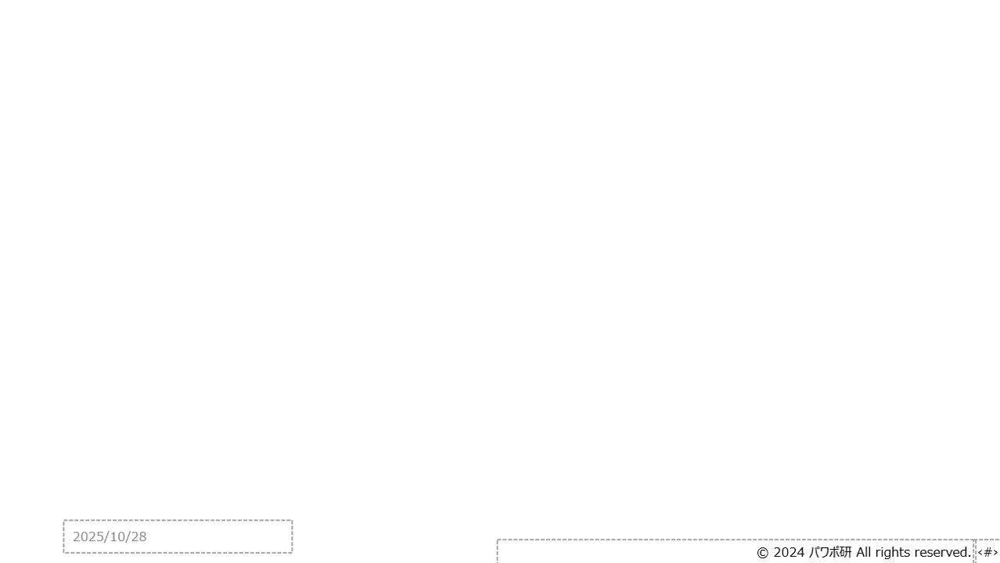
*スライドマスターの変更前*

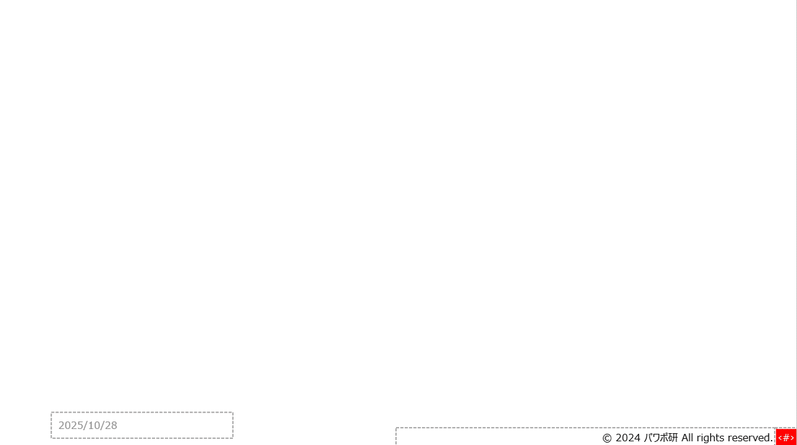
*スライドマスターのページ番号を赤色にする*

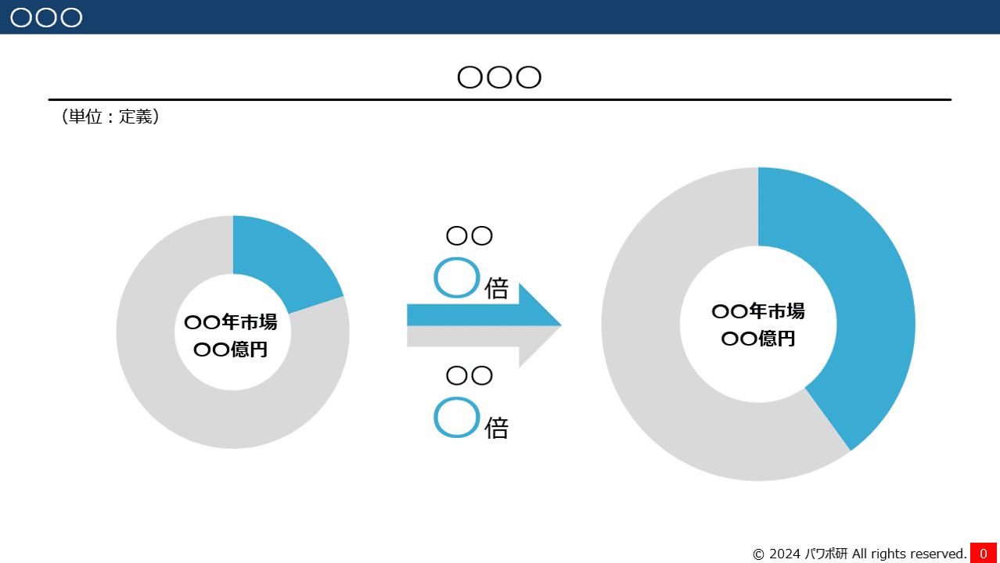
*パワポのページ番号も赤色になる*

## パワポ研オリジナルテンプレート

パワポ研では、「ビジネスシーンで使える」パワーポイントテンプレートを公開しております。デザインを整えるのみならず、**ロジックやストーリーを整理するのにも役立つパッケージ**になっておりますので、関心のある方は下記ページも併せてご覧ください！！

[
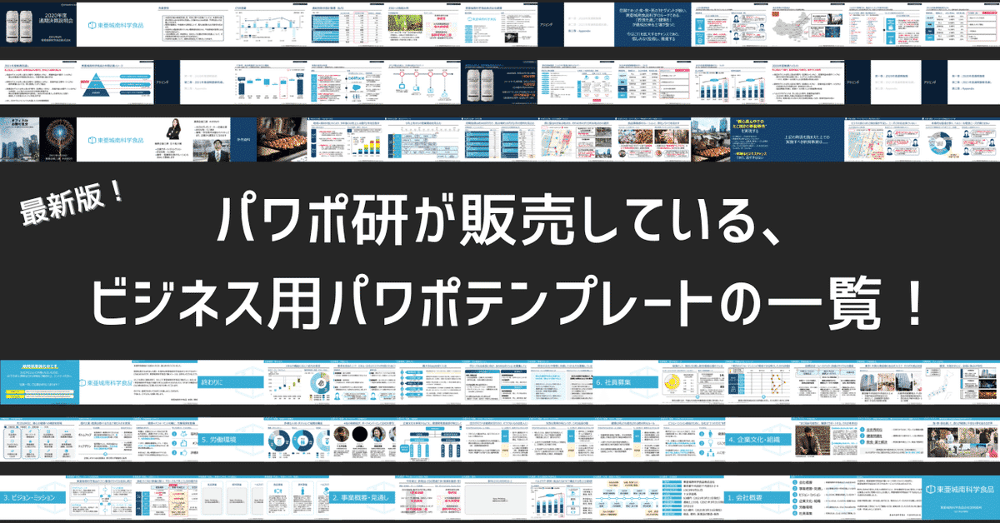
](https://note.com/powerpoint_jp/n/n7300a1293e8e)上記の記事のように、noteでは**フォローしているだけでビジネスにおける「資料作成のコツ」と「デザインのセンス」が身に付くアカウント**を目指して情報配信を行っています。
今後もコンスタントに記事を配信していく予定なので、関心のある方は是非アカウントのフォローをお願いします！

**> Template販売　**[> https://powerpointjp.stores.jp/](https://powerpointjp.stores.jp/%EF%BF%BCnote)
**> note　**[> パワポ研の資料作成術](https://note.com/powerpoint_jp/m/mc291407396da)
**> X（旧Twitter)　**[> https://twitter.com/powerpoint_jp](https://twitter.com/powerpoint_jp)

## レックスアドバイザーズからのお知らせ

パワポ研は株式会社レックスアドバイザーズが運営しています。
レックスアドバイザーズは**経営企画職や経営管理職に特化した転職エージェント**です。
上場企業や上場準備企業を中心に、**経営企画、IR、経理財務、法務、内部監査等の職種の求人**をご紹介しているほか、**CFOなどのコンフィデンシャル求人**もご紹介可能です。
またコンサルティングファームや監査法人、会計事務所の求人も豊富にあるため、プロフェッショナルファームを目指す方のご支援も得意です。
求人紹介やキャリア相談を希望の方は、[**無料転職サポート**](https://www.career-adv.jp/job_search/entryform_exp/?utm_source=note&utm_medium=referral&utm_campaign=note_pp)よりサービス利用登録をしてみてください。

*レックスアドバイザーズのサービスサイトはこちら*

**> 求人をご希望の方　**[> 無料転職サポート](https://www.career-adv.jp/job_search/entryform_exp/)**
> 採用支援をご希望の方　**[> 採用サポート](https://www.career-adv.jp/request3/)
**> その他　**[> お問い合わせフォーム](https://www.rex-adv.co.jp/contact)
**> 書籍　**[> 注目企業の実例から学ぶパワポ作成術](https://www.amazon.co.jp/dp/4046060476)

