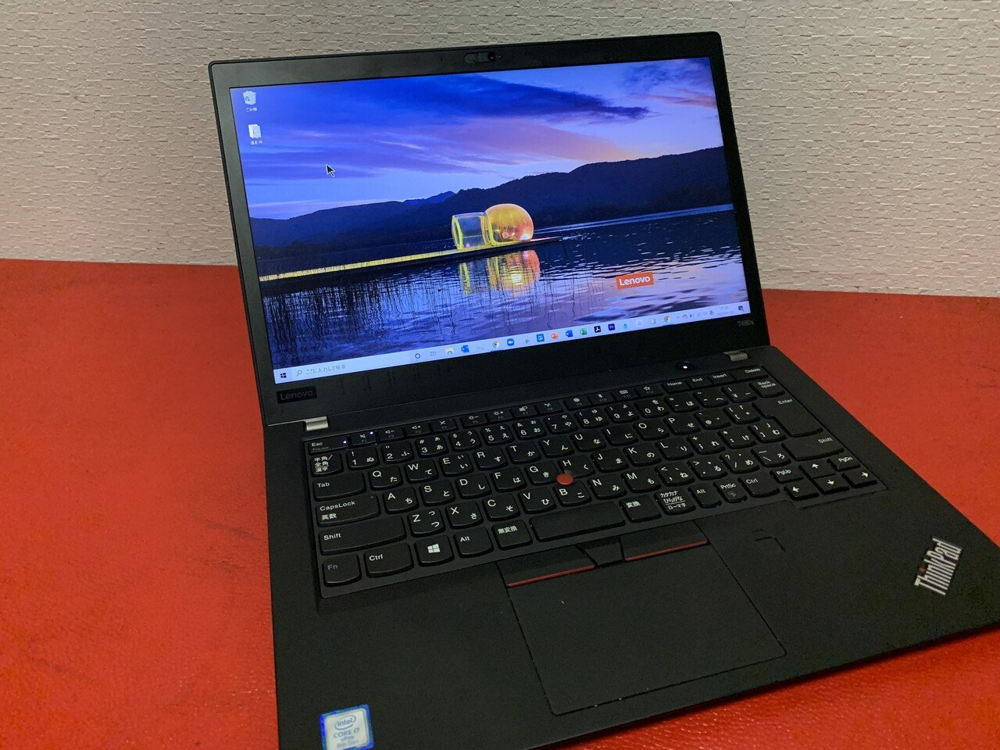
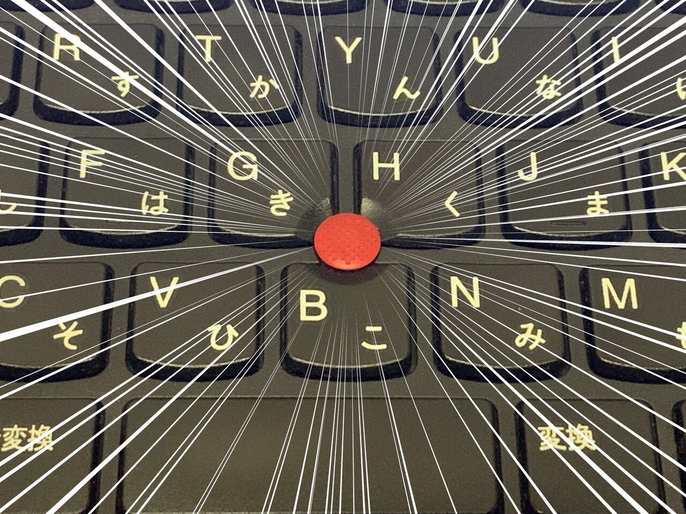
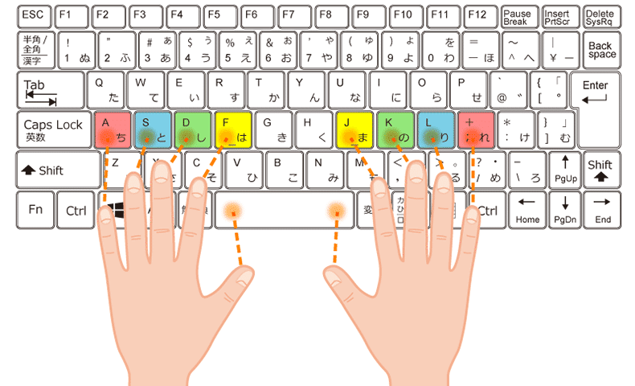
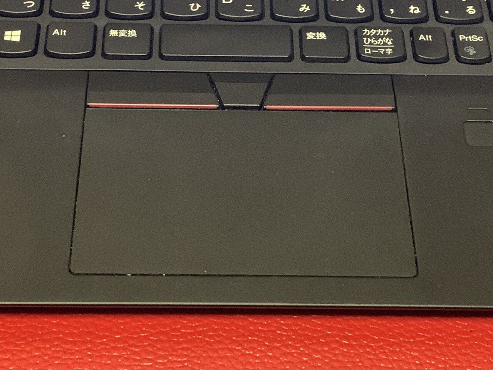
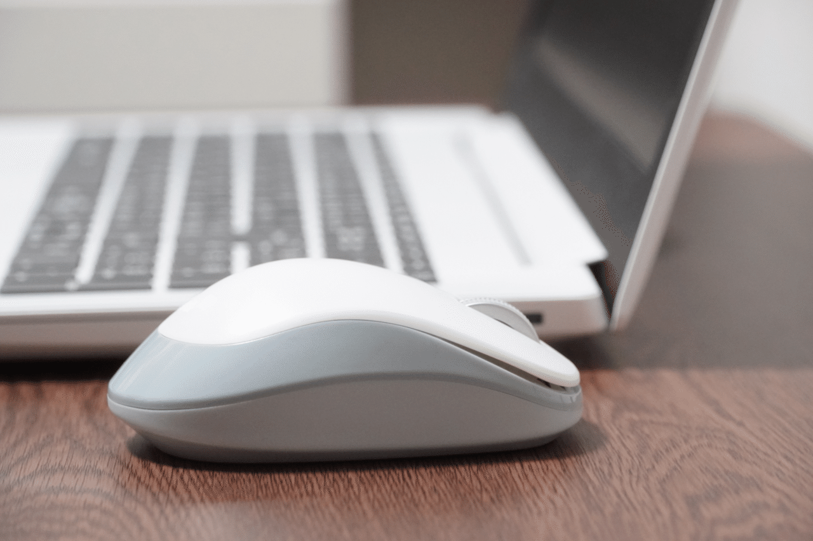
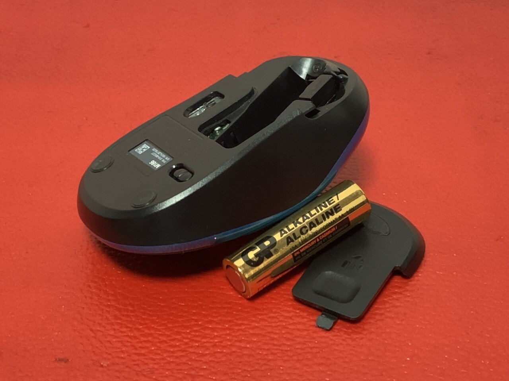
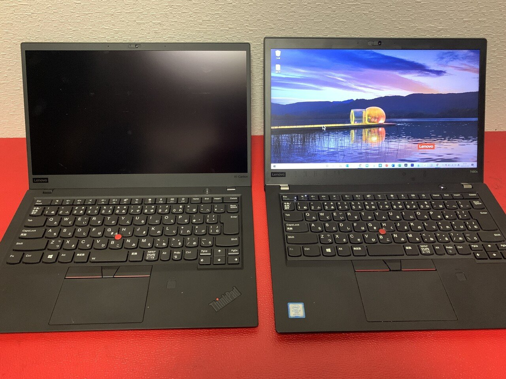
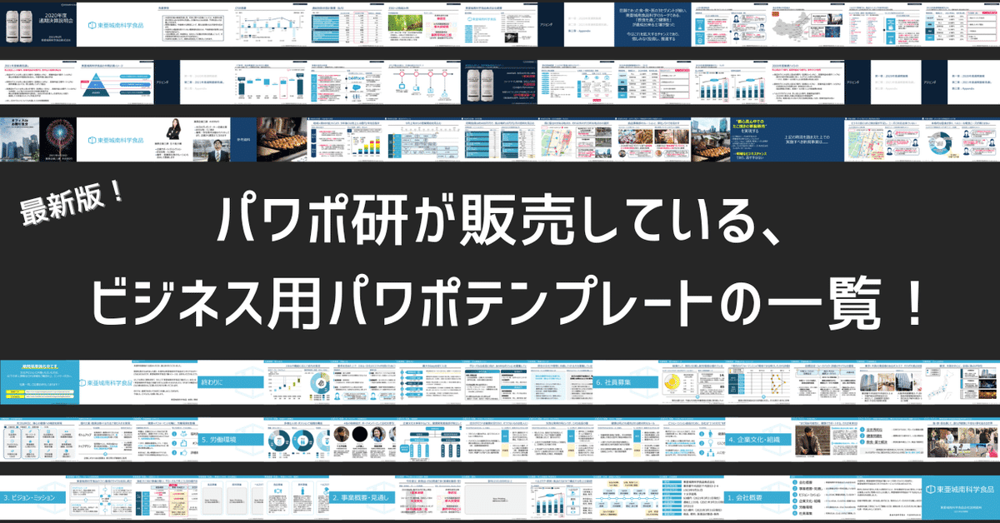

# 【使おう赤ポチ】トラックポイントへの偏愛を語らせてくれないか【Lenovo】

[note原文](https://note.com/powerpoint_jp/n/nc1596fd36212)

パワーポイント資料作成を生業としているパワポ研ですが、主力メンバーはPCにLenovoのThinkpad（シンクパッド）を採用しています。

なぜなら、**トラックポイント（通称、赤ポチ）を採用しているから！
**トラックポイントといえばThinkpadですが、lenovoのPC以外ではなかなかお目に掛かれません。

使っている人間に話を聞いたところ、「赤ポチ（トラックポイント）のないノートパソコンなんて考えられない。**赤ポチをもってして、ノートパソコンは完成する。それ以外のPCは全て未完成だ**」とまで言ってのけました。過激派ですね。正直なところ、そこまでではないとはないと思いますが……。

そんな彼は、社内のPCを全てトラックポイント付きのノートPCに変更したいという野望を持っています。社内にはLenovo以外のPCユーザーもいるので、それは少し出来ない相談なのですが……。それでも成し遂げたいということなので、トラックポイントのメリットを以下語ってもらいました。本当は3倍程度の文章量と熱量があったのですが、読みやすさを優先して泣く泣く編集したという経緯を、あらかじめご了承ください。

## トラックポイントを使えばホームポジションから動く必要がない。だから速い

パワポ作成を含む**ビジネス・シーンでのPC利用は、スピードが命**です。そのためにビジネス・パーソンはタッチタイピングを覚えたり、フォルダを整理したり、セカンドディスプレイを導入したりしています。では何故マウスを手放さないのか！あるいは、タッチパッドを利用しているのか！

トラックポイントの最大のメリットは、**ホームポジションから手を動かさなくてよい点**です。ホームポジションとは、左手の人差し指を「F」、右手の人差し指を「J」にセットした運指ポジションです。

（ホームポジション：出典[Nomark-Log様](https://no-mark.jp/company/touchtyping.html)）

### トラックポイントvsマウス

Thinkpadでトラックポイントを使う場合、カーソルを動かす際にもキーボードから一切手を放すことなく、ホームポジションを維持できます。他のポインティングデバイス、例えばマウスなら、いちいちキーボードから手を放してマウスを掴んでクリックして入力して手を放してホームポジションを探して……という動作が発生するところを、**トラックポイントなら完全にシームレスに、様々な作業を行うことができます**。

特に、パワポ作成においてはオブジェクトを右に左に動かすことが多いです。個人の力量次第ですが、ショートカットを覚えるのにも限界があります。流石にカーソルの移動を全く使わずに資料を作るのは難しいのではないでしょうか。その際には、マウスよりもトラックポイントの方が、圧倒的に素早く作業を完遂できます。

### トラックポイントvsタッチパッド

もちろん、タッチパッド（キーボード下部の部分）でよいのでは、という意見もあるとは思います。Lenovoにもタッチパッドはあります。しかしタッチパッドでは、やはり手をいったんキーボードから離すという作業が発生してしまうのです。それは最小限に留めたい。

また、タッチパッドを高感度にした場合には、誤タッチが一定程度発生します。しかし、感度が低いと作業に支障が出る……。そんな悩みもトラックポイントで解決できます。トラックポイントのユーザーは、タッチパッドの感度を大きく下げ、必要な際（例えば、WEBで画面を大きく拡大する場合など）だけしっかりとタッチすることにしています。こうすれば不具合は一切発生しません。

更に、タッチパッドは指先が濡れている、ささくれている、手袋をしているなどの理由によりセンサの反応が変わります。**トラックポイントは純粋にかかる圧力だけを認識しているので、そのような不具合は一切発生しない**。屋外の利用でも困らない。これも大きなメリットです。

## トラックポイントを使うことでショートカットキーの手数が増える。だから速い

トラックポイントを利用すれば、いつでもマウスに手が届くようなものだからショートカットを利用しなくなる……そんな懸念が私にもありました。しかし、結論から述べると全くそんなことはありませんでした。

というのも、**常に手がホームポジションに近い位置にあるので、ショートカットキーにも手が近くなった**のです。例えば、右手にマウスを常に持っていた場合、左手でAltやCtrl、Shiftキーを押して（あるいは、押しながら）他のキーを押せるというのは、左手が届く範囲に限定されます。一方で、手が常にキーボードに載っていると、そんな心配は無用です。どのようなショートカットでも自由自在に操れます。

また、せっかくトラックポイントを利用することで作業が速くなったので、これを機会にもっと早くしよう、という気にもなります。少し作業が速いだけでは大したアドバンテージにはなりませんが、**ショートカットキーとトラックポイントの合わせ技で、周囲より圧倒的なスピードを身に着けることが出来ます**。何事も突き抜ける、ということは肝要です。

## トラックポイントを使うことでマウスのトラブルとも無縁。だから速い

マウスを使う作業効率的なデメリットについては上記でさんざん書いたのですが、実は物理的なデメリットもあります。

そもそも、マウスを持ち運ぶデメリットが大きいのです。
まず、**忘れものリスク**。現代のビジネス・パーソンはスマートフォン、Wifiルーター、ワイヤレスイヤホン、充電器等々持ち運ぶべきアイテムが多数抱えています。その上、マウスまでもとなると随分荷が重いのではないでしょうか。特に、ワイヤレスのマウスは紐でつながっていないため忘れがちです。私の同僚も、常駐先に忘れたりしていました。また、慌てて退出する際にするりと滑り落ちるのを見たのも一度や二度ではありません。そういった物理的なリスクがあります。そして、マウスを普段運用している人は、ことマウスを失うと作業効率が激減します。慣れないタッチパッドで作業をこなすのは難しいし、ストレスも溜まることでしょう。

また、**マウスが壊れる・性能が低下するアクシデントがあった時には全く対応できません**。もちろん、トラックポイントも壊れることは（滅多にないですが）あります。しかし、マウスは落下リスクもありますし、また机と接触するセンサー部分汚れたり調子が悪かったりすると、これも使いものになりません。リスクの大きさが全く違うのです。マウスはワイヤレスの場合電池切れもありますしね。そもそもワイヤレスでない場合は、紐が圧倒的に邪魔です。

## 使い方はいたってシンプル。トラックポイントを導入しよう！

さて、トラックポイントの魅力は十分に伝わったでしょうか。マウス派の方からすると、使い方に慣れるのに少し時間が借るかもしれませんが、マウスを動かすだけなので使い方はシンプルです。

微調整があるとしても、トラックポイントの感度の調整や、人差し指の稼働くらいなので、それほど時間画家kるものではありません。トラックポイントを使えるようになったら、それこそ最初にかかった時間はすぐに取り返せます。

今すぐPCの買い替えを推奨したいところです。ちなみに、ThinkPadは広告が限定的なため、同スペックのPCに比べてお値打ちなことが多いです。また、直営のECサイトがしょっちゅうセールを行っているので、そちらで購入することをお勧めします。

 
[
**
レノボ公式オンラインショッピング | レノボジャパン
**

レノボ・ジャパン公式サイト。最新のノートパソコン、デスクトップパソコン、タブレットが✅当サイト限定の特別価格！✅お得なセー

www.lenovo.com

](https://www.lenovo.com/jp/ja/jpad?Redirect=False)

 
なお、**トラックポイントが付いた専用のキーボード**も発売されています。私はノートPC本体のキーボードにトラックポイントが付いているので今のところ購入予定はありませんが、Bluetooth対応のものもラインナップされているので、ThinkPad以外（LenovoのPC以外）のユーザーこれを機に導入を検討していただきたい。後悔はしないでしょう。

 
[
**
レノボ・ジャパン 4Y40U90591 ThinkPad Bluetooth ワイヤレス・トラックポイント・キーボード-日本語(NFC搭載なし)
**

www.amazon.co.jp

 
17,800円

(2021年01月02日 21:03時点
詳しくはこちら)

 
 
 

Amazon.co.jpで購入する

 
 
](https://www.amazon.co.jp/dp/B07V7D59SL?tag=note0e2a-22&linkCode=ogi&th=1&psc=1)

 
なお、もちろん「手や指の腱に負担がかかる（左手と右手で適宜ポイントを操作する手を変更すればマシになる）」「トラックポイントが勝手に動くことがある（ポイントを一度外せばほぼ解消する）」「トラックポイントが削れていく（定期的に交換すれば問題ない）」などのデメリットがあることは理解しています。

しかしそれでもなお、**メリットがデメリットを優に上回る**とと、私は確信しています。パワポ作成に追われるユーザーには、是非とも推奨したい。私は、私物と会社用のPC、二台ともトラックポイントが付いたPCを採用しています。もちろん、全く不具合、後悔はありません。

なので、パワポ作成に関わる人は、今すぐトラックポイントが付いたPCあるいはキーボードを導入しましょう！　作業スピードが数段上がること、間違いありません！

※編集部注：トラックポイントの利用でパワポ作成が速くなることは間違いありません。しかし、PCの運用形態によっては、トラックポイントが適さない場合もあります。PCの利用状況に合わせて、賢くノートPCを選んでください。

## パワポ研オリジナルテンプレート

パワポ研では「ビジネスシーンで使える」パワーポイントテンプレートを公開しております。デザインを整えるのみならず、**ロジックやストーリーを整理するのにも役立つパッケージ**になっておりますので、関心のある方は下記ページも併せてご覧ください！

上記の記事のように、noteでは**フォローしているだけでビジネスにおける「資料作成のコツ」と「デザインのセンス」が身に付くアカウント**を目指して情報配信を行っています。
今後もコンスタントに記事を配信しいく予定なので、関心のある方は是非アカウントのフォローをお願いします！

**> Template販売　**[> https://powerpointjp.stores.jp/](https://powerpointjp.stores.jp/%EF%BF%BCnote)
**> note　**[> パワポ研の資料作成術](https://note.com/powerpoint_jp/m/mc291407396da)
**> X（旧Twitter)　**[> https://twitter.com/powerpoint_jp](https://twitter.com/powerpoint_jp)

## レックスアドバイザーズからのお知らせ

パワポ研は株式会社レックスアドバイザーズが運営しています。
レックスアドバイザーズは**経営企画職や経営管理職に特化した転職エージェント**です。
上場企業や上場準備企業を中心に、**経営企画、IR、経理財務、法務、内部監査等の職種の求人**をご紹介しているほか、**CFOなどのコンフィデンシャル求人**もご紹介可能です。
またコンサルティングファームや監査法人、会計事務所の求人も豊富にあるため、プロフェッショナルファームを目指す方のご支援も得意です。
求人紹介やキャリア相談を希望の方は、[**無料転職サポート**](https://www.career-adv.jp/job_search/entryform_exp/)よりサービス利用登録をしてみてください。

**> 求人をご希望の方　**[> 無料転職サポート](https://www.career-adv.jp/job_search/entryform_exp/)**
> 採用支援をご希望の方　**[> 採用サポート](https://www.career-adv.jp/request3/)
**> その他　**[> お問い合わせフォーム](https://www.rex-adv.co.jp/contact)
**> 書籍　**[> 注目企業の実例から学ぶパワポ作成術](https://www.amazon.co.jp/dp/4046060476)

