# 【マネしたい】パワポのわかりやすい「概念図」「イメージ図」デザイン９選

[note原文](https://note.com/powerpoint_jp/n/nc4be4fdb0b91)

みなさんこんにちは。
資料デザインのリサーチや分析に取り組むパワーポイントのスペシャリスト、パワポ研です。

今回は、**パワポの「概念図」「イメージ図」スライドに焦点を当て、上場企業のIR資料から参考事例を紹介**していきます。概念図やイメージ図のスライドは、事業ポートフォリオの紹介でも使われますね。

まずはパワポの「概念図」「イメージ図」とは何なのか、軽く触れた上で、概念図のデザイン例を紹介していきます。では早速行きましょう！

## パワポの「概念図」「イメージ図」とは

パワポの資料作成において、「概念図」「イメージ図」とは、事業やサービスの内容が一目でわかるようにまとめる際に使われます。一目でわかるようにというのがポイントなので、イラストなどを使いながら、直感的にわかるようなデザインにすることが多いですね。

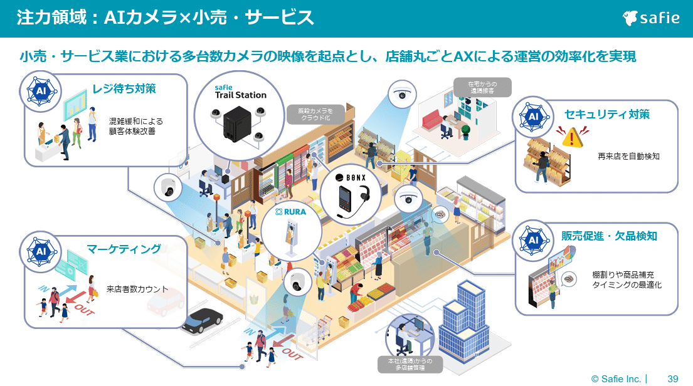
*セーフィー株式会社の「概念図」デザイン*

> 引用元：[> 事業計画及び成長可能性に関する事項](https://ssl4.eir-parts.net/doc/4375/tdnet/2780302/00.pdf)

*https://safie.co.jp/ir/*

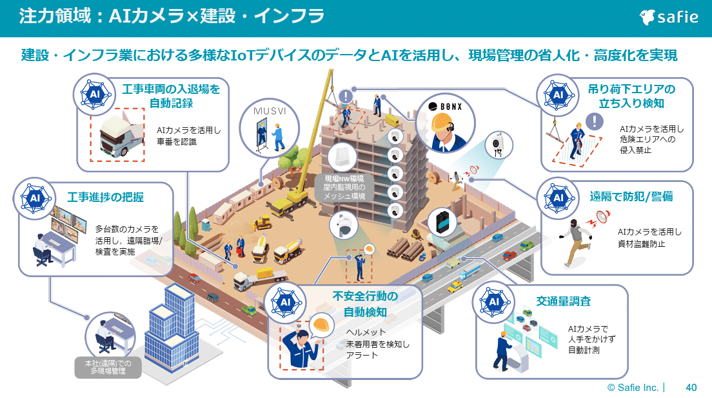
*セーフィー株式会社の「サービス図」デザイン*

「概念図」や「イメージ図」は名前の通り、まずは**視覚的に事業内容やサービス内容を伝えることに重きを置いており、ディテールはそこまで書き込まない**ことが多いです。
セーフィー株式会社の「概念図」「イメージ図」のデザインでは、小売店や建設現場の全体像をイラストで示しつつ、その中で自社がどのようなサービスを提供しているのかを、矢印と簡単なテキストで示すようなデザインになっています。

## わかりやすい概念図のデザイン例３選

まずは事業やサービスについて、概念図を使ってわかりやすいデザインで紹介している例から見ていきましょう。様々なサービスを展開していて事業ドメインが多岐にわたる場合、概念図のイラストなどを使って全体像を見えるようにするデザインが効果的です。

### わかりやすい事業の概念図のデザイン例

まずは株式会社IDホールディングスのパワポにおける「概念図」のデザイン例から見ていきましょう。
2025年3月期 決算説明資料のパワーポイントにある、「IDグループのビジネスドメイン」のスライドです。

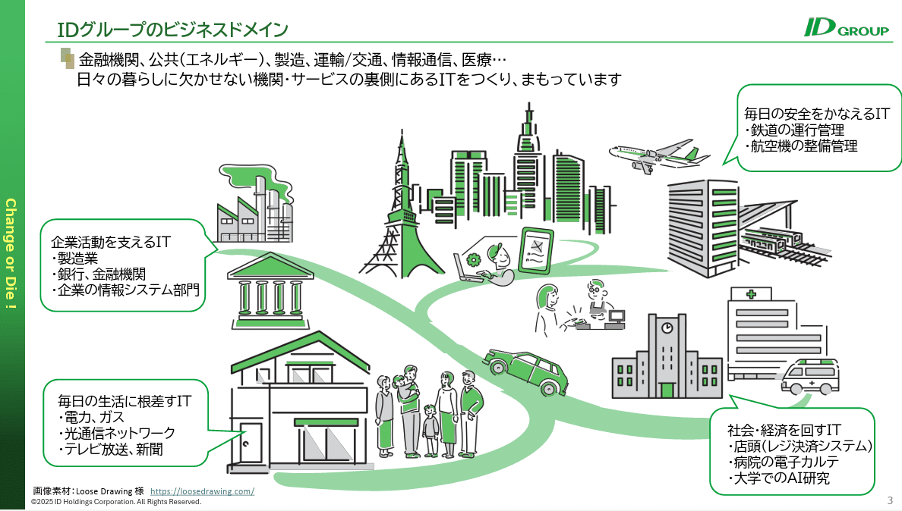
*株式会社IDホールディングスの概念図スライド*

> 引用元：[> 2025年3月期 決算説明資料](https://ssl4.eir-parts.net/doc/4709/tdnet/2621612/00.pdf)

*https://www.idnet-hd.co.jp/ir/news.html*

パワポの「概念図」スライドの特徴としては**、イラストを使ってどういった事業ドメインでサービスを提供しているかわかりやすく紹介している点**が挙げられます。道が分岐し、家や工場、病院、公共交通機関といったイラストごとに、どのようなサービスを提供しているか、概念図で示しています。

IDホールディングスのように、幅広い領域にサービスを提供している場合、概念図やイメージ図を使うことで、事業ドメインの広さがわかりやすい形で伝わってよいですね。

### 事業イメージが伝わる概念図のデザイン例

続いて株式会社U-NEXTHOLDINGSのパワポにおける「概念図」のデザイン例です。
中期経営計画の策定に関するお知らせのパワーポイントにある、「コーポレートスローガン：『NEXT for U』」のスライドを見てみましょう。

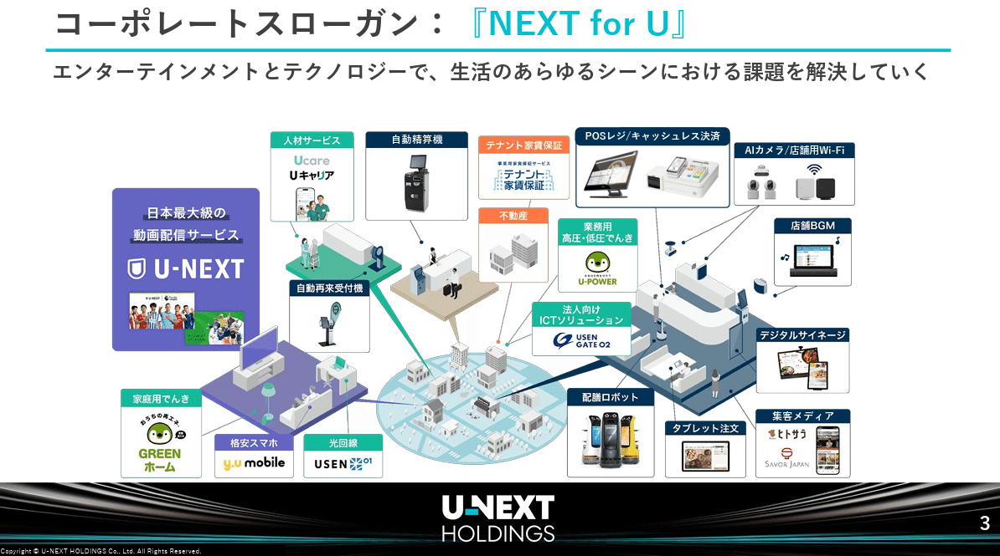
*株式会社U-NEXTHOLDINGSの概念図スライド*

> 引用元：[> 中期経営計画の策定に関するお知らせ](https://ssl4.eir-parts.net/doc/9418/tdnet/2697345/00.pdf)

*https://unext-hd.co.jp/ir/news.html*

パワポの「概念図」スライドの特徴としては、**街中のイメージからクローズアップして、店舗や家や学校などより詳細なイメージ図を見せている点**が挙げられます。U-NEXTの様々なサービスが使われるシーンとして、家、学校、銀行、店舗などをクローズアップし、その中でどのようなサービスが使われるかをプロットしています。

実際にサービスの紹介をするにあたっては、ロゴやサービスの画像などを見せるのが一番わかりやすいです。そこで、イメージにロゴやサービスを組み合わせるデザインが効果的ということですね。

### 目指す姿がわかる概要図のデザイン例

次に株式会社ハッチ・ワークのパワポにおける「概念図」のデザイン例を見てみましょう。
事業計画及び成長可能性に関する説明資料のパワーポイントにある、「成長戦略３ーファーストワンマイルステーション構想ー」のスライドです。

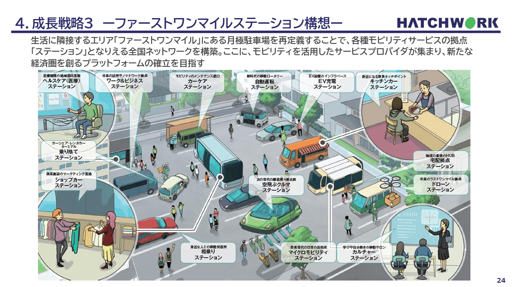
*株式会社ハッチ・ワークの概念図スライド*

> 引用元：[> 事業計画及び成長可能性に関する説明資料](https://contents.xj-storage.jp/xcontents/AS08743/678539a6/8779/461b/a41d/5561cef8965c/140120260326589451.pdf)

*https://hatchwork.co.jp/ir*

パワポの「概念図」スライドの特徴としては、**将来に目指す姿を見せるために概念図を使っている点**が挙げられます。ファーストワンマイルステーション構想という、生活に隣接する月極駐車場を各種モビリティサービスの拠点にする構想をイメージ図でデザインしています。

事業者が想定する未来については、投資家側はなかなかイメージが湧きづらいため、イラストを使ったイメージ図を使うのが効果的という例ですね。

## エコシステムの概念図のデザイン例３選

続いてはエコシステムの説明をするために概念図やイメージ図のデザインを使っているスライド例を見ていきましょう。概念図やイメージ図のスライドの中でも、循環構造やレイヤー構造を可視化するのに概念図やイメージ図ののデザインを使っている例を紹介します。

### 未来のエコシステムの概念図デザイン例

まずは株式会社雨風太陽のパワポにおける「概念図」のデザイン例を見ていきましょう。
事業計画及び成長可能性に関する説明資料のパワーポイントにある、「私たちの考える未来」のスライドです。

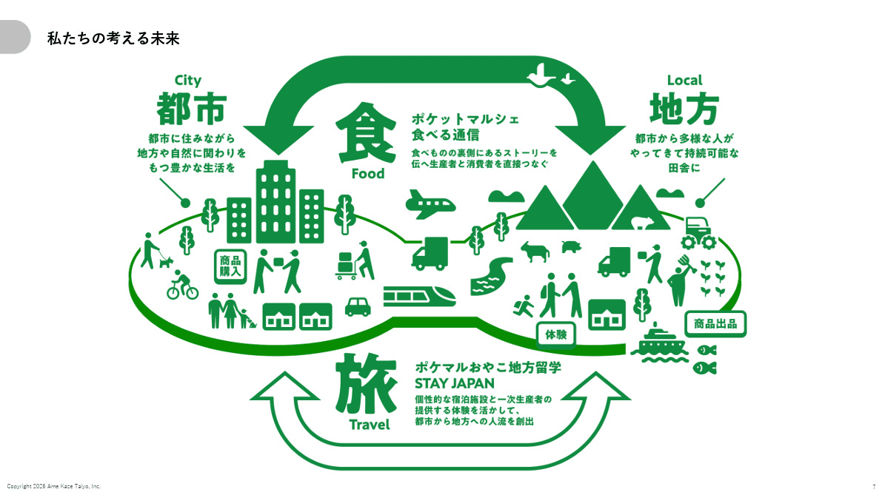
*株式会社雨風太陽の概念図スライド*

> 引用元：[> 事業計画及び成長可能性に関する説明資料](https://contents.xj-storage.jp/xcontents/AS05841/4fdad48d/30df/4388/bfdc/cf533a958a72/140120260325588922.pdf)

*https://ame-kaze-taiyo.jp/ir/*

パワポの「概念図」スライドの特徴としては、**サービスがどのように連動しているのか、どのように循環しているのかを説明している点**が挙げられます。地方と都市を、食のポケットマルシェと、旅のポケマルおやこ地方留学でつなぐというエコシステムを概念図のデザインで見せています。

世界観を見せるにあたって、イラストやアイコンを使って見せるデザインですが、全体を緑色一色で作ることで、まとまりのある資料となっています。

### プラットフォーム事業のイメージ図の例

続いてウェルネス・コミュニケーション株式会社のパワポにおける「イメージ図」のデザイン例を見てみましょう。
事業計画及び成長可能性に関する事項のパワーポイントにある、「健康診断を起点とした強固なプラットフォームの展開」のスライドです。

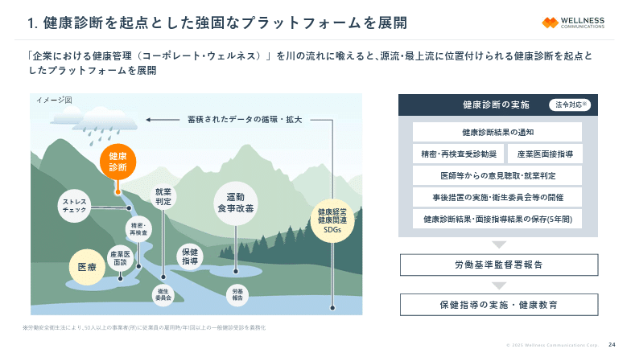
*ウェルネス・コミュニケーション株式会社のイメージ図スライド*

> 引用元：[> 事業計画及び成長可能性に関する事項](https://contents.xj-storage.jp/xcontents/AS05024/f07105d4/224b/4949/bb38/3f16e6c11299/140120250620595058.pdf)

*https://wellcoms.jp/ir/news/*

パワポの「イメージ図」スライドの特徴として、**プラットフォームのエコシステムを森のエコシステムになぞらえて概念図にしている点**が挙げられます。健康診断やその結果をもとに、食事改善などの指導のデータや医療のデータが蓄積され、循環していく仕組みを、森のエコシステムのデザインで表現しています。

プラットフォーム事業においては、循環図を使ってデータの蓄積による好循環を示すことも多いですが、このように様々な事業があることを見せる上では循環図よりこうしたエコシステムのアナロジーで見せるとわかりやすいという好事例ですね。

### 事業エコシステムの概念図デザイン例

次に株式会社Synspectiveのパワポにおける「概念図」のデザイン例です。
事業計画及び成長可能性に関する事項のパワーポイントにある、「事業領域」のスライドです。

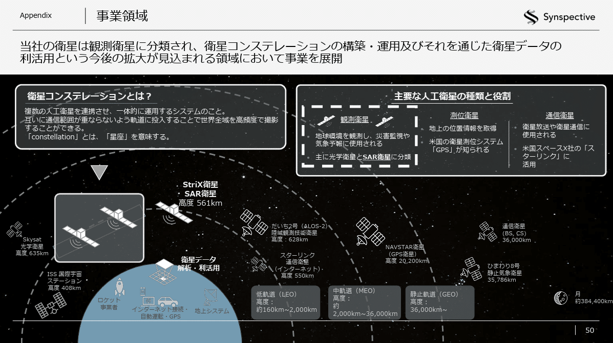
*株式会社Synspectiveの概念図スライド*

> 引用元：[> 事業計画及び成長可能性に関する事項](https://contents.xj-storage.jp/xcontents/AS04951/cf9b0f86/4fdc/406e/91e5/2900a1b7a719/140120260331594773.pdf)

*https://synspective.com/jp/ir/*

パワポの「概念図」スライドの特徴として、**事業のエコシステムをイラストを使ってわかりやすいデザインで紹介している点**が挙げられます。主要な人工衛星のタイプや衛星コンステレーションを、イラストを使って地球からの距離ごとに整理しています。

事業のカテゴリーを見せるだけであれば、表形式で見せてしまってもよいのですが、イラストを使って直感的にわかるイメージ図のデザインにすることで、事業のエコシステムをより視覚的に理解できるようにしています。

## おしゃれなサービスの概念図デザイン３選

最後は概念図の中でも、サービスの紹介をしている概念図を見ていきましょう。自社のサービスの具体的なイメージが湧くように、イラストなどを使って説明しているイメージ図が多いです。

### イラストを使ったイメージ図のデザイン例

まずは株式会社アトラエのパワポにおける「イメージ図」のデザイン例から見ていきましょう。参入障壁が高い業界の例ですね。
2025年9月期 通期決算説明資料についてのパワーポイントにある、「組織力向上プラットフォーム Wevox」のスライドです。

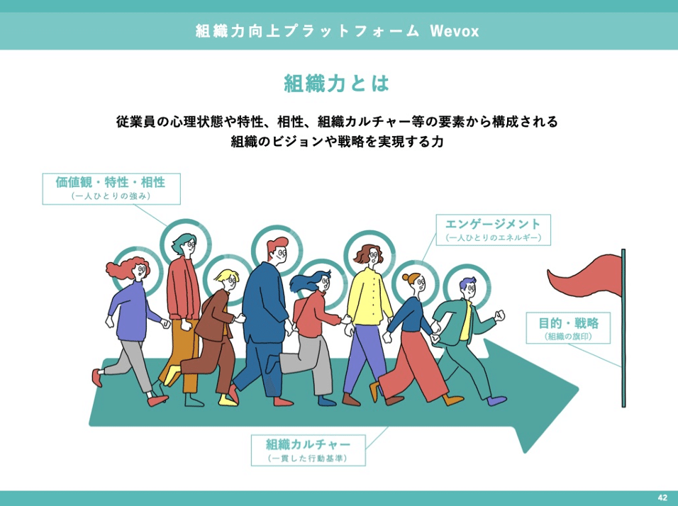
*株式会社アトラエのイメージ図スライド*

> 引用元：[> 2025年9月期 通期決算説明資料](https://ssl4.eir-parts.net/doc/6194/ir_material_for_fiscal_ym1/191192/00.pdf)

パワポの「概念図」スライドの特徴として、**おしゃれなイラストを使って抽象的な概念をわかりやすく整理している点**が挙げられます。人が歩いているイラストに対して「エンゲージメント」や「価値観・特性・相性」といったポイントを入れるだけでなく、ゴールの旗で目的や戦略を示したり、社員が同じ方向に進む矢印で組織カルチャーを示したりしています。

組織力の様な抽象的な概念を説明するにあたっては、概念図やイメージ図がぴったりです。また概念図で示したい概念が難しい場合、イラストを使うことで頭に入りやすくなるだけでなく、おしゃれなデザインにもしやすくなるので良いですね。

### サービスプラットフォームの概念図の例

続いてシェアリングテクノロジー株式会社のパワポにおける「概念図」のデザイン例を見ていきましょう。
2025年9月期　決算説明資料（事業計画及び成長可能性に関する事項）のパワーポイントにある、「『暮らしのお困りごと』を解決」のスライドです。

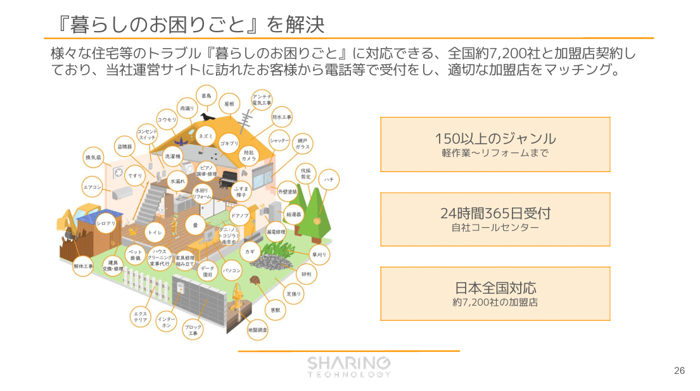
*シェアリングテクノロジー株式会社の概念図スライド*

> 引用元：[> 2025年9月期　決算説明資料（事業計画及び成長可能性に関する事項）](https://contents.xj-storage.jp/xcontents/AS03964/a9a17f08/8ee4/4099/8906/f47cc1d1a88c/140120251114503372.pdf)

*https://www.sharing-tech.co.jp/ir/news/*

パワポの「イメージ図」スライドの特徴としては、**プラットフォーム上のサービスの多さを見せることに特化している点**が挙げられます。家のイメージ図の上に、プラットフォーム上のサービスをこれでもかと載せることで、サービスが多い、役に立つプラットフォームであるというメッセージを伝えています。

イメージ図のデザインとしては、必ずしも見やすいわけではないのですが、あえてのデザインと考えた方がよいでしょう。ここでは「見づらくなるぐらいたくさんのサービスがプラットフォーム上にある」ことを示したいので、見づらいことが正解なわけです。一方でご茶ついたデザインのまま終わらせず、結局何が言いたいのかを右側に３つの箱ですっきりとまとめることで、結果的におしゃれなイメージ図のデザインに仕上げていますね。

### おしゃれなサービスの概念図のデザイン例

最後は株式会社unerryのパワポにおける「概念図」のデザイン例を見てみましょう。
2025年６月期通期 決算説明資料のパワーポイントにある、「unerryが実現している世界」のスライドです。

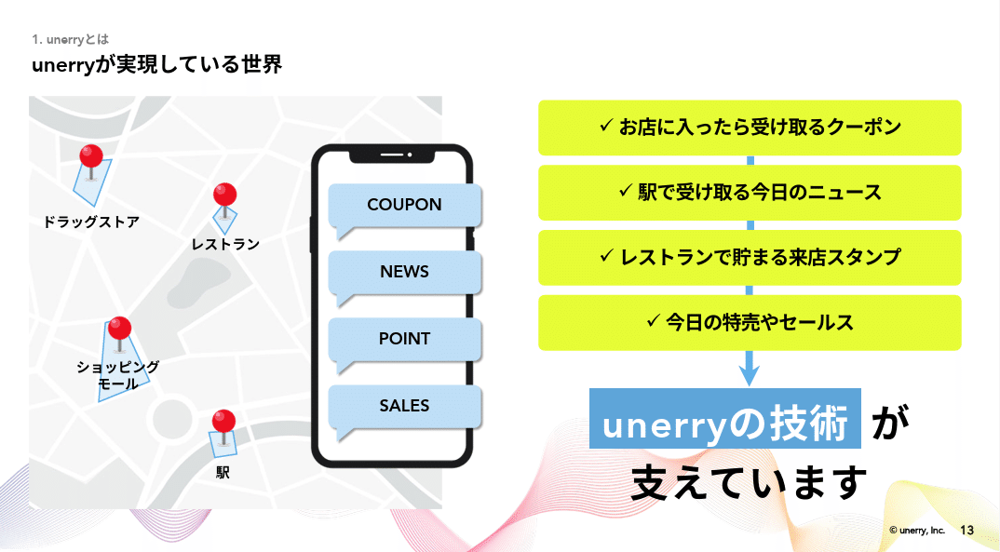
*株式会社unerryのイメージ図スライド*

> 引用元：[> 2025年６月期通期 決算説明資料](https://contents.xj-storage.jp/xcontents/AS82460/42cb224e/d3dc/493d/aced/dd7acff9c7b3/140120250812539357.pdf)

*https://www.unerry.co.jp/ir/news/*

パワポの「イメージ図」スライドの特徴としては、**消費者目線でより具体にサービス内容が伝わる様にしている点**が挙げられます。実際の行動の中で、どのようにクーポンや来店スタンプがたまるのか、地図やスマートフォンのイラストを使いながらおしゃれにまとめています。

地図やスマートフォンのイメージ図も見やすいですが、右側のテキストも黄色の蛍光色のボックスや水色のハイライトを使っており、おしゃれなデザインのイメージ図となっています。背景にうねりのデザインが入っているのもの良いですね。

## 【マネしたい】パワポのわかりやすい「概念図」「イメージ図」デザイン９選のまとめ

以上、パワポの概念図やイメージ図について、色々なデザイン例を紹介してきました。事業ポートフォリオを視覚的にわかりやすく見せたい場合、わかりづらいサービス内容をわかりやすく紹介したい場合、情報量を押さえておしゃれにコンセプトを伝えたい場合など、概念図やイメージ図が役に立つことが伝わったのではないかと思います。

## パワポ研オリジナルテンプレート

パワポ研では、「ビジネスシーンで使える」パワーポイントテンプレートを公開しております。デザインを整えるのみならず、**ロジックやストーリーを整理するのにも役立つパッケージ**になっておりますので、関心のある方は下記ページも併せてご覧ください！

上記の記事のように、noteでは**フォローしているだけでビジネスにおける「資料作成のコツ」と「デザインのセンス」が身に付くアカウント**を目指して情報配信を行っています。
今後もコンスタントに記事を配信していく予定なので、関心のある方は是非アカウントのフォローをお願いします！

**> Template販売　**[> https://powerpointjp.stores.jp/](https://powerpointjp.stores.jp/%EF%BF%BCnote)
**> note　**[> パワポ研の資料作成術](https://note.com/powerpoint_jp/m/mc291407396da)
**> X（旧Twitter)　**[> https://twitter.com/powerpoint_jp](https://twitter.com/powerpoint_jp)

## レックスアドバイザーズからのお知らせ

パワポ研は株式会社レックスアドバイザーズが運営しています。
レックスアドバイザーズは**経営企画職や経営管理職に特化した転職エージェント**です。
上場企業や上場準備企業を中心に、**経営企画、IR、経理財務、法務、内部監査等の職種の求人**をご紹介しているほか、**CFOなどのコンフィデンシャル求人**もご紹介可能です。
またコンサルティングファームや監査法人、会計事務所の求人も豊富にあるため、プロフェッショナルファームを目指す方のご支援も得意です。
求人紹介やキャリア相談を希望の方は、[**無料転職サポート**](https://www.career-adv.jp/job_search/entryform_exp/)よりサービス利用登録をしてみてください。

*レックスアドバイザーズのサービスサイトはこちら*

**> 求人をご希望の方　**[> 無料転職サポート](https://www.career-adv.jp/job_search/entryform_exp/)**
> 採用支援をご希望の方　**[> 採用サポート](https://www.career-adv.jp/request3/)
**> その他　**[> お問い合わせフォーム](https://www.rex-adv.co.jp/contact)
**> 書籍　**[> 注目企業の実例から学ぶパワポ作成術](https://www.amazon.co.jp/dp/4046060476)

