# 【まとめページ】ビジネス向けの無料イラスト素材サイト２０選【商用利用可】

[note原文](https://note.com/powerpoint_jp/n/nc996db14c7f3)

みなさんこんにちは。
資料デザインのリサーチや分析に取り組むパワーポイントのスペシャリスト、パワポ研です。

パワポ研では、日々多くのパワーポイントを分析していますが、**ビジネスで使われる決算説明資料のようなパワポにおいても、イラストの利用が増えてきている**なと感じます。

[
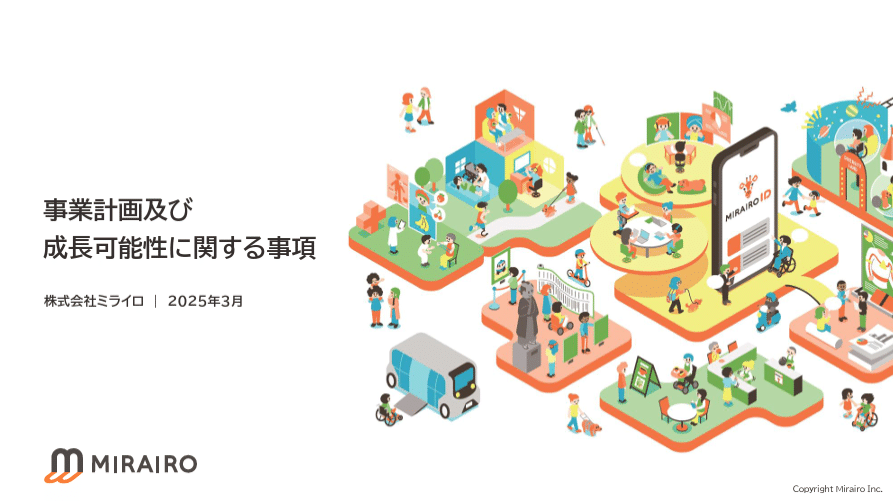
](https://note.com/powerpoint_jp/n/na7d0cb4925f3)> 引用元：[> 「事業計画及び成長可能性に関する事項](https://ssl4.eir-parts.net/doc/335A/tdnet/2583569/00.pdf)> 」

*https://www.mirairo.co.jp/ir/news*

とはいえ、資料作成にそれなりにお金をかけられる企業以外は、イラストを使いたいと思っても、フリーの素材サイトに頼らざるを得ませんよね。ですが**フリーの素材サイトは、商用利用の可否をはじめ気になる点も多い**です。そもそもサイトが多すぎて、どのサイトが自分のニーズに合うか判断するのも一苦労。

そこでパワポ研では、様々な無料イラストサイトを分析し、累計20回ほど**「ビジネスシーンに最適な無料イラスト素材」を紹介**してまいりましたが、今回はその総集編として、各サイトを一覧化しそれぞれの解説記事にアクセスしやすくしました。

各フリー素材サイトのオリジナルのURLと、パワポ研の解説noteのURLをそれぞれ貼っているので、**著作権や利用規約が気になる**方は、まずパワポ研の解説記事を読むことをオススメします。

## 1. ICOOON MONO：素材が豊富な日本のイラストサイト

- 日本語での検索が可能

- 6,000以上のフリーアイコン素材を無料で利用可能

- 素材のサイズやカラーやファイル形式を指定可能

- 無料で商用利用が可能

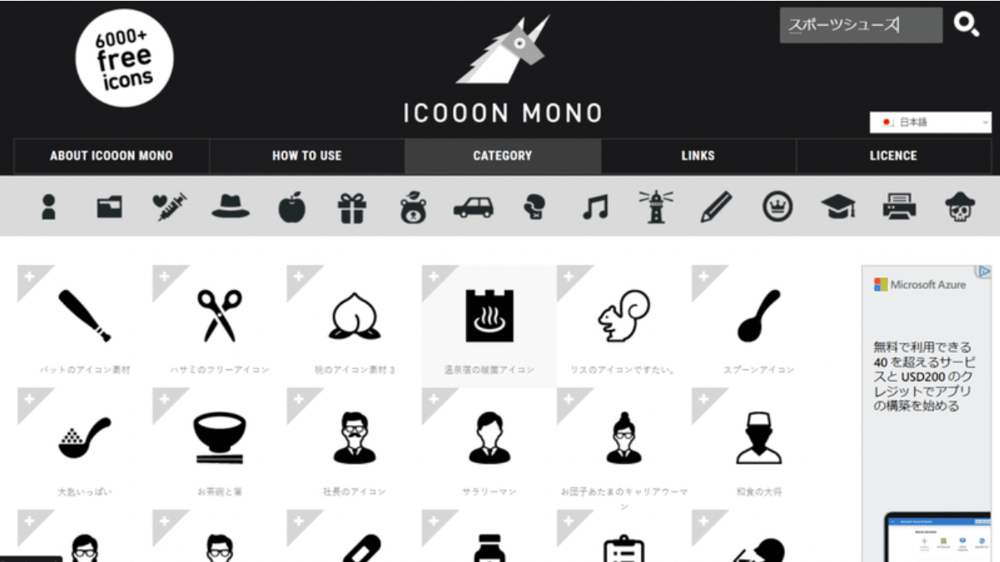
> サービスURL：[> https://icooon-mono.com/](https://icooon-mono.com/)
> 解説記事：[> https://note.com/powerpoint_jp/n/nff16f5b314e2](https://note.com/powerpoint_jp/n/nff16f5b314e2)

## 2. storyset：人物に特化した海外のイラストサイト

- 人物のイラストに特化

- UIが直感的で使いやすい

- イラスト毎にアニメーション編集が可能

- Figmaへのプラグインが可能

- 日本語での検索は不可

- 無料で商用利用可能だが、利用する際は帰属表示が必要

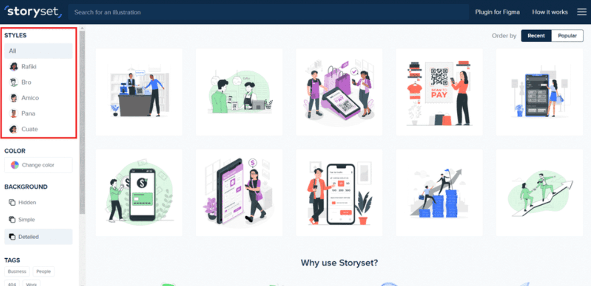
> サービスURL：[> https://storyset.com/](https://storyset.com/)
> 解説記事：[> https://note.com/powerpoint_jp/n/nf3feeb78fdbe](https://note.com/powerpoint_jp/n/nf3feeb78fdbe)

## 3. unDraw：クリップアートに強い海外のイラストサイト

- イラストの色やファイル形式を自由に指定可能

- ハンドクラフトのイラストもフリー利用可能

- 無料で商用利用が可能

- 検索性はそれほど良くない

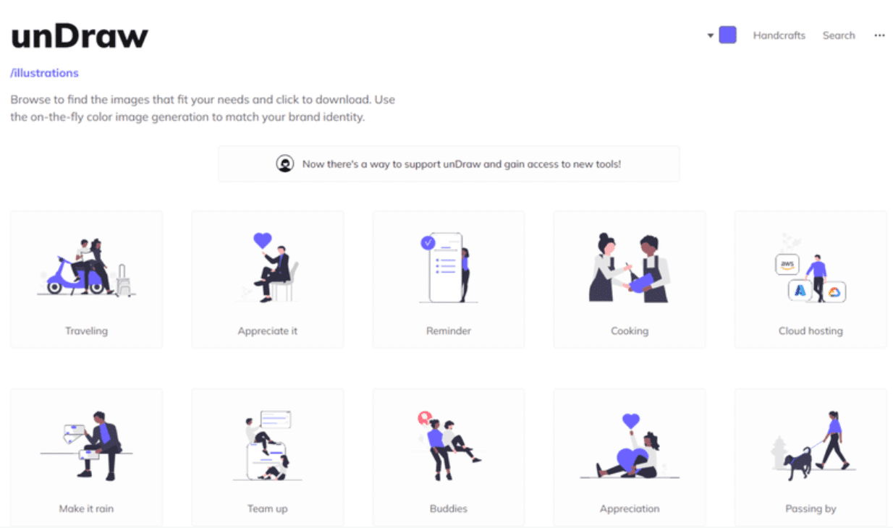
> サービスURL：[> https://undraw.co/](https://undraw.co/)
> 解説記事：[> https://note.com/powerpoint_jp/n/n6c1c85d723bc](https://note.com/powerpoint_jp/n/n6c1c85d723bc)

## 4. Icons8：テーマやコンセプトでの検索が嬉しいアイコンサイト

- 素材のテーマやコンセプトによる検索が可能

- 素材の色調整などの加工が容易

- ファイル形式によっては無料でなく有料

- ダウンロードにはフリー会員登録が必要

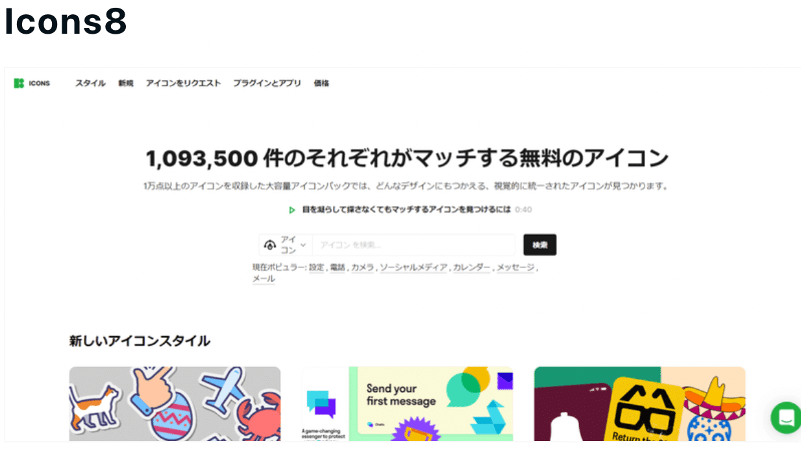
> サービスURL：[> https://icons8.jp/icons](https://icons8.jp/icons)
> 解説記事：[> https://note.com/powerpoint_jp/n/n4564e0f9d2db](https://note.com/powerpoint_jp/n/n4564e0f9d2db)

## 5. slidesgo：パワーポイントのテンプレートに特化した素材サイト

- パワーポイントの無料テンプレートに特化

- カテゴリーでテーマに沿った絞り込みが可能

- 豊富なタグで直感的な絞り込みが可能

- 10セット/月までは、フリーダウンロードが可能

- 日本語のテーマ検索は不可

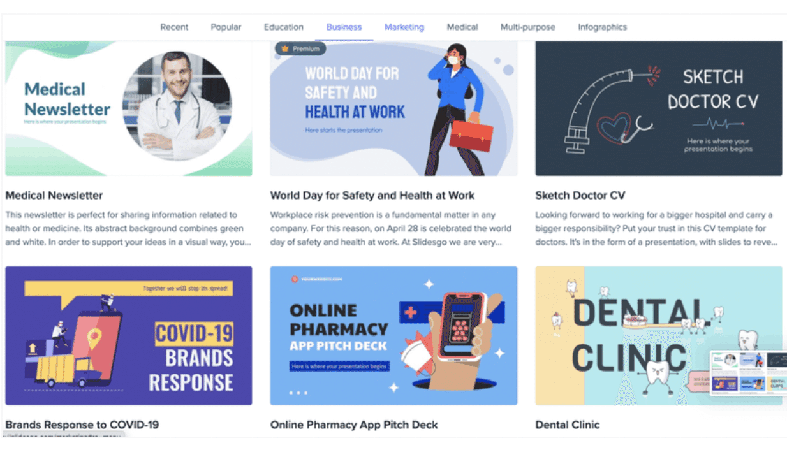
> サービスURL：[> https://slidesgo.com/](https://slidesgo.com/)
> 解説記事：[> https://note.com/powerpoint_jp/n/n01ab937eb5c1](https://note.com/powerpoint_jp/n/n01ab937eb5c1)

## 6. blush：ポップなクリップアートに強いイラストサイト

- ポップな無料イラストに特化

- フリーダウンロードの形式はPNGかSVG

- 無料で商用利用が可能

- 有料プランでイラストの解像度や保存枚数やデータ量が増加

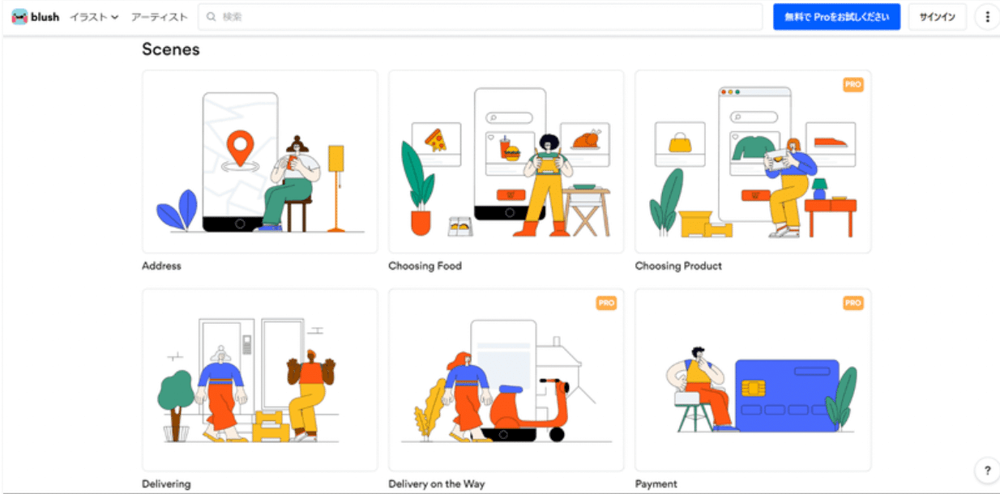
> サービスURL：[> https://blush.design/ja](https://blush.design/ja)
> 解説記事：[> https://note.com/powerpoint_jp/n/n0c453f0ce155](https://note.com/powerpoint_jp/n/n0c453f0ce155)

## 7. vector Shelf：プレゼンに温かみを与える日本の手書きイラストサイト

- 手書きのフリー素材に特化

- カテゴリーごとにイラストを整理

- フリーダウンロード形式はPNGかAIかSVG

- 無料で商用利用が可能

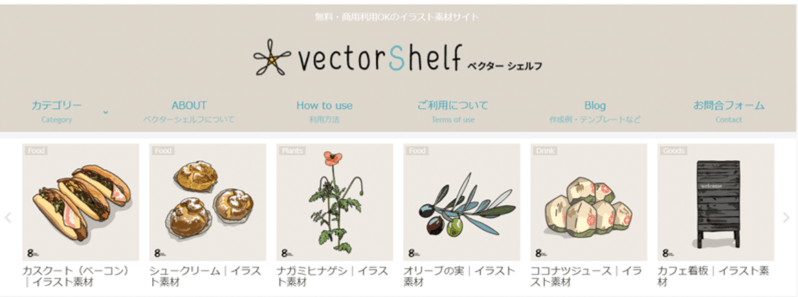
> サービスURL：[> https://vectorshelf.com/](https://vectorshelf.com/)
> 解説記事：[> https://note.com/powerpoint_jp/n/n36ada234697d](https://note.com/powerpoint_jp/n/n36ada234697d)

## 8. ソコスト：ビジネスと季節行事に特化した日本の素材サイト

- カジュアルなイラストが中心

- イラストのカテゴリーは「ビジネス」と「季節・行事」が中心

- フリーダウンロード形式はPNGかSVGかEPS

- 無料で商用利用が可能

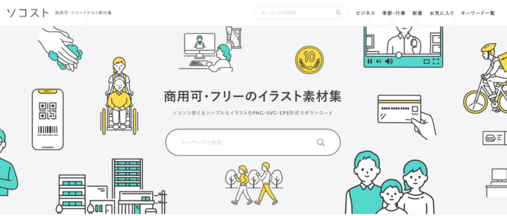
> サービスURL：[> https://soco-st.com/](https://soco-st.com/)
> 解説記事：[> https://note.com/powerpoint_jp/n/n557d13c98d17](https://note.com/powerpoint_jp/n/n557d13c98d17)

## 9. Tech Pic：近未来的なイラストが特徴の日本の素材サイト

- イラストはオフィスが中心だが近未来的な素材を含む

- イラストの数は多くない

- フリーダウンロードの形式はPNGとSVG

- 無料で商用利用が可能

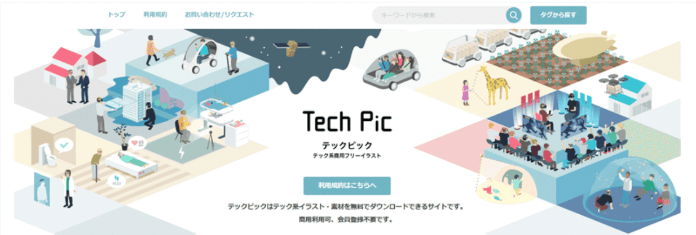
> サービスURL：[> http://tech-pic.com/](http://tech-pic.com/)
> 解説記事：[> https://note.com/powerpoint_jp/n/n5a89bfbe5780](https://note.com/powerpoint_jp/n/n5a89bfbe5780)

## 10. Linustock：使いやすさにこだわった線画イラストサイト

- 線画に特化したイラストサイト

- イラストのカテゴリーが充実

- フリーダウンロード形式はPNGとEPS

- 無料で商用利用が可能。利用可能シーンは利用規約にて列挙

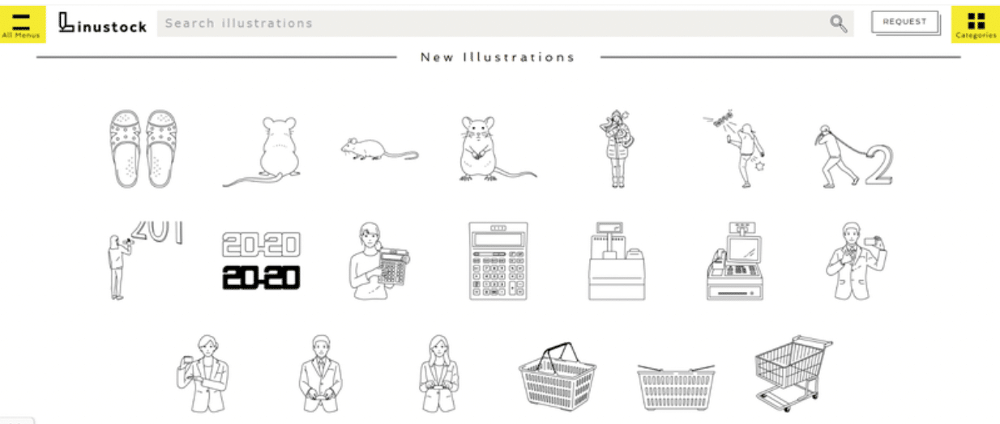
> サービスURL：[> https://www.linustock.com/](https://www.linustock.com/)
> 解説記事：[> https://note.com/powerpoint_jp/n/n250b8de54ae7](https://note.com/powerpoint_jp/n/n250b8de54ae7)

## 11. ビジネス素材：日本のビジネスシーンに特化したイラストサイト

- 日本のビジネスシーンに特化したイラスト

- 素材のカテゴリーは4つ

- フリーダウンロード形式はPNGとAI

- 無料で商用利用が可能

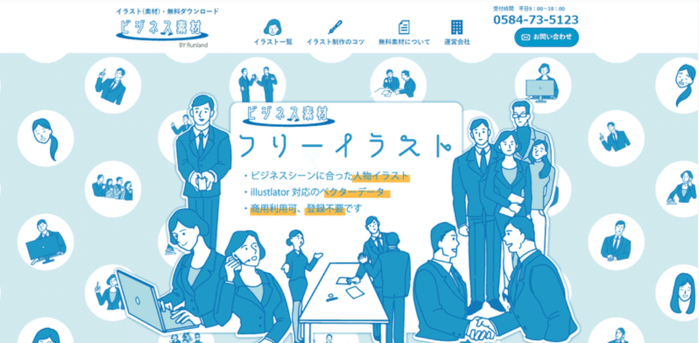
> サービスURL：[> https://web-sozai.com/](https://web-sozai.com/)
> 解説記事：[> https://note.com/powerpoint_jp/n/n992c1f703916](https://note.com/powerpoint_jp/n/n992c1f703916)

## 12. ちょうどいいイラスト：かゆい所に手が届くイラストサイト

- かゆい所に手が届くイラスト

- 素材のカテゴリーは8種類でおよそ700のイラストが掲載

- フリーダウンロードの形式はPNGとEPS

- 無料で商用利用が可能

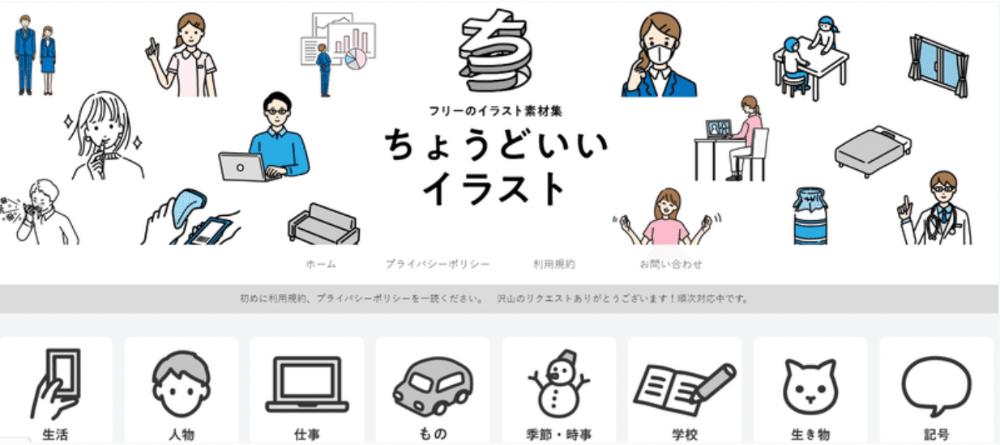
> サービスURL：[> https://tyoudoii-illust.com/](https://tyoudoii-illust.com/)
> 解説記事：[> https://note.com/powerpoint_jp/n/nbb5c07d78009](https://note.com/powerpoint_jp/n/nbb5c07d78009)

## 13. FLAT ICON DESIGN：フラットデザインに最適な素材サイト

- フラットデザインに最適なイラスト

- 素材のカテゴリーが豊富

- フリーダウンロードの形式は5つ

- 無料で商用利用が可能

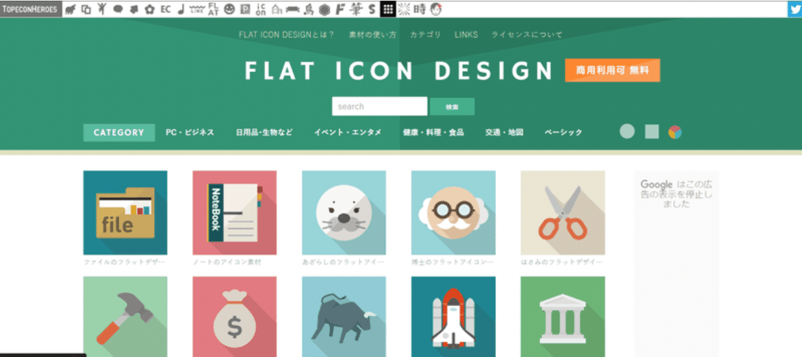
> サービスURL：[> http://flat-icon-design.com/](http://flat-icon-design.com/)
> 解説記事：[> https://note.com/powerpoint_jp/n/na9922b85ca1b](https://note.com/powerpoint_jp/n/na9922b85ca1b)

## 14. ManyPixels：デザインチームへの依頼も可能なイラストサイト

- 素材の検索性が高い

- フリーダウンロードの形式はSVGとPNG

- 無料で商用利用が可能

- 有料課金でデザインチームに依頼可能

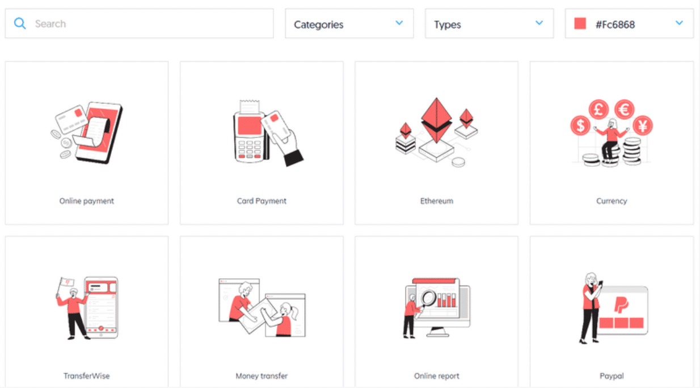
> サービスURL：[> https://www.manypixels.co/gallery](https://www.manypixels.co/gallery)
> 解説記事：[> https://note.com/powerpoint_jp/n/n6bd4e14339a0](https://note.com/powerpoint_jp/n/n6bd4e14339a0)

## 15. シルエットデザイン：影絵に特化したイラストサイト

- 影絵のイラストが中心のラインナップ

- 素材アイコンのカテゴリーが明確で検索性が高い

- フリーダウンロードの形式は4種類

- 無料で商用利用できるが利用規約が比較的厳しめ

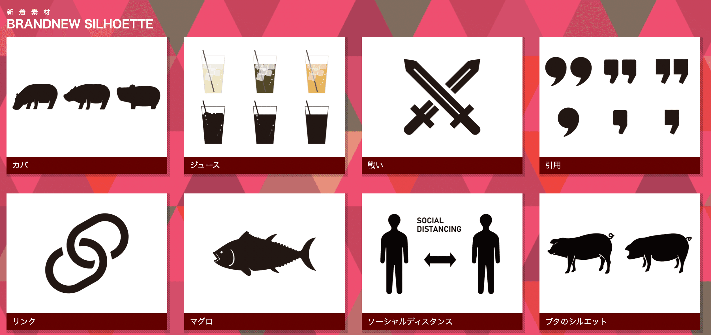
> サービスURL：[> https://kage-design.com/](https://kage-design.com/)
> 解説記事：[> https://note.com/powerpoint_jp/n/n049723302cee](https://note.com/powerpoint_jp/n/n049723302cee)

## 16. shigureni free illust：かわいさが特徴のクリップアートサイト

- 日常のワンシーンを的確に切り取ったイラスト

- フリーダウンロードの形式はPNGのみ

- 無料で商用利用が可能

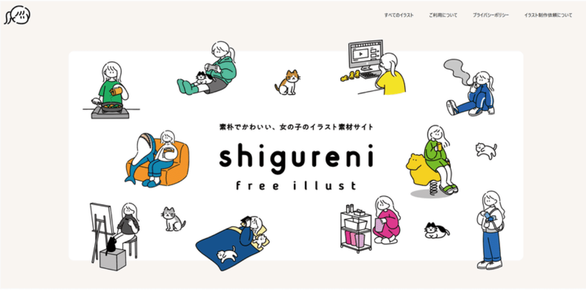
> サービスURL：[> https://www.shigureni.com/](https://www.shigureni.com/)
> 解説記事：[> https://note.com/powerpoint_jp/n/nd04bfe46a1a9](https://note.com/powerpoint_jp/n/nd04bfe46a1a9)

## 17. icon-rainbow：カスタム性の高いアイコンサイト

- 素材のカラーは11色から選択可能

- 素材のサイズについても7種類から選択が可能

- フリーダウンロードの形式は5種類

- 一括のダウンロードも可能

- 無料で商用利用が可能

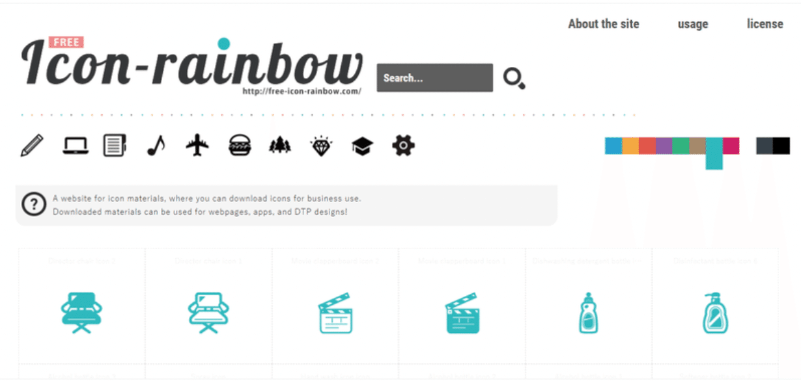
> サービスURL：[> https://free-icon-rainbow.com/](https://free-icon-rainbow.com/)
> 解説記事：[> https://note.com/powerpoint_jp/n/nfd1a18ab28ac](https://note.com/powerpoint_jp/n/nfd1a18ab28ac)

## 18. SASHIE：コミカルさが特徴の素材サイト

- イラストの自由度がとにかく高い

- 風刺的な「ビジネス」タグのイラストが特徴的

- フリーイラストの解説が面白い

- 無料で商用利用が可能

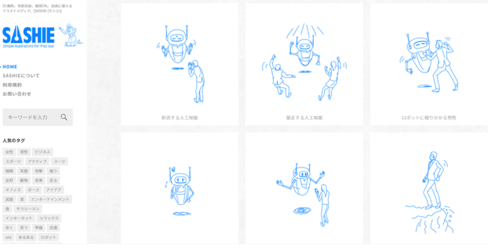
> サービスURL：[> https://sashie.org/](https://sashie.org/)
> 解説記事：[> https://note.com/powerpoint_jp/n/n5a0db335961f](https://note.com/powerpoint_jp/n/n5a0db335961f)

## 19. ハンコでアソブ：ハンコスタイルの素材サイト

- ハンコ（スタンプ）素材サイト

- 27種類の素材カテゴリーから選択

- ダウンロード方法は「名前を付けて保存」

- 無料で商用利用が可能

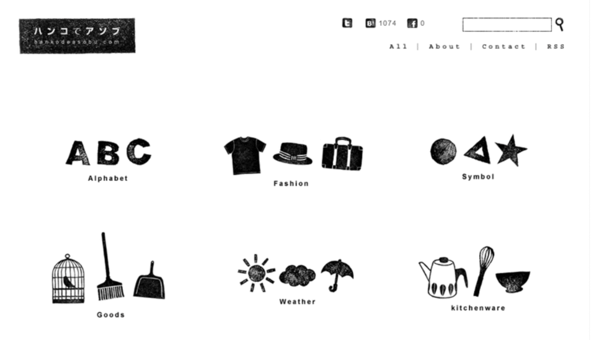
> サービスURL：[> http://hankodeasobu.com/](http://hankodeasobu.com/)
> 解説記事：[> https://note.com/powerpoint_jp/n/n83c794d1dca2](https://note.com/powerpoint_jp/n/n83c794d1dca2)

## 20. EC Design：ECサイト向け素材サイト

- ECサイトやネットショップ運営に最適な素材

- フリーダウンロードの形式はJPGとPNGとAIとEPS

- 無料で商用利用が可能

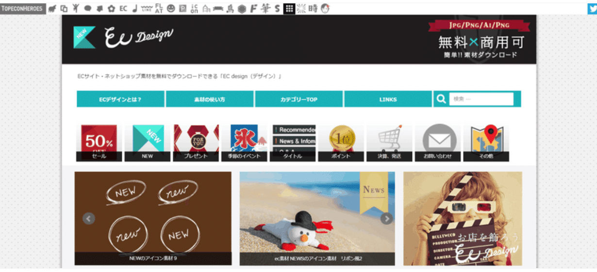
> サービスURL：[> http://design-ec.com/](http://design-ec.com/)
> 解説記事：[> https://note.com/powerpoint_jp/n/n6857b1045581](https://note.com/powerpoint_jp/n/n6857b1045581)

## ビジネスシーンに最適な無料イラスト素材サイト２０選まとめ

いかがでしたでしょうか。これまで紹介してきた無料素材イラストサイトを一覧で紹介させていただきました。今後も有用そうなものがあれば、随時こちらに追加していくので、必要あればブックマーク等で本ページの登録をお願いいたします。

## パワポ研オリジナルテンプレート

パワポ研では「ビジネスシーンで使える」パワーポイントテンプレートを公開しております。デザインを整えるのみならず、**ロジックやストーリーを整理するのにも役立つパッケージ**になっておりますので、関心のある方は下記ページも併せてご覧ください！

上記の記事のように、noteでは**フォローしているだけでビジネスにおける「資料作成のコツ」と「デザインのセンス」が身に付くアカウント**を目指して情報配信を行っています。
今後もコンスタントに記事を配信していく予定なので、関心のある方は是非アカウントのフォローをお願いします！

**> Template販売　**[> https://powerpointjp.stores.jp/](https://powerpointjp.stores.jp/%EF%BF%BCnote)
**> note　**[> パワポ研の資料作成術](https://note.com/powerpoint_jp/m/mc291407396da)
**> X（旧Twitter)　**[> https://twitter.com/powerpoint_jp](https://twitter.com/powerpoint_jp)

## レックスアドバイザーズからのお知らせ

パワポ研は株式会社レックスアドバイザーズが運営しています。
レックスアドバイザーズは**経営企画職や経営管理職に特化した転職エージェント**です。
上場企業や上場準備企業を中心に、**経営企画、IR、経理財務、法務、内部監査等の職種の求人**をご紹介しているほか、**CFOなどのコンフィデンシャル求人**もご紹介可能です。
またコンサルティングファームや監査法人、会計事務所の求人も豊富にあるため、プロフェッショナルファームを目指す方のご支援も得意です。
求人紹介やキャリア相談を希望の方は、[**無料転職サポート**](https://www.career-adv.jp/job_search/entryform_exp/?utm_source=note&utm_medium=referral&utm_campaign=note_pp)よりサービス利用登録をしてみてください。

*レックスアドバイザーズのサービスサイトはこちら*

**> 求人をご希望の方　**[> 無料転職サポート](https://www.career-adv.jp/job_search/entryform_exp/)**
> 採用支援をご希望の方　**[> 採用サポート](https://www.career-adv.jp/request3/)
**> その他　**[> お問い合わせフォーム](https://www.rex-adv.co.jp/contact)
**> 書籍　**[> 注目企業の実例から学ぶパワポ作成術](https://www.amazon.co.jp/dp/4046060476)

