# 【徹底解説】パワポのディバイダーのデザインとスライド例２０選

[note原文](https://note.com/powerpoint_jp/n/ncbf53b3635fb)

みなさんこんにちは。
資料デザインのリサーチや分析に取り組むパワーポイントのスペシャリスト、パワポ研です。

今回のテーマはパワーポイントのディバイダーです！パワポのディバイダーとは、**セクションの始まりに入るスライドで、セクションの見出しや目次**が書かれています。パワポにおけるセクションの区切りを示す役割を持っているので、ディバイダーがあることで資料全体がわかりやすくなります。

そこで今回は普段あまり着目されない**パワポの「ディバイダー」に焦点を当て、様々なディバイダーのデザインや、ディバイダーの作り方について**解説していきますよ。

前半は【マネしたい】シリーズのように上場企業のIR資料スライドのデザイン紹介をし、後半で効率的なディバイダーの作り方を解説していきますね。

なお【マネしたい】シリーズのまとめ記事はこちらです。

では早速行きましょう！

## パワポのディバイダーのデザイン

おしゃれなパワポのディバイダーのデザインを見ていく前に、パワーポイントのディバイダーにおけるデザインのパターンを確認しておきましょう。
基本ディバイダーのデザインは、以下の3つの組み合わせで決まります。

- **パワポの文字部分が、セクション見出しのみか、セクション見出しと目次か、セクション見出しと階層か**

- **セクション見出しの背景は白か、カラーか**

- **セクション見出しに合わせて、写真やイラストを入れているか**

まずはそれぞれのパターンに合わせてパワポの例を見ていきましょう。
ただし白地にセクション見出しのみのディバイダーは見てもあまり面白くないので割愛します。

## セクション見出しと目次のパワポ例

まずはセクションの見出しと目次からなるパワポのディバイダーを見ていきましょう。パワポの流れを示すのに最適なので、決算説明資料などでもよく使われるディバイダーです。

### セクション見出しを太字にするパワポ例

セクション見出しと目次のデザインの王道パターンが、目次を示しつつ、当該セクションの見出しを太字にするデザインです。**セクション見出しと目次だけでなく、セクション番号やロゴを合わせるデザイン**もあります。

またセクション見出しを太字にしたうえで、文字の背景をコーポレートカラーでハイライトするデザインもあります。コンサルティングファームなども好むパワポデザインですね。

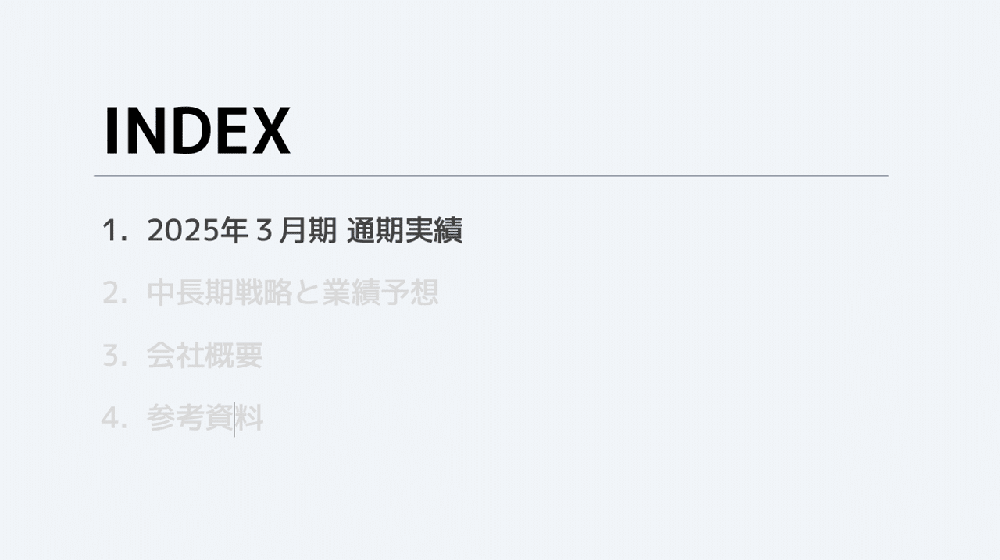
*株式会社i-plugのパワーポイント例*

> 引用元：[> 2025年３月期 通期決算説明資料（事業計画及び成長可能性に関する事項）](https://ssl4.eir-parts.net/doc/4177/tdnet/2617426/00.pdf)

*https://i-plug.co.jp/ir/library/*

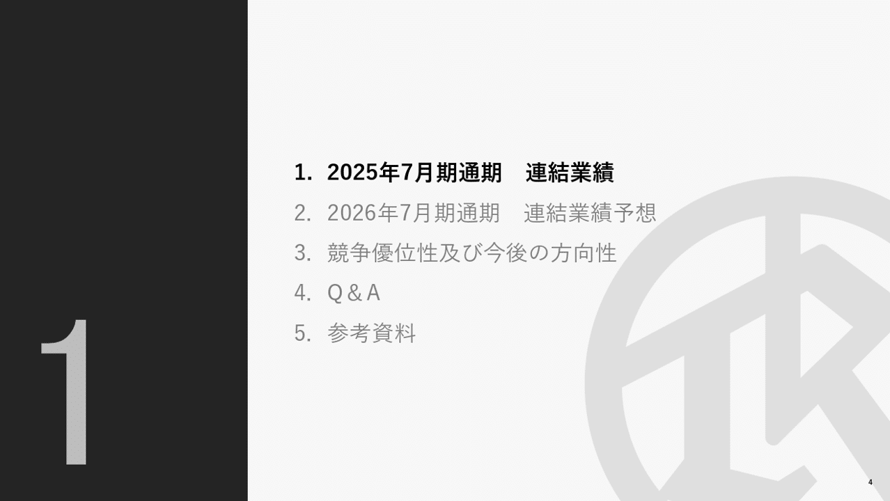
*ラクスル株式会社のパワーポイント例*

> 引用元：[> 2025年7月期決算説明会資料](https://ssl4.eir-parts.net/doc/4384/ir_material_for_fiscal_ym/187138/00.pdf)

*https://corp.raksul.com/ir/library/*

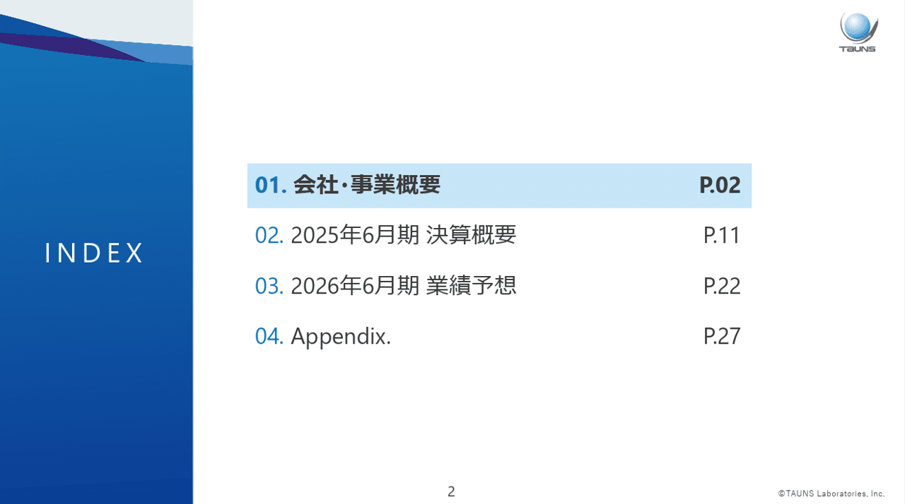
*株式会社タウンズのパワーポイント例*

> 引用元：[> 2025年6月期 決算説明資料](https://ssl4.eir-parts.net/doc/197A/ir_material_for_fiscal_ym/185160/00.pdf)

*https://www.tauns.co.jp/investors/news/*

### セクション見出しをカラーにするパワポ例

目次の当該部分を太字にするデザインと同様によくあるのが、コーポレートカラーでパワポをハイライトするデザインです。**パワポをハイライトすることに加えて、目次部分とは別にセクション見出しをデザイン**しているケースもあります。

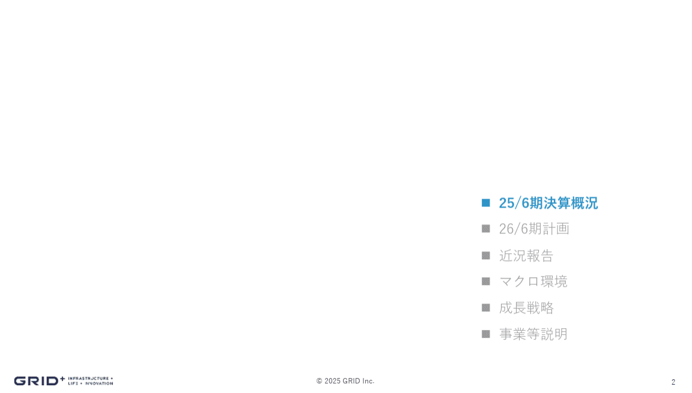
*株式会社グリッドのパワーポイント例*

> 引用元：[> 2025年６月期 決算説明資料](https://contents.xj-storage.jp/xcontents/AS82605/288c0a33/fb7b/4571/96cd/daef4ca70f50/140120250812538840.pdf)

*https://gridpredict.jp/ir/presentations*

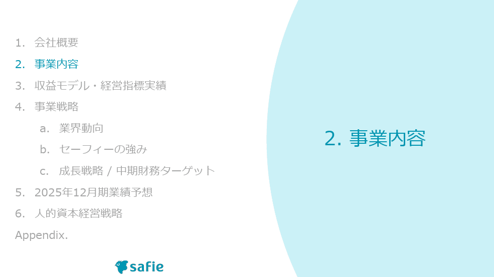
*セーフィー株式会社のパワーポイント例*

> 引用元：[> 成長可能性資料](https://ssl4.eir-parts.net/doc/4375/tdnet/2584982/00.pdf)

*https://safie.co.jp/ir/library/*

## 背景にブランドカラーを入れるパワポ例

次は同様にセクション見出しと目次の組み合わせのデザインの中で、背景にブランドカラーを入れているディバイダーを見ていきましょう。

ディバイダーは、パワーポイントのセクションを区切る役割を持つので、メッセージスライドで使われている背景色とは違う色を使うことが重要です。メッセージスライドでは、白やグレーの背景が多いため、**ディバイダーにおいては、必然と派手な色あるいは、濃い色が選択される**ことになります。

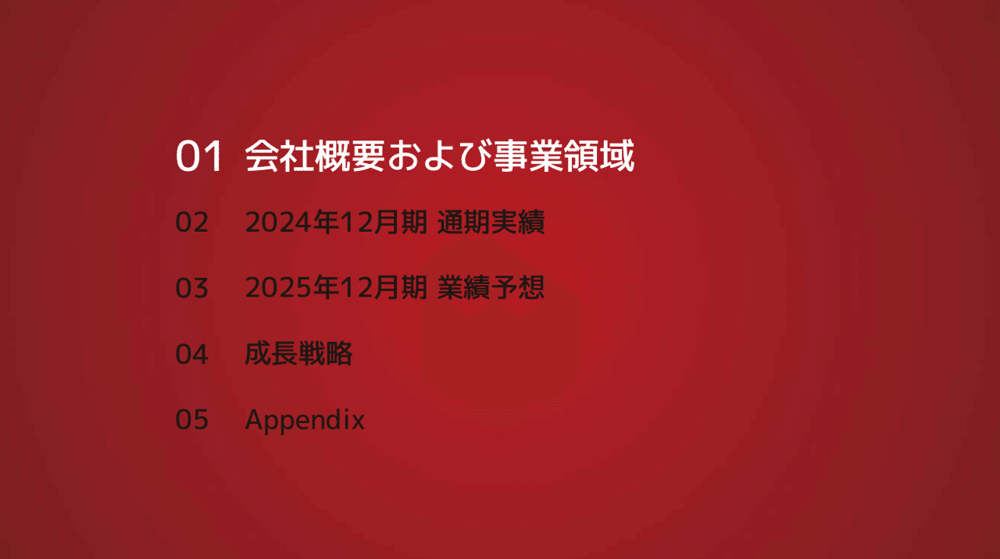
*株式会社 L is B のパワーポイント例*

> 引用元：[> 2024年 12月期 通期 決算説明資料](https://contents.xj-storage.jp/xcontents/AS05193/eb43db33/5d69/419f/a9af/3e1d5d3423b5/140120250214575783.pdf)

*https://l-is-b.com/ja/ir/presentations/*

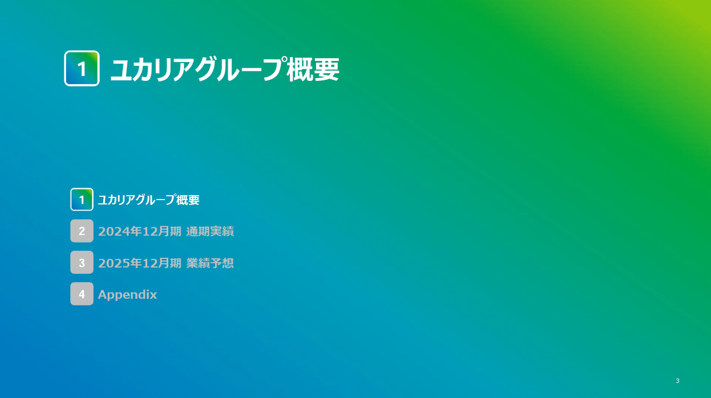
*株式会社ユカリアのパワーポイント例*

> 引用元：[> 2024年12月期 通期決算説明資料](https://contents.xj-storage.jp/xcontents/AS96593/db79aabf/80ad/494d/8a69/57f6fa3e8ead/140120250226583009.pdf)

*https://eucalia.jp/ir/presentations/*

*株式会社セキュアのパワーポイント例*

> 引用元：[> 2024年12月期決算説明資料](https://contents.xj-storage.jp/xcontents/AS02669/8c71028c/dd72/470c/8f85/5461d1f34732/140120250214576643.pdf)

*https://secureinc.co.jp/ir/presentations/*

## 写真やイラストを使ったパワポ例

次は写真やイラストを組み合わせたパワポのディバイダーを見ていきましょう。セクション見出しと写真やイラストのデザインも、セクション見出しと目次に写真やイラストを合わせたデザインもあります。

使うイラストや写真は、製品のイラストやオフィスの写真など、なんでも

### セクション見出し単体のパワポ例

目次を使わないセクション見出し単体のディバイダーの場合、文字だけだとどうしても物足りないパワポになってしまいます。そこで**イラストや写真を合わせることで、派手な印象を与えるディバイダーにし、パワポのセクションを区切る役割**を果たしやすくしています。

デザインとして**矢羽や円といったインパクトのある図形を組み合わせてディバイダーとしての特徴をだすことも一つのテクニックです。**派手めなディバイダーを経ることで、次の内容を読みたくなるようなリズミカルな印象を与えることができますね。

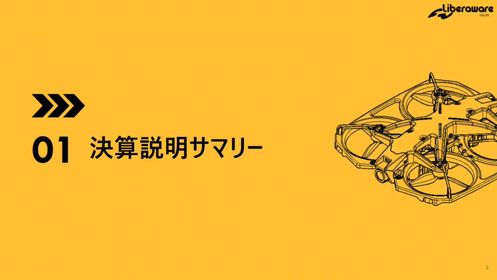
*株式会社Liberawareのパワーポイント例*

> 引用元：[> 2025年7月期 通期決算説明資料](https://ssl4.eir-parts.net/doc/218A/tdnet/2687217/00.pdf)

*https://liberaware.co.jp/ir/library/presentation/*

*グリーンモンスター株式会社のパワーポイント例*

> 引用元：[> 2025年6月期 通期決算説明資料（事業計画及び成長可能性に関する事項）](https://contents.xj-storage.jp/xcontents/AS04869/8f57059a/8b77/4d01/a3a0/7f208f8a43a6/140120250814542608.pdf)

*https://greenmonster.co.jp/ir/library/*

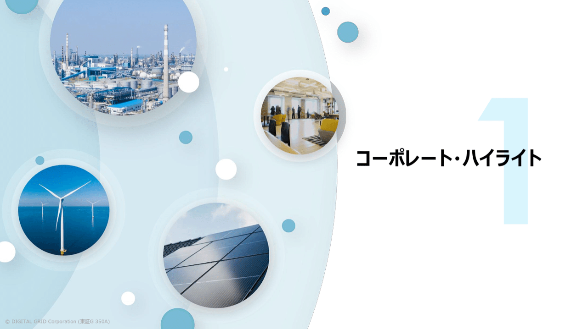
*デジタルグリッド株式会社のパワーポイント例*

> 引用元：[> 2025年7月期 通期 決算説明資料（事業計画及び成長可能性に関する事項）](https://ssl4.eir-parts.net/doc/350A/tdnet/2686579/00.pdf)

*https://www.digitalgrid.com/ir/library/presentation/*

### セクション見出しと目次のパワポ例

セクション見出し単独のディバイダーだけでなく、セクション見出しと目次の組み合わせのパワポでも、写真やイラストは効果を発揮します。

大きく、セクション見出し以外の余白部分に写真やイラストを入れるパワポと、背景全体に写真やイラストを入れるパワポがあります。**またパワポのディバイダーごとに、写真を変更するといったテクニック**もあります。

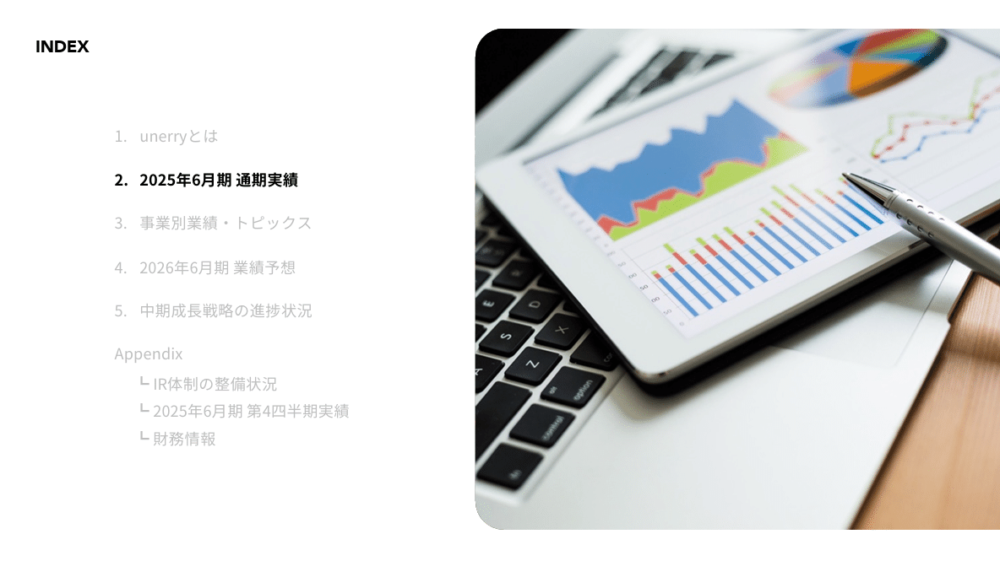
*株式会社 Unerry のパワーポイント例*

> 引用元：[> 2025年6月期通期 決算説明資料](https://contents.xj-storage.jp/xcontents/AS82460/42cb224e/d3dc/493d/aced/dd7acff9c7b3/140120250812539357.pdf)

*https://www.unerry.co.jp/ir/presentations/*

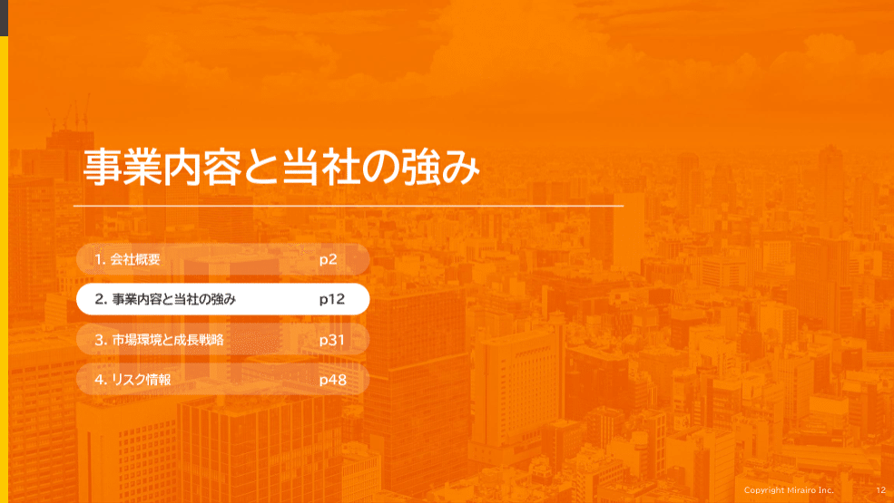
*株式会社ミライロのパワーポイント例*

> 引用元：[> 事業計画及び成長可能性に関する事項](https://ssl4.eir-parts.net/doc/335A/tdnet/2583569/00.pdf)

*https://www.mirairo.co.jp/ir/news*

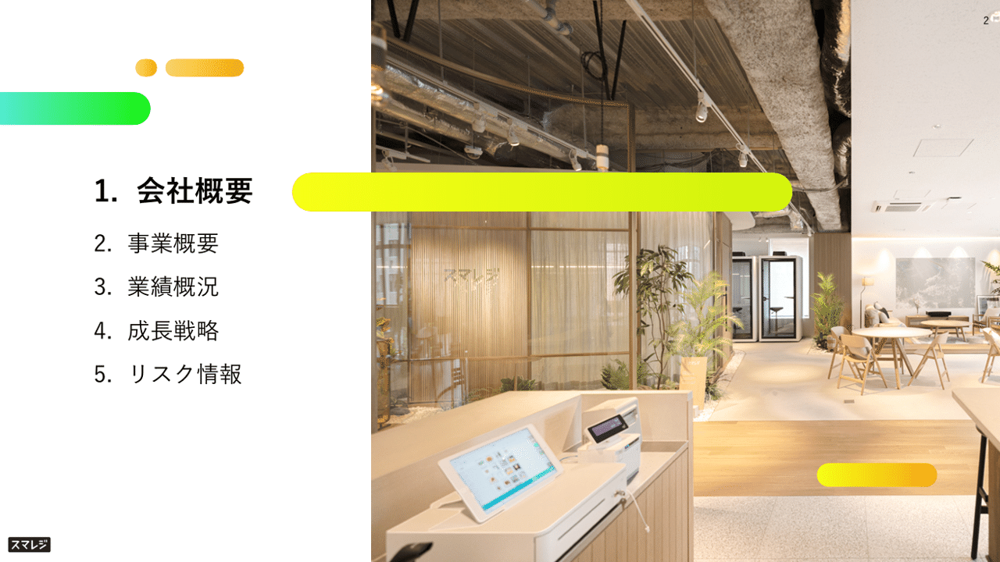

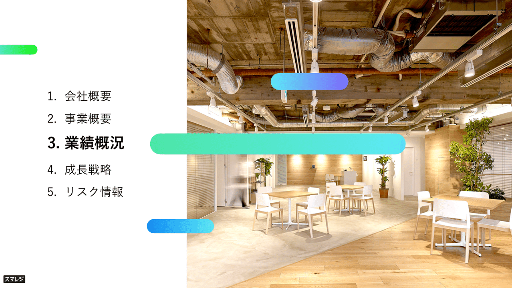
*株式会社スマレジのパワーポイント例*

> 引用元：[> 事業計画及び成長可能性に関する事項](https://corp.smaregi.jp/ir/library/FY2025_Business_Plan_and_Growth_Potential.pdf)

*https://corp.smaregi.jp/ir/management/growth-potential.php*

## セクション見出しと下の階層のパワポ例

続いて、セクション見出しに加えて一つ下の階層の見出しがあるパワポのディバイダーを見ていきましょう。パワポのディバイダーはセクションの区切りなので、**各セクションの下の階層にある内容まで示すことで、パワーポイント全体の流れがわかりやすくなる**わけですね。

*株式会社ファンコミュニケーションズのパワーポイント例*

> 引用元：[> 2024年12月期第4四半期 決算説明資料](https://files.microcms-assets.io/assets/d45caef7ee5f48168c423fe98204dea1/94b3972c7d2b4ab0bf38180d71e270b8/202412_0212.pdf)

*https://www.fancs.com/ir/library/presentation/*

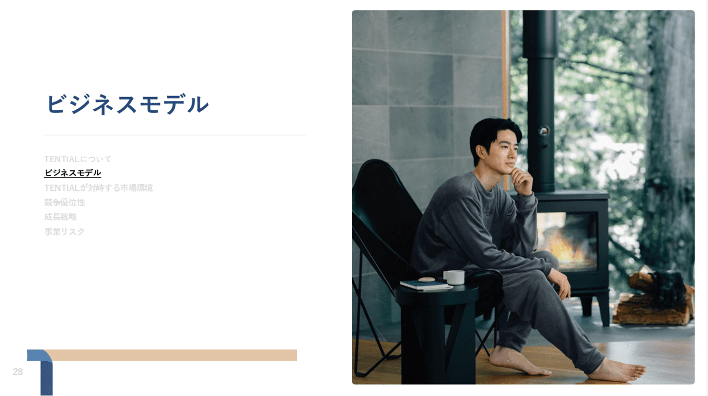
*株式会社 TENTIAL のパワーポイント例*

> 引用元：[> 2025年8月期 通期決算説明資料（事業計画及び成長可能性に関する資料）](https://ssl4.eir-parts.net/doc/325A/tdnet/2698232/00.pdf)

*https://corp.tential.jp/ir/library/presentations/*

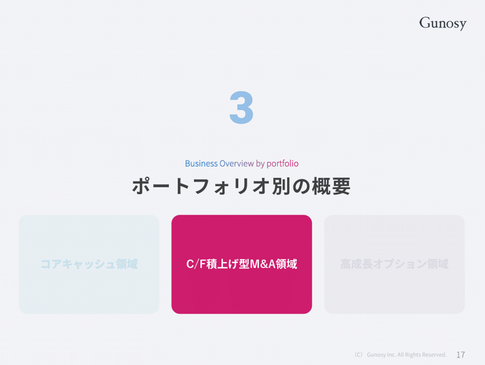
*株式会社 Gunosy のパワーポイント例*

> 引用元：[> 2025年5月期　決算説明資料](https://ssl4.eir-parts.net/doc/6047/tdnet/2655071/00.pdf)

*https://www.unerry.co.jp/ir/presentations/*

## パワポのディバイダー作成時のポイント

ここからは、パワポのディバイダーを作る際に気を付けるべきことについて説明していきます。
ディバイダーを作るうえで大切なのは、ディバイダー間のデザインを統一することです。写真やイラストが変わるのは問題ないですが、**セクション見出しの位置やフォント、フォントサイズなどはパワポ内で統一**しておく必要があります。ここからは、セクション見出し単体のパワポ、セクション見出しと目次のパワポ、セクション見出しと下の階層のパワポの３つのケースに分けて作成時に注意したいポイントを説明します。

### セクション見出し単体のデザイン

セクション見出しと写真やイラストの組み合わせで作るパワポのディバイダーから説明します。
この場合はパワポのセクション見出しの位置を固定することが大切になりますが、**セクション見出しが２行になるディバイダーがあるか確認**しておきましょう。

２行になるディバイダーがある場合、１行のスライドと２行のスライドで、テキスト位置の上部をそろえた方がよいです。なのでテキストボックスは「自動でサイズを調整」にはせず、手動で調整できるようにしておきましょう。

*グリーンモンスター株式会社のパワーポイント例*

*グリーンモンスター株式会社のパワーポイント例*

### セクション見出し＋目次のデザイン

続いてセクション見出しと目次の組み合わせで作るパワポのディバイダーから説明します。この場合もスライド間でのデザインの一貫性は重要ですが、それに加えて**セクション見出しが目次より目立つようにパワポをデザイン**する必要があります。

方法としては、大きく以下の３つの組み合わせになります。

- 目次以外にもセクション見出しを表示する

- 目次の中でセクション見出し以外の色を薄くする

- 目次の中でセクション見出しのサイズを大きくする

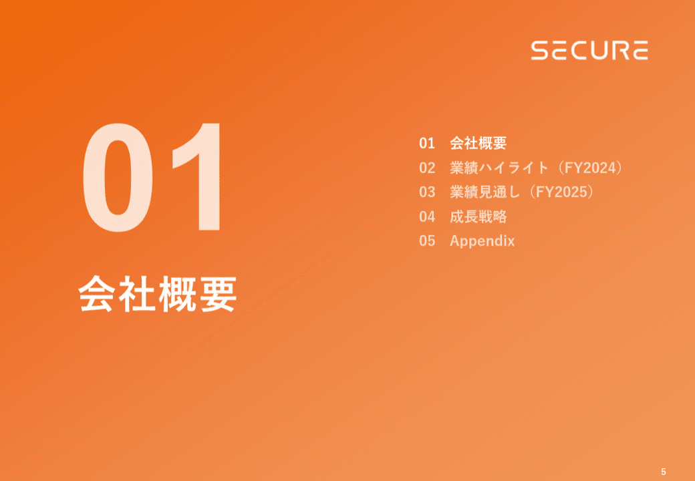
*目次以外にもセクション見出しを表示する*

*目次の中でセクション見出し以外の色を薄くする*

*目次の中でセクション見出しのサイズを大きくする*

### セクション見出しと下の階層のデザイン

最後に、セクション見出しと下の階層の組み合わせで作るパワポのディバイダーについて説明します。
こちらについては、セクション見出し単体のパワポと同じく、位置取りをより注意する必要があります。なぜかというと、**下の階層の多さがセクションによって大きく異なる**ので、それらを踏まえて最適な位置にセクション見出しを置く必要があるからです。

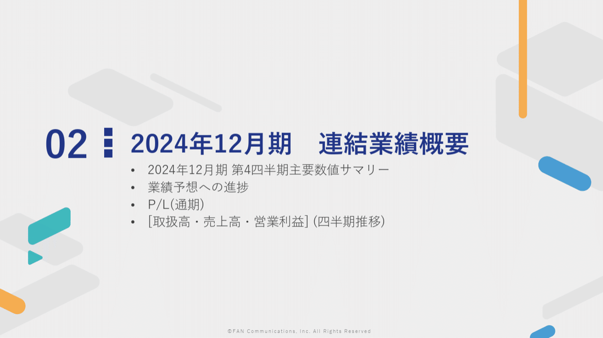
*セクション見出しの位置を決めるベースとなっているページ*

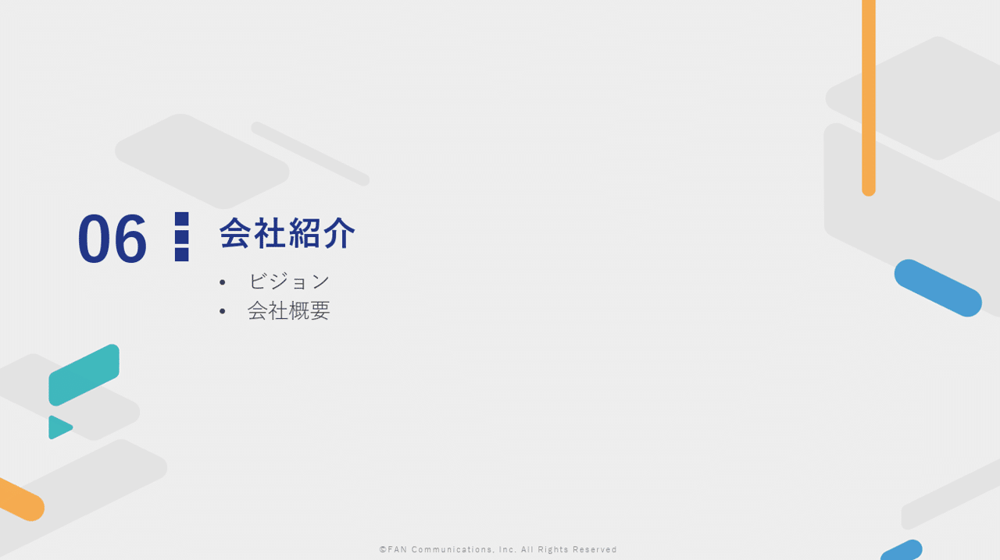
*それ以外のページ*

## パワポの「ディバイダー」徹底分析のまとめ

ディバイダーはそこまで複雑なデザインではないので、作成するのにそこまで時間はかかりません。一方で読み手が何度も目にするスライドであることから、良いデザインのディバイダーは読み手に強い印象を与えます。

ちなみに**上級者向けのスライドとして、パワポのディバイダーにサマリー的な役割**を持たせるようなものもあります。

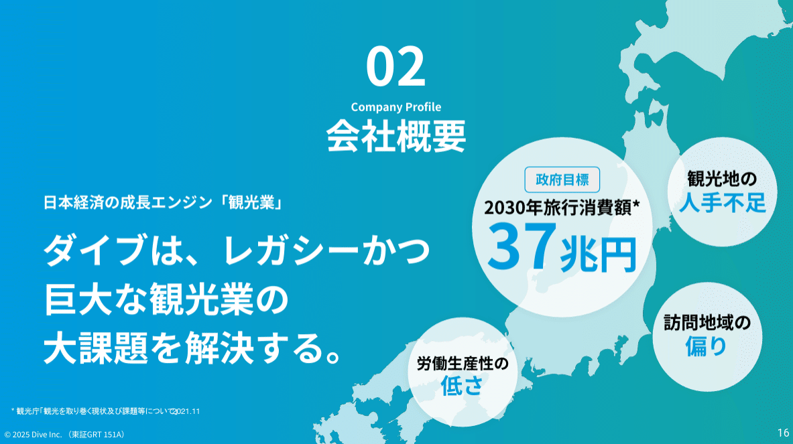
*パワポのディバイダーにサマリー要素を入れている例：株式会社ダイブ*

> 引用元：[> 2025年6月期 通期決算説明資料（事業計画及び成長可能性に関する事項）](https://ssl4.eir-parts.net/doc/151A/tdnet/2671665/00.pdf)

*https://dive.design/ir/library/presentation*

シンプルにしてクールな印象を与えるか、手の込んだ印象を与えるデザインで興味を引くか等、デザインに正解はないので、自社に合うデザインを探してみてくださいね。

## パワポ研オリジナルテンプレート

パワポ研では、「ビジネスシーンで使える」パワーポイントテンプレートを公開しております。デザインを整えるのみならず、**ロジックやストーリーを整理するのにも役立つパッケージ**になっておりますので、関心のある方は下記ページも併せてご覧ください！！

[
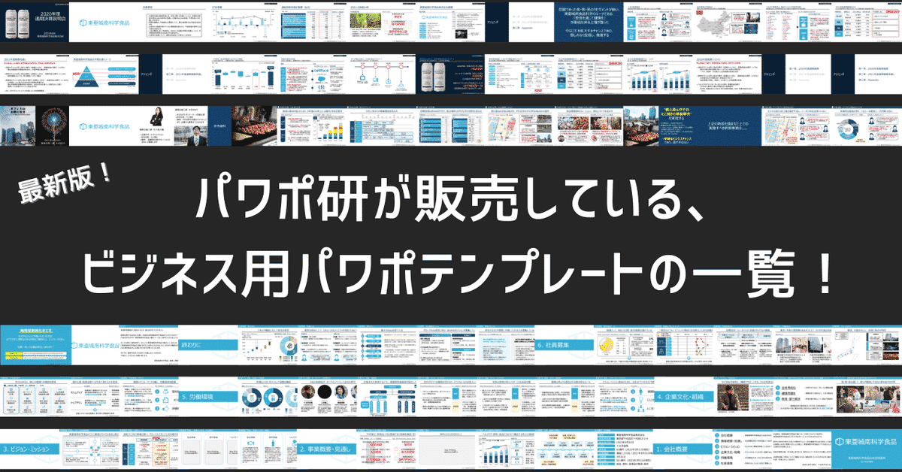
](https://note.com/powerpoint_jp/n/n7300a1293e8e)上記の記事のように、noteでは**フォローしているだけでビジネスにおける「資料作成のコツ」と「デザインのセンス」が身に付くアカウント**を目指して情報配信を行っています。
今後もコンスタントに記事を配信していく予定なので、関心のある方は是非アカウントのフォローをお願いします！

**> Template販売　**[> https://powerpointjp.stores.jp/](https://powerpointjp.stores.jp/%EF%BF%BCnote)
**> note　**[> パワポ研の資料作成術](https://note.com/powerpoint_jp/m/mc291407396da)
**> X（旧Twitter)　**[> https://twitter.com/powerpoint_jp](https://twitter.com/powerpoint_jp)

## レックスアドバイザーズからのお知らせ

パワポ研は株式会社レックスアドバイザーズが運営しています。
レックスアドバイザーズは**経営企画職や経営管理職に特化した転職エージェント**です。
上場企業や上場準備企業を中心に、**経営企画、IR、経理財務、法務、内部監査等の職種の求人**をご紹介しているほか、**CFOなどのコンフィデンシャル求人**もご紹介可能です。
またコンサルティングファームや監査法人、会計事務所の求人も豊富にあるため、プロフェッショナルファームを目指す方のご支援も得意です。
求人紹介やキャリア相談を希望の方は、[**無料転職サポート**](https://www.career-adv.jp/job_search/entryform_exp/?utm_source=note&utm_medium=referral&utm_campaign=note_pp)よりサービス利用登録をしてみてください。

*レックスアドバイザーズのサービスサイトはこちら*

**> 求人をご希望の方　**[> 無料転職サポート](https://www.career-adv.jp/job_search/entryform_exp/)**
> 採用支援をご希望の方　**[> 採用サポート](https://www.career-adv.jp/request3/)
**> その他　**[> お問い合わせフォーム](https://www.rex-adv.co.jp/contact)
**> 書籍　**[> 注目企業の実例から学ぶパワポ作成術](https://www.amazon.co.jp/dp/4046060476)

