# 【オシャレすぎる】もはやパワポのデザインが芸術的な領域に達している３社 （2025年更新）

[note原文](https://note.com/powerpoint_jp/n/ncdfb90a94314)

みなさんこんにちは。
資料デザインのリサーチや分析に取り組むパワーポイントのスペシャリスト、パワポ研です。

今回は、パワポのデザインがもはや「芸術の域」に達している3社を取り上げ、それぞれのスライドをチェックしていきます。なお、パワポ研では、費用対効果の観点から、ビジネスにおいては**見やすいスライド**を目指すことを推奨していますが、**今回ご紹介するスライドはそのレベルを遥かに超えたもの**となります。
「ある程度のレベルの技術は身につけたので、さらなる高みを目指したい」「どうしてもこだわりたいプレゼンがあって、時間はいくらかけても良いから最高のものを作りたい」という方は是非参考にしてください！

まずは見やすいスライドを作りたいという方は、こちらのまとめページにある、カテゴリー別のスライド見本を参考にしてくださいね。

それでは早速見ていきましょう。

## おしゃれな青と赤のデザインがすごい！

## メルカリ社の決算説明スライド

一社目のパワポは日本の二次流通マーケットを開拓した株式会社メルカリの決算説明資料です。近年最も勢いのある日本企業の一社で、売上2,000億円近くになってもなお年成長率二ケタ、営業利益率25％アップを目指しているのは圧巻です。2017年6月期から2025年6月期で売上は約5倍となっており、すごいの一言です。

二次流通プラットフォームというB2Cの領域で、フロントランナーであり続ける上では、プロダクトデザインをはじめ、人々の心に残るデザインを作り続けることが必要です。そのために**優秀なデザイナーを多数抱えている**と推測されます。サービスサイトやアプリはもちろんのこと、そのデザインの技術は決算説明資料にも反映されており、そのクオリティは専業のデザイン会社にも引けを取らないレベルに達していると感じました。

今回は2025年6月期の決算説明会資料を紹介いたします。

> 引用元：[> 決算説明資料](https://pdf.irpocket.com/C4385/CiMB/GaCa/H2bk.pdf)

*https://about.mercari.com/ir/library/results/*

表紙スライドでで、赤と青のグラデーションのようなデザインを使っていますが、これがのちほどのスライドのメインカラーになってきます。メルカリというとアプリの赤の印象が強いのですが、スライドは青ベースで進んでいきます。

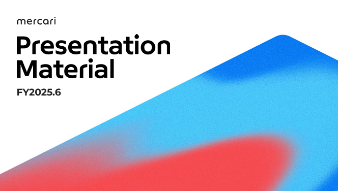

### ミッションのイラストがおしゃれ

表紙の次はすぐにミッションのスライドが来ます。通常は目次やら注意書きやらが来るのですが、**思い切ってメッセージを絞り込む**という姿勢は何とも潔いですね。またグローバルで循環社会を作っていくというメッセージに合うイラストは自社のオリジナルですが、これだけですごくおしゃれです。
ちなみに会社概要のページではこのイラストが動きます。

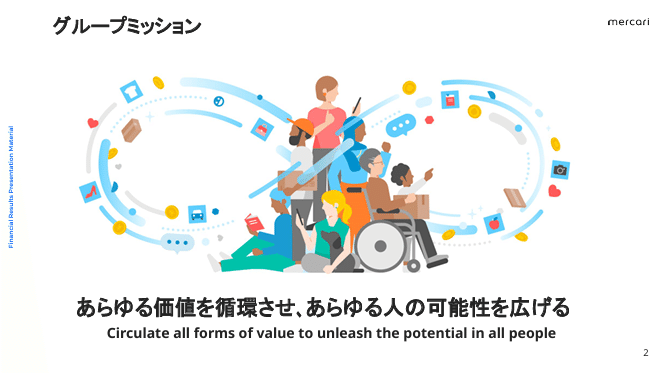

### 中期方針のグラフは強い意思を感じるデザイン

一見するとよくあるデザインなのですが、色遣いが抜群におしゃれです。
まず、基本的な実績のグラフは2色の青ですっきりと見せています。
そのうえで将来については、青の色を濃くすると同時に上の部分に向けてグラデーションをかけ、**「青天井」をイメージさせるデザイン**になっています。上の説明部分もだんだん青を濃くしていき、当社がより強い企業となっていくことをイメージさせます。
最後に、将来の成長を示す赤色の矢印です。ここで差し色の赤を配色してくることで、**「情熱の赤」のような、当社の強い意志を感じる**ことができます。読み手の期待をあおる、卓越したデザインといえますね。

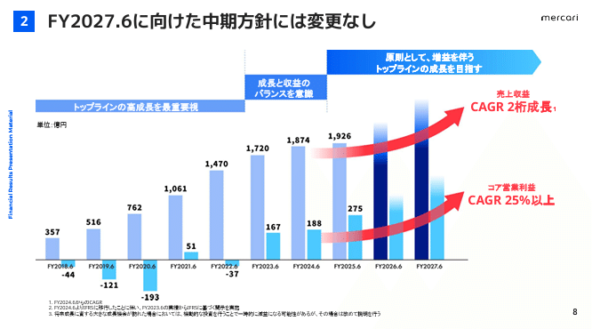

### 立体感のあるデザインが素晴らしい

先ほどのスライドの色遣いが素晴らしいという話をしましたが、売上成長のドライバーのページもで特に素晴らしいです。青系をメインにぐらーでションで示し赤色を使うのは先ほどと同じですが、その下に薄い水色のグラデーションで基盤をイメージさせています。
この基盤をグラデーションで見せることで奥行きを示すと同時に、棒グラフが立体的に見え、成長していく期待をあるデザインとなっています。一言で言えば**「グラデーション」の使い方が上手い**ということになるのかもしれませんが、この技術はすぐにマネできるような代物ではありません。他のタイプのグラフも見ながら、研究してみましょう。

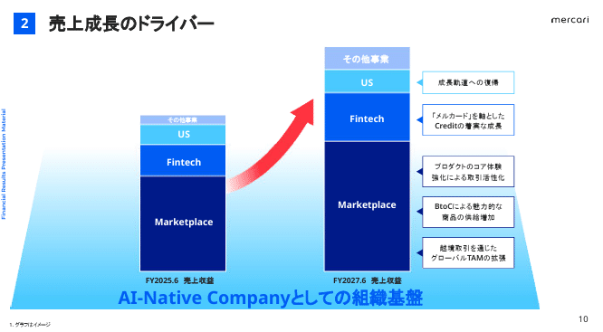

### 沿革ページも将来への期待が高まるデザイン

ここまで見てきて、グラデーションをうまく使えるだけでこんなにもおしゃれですごいデザインがつくれるのだなと感動します。沿革のスライドも内容は一般的で、真似できそうなものですが、**グラデーション、文字の色使い、赤の差し色などすごく考えられており、非常にハイレベルな**描画です。全体が調和して「ちょうど良い」バランスに収まっているだけでなく、当社の意思と、実現してくれそうという期待をあおることができています。。

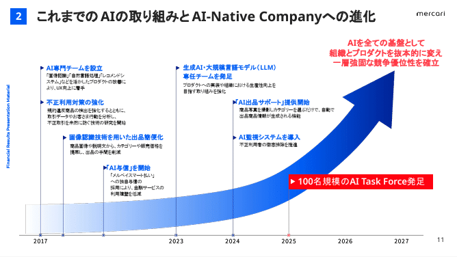

### 事業展開図は線の使い方が絶妙におしゃれ

「今後の事業展開」のといったスライドを図で説明する際に役立ちそうです。「今後の事業展開」に関する説明は箇条書きにしたり表でまとめたりしがちですが、まずは**こうしてデザインで分かりやすく説明**すると、差別化ができます。
そのうえでよくみられるのは面積グラフを何層にも重ねていくデザインですが、あのデザインは「今は具体イメージがないんだな」という印象を与えがちです。本スライドもそこまで細かく説明はしていないものの、**全体に線を少なくしつつ左側だけはソリッドな太線で見せる**ことで、道筋があるような印象を与えられており、素晴らしいデザインといえますね。

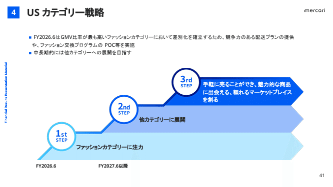

## デザイン会社のパワポのこだわりがすごい！

## グッドパッチ社の決算説明スライド

パワポ研でも度々紹介している、株式会社グッドパッチです。2020年にデザイン会社として初めて東京証券取引所に株式上場を果たし、そのクオリティもさることながら、規模においても業界トップクラスの会社です。本業はwebデザインですが、当然ながら決算スライドも極めて高いクオリティで製作されています。

今回は2024年8月期の決算説明資料を見てみましょう。

> 引用元：[> 2024年8月期 通期決算説明資料](https://contents.xj-storage.jp/xcontents/AS04618/22fe3e47/ca7e/482f/a421/0edb53ca8ab0/20241015143845871s.pdf)

*https://goodpatch.com/ir/presentation*

### デザイン会社ならではのおしゃれな表紙

「良い子は真似してはいけません」と言いたくなるほど手間のかかった表紙です。背景の**「爪痕を残す」をモチーフにした描画**も見事ですし、スライド全体の**「ザラザラ感」**もどのように演出しているのかが気になります。また、四隅に配置されたロゴやコピーライトも絶妙な大きさにコントロールされていて、芸が細かいですね。こちらは[【マネしたい】おしゃれなパワポの表紙スライド３０選](https://note.com/powerpoint_jp/n/na7d0cb4925f3)でも取り上げました。

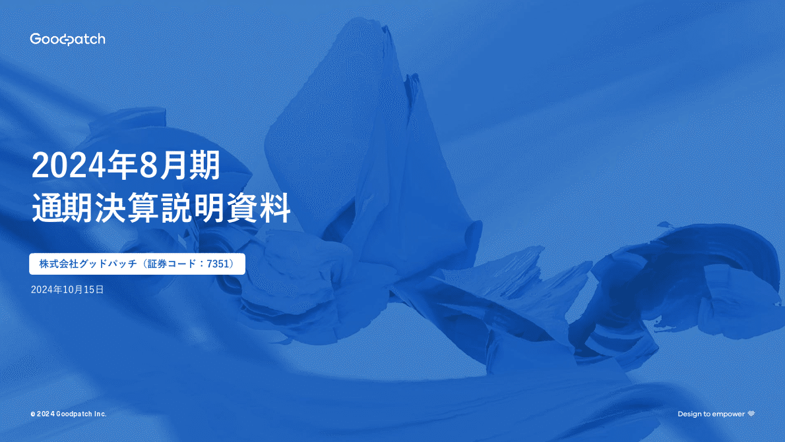
> 現在のGoodpatchに必要なことを言語化したものが、 デザインコンセプト”MAKE A MARK.”です。 IPOから3年が経ちますが、業績不振に苦しむ時期も メンバー1人1人が粘り強くミッション・ビジョンと 向き合い続けることで、足元の業績回復が見え 確かな成長路線に戻ってきました。 これまでの歩みとこの先の未来を見つめたとき、 「私たちはこの先世界に何を残すのか？」という現状を 問い直し、挑戦し続けることで世界に新しい ビジネスインパクトを残すこと、つまり、 MAKE A MARK（=爪痕を残す）ことがデザインの力を 証明してくれる、そんな思いが込められています。

*表紙デザインについて デザインコンセプト ”MAKE A MARK.”*

### 写真を活かしてすっきりと見せる会社概要

[カッコいいパワポの「会社概要」スライド９選](https://note.com/powerpoint_jp/n/na98a8a3288b8)のNoteでも触れましたが、基本情報の横には会社を表したり、イメージしたりできるものを載せるのがよいです。グッドパッチはあえてデザイン会社らしいオフィス写真を載せることでアイデンティティを見せています。

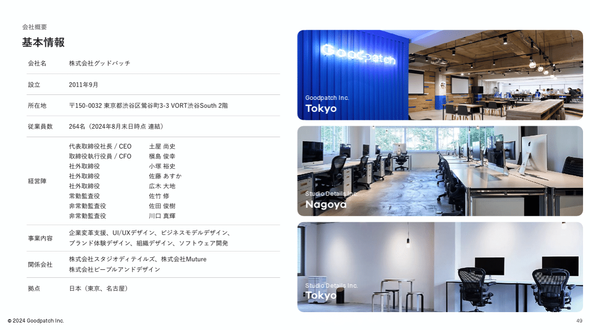

### Webデザインの発想を生かしたおしゃれなデザイン

グッドパッチのスライドの特徴は、**「薄いグレーの背景+白のテキストエリア」**です。これはおそらくwebデザインの「class分けをする」という発想を取り入れたものだと思われますが、スライドを「1枚の画面」として見た時に最適な見え方は何かということを探求した結果、このようなデザインに辿り着いたのでしょう。この考え方は幅広く応用可能なので、是非この点に注意して他のスライドもご覧ください。

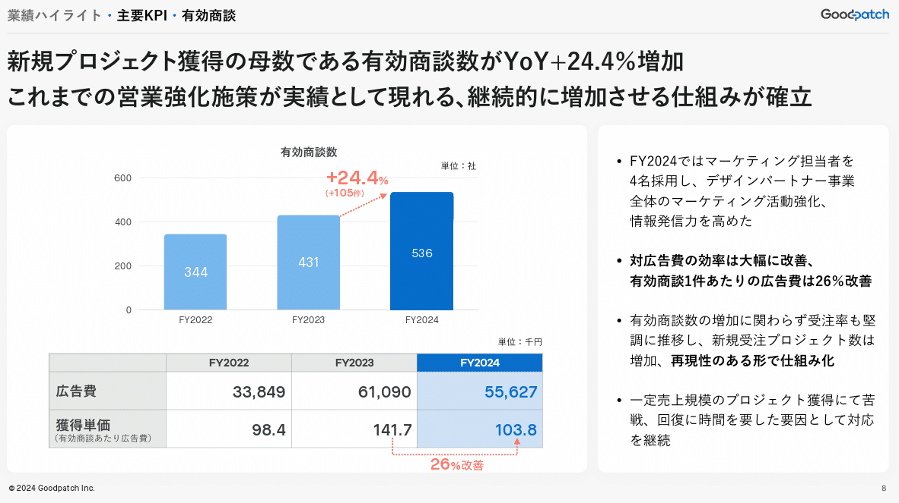

### 事業領域イメージは言葉を極限まで省いたデザイン

このスライドも非常にオリジナリティが高いですね。文字ではなく、**イメージで説明**することを追求した軌跡が見て取れます。スライドの情報量はかなり少ないにも関わらず、このスライド1枚でグッドパッチが何をやっているのかが手にとるように分かるのはすごいですね。

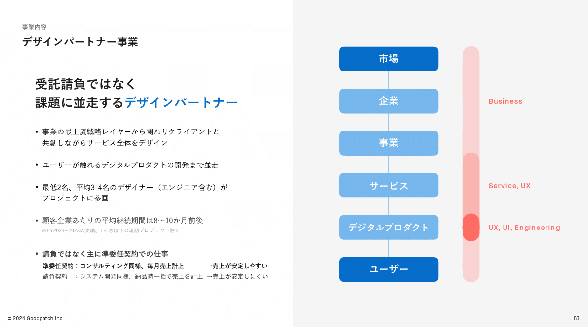

### 配色の枠組みもWebデザイン技術の応用

ビジネスモデルを表現するこの図は「灰色＞白＞青＞白」という**4つの枠組み**で構成されています。これも会社概要のところで説明したwebデザインの技術を応用したものだと考えられます。

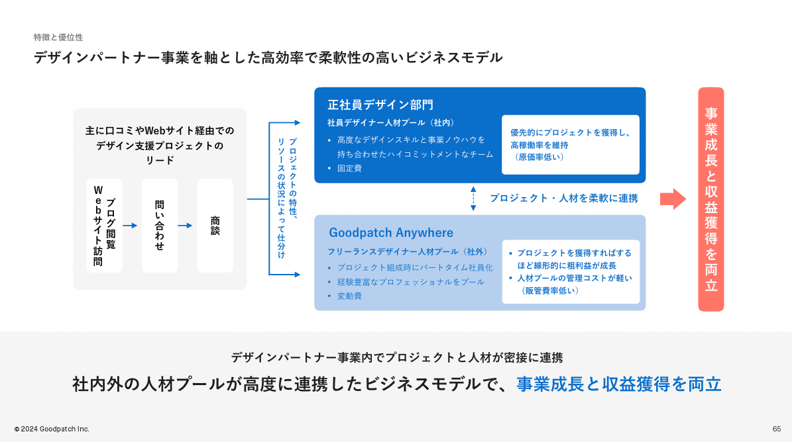

### 四角と円を何層にも組み合わせたデザイン

ここまで色合いの話を多くしてきましたが図形の使い方もおしゃれです。
デザインテーマの領域を四角の改装で見せる一方、コアバリューとそこから提供するサービスは真ん中の縁から広げています。
もちろん配色も素晴らしく、真ん中の円は**青一色でコアを表現**しています。アクセントカラーとして使っている赤色も、原色ではない優しい色使いで、こだわりを感じますね。

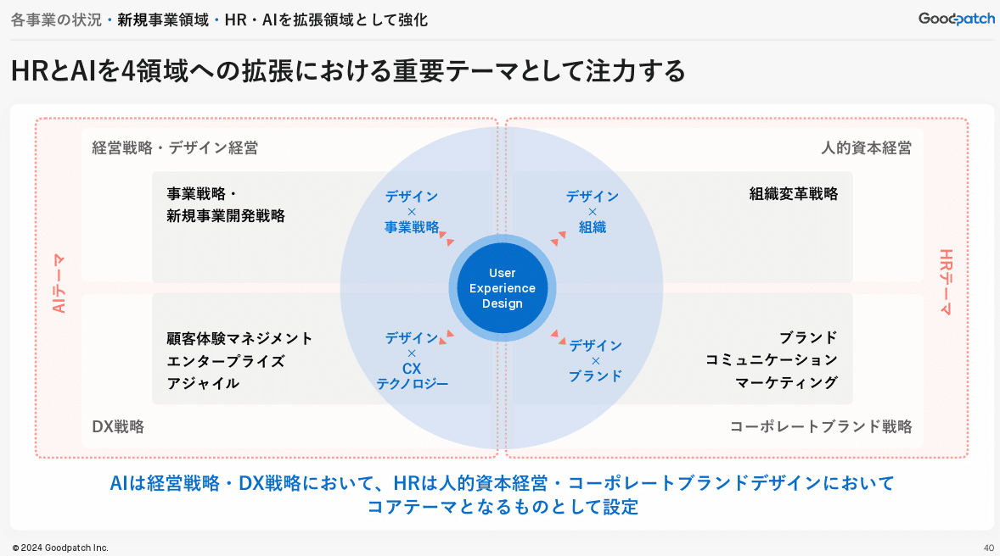

## パステルカラーのカラフルなデザイン！

## ユーグレナ社の決算説明資料スライド

最後に紹介するのは、株式会社ユーグレナです。ミドリムシで航空機を飛ばすという壮大な夢に向かってひた走る企業で、創業以来のベンチャースピリットを感じます。
決算説明資料のデザインはコーポレートカラーの緑とピンクを中心に、黄色、紫、オレンジと、これでもかとパステルカラーを詰め込んでいるのですが、**全く喧嘩することなくおしゃれ**にまとまっています。
壮大な夢を追いかける中で、多くの投資家からいろいろなことを言われてきたのがユーグレナという会社です。そうした中で**信念を守っていくためにデザインが進化**したのかもしれません。そこで培われた独特の感性も相まってか、他には類を見ないポップでおしゃれなスライドが多数登場します。

今回は2024年12月期の決算説明資料を見てみましょう

> 引用元：[> 2024年12月期通期決算説明および今後の展望](https://ssl4.eir-parts.net/doc/2931/tdnet/2568583/00.pdf)

*https://www.euglena.jp/ir/library/presentation/*

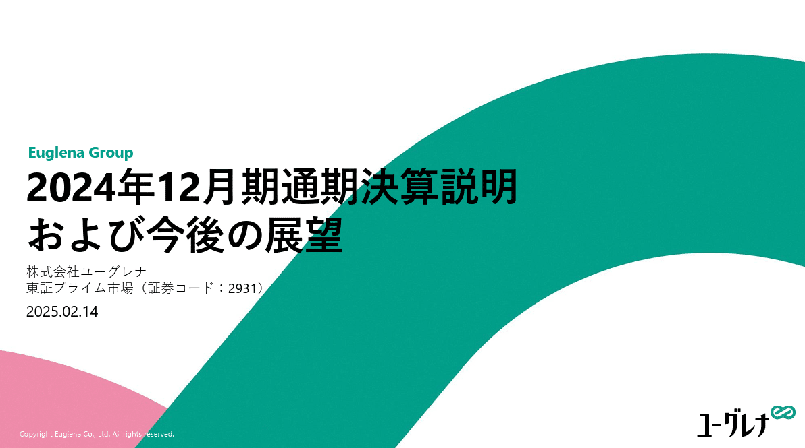

### 独特の配色なのに統一感があってすごい

ユーグレナの特徴は何といっても色の調和です。これだけ写真の配列があり、多色を入れてもケバケバしくならないのは、まず**スライド自体の構造がきれいなこと、そして配色の組み合わせがよい**からでしょう。バイオ燃料とヘルスケアは黄色と緑、2024年進捗とバイオ燃料は青と黄色というように、**直接接する二色を食い合わせのいい配色**にしているのがポイントです。
またこのように右と左の画像サイズを変えて、それぞれに最適な写真を持ってきて並べるのは、実は結構難しいです。この辺りも細部まで考え抜かれているといえますね。

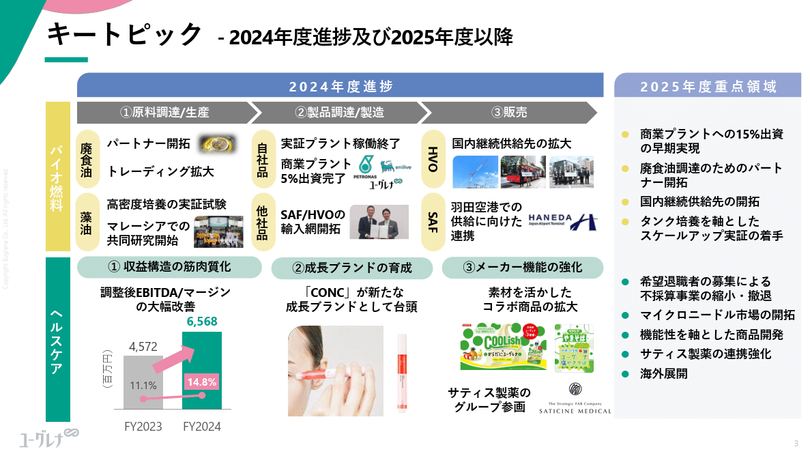

### 多色を使えることでビジネスモデル図がすごく見やすい

決算発表資料をはじめとする多くのパワポスライドで、難易度が高いのがビジネスモデル図です。しかしユーグレナは**多色を使えることによって、背景色や囲みの色をうまく使い分け、非常に見やすいデザイン**に仕上げています。

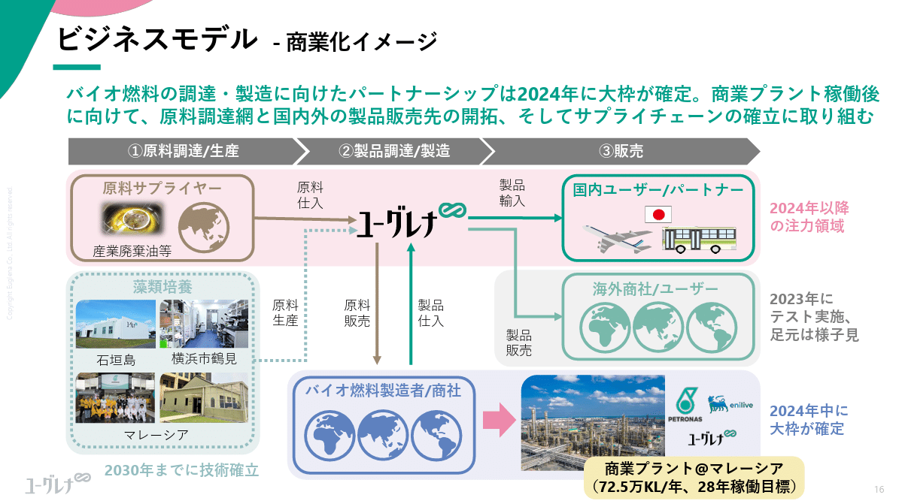

### 表も枠線ナシですっきりしたデザイン

マネしようとしている人がいたら絶対に止めたくなるようなパステルカラーのスライドです。緑、黄色、茶色、青色で構成されていて、いきなりこのスライドを見るとびっくりするかもしれませんが、**既にパステルカラーの多色スライドに見慣れている**ので、見やすいなぁ、何ならおしゃれだなぁくらいしか思いません。すごいテクニックだと思います。

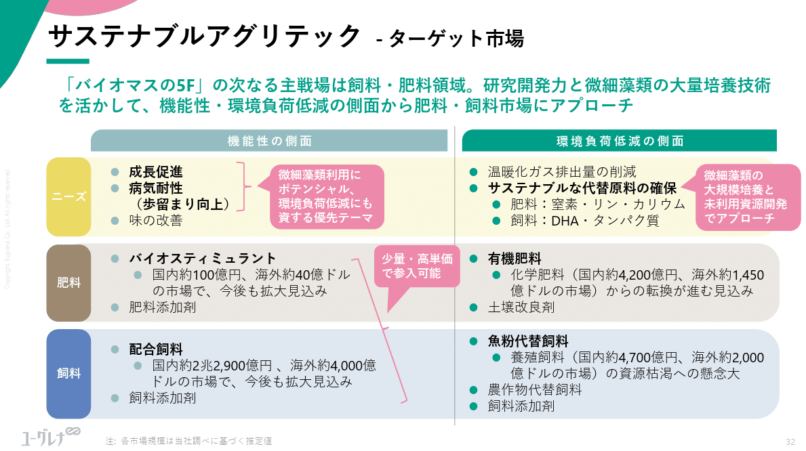

### 情報量の多さも何のそので一目で理解できるデザイン

事業ポートフォリオのイメージ図ですが、ふつうこれだけの写真や数字を入れると、ヒトの脳は処理に苦労してしまいます。しかしこのスライドも、**構造がきれいに設計されていることで、あまり他では見ないデザインですが、やりたいことが一目でわかって**しまいます。色遣いやおしゃれさに目が活きますが、わかりやすさも当然に具備していますね。

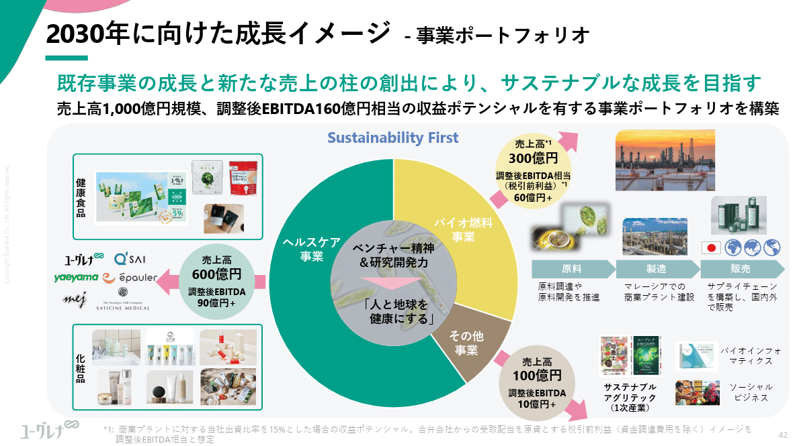

## パワポ研オリジナルテンプレート

パワポ研では「ビジネスシーンで使える」パワーポイントテンプレートを公開しております。デザインを整えるのみならず、**ロジックやストーリーを整理するのにも役立つパッケージ**になっておりますので、関心のある方は下記ページも併せてご覧ください！

上記の記事のように、noteでは**フォローしているだけでビジネスにおける「資料作成のコツ」と「デザインのセンス」が身に付くアカウント**を目指して情報配信を行っています。
今後もコンスタントに記事を配信していく予定なので、関心のある方は是非アカウントのフォローをお願いします！

**> Template販売　**[> https://powerpointjp.stores.jp/](https://powerpointjp.stores.jp/%EF%BF%BCnote)
**> note　**[> パワポ研の資料作成術](https://note.com/powerpoint_jp/m/mc291407396da)
**> X（旧Twitter)　**[> https://twitter.com/powerpoint_jp](https://twitter.com/powerpoint_jp)

## レックスアドバイザーズからのお知らせ

パワポ研は株式会社レックスアドバイザーズが運営しています。
レックスアドバイザーズは**経営企画職や経営管理職に特化した転職エージェント**です。
上場企業や上場準備企業を中心に、**経営企画、IR、経理財務、法務、内部監査等の職種の求人**をご紹介しているほか、**CFOなどのコンフィデンシャル求人**もご紹介可能です。
またコンサルティングファームや監査法人、会計事務所の求人も豊富にあるため、プロフェッショナルファームを目指す方のご支援も得意です。
求人紹介やキャリア相談を希望の方は、[**無料転職サポート**](https://www.career-adv.jp/job_search/entryform_exp/)よりサービス利用登録をしてみてください。

*レックスアドバイザーズのサービスサイトはこちら*

**> 求人をご希望の方　**[> 無料転職サポート](https://www.career-adv.jp/job_search/entryform_exp/)**
> 採用支援をご希望の方　**[> 採用サポート](https://www.career-adv.jp/request3/)
**> その他　**[> お問い合わせフォーム](https://www.rex-adv.co.jp/contact)
**> 書籍　**[> 注目企業の実例から学ぶパワポ作成術](https://www.amazon.co.jp/dp/4046060476)

