# 【マネしたい】おしゃれなパワポの「タイトル」デザイン９選

[note原文](https://note.com/powerpoint_jp/n/ncf68cb5f79d1)

みなさんこんにちは。
資料デザインのリサーチや分析に取り組むパワーポイントのスペシャリスト、パワポ研です。

今回は、**パワポの「タイトル」に焦点を当て、上場企業のIR資料からおしゃれなスライドを紹介**していきます。パワーポイントの表紙のデザインについては、【マネしたい】おしゃれなパワポの表紙スライド３０選でも取り上げましたが、今回はおしゃれな「タイトル」デザインにフォーカスを当てて紹介していきます。

一般にパワポのIR資料のタイトルは左寄せのデザインが多いです。
**人の目の動きは左から右に流れていくので、タイトルを左においておく方が見やすいパワポになる**からです。その中でロゴを大きくしたり、タイトルを大きくしたりしておしゃれなパワポにデザインするわけです。

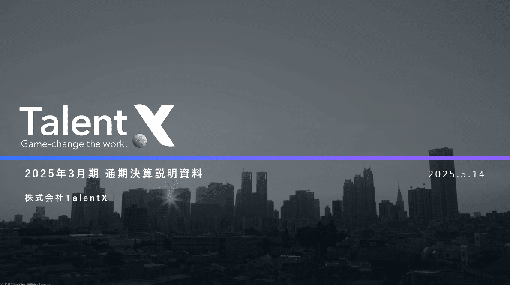
*資料タイトルより企業ロゴが大きいパワポの表紙*

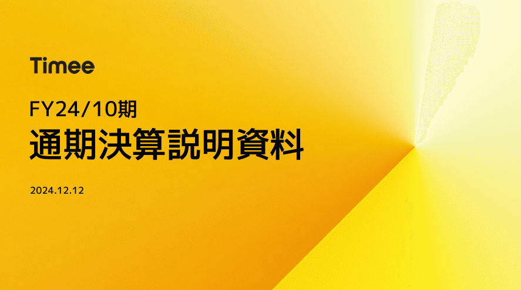
*企業ロゴより資料タイトルが大きいパワポの表紙*

とはいえ、パワポの表紙はプレゼンテーションの顔なので、**各社おしゃれなスライドにすべく様々なデザイン**にしています。タイトルについても、真ん中に置く、右に寄せる、下に寄せるなどのデザインのパターンがあるので、そのようなパワポのタイトルのバリエーションを紹介していきますよ。
では早速行きましょう！

## タイトル位置が中央のパワポ例２選

まずはパワポのタイトル位置が中央に来ているデザインのスライドから見ていきましょう。パワポのIR資料ではたまに見かけるデザインですね。

### タイトルがスライドの中心にあるパワポ例

まずは株式会社TWOSTONE&Sonsのパワポにおけるタイトルのデザインを見ていきましょう。
2025年８月期 通期決算説明資料（事業計画及び成長可能性に関する事項）のパワーポイント資料にある、タイトルのスライドです。

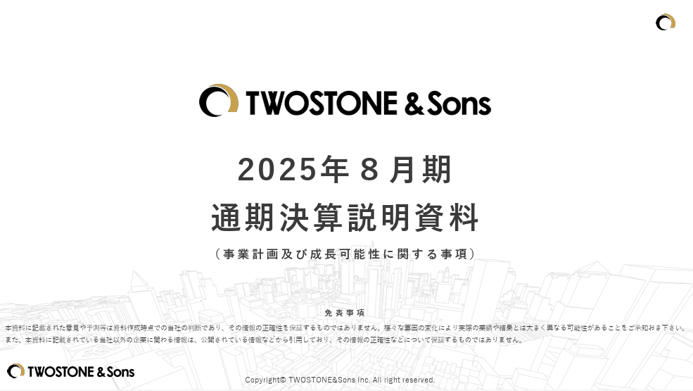
> 引用元：[> 2025年８月期 通期決算説明資料（事業計画及び成長可能性に関する事項）](https://contents.xj-storage.jp/xcontents/AS08579/c3e03c77/9cb5/4565/8125/c60c69454e2a/140120251015573956.pdf)

*https://twostone-s.com/ir/presentations/*

パワポのタイトルにおけるデザインの特徴として、**スライドの真ん中あたりにタイトルを置いて**います。タイトルから見て左右の余白が均一であるだけでなく、上下の余白もある程度均一に見えます。
中央のタイトルの真上に企業ロゴを入れているため、企業ロゴは真ん中やや上、スライドタイトルは真ん中というパワポデザインになっています。

**人間は均整の取れたデザインをおしゃれだと感じるため**、このパワポのように真ん中にタイトルがあるとおしゃれなパワポだと感じるわけですね。タイトルを２行にしているのも、スライド真ん中にコンパクトに収めるためのデザインの工夫でしょう。

### タイトルがスライド中央下にあるパワポ例

続いて株式会社U-NEXT HOLDINGSのパワポにおけるタイトルのデザインを見ていきましょう。
2025年８月期 通期決算説明資料のパワーポイント資料にある、タイトルのスライドです。

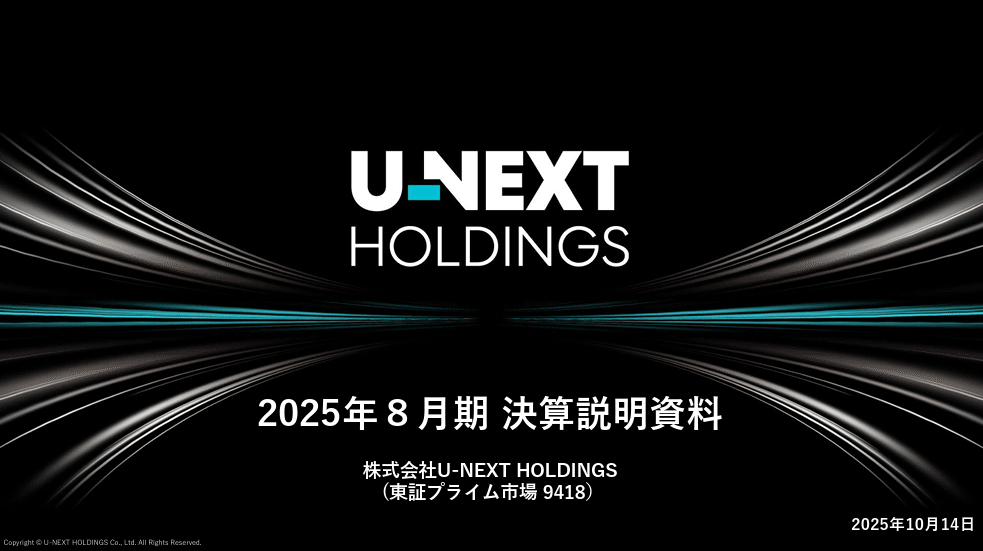
> 引用元：[> 2025年8月期　通期決算説明資料](https://ssl4.eir-parts.net/doc/9418/ir_material_for_fiscal_ym5/188477/00.pdf)

*https://unext-hd.co.jp/ir/presentation.html*

パワポのタイトルにおけるデザインの特徴として、**まずロゴを中心の少し上にもってきて、その下にタイトル**を置いています。企業ロゴがよく知られた有名企業の場合、ロゴを中心にすることでパワポのデザインが引き締まるわけですね。

また企業ロゴとタイトルの間に、企業ロゴと同じ青緑色のラインを入れることで全体に統一感を出している点も、おしゃれなパワポデザインにする上でポイントとなっています。ロゴは２行、タイトルは１行でパワポ全体のバランスを取っています。

## タイトル位置が右側のパワポ２選

続いてパワポのタイトル位置が右側にきているデザインのスライドを見てみましょう。一般的な左側にタイトルがあるパワポスライドと比べると、少し目新しい感じがしておしゃれに映るデザインです。

### タイトルが右側のデザインのパワポ例

まずは株式会社GA technologiesのパワポにおけるタイトルのデザインから見ていきましょう。
2025年10月期 通期決算説明資料のパワーポイント資料にある、タイトルのスライドです。

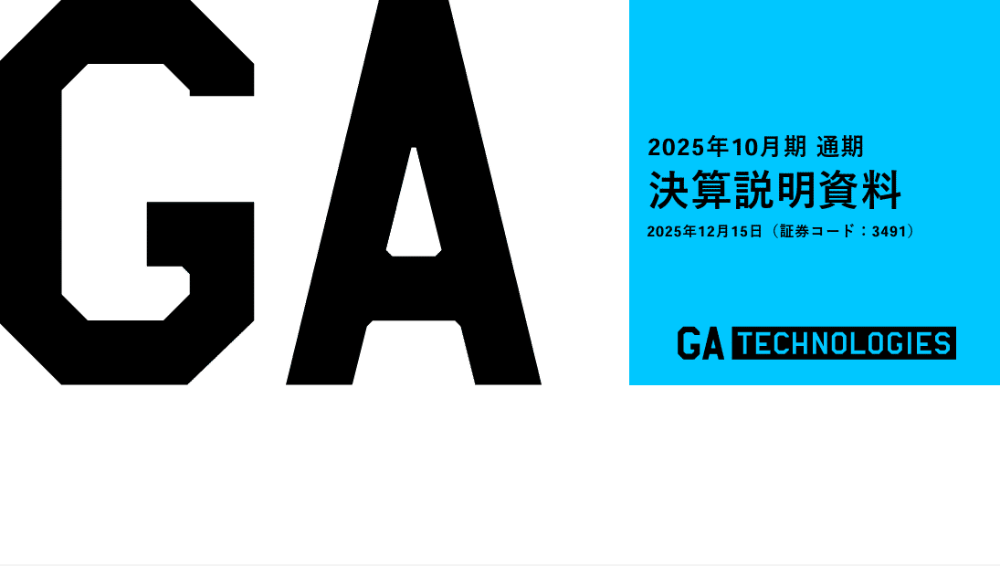
> 引用元：[> 2025年10月期 通期 決算説明資料](https://ssl4.eir-parts.net/doc/3491/tdnet/2731390/00.pdf)

*https://www.ga-tech.co.jp/ir/news/*

パワポのタイトルにおけるデザインの特徴として、**左側にロゴにもあるGAの部分を大きく出し、右側にタイトルを入れて**います。ただタイトルを右に置くのではなく、ロゴがあってタイトルが右に来ているので自然なデザインとなっています。なおタイトルのスペースがやや狭いため、パワポのタイトルは２行になっています。

おしゃれなパワポにする上でのポイントとして、**右側のタイトル部分の背景をコーポレートカラーの水色**にしているほか、**下部分をあえて幾何学的な余白として残しています**。スライドを幾何学的に整備することで、パワポがデジタルでおしゃれな印象になることは、テクニックとして覚えておきたいですね。

### タイトルが右寄せデザインのパワポ例

続いて株式会社リンクアンドモチベーションのパワポにおけるタイトルのデザインを見てみましょう。
2024年12月期 通期決算説明資料のパワーポイント資料にある、タイトルのスライドです。

> 引用元：[> 2024年12月期 決算説明会 スライド](https://ssl4.eir-parts.net/doc/2170/ir_material_for_fiscal_ym/172674/00.pdf)

*https://www.lmi.ne.jp/ir/library/presentation_materials/*

パワポのタイトルにおけるデザインの特徴として、**タイトルがただ右側にあるだけでなく、企業ロゴも含めてピタッと右寄せ**になっています。タイトルが真ん中にあるパワポスライド同様、均整の取れたデザインに見えることで、おしゃれなパワポに見えるわけですね。

またポイントとして、タイトルの色を企業ロゴと同じ濃い目のピンク色にすることで、パワポ全体で統一感を出している点も、おしゃれなをデザインする上でのの必須条件を押さえています。

## タイトル位置が下にあるパワポ２選

今度はパワポのタイトル位置が下にきているデザインのスライドを見てみましょう。パワーポイントのフッターのような形でタイトルが入っているデザインと、下の帯のような形でタイトルが入っているデザインを見てみます。

### タイトルがフッター位置にあるパワポ例

まずは株式会社ミンカブ・ジ・インフォノイドのパワポのタイトルのデザインから見ていきましょう。
2025年6月の事業計画及び成長可能性に関する事項のパワーポイント資料にある、タイトルのスライドです。

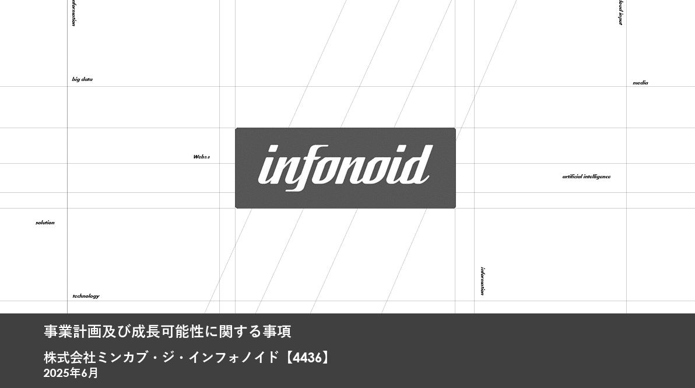
> 引用元：[> 事業計画及び成長可能性に関する事項](https://global-assets.irdirect.jp/pdf/tdnet/batch/140120250630504922.pdf)

*https://minkabu.co.jp/ir/library/*

パワポのタイトルにおけるデザインの特徴として、**タイトルがフッターのような形で一番下に入って**います。パワポの表紙スライドとしてはタイトルがやや小さいものの、黒塗りに白抜きのため、意外に見やすいデザインとなっています。

全体としてモノクロでおしゃれかつ、パワポのタイトルとしてはあまり見ないデザインのため、読み手の関心を引きやすいですね。

### タイトルが帯形式で下にあるパワポ例

お次は株式会社 L is B のパワポのタイトルのデザインです。
2025年2月の事業計画及び成長可能性に関する事項のパワーポイント資料にある、タイトルのスライドです。

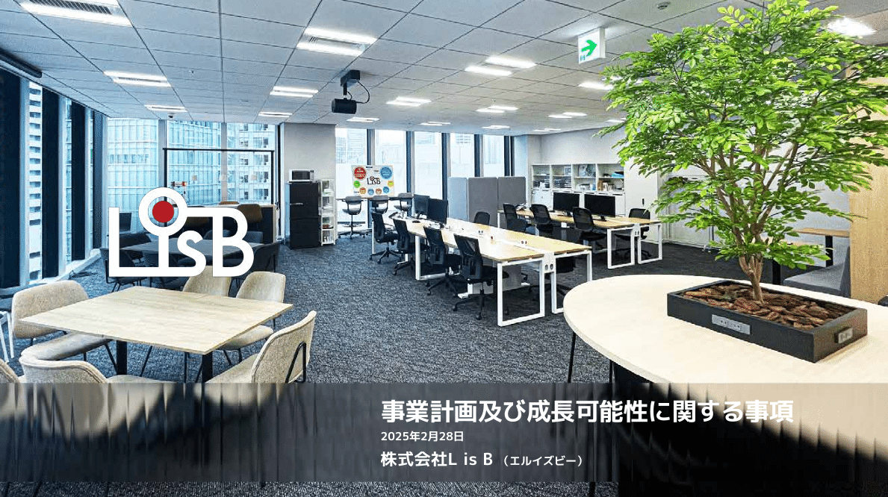
> 引用元：[> 2024年 12月期 通期 決算説明資料](https://contents.xj-storage.jp/xcontents/AS05193/eb43db33/5d69/419f/a9af/3e1d5d3423b5/140120250214575783.pdf)

*https://l-is-b.com/ja/ir/presentations/*

パワポのタイトルにおけるデザインの特徴として、**タイトルが帯のような形でスライドの下の方に入って**います。真ん中左にロゴ、右下にタイトルという構成になっています。

ポイントとして、**パワポの背景をオフィスの画像であることから、タイトルの帯をすりガラスのようなデザイン**にしています。中々見ないデザインですが、おしゃれなタイトルの見せ方のパワポといえますね。

## タイトルのデザインに工夫があるパワポ３選

ここからの３つのパワーポイントは、スライドのタイトルそのものにおしゃれなデザインが施されている事例です。具体的にはタイトルにおける色の使い方やタイトル名や表記の仕方などに工夫がされています。

### タイトルがグラデーションのパワポ例

まずは雪印メグミルク株式会社のパワポのタイトルのデザインから見ていきましょう。
雪印メグミルクグループ経営計画「Next Design2030」説明会資料のパワーポイント資料にある、タイトルのスライドです。

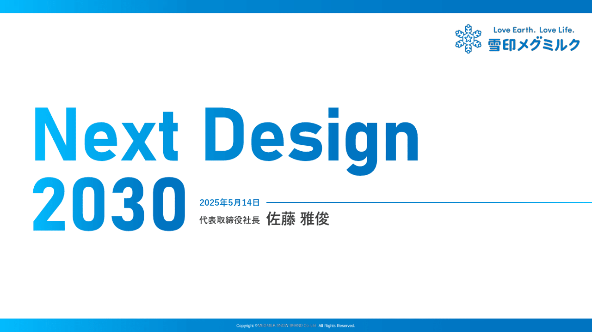
> 引用元：[> 雪印メグミルクグループ経営計画「Next Design2030」説明会資料](https://contents.xj-storage.jp/xcontents/AS08619/a9b41d9b/eaf5/40e3/831c/ce9646e82c7c/20250514081918914s.pdf)

*https://www.meg-snow.com/ir/library/presentation/*

パワポのタイトルにおけるデザインの特徴として、**タイトルの色が水色から濃い青色へと変化するグラデーションになって**います。タイトルのスライドに占める割合が大きいため、タイトルは２行になっています。

グラデーションに加えて、パワポのタイトルが「中期経営計画」ではなく、計画名の「NEXT DESIGN 2030」になっている点もおしゃれですね。

### タイトルが英語表記のパワポ例

続いて株式会社マネーフォワードのパワポのタイトルのデザインを見ていきましょう。
2024年11月期 通期決算説明資料のパワーポイント資料にある、タイトルのスライドです。

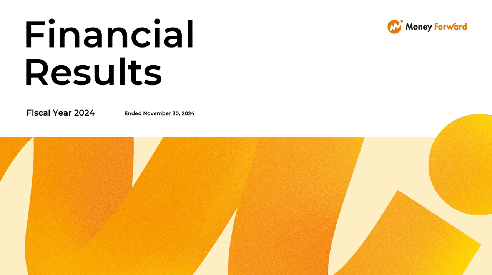
> 引用元：[> 2024年11月期 通期決算説明資料](https://contents.xj-storage.jp/xcontents/AS71106/eb6f0b41/52b9/4bf0/b88f/feeb1297f0a1/140120250110549145.pdf)

パワポのタイトルにおけるデザインの特徴として、**タイトルが英語表記になって**います。タイトルだけでなく、2024年11月期であることも英語で表記されています。英語なので横長になりがちでパワポのタイトルは２行ですね。

英語表記にするだけなので、ある種そんなに工夫があるわけではないのですが、日本においては珍しいデザインですね。

### タイトルが独自フォントのパワポ例

最後は株式会社メルカリのパワポのタイトルのデザインです。
FY2025.6 4Q 決算説明資料のパワーポイント資料にある、タイトルのスライドを見てみましょう。

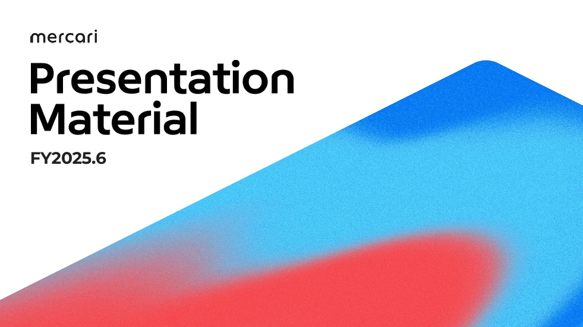
> 引用元：[> FY2025.6 4Q 決算説明資料](https://pdf.irpocket.com/C4385/bffO/gPP8/xzTK.pdf)

*https://about.mercari.com/ir/news/*

パワポのタイトルにおけるデザインの特徴として、タイトルが独自フォントの英語表記になっています。**タイトルのフォントにメルカリのロゴと同じフォントを使うことで、デザインの一貫性が出て**、おしゃれなパワポスライドに仕上がっています。日本語と英語だとフォントが合わなくなることも多いので、タイトルが英語表記だからこそのデザインとも言えますね。こちらもパワポのタイトルは２行です。

パワポのタイトルに限らず、メルカリのパワーポイントは細部までこだわり抜かれた非常にレベルの高いデザインとなっています。メルカリのプレゼンテーション資料は、【オシャレすぎる】もはやパワポのデザインが芸術的な領域に達している３社のNoteで紹介しているので、気になる方は見てみてください。

## 【マネしたい】おしゃれなパワポの「タイトル」デザイン９選まとめ

パワポのタイトルに焦点を当て、おしゃれなパワポデザインの事例を紹介してきました。タイトル一つとっても様々なデザインがあることが伝わったかと思いますので、今後パワポの表紙のレベルアップを図る際は是非参考にしてみてくださいね。

## パワポ研オリジナルテンプレート

パワポ研では「ビジネスシーンで使える」パワーポイントテンプレートを公開しております。デザインを整えるのみならず、**ロジックやストーリーを整理するのにも役立つパッケージ**になっておりますので、関心のある方は下記ページも併せてご覧ください！

[
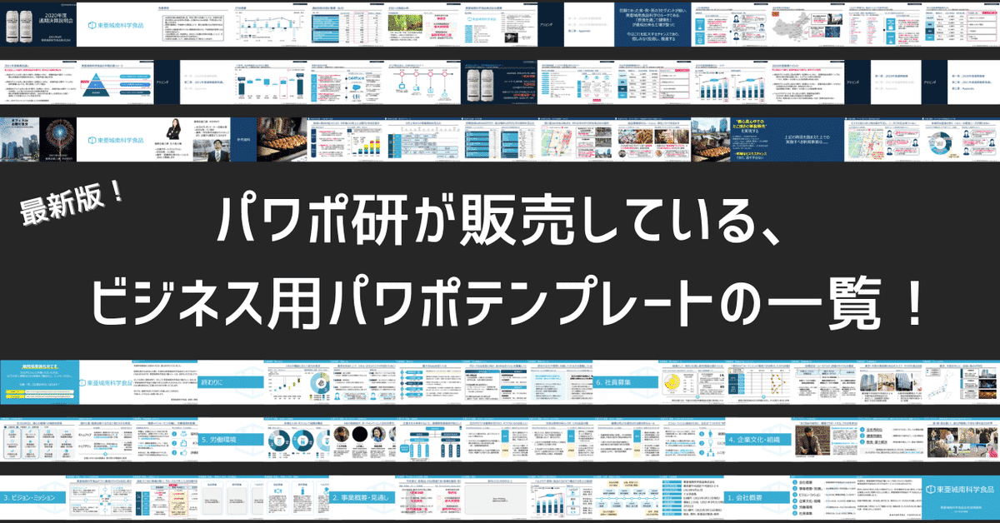
](https://note.com/powerpoint_jp/n/n7300a1293e8e)上記の記事のように、noteでは**フォローしているだけでビジネスにおける「資料作成のコツ」と「デザインのセンス」が身に付くアカウント**を目指して情報配信を行っています。
今後もコンスタントに記事を配信していく予定なので、関心のある方は是非アカウントのフォローをお願いします！

**> Template販売　**[> https://powerpointjp.stores.jp/](https://powerpointjp.stores.jp/%EF%BF%BCnote)
**> note　**[> パワポ研の資料作成術](https://note.com/powerpoint_jp/m/mc291407396da)
**> X（旧Twitter)　**[> https://twitter.com/powerpoint_jp](https://twitter.com/powerpoint_jp)

## レックスアドバイザーズからのお知らせ

パワポ研は株式会社レックスアドバイザーズが運営しています。
レックスアドバイザーズは**経営企画職や経営管理職に特化した転職エージェント**です。
上場企業や上場準備企業を中心に、**経営企画、IR、経理財務、法務、内部監査等の職種の求人**をご紹介しているほか、**CFOなどのコンフィデンシャル求人**もご紹介可能です。
またコンサルティングファームや監査法人、会計事務所の求人も豊富にあるため、プロフェッショナルファームを目指す方のご支援も得意です。
求人紹介やキャリア相談を希望の方は、[**無料転職サポート**](https://www.career-adv.jp/job_search/entryform_exp/)よりサービス利用登録をしてみてください。

*レックスアドバイザーズのサービスサイトはこちら*

**> 求人をご希望の方　**[> 無料転職サポート](https://www.career-adv.jp/job_search/entryform_exp/)**
> 採用支援をご希望の方　**[> 採用サポート](https://www.career-adv.jp/request3/)
**> その他　**[> お問い合わせフォーム](https://www.rex-adv.co.jp/contact)
**> 書籍　**[> 注目企業の実例から学ぶパワポ作成術](https://www.amazon.co.jp/dp/4046060476)

