# 【コンサルのパワポ紹介】上場しているＩＴコンサルティングファームのスライド資料

[note原文](https://note.com/powerpoint_jp/n/nd40e533c5632)

みなさんこんにちは。
資料デザインのリサーチや分析に取り組むパワーポイントのスペシャリスト、パワポ研です。

パワポ研ではこれまで、戦略コンサルティングファームや、上場している経営コンサルティングファームの資料を紹介してきましたが、今回は**上場しているITコンサルティングファームの資料**を紹介していこうと思います。

ITコンサルティングファームにおいては、経産省の委託事業の資料も少ないので、IR資料が中心になります。では早速行きましょう！

## 株式会社ベイカレント・コンサルティング

まずは株式会社ベイカレント・コンサルティングのパワポスライドです。
ベイカレントは1998年に創業し、2016年に東証マザーズ上場、2018年に東証1部に鞍替えしました。2025年には時価総額1兆円を突破したことで話題になっています。

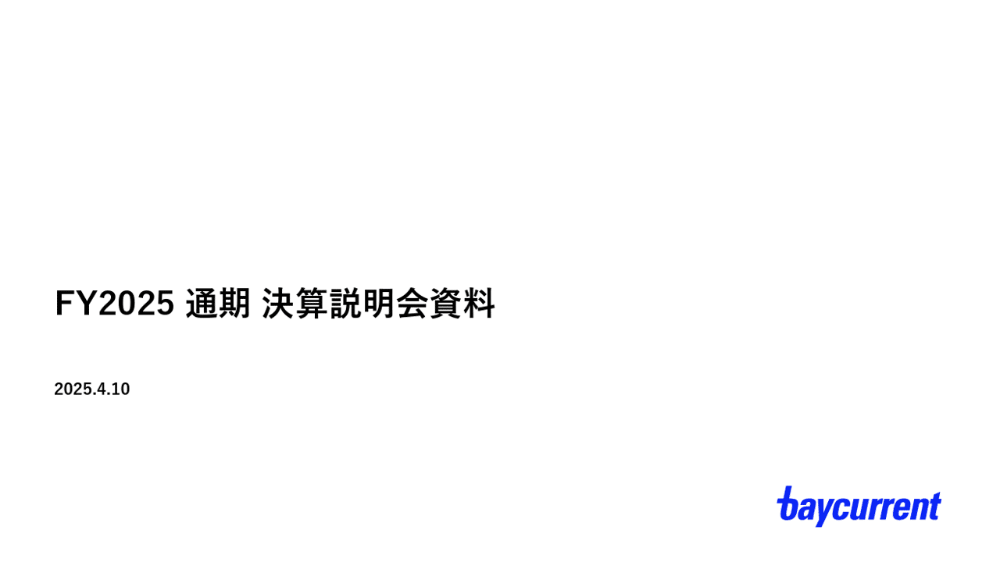
> 引用元：[> 2025年2月期通期 決算説明会資料](https://ssl4.eir-parts.net/doc/6532/tdnet/2591766/00.pdf)

*https://www.baycurrent.co.jp/ir/*

### 経営目標のスライド

まずは中期経営計画の数値目標のスライドを見てみましょう。
**グレーとブラウンのシックなデザインで、売上の棒グラフの中にEBITDAの割合を示すようなグラフ**にしています。
スライドの構成としては、左上にタイトル、その下のメッセージがスライドボディの解説、下にメインメッセージとなっています。

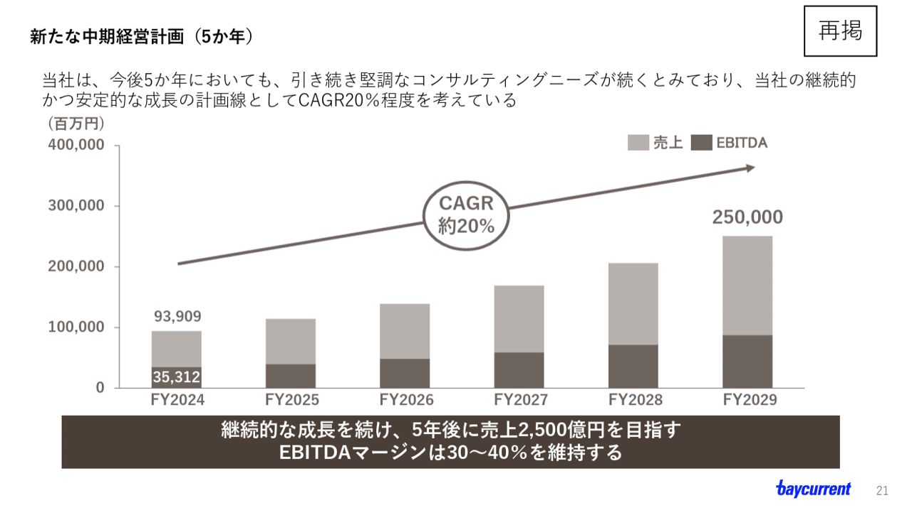
続いて数値目標の前提条件のスライドです。スライド構成は大きく変わらずですが、**詳細ページなのでテキスト多めで、下メッセージもありません**。
ボディは左側にテキスト、右側にイメージという構成です。

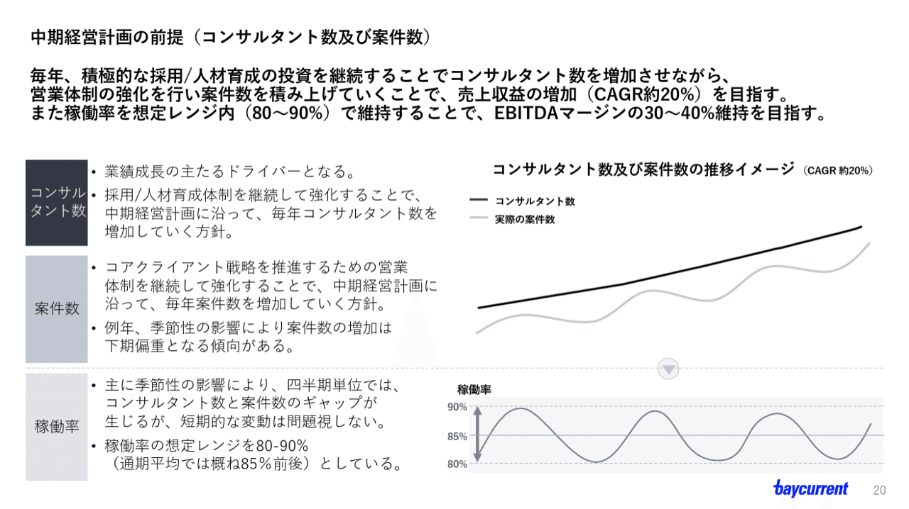

### 成長戦略のスライド

次に成長戦略のスライドを見ていきましょう。
大枠の構成は変わらず、ボディの部分は左右２分割で、左側に３つの施策カテゴリ、右側に３つの施策の詳細を箇条書きとなっています。
詳細についても、**１段目を太字、その下に２段目３段目と構造化する、重要なポイントを太字と別に赤字で記載する**など、コンサルファームの資料の基本を押さえたスライドになっています。

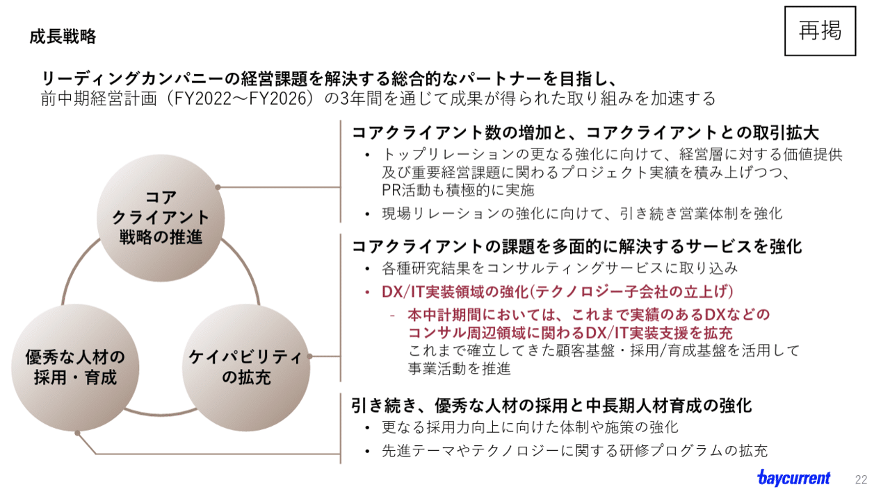

### 経営目標に対する進捗のスライド

最後に経営目標に対する進捗のスライドです。
ボディの部分がさらに上下に分かれており、上に売上とEBITDAの2025年実績と2026年予想、下に具体な取り組みを記載しています。
**具体な取り組みがテキストベースで分量が多く、左右のレイアウトにすると３行以上になってしまう**ことから、こうしたレイアウトを取っているものと推測されます。

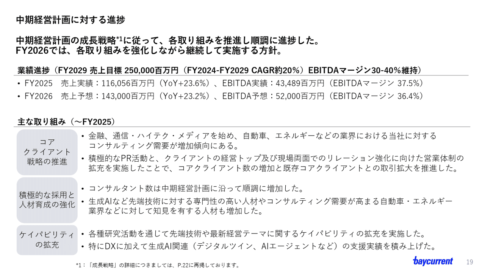
ベイカレント・コンサルティングでは、ITコンサルタント以外にも、経営コンサルタントや経理財務コンサルタントも募集しています。
詳細を知りたい方は、[**レックスアドバイザーズの無料転職サポート**](https://www.career-adv.jp/job_search/entryform_exp/)をご利用ください。

## 株式会社ノースサンド

続いて株式会社ノースサンドのパワポスライドを見てみましょう。
ノースサンドは先ほど紹介したベイカレントの出身者が2015年に設立し、2025年に東証グロースに上場しました。
IR資料は従来的なコンサルティングファームとは一線を画す、（芸人の田津原理音さんのような）緩めのイラストが中心の遊び心あるデザインとなっています。**人間力重視という独自のポジショニングが十二分に伝わる**資料です。

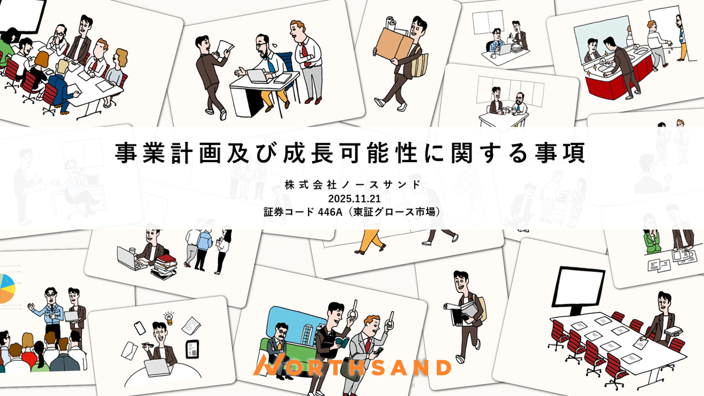
> 引用元：[> 「事業計画及び成長可能性に関する事項」の差替えについて](https://contents.xj-storage.jp/xcontents/AS83453/04a57b47/8e2b/4bf0/8809/9ef24e1ac56c/140120251121507883.pdf)

*https://northsand.co.jp/ir/ir-news/*

ポジショニングの独自性の高さや一風変わったスライドデザインから、パワポ研のXへの投稿にも多くの反応があり、注目度の高さが感じられます。

> 先日上場したノースサンドの事業計画及び成長可能性に関する事項の資料です。ベイカレント出身者が設立したITコンサルですね。
> イラストが多い「コンサルらしからぬ」資料ですが、目を引くだけでなく、人間力重視のファームというポジショニングが一目で伝わるよい資料です。[> https://t.co/7MyIxfH35e](https://t.co/7MyIxfH35e)>  [> pic.twitter.com/hVGS4zxWZs](https://t.co/hVGS4zxWZs)

> — パワポ研｜ビジネス×デザイン (@powerpoint_jp) [> November 26, 2025](https://twitter.com/powerpoint_jp/status/1993821174619599120?ref_src=twsrc%5Etfw)

### 企業紹介のスライド

まずは企業紹介の創業ストーリーのスライドを見てみましょう。**一般的なコンサルティングファームとの比較というフォーマット**で、自社の独自性をアピールしています。ベージュの背景も柔らかい印象で、人間力重視のコンサルティングファームというメッセージと合っています。
構成としては、左上にスライドタイトル、その下にスライドメッセージ、そしてボディとなっています。**表の後ろにイラストを入れるのはなかなか見ない斬新なデザイン**です。

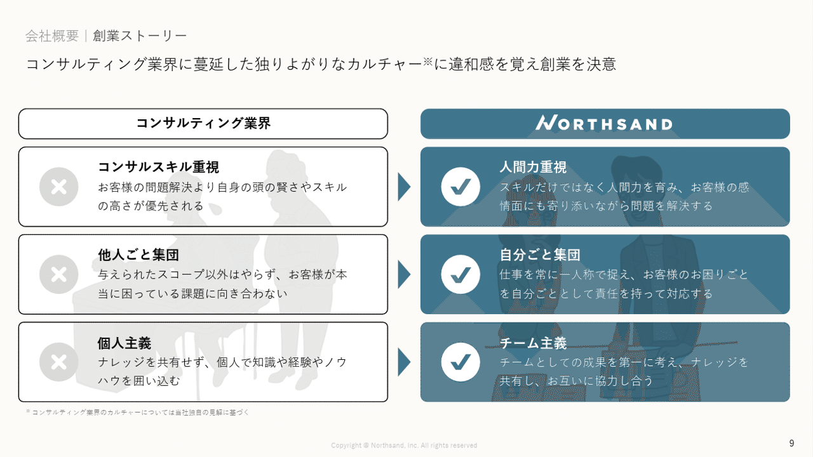
こちらも同様に競合他社との比較のフォーマットです。ノースサンドがより人にフォーカスをしつつ、競合他社がフォーカスしているスキルももちろん見ているよ、というスライドです。
当然賛否両論あるスライドですが、後発でここまで伸びてきているファームであり、**賛否両論あるくらいのメッセージを出す方が内外のブランディングとしては有効**だと考えられます。

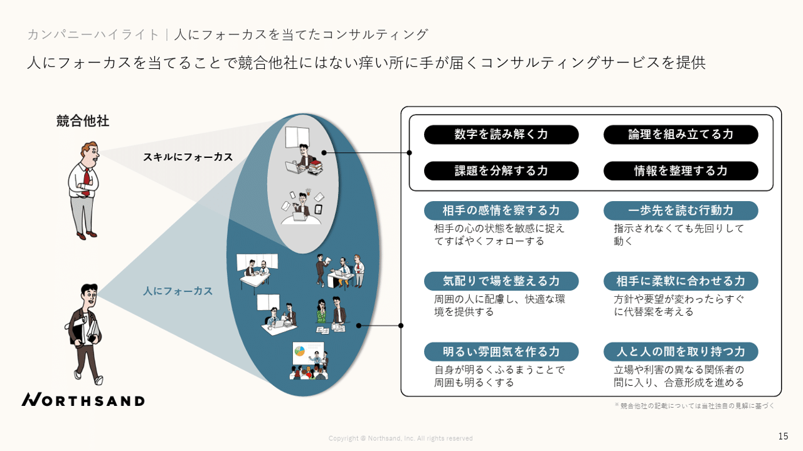

### 成長戦略のスライド

続いて成長戦略のスライドです。
構造は変わらず、ボディをしっかり読ませるスライドですね。コンサルタントに対するフォローの手厚さを４つの悩みという観点から整理しています。
**より細かく書くというよりはコンセプチュアルに見せる**ことを重視していますね。

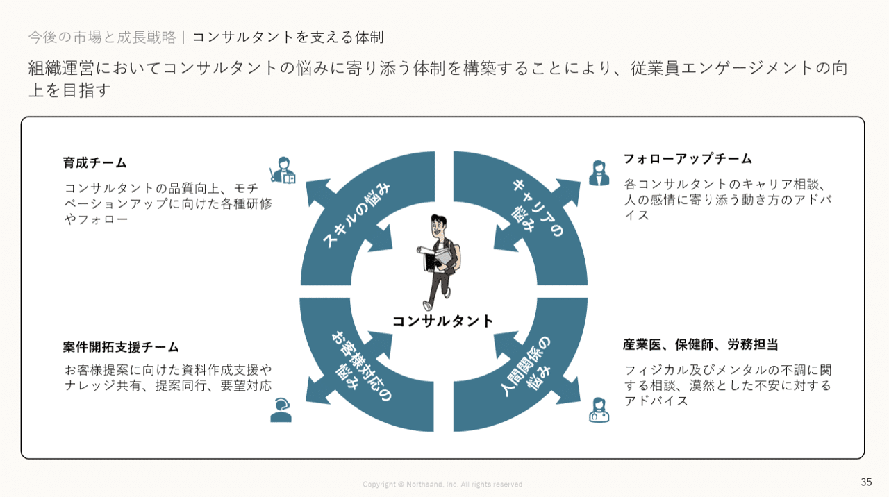

### 競争優位性のスライド

最後に競争優位性のスライドです。
ボディは紙面を３分割し、コンセプト、具体的な活動、期待できる効果という構造になっています。これまでのスライド同様、薄いベージュの背景に白いボックスと濃い緑のボックスの組み合わせも独特でよいですね。

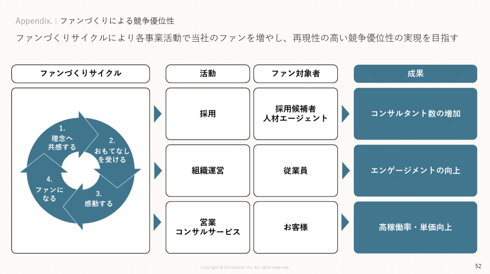

## フューチャー株式会社

続いてフューチャー株式会社のパワポスライドです。
フューチャーは1989年にフューチャーシステムコンサルティングとして創業後、2002年には東証1部に上場しました。2007年にフューチャーアーキテクトへと社名を変更し、その後に持ち株会社のフューチャーを設立、2024年には再生ファームのリヴァンプを経営統合しています。

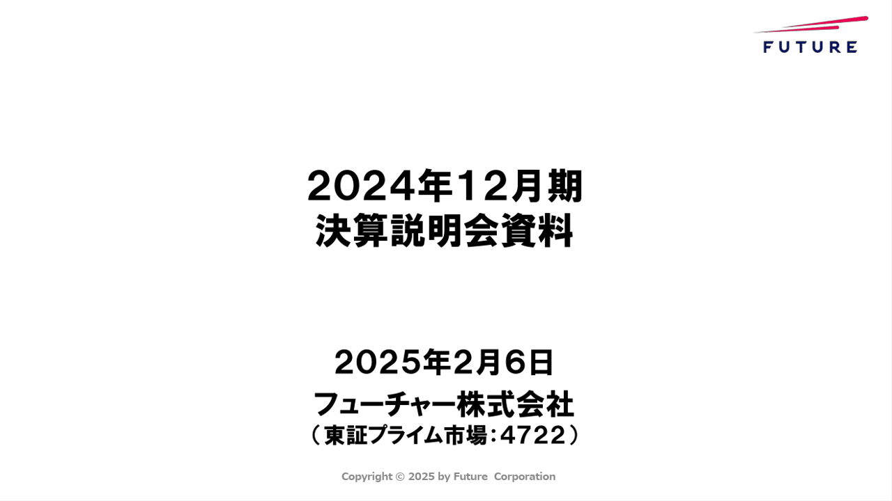
> 引用元：[> 2024年12月期　決算説明会プレゼンテーション資料](https://contents.xj-storage.jp/xcontents/AS70739/5798054f/ee5b/4d7f/9d8d/7ee70ae8312a/20250225131840453s.pdf)

*https://www.future.co.jp/investor_relations/ir_library/*

### 市場認識のスライド

まずは市場認識のスライドから見ていきましょう。
構成としては、**左上にメッセージがあり、すぐ下にボディがあるというシンプルなもの**になっています。
市場における需要が旺盛であることを、実際のクライアントのロゴを大量に見せながら示しています。歴史があり有名なクライアントを多数抱えている場合、ロゴの物量で圧倒するというのは一つの手段ですね。

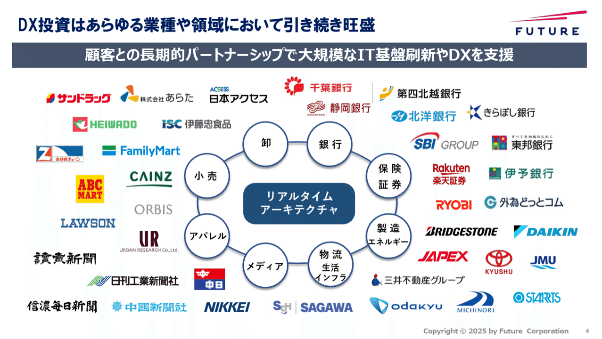

### 企業紹介のスライド

事業の全体像をビジュアルで見せているスライドです。
構成は先ほどと変わって、スライドタイトルがあり、その下に白抜きのメッセージがあり、ボディという構造です。ボディはフューチャー社が展開している５領域を円で見せています。**全方位的にサービスを展開しており詳細を１枚では説明しきれない中で全体感を見せる手法**ですね。

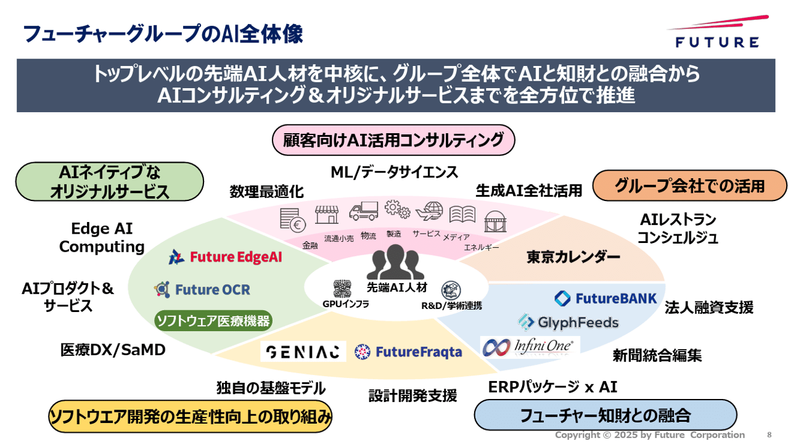

### 経営統合のスライド

リヴァンプとの経営統合について、進捗をまとめたスライドです。
構成は先ほどの資料と同じです。ボディについては、領域を「経営管理の統合と強化」「人材交流・融合」「品質向上・テクノロジー活用」の３つに分けたうえで、その詳細を記載しています。
**より重要なものを左上に置くと同時に、そこからの重要度に応じて背景色をグラデーションで変えるデザイン**はおもしろいので、覚えておいてもよいでしょう。

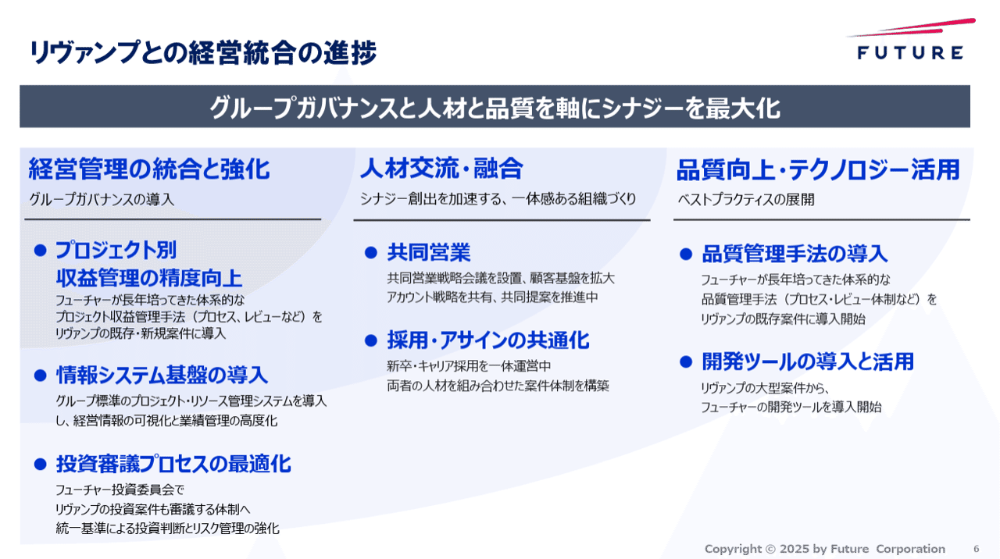
また狙っていくシナジーについて、実現している協業実績を具体的に書いていくことで、より成長の機会があることを見せています。

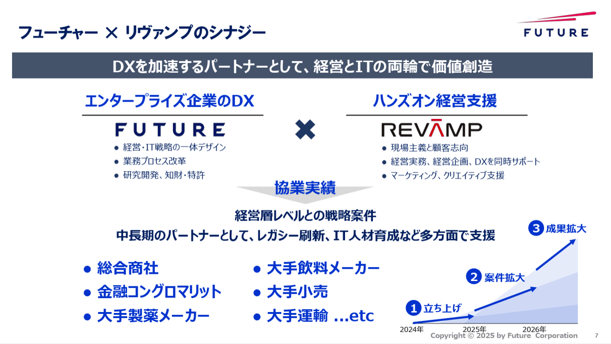

## シンプレクス・ホールディングス株式会社

続いてシンプレクス・ホールディングス株式会社のパワポスライドです。
ベイカレントは1997年に創業し、2002年にJASDAQ上場、2004年に東証２部に鞍替え、2005年に東証１部に鞍替えしました。その後2013年のMBOを経て非上場化し、2021年に東証1部に再上場しました。

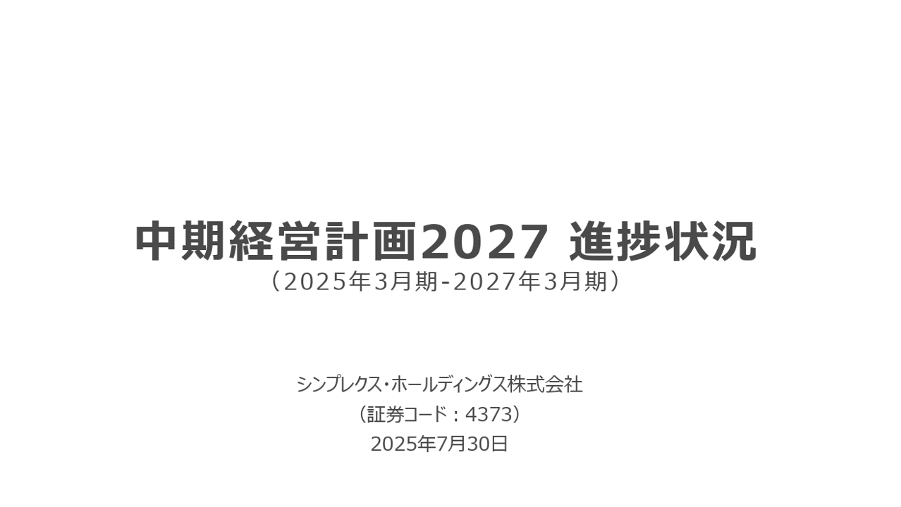
> 引用元：[> 中期経営計画2027 進捗状況（2025年7月）](https://ssl4.eir-parts.net/doc/4373/ir_material3/257400/00.pdf)

*https://www.simplex.holdings/ir/news/*

### 市場認識のスライド

まず市場認識のスライドから見ていきましょう。
構成としては、左上にチャプターとタイトル、その下にスライドメッセージ、そしてボディという構造になっています。
ボディについては、顧客と自社の位置するIT業界とコンサル業界について、業界として直面している課題をテキストで整理しています。

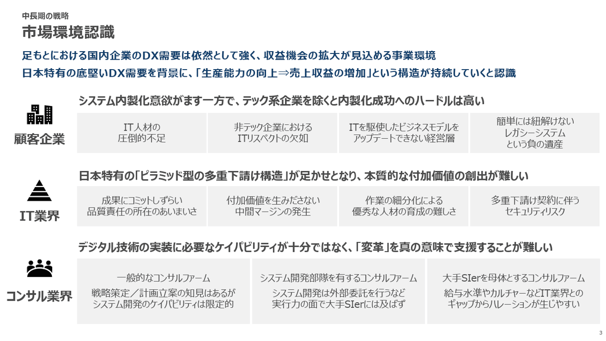

### 成長戦略のスライド

続いて成長戦略のスライドです。
**顧客のカウンターパートを経営、ITのユーザー部門、ITシステム部門に分け、どのように対応していくか**を記載しています。経営コンサルまで行えるクロスピアが経営課題に切り込み、ITコンサルティングニーズにつなげていくという戦略が記載されています。

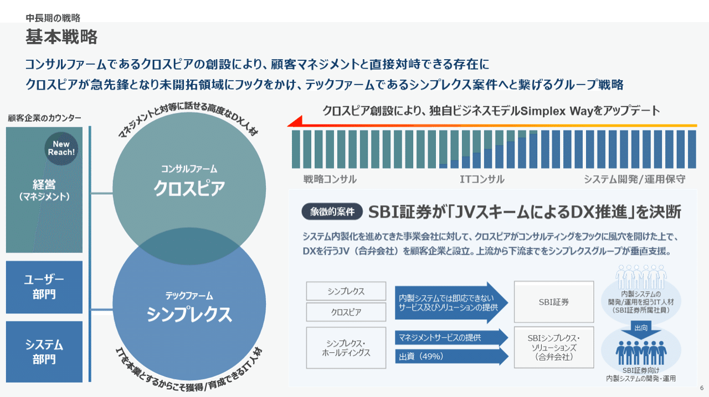
DX支援において、コンサルティングファームであるクロスピアと、テックファームであるシンプレクスがどのようにシナジーを生み出すかを整理しています。
クロスピアのコンサルティングの中で、ITコンサルティングは金融のポーションが大きいものの、他の領域はまだまだ金融が過半ではなく、**シンプレクスの強みが活かせるということを定量的に示して**います。

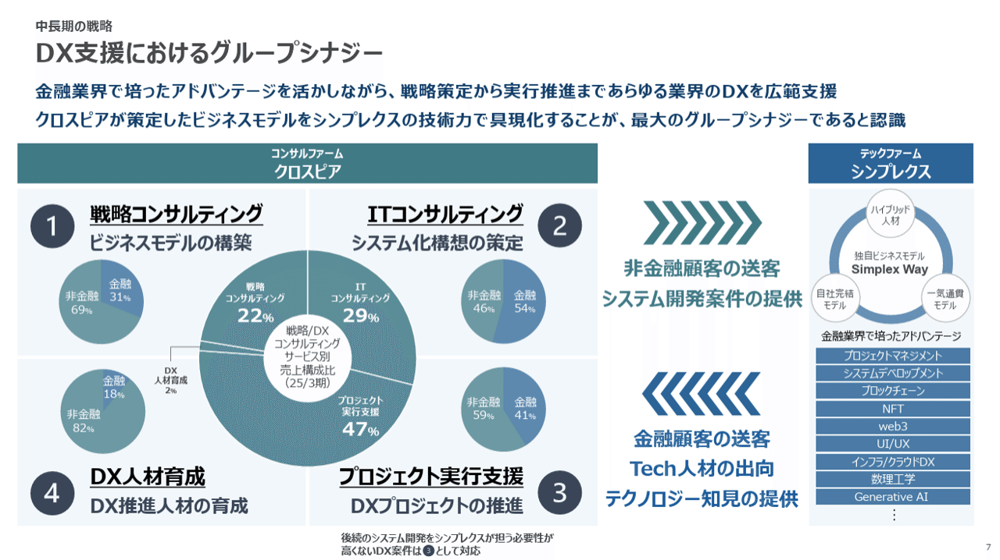

### 経営目標のスライド

最後に経営目標のスライドです。
構成は大きくは変わりませんが、メインで見せたいボディの散布図が大きいため、メッセージなどは最小限になっています。
営業利益額と営業利益率のマトリックスの散布図で、自社と競合をプロットしています。その中でVision1000の達成時に自社のポジションをどこまで押し上げるかを見せています。

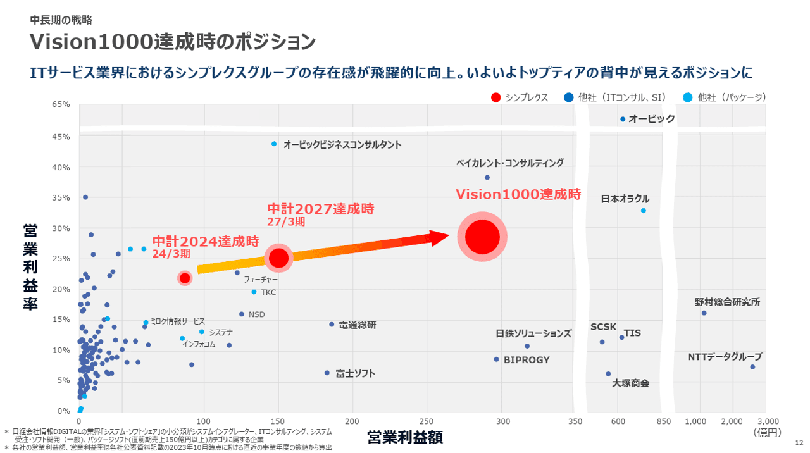

## 株式会社エル・ティー・エス

最後は株式会社エル・ティー・エスのパワポスライドです。
LTSは2002年に創業されたITコンサルティングファーム、2017年に東証マザーズに上場、2020年に東証1部に鞍替えしました。プライムの上場基準である、流動株式総額の100億円に向けて色々と試行錯誤されており、読みごたえのある資料となっています。

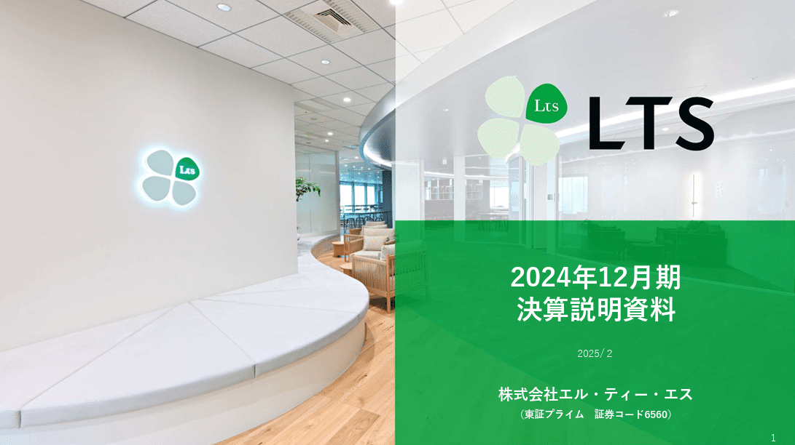
> 引用元：[> 2024年12月期　決算説明資料](https://contents.xj-storage.jp/xcontents/AS95010a/710d934b/06af/4a8f/9f2f/adb6f51b0e68/140120250209567470.pdf)

*https://lt-s.jp/ir/library*

### 市場認識のスライド

まずは市場認識のスライドです。
構成としては、左上にスライドタイトル、その下に箇条書きのスライドメッセージ、そしてボディとなっています。
日本企業のDXの進展や取り組み度合いについて、**円グラフや折れ線グラフで定量的に示して**います。取り組み内容については**デジタル化の度合いで左から右へ流れている構図でわかりやすい構造**となっています。

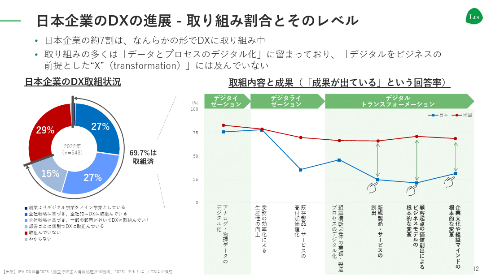
コンサルティングに求められる価値について、時代の変遷とともに変わってきたことを示すスライドです。
2020年以降、コンサルティングファームもパートナーとしてクライアントの変革にコミットしてきたということが、**フローやラベルでわかりやすく記載**されています。構成は変わらず、フロー型のボディに箇条書きでテキストが入っています。

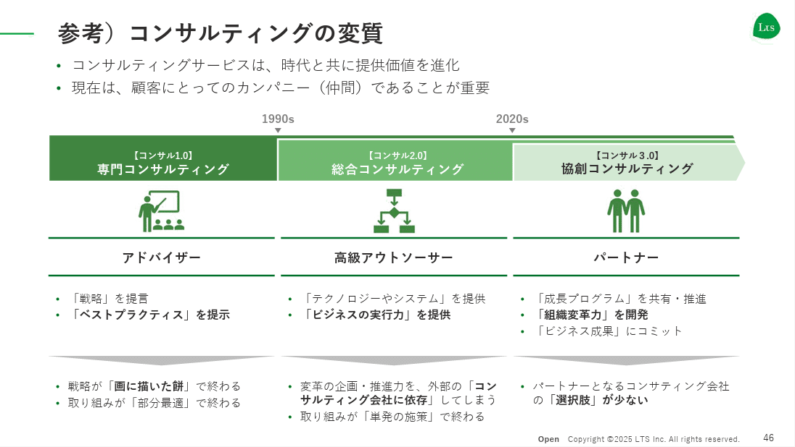

### 企業紹介のスライド

続いて企業のポジショニングに関するスライドです。
プロジェクト規模とサービスモデルのマトリックスに対して、LTSがどのようなポジションを取っていて、どの領域に拡張しようと考えているのかが整理されています。
**９つのブロックに分けられたマトリックスですが、それぞれのセルの間にある見えない壁を赤文字**で記載しています。

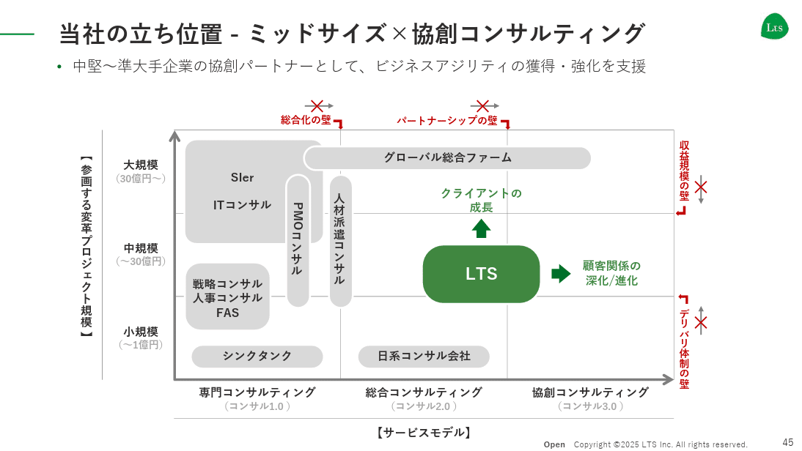

### 競争優位性のスライド

最後に競争優位性のスライドです。
LTSが共創パートナーというポジションを取っていることで、事業会社の変革推進を支援する際に優位性があるということを示しています。
**フローをかなり具体に書くことで、その全体を支援できることをよりビビッドに見せる**ことができています。

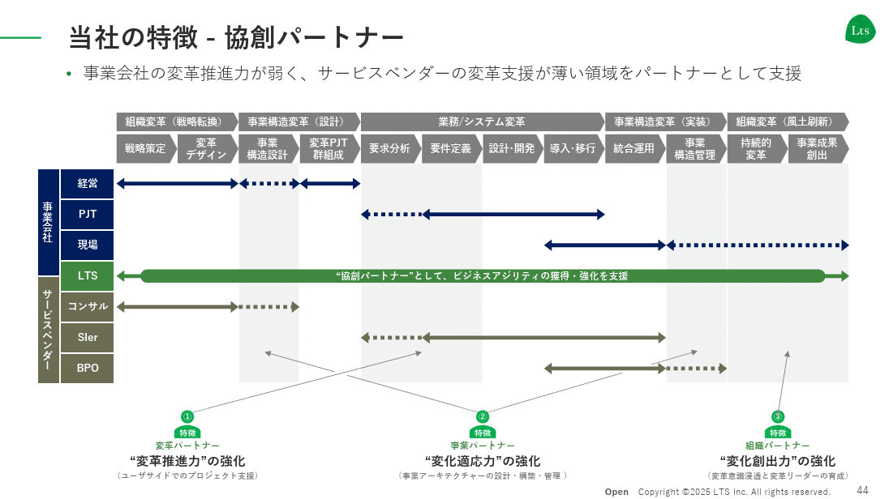

## 上場しているITコンサルファームのスライド資料まとめ

いかがでしたでしょうか。ITコンサルファームの資料を見ていきましたが、IR資料のため、なかなか提案書のようなよりビジネス寄りの資料は見つかりませんでした。
とはいえノースサンドを筆頭に、各社とも自社の強みやフェーズによって大分トンマナが違ったので、是非それぞれ応用できる部分を見つけて、自社の資料作成に役立てていただければと思います。

## 経営コンサルへの転職を考えている方へ

パワポ研は株式会社レックスアドバイザーズが運営しています。
**レックスアドバイザーズは会計ファームを中心に経営コンサルティング会社への転職支援に強みを持つ転職エージェント**です。ベイカレント・コンサルティングなど、IT系の経営コンサルティングファームへの転職も支援していますので、転職を考えている方は、[無料相談フォーム](https://www.career-adv.jp/job_search/entryform_exp/?utm_source=note&utm_medium=referral&utm_campaign=note_pp)から相談してみてくださいね。

*レックスアドバイザーズのサービスサイトはこちら*

## パワポ研オリジナルテンプレート

パワポ研では「ビジネスシーンで使える」パワーポイントテンプレートを公開しております。デザインを整えるのみならず、**ロジックやストーリーを整理するのにも役立つパッケージになっております**ので、関心のある方は下記ページも併せてご覧ください！

[
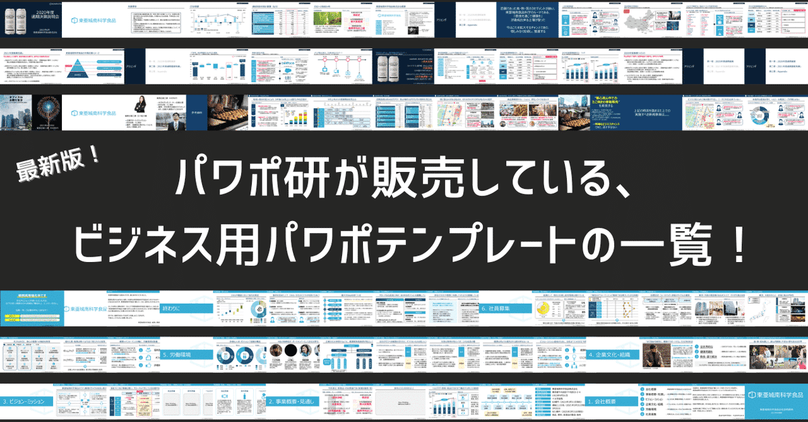
](https://note.com/powerpoint_jp/n/n7300a1293e8e)またパワポ研では、上記の記事のように、noteでは**フォローしているだけでビジネスにおける「資料作成のコツ」と「デザインのセンス」が身に付くアカウント**を目指して情報配信を行っています。
今後もコンスタントに記事を配信していく予定なので、関心のある方は是非アカウントのフォローをお願いします！

**> Template販売　**[> https://powerpointjp.stores.jp/](https://powerpointjp.stores.jp/%EF%BF%BCnote)
**> note　**[> パワポ研の資料作成術](https://note.com/powerpoint_jp/m/mc291407396da)
**> X（旧Twitter)　**[> https://twitter.com/powerpoint_jp](https://twitter.com/powerpoint_jp)
**> その他　**[> お問い合わせフォーム](https://www.rex-adv.co.jp/contact)
**> 書籍　**[> 注目企業の実例から学ぶパワポ作成術](https://www.amazon.co.jp/dp/4046060476)

