# 【マネしたい】カッコいい「モノクロ」プレゼン３選 （2025年更新）

[note原文](https://note.com/powerpoint_jp/n/nd49ff920f465)

みなさんこんにちは。
資料デザインのリサーチや分析に取り組むパワーポイントのスペシャリスト、パワポ研です。

今回は**モノクロのパワポ、特にグレースケールで作成されたパワポに焦点を当て、上場企業のIR資料から参考になりそうな抜粋して紹介**していきます。カラーコードについても記載していきますので、見栄えの良い色や配色について、パワポ作成の参考になれば幸いです。

【マネしたい】シリーズのまとめ記事はこちら。

では早速行きましょう！

## モノクロのイラストが映えるスライド見本

まずはHENNGE株式会社の事業計画及び成長可能性に関する事項のパワーポイントを見ていきましょう。**全体的にイラストやアイコンを多用しており、モノクロながら親しみやすいデザイン**となっています。

同社の資料は一部を除いてほぼすべてのスライドが、グレースケールだけで作成されています。**わかりやすい資料に色は必要ないということが理解できるほど完成度の高い資料**となっていますので、是非パワーポイント全体を参照してみて下さい。

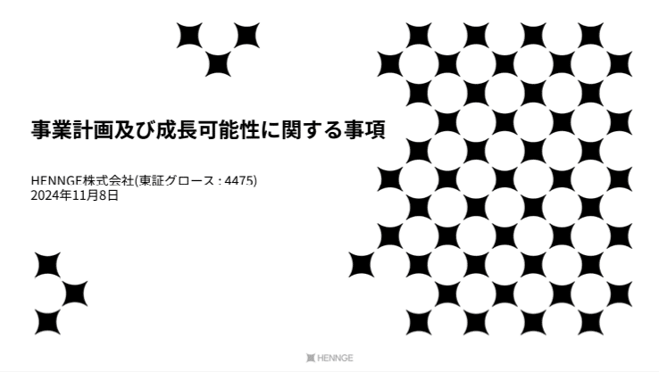
> 引用元：[**> 決算説明資料**](https://contents.xj-storage.jp/xcontents/AS92184/b6d1eff3/fba7/4fa6/8555/d13d6fb46b0e/140120241105511681.pdf)

*https://hennge.com/jp/ir/library/*

- 黒：カラーコード#000000、rgb（0,0,0）

- グレー：カラーコード#b7b7b7、rgb（183,183,183）

### パワポのグラフはモノクロのデザイン

HENNGE社のパワポの特徴として、とにかく色の少なさが挙げられます。**グレースケールの中でもグラデーションは限定的**で、黒とグレーの2色だけで構成されたスライドも多くあります。パワポ全体を通して文字の色は黒になっています。

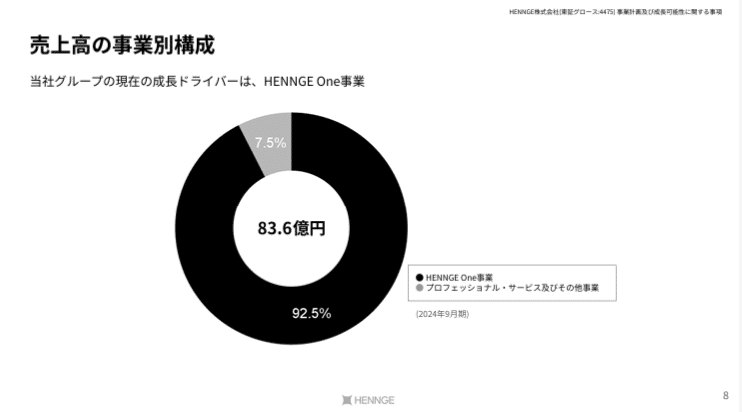

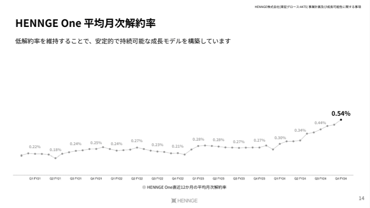

### イラストを使った親しみやすいデザイン

HENNGE社のパワポの特徴の一つが、**イラストやアイコンを多用することで、モノクロでも淡泊になりすぎないように工夫**していることです。イラストやアイコン以外に画像や写真も入れていますが、画像や写真はさすがにモノクロにはしていないようです。

イラストやアイコン、写真や画像を使うページにおいては、グレーは使わずに黒だけを使うことで、写真に色などがついている場合でも、**色数が最小限になるよう**に工夫しています。

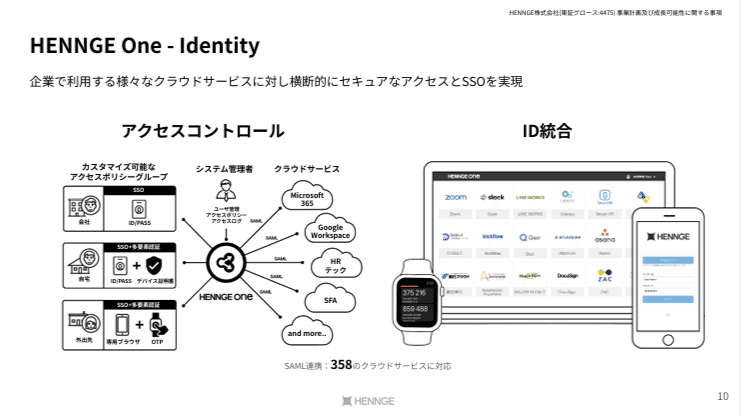

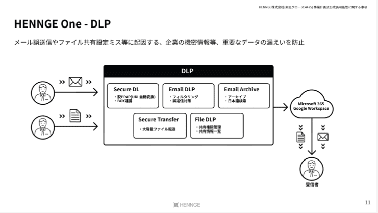

### グレースケールの黒で強調するデザイン

数値や強みのパワポにおいて、強調表現をする際は、グレースケールの黒を使って表現しています。例えば**グレースケールの表において黒の枠線を使う**ことで見せたい数値を強調したり、**旧組織をグレーに新組織を黒にする**ことで差分を強調したりといったことをしています。

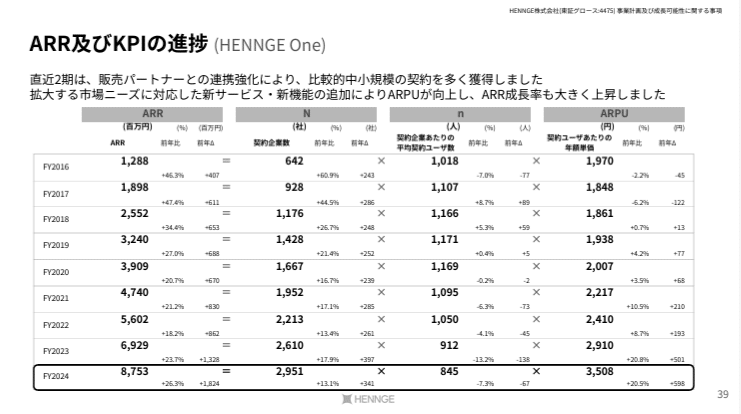

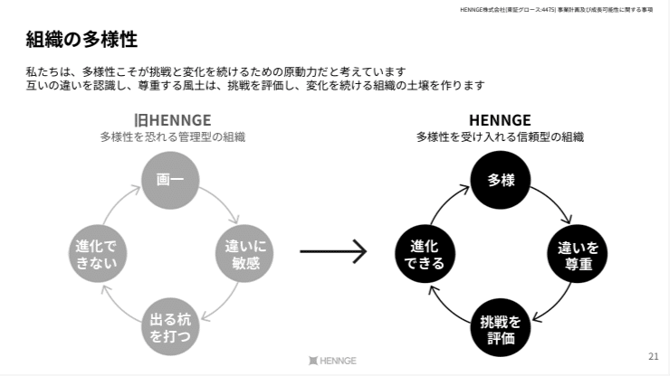

### グレーに合う色として赤をチョイス

HENNGE社の資料は基本グレースケールですが、一部のスライドにおいては色が使われています。そうしたスライドでは、グレーに合う色として濃い目の赤をチョイスしています。**パワポ全体がシックな仕上がりなので、グレーにも濃い色の方が合う**わけですね。

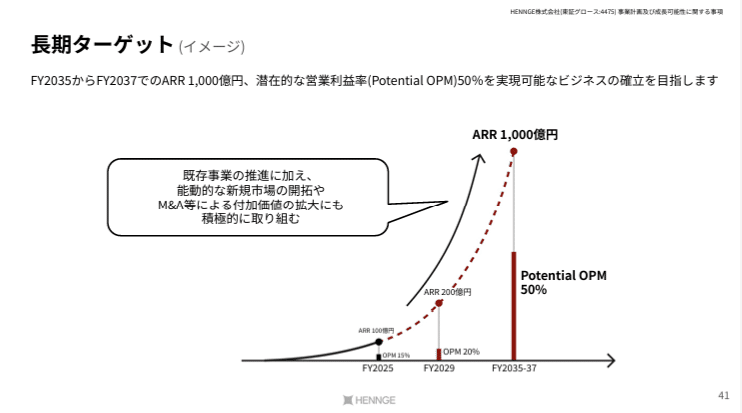

## グレースケールが抜群にうまいスライド見本

続いて株式会社クラシコムのパワーポイントを見ていきましょう。特徴としてはグレースケールの使い方が非常にうまいです。モノクロでもここまで見やすくできるのかという意味で感動に値するパワポですね。

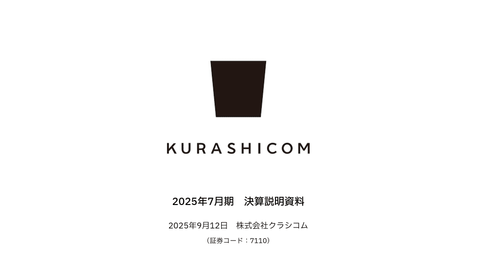
> 引用元：[> 2025年７月期 決算補足説明資料](https://contents.xj-storage.jp/xcontents/AS04874/f903e285/c3cb/4a76/8e65/88e326a37faa/140120250908554462.pdf)

*https://kurashi.com/ir/library/results*

- 文字色のグレー：カラーコード#454545、rgb（69,69,69）

- 濃いグレー：カラーコード#666666、rgb（102,102,102）

- グレー：カラーコード#999999、rgb（153,153,153）

- 薄いグレー：カラーコード#d9d9d9、rgb（217,217,217）

### グレースケールをフル活用したデザイン

まずはグラフスライドや、中期成長戦略のスライドを見ていきましょう。パワーポイント全体の中でも比較的情報量が多めのスライドですよね。
こうしたスライドにおいても、**モノクロのグレースケールの濃淡のみ**でグラフの内訳を示したり、それ以外の情報を付加したりしており、レベルの高いパワポです。

またポイントとして、**スライドタイトルの下のボディ部分には、本当に薄いグレーの背景**を入れています。こうした細かい工夫も、グレースケールのみでスライドを成り立たせることに貢献していますね。

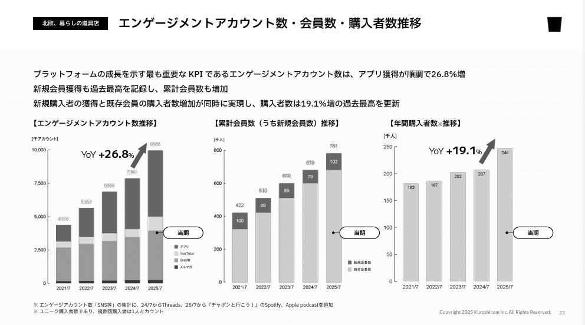

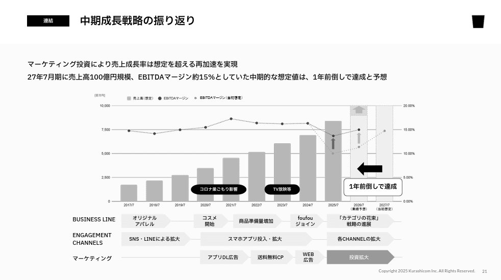

### 枠線でグレースケールが際立つデザイン

クラシコムのパワポの特徴として、枠線の使い方のうまさも挙げられます。表において濃いグレーの枠線を使うのはグレースケールのパワポの基本ですが、**市場規模のスライドでは逆に枠線を白にする**ことですっきりしたデザインに仕上げています。

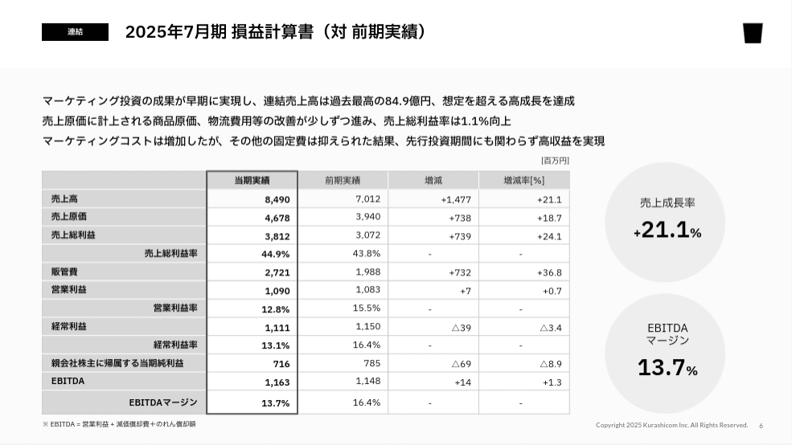

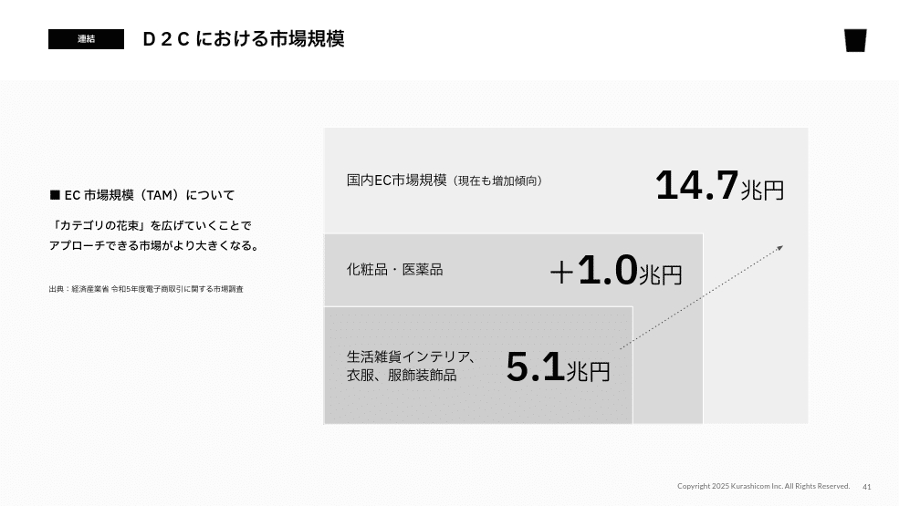

### グレーの文字色でなじみやすいデザイン

クラシコム社のパワポが見やすい理由として、**文字色にグレーを使っている**ことが挙げられます。グレースケールのパワポではグラフに薄いグレーを使うこともあるので、そうした場合の数値などは文字色をグレーにして見やすくするわけですね。

また表の場合は、見せたい数値との補足の数値がありますが、**見せたい数値の文字色を黒で、補足数値の文字色をグレーにする**ことで、グレースケールの中でも見せたい部分の強弱を見せられます。

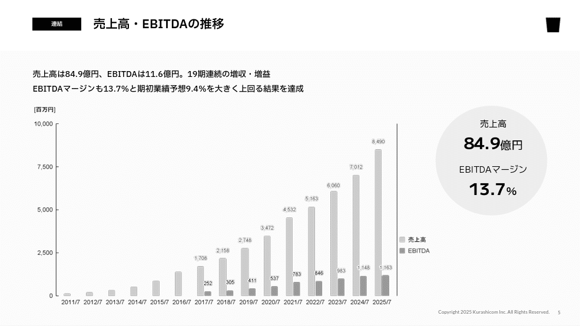

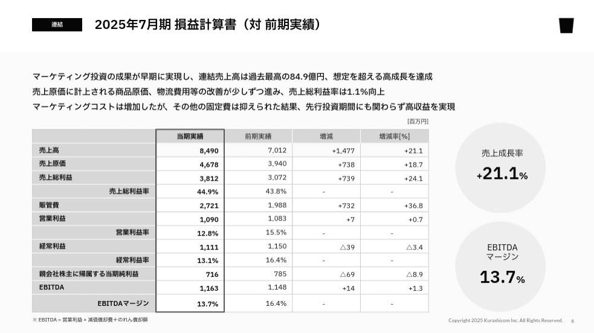

### コンセプトはイラストや画像でデザイン

パワポの中でもコンセプトや戦略を示すスライドにおいては、イラストが登場しますが、**イラストもモノクロのグレースケールで作成**されています。花束をグレースケールで表現するのは中々ハードルが高いですが、インパクトのあるスライドに仕上がっています。
画像に関してはさすがにモノクロだと見づらいということなのか、そのままパワポに差し込んでいますね。

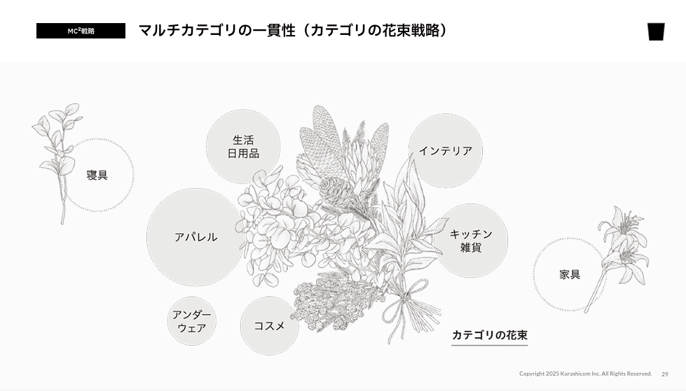

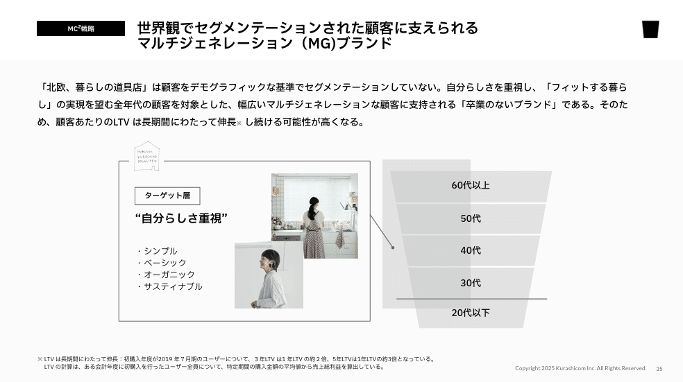

## モノクロのグレーに１色足したスライド見本

最後は円谷フィールズホールディングス株式会社のパワーポイントを見ていきましょう。ウルトラマンがたくさん出てくるかと思いきや全くそんなことはありませんが、ウルトラマンを思い出すグレーの背景を中心としたパワポです。

**基本はグレースケールで構成されていますが、タイトル等に一部だけ差し色として青**を合わせています。グレーに合う色は多くありますが、赤や青といった基本的な色はその中でもよく合うので、グレースケールのパワポによく使われるわけですね。

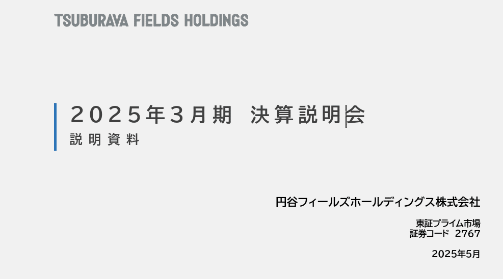
> 引用元：[> 決算説明資料](https://www.tsuburaya-fields.co.jp/ir/j/files/press/2025/press_20250514b.pdf)

*https://www.tsuburaya-fields.co.jp/ir/j/library/presentation/*

- 文字色：カラーコード#101010、rgb（16,16,16）

- 濃いグレー：カラーコード#585858、rgb（88,88,88）

- グレー：カラーコード#d9d9d9、rgb（217,217,217）

- 青色：カラーコード#2d75b6、rgb（45,117,182）

### グレーに合う青色を差し込んだデザイン

円谷フィールディングスのパワポにおいては、モノクロのグレースケールのスライドに対し、タイトル部分に青色を入れていますが、**数字のスライド等における補色としても一部青色を使って**います。

ただし青色は、決算情報の通期予想に使うなど、強調したい数字というよりは補足的な数字の方に使われており、モノクロ疲れ、グレースケール疲れを防ぐためのアクセントとして使われている印象を受けます。青はグレーに合う色ですが、全体を少し明るくする効果がありますね。

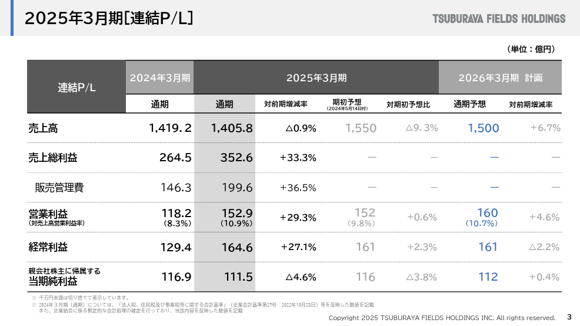

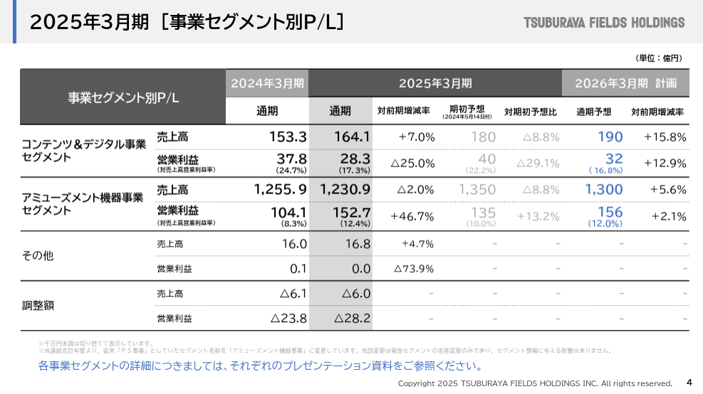

### グレーの枠線でパワポを締めるデザイン

また円谷フィールズ社のパワポの特徴として、**グレーの枠線が比較的太い**ことが挙げられます。グレーの枠線を太くすると、はっきりくっきり見えるようになる代わりにパワポの圧が強めになります。
青色を差し色として入れる効果として、圧が強くなりすぎないようにしているともいえるのではないでしょうか。

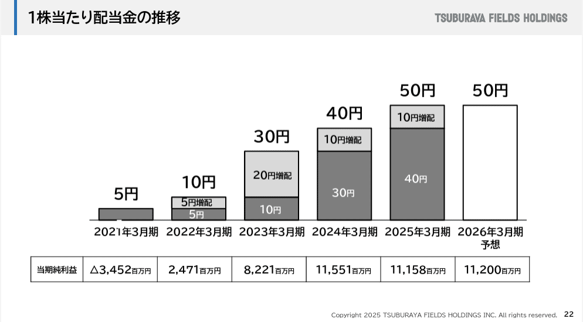

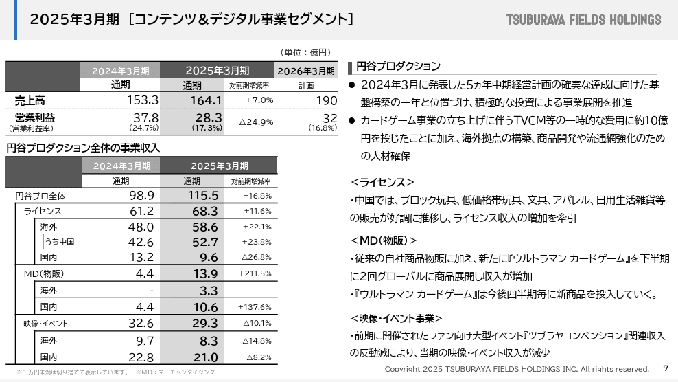

## パワポのグレースケール化の方法

最後におまけとして、パワポでグレースケールを使う方法についても簡単に説明しておきますね。

### スライドをグレースケール化する方法

パワポをグレースケール化するには、まずタブの表示を開いて、その中にあるグレースケールというボタンを押します。

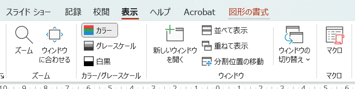
そうすると、グレースケールのタイプが出てきます。

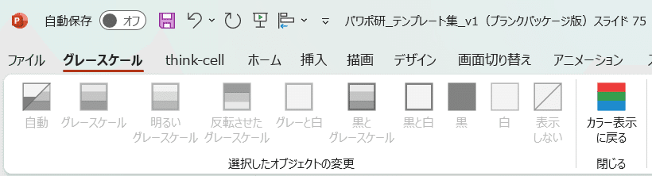
そこから、いくつかのパターンを試して、一番合うものを選びます。ここではパワポ研のテンプレート週のスライドを例にとってグレースケール化して見ます。

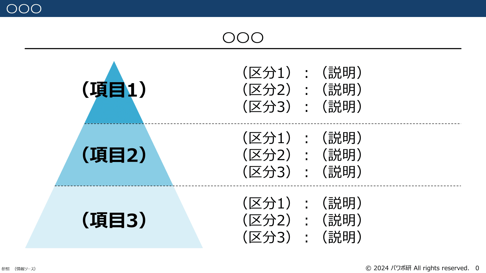
*カラーのスライド*

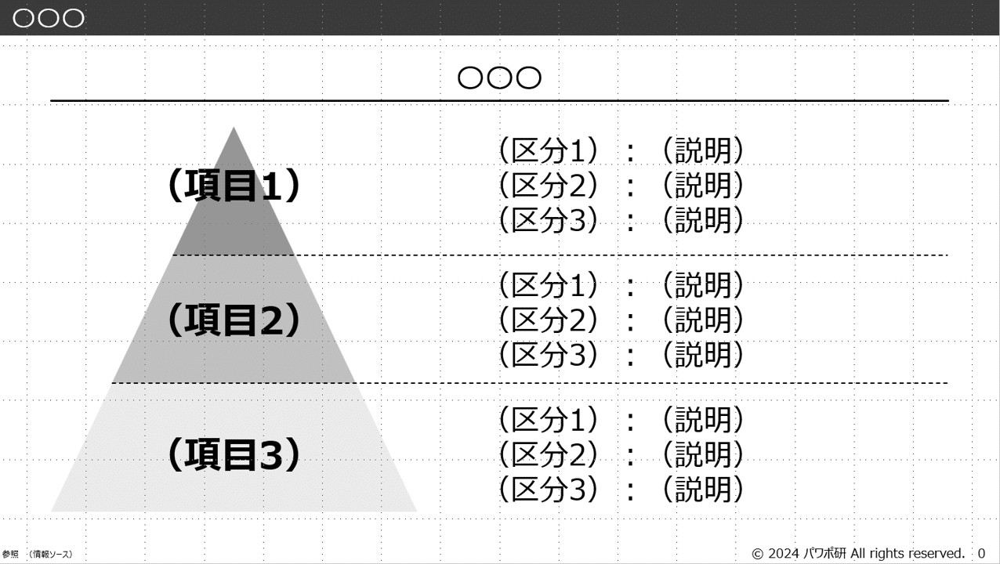
*グレースケールのスライド*

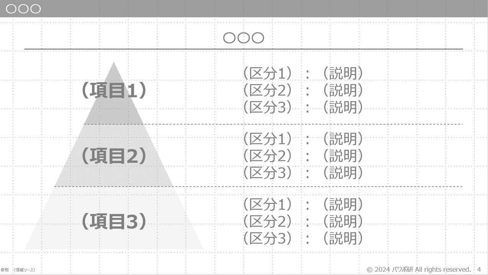
*明るいグレースケールのスライド*

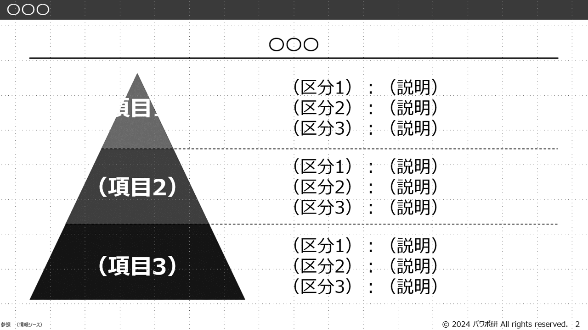
*反転グレースケールのスライド*

### 画像をグレースケール化する方法

画像についても基本は同じです。ここではパワポ研の新規事業計画資料テンプレートを使ってみましょう。

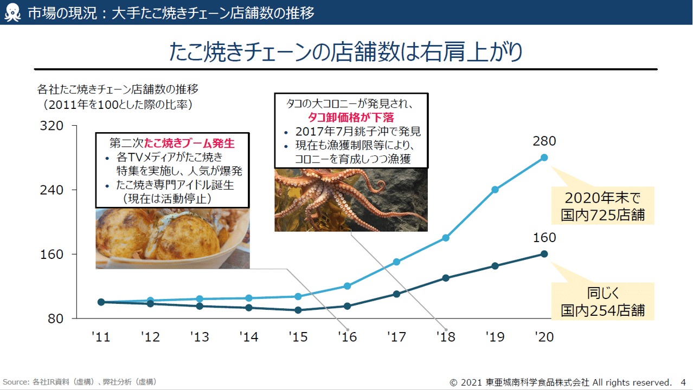
*カラーのスライド*

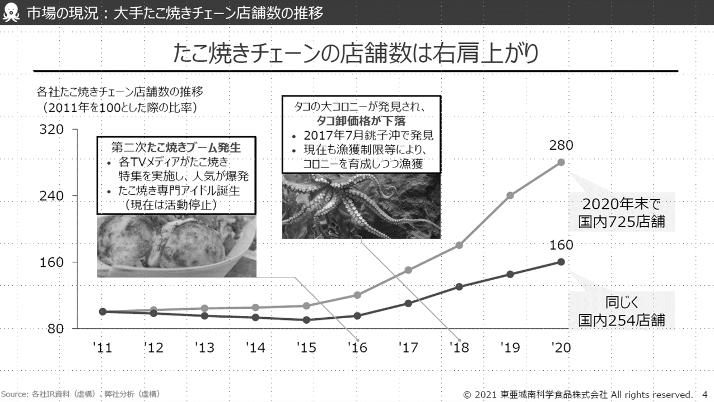
*グレースケールのスライド*

## 【マネしたい】カッコいい「モノクロ」プレゼン３選まとめ

いかがでしたでしょうか。色を使わないモノクロのグレースケールのパワポでも、十分におしゃれなプレゼンテーションが可能なことが伝わったのではないかと思います。
またその際のポイントとして、**グレースケールの枠線の活用や、グレーの文字色の活用、モノクロのイラストやアイコンの活用**などによって、見やすいスライドになるということもわかりました。
グレーに合う色としては、基本的にどんな色でも合うものの、**モノクロのグレースケールに合わせる際は、落ち着いた濃い目の色だと全体がシックに締まる**ということもわかりました。

## パワポ研オリジナルテンプレート

パワポ研では「ビジネスシーンで使える」パワーポイントテンプレートを公開しております。デザインを整えるのみならず、**ロジックやストーリーを整理するのにも役立つパッケージ**になっておりますので、関心のある方は下記ページも併せてご覧ください！

上記の記事のように、noteでは**フォローしているだけでビジネスにおける「資料作成のコツ」と「デザインのセンス」が身に付くアカウント**を目指して情報配信を行っています。
今後もコンスタントに記事を配信していく予定なので、関心のある方は是非アカウントのフォローをお願いします！

**> Template販売　**[> https://powerpointjp.stores.jp/](https://powerpointjp.stores.jp/%EF%BF%BCnote)
**> note　**[> パワポ研の資料作成術](https://note.com/powerpoint_jp/m/mc291407396da)
**> X（旧Twitter)　**[> https://twitter.com/powerpoint_jp](https://twitter.com/powerpoint_jp)

## レックスアドバイザーズからのお知らせ

パワポ研は株式会社レックスアドバイザーズが運営しています。
レックスアドバイザーズは**経営企画職や経営管理職に特化した転職エージェント**です。
上場企業や上場準備企業を中心に、**経営企画、IR、経理財務、法務、内部監査等の職種の求人**をご紹介しているほか、**CFOなどのコンフィデンシャル求人**もご紹介可能です。
またコンサルティングファームや監査法人、会計事務所の求人も豊富にあるため、プロフェッショナルファームを目指す方のご支援も得意です。
求人紹介やキャリア相談を希望の方は、[**無料転職サポート**](https://www.career-adv.jp/job_search/entryform_exp/)よりサービス利用登録をしてみてください。

**> 求人をご希望の方　**[> 無料転職サポート](https://www.career-adv.jp/job_search/entryform_exp/)**
> 採用支援をご希望の方　**[> 採用サポート](https://www.career-adv.jp/request3/)
**> その他　**[> お問い合わせフォーム](https://www.rex-adv.co.jp/contact)
**> 書籍　**[> 注目企業の実例から学ぶパワポ作成術](https://www.amazon.co.jp/dp/4046060476)

