# 【マネしたい】パワポの「面グラフ」「エリアチャート」スライド９選

[note原文](https://note.com/powerpoint_jp/n/nda2b61b003ce)

みなさんこんにちは。
資料デザインのリサーチや分析に取り組むパワーポイントのスペシャリスト、パワポ研です。

今回は、**パワポの「面グラフ」「エリアチャート」スライドに焦点を当て、上場企業のIR資料からおしゃれなスライドを紹介**していきます。

「面グラフ」とは、過去から現在、あるいは現在から未来にかけて、事業がどのように成長するかを見せるのに使われるテンプレートです。要素が積みあがって面が大きくなっていくことから、「積み上げ面グラフ」「エリアチャート」といった呼ばれ方もします。

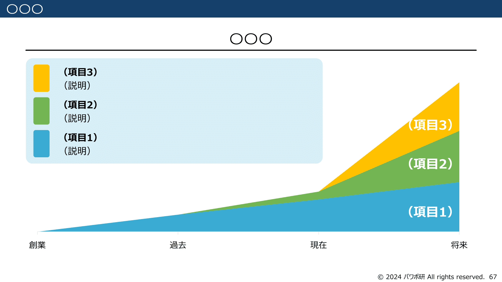
*パワポ研オリジナルテンプレート集の面グラフ*

面グラフを見たことがある方は多いと思いますが、改めて面グラフとはどのように使われるかから説明していきます。では早速行きましょう！

## 面グラフ（エリアチャート）とは

最初に面グラフとは何か、確認しておきましょう。
面グラフとは、時系列に沿って売上や顧客が連続的に積みあがっていくのを面積のような形で見せるグラフです。多くの場合、**何層かに分かれて積みあがっているので、積み上げ面グラフやエリアチャートと呼ばれます**。

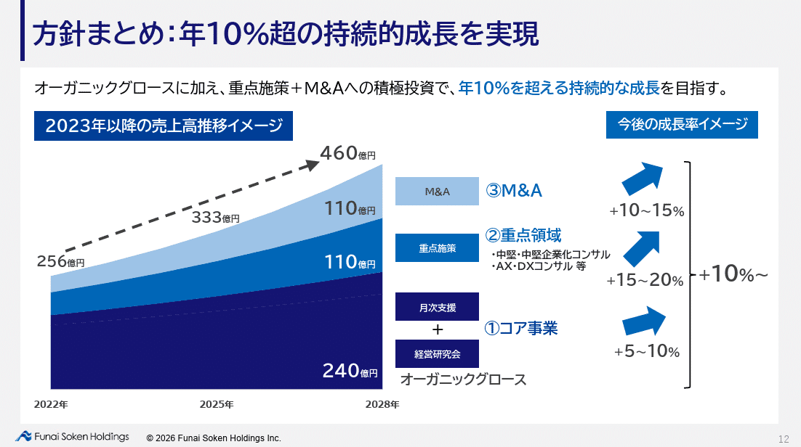
*株式会社船井総研ホールディングスの面グラフ*

> 引用元：[> 中期経営計画（2026-2028）](https://ssl4.eir-parts.net/doc/9757/tdnet/2751442/00.pdf)

*https://hd.funaisoken.co.jp/ir/ir_news.html*

似たようなグラフに積み上げ棒グラフがあります。積み上げ棒グラフは年単位やクオーター単位での数字の積み上げを見せるグラフです。

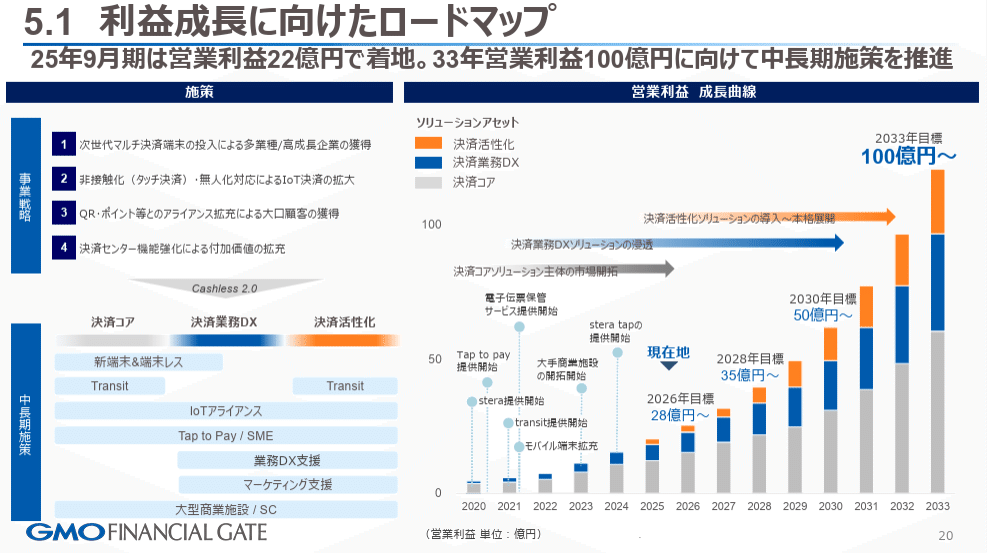
*GMOフィナンシャルゲート株式会社の積み上げ棒グラフ*

> 引用元：[> 2025年９月期　通期　決算説明会](https://gmo-fg.com/ir/library/20251114_setsumeikai_4Q_Final.pdf)

*https://gmo-fg.com/ir/library/presentation/index.html*

ビジュアル的には、**積み上げ面グラフがより連続的、積み上げ棒グラフが断面的に見えますが、実際積み上げ面グラフも使うデータは積み上げ棒グラフ同様に断片的**です。なのでどのようなビジュアルで見せたいかでグラフの種類を選ぶことになります。
見え方としては、積み上げ棒グラフの方がよりリアリティがあるように見えるので、**ある程度計画が明確な場合に積み上げ棒グラフが使われ、方針はあるが具体はこれからという場合に積み上げ面グラフが使われる**ことが多いです。

## 将来の成長性を面グラフで示すパワポ３選

最初は将来の成長性を見せるために面グラフを使用しているパワポの例から見ていきましょう。
土台となる既存事業に、将来伸びていく新規事業を積み上げて作る積み上げ面グラフが多いですね。ロードマップのスライドに積み上げ面グラフが使われることも多いです。

### 戦略別の積み上げ面グラフのパワポ例

まずは株式会社リップスのパワポにおける「面グラフ」のデザインから見ていきましょう。
2025年8月期 決算説明資料 （事業計画及び成長可能性に関する事項）のパワーポイントにある、メンズビューティのスタンダードとしての成長のスライドです。

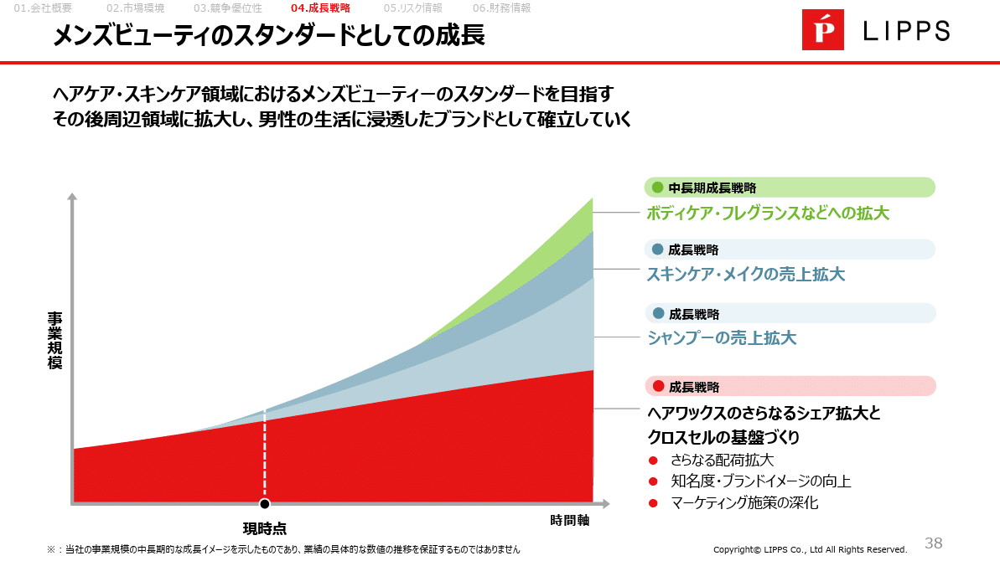
*株式会社リップスの積み上げ面グラフ*

> 引用元：[> 2025年8月期 決算説明資料 （事業計画及び成長可能性に関する事項）](https://contents.xj-storage.jp/xcontents/AS83314/01e25629/8f3d/43c7/b864/caa7fe055679/140120251015573538.pdf)

*https://lipps.co.jp/ir/news/*

パワポの「積み上げ面グラフ」の特徴としては、**戦略別に層を分けて積み上げ面グラフを作っている点**が挙げられます。
土台となる「ヘアワックスのシェア拡大とクロスセルの基盤づくり」、軌道に乗り始めている「シャンプーの売上拡大」、立上げ期の「スキンケア・メイクの売上拡大」、中長期で取り組む「ボディケア・フレグランスなどへの拡大」の４層で積み上げ面グラフを作っています。

土台の着実な伸びはコーポレートカラーの赤色で示しつつ、新規領域のシャンプーやスキンケア・メイクは青色、ボディフレグランス等は緑にする工夫で、着実な成長に加えて２段ロケットになっていることがよくわかります。

### 展開別の積み上げ面グラフのパワポ例

続いてクラシコ株式会社のパワポにおける「面グラフ」のデザインを見てみましょう。
事業計画及び成長可能性に関する事項のパワーポイントにある、成長戦略：中長期成長イメージのスライドです。

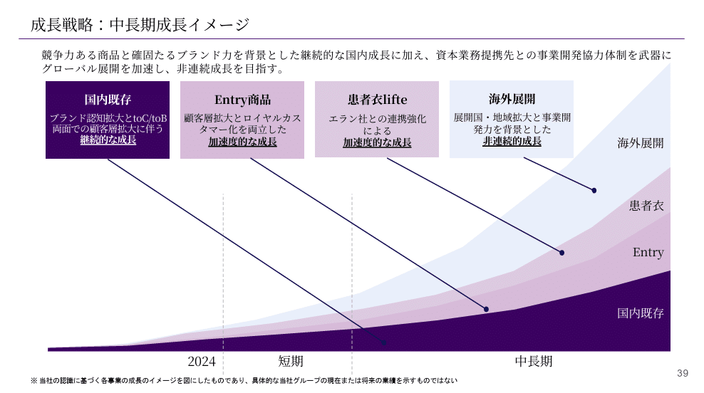
*クラシコ株式会社の積み上げ面グラフ*

> 引用元：[> 事業計画及び成長可能性に関する事項](https://contents.xj-storage.jp/xcontents/AS05759/3b99ab26/2d5d/4152/98f7/536fac940d35/140120260130542735.pdf)

*https://classico.co.jp/ir/*

パワポの「積み上げ面グラフ」の特徴としては、**事業展開別に層を分けて積み上げ面グラフを作っている点**が挙げられます。
国内既存に加えて、Entryや患者衣といった商品別に層を積み上げている点はリップスと変わらないのですが、その上に海外展開という別の要素が重なっています。

配色はコーポレートカラーの紫のグラデーションですが、濃い紫色は継続的な成長、中間の紫色は加速度的な成長、グレーっは非連続的成長となっています。
また積み上げ面グラフの説明を左側にもってきているのも特徴的で、スライド一杯に面グラフが出せるようになっていますね。

### カテゴリ別の積み上げ面グラフのパワポ例

次は株式会社 TWOSTONE&Sonsのパワポにおける「面グラフ」のデザインです。
2025年８月期 通期決算説明資料（事業計画及び成長可能性に関する事項）のパワーポイントにある、当グループの中長期的な経営ビジョンのスライドです。

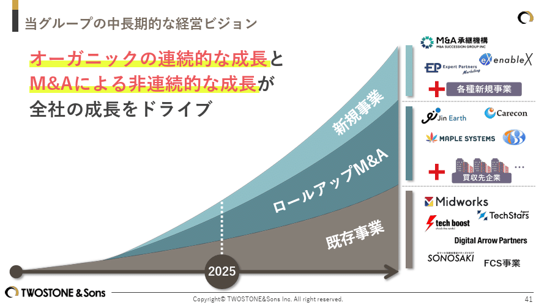
*株式会社 TWOSTONE&Sonsの積み上げ面グラフ*

> 引用元：[> 2025年８月期 通期決算説明資料（事業計画及び成長可能性に関する事項）](https://contents.xj-storage.jp/xcontents/AS08579/c3e03c77/9cb5/4565/8125/c60c69454e2a/140120251015573956.pdf)

*https://twostone-s.com/ir/presentations/*

パワポの「積み上げ面グラフ」の特徴としては、**既存事業と新規事業に加えて「ロールアップM&A」があり、それぞれのサービスロゴが配置されている点**が挙げられます。ロールアップM&Aと新規事業については、新たにM&Aを行い買収先企業が追加されることも記載されています。

実際にサービスロゴを入れることで、事業成長のイメージが膨らみやすくなると同時に、これからもたくさんのM&Aをしていくことが暗に示されており、期待が高まる積み上げ面グラフとなっています。

## 過去の実績を面グラフで示すパワポ３選

続いて過去の成長性を見せるために面グラフを使用しているパワポの例を見ていきましょう。
企業あるいはサービスがこれまでどのように成長してきたのかを、サービス別や顧客別等、重要となるセグメント別に積み上げて示す面グラフが多いです。タイムラインや沿革のスライドに積み上げ面グラフが使われることも多いです。

### 取り組み別の積み上げ面グラフのパワポ例

まずは株式会社ユカリアのパワポにおける「面グラフ」のデザインを見ていきましょう。
2025年12月期 通期決算説明資料_事業計画及び成長可能性資料のパワーポイントにある、ユカリアグループ沿革のスライドになります。

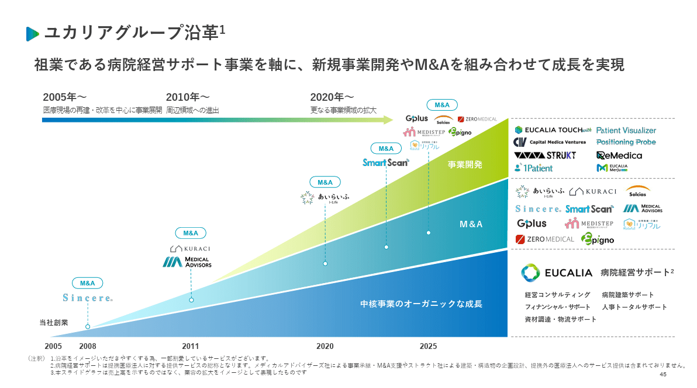
*株式会社ユカリアの積み上げ面グラフ*

> 引用元：[> 2025年12月期 通期決算説明資料_事業計画及び成長可能性資料](https://contents.xj-storage.jp/xcontents/AS96593/bf10b1cf/3f1e/40a7/8da3/cb876291c65c/140120260213560495.pdf)

*https://eucalia.jp/ir/*

パワポの「積み上げ面グラフ」の特徴としては、**過去の取り組み別に層が湧けられて積み上げられている点**が挙げられます。
中核事業である病院経営サポート、M&A、事業開発の３つに層が分かれており、それぞれの層の具体的な事業がロゴで記載されています。

配色については、ベースとなる病院経営サポートが青色で、M&A、事業開発へとグラデーションで緑色になっています。タイムライン図なので、主要なM&Aについては、M&Aがされた時点をハイライトして記載しています。

### 顧客セグメント別の面グラフのパワポ例

続いてSansan株式会社のパワポにおける「面グラフ」のデザインを見ていきましょう。
2025年5月期 通期 決算説明資料のパワーポイントにある、「Bill One」：顧客規模別収入構成（ストック収入）のスライドです。

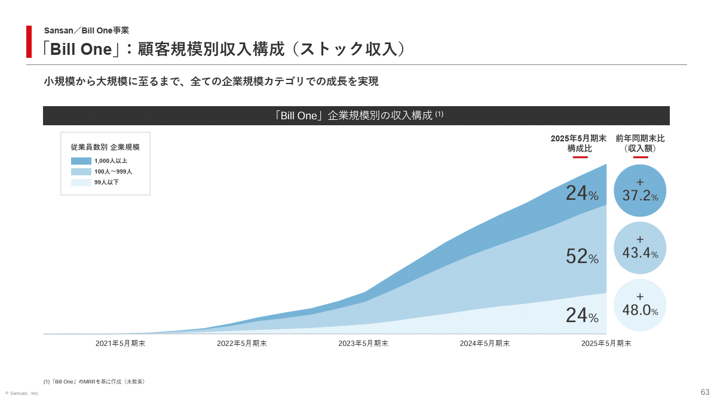
*Sansan株式会社の積み上げ面グラフ*

> 引用元：[> 2025年5月期 通期 決算説明資料](https://ir.corp-sansan.com/ja/ir/news/auto_20250714513500/pdfFile.pdf)

パワポの「積み上げ面グラフ」の特徴としては、**顧客セグメント別に層を分けて積み上げている点**が挙げられます。
1,000人以上、100人-999人、99人以下でセグメントが分かれており、それぞれの顧客がどのように、積みあがっているのか面グラフで見せています。

SaaSのようにストック型のビジネスの場合、顧客が積みあがっていくことが重要なため、面グラフがよく使われます。その中でも、より重要なセグメントがどう伸びているかを見せたいときは、積み上げ面グラフを使うのが効果的です。

### 面グラフでストック顧客の伸びを見せる例

次は株式会社kubellのパワポにおける「面グラフ」のデザインです。
2025年12月期 通期決算説明資料のパワーポイントにある、利用開始年度ごとのユーザー収益推移のスライドを見てみましょう。

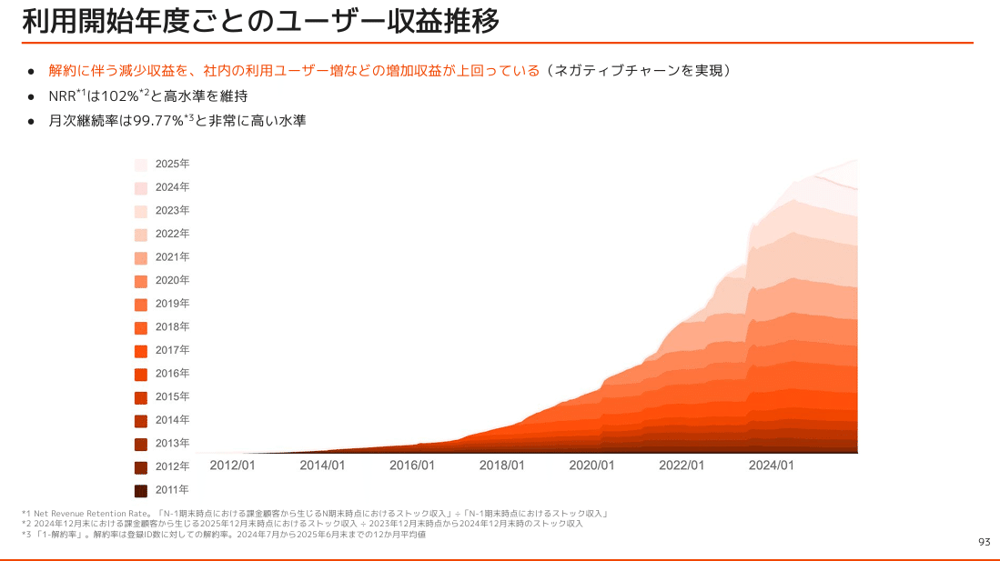
*株式会社kubellの積み上げ面グラフ*

> 引用元：[> 2025年12月期 通期決算説明資料](https://contents.xj-storage.jp/xcontents/AS04681/1d0588db/8ad0/4469/9b7c/ac08a4da8042/140120260213561378.pdf)

*https://www.kubell.com/ir/library/presentations/*

パワポの「面グラフ」の特徴としては、**利用開始年ごとに層を分けて顧客の積み上がり方を見せている点**が挙げられます。
2011年から2025年までに新規で利用開始になったユーザーを年ごとで積み上げていくことで、着実に利用顧客が増えていることを見せています。

より利用が長いコアユーザーほど色が濃く、新しいユーザーほど色が薄くなるようにすることで、コアユーザーが岩盤のようになっています。より長期間サービスを提供しているサービスほど有効な積み上げ面グラフの使い方です。

## 過去と将来をつなぐ面グラフのパワポ３選

最後は過去と将来の両方が入っている面グラフのパワポ例を見ていきましょう。過去の取り組みと将来の取り組みを記載するだけでなく、企業としてのフェーズの変化を一緒に見せるスライドも多いです。

### 過去と将来をつなぐ面グラフのポワポ例

まずはベーシックな例として、株式会社ハンモックのパワポにおける「面グラフ」のデザインを見ていきましょう。
事業計画及び成長可能性に関する事項のパワーポイントにある、成長戦略①　事業領域の拡大のスライドです。

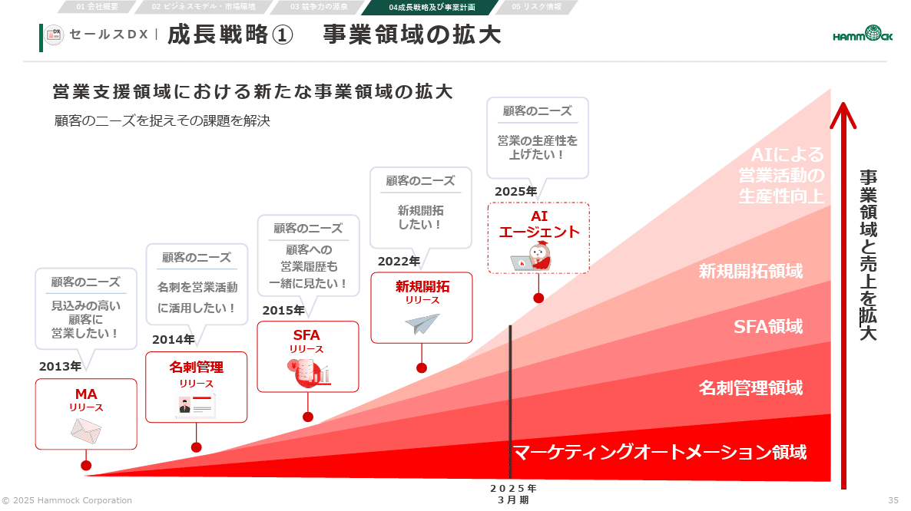
*株式会社ハンモックの積み上げ面グラフ*

> 引用元：[> 事業計画及び成長可能性に関する事項](https://xn--(6mb)-383drerc5l975zea522n1nau62ls8fw36a365bei5bt59ay1zc6zaf89a/)

*https://www.hammock.jp/ir/news.html*

パワポの「積み上げ面グラフ」の特徴としては、**領域ごとに層が分かれており、各層のスタート時点にリリースのハイライトがある点**が挙げられます。
マーケティングオートメーション、名刺管理、SFA、新規開拓、生産性向上の５つのレイヤーで、層が始まるところに「MAリリース」といったコメントが入っています。

サービスリリースに関して、それぞれ吹き出しでニーズが書かれており、んぜそのサービスを始めたのか、どのくらい伸びそうかが一目でわかる積み上げ面グラフとなっています。

### 面グラフと企業フェーズのパワポ例

続いてGMOコマース株式会社のパワポにおける「面グラフ」のデザインを見ていきましょう。
事業計画及び成長可能性に関する事項のパワーポイントにある、成長戦略のスライドです。

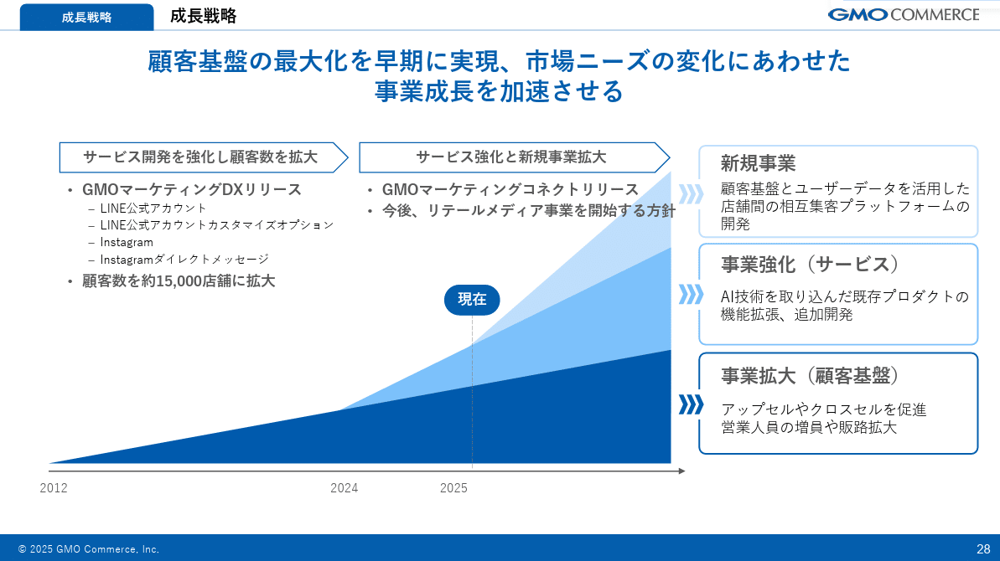
*GMOコマース株式会社の積み上げ面グラフ*

> 引用元：[> 事業計画及び成長可能性に関する事項](https://pdf.irpocket.com/C410A/K2Hn/B572/uhFT.pdf)

*https://ir.gmoc.jp/news/*

パワポの「積み上げ面グラフ」の特徴としては、**面グラフに合わせて企業のフェーズが矢羽で記載されている点**が挙げられます。
2024年までは「サービス開発を硬化し顧客数を拡大」、2024年以降は「サービス強化と新規事業拡大」とフェーズが分かれており、「サービス強化と新規事業拡大」以降から面グラフに新たな層が積みあがっています。

積み上げ面グラフの層は「事業拡大（顧客基盤）」「事業強化（サービス）」「新規事業」に分かれており、AIを活用したサービスを２階層目に分けて記載しています。

### 注力領域が伝わる面グラフのパワポ例

最後は株式会社セキュアのパワポにおける「面グラフ」のデザインを見ていきましょう。
2025年12月期決算説明資料のパワーポイントにある、成長イメージのスライドです。

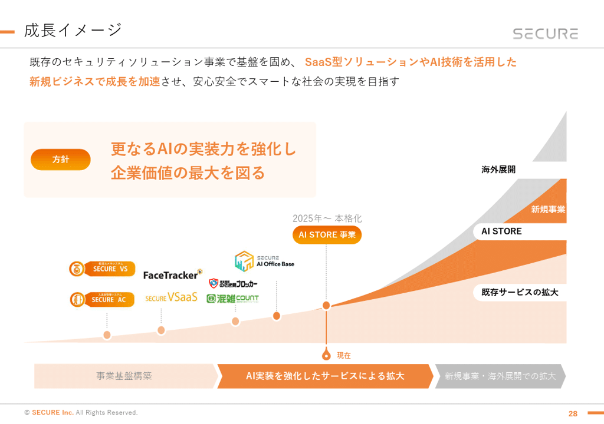
*株式会社セキュアの積み上げ棒グラフ*

> 引用元：[> 2025年12月期決算説明資料](https://contents.xj-storage.jp/xcontents/AS02669/5b6b5f8a/d369/4388/b458/70ecc3990902/140120260213560337.pdf)

*https://secureinc.co.jp/ir/irnews/*

パワポの「積み上げ面グラフ」の特徴としては、**注力領域により焦点が当たる様なビジュアルにしている点**が挙げられます。多くの積み上げ面グラフでは、一番下の最も堅い層に一番濃い色を使うことが多いのですが、この積み上げ面グラフでは新規事業であるAI Storeの層に最も濃い色が使われています。

また積み上げ面グラフのAI Storeに使われているコーポレートカラーのオレンジ色が、方針や、現在のフェーズである「AI実装を強化したサービスによる拡大」にも使われており、リンクする構造になっています。

## 【マネしたい】パワポの「面グラフ」「エリアチャート」スライド９選

以上、色々な企業のパワポを参考に「面グラフ」「エリアチャート」のデザインを紹介してきました。面グラフ自体は各社大きく変わりませんが、過去にフォーカスするか未来にフォーカスするか、またどのような情報を付加するかでイメージが大きく変わることが伝わったかと思います。

ちなみに**パワポ研で提供しているテンプレート集には、以下のようなそのまま使える「面グラフ」のテンプレートもあります**ので、気になる方は下で紹介しているオリジナルテンプレートのNoteも見てみてくださいね。

*パワポ研オリジナルテンプレート集の面グラフ例*

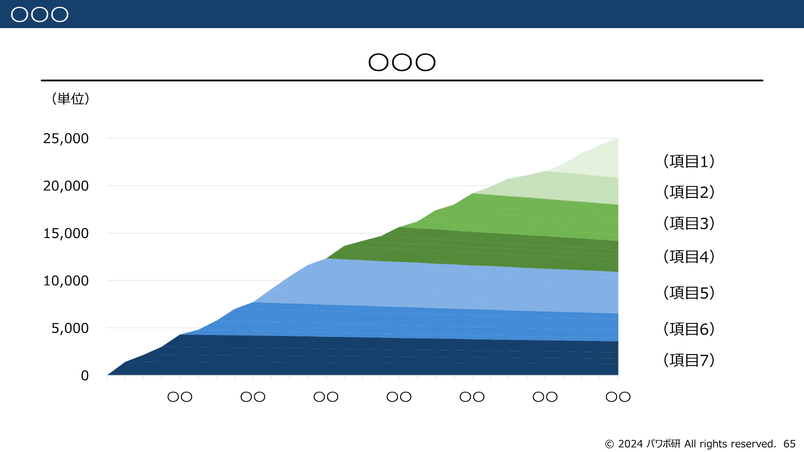
*パワポ研オリジナルテンプレート集のエリアチャート例*

*パワポ研オリジナルテンプレート集の100％面グラフ例*

## パワポ研オリジナルテンプレート

パワポ研では、「ビジネスシーンで使える」パワーポイントテンプレートを公開しております。デザインを整えるのみならず、**ロジックやストーリーを整理するのにも役立つパッケージ**になっておりますので、関心のある方は下記ページも併せてご覧ください！

[
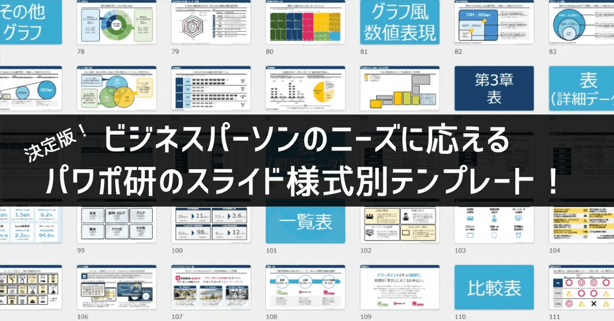
](https://note.com/powerpoint_jp/n/n50d02ec3162f)上記の記事のように、noteでは**フォローしているだけでビジネスにおける「資料作成のコツ」と「デザインのセンス」が身に付くアカウント**を目指して情報配信を行っています。
今後もコンスタントに記事を配信していく予定なので、関心のある方は是非アカウントのフォローをお願いします！

**> Template販売　**[> https://powerpointjp.stores.jp/](https://powerpointjp.stores.jp/%EF%BF%BCnote)
**> note　**[> パワポ研の資料作成術](https://note.com/powerpoint_jp/m/mc291407396da)
**> X（旧Twitter)　**[> https://twitter.com/powerpoint_jp](https://twitter.com/powerpoint_jp)

## レックスアドバイザーズからのお知らせ

パワポ研は株式会社レックスアドバイザーズが運営しています。
レックスアドバイザーズは**経営企画職や経営管理職に特化した転職エージェント**です。
上場企業や上場準備企業を中心に、**経営企画、IR、経理財務、法務、内部監査等の職種の求人**をご紹介しているほか、**CFOなどのコンフィデンシャル求人**もご紹介可能です。
またコンサルティングファームや監査法人、会計事務所の求人も豊富にあるため、プロフェッショナルファームを目指す方のご支援も得意です。
求人紹介やキャリア相談を希望の方は、[**無料転職サポート**](https://www.career-adv.jp/job_search/entryform_exp/)よりサービス利用登録をしてみてください。

*レックスアドバイザーズのサービスサイトはこちら*

**> 求人をご希望の方　**[> 無料転職サポート](https://www.career-adv.jp/job_search/entryform_exp/)**
> 採用支援をご希望の方　**[> 採用サポート](https://www.career-adv.jp/request3/)
**> その他　**[> お問い合わせフォーム](https://www.rex-adv.co.jp/contact)
**> 書籍　**[> 注目企業の実例から学ぶパワポ作成術](https://www.amazon.co.jp/dp/4046060476)

