# 【マネしたい】かっこいいパワポの「ロードマップ」スライド９選

[note原文](https://note.com/powerpoint_jp/n/nef4eb14dc50f)

みなさんこんにちは。
資料デザインのリサーチや分析に取り組むパワーポイントのスペシャリスト、パワポ研です。

今回は【マネしたい】シリーズの新作です。**パワポの「ロードマップ」スライドに焦点を当て、上場企業のIR資料からカッコいいパワーポイント資料を抜粋して紹介**していきます。

将来の計画であるロードマップに対して、過去の沿革などのタイムラインについては、こちらにまとめています。

また【マネしたい】シリーズ全般のまとめ記事はこちら。

では早速行きましょう！

## パワポのロードマップ作成時のポイント

参考となるスライドを見ていく前に、パワポでロードマップのスライドを作成する際のポイントについて簡単に整理しておきましょう。

ロードマップというのは、一言でいえば目標達成に向けた計画表です。**
**そのため**ロードマップに必ず必要となる要素は、「達成すべき目標」「目標達成に向けたアクション」「達成に向けた時間軸」の３つ**です。
ここからはそれぞれの要素についてポイントを簡単に見ておきましょう。

### 達成すべき目標とマイルストーン

繰り返しになりますが、ロードマップは目標達成に向けた計画表なので、**目指すゴールが必須**になります。目指すゴールは、売上や営業利益といった定量目標で書かれることもあれば、製品やサービスのローンチといった行動目標で書かれることもあります。**何のためのロードマップかによって目標が変わる**わけですね。

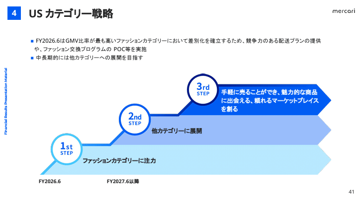
*達成すべき目標とマイルストーンが入ったロードマップのパワポ例（メルカリ社）*

> 引用元：[> 決算説明資料](https://pdf.irpocket.com/C4385/CiMB/GaCa/H2bk.pdf)

*https://about.mercari.com/ir/library/results/*

また多くのロードマップでは、最終的な目標達成をするための中間目標が定められます。**中間目標はマイルストーンなどと呼ばれ、１年後や２年後などにロードマップの実現状況を振り返る際に参照**されます。より細かくマイルストーンが設定されているロードマップの方が実効性が高いといえますね。

### 目標達成へのアクションプラン

ロードマップにおいて、より実効性を高めていく、あるいは実効性の高いロードマップだと思ってもらう上で必要なのが、目標達成へのアクションプランです。

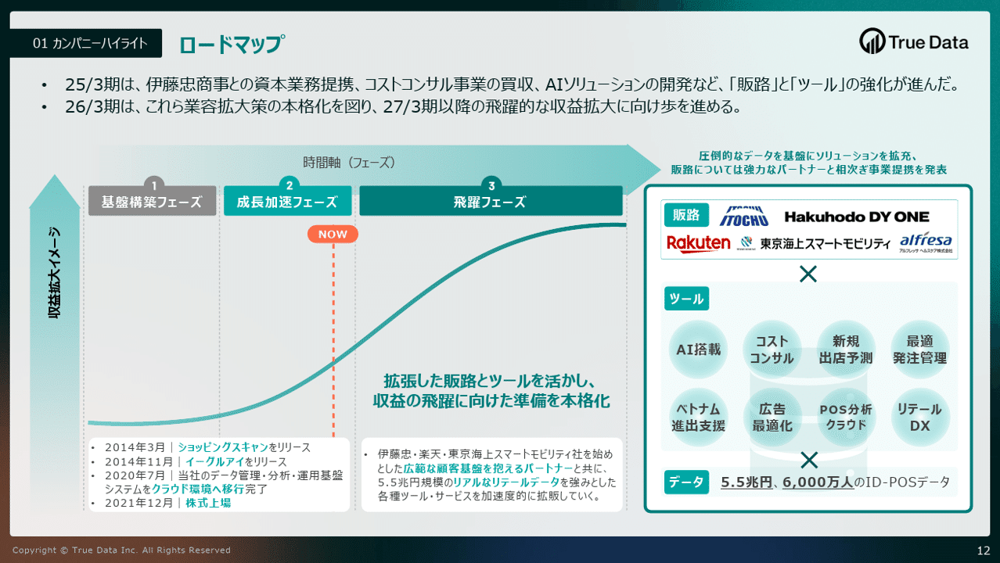
*アクションプランが記載されたロードマップのパワポ例（True Data社）*

> 引用元：[> 決算説明資料（事業計画及び成長可能性に関する事項）](https://contents.xj-storage.jp/xcontents/AS02849/1fd20b36/5516/454f/aa1d/02d004cb5114/140120250513545549.pdf)

*https://www.truedata.co.jp/ir/presentations/*

たまに目指すゴールとマイルストーンのみが書かれたロードマップもあるのですが、**目指すゴールのみでは、どのようにそのゴールを目指すのか？そのゴールは実現可能なのか？という疑問**が湧いてきますよね。
特に投資家は、バラ色の未来や実現できない計画にはうんざりしているので、計画の実効性が見える資料の方が、よりしっかりと読んでもらえます。
社内向けの資料としても、具体性がないと従業員も本気になりづらいので、アクションプランは必須です。

ただし、ＩＲ資料など外部向けの資料については、ロードマップ上にあまり細かくアクションプランを描いてしまうと、競合他社に自社の動きがばれてしまうため、あえて抽象的に書くこともあります。

### ロードマップ達成に向けた時間軸

ロードマップを作成する上で必須となる最後の要素が時間軸です。
最終目標や中間目標をどのタイミングで達成するのか、どういった時間軸でマイルストーンを達成していくのか、という話です。

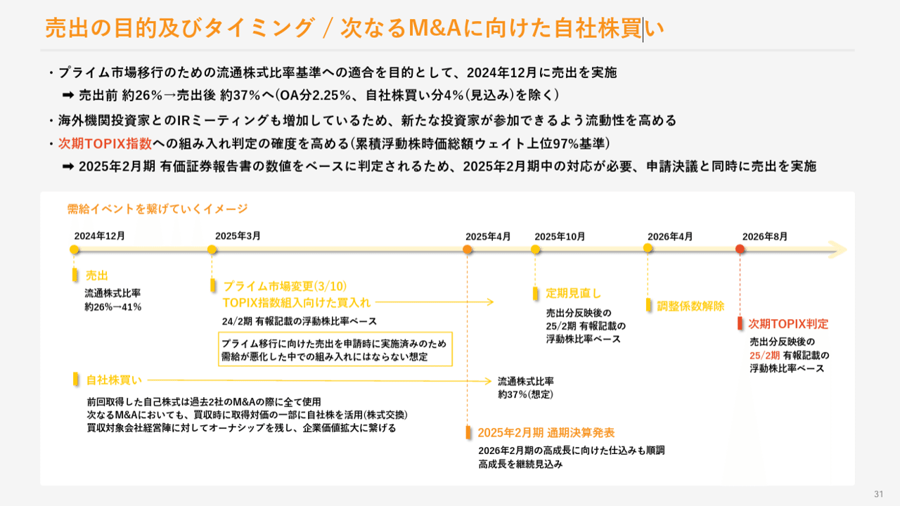
*より詳細な年月まで入ったロードマップのパワポ例（ボードルア社）*

> 引用元：[> 決算補足説明資料](https://contents.xj-storage.jp/xcontents/AS82646/78393b6f/504c/4fce/b111/4d1ca83dcaa8/140120250415516268.pdf)

*https://www.baudroie.jp/ir/presentations/*

時間軸としては、**明確に年月を記載するパターンと、短期中期長期のような形でふわっと書く場合**があります。というのも、新たな領域での取り組みにおいては、１年単位のずれが生じることはざらなので、年月まで絞ってコミットをするのがなかなか難しいからです。

逆に言えば、タイミングがはっきり見えているものについては、より具体に書くことで、企業のコミットメントの度合いもわかるので、かけるのであれば具体な時間軸の記載をできるとベターです。

## 基本形となるパワポのロードマップ見本３選

まずはパワーポイントにおけるロードマップの基本形となるスライド例から見ていきましょう。ロードマップの基本形は、**上部に時間軸あるいは短期中期長期のフローを入れ、その下に達成したい目標やアクションプラン**を記載していくというものになります。

### 目指す姿が中心のパワポのロードマップ

まずは株式会社JDSCのロードマップのスライドから見ていきましょう。2025年6月期 通期決算説明資料のパワーポイントに入っている、中期経営計画のスライドです。

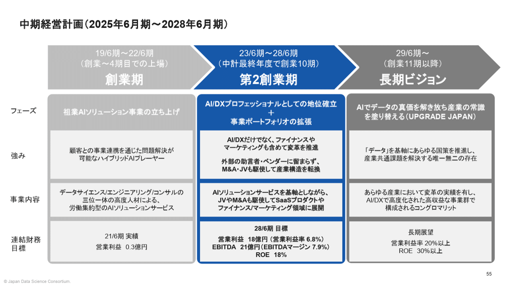
> 引用元：[> 2025年6月期 通期決算説明資料](https://ssl4.eir-parts.net/doc/4418/tdnet/2672275/00.pdf)

上部に時間軸のフローがあり、その下に会社がどういった状態を目指すのかを記載しています。目指す姿については、フェーズ、強み、事業内容、連結財務目標という４つのカテゴリーに詳細が分かれています。
競合も見るＩＲ資料なので、アクションプランの記載は限定的ですが、**目指す強みと事業内容を見ると、何をしていくかある程度イメージはわきます**。

ポイントとしては、**フローのラベルに創業期、台に創業期、長期ビジョンという文言を入れている**ところで、こうしたラベルがあるとロードマップが引き締まってかっこいいパワポになりますね。また現在地である第二創業期を濃い青色に、過去と未来をグレーにすることで、配色にもメリハリがついてかっこいいロードマップになっています。

### 行動目標が中心のパワポのロードマップ

続いて株式会社 pluszeroのロードマップのスライドを見ていきましょう。2024年10月期通期 決算説明資料のパワーポイントに入っている、AEIの技術ロードマップのスライドです。ロードマップに加えて、トップラインメッセージでロードマップに対する進捗も記載されています。

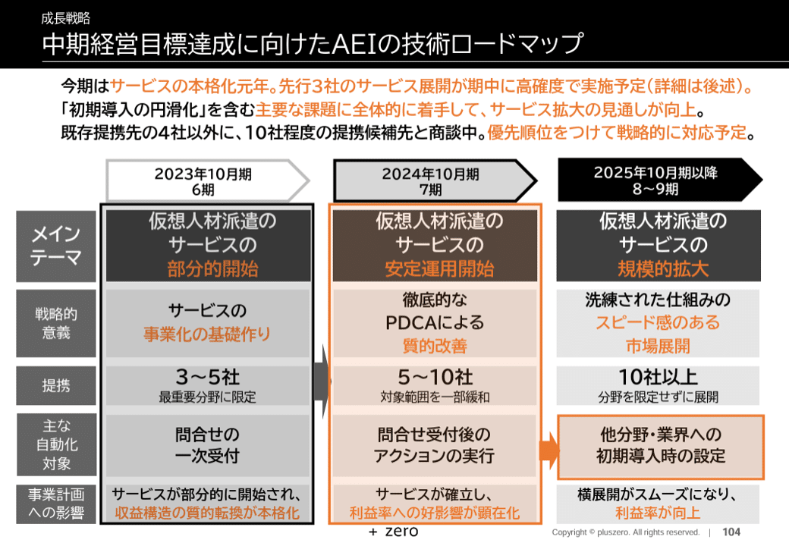
> 引用元：[> 2024年10月期通期 決算説明資料](https://contents.xj-storage.jp/xcontents/AS09142/fb77e3e2/d342/4ef7/9f3b/311c0b5c402a/140120241211536803.pdf)

*https://plus-zero.co.jp/ir/presentations/*

こちらも具体的な時間軸のフローが上部にあり、その下に目指す姿が記載されていますが、数値目標というよりは行動目標が記載されており、アクションプラン的な意味合いも強いです。**数値目標がない代わりに、戦略的意義という項目があり**、それによってなぜ今このアクションプランなのかが明確になっているわけですね。

ポイントとしては、ロードマップの中にオレンジ文字やオレンジ色の枠などがあり、重要な点が強調されていることです。**当期の話だけでなく、それが翌期以降にどのようにつながってくるか**が見やすくなっています。
またグレーベースにオレンジ色という配色は非常に相性がよく、かっこいいロードマップのパワポに仕上がっています。

### シンプルを追求したパワポのロードマップ

お次は株式会社グッドパッチのロードマップのスライドを見ましょう。2025年８月期 通期決算説明資料のパワーポイントに入っている、中長期ロードマップのスライドですが、シンプルでかっこいいパワポです。

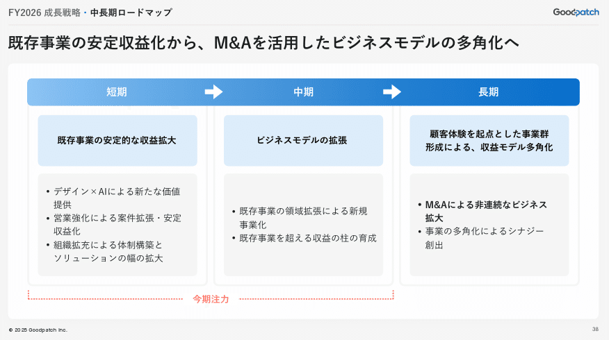
> 引用元：[> 2025年８月期 通期決算説明資料](https://contents.xj-storage.jp/xcontents/AS04618/30ba49e0/124b/4772/828d/3e3b8b3ef180/20251016131652962s.pdf)

*https://goodpatch.com/ir/presentation*

上部に短期中期長期のフローこそあるものの、上で見たロードマップのパワポと比較すると、非常にすっきりとしたかっこいいデザインとなっています。

かっこいいデザインとなっている理由は、パワポのロードマップ左側に**ゴールやアクションプランといったカテゴリのボックスがないこと**、全体的に青色単色のグラデーションとグレーの組み合わせですっきりと見やすいことなどが挙げられます。

ロードマップのパワポにおいては、短期中期長期でどのようになっていたいか、そのために何をするか、という構造以外は無いので、あえてラベルをつけなくても、ある程度伝わるということがよくわかりますね。

## 応用形となるパワポのロードマップ見本３選

続いてパワーポイントにおけるロードマップの基本形となるスライド例から見ていきましょう。応用形といっても基本的な考え方は変わらず、ロードマップの左から右に向けて目標とアクションプランが記載されていきますが、**階段などのビジュアルを用いてかっこいいデザイン**に仕上げています。

### 配色がかっこいいパワポのロードマップ

まずは株式会社フライヤーのロードマップのスライドから見ていきましょう。2025年2月期通期 決算説明資料のプレゼンテーションに入っている、中・長期戦略まとめのスライドです。

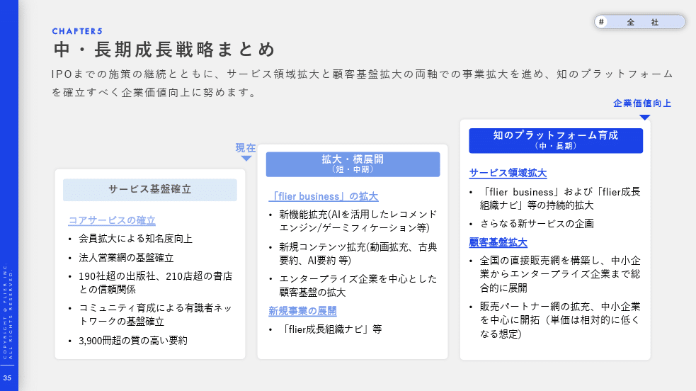
> 引用元：[> 2025年2月期通期 決算説明資料](https://contents.xj-storage.jp/xcontents/AS09236/24cdcf14/f994/4987/a156/26a1dccbaddc/140120250414515013.pdf)

*https://corp.flierinc.com/ir/library/presen*

フェーズを大きく、「サービス基盤確立」「拡大・横展開」「知のプラットフォーム育成」の３つに分解したうえで、それぞれのフェーズにおいて実現したいことと、そのためのアクションプランを記載しています。**実現したいことを青文字＋下線、そのためのアクションをテキストベースの箇条書き**にして構造化しています。

一つ目のポイントは、上部の箱をフェーズの進捗に合わせて大きくし階段状にすると同時に、ボックスや文字の青色もグラデーションで徐々に濃くしている点です。この工夫により、**将来に行くほどより企業価値が高まっていくことが視覚的に伝わり**、かっこいいロードマップのパワポになっています。

もう一つ、かっこいいパワポにする上でのポイントは、カテゴリのボックスなどを最大限取り除いたうえで、**グレーベースの背景に白抜きのボックスを使うなど、枠線もほぼ目立たないようにする**ことで、すっきりと見せている点です。ロードマップのパワポに、必ずしもカテゴリのボックスは不要ということが改めてわかります。

### 階段がかっこいいパワポのロードマップ

続いてウェルネスコミュニケーションズ株式会社のロードマップのスライドを見ていきましょう。事業計画及び成長可能性に関する事項のパワーポイントの、成長戦略のスライドになります。

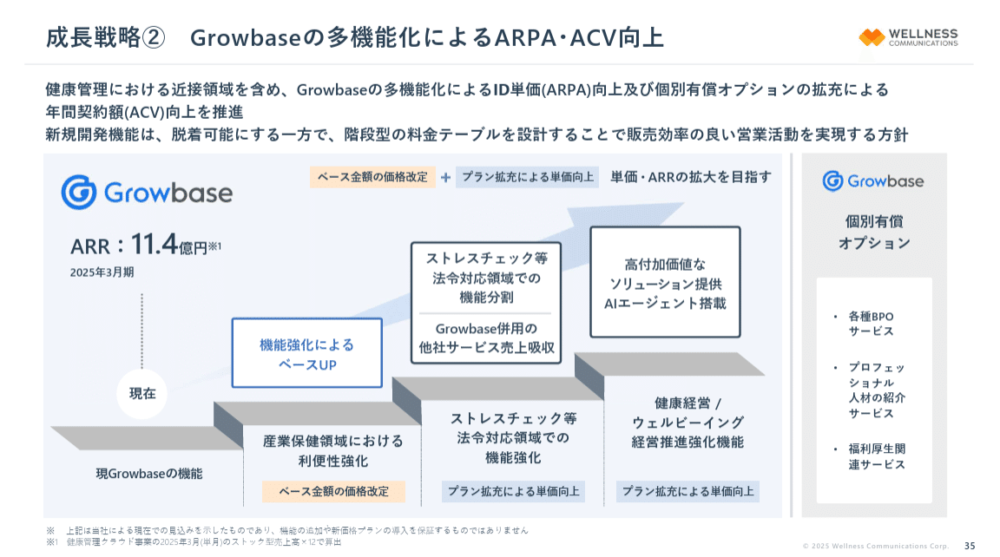
> 引用元：[> 事業計画及び成長可能性に関する事項](https://contents.xj-storage.jp/xcontents/AS05024/f07105d4/224b/4949/bb38/3f16e6c11299/140120250620595058.pdf)

*https://wellcoms.jp/ir/news/*

フェーズを４段階に分け、**３ステップでの機能強化を階段上に、機能強化によるARRの上昇を階段の上に矢印で示すデザイン**を採用しています。ARRの上昇については、あえて枠線が太めのボックスで記載しています。

ポイントとしては、まずロードマップを**階段状で示すビジュアルが視覚的にわかりやすく、かっこいいパワポデザイン**であることが挙げられます。また階段という土台側に機能強化を入れると同時にそれによる期待効果はオレンジと青のラベルにすることで、アクション⇒ARR向上の構造が一目でわかるようになっており、論理的にもわかりやすい構造といえますね。

### カラフルな積み上げパワポのロードマップ

次に株式会社リップスのロードマップのスライドを見ていきましょう。2025年8月期 決算説明資料 （事業計画及び成長可能性に関する事項）のパワーポイントの、今後の戦略のスライドになります。

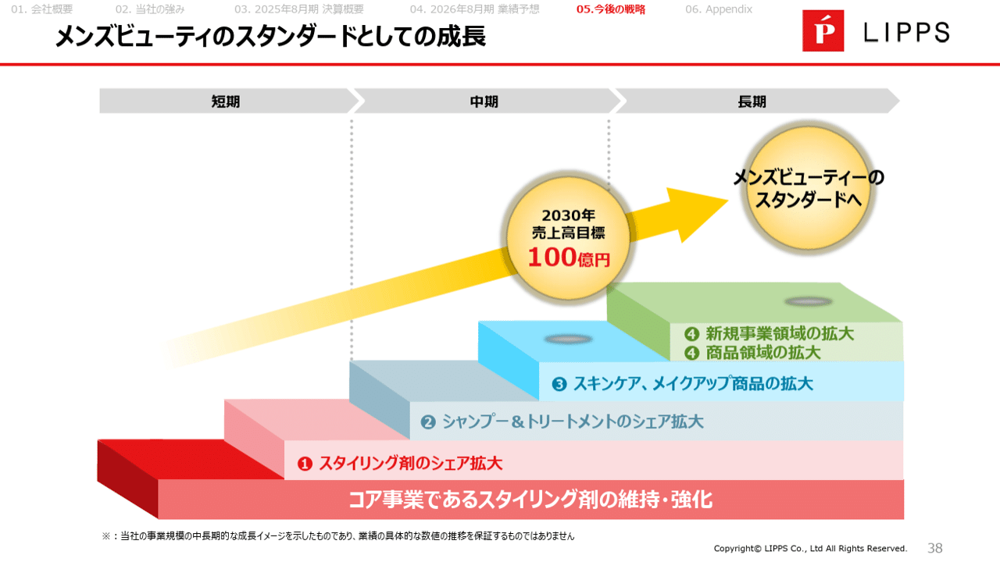
> 引用元：[> 2025年8月期 決算説明資料 （事業計画及び成長可能性に関する事項）](https://contents.xj-storage.jp/xcontents/AS83314/01e25629/8f3d/43c7/b864/caa7fe055679/140120251015573538.pdf)

これまで見てきたロードマップのスライド同様に階段状ですが、非常にカラフルなパワポです。会談にはややアクションに近い戦略目標があり、それを通じて売上高１００億円を目指すという構造になっています。**階段の上には時間軸のフローがあり、短期中期長期での戦略目標**が見えるようになっています。

**ロードマップを階層構造で見せるパワポデザインがかっこいい**ですが、配色にも工夫が見られます。既存の延長線上にないテーマが多いので、あえて配色の系統を変えていますね。また売上目標の球体の影を記載するデザインも独創的で面白いアイデアです。

## ガントチャート型のおしゃれパワポ見本３選

最後はパワーポイントにおけるロードマップの形の中でも、ガントチャート型のスライド例を見ていきましょう。研究開発型の企業などでよくみられるロードマップのスライドです。

### おしゃれなガントチャートのロードマップ

株式会社Liberawareのロードマップのスライドから見ていきましょう。2025年7月期 通期決算説明資料のプレゼンテーションに入っている、成長戦略　ロードマップのスライドです。

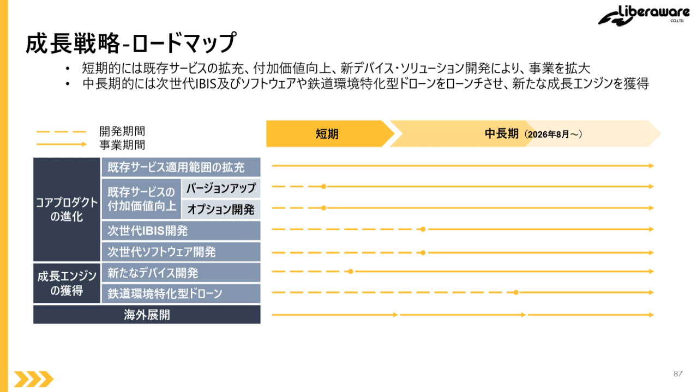
> 引用元：[> 2025年7月期 通期決算説明資料](https://ssl4.eir-parts.net/doc/218A/tdnet/2687217/00.pdf)

*https://liberaware.co.jp/ir/library/presentation/*

ガントチャート型のロードマップの基本形となるスライドです。上に短期中期長期あるいは具体的な時間軸があり、それに対しての目指す姿やアクションが左側にまとまっています。

ポイントは左側のボックスが構造化されていることで、**一番左の濃いグレーは目指す姿、その右のグレーはアクションプラン**、さらに薄いグレーはアクションプランの中のカテゴリーとなっています。

パワポにおいておしゃれなガントチャートを作成するポイントは、いかにきれいな構造を作るかと、おしゃれな配色にするかなので、それらの基本をしっかり押さえたロードマップのパワポといえますね。

### 情報リッチでおしゃれなガントチャート

続いて株式会社ダイブのロードマップのスライドを見ていきます。2025年6月期 通期決算説明資料（事業計画及び成長可能性に関する事項）のプレゼンテーションに入っている、成長戦略ロードマップのスライドです。

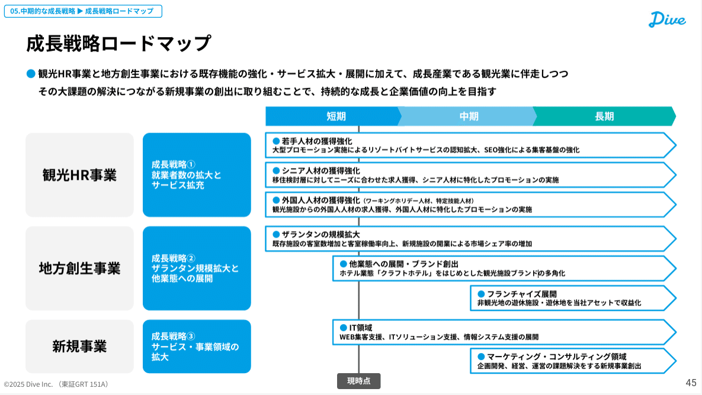
> 引用元：[> 2025年6月期 通期決算説明資料（事業計画及び成長可能性に関する事項）](https://ssl4.eir-parts.net/doc/151A/tdnet/2671665/00.pdf)

*https://dive.design/ir/library/presentation*

同じくガントチャート型のロードマップのパワポですが、**各取り組みの時間軸を示す矢羽の中に具体的な行動目標とアクションプランが詳細に記載**されています。左側のボックスは、事業セグメントと成長戦略が記載されています。

ガントチャート型のパワポの弱点として、どうしても情報量が少なくなってしまうのですが、**このように矢羽の中に情報を記載することで、情報をリッチにする**ことができます。
文字を増やすと逆にビジーになりがちですが、このスライドでは水色ベースの枠や、各行動目標の頭に水色の丸ポチを置くことなどで、おしゃれなガントチャートのパワポに仕上げています。

### 情報ヘビーなパワポのガントチャート

最後に株式会社アストロスケールホールディングスのロードマップのスライドを見ていきましょう。事業説明会資料のパワーポイントの、軌道上サービスのインフラ化に向けたロードマップのスライドになります。

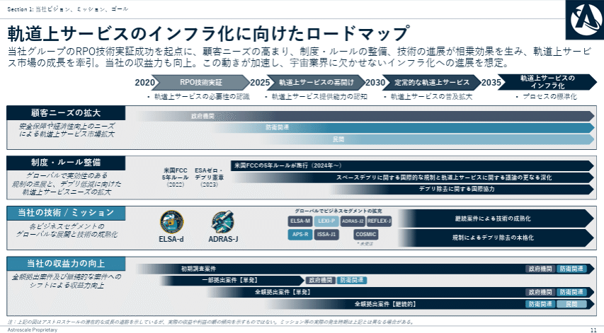
> 引用元：[> 事業説明会資料](https://contents.xj-storage.jp/xcontents/AS82438/40d5011a/7393/4bbf/9a8f/8d25d2cdde29/20251001154838853s.pdf)

*https://www.astroscale.com/ja/ir/news?category=presentations*

これまで見てきたのと同じガントチャート型のロードマップのパワポですが、**顧客ニーズや、制度・ルール整備といった、外部環境の情報もガントチャートの中に**記載しています。

宇宙領域や創薬領域など、規制をはじめとする外部環境の影響を受けやすいビジネスの場合、自社でいくらロードマップを作成しても、その通りには進まない可能性もあります。
そこで、**ガントチャートのパワポ内に、自社のロードマップに影響を与える要素を入れておき、読み手にも理解してもらえるようにする**わけですね。

## 【マネしたい】かっこいいパワポの「ロードマップ」スライド９選まとめ

いかがでしたでしょうか。パワポの「ロードマップ」について、カッコいいスライドの見本や、おしゃれなガントチャートの見本を見てきましたが、今回はそのまま参考にできるスライドも多かったのではないかと思います。
皆さんがかっこいいロードマップのパワポを作る際や、おしゃれなガントチャートのパワポを作る際に参考になれば幸いです。

## パワポ研オリジナルテンプレート

パワポ研では、「ビジネスシーンで使える」パワーポイントテンプレートを公開しております。デザインを整えるのみならず、**ロジックやストーリーを整理するのにも役立つパッケージ**になっておりますので、関心のある方は下記ページも併せてご覧ください！

[
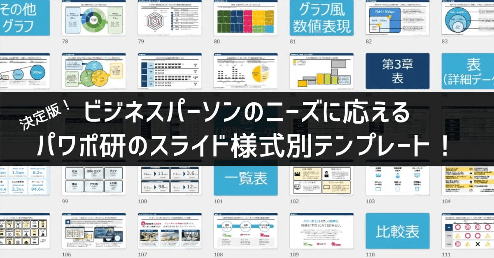
](https://note.com/powerpoint_jp/n/n50d02ec3162f)上記の記事のように、noteでは**フォローしているだけでビジネスにおける「資料作成のコツ」と「デザインのセンス」が身に付くアカウント**を目指して情報配信を行っています。
今後もコンスタントに記事を配信していく予定なので、関心のある方は是非アカウントのフォローをお願いします！

**> Template販売　**[> https://powerpointjp.stores.jp/](https://powerpointjp.stores.jp/%EF%BF%BCnote)
**> note　**[> パワポ研の資料作成術](https://note.com/powerpoint_jp/m/mc291407396da)
**> X（旧Twitter)　**[> https://twitter.com/powerpoint_jp](https://twitter.com/powerpoint_jp)

## レックスアドバイザーズからのお知らせ

パワポ研は株式会社レックスアドバイザーズが運営しています。
レックスアドバイザーズは**経営企画職や経営管理職に特化した転職エージェント**です。
上場企業や上場準備企業を中心に、**経営企画、IR、経理財務、法務、内部監査等の職種の求人**をご紹介しているほか、**CFOなどのコンフィデンシャル求人**もご紹介可能です。
またコンサルティングファームや監査法人、会計事務所の求人も豊富にあるため、プロフェッショナルファームを目指す方のご支援も得意です。
求人紹介やキャリア相談を希望の方は、[**無料転職サポート**](https://www.career-adv.jp/job_search/entryform_exp/)よりサービス利用登録をしてみてください。

*レックスアドバイザーズのサービスサイトはこちら*

**> 求人をご希望の方　**[> 無料転職サポート](https://www.career-adv.jp/job_search/entryform_exp/)**
> 採用支援をご希望の方　**[> 採用サポート](https://www.career-adv.jp/request3/)
**> その他　**[> お問い合わせフォーム](https://www.rex-adv.co.jp/contact)
**> 書籍　**[> 注目企業の実例から学ぶパワポ作成術](https://www.amazon.co.jp/dp/4046060476)

