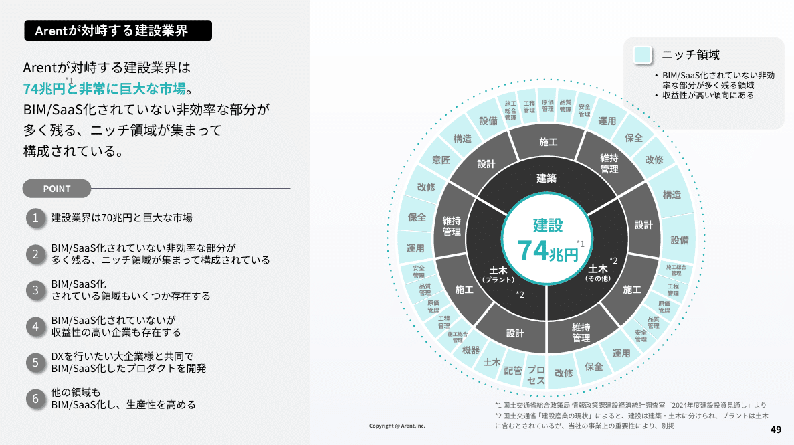
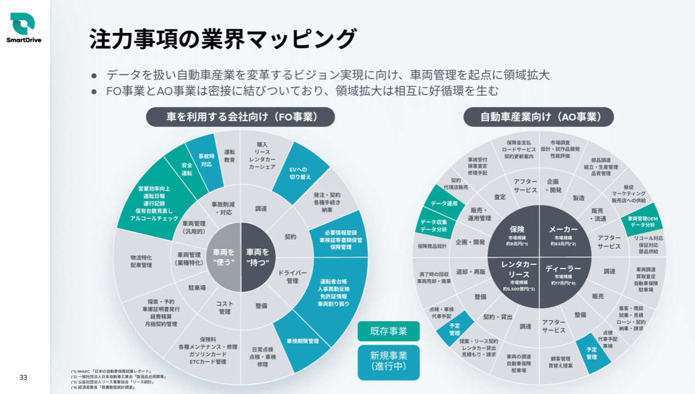
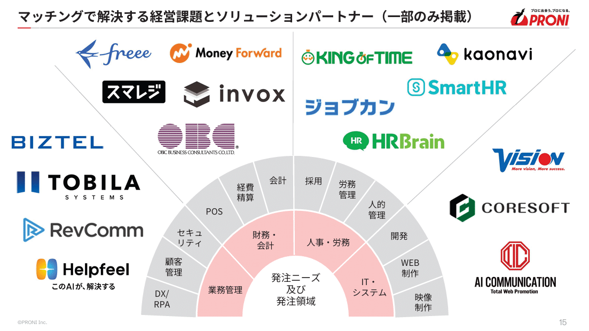
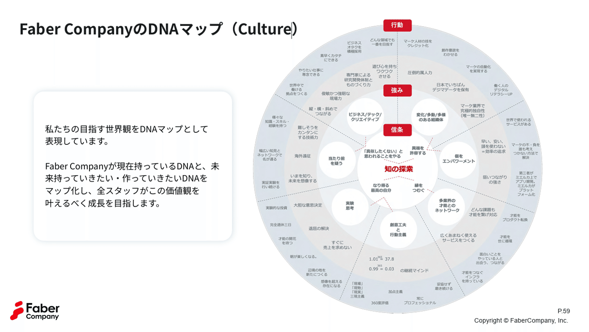
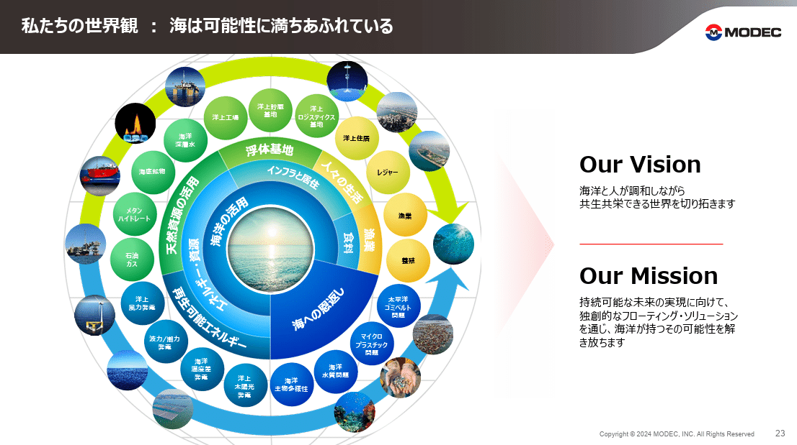
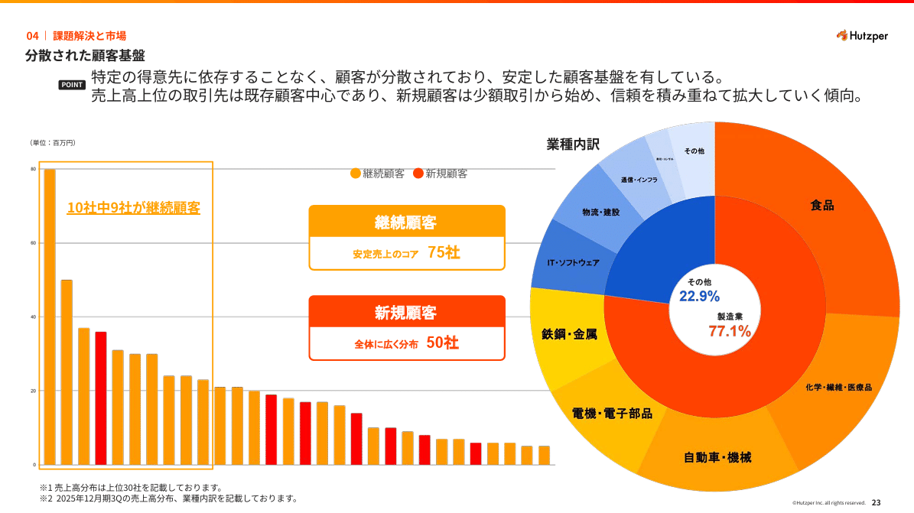
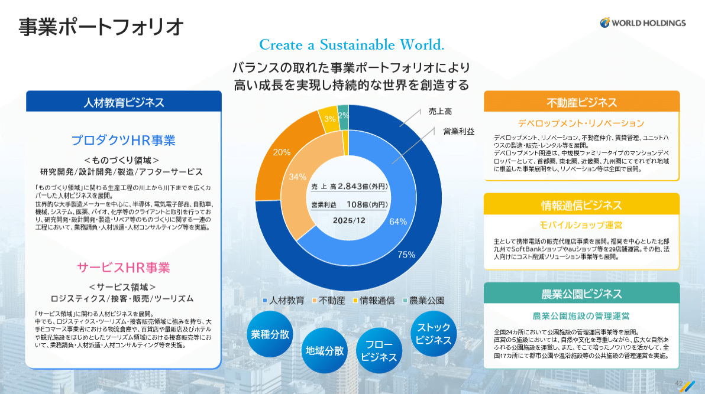
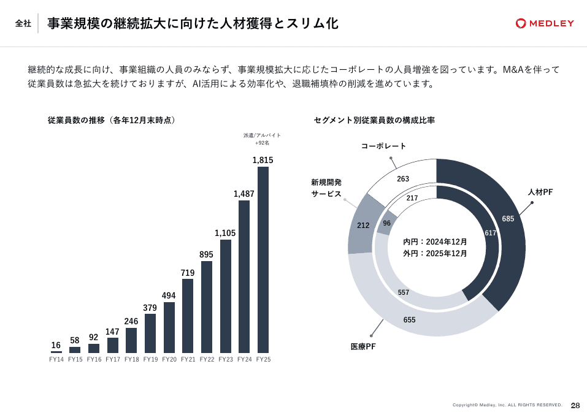
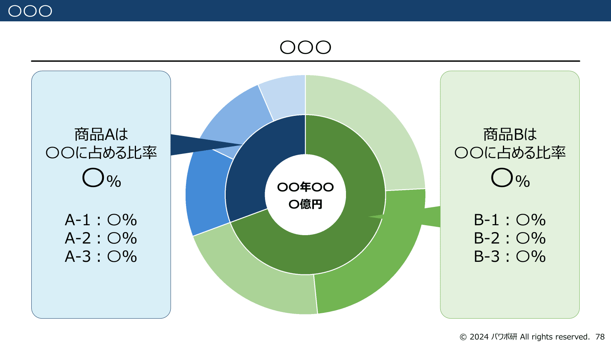

# 【マネしたい】パワポの見やすい「サンバースト」図デザイン９選

[note原文](https://note.com/powerpoint_jp/n/nf1a10ddc6f8e)

みなさんこんにちは。
資料デザインのリサーチや分析に取り組むパワーポイントのスペシャリスト、パワポ研です。

パワポ研ではテーマやデザイン別に様々なパワーポイントスライドを紹介していますが、今回は**パワポの「サンバースト」図のスライドに焦点を当て、上場企業のIR資料からおしゃれなデザインを紹介**していきます。

*株式会社Arentのサンバーストグラフのデザイン*

> 引用元：[> 事業計画及び成長可能性に関する事項](https://ssl4.eir-parts.net/doc/5254/tdnet/2692180/00.pdf)

*https://arent.co.jp/ir/news/*

サンバースト図とは、円グラフを階層構造にした図で、サンバーストチャート、サンバーストグラフなどとも呼ばれます。今回は上記の様な「市場の全体像のスライド」に、「目指す世界のスライド」と「経営数値のスライド」を加えた３つのパターンで、サンバースト図を紹介していきますね。
以前まとめたパワポの「円グラフ」のスライドのNoteはこちらから。

では早速行きましょう！

## 市場の全体像を見せるサンバースト図３選

最初は、パワポのサンバースト図の定番である、市場の全体像を見せるスライドのデザインから見ていきましょう。市場を大カテゴリ、中カテゴリ、小カテゴリの３階層で整理したうえで、サンバースト図にプロットします。
将来的に周辺の領域に成長機会がある企業などでよく使われるサンバースト図を使ったデザインですね。

### 事業領域を紹介するサンバースト図

まずは株式会社スマートドライブのパワポにおける「サンバースト図」のデザインから見ていきましょう。
事業計画及び成長可能性に関する事項のパワーポイントにある、「注力事項の業界マッピング」のスライドです。

*株式会社スマートドライブのサンバースト図のデザイン*

> 引用元：[> 事業計画及び成長可能性に関する事項](https://contents.xj-storage.jp/xcontents/AS04684/2ec2990f/eabb/4a52/aa65/1dfc1829699a/140120251222523990.pdf)

*https://smartdrive.co.jp/company/ir/news/*

パワポの「サンバースト図」デザインの特徴としては、**自社の対象事業領域を「既存事業」「新規事業」「未着手」に分類している点**が挙げられます。車を利用する会社向け（FO事業）と自動車産業向け（AO事業）それぞれにおいて、３階層のサンバーストチャートで整理したうえで、既存事業を緑色、新規事業（進行中）を青色でハイライトしています。

車を利用する会社向け（FO事業）は、ユーザーの所有と利用に分けてニーズを整理する構造になっています。内側に行くほど大カテゴリになる構造ですね。

- 階層数：３階層

- １階層目（内側）：車両を”使う”、車両を”持つ”

- ２階層目（真ん中）：車両管理、事故削減・対応、整備など９カテゴリ

- ３階層目（外側）：安全運転、EVへの切り替えなど１４カテゴリ

自動車産業向け（AO事業）は、対象産業ごとにニーズを整理する構造になっています。階層構造は車を利用する会社向け（FO事業）と同じく、内側に行くほど大カテゴリになる構造です。

- 階層数：３階層

- １階層目（内側）：保険、メーカー、ディーラー、レンタカー・リース

- ２階層目（真ん中）：大カテゴリごとに４カテゴリの計１６カテゴリ

- ３階層目（外側）：予実管理、データ運用など２１カテゴリ

### 市場規模を説明するサンバースト図

続いてTENTIAL株式会社のパワポにおける「サンバースト図」のデザインを見ていきましょう。
2025年8月期 通期決算説明資料（事業計画及び成長可能性に関する資料）のパワーポイントにある、「TENTIALが対峙する市場と将来獲得できる市場」のスライドです。他のNoteでも何度か取り上げていますね。

*TENTIAL株式会社のサンバースト図のデザイン*

> 引用元：[> 2025年8月期 通期決算説明資料（事業計画及び成長可能性に関する資料）](https://ssl4.eir-parts.net/doc/325A/tdnet/2698232/00.pdf)

*https://corp.tential.jp/ir/news/*

パワポの「サンバースト図」デザインの特徴としては、**自社の対象事業領域を細分化して市場規模を記載している点**が挙げられます。リカバリー市場5.4兆円を、ソリューションとそれ以外、衣食住とそれ以外、各サブセグメントに分解して見せるためにサンバーストチャートを使っています。

真ん中に全体の市場規模があり、外側に各市場規模があり、その間にカテゴリー分けが入る構造です。内側に行くほど大カテゴリになる構造です。

- 階層数：３階層

- １階層目（内側）：ソリューション（個人行動）とそれ以外

- ２階層目（真ん中）：衣、食、住、なし、それ以外の５カテゴリ

- ３階層目（外側）：衣類、食料、寝具類など１５カテゴリ

このサンバースト図はいくつかの工夫があり、内側のカテゴリ分けは自社にとって重要なカテゴリのみに行う、小カテゴリがつぶれないように小カテゴリの大きさは敢えて市場規模に比例させない、といったことをしています。
サンバーストをグラフとして使う場合は市場のサイズなどに比例させることが望ましいですが、サンバーストを図として使う場合には、必ずしも市場規模に比例させる必要はないということですね。

### M&A戦略を説明するサンバースト図

続いて株式会社Arentのパワポにおける「サンバースト図」のデザインです。
事業計画及び成長可能性に関する事項のパワーポイントにある、プロダクト戦略群のスライドを見てみましょう。

*株式会社Arentのサンバースト図のデザイン*

> 引用元：[> 事業計画及び成長可能性に関する事項](https://ssl4.eir-parts.net/doc/5254/tdnet/2692180/00.pdf)

*https://arent.co.jp/ir/news/*

パワポの「サンバースト図」デザインの特徴としては、**自社の対象事業領域を細分化してM&A戦略の説明につなげている点**が挙げられます。建設DXの領域を細分化したうえで、これまでの自社のM&Aがどの事業領域のものであるか記載しています。それによって将来的にも同じようにニッチ領域の課題を解決するソリューションを買収していくということの説得力が高まるわけです。

内側が大カテゴリーで外側に広がっていくという構造はこれまで見てきたサンバーストチャートのデザインと同じですが、最後に自社でサービスを持っているかの層が出てくる点は特徴的です。

- 階層数：４階層

- １階層目（内側）：建設、土木（プラント）、土木（その他）

- ２階層目（真ん中内側）：３領域の設計、施工、維持管理で９カテゴリ

- ３階層目（真ん中外側）：構造、工程管理、配管など３３カテゴリ

- ４階層目（外側）：自社サービスの有無

サンバースト図を使いつつ、自社のサービスをプロットすることで事業領域がわかりやすくなるというデザインですが、サービスをプロットしたさらに外側で、複数領域をカバーする自社開発のプロダクトが領域をまたいでいるデザインになっており、これもよいですね。

## 様々な使い方のサンバーストチャート３選

続いて、「サンバーストチャート」を使ってより複雑なコンセプトを説明しているパワポ例を見ていきましょう。事業パートナーの紹介やカルチャーマップ、パーパス紹介など、様々なスライドデザインを見ていきましょう。

### パートナー紹介のサンバーストチャート

まずはPRONI株式会社のパワポにおける「サンバーストチャート」のデザインから見ていきます。
事業計画及び成長可能性に関する事項のパワーポイントにある、「マッチングで解決する経営課題とソリューションパートナー」のスライドです。

*PRONI株式会社のサンバーストチャートのデザイン*

> 引用元：[> 事業計画及び成長可能性に関する事項](https://ssl4.eir-parts.net/doc/479A/tdnet/2761801/00.pdf)

*https://ir.proni.co.jp/news/*

パワポの「サンバーストチャート」デザインの特徴としては、**自社のサービス領域を整理したうえでパートナー企業をプロットしている点**が挙げられます。業務管理、財務・会計、人事・労務、IT・システムといったソリューションパートナーの領域を整理したうえで、パートナー各社のロゴを並べています。

サンバーストチャート自体は２階層で。内側に大カテゴリ、外側に小カテゴリというデザインです。

- 階層数：２階層

- １階層目（内側）：業務管理、財務・会計、人事・労務、IT・システム

- ２階層目（外側）：顧客管理、経費精算、会計、採用など１２カテゴリ

よりインパクトを出すために、サンバーストチャートは全円ではなく半円のデザインになっています。特定の領域ではそもそもパートナーたりうる企業限られるため、パートナー数も限定的なことがあります。なので一つ一つのロゴを大きくしても見やすいようなデザインとして半円を選んでいるということですね。

### 目指す世界観のサンバーストチャート

続いて株式会社Faber Companyのパワポにおける「サンバーストチャート」のデザインを見ていきましょう。
2025年9月期 通期決算説明資料のパワーポイントにある、「Faber CompanyのDNAマップ（Culture）のスライドです。

> 引用元：[> 2025年9月期 通期決算説明資料](https://ssl4.eir-parts.net/doc/220A/tdnet/2717268/00.pdf)

*https://www.fabercompany.co.jp/ir/news/*

パワポの「サンバーストチャート」デザインの特徴としては、**自社のなりたい姿を信条と強みと行動の階層で表現している点**が挙げられます。信条である「知の探索」とそこへ至る４つの要件、それを実現するための７つの強み、さらにそれを支える行動、という構成のデザインになっています。

サンバーストチャート自体は４階層で。内側に行くほど企業として大切にしている信条、外側に行くほど具体的な行動となっています。

- 階層数：４階層

- １階層目（内側）：信条である「知の探索」と４つの要件

- ２階層目（真ん中内側）：創意工夫と行動主義などの７つ強み

- ３階層目（真ん中外側）：行動と強みの中間で、難しそうを簡単にする技術力や、効率の追求など、１８項目

- ４階層目（外側）：３０の行動指針

真ん中の信条を実現するためにどのような強みを持つか、どのような指針で行動するか、ということを見せるデザインのため、サンバーストチャートの外側から内側に矢印が伸びています。信条と強みと行動指針、そして真ん中の「知の探索」を赤色にして目立たせるデザインもサンバーストチャートにしまりが出てよいですね。

### パーパス紹介のサンバーストチャート

最後は三井海洋開発株式会社のパワポにおける「サンバーストチャート」のデザインです。
三井海洋開発株式会社のパワーポイントにある、「私たちの世界観：海は可能性に満ちあふれている」のスライドです。

*三井海洋開発株式会社のサンバーストチャートのデザイン*

> 引用元：[> 2025年12月期 決算説明会資料](https://www.modec.com/jp/ir/library/presentation/assets/pdf/2025_YE_presentation_jp.pdf)

*https://www.modec.com/jp/news/*

パワポの「サンバーストチャート」デザインの特徴としては、**自社の世界観やパーパスからどのような価値提供を行うかをまとめている点**が挙げられます。根幹である「海洋の活用」や「海への恩返し」から始まり、それがどのような価値提供につながるのかを説明しています。

サンバーストチャートは５階層で、内側がより抽象的な目標、外側が具体的なニーズや画像イメージとなっています。

- 階層数：５階層

- １階層目（内側）：海洋の活用と海への恩返し

- ２階層目（真ん中内側）：エネルギーと資源、インフラと属性、食料の３カテゴリ

- ３階層目（真ん中）：再生可能エネルギー、天然資源の活用、浮体基地、人々の生活、漁業の５項目

- ４階層目（真ん中外側）：洋上風力、メタンハイドレードなど１９項目

- ５階層目（外側）：既に取り組んでいる画像

サンバーストチャートの中でも、カラフルで立体的なデザインで、外側の画像も目立ちます。またサンバーストチャートの背景が地球の様なデザインになっている点もこだわりが見えます。

## 経営数値を説明するサンバーストグラフ３選

最後は、売上や営業利益など、経営数値を可視化するためにサンバーストグラフのデザインを使っているパワポスライドを見ていきましょう。カテゴリー改装を見せるデザインに加えて、売上と営業利益の構成比の違いを見せるデザインなどもあります。

### 顧客内訳を説明するサンバーストグラフ

まずは株式会社フツパーのパワポにおける「サンバーストグラフ」のデザインから見ていきましょう。
事業計画及び成長可能性に関する事項のパワーポイントにある、「課題解決と市場」のスライドを見ていきましょう。

*株式会社フツパーのサンバーストグラフのデザイン*

> 引用元：[> 事業計画及び成長可能性に関する事項](https://ssl4.eir-parts.net/doc/478A/tdnet/2780497/00.pdf)

*https://hutzper.com/ir/*

パワポの「サンバーストグラフ」デザインの特徴としては、**数字の比率に合わせてサンバースト内の比率を変えている点**が挙げられます。顧客業界別の売上比率をサンバーストグラフにプロットし、製造業の方が比率が高いこと、また製造業の中の比率がどの世になっているかを視覚的に見せるデザインとなっています。

サンバーストグラフは２階層で、内側が製造業と非製造業、外側がもう一段細かい産業分類となっています。

- 階層数：２階層

- １階層目（内側）：製造業とその他

- ２階層目（外側）：製造業やその他の内訳の１０業種

大きく製造業とその他に分けるデザインですが、製造業はオレンジ色、その他は青色にし、その中の産業分類は同系色のグラデーションにしています。

### 売上と利益を比較するサンバーストグラフ

続いては株式会社ワールドホールディングスのパワポにおける「サンバーストグラフ」のデザインを見ていきましょう。
2025年12月期 決算説明資料のパワーポイントにある、事業ポートフォリオのスライドです。

*株式会社ワールドホールディングスのサンバーストグラフのデザイン*

> 引用元：[> 2025年12月期 決算説明資料](https://world-hd.co.jp/app/wp-content/uploads/2026/02/20260213_Financial-results.pdf)

*https://world-hd.co.jp/irrelease/2026/*

パワポの「サンバーストグラフ」デザインの特徴としては、**内側を売上高に外側を営業利益にして比較している点**が挙げられます。事業別の売上と事業別の営業利益を２層のサンバーストグラフで比較するデザインで、事業の貢献度をよりわかりやすく可視化しています

サンバーストグラフは２階層で、外側が売上、内側が営業利益になっています。４つの事業の色合いはそのままに、外側の売上の方がより濃い色合いになっていることで、比較がしやすいデザインとなっています。

- 階層数：２階層

- １階層目（外側）：４事業の売上における比率

- ２階層目（外側）：４事業の営業利益における比率

### 今年と前年を比較するサンバーストグラフ

最後は株式会社メドレーのパワポにおける「サンバーストグラフ」のデザインを見ていきましょう。
2025年12月期 決算説明資料のパワーポイントにある、「事業規模の継続拡大に向けた人材獲得とスリム化」のスライドです。

*株式会社メドレーのサンバーストグラフのデザイン*

> 引用元：[> 2025年12月期 通期決算説明資料](https://ssl4.eir-parts.net/doc/4480/ir_material_for_fiscal_ym/198512/00.pdf)

*https://www.medley.jp/ir/results/presentation/*

パワポの「サンバーストグラフ」デザインの特徴としては、**外側を今年度の人員構成に、内側を前年度の人員構成にして比較している点**が挙げられます。今年と昨年で、人材PF、医療PF、新規開発サービス、コーポレートの人材比率がどう変化したかを可視化しています。

サンバーストグラフは２階層で、外側が今年度の４部門の人員数、内側が昨年度の４部門の人員数となっています。

- 階層数：２階層

- １階層目（外側）：今年における４事業の人員比率

- ２階層目（外側）：昨年における４事業の人員比率

## 【マネしたい】パワポの見やすい「サンバースト」図デザイン９選まとめ

以上、様々な「サンバースト」図のデザイン例を見てきました。
市場規模の内訳を見せるサンバースト図や、より事業の在り方等の具体と抽象のつながりを見せるサンバーストチャート、経営数値を見せるためのサンバーストグラフなど、色々なサンバーストの使い方があることが分かったのではないかと思います。

ちなみに**パワポ研で提供しているテンプレート集には、以下のようなそのまま使える「サンバースト」グラフの素材もあります**ので、気になる方は下で紹介しているオリジナルテンプレートのNoteも見てみてくださいね。

*パワポ研オリジナルテンプレート集のサンバースト素材*

## パワポ研オリジナルテンプレート

パワポ研では、「ビジネスシーンで使える」パワーポイントテンプレートを公開しております。デザインを整えるのみならず、**ロジックやストーリーを整理するのにも役立つパッケージ**になっておりますので、関心のある方は下記ページも併せてご覧ください！

上記の記事のように、noteでは**フォローしているだけでビジネスにおける「資料作成のコツ」と「デザインのセンス」が身に付くアカウント**を目指して情報配信を行っています。
今後もコンスタントに記事を配信していく予定なので、関心のある方は是非アカウントのフォローをお願いします！

**> Template販売　**[> https://powerpointjp.stores.jp/](https://powerpointjp.stores.jp/%EF%BF%BCnote)
**> note　**[> パワポ研の資料作成術](https://note.com/powerpoint_jp/m/mc291407396da)
**> X（旧Twitter)　**[> https://twitter.com/powerpoint_jp](https://twitter.com/powerpoint_jp)

## レックスアドバイザーズからのお知らせ

パワポ研は株式会社レックスアドバイザーズが運営しています。
レックスアドバイザーズは**経営企画職や経営管理職に特化した転職エージェント**です。
上場企業や上場準備企業を中心に、**経営企画、IR、経理財務、法務、内部監査等の職種の求人**をご紹介しているほか、**CFOなどのコンフィデンシャル求人**もご紹介可能です。
またコンサルティングファームや監査法人、会計事務所の求人も豊富にあるため、プロフェッショナルファームを目指す方のご支援も得意です。
求人紹介やキャリア相談を希望の方は、[**無料転職サポート**](https://www.career-adv.jp/job_search/entryform_exp/)よりサービス利用登録をしてみてください。

*レックスアドバイザーズのサービスサイトはこちら*

**> 求人をご希望の方　**[> 無料転職サポート](https://www.career-adv.jp/job_search/entryform_exp/)**
> 採用支援をご希望の方　**[> 採用サポート](https://www.career-adv.jp/request3/)
**> その他　**[> お問い合わせフォーム](https://www.rex-adv.co.jp/contact)
**> 書籍　**[> 注目企業の実例から学ぶパワポ作成術](https://www.amazon.co.jp/dp/4046060476)

