# 【マネしたい】カッコいいパワポの「フローチャート」スライド９選

[note原文](https://note.com/powerpoint_jp/n/nf57434bd50ee)

みなさんこんにちは。
資料デザインのリサーチや分析に取り組むパワーポイントのスペシャリスト、パワポ研です。

今回は【マネしたい】シリーズの新作です。**パワポの「フローチャート」スライドに焦点を当て、上場企業のIR資料から参考になりそうなパワーポイント資料を抜粋して紹介**していきます。

フローチャートというと、工程表やマニュアルの対応手順などのパワポに使われることも多いですが、実はIRのプレゼンテーションもよく使われます。
例えば、**自社サービスが顧客の業務フローをどのように改善するか、フローチャートを使ったデザインでパワーポイントに表現する**といった場合です。

その意味で、事業内容や事業ポートフォリオを見せるのにフローチャートを使うこともあるので、気になる方は【マネしたい】戦略が伝わるパワポの「事業紹介」スライド９選のNoteも参考にしてみてくださいね。

では早速行きましょう！

## フローチャートの使い方とポイント

参考となるスライドを見ていく前に、パワポにおけるフローチャートの使い方のポイントについて簡単に整理しておきましょう。

**フローチャートが決算説明資料等のパワーポイント資料で使われるのは、主に３つのパターンになります。**

- 顧客の業務プロセスを見せるパワポでフローチャートを使う

- 企業のサービス提供プロセスを見せるパワポでフローチャートを使う

- 企業のマーケティングプロセスを見せるパワポでフローチャートを使う

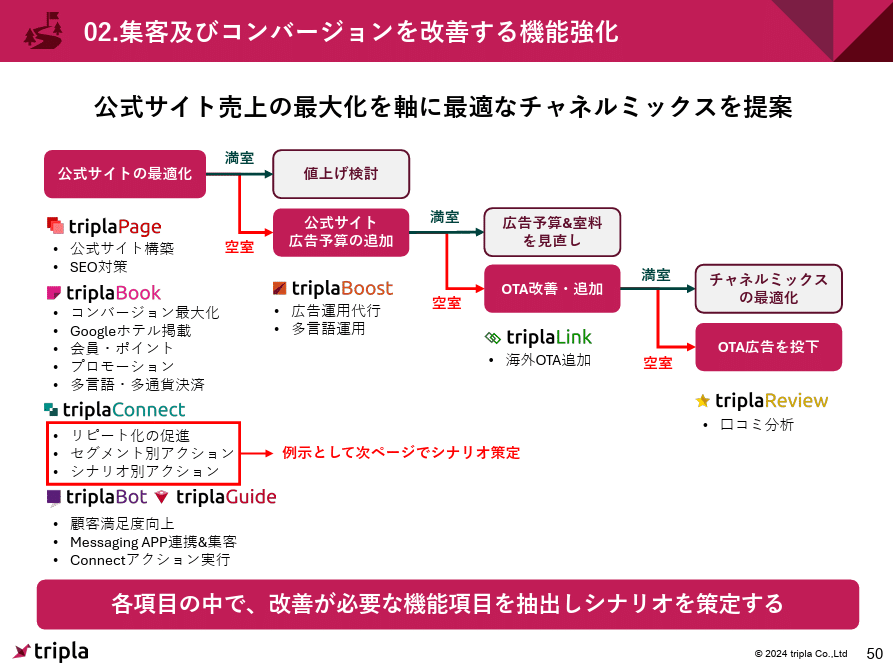

*顧客の業務プロセスを見せるパワポでフローチャートを使う例（Tripla株式会社のパワーポイント）*

> 引用元：[> 事業計画及び成長可能性に関する事項](https://contents.xj-storage.jp/xcontents/AS04848/b51a4e11/f7a6/4c92/8e02/77f1d4769125/140120241216539062.pdf)

*https://tripla.io/ir/presentations/*

### 顧客の業務をフローチャートで見せる

企業の商品やサービスは、食品や日用品のように提供価値がわかりやすいものばかりではありません。特にB2Bのサービスの場合、**企業のサービスが顧客のどのようなニーズに応えているのか**わかりづらいことも多いです。

そこで顧客の業務プロセスやニーズの全体像が見やすいように、パワポにフローチャートを作成します。**顧客の業務のフローチャートに対して、自社のサービスをプロットする**ことで、自社サービスの付加価値が見やすいデザインになるわけですね。

### サービス全体像をフローチャートで見せる

同じくB2Bサービスの場合、企業のサービスがどういったニーズに応えているかに加えて、どのように顧客に価値提供をしているかも、わかりづらいことが多いです。

そこで自社のサービスの全体像が見やすいように、パワポのフローチャートを作成します。**自社のサービスの全体像をフローチャートで見せる**ことで、自社のサービスが顧客に対して、どのように価値提供を行っているかが見やすいデザインになります。

### プロセスの強みをフローチャートで見せる

IR資料においては投資家に投資したいと思わせることが重要なので、自社の強みをアピールしていく必要があります。企業がマーケティングに強みを持っている場合、マーケティングプロセスの中でどのように強みを持っているのか、パワポに落とし込む必要があります。

そこで**一般的なマーケティングプロセスをフローチャートで記載してパワポに落とし込み、その中のどこに強みや差別化のポイントがあるのか**、なぜそうした強みがあるのかをフローチャート上にプロットします。

## 顧客プロセスのフローチャート見本３選

ここからは参考にしたい、かっこいいパワポのフローチャートのスライド例を紹介していきます。
まずは顧客の業務プロセスをフローチャートに落としたうえで自社サービスをプロットするパワポスライド例から見ていきましょう。

### フローチャートを細分化したパワポ例

まずはイルグルム株式会社のパワポのフローチャート例を見ていきましょう。2025年9月期決算説明資料のパワーポイント資料にある、中長期戦略のサービス進化に関するスライドです。

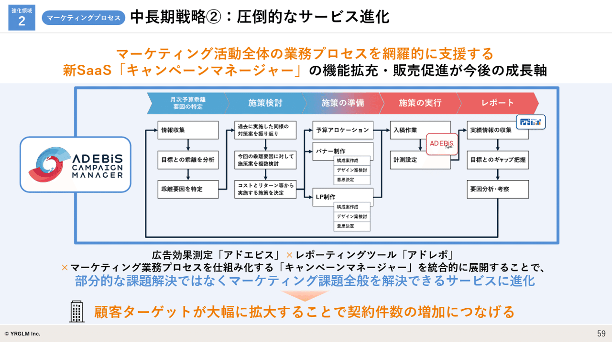
> 引用元：[> 2025年9月期決算説明資料](https://ssl4.eir-parts.net/doc/3690/tdnet/2708482/00.pdf)

*https://yrglm.co.jp/ir/library/presentation/*

パワポのフローチャートの特徴として、**顧客の業務プロセスがかなり細かく記載されています。**具体な業務は14個（より細かいものを入れると20個）に分解されており、フローチャート内にも矢印の枝分かれがあるなど、かなり詳細なパワポとなっています。

フローチャートを詳細に記載するデザインは、見やすいパワポではなくなることと引き換えに、読み手の理解度を高める効果があります。ここではより詳細なフローチャートを見せることで、**「顧客の広告効果測定をエンドツーエンドで支援できる」「広告効果の測定に関してかなりの知見がある」ということを示す**のが狙いだと思われますね。

またこのスライドのポイントとして、上部に業務フローの大枠を記載することで、**矢羽の大カテゴリとフローチャートの中小カテゴリという構造化**がされ、見やすい点が挙げられます。大カテゴリの矢羽をコーポレートカラーのグラデーションにすることで、かっこいいフローチャートのパワポに仕上げている点も見逃せません。

### シンプルなフローチャートのパワポ例

次は株式会社pluszeroのパワポのフローチャート例を見ていきましょう。2024年10月期通期 決算説明資料のパワーポイント資料にある成長戦略における新サービスの説明スライドです。

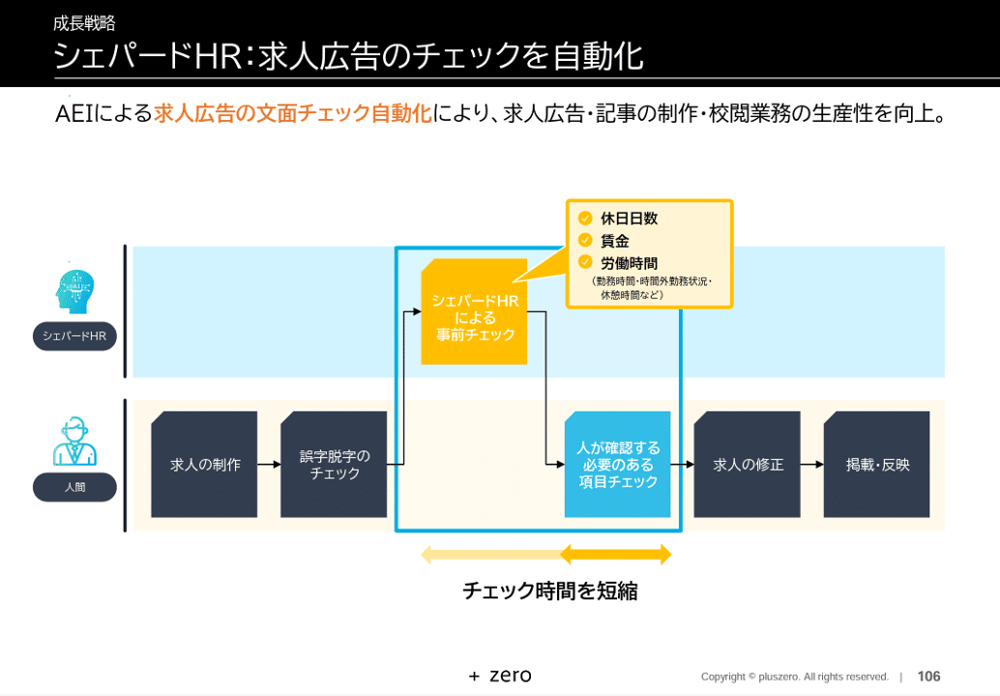
> 引用元：[> 2024年10月期通期 決算説明資料](https://contents.xj-storage.jp/xcontents/AS09142/fb77e3e2/d342/4ef7/9f3b/311c0b5c402a/140120241211536803.pdf)

*https://yrglm.co.jp/ir/library/presentation/*

パワポのフローチャートの特徴として、**顧客の業務プロセスが上下の２段に分かれてシンプルに記載されています。**フロー自体は枝分かれもなく、単純ですが、「シェパードHRによる事前チェック」のフローだけが上段に入り、それ以外のフローは下段に入っています。

フローチャートをシンプルに記載するデザインは、**ややスカスカなパワポである印象を与えかねない一方、伝えたいポイントを見やすい形で示せる**という効果があります。ここでは「人間が行う業務フローのうち一部をシェパートHRが代替しチェック時間を短縮する」ということを、フローチャートが上に移るようなデザインにすることで見せていますね。

このスライドのポイントとして、スカスカなパワポに見えないよう**上段の背景に水色を入れている**ことや、チェック全体を太い水色の枠で囲っていることが挙げられます。また**フローチャートの図形を四角ではなく求人票をイメージさせるデザイン**にしている点も、細かいですがカッコいいフローチャートのパワポにする工夫といえますね。

### フローチャートを比較するスライド例

最後はトヨクモ株式会社のパワポのフローチャート例を見ていきましょう。2024年12月期通期 決算説明資料のパワーポイント資料にある新サービスに関するスライドです。

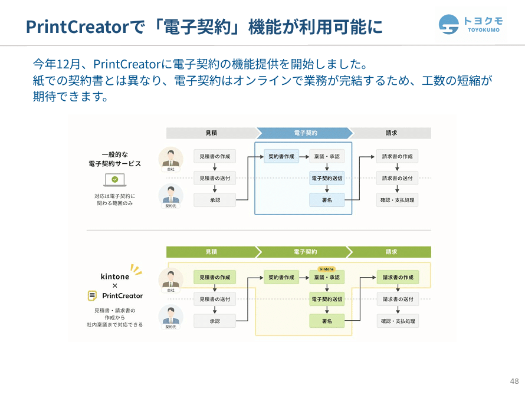
> 引用元：[> 2024年12月期 決算説明資料](https://toyokumo-ir.viewer.kintoneapp.com/public/file/inline/33953839687a69c2bfc7ea20f8e91bcc8f7aaac5889fcd66b0eeecfb1c5471ea/20250212071429F5334FE68EA44BA0A1EC81A757A3966B124)

*https://www.toyokumo.co.jp/ir/library*

パワポのフローチャートの特徴として、**顧客の業務プロセスのフローチャートを上下に記載して比較するというデザインになっています。**上のフローチャートでは一般的な電子契約のサービス範囲、下のフローチャートではトヨクモの電子契約のサービス範囲をプロットし比較しています。

**上下に同じフローチャートを置いて比較するデザインは、サービスの差分が見やすい**パワポにする上で非常に効果的です。サービスを比較するパターン以外に、ビフォーアフターで見せるデザインのパワポもよくあります。

このスライドのポイントとして、**フローチャートの箱を青色や黄緑色で塗るだけでなく、青や黄色のシャドウで網掛け**しています。パワポを一目見るだけで、通常のサービスと自社サービスの違いがすっきりと頭に入るデザインで、おしゃれなフローチャートのパワポとなっていますね。

## サービス全体像のフローチャート見本３選

お次は自社サービスの全体像をフローチャートで見せるパワポスライド例を見ていきましょう。

### フローチャートを細分化したパワポ例

まずは株式会社Veritas In Silicoのパワポのフローチャート例を見ていきましょう。2024年12月期 決算説明資料のパワーポイント資料にある事業紹介スライドです。

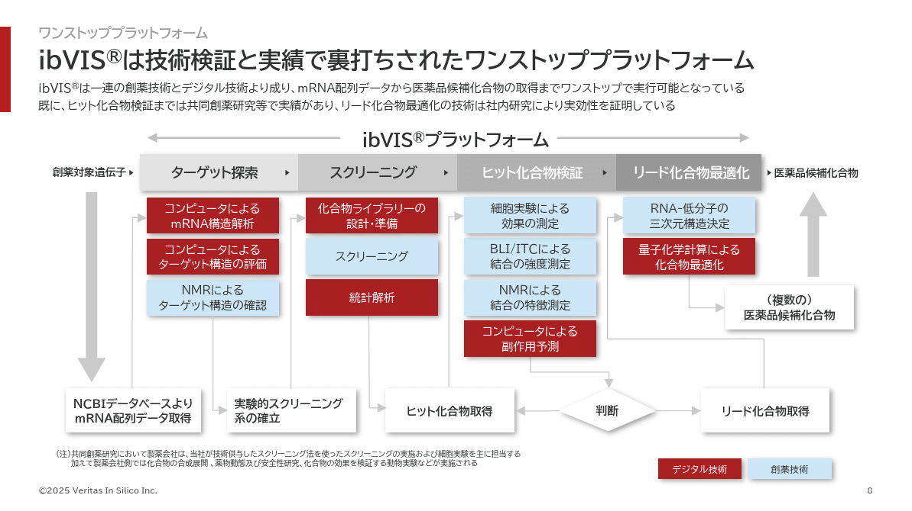
> 引用元：[> 2024年12月期 決算説明資料](https://contents.xj-storage.jp/xcontents/AS82025/8f7c5a8d/5e58/4432/a061/d987dde579b9/140120250213572315.pdf)

*https://www.veritasinsilico.com/ir/presentations/*

パワポのフローチャートの特徴として、創薬における医薬品候補化合物の特定までのサービスプロセスを詳細に記載しています。**フローチャートは18個に分解されており、創薬技術でサポートする部分と、製薬技術でサポートする部分が赤色と水色で塗り分けるデザイン**です。

イルグルム社と同様に、詳細なフローチャートを描くことで、読み手のビジネスに対する解像度を高めることを目的としたパワポデザインです。創薬のような複雑でわかりづらいビジネスモデルの説明をパワポでする際には、フローチャートは有効といえますね。

このスライドのポイントとして、**パワポのフローチャートが枝分かれする「判断」のところだけはひし形**を使っています。一般にフローチャートの分岐点はひし形を使うので、基本に忠実なパワポといえます。

また創薬対象遺伝子から、医薬品候補化合物が特定されるまでのフローを、**徐々に矢羽の色が濃くなるようにしている**一方、矢印は邪魔にならないよう薄いグレーに統一する等、カッコいいフローチャートのパワポにするための細かい工夫がされています。

### シンプルなフローチャートのパワポ例

次は共同ピーアール株式会社のパワポのフローチャート例を見ていきましょう。2024年12月期決算説明会のパワーポイント資料にあるＡＩ・ビッグデータソリューション事業を紹介しているスライドです。

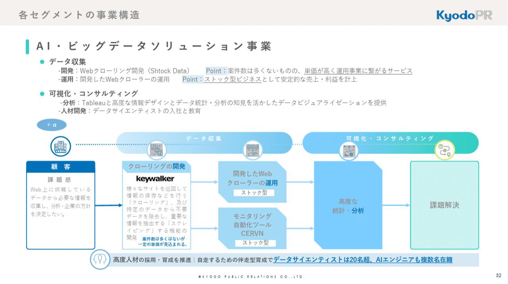
> 引用元：[> 2024年12月期　決算説明会（資料）](https://www.kyodo-pr.co.jp/wp/wp-content/uploads/2025/02/IR_20250214_04.pdf)

*https://www.kyodo-pr.co.jp/investor/event/explanation/*

パワポのフローチャートの特徴として、顧客の課題感からスタートし、課題解決に至るまで、**細かいことは記載せずどのように価値創造をするか**に焦点が絞られています。フローチャートの中の説明も、クローリングの開発を行うkeywalker以外はざっくり書かれており、コンセプチュアルなスライドとなっています。

ここではクローリングやスクレイピングという、**共同ピーアールならではのツールがAI・ビッグデータソリューションの核である、ということが伝わればよい**ので、余計な情報は最低限にして、シンプルなフローチャートのパワポにしていると考えられます。

ポイントとして、これまで同様にグラデーションを使っている点がまず挙げられます。フローチャートが進むにつれて青色が濃くなり、緑色の解決に到達します。**また「クローリングの開発」の部分のタイトルだけを六角形にし、その後のフローのボックスも六角形にすることで連続性を持たせる**デザインも、かっこいいフローチャートのパワポといえますね。

### 条件分岐するフローチャートのパワポ例

最後はTripla株式会社のパワポのフローチャート例を見ていきましょう。2024年12月期通期 決算説明資料のパワーポイント資料にあるサービス機能強化に関するスライドです。

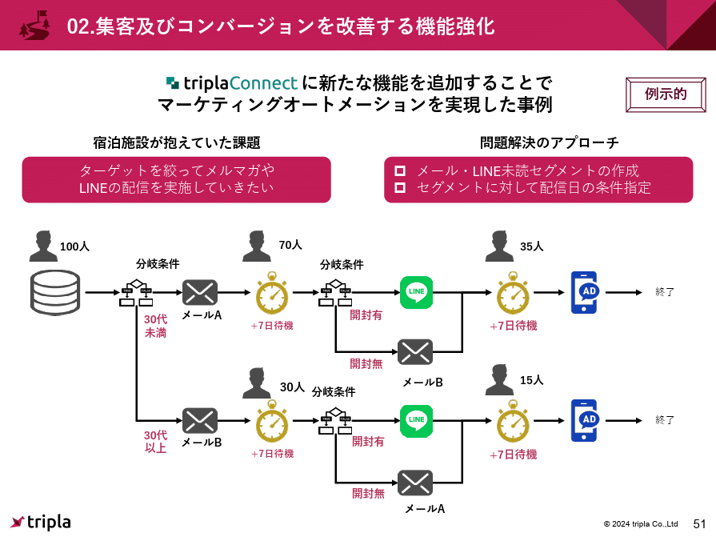
> 引用元：[> 2024年12月期 決算説明資料](https://toyokumo-ir.viewer.kintoneapp.com/public/file/inline/33953839687a69c2bfc7ea20f8e91bcc8f7aaac5889fcd66b0eeecfb1c5471ea/20250212071429F5334FE68EA44BA0A1EC81A757A3966B124)

*https://www.toyokumo.co.jp/ir/library*

パワポのフローチャートの特徴として、**条件分岐に伴う枝分かれが、見やすいデザインで整理**されています。パワポのフローチャートの最初に年代による枝分かれがあり、その後メールの開封有無で次の枝分かれがあり、それぞれで異なるコンタクト手法を取ることが一目でわかるデザインです。

ポイントとして、二度の条件分岐による枝分かれがあっても見やすいフローチャートになるよう、**左向きのフローの矢印が、縦に等間隔に並んで**います。加えて分岐の左矢印の直下に赤文字で分岐条件を入れていますが、これらの**赤文字の下にきちんと余白があるように、ゆとりある間隔**でフローの矢印が並んでいます。

ベーシックなアイコンと矢印のシンプルなフローチャートのパワポですが、間隔の開け方やアイコンと文字の色使いなどで見やすいデザインに仕上げている事例です。

## マーケティングのフローチャート見本３選

最後はマーケティングプロセスをフローチャートで見せているパワポの例を見ていきましょう。大枠は大きく変わりませんが、フローの切り分け方や配色に各社工夫が見られます。

### ビジネスモデルと連結したパワポ例

まずはおなじみ株式会社グッドパッチのパワポのフローチャート例を見ていきましょう。2025年9月期決算説明資料のパワーポイント資料にある特徴と優位性のスライドです。

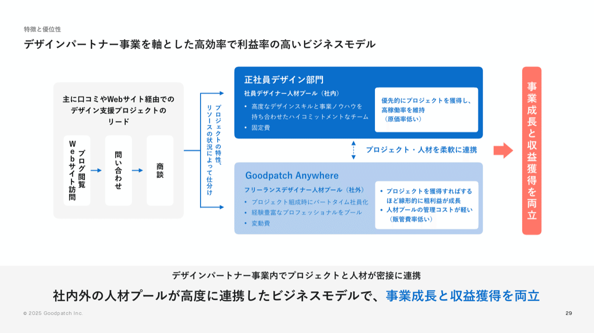
> 引用元：[> 事業計画及び成長可能性に関する説明資料](https://contents.xj-storage.jp/xcontents/AS04618/662fbbf6/604e/4be4/b960/9ea7719f3606/140120251126509865.pdf)

*https://yrglm.co.jp/ir/library/presentation/*

パワポのフローチャートの特徴として、**マーケティングプロセスのフローの先がサービス提供方法で分岐している点**が挙げられます。商談の先が、正社員デザイン部門とGoodpatch Anywhereというフリーランス人材活用部門に枝分かれしており、分岐の矢印に合わせて分岐条件が縦に書かれています。

デザイン上のポイントはいくつかありますが、下記の点のコンビネーションで、おしゃれなフローチャートのパワポになっていますので、参考にするとよいですね。

- 同系色の箱と矢印は接触させずに余白を作っている

- フローチャートの大枠は塗りつぶしの箱と白の箱にしている

- 枠線を入れていない

- メッセージは青色の文字で統一している

### マトリクス型フローチャートのパワポ例

次は株式会社ダイブのパワポのフローチャート例を見ていきましょう。2025年6月期 通期決算説明資料（事業計画及び成長可能性に関する事項）のパワーポイント資料の競争優位性のスライドです。

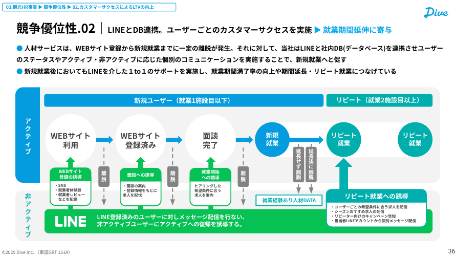
> 引用元：[> 2025年6月期 通期決算説明資料（事業計画及び成長可能性に関する事項）](https://ssl4.eir-parts.net/doc/151A/tdnet/2671665/00.pdf)

*https://dive.design/ir/library/presentation*

パワポのフローチャートの特徴として、**フローチャートの外側がマトリックスの構造となっており、その中でフローチャートが整理されている**というデザインになっています。縦軸がアクティブと非アクティブ、横軸が新規とリピートに分解されています。

ユーザーの利用までの流れをフローチャートで説明するパワポですが、離脱者が枝分かれして非アクティブにいくとLineでのナーチャリングに入り、再度アクティブになるようにアクションを起こしていくということが見やすいフローチャートです。

ターコイズブルーのコーポレートカラーとＬｉｎｅの緑色の相性が良いのもありますが、**新規ユーザーは青色、ラインは緑色、リピートユーザーはそれらが合わさったターコイズブルーというデザイン**がかっこいいフローチャートのパワポです。

### ループするフローチャートのパワポ例

最後はアミタホールディングス株式会社のパワポのフローチャート例を見ていきましょう。2024年12月期通期の決算説明会資料のパワーポイント資料にある営業戦略に関する振り返りのスライドです。

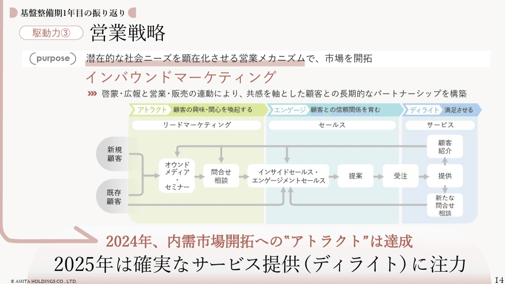
> 引用元：[> 説明会資料](https://www.amita-hd.co.jp/ir/pdf/20250313.pdf)

*https://www.amita-hd.co.jp/ir/meeting.html*

パワポのフローチャートの特徴として、**フローの最後から途中へと矢印が戻る、ループ型のデザイン**になっています。サービス提供後に「顧客紹介」「追加発注」の流れがありますが、顧客紹介の方は矢印が枝分かれし、セミナー、問い合わせ、インサイドセールスとフローチャートの一部にループします。

ポイントとしては、マーケティングプロセスをアトラクト、エンゲージ、ディライトの３つのフェーズに分解し、**それぞれのフェーズの矢羽と背景の色を黄緑色、青緑色、青色と変えている**点が挙げられます。結果として、パワポが構造化されていて見やすいフローチャートになるだけでなく、色合いのキレイなカッコいいフローチャートとなっています。

またこのパワポの特徴として、少し変わったレイアウトが挙げられます。ボディのフローチャートの下にスライドメッセージが来るレイアウトですが、**左上からメッセージへとつながる矢印が伸び、ボディ全体もやや右に寄っています。**非常にかっこいいレイアウトですが、やや上級者向けですね。
なおパワポのレイアウトについて参考になる事例を見たい方は、【マネしたい】おしゃれなパワポのスライド「レイアウト」９選のNoteをどうぞ。

## パワポのフローチャートの作り方

ここまでフローチャートを使った様々なパワーポイントの事例を見てきましたが、最後に簡単にだけかっこいいフローチャートの作り方のポイントを説明します。
こだわりだすときりがないので、初心者向けのポイントを解説しますが、**かっこいいパワポのフローチャートを作成するにあたってまず意識すべきは以下の３つのポイント**です。

- フローチャートのフローはサイズと上下左右をそろえる

- フローチャートのフローの間隔は広く取り等間隔にする

- フローチャートの矢印は水平あるいは垂直にする

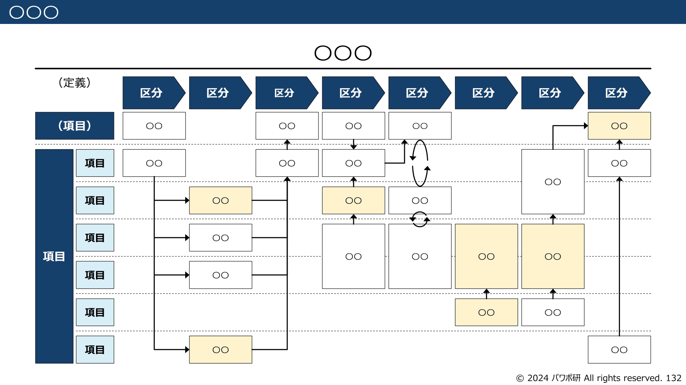
*パワポ研のテンプレート集に入っているフローチャート見本*

### フローチャートのサイズと位置を揃える

カッコいいパワポのフローチャートを作るうえでは、フローチャート全体の統一感が重要です。その意味で、**フローチャートの各ステップの上端や左端はそろっている必要**があります。

そこでポイントになる機能が、**「図形の書式設定」の「サイズ」「配置」の二つの機能**です。箱をすべて選んで「サイズ機能」で全体のバランスを調整しつつ、配置機能の「上揃え」の機能で整えます。

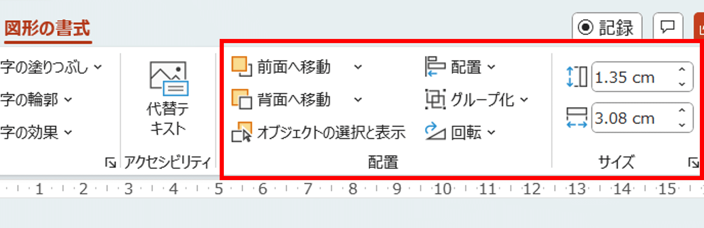
*図形の書式設定のサイズと配置*

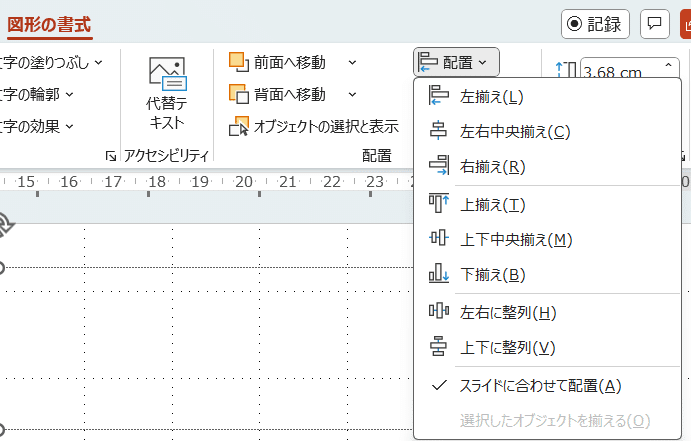
*図形の書式設定の配置の詳細*

### フローチャートの間隔を揃える

カッコいいパワポのフローチャートを作るうえでは、**フローチャートの各ステップの箱はきれいに整列されている必要**があると説明しましたが、フローチャートの間隔も重要です。間隔が統一されていることで、フローチャートが締まり、かっこいい印象を与えられます。

使う機能はほとんど同じです。「図形の書式設定」の「配置」の機能のうち「左右に整列」「上下に整列」の機能を使って整えます。

### 矢印を水平や垂直にする

カッコいいパワポのフローチャートを作るうえでは、矢印が水平や垂直な方がよいです。逆に矢印が少しずれていると、すこぶる微妙な印象になります。

ポイントとしては、フローチャートの矢印を使う際に、箱の辺の真ん中にある自動調整ポイントに接続することです。下の絵のように、**図形の矢印でテキストをつなぐ際に、緑の点が出てくるポイントに矢印をつなぎ**ましょう。
既に箱同士が綺麗に整列していれば、この自動調整の機能を使うことで、矢印が自然に水平あるいは垂直になります。

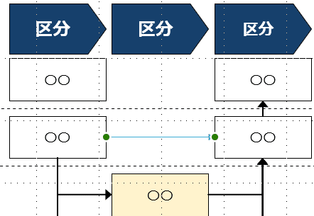
*直線で図形の*

またフローチャートの矢印が直線でない場合は、**同じく自動で位置を調整してくれる、パワポのコネクタ線を使って**図形同士を接続しましょう。パワポのコネクタ線を使えば、矢印は自動で水平垂直になるようにできています。

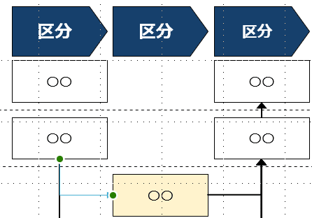
*コネクタ線（緑の点と緑の点をつなぐ線）*

## 【マネしたい】カッコいいパワポの「フローチャート」スライド９選まとめ

かっこいいパワポのフローチャートの事例を、フローチャートの使用目的別に分けて紹介してきました。複雑なものもシンプルなものも紹介してきましたが、**フローチャートを使う目的によって、どういったフォーマットを選ぶべきか**、理解が深まったのではないかと思います。
そのあとに少し補足した、パワーポイントのどの機能を使うと、かっこいいパワポのフローチャートになるかの部分は、明日から使えるテクニックだと思いますので、ぜひ実践してみてくださいね。
またNote内で紹介したパワポ研テンプレートは、販売しているテンプレート集の中にあるので、気になる方はストアを見てみてください。

## パワポ研オリジナルテンプレート

パワポ研では、「ビジネスシーンで使える」パワーポイントテンプレートを公開しております。デザインを整えるのみならず、**ロジックやストーリーを整理するのにも役立つパッケージ**になっておりますので、関心のある方は下記ページも併せてご覧ください！

上記の記事のように、noteでは**フォローしているだけでビジネスにおける「資料作成のコツ」と「デザインのセンス」が身に付くアカウント**を目指して情報配信を行っています。
今後もコンスタントに記事を配信していく予定なので、関心のある方は是非アカウントのフォローをお願いします！

**> Template販売　**[> https://powerpointjp.stores.jp/](https://powerpointjp.stores.jp/%EF%BF%BCnote)
**> note　**[> パワポ研の資料作成術](https://note.com/powerpoint_jp/m/mc291407396da)
**> X（旧Twitter)　**[> https://twitter.com/powerpoint_jp](https://twitter.com/powerpoint_jp)

## レックスアドバイザーズからのお知らせ

パワポ研は株式会社レックスアドバイザーズが運営しています。
レックスアドバイザーズは**経営企画職や経営管理職に特化した転職エージェント**です。
上場企業や上場準備企業を中心に、**経営企画、IR、経理財務、法務、内部監査等の職種の求人**をご紹介しているほか、**CFOなどのコンフィデンシャル求人**もご紹介可能です。
またコンサルティングファームや監査法人、会計事務所の求人も豊富にあるため、プロフェッショナルファームを目指す方のご支援も得意です。
求人紹介やキャリア相談を希望の方は、[**無料転職サポート**](https://www.career-adv.jp/job_search/entryform_exp/)よりサービス利用登録をしてみてください。

*レックスアドバイザーズのサービスサイトはこちらから*

**> 求人をご希望の方　**[> 無料転職サポート](https://www.career-adv.jp/job_search/entryform_exp/)**
> 採用支援をご希望の方　**[> 採用サポート](https://www.career-adv.jp/request3/)
**> その他　**[> お問い合わせフォーム](https://www.rex-adv.co.jp/contact)
**> 書籍　**[> 注目企業の実例から学ぶパワポ作成術](https://www.amazon.co.jp/dp/4046060476)

