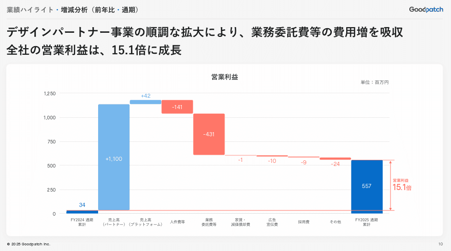
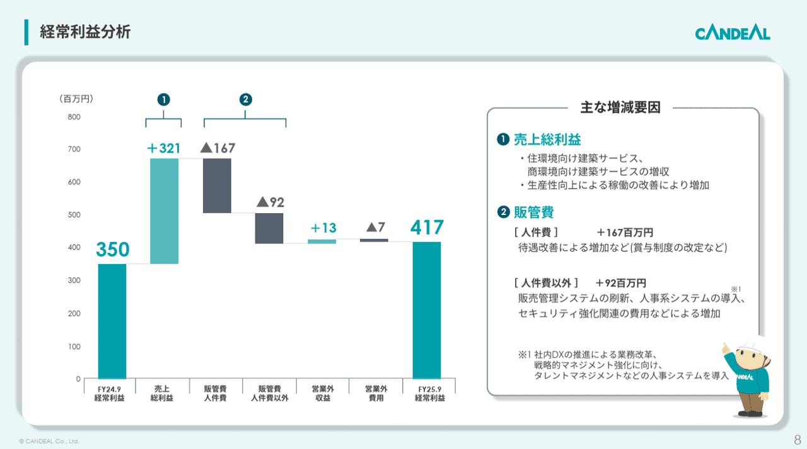
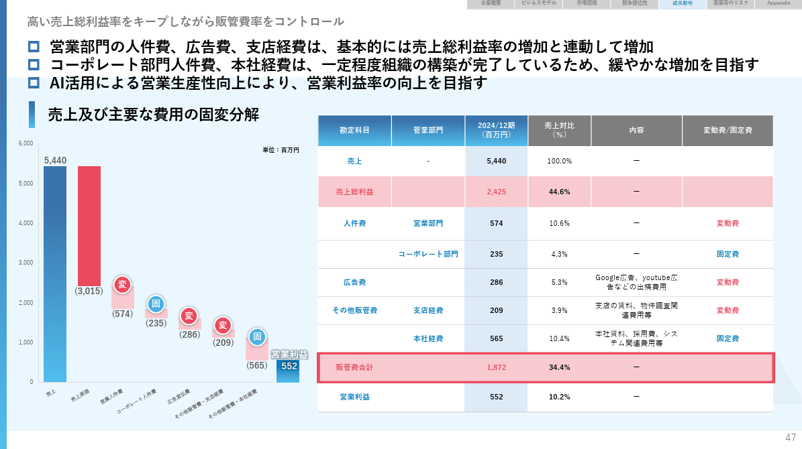
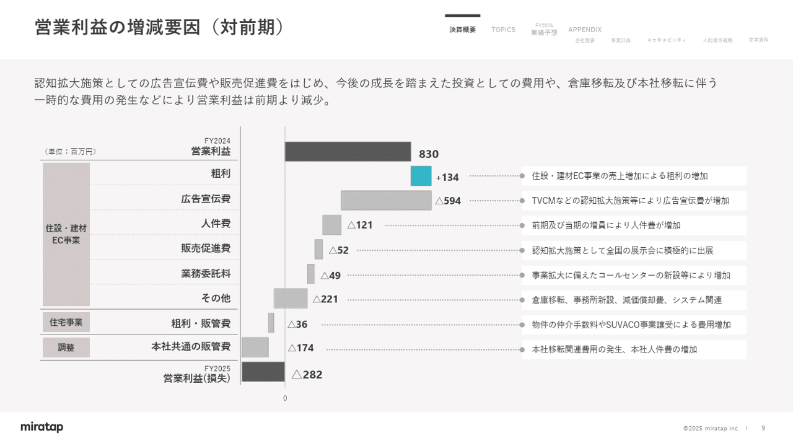
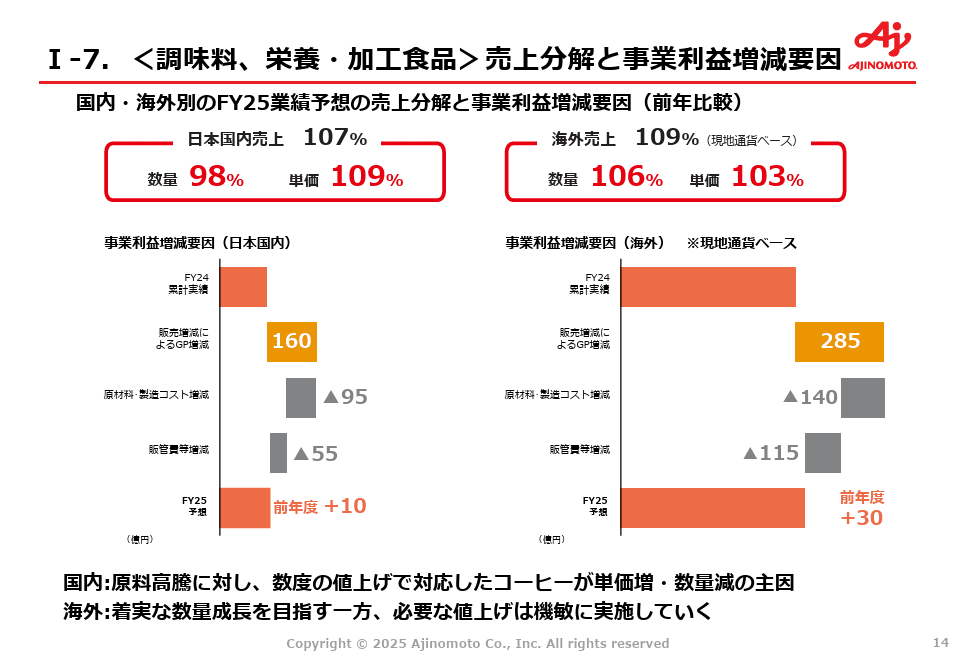
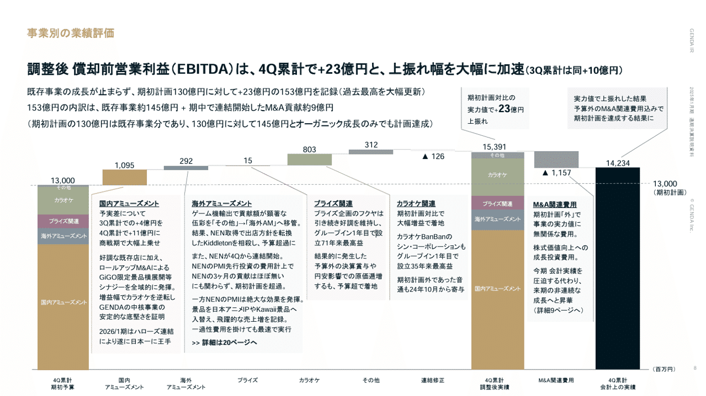
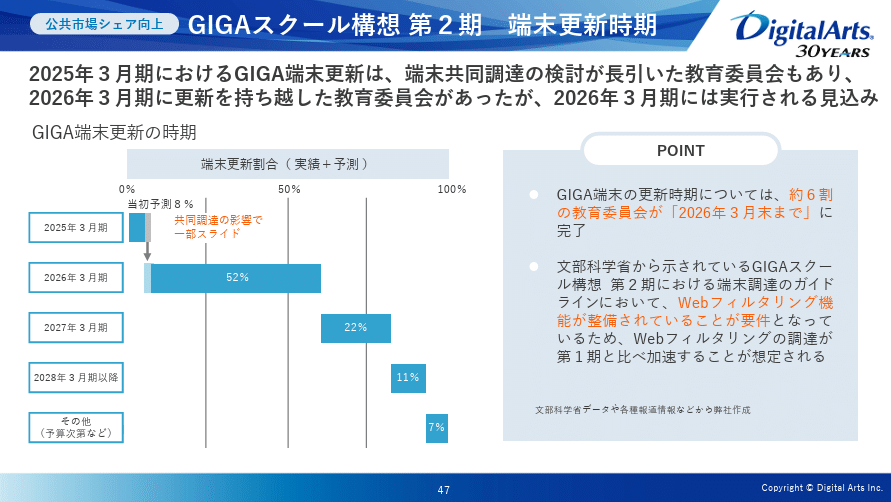
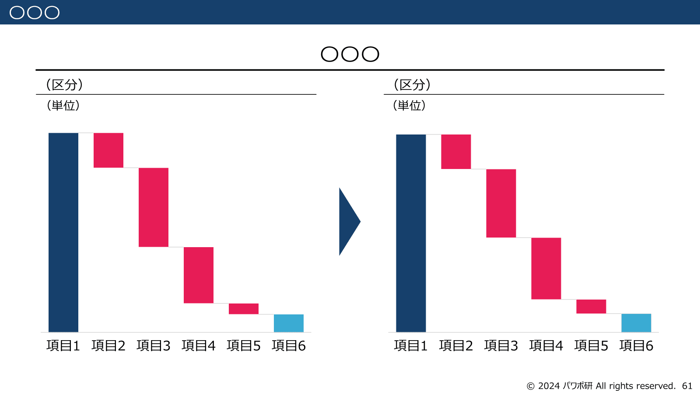
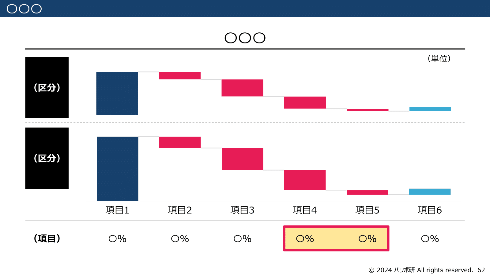

# 【マネしたい】カッコいいパワポの「ウォーターフォールグラフ」「滝グラフ」スライド９選 （2025年更新）

[note原文](https://note.com/powerpoint_jp/n/nf87a1ea252ce)

みなさんこんにちは。
資料デザインのリサーチや分析に取り組むパワーポイントのスペシャリスト、パワポ研です。

今回は、**パワポの「ウォーターフォールグラフ」「滝グラフ」スライドに焦点を当て、上場企業のIR資料から参考になりそうな抜粋**して紹介していきます。

テーマ別スライドのまとめ記事はこちら。

ウォーターフォールグラフや滝グラフといきなり言われても、どのような図なのかイメージしづらい人もいると思うので、最初にウォーターフォールグラフとはなにか、特徴をまとめておきます。

## ウォーターフォールグラフとは

ウォーターフォールグラフ（別名滝グラフ）とは、二つの数字を比較する際に、その内訳を図として可視化するデザインのグラフです。
滝グラフ以外にも様々な呼び名があるのでいかにまとめておきますね。

- ウォーターフォールグラフ

- ウォーターフォールチャート

- ウォーターフォール図

- 滝グラフ

### ウォーターフォールグラフの使い方

ウォーターフォールグラフは、売上や営業利益といったKGIに対して、**前年度と今年度や目標値と実績値を比較して図解したい場合**によく使われます。
あるいは下の例のように、売上から営業利益までのPLの構造を見せる場合にもウォーターフォールグラフが有効です。

*株式会社グッドパッチのウォーターフォールチャート*

> 引用元：[> 2025年８月期 通期決算説明資料](https://contents.xj-storage.jp/xcontents/AS04618/30ba49e0/124b/4772/828d/3e3b8b3ef180/20251016131652962s.pdf)

*https://goodpatch.com/ir/presentation*

目標と実績の差分の内訳を分解して図説する際に、それぞれの項目が図として分解されていると視覚的に理解しやすいですよね。
そこで目標や前年実績などのスタート地点から、マイナスの場合は下に、プラスの場合は上に、項目を一つずつ右に伸ばしていきます。右に行くにつれ、徐々に下がっていく図が滝のように見えることから、ウォーターフォールグラフや滝グラフと呼ばれるわけです。

もちろん滝グラフと言いつつも、右に向けて上昇していくような図になることもよくあります。この場合は積み上げウォーターフォールグラフといった呼び方をすることが多いです。

### ウォーターフォールグラフの作り方

ウォーターフォールグラフを作る際には、大きく３つのステップに分けて考えるとよいです。先ほどのスライドを例にとってみましょう。

- ウォーターフォールチャートのスタート地点の棒グラフを作成する。ここでは「FY24 通期累計」の営業利益になります。

- ウォーターフォールチャートのスタートとゴールの差分を比較できるように内訳に分解する。**内訳ごとに右に向けて積み上げて図にする。
**上のウォーターフォールチャートの例では大カテゴリとして売上増とコスト増、小カテゴリとして売上増をパートナーとプラットフォームに、コスト増を人件費や業務委託費等に分解して比較できるようにしています。

- ウォーターフォールチャートのスタート地点の数値と積み上げた数値を合計し、棒グラフを作成する。ここでは合計値が「FY25 通期累計」の営業利益になります。

繰り返しですが、ウォーターフォールグラフは、２つの数字を比較し、差分の内訳を図解するために使われます。なので、**内訳がわかりやすく図解されていること、必要十分な補足がされていること**を意識して、作成するように心がけましょう。

今回の事例紹介では、こうした「見やすさ」や「情報のリッチさ」に焦点を当てて、参考になるウォーターフォールグラフを紹介していきますよ。

## 基本のウォーターフォール図のパワポ例３選

まずはパワポのウォーターフォールグラフの基本スライドから見て行きましょう。スタート地点からゴール地点に向けて、差分が図として積みあがっていくグラフや、滝のように落ちていくグラフです。

### 積み上げウォーターフォールグラフの例

まずは株式会社キャンディルのパワポにおけるウォーターフォールグラフのチャート例から見ていきましょう。
2025年９月期 決算補足説明資料のパワーポイントにある、経常利益分析のチャートです。

*株式会社キャンディルのウォーターフォールグラフのスライド*

> 引用元：[> 2025年９月期 決算補足説明資料](https://contents.xj-storage.jp/xcontents/AS81246/4e55549a/ad8e/42ab/a080/3938ca4896e4/140120251111596859.pdf)

*https://www.candeal.co.jp/ir/irlibrary/*

パワポの「積み上げウォーターフォールグラフ」の特徴としては、**ウォーターフォールグラフと詳細のテキストが独立して記載されている点**が挙げられます。要素の「売上総利益」と「販管費人件費」「販管費人件費以外」にナンバーが振られており、詳細が右側の「主な増減要因」の中に構造化されてテキストで整理されています。

全体的にシンプルなデザインのウォーターフォール図となっており、要素の中でも変化の大きい部分を右側に切り出すことで、すっきりと見やすいスライドに仕上がっています。

### 事業別ウォーターフォールグラフの例

次はウェルネオシュガー株式会社のパワポにおけるウォーターフォールグラフのチャート例を見ていきましょう。
2025年3月期決算・中期経営計画説明会 資料のパワーポイントにある、2025年３月期決算・業績要因分析（営業利益の増減理由）のチャートです。

*ウェルネオシュガー株式会社のウォーターフォールグラフのスライド*

> 引用元：[> 2025年3月期決算・中期経営計画説明会 資料](https://ssl4.eir-parts.net/doc/2117/ir_material_for_fiscal_ym3/180104/00.pdf)

*https://www.wellneo-sugar.co.jp/ir/library/explain/*

パワポの「積み上げウォーターフォールグラフ」の特徴としては、**ウォーターフォールの内訳を事業と全社費用に分解して増減を比較している点**が挙げられます。ウォーターフォールの内訳を「Sugar」「Food ＆ Wellness」「全社費用」という大カテゴリに分けて図解しています。「Food ＆ Wellness」の中はフードサイエンス事業、フィットネス事業、その他に分かれて比較できるようになっています。

配色は淡い色が基軸になっており、積み上げウォーターフォールグラフのスタートとゴールは淡い緑色、Sugarは淡い赤色、Food ＆ Wellnessは淡い青色、全社費用は淡い紫色となっています。Sugarの赤色とFood & Wellnessの青色を混ぜると紫色になるので、全社費用は紫色になっているのかもしれません。

### 費用内訳のウォーターフォールグラフの例

続いて株式会社AlbaLinkのパワポにおけるウォーターフォールグラフのチャート例を見ていきます。
2025年12月期決算補足説明資料のパワーポイントにある、高い営業利益率をキープしながら販管費率をコントロールのチャートです。

*株式会社AlbaLinkのウォーターフォールグラフのスライド*

> 引用元：[> 2025年12月期決算補足説明資料](https://ssl4.eir-parts.net/doc/5537/tdnet/2762970/00.pdf)

*https://albalink.co.jp/ir/news/*

パワポの「滝グラフ」の特徴としては、**ウォーターフォールの内訳を変動費と固定費に分けて比較している点**が挙げられます。ウォーターフォールの内訳である「営業人件費」「広告宣伝費」「その他販管費・支店経費」には変動費のラベル、「コーポレート人件費」「その他販管費・本社経費」には固定費のラベルを貼っています。

固定費と変動費を分けて比較する場合、滝グラフの内訳の色を変える方法と、ラベルを貼る方法があります。ラベルの方がややうるさくはなりますが、直感的に内訳を理解しやすいようになっています。また滝グラフと表を合わせることで、詳細の比較がしやすいようになっています。

## 横向きウォーターフォール図のパワポ例３選

続いてウォーターフォールグラフを横向きで使っているスライドを見ていきましょう。横向きなのでもはや落ちていないのですが、ウォーターフォールグラフあるいは滝グラフとそのまま呼ばれます。

滝グラフとよく呼ばれるように、ウォーターフォールグラフは縦向きで使われることが多いのですが、**横向きで使うことによって、内訳ごとの補足や詳細をテキストで入れやすいというメリット**があります。それ以外にも、**複数のウォーターフォールグラフを比較しやすいといったメリット**もありますね。
それこそコンサルティングファームでは、「文章は２行に収める」という鉄の掟があるので、ビジネスDDで滝グラフを使う際には横向きウォーターフォールグラフになることが多いです。

### 横向きウォーターフォールグラフの例

まずは株式会社ミラタップのパワポにおける横向きウォーターフォールグラフのチャート例から見ていきましょう。
事業計画及び成長可能性に関する事項のパワーポイントにある、営業利益の増減要因（対前期）のチャートです。

*株式会社ミラタップの横向きウォーターフォールグラフのスライド*

> 引用元：[> 事業計画及び成長可能性に関する事項](https://ssl4.eir-parts.net/doc/3187/ir_material_for_fiscal_ym2/194072/00.pdf)

*https://info.miratap.co.jp/ir/news.html*

パワポの「横向きウォーターフォールグラフ」の特徴としては、**ウォーターフォールの内訳ごとに詳細をテキストで記載している点**が挙げられます。「粗利」「広告宣伝費」「人件費」「販売促進費」「業務委託料」「その他」「住宅事業」「調整」それぞれから右に線が伸び、それぞれ１行で前期との比較がされています。

グレーの背景にグレーベースの横向きウォーターフォールグラフを使いつつ、営業利益の増加に貢献している粗利をターコイズブルー、テキストは背景を白色にすることでうまくメリハリをつけています。

### 横向きウォーターフォールと表のパワポ例

続いて株式会社Ｊオイルミルズのパワポにおける横向きウォーターフォールグラフのチャート例を見ていきます。
2025年3月期 通期決算概況のパワーポイントにある、2024年度　営業利益増減分析のチャートです。

*株式会社Ｊオイルミルズの横向きウォーターフォールグラフのスライド*

> 引用元：[> 2025年3月期 通期決算概況](https://ssl4.eir-parts.net/doc/2613/tdnet/2609771/00.pdf)

*https://www.j-oil.com/ir/library/presentation.html*

パワポの「横向きウォーターフォールグラフ」の特徴としては、**ウォーターフォールの内訳ごとに表で詳細を比較している点**が挙げられます。油脂事業の内訳として家庭用と業務用で販売価格と販売数量がどう変化したか、スペシャリティフード事業の内訳として乳系PBFと食品素材の販売価格と販売数量と原材料他がどう変化したか、前期と比較する表で説明しています。

ウォーターフォールグラフ**を横向きにし、かつかなり小さくすることによって**、右側に大きめの余白ができるため、割としっかりした表を入れることができていますね。

### 横向きウォーターフォールグラフの比較例

次は味の素株式会社のパワポにおける横向きウォーターフォールグラフのチャート例です。
プレゼンテーション資料のパワーポイントにある、＜調味料、栄養・加工食品＞売上分解と事業利益増減要因のチャートを見てみましょう。

*味の素株式会社の横向きウォーターフォールのスライド*

> 引用元：[> プレゼンテーション資料](https://www.ajinomoto.co.jp/company/jp/ir/event/presentation/main/011111111/teaserItems1/00/linkList/03/link/FY24Q4_Presentation__J.pdf)

*https://www.ajinomoto.co.jp/company/jp/ir/event/presentation.html*

パワポの「横向きウォーターフォールグラフ」の特徴としては、**複数のウォーターフォールを並べて比較できるようになっている点**が挙げられます。
「FY24累計実績」「販売増減によるGP増減」「原材料・製造コスト増減」「販管費増減」「FY25予想」というウォーターフォール構造で、左右に日本国内売上と海外売上を並べることで、国内と海外を比較できるようにしています。

**項目だけでなく、内訳のスケールを同じにしている点もポイントです**。**
**スケールが同じなので視覚的あるいは直感的にウォーターフォールグラフを比較することができています。また横向きの場合は棒グラフのタイトルを削ればよりウォーターフォールの面積を大きくできますし、３つのグラフを並べるデザインも可能になります。

## 応用のウォーターフォール図のパワポ３選

最後はウォーターフォールグラフを使った応用チャートを見ていきましょう。滝グラフと積み上げグラフのコンビネーション、滝グラフを複数重ねる、ウォーターフォールグラフを100％グラフ的に使うなど、参考になるチャート例を紹介します。

### 詳細が伝わるウォーターフォール図の例

まずは株式会社GENDAのパワポにおけるウォーターフォールグラフのチャート例を見ていきましょう。
2025年1月期通期決算説明資料のパワーポイントにある、事業別の業績評価のチャートです。

> 引用元：[> 2025年1月期通期決算説明資料](https://ssl4.eir-parts.net/doc/9166/ir_material_for_fiscal_ym/175360/00.pdf)

*https://genda.jp/ir/library/presentation/*

パワポの「積み上げウォーターフォールグラフ」の特徴としては、**ウォーターフォールの内訳を詳細に記載比較している点**が挙げられます。
「国内アミューズメント」「海外アミューズメント」「プライズ関連」「カラオケ関連」「M&A関連費用」をそれぞれ詳細に図解しています。余白の使い方が上手いので、ビジーなスライドながらそこまで見にくくなっていません。

複数の工夫がみられるウォーターフォール図ですが、**スタート地点の棒グラフと合計の棒グラフにも内訳を示している点も見やすさにつながっています**。国内アミューズメント、海外アミューズメントなど事業ごとに変化の内訳を示していますが、そこでの配色を合計の内訳でも使っています。

### 複数のウォーターフォール図のパワポ例

続いて東レ株式会社のパワポにおけるウォーターフォールグラフのチャート例を見ていきます。
2025年3月期決算の概要と2026年3月期見通しについてのパワーポイントにある、AP-G 2025の進捗状況のチャートです。

*東レ株式会社のウォーターフォールグラフのスライド*

> 引用元：[> 2025年3月期決算の概要と2026年3月期見通しについて](https://www.toray.co.jp/ir/pdf/lib/lib_a643.pdf)

*https://www.toray.co.jp/ir/library/data/*

パワポの「積み上げウォーターフォールグラフ」の特徴としては、**ウォーターフォールグラフを複数組み合わせている点**が挙げられます。
2022年実績からスタートして、一旦2024年でウォーターフォールグラフの合計があり、そこから2025見通し、時期中計目標と、それぞれ内訳が積みあがって合計値になっています。

ウォーターフォールチャートは１年間の比較しかできないわけではありません。場合によっては**３年間の差分を１年ごとに２年分見せることもできますし、そこからさらに長期目標へのギャップも図示すること**もできます。ローリングの計画についてウォーターフォールグラフで表現したい場合に有効な使い方といえますね。

### デジタルアーツ株式会社のウォーターフォールチャート例

最後はデジタルアーツ株式会社のパワポにおけるウォーターフォールグラフのチャート例を見ていきます。
2025年3月期 決算短信 補足資料のパワーポイントにある、GIGAスクール構想 第２期　端末更新時期のチャートです。

*デジタルアーツ株式会社の横向きウォーターフォールのスライド*

> 引用元：[> 2025年3月期 決算短信 補足資料](https://www.daj.jp/ir/data/daj2326_202503_4q_ref.pdf)

*https://www.daj.jp/ir/news/result/*

パワポの「横向きウォーターフォールグラフ」の特徴としては、**100％グラフとウォーターフォールグラフの組み合わせで、スタートと合計のグラフがない点**が挙げられます。
GIGA端末の更新時期ごとにどの程度調達が進捗するのか、横向きのウォーターフォールで見せています。

棒グラフで見せることもできるチャートではありますが、進捗を見せるチャートでもあるためウォーターフォールを使っています。プロジェクト進捗などを見せる上で面白い見せ方なので、覚えておいて損はないでしょう。

## 【マネしたい】カッコいい「ウォーターフォールグラフ」「滝グラフ」スライド９選まとめ

ウォーターフォールチャートはシンプルに見えて、デザインによっては情報をリッチにできることや、より拡張して多くの情報をパワーポイント上で示すことができるのが伝わったのではないかと思います。また横向きウォーターフォールグラフの有用性も伝わったのではないでしょうか。

ちなみに**パワポ研で提供しているテンプレート集には、以下のようなそのまま使える「ウォーターフォールグラフ」「滝グラフ」のテンプレートもあります**ので、気になる方は下で紹介しているオリジナルテンプレートのNoteも見てみてくださいね。

*パワポ研オリジナルテンプレート集の変化のウォーターグラフ例*

*パワポ研オリジナルテンプレート集の比較のウォーターグラフ例*

## パワポ研オリジナルテンプレート

パワポ研では、「ビジネスシーンで使える」パワーポイントテンプレートを公開しております。デザインを整えるのみならず、**ロジックやストーリーを整理するのにも役立つパッケージ**になっておりますので、関心のある方は下記ページも併せてご覧ください！

上記の記事のように、noteでは**フォローしているだけでビジネスにおける「資料作成のコツ」と「デザインのセンス」が身に付くアカウント**を目指して情報配信を行っています。
今後もコンスタントに記事を配信していく予定なので、関心のある方は是非アカウントのフォローをお願いします！

**> Template販売　**[> https://powerpointjp.stores.jp/](https://powerpointjp.stores.jp/%EF%BF%BCnote)
**> note　**[> パワポ研の資料作成術](https://note.com/powerpoint_jp/m/mc291407396da)
**> X（旧Twitter)　**[> https://twitter.com/powerpoint_jp](https://twitter.com/powerpoint_jp)

## レックスアドバイザーズからのお知らせ

パワポ研は株式会社レックスアドバイザーズが運営しています。
レックスアドバイザーズは**経営企画職や経営管理職に特化した転職エージェント**です。
上場企業や上場準備企業を中心に、**経営企画、IR、経理財務、法務、内部監査等の職種の求人**をご紹介しているほか、**CFOなどのコンフィデンシャル求人**もご紹介可能です。
またコンサルティングファームや監査法人、会計事務所の求人も豊富にあるため、プロフェッショナルファームを目指す方のご支援も得意です。
求人紹介やキャリア相談を希望の方は、[**無料転職サポート**](https://www.career-adv.jp/job_search/entryform_exp/)よりサービス利用登録をしてみてください。

*レックスアドバイザーズのサービスサイトはこちら*

**> 求人をご希望の方　**[> 無料転職サポート](https://www.career-adv.jp/job_search/entryform_exp/)**
> 採用支援をご希望の方　**[> 採用サポート](https://www.career-adv.jp/request3/)
**> その他　**[> お問い合わせフォーム](https://www.rex-adv.co.jp/contact)
**> 書籍　**[> 注目企業の実例から学ぶパワポ作成術](https://www.amazon.co.jp/dp/4046060476)

