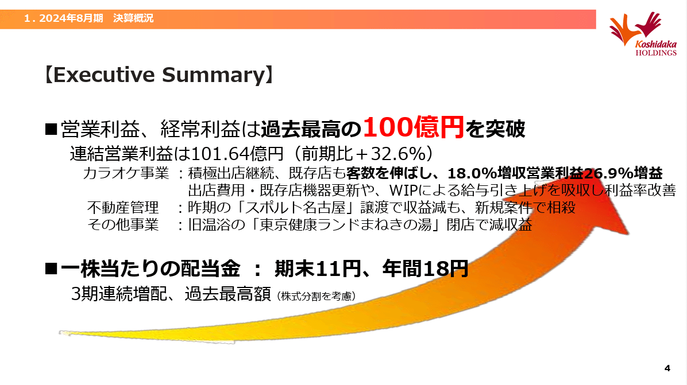
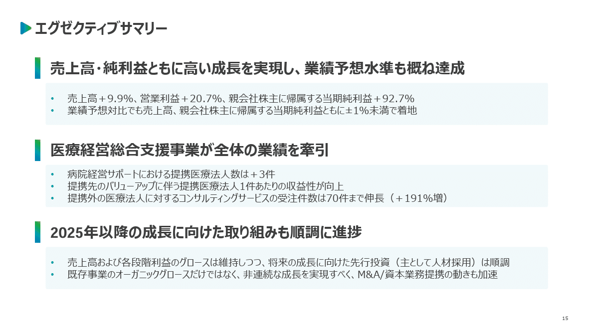
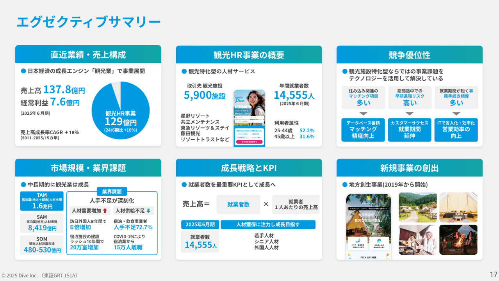
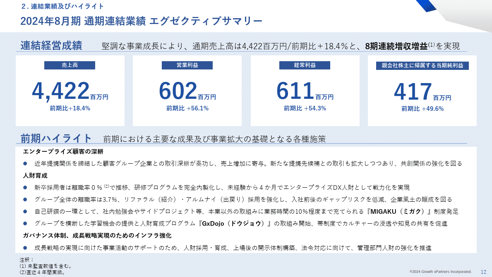
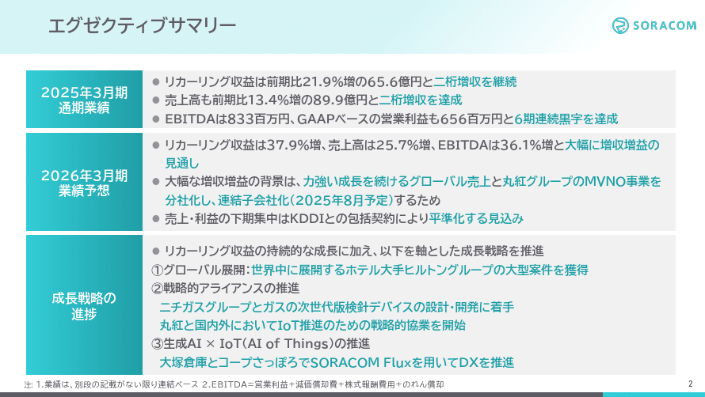
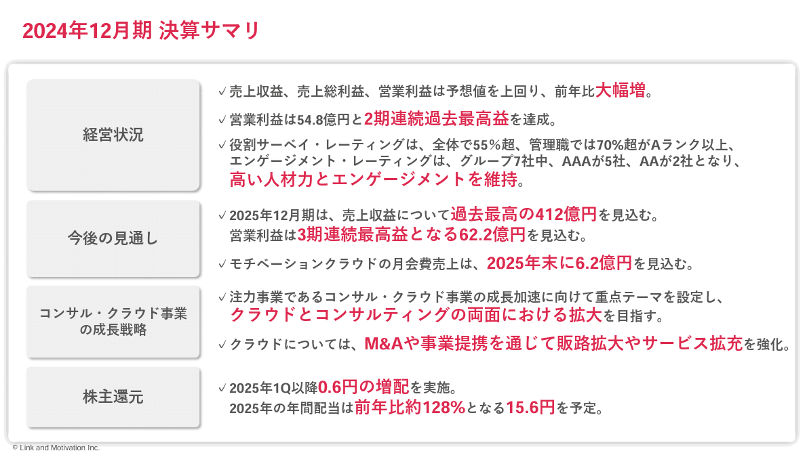
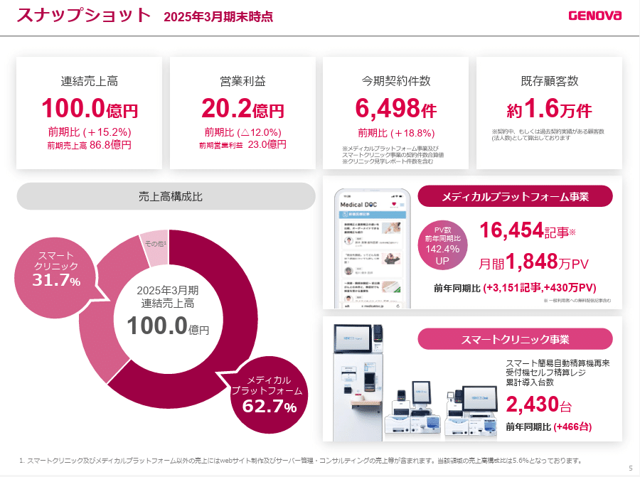
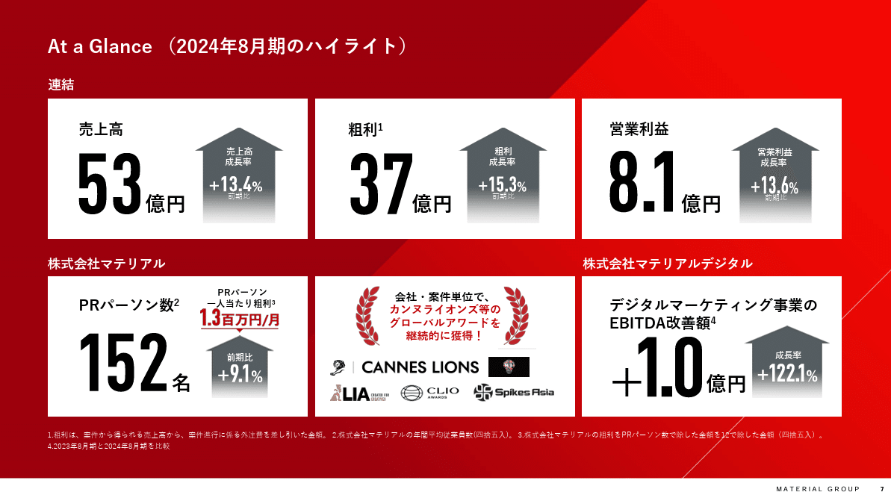
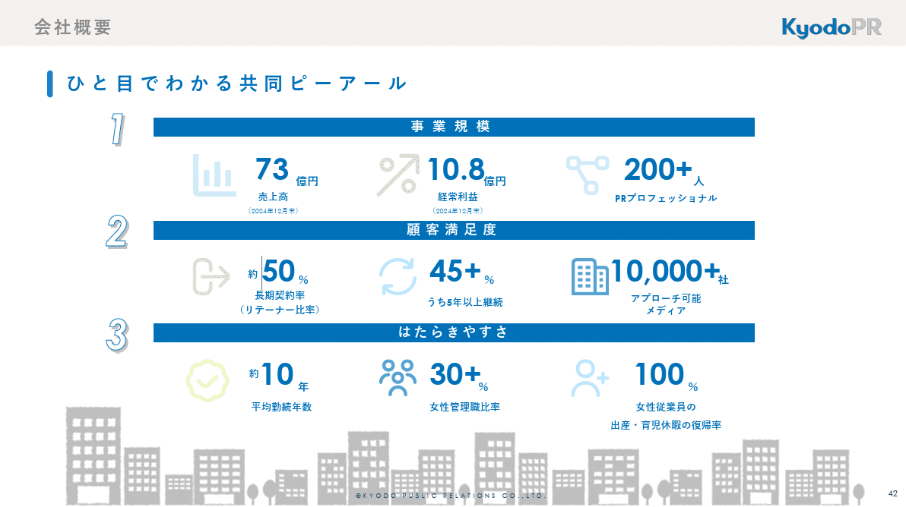

# 【マネしたい】要点が伝わるパワポの「エグゼクティブサマリー」スライド９選 （2025年更新）

[note原文](https://note.com/powerpoint_jp/n/nfa3e08dcd6f5)

みなさんこんにちは。
資料デザインのリサーチや分析に取り組むパワーポイントのスペシャリスト、パワポ研です。

今回は、パワポの**エグゼクティブサマリー**に焦点を当て、上場企業のIR資料から参考になりそうな抜粋し、紹介していきます。パワポ研の方で難易度を三段階に設定しておりますので、各自のパワポレベルに応じてご参照ください。

同じように好評いただいているテーマ別のスライド紹介の記事は、2025年9月より最新事例へのアップデートを進めています。今どんな記事があり、どの記事がアップデートされているか知りたい方は下記のノートを参照ください。

エグゼクティブサマリー、通称エグザマとは、その言葉通り**経営者（エグゼクティブ）向けのまとめ（サマリー）**です。平たく言うと、「時間のない経営者が見てプレゼンテーションの要点を把握できる」スライドです。
コンサルティング会社の報告会では、社長が冒頭15分だけ参加して、エグゼクティブサマリーのスライドで議論をする、といったこともあります。

事業会社においては、決算説明資料などの報告資料において、プレゼンテーションの要点をまとめるページとして使われます。エグゼクティブサマリーは明確に型があるものではなく、**「対象期の業績が一目で分かる資料」「対象期の取り組み進捗が一目でわかる資料」「投資家へのアピールポイントが一目でわかる資料」**など、目的によって形式が変わります。
いずれにせよ、**比較的長めのプレゼンをする方にとっては有用なスライドとなるため、**目的に応じて適切な形式のスライドを作れるよう、色々なパターンの資料を紹介していきます。

なお対象企業のパワポそのものが気になった場合は、プレゼンテーション全体が参照できるよう、引用元のURLも記載しております。是非ご活用ください。それでは早速見ていきましょう。

## メッセージの抽出が上手いスライド見本３選

### 株式会社コシダカホールディングスのパワポ

> 引用元：[> 決算補足説明資料](https://data.swcms.net/file/koshidakaholdings/dam/jcr:9cb2d376-499f-40d8-8c5a-5ef3d057ede0/140120241010596185.pdf)

*https://www.koshidakaholdings.co.jp/ja/ir/library/result.html*

まずはベーシックなエグゼクティブサマリーのパワポから行きましょう。
エグゼクティブサマリーはプレゼンテーションのまとめ、つまり**プレゼンを通じて最も伝えたい内容を盛り込むスライド**となるため、読み手に伝えたいメッセージが伝わるようにするのが大切です。

このスライドでは、投資家が必ず気にする、事業成長や配当といったリターンの部分が確実に向上しているということを、**赤文字での強調や上向きの矢印を使って**ビビッドに示しています。営業利益100億円など、インパクトのあるメッセージが出せるときには有効な手法ですね。

### 株式会社ユカリアのパワポ

> 引用元：[> 2024年12月期 通期決算説明資料](https://contents.xj-storage.jp/xcontents/AS96593/db79aabf/80ad/494d/8a69/57f6fa3e8ead/140120250226583009.pdf)

*https://eucalia.jp/ir/presentations/*

続いてもテキスト中心のエグゼクティブサマリーのパワポです。メインのメッセージを太字のテキストで、その下に詳細やサポートのファクトを入れています。

ベンチャーの場合は、営業利益などの経営数字だけで投資家を惹きつけるのは至難の業なので、**「この会社は成長しそうだな」と思わせるような要素**をサマリーに盛り込むのが重要です。
このスライドでは伝えたいメッセージを３つに絞って太字で記載すると同時に、そのメッセージを支えるファクトを薄緑色の網掛けでまとめています。

### 株式会社ダイブのパワポ

> 引用元：[> 2025年6月期 通期決算説明資料（事業計画及び成長可能性に関する事項）](https://ssl4.eir-parts.net/doc/151A/tdnet/2671665/00.pdf)

*https://dive.design/ir/library/presentation*

次の例は、情報量は多いものの、おしゃれなデザインによって見やすく仕上げているエグゼクティブサマリーのパワポです。

同じように投資家に向けて様々な魅力を発信する場合、テキストが多くなるほどに見にくいスライドになってしまいます。このスライドでは、**文字文字しくなるのを避けるために、伝えたい内容を６つの箱に分けて**見せています。また箱の中も円グラフを使ったり写真を使ってビジュアルで見せたりすることで、情報量が多くても見やすいスライドに仕上がっています。

## ラベルでの構造化がうまいスライド見本３選

### グロースエクスパートナーズ株式会社のパワポ

[> 2024年８月期通期決算説明資料](https://contents.xj-storage.jp/xcontents/AS05872/1d84a6b7/7899/4301/8a6d/fcbf85055273/140120241031507978.pdf)

*https://www.gxp-group.co.jp/ir/library/presentations/*

ここまではメッセージファーストで構成されたパワポを見てきましたが、エグゼクティブサマリーのもう一つの形として、情報を積み上げて説明していくパワポを見てみましょう。
この場合は情報量が多くなるので、**読み手がスムーズに理解できるよう、
構造化してあげる**ことが大切になります。

このスライドではスライドを大きく、結果である「連結経営成績」と取組内容の要約である「前期ハイライト」に分けています。人は上から下へと資料を読むので、**読者は「このスライドをどのような順番で解釈すれば良いのか」が直感的に分かります**。

### 株式会社ソラコムのパワポ

> 引用元：[> 2025年3月期 通期決算説明資料](https://contents.xj-storage.jp/xcontents/AS05199/fccbbead/29d4/4f62/be29/89a80f679169/140120250514550030.pdf)

*https://soracom.com/ja/ir/library/presentations*

構造化によって多くの情報をすっきりと見せているえぐぜくぃぶサマリーのパワポをもう一つ見ていきましょう。ここでは左側にタイトル、右側に具体という形にしたうえで、**タイトルを「通期業績」⇒「業績予想」⇒「成長戦略の進捗」と、頭に入りやすい流れで構成**しています。

また文字が多くてもすっきりと見せる工夫として、右側の強調ポイントを左の箱と同じ青緑色にしています。**エグゼクティブサマリーは文字が多くなりがちなので、こうした見やすさを上げる工夫も重要**になります。

### 株式会社リンクアンドモチベーションのパワポ

> 引用元：[> 2024年12月期 決算説明会 スライド](https://ssl4.eir-parts.net/doc/2170/ir_material_for_fiscal_ym/172674/00.pdf)

*https://www.lmi.ne.jp/ir/library/presentation_materials/*

エグゼクティブサマリーは**プレゼンテーション全体の要約であると同時に、投資家へのメッセージ**でもあります。情報量を増やすほどに、まとめのしての機能は果たしやすくなりますが、メッセージを出すのが難しくなるので、その塩梅が重要です。

そこで一つの方法として、構造化の際のタイトルを伝えたいメッセージで構成するというテクニックがあります。このスライドでは「成長戦略」ではなく「コンサル・クラウド事業の成長戦略」とより具体に書いたり、伝えたい株主還元を入れたりすることで、メッセージを伝えやすい構造にしているわけですね。

## 数字メインでまとめたスライド見本３選

### 株式会社GENOVAのパワポ

> 引用元：[> 2025年3月期通期決算説明資料](https://ssl4.eir-parts.net/doc/9341/tdnet/2615040/00.pdf)

*https://genova.co.jp/ir/presentation.html*

ここからはプレゼンテーション資料で近年増えている「数字で見る」スライドを見てみましょう。At Glanceやスナップショットなんてタイトルのこともあります。「数字で見る」スライドは、KPIの情報整理や、会社概要でよく使われますが、実はエグゼクティブサマリーでも有効です。**特に会社の魅力を表すうえで数値情報にインパクトのある会社に適した手法**といえます。

このスライドのポイントは紙面の使い方です。**スライド全体を三段に分けつつ、必要に応じて枠を統合して使うことで、比較的自由に指標を配置できる**ようになります。

### マテリアルグループ株式会社のパワポ

> 引用元：[> 事業計画及び成長可能性に関する事項](https://ssl4.eir-parts.net/doc/156A/ir_material3/248892/00.pdf)

*https://materialgroup.jp/ir/*

続いても定量情報を中心にまとめているエグザマですが、ここでは**それぞれの箱に上向きの矢印を置き、様々な指標が大きく伸びている**ことをビジュアルでアピールしています。

このスライドでは、あえて真ん中に様々なアワードのロゴを入れ、周りの数値を支えるコアコンピタンスのように見せています。細かい工夫ですが、ひと手間掛かっていますね。

### 共同ピーアール株式会社のパワポ

> 引用元：[> 決算説明会（資料）](https://www.kyodo-pr.co.jp/wp/wp-content/uploads/2025/02/IR_20250214_04.pdf)

*https://www.kyodo-pr.co.jp/investor/event/explanation/*

最後はエグザマではなく会社概要になりますが、エグザマでも使えるスライドなので紹介しておきます。

このスライドは、いままで説明してきた構造化と「数字で見る」スライドの両方の特徴を合わせており、**紙面を3段に分けて構造化しつつ、それぞれの段で主要数値**を載せています。
売上と営業利益という最重要指標を1段目で強調しつつも、その原動力となった顧客満足度や従業員満足度といったトピックスなども盛り込んでいます。情報量自体は多いのですが、**ブロックの作り方や余白の出し方が非常に巧み**で、シンプルな印象を与えるスライドになっています。

## 要点が伝わるパワポの「エグゼクティブサマリー」スライド９選まとめ

いかがでしたでしょうか。エグゼクティブサマリーは**プレゼンテーション全体の要約であると同時に、投資家へのメッセージ**でもあります。そのため、情報のまとめに比重を置くのか、メッセージに比重を置くのかでも適切なスライド構成は変わりますし、両方を追及すると、構造化やデザインの工夫が必須になります。今回ご紹介した事例がみなさまのお役に立っていれば幸いです。

## パワポ研オリジナルテンプレート

パワポ研では、「ビジネスシーンで使える」パワーポイントテンプレートを公開しております。デザインを整えるのみならず、**ロジックやストーリーを整理するのにも役立つパッケージ**になっておりますので、関心のある方は下記ページも併せてご覧ください！

上記の記事のように、noteでは**フォローしているだけでビジネスにおける「資料作成のコツ」と「デザインのセンス」が身に付くアカウント**を目指して情報配信を行っています。
今後もコンスタントに記事を配信していく予定なので、関心のある方は是非アカウントのフォローをお願いします！

**> Template販売　**[> https://powerpointjp.stores.jp/](https://powerpointjp.stores.jp/%EF%BF%BCnote)
**> note　**[> パワポ研の資料作成術](https://note.com/powerpoint_jp/m/mc291407396da)
**> X（旧Twitter)　**[> https://twitter.com/powerpoint_jp](https://twitter.com/powerpoint_jp)

## レックスアドバイザーズからのお知らせ

パワポ研は株式会社レックスアドバイザーズが運営しています。
レックスアドバイザーズは**経営企画職や経営管理職に特化した転職エージェント**です。
上場企業や上場準備企業を中心に、**経営企画、IR、経理財務、法務、内部監査等の職種の求人**をご紹介しているほか、**CFOなどのコンフィデンシャル求人**もご紹介可能です。
またコンサルティングファームや監査法人、会計事務所の求人も豊富にあるため、プロフェッショナルファームを目指す方のご支援も得意です。
求人紹介やキャリア相談を希望の方は、[**無料転職サポート**](https://www.career-adv.jp/job_search/entryform_exp/)よりサービス利用登録をしてみてください。

*レックスアドバイザーズのサービスサイトはこちら*

**> 求人紹介をご希望の方　**[> 無料転職サポート](https://www.career-adv.jp/job_search/entryform_exp/)**
> 採用支援をご希望の方　**[> 採用サポート](https://www.career-adv.jp/request3/)
**> その他　**[> お問い合わせフォーム](https://www.rex-adv.co.jp/contact)
**> 書籍　**[> 注目企業の実例から学ぶパワポ作成術](https://www.amazon.co.jp/dp/4046060476)

