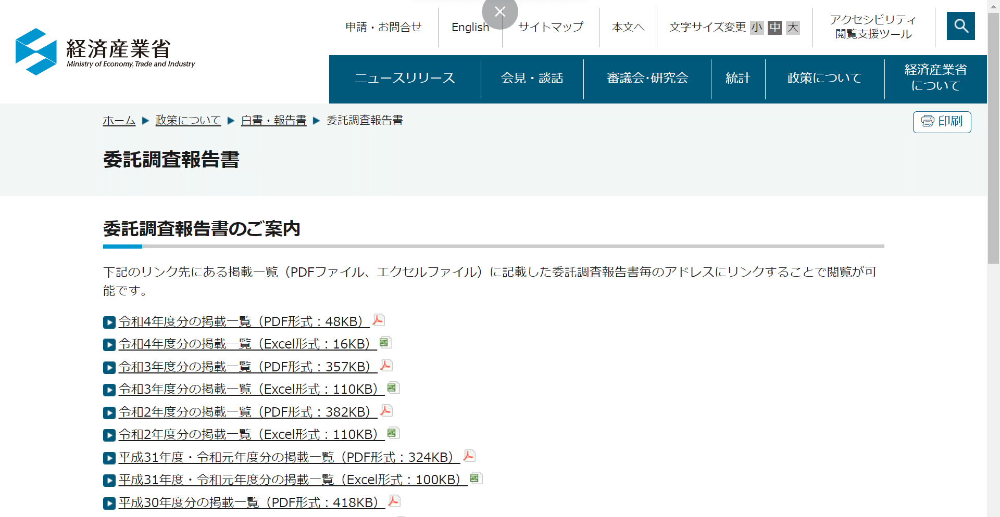
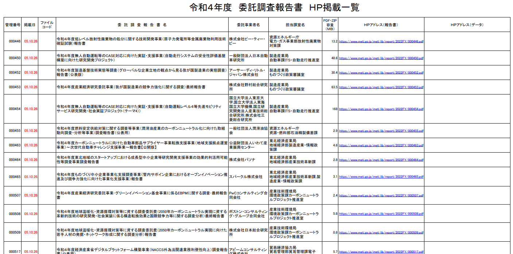
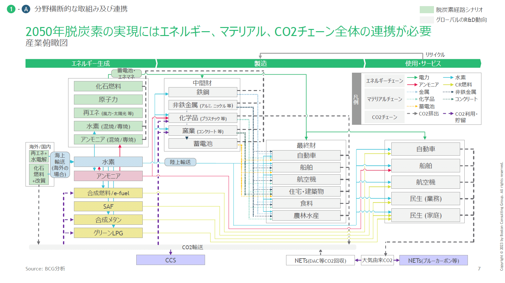
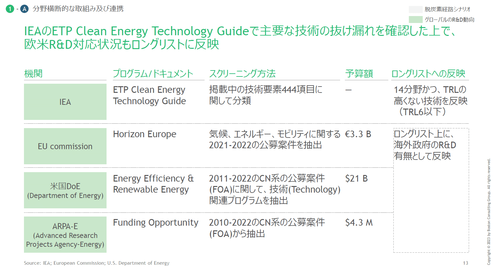
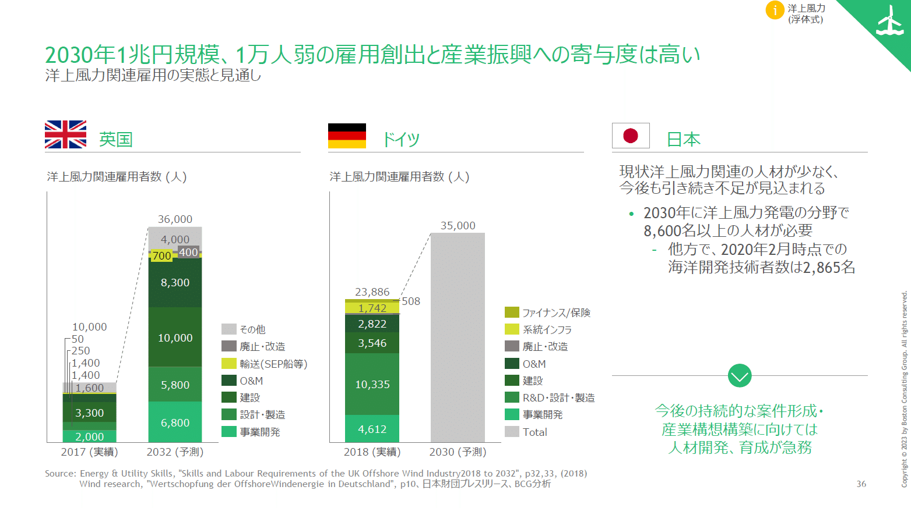
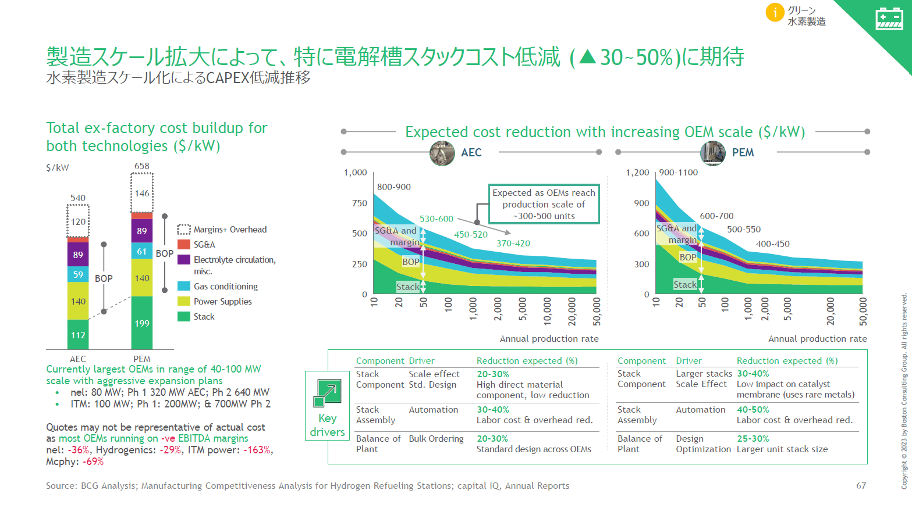

# 【極上パワポの宝庫】経産省の委託調査報告書には、なぜ日本で一番きれいなパワポが集まるのか

[note原文](https://note.com/powerpoint_jp/n/nfbb74ff2e3f0)

みなさんこんにちは。
資料デザインのリサーチや分析に取り組むパワーポイントのスペシャリスト、パワポ研です。

いつも企業が出しているパワーポイントの分析結果などを紹介しているのですが、本日は上質なパワーポイントの宝庫である経済産業省の委託調査報告書について、格納場所と素晴らしい理由を紹介します。

## 委託調査報告書のパワポはどこにあるのか

そのままですが、[経産省のHP](https://www.meti.go.jp/topic/data/e90622aj.html)にあります。以下のURLより「委託調査報告書」を確認ください。ご存じの方も多いかもしれませんね。

 
[
**
委託調査報告書 （METI/経済産業省）
**

www.meti.go.jp

](https://www.meti.go.jp/topic/data/e90622aj.html)

 
トップはこんなページになっています。

*トップ的なページ*

この中で、例えば「[令和4年度分の掲載一覧（PDF形式：48KB）](https://www.meti.go.jp/meti_lib/report/2022FY/itakuichiran2022FY.pdf)」を押してみましょう。

*令和4年度分の掲載一覧*

こんな感じのリストがずらっと並べます。エクセルでも同じようなものがダウンロードできます。正直見づらいですが、このリンクの一つ一つが調査報告書になっています。

## 成果報告資料がなぜパワポの宝庫なのか

経済産業省の委託調査は年間100件以上ありますが、戦略コンサルティングファームも数多く手がけています。彼らの報告書を見ることができる唯一の場所、それが経産省の委託調査報告書になります。
報告書の数と報告書の質、いずれの面でも他の追随を許さないといってよいでしょう。

### 調査報告書の数がすごい

数については、ワードなどパワーポイント形式以外の報告書もかなり混じっているのでなんとも言えないのですが、少なくとも**50以上の調査報告書**がパワーポイント（をPDFに焼いたもの）のように見えます。

一個一個リンクを開くのが面倒ですが、例えば外資系コンサル（ボストン・コンサルティング・グループ、ローランド・ベルガー、アクセンチュア等）に絞って見ていけば、大体はパワポで納品されています。それ以外の日系各社もパワポ形式で納品しているので、ヒマがあれば散策してみてもよいでしょう。

### 調査報告書の質がすごい

質はですね、これは資料1つに数千万円かけていることもあるので、かなり練りこまれたものが提示されているのは間違いないです。大手ファームとして恥ずかしいものは出せないので、皆さん全力で作られています。特に、成果物が「コンサルティング」ではなく「資料」なので、そこにリソースを全振りしているということで、なんなら普段事業会社に提供している以上の資料と言ってもいいかもしれません。

### なぜコンサルティングファームは調査報告書に力を入れるのか

ちなみに、経産省の委託事業は戦略コンサルティングファームの単価水準だと見合わないことが多いのも事実。ではなぜあまり儲からない委託調査をコンペをしてまで受けているのかと言えば、「今後の営業のため」「メンバーの稼働を埋めるため」「社会貢献のため」の3つになります。

** 経産省での実績でコンサル案件の受注率が上がる**

委託事業に力を入れる一番の理由は、経産省での実績が民間企業のプロジェクトを受注する上での武器になるからです。
経産省の調査案件に従事すると、対象領域の知見はかなり広がりますし、有識者や経産省とのパイプもできる。民間企業が戦略案件や新規事業案件をどこのコンサルに頼むか考えるときに、経産省の調査案件の実績があるコンサルの方が安心感があるので、それ狙いです。特に新しい領域や規制産業の領域では、委託事業の実績は効果がありますね。

また官公庁の案件でも単価が安いものばかりではありません。中には戦略コンサルの単価に見合う案件もあります。そうした案件を取るときに、過去に類似の委託調査を請け負っているというのは加点要素になります。

コンペなので営業関係ないでしょ？　と思われる方、そんなことないです。例えば民間企業が何かしらの発注するときに、これまでのつきあいが全くない企業と、多少なりとも何回か発注したことがある企業、どちらを選びますか？コストとか質の差が分かりにくいなら後者にしたいですよね。国もできればそうしたいわけです。なんなら、保守的な分むしろそうしたい。

でも、コンペは正しく行わなくてはいけない。なのでどうするかというと、コンペの加点要素に「前がんばってくれた加点」というのを混ぜておくわけです。「類似の調査経験」といった形で堂々と採点基準に出すこともありますし、「技術点」などそれとなくそういう項目を載せておくこともあります。いずれにせよ、「これまで案件頑張ってくれた加点」はあります。

で、ある日とても美味しい案件が来た時に「いざ！」といって、「これまで頑張ったでしょこんなに実績ありますよ！」という内容を提案書に盛り込むわけです。要すれば、種まきですね。

**メンバーの稼働を有償プロジェクトで埋める**

メンバーがヒマなのはコンサル会社にとってよくないことです。有償のプロジェクトに参加していないコンサルタントは、ビジネスディベロップメントといって提案活動にいそしみます。

提案活動は必要ですが、提案できるものが無限にあるわけではないので、働かない人が出てきてしまいます。働かない社員を養っているとそれだけでコストがかかるので、安い案件でも稼働させて費用を回収するという目的がまずあります。

また、社員は休んでいても成長しません。なのでとりあえず
「論点を把握する→仮説作る→調査する→まとめる」
というプロセスをロープレッシャーで経験できる貴重な機会獲得の目的でもって、こういった資料作成コンペ案件を受けています。要は「安い案件でもいいから費用回収しつつ成長させよう」という目的があります。

**ブランディングのために社会貢献をする**

経産省の委託事業には「社会貢献」という側面もあります。なにせ国の事業ですからね。多少安価でも受ける意義があります。それが国の意思決定の一つの要素になるので、それは頑張りがいがあるというものです。

コンサルティングファームの仕事は守秘義務も多く、中々外に出てきませんが、経産省の委託事業はこのように誰でも見ることができますし、民間で参考資料として使われることもあります。
こうしたプロジェクトを大々的にアピールしていくことで、優秀なコンサルティング希望者の採用につながるわけですね。

また意外にも外資コンサルに所属している人はウェットかつ、「日本頑張れ！」的なマインドがある人が多いので、そうしたコンサルタントのエンゲージメントを高めたり、息抜きの場に使ったりもしています。

### 調査報告書には戦略コンサルティングファームの過去知見が詰まっている

質を担保する話をもう一つ。

コンサルティングファーム（コンサル会社）というのは、全く同じ案件を受託することはありません。なぜなら、この世に全く同じ案件は存在しないからです。

一方で、似たような案件や、案件の一部に関連性がある案件はたくさんあります。例えば以下の案件がそれぞれあるとしましょう。

・30年後の未来を予想して、長期戦略を立ててください
（通信会社からの依頼）
・30年後の未来を予想して、長期戦略を立ててください
（食品メーカーからの依頼）

これを全く違う案件と見るか、かなり近い案件と見るか。
もちろん、「**超近い**」案件です。
例えばこれが「1年後の未来を予想して……」なら、おそらく全然違う案件になることでしょう。しかし30年後の未来ということなら、通信会社と食品メーカー両方に共通に影響するコンテンツが多くを占める（デジタル化、AI、高齢化等）はずですし、その多くの資料は完璧に同じにはならないものの、かなり転用可能、つまりは共通するものになります。というか、そうでもしないと30年後の未来予想プロジェクトを1つのファームの中でいくつも走らせることはできません。

上記の戦略案件プロジェクトは極端な例ですが、例えば「コスト削減」という文脈なら、そういった案件で共通する資料はありますし、また「金融機関」が相手のプロジェクトならこの資料は必須！　みたいな資料もあるわけです。要は、いろんなプロジェクトで資料が（一部の修正はあるものの）使いまわされているわけです。

……ということを踏まえて、経産省向けの資料をちょっと見てみますと、何かと汎用性がありそうな資料もいくつか見られます。もちろん多くは新規の資料でしょうが、これまでコンサルティングファームが集めてきた資料や情報を再構成して使っているものもありますし、逆にこの経産省案件で初めて作った資料が、そのまま転用される可能性も十分にあるわけです。

### 資料転用の例

例えば以下の資料を例にとりましょう。
[令和４年度地球温暖化・資源循環対策等に資する調査委託費（2050年カーボンニュートラル実現に資する 革新的技術の研究開発・社会実装に係る構造転換効果と国際競争力等に関する調査分析）最終報告書](https://www.meti.go.jp/meti_lib/report/2022FY/000508.pdf)

まずこのスライド。

*多分BCGグローバルの資料の翻訳*

おそらくBCGグローバルで作った資料を日本語に翻訳しています。理由は2つで、ここまで込み入った資料をゼロベースで作ることは（コスト的に）まずなさそうということと、左上の「蓄電池・エネマネ」というボックスから文字がはみ出していること。スペースに余裕もありますしね。おそらく、元々英語か何かで作ってあった資料を日本語化した結果とも思われます。

*BCGグローバルの転用。ソースも外国のものなので翻訳版かと。*

*BCGグローバルの資料に、日本の情報を味付け。*

おそらくこのあたりも英語版の転用かと。資料作成のメソッドはグローバルレベルである程度共通していることが伺えます。

特に2枚目（2030年～）の資料は、グローバルの資料に強引に日本の情報を加えているように思えます（違ったらすみません）。このメッセージなら「日本」の事例はいらないように見えるので。英国とドイツでメッセージを支えるには十分でしょう。スライドからの示唆（右下の「今後の～」）も少し強引に混ぜ込んだように見えます。

*カラフルなスライド。モロに英語。*

この資料はメッセージ部分以外が英語なので、おそらくBCGグローバルが作成した資料ですね。やや色味が日本ではあまり見ない組み合わせとなっているくらいで、構成のポイントに大きな差はありません。

以上、いくつかの例でした。
「資料転用」というと少しネガティブなイメージで捉えられることもありますが、委託調査報告書を見て分かるように、実際はそんなことはありません。むしろグローバルや過去の英知を結集させて資料を作っており、それをある程度ローカライズしたものを我々が拝見できると考えると、非常に付加価値や（書く側/見る側の）生産性は高いのではないでしょうか。

## まとめ

いずれにせよ、**すごい予算と労力がかかった美しいパワポ資料を、無料で我々は享受できる**わけです。今回はBCGを例に出しましたが、それ以外にもたくさんの良い資料がありますので、好きなものをご確認ください。好きなテーマを見てもよいですし、あるいは漫然と色々なものをテキトーに見て「このスライドいいなー」みたいな使い方もよいと思います。内容はともかく、スライド構成はかなり参考になるはずです。

なお、過去に執筆し、好評だったコンサルティングファームの資料まとめはこちらからご覧いただけます。

## パワポ研オリジナルテンプレート

パワポ研では「ビジネスシーンで使える」パワーポイントテンプレートを公開しております。デザインを整えるのみならず、**ロジックやストーリーを整理するのにも役立つパッケージ**になっておりますので、関心のある方は下記ページも併せてご覧ください！

上記の記事のように、noteでは**フォローしているだけでビジネスにおける「資料作成のコツ」と「デザインのセンス」が身に付くアカウント**を目指して情報配信を行っています。
今後もコンスタントに記事を配信しいく予定なので、関心のある方は是非アカウントのフォローをお願いします！

**> Template販売　**[> https://powerpointjp.stores.jp/](https://powerpointjp.stores.jp/%EF%BF%BCnote)
**> note　**[> パワポ研の資料作成術](https://note.com/powerpoint_jp/m/mc291407396da)
**> X（旧Twitter)　**[> https://twitter.com/powerpoint_jp](https://twitter.com/powerpoint_jp)

## レックスアドバイザーズからのお知らせ

パワポ研は株式会社レックスアドバイザーズが運営しています。
レックスアドバイザーズは**経営企画職や経営管理職に特化した転職エージェント**です。
上場企業や上場準備企業を中心に、**経営企画、IR、経理財務、法務、内部監査等の職種の求人**をご紹介しているほか、**CFOなどのコンフィデンシャル求人**もご紹介可能です。
またコンサルティングファームや監査法人、会計事務所の求人も豊富にあるため、プロフェッショナルファームを目指す方のご支援も得意です。
求人紹介やキャリア相談を希望の方は、[**無料転職サポート**](https://www.career-adv.jp/job_search/entryform_exp/)よりサービス利用登録をしてみてください。

**> 求人をご希望の方　**[> 無料転職サポート](https://www.career-adv.jp/job_search/entryform_exp/)
**> 採用支援をご希望の方　**[> 採用サポート](https://www.career-adv.jp/request3/)
**> その他　**[> お問い合わせフォーム](https://www.rex-adv.co.jp/contact)
**> 書籍　**[> 注目企業の実例から学ぶパワポ作成術](https://www.amazon.co.jp/dp/4046060476)

