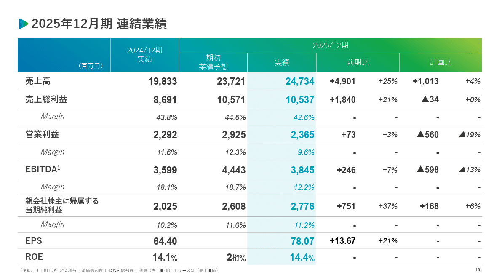
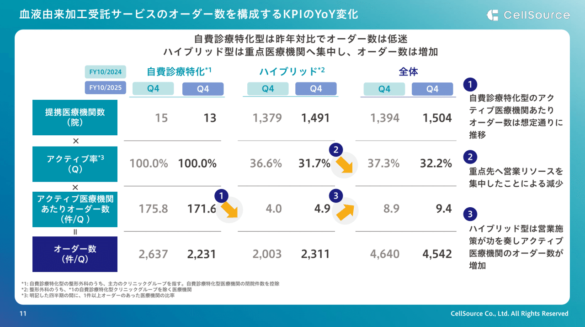
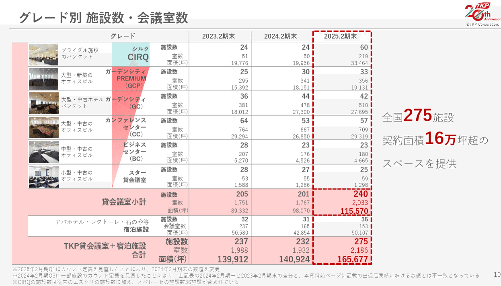
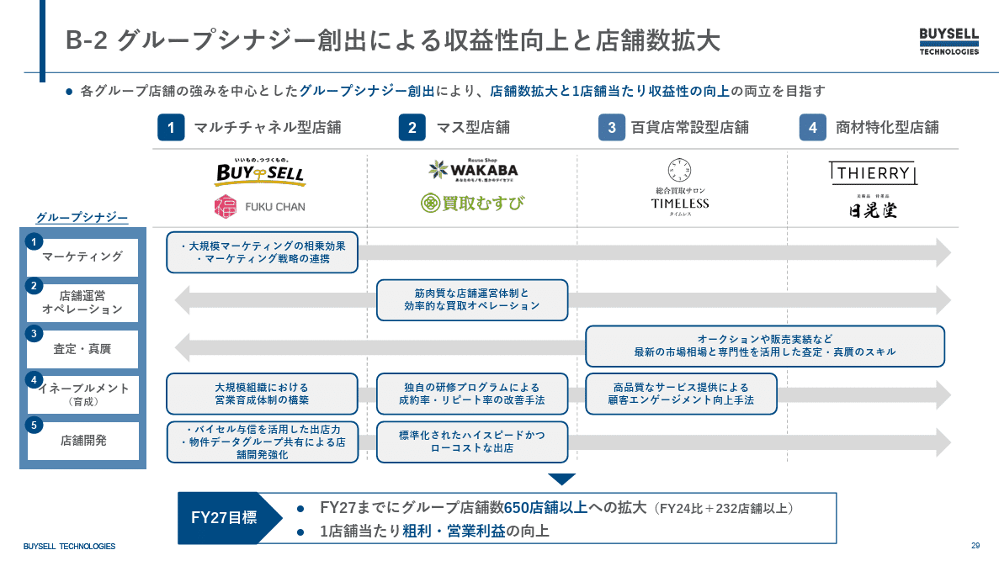
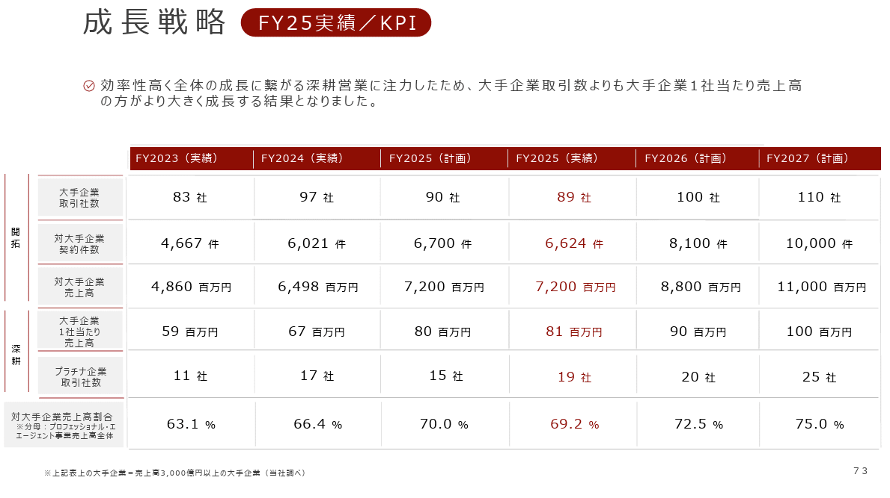
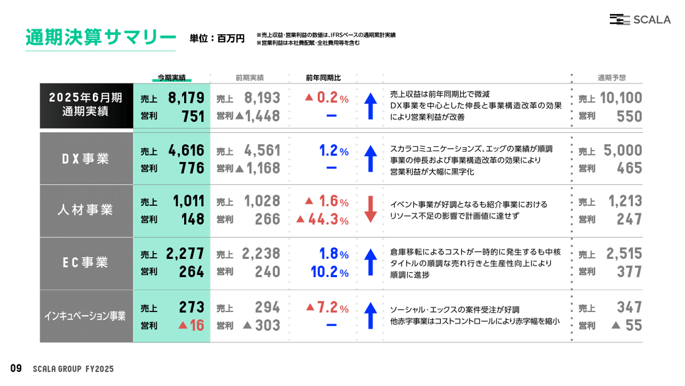
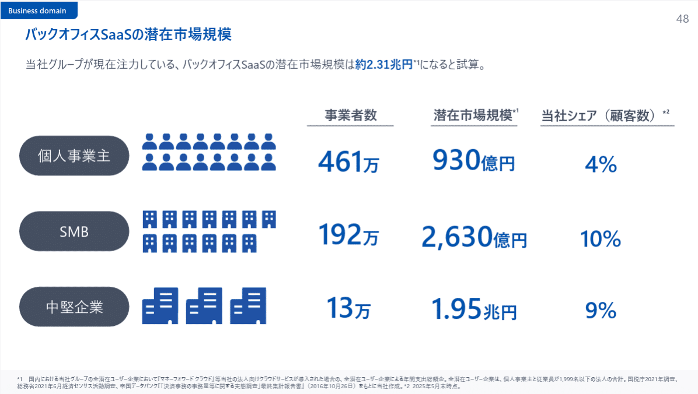

# 【マネしたい】見やすいパワポの「表」スライド９選 （2026年更新）

[note原文](https://note.com/powerpoint_jp/n/nfbd66d194ff2)

みなさんこんにちは。
資料デザインのリサーチや分析に取り組むパワーポイントのスペシャリスト、パワポ研です。

今回は、**パワポの「表」スライドに焦点を当て、上場企業のIR資料から参考になるデザインのパワーポイント資料を抜粋して紹介**していきます。

パワポの「表」スライドは、IR資料においては、業績の進捗を前年比や計画比で示すために使われることが多いです。記載している内容は、各社とも売上高、営業利益、当期純利益、前年比などがほとんどですが、**グレーアウトの方法や、表のサイズ、メッセージスペースの大きさは会社によって異なります。**パワーポイントにおいてどのような「表」スライドが見やすいのか、比較してみてポイントを押さえてみて頂ければと思います。

テーマ別パワーポイントシリーズでは、様々なテーマでパワポのスライド例を紹介しています。気になる方は下のまとめページをチェックしておいてくださいね。

対象企業のパワーポイントそのものが気になった場合は、**プレゼンテーション全体が参照できるよう、引用元のURLも記載**しております。是非ご活用ください。それでは早速見ていきましょう。

## おしゃれで見やすい「表」スライド例３選

まずは基本となるパワポの「表」スライドから見ていきましょう。
おしゃれで見やすいパワポの表スライドをデザインするにあたって重要なことは以下の３つです。

- **とにかく線を減らしてすっきりと見せる**

- **ハイライトや強調したい箇所に配色を施す**

- **パーセンテージを使って成長率や変化率などを記載する**

パワポの「表」スライドにおいては、まずはシンプルかつ分かりやすいロジックで、数字が頭にすっと入るようにすること、また読み手が迷子にならないように導いてあげることが大切ということですね。

### シンプルデザインで見やすいスライド例

まずはクラシル株式会社のパワポにおける、「表」スライドのデザイン例から見ていきましょう。
2025年3月期 通期決算説明資料のパワーポイントにある、FY2026/3 業績予想のスライドです。

*クラシル株式会社のパワーポイントの「表」スライド*

> 引用元：[> 2025年3月期 通期決算説明資料](https://pdf.irpocket.com/C299A/hZTq/I0QF/iEs5.pdf)

*https://dely.jp/ir/library/results/*

パワポの「表」スライドの特徴としては、**配色の観点でも枠線の観点でも無駄が一切ない点**が挙げられます。黒色のグラデーションとオレンジ色のみでできるだけ色を使わずに強調ポイントを明確にしています。また縦の枠線を一切入れないことで、かなりスタイリッシュな表スライドとなっています。

また「太字」と「薄いグレー色」の使い分けによって、表の中に利益率を入れつつも利益額に目が行くようなデザインにしている点もポイントです。delyは依然として成長フェーズであり、**利益率よりも利益の絶対額を見てもらいたい**ので、このような表のデザインにしているわけですね。

また「オレンジ色」の枠の配置も見事です。全体の枠線を取り払うことで、圧迫感の無いパワポに仕上げつつ、メインの業績にオレンジ色の枠を配置することで表のデザインに締まりが出ています。オレンジ色の枠線で今期の業績を強調することで、読み手が混乱しない、おしゃれで見やすいパワポの表スライドとなっています。

### 配色がおしゃれな見やすいスライド例

次は株式会社ユカリアのパワポにおける、「表」スライドのデザイン例になります。
2025年12月期 通期決算説明資料_事業計画及び成長可能性資料のパワーポイントにある、2025年12月期 連結業績のスライドです。

*株式会社ユカリアのパワーポイントの「表」スライド*

> 引用元：[> 2025年12月期 通期決算説明資料_事業計画及び成長可能性資料](https://contents.xj-storage.jp/xcontents/AS96593/bf10b1cf/3f1e/40a7/8da3/cb876291c65c/140120260213560495.pdf)

*https://eucalia.jp/ir/news/*

パワポの「表」スライドの特徴としては、**グラデーションを使うことでスタイリッシュで見やすい表になっている点**が挙げられます。表の表題部分は横に流れる緑色のグラデーション、実績部分はより目を引くように薄い緑色で縦のハイライトを入れています。

近年のIR資料におけるパワポの表スライドにおいては、前期比と業績予想比を入れるため、**どうしても数値が多くなりがちで重めの印象**になりますが、コーポレートカラーの緑色のグラデーションを使うことで、軽やかでスタイリッシュな印象を与えるデザインとなっています。

### 補足情報が見やすい表のスライド例

続いてセルソース株式会社のパワポにおける、「表」スライドのデザイン例を見てみましょう。
2025年10月期 通期決算説明資料のパワーポイントにある、血液由来加工受託サービスのオーダー数を構成するKPIのYoY変化のスライドです。

*セルソース株式会社のパワーポイントの「表」スライド*

> 引用元：[> 2025年10月期 通期決算説明資料](https://contents.xj-storage.jp/xcontents/AS81949/501262f3/67f0/451e/bac5/da889afc9904/20251211175126378s.pdf)

*https://www.cellsource.co.jp/ir/news/*

パワポの「表」スライドの特徴としては、**KPIの変化点をナンバリングして右側で詳細に説明している点**が挙げられます。「提携医療機関数」「アクティブ率」「アクティブ医療機関当たりオーダー数」それぞれについて、表を使って前年との比較を行い、前年より悪化しているKPIあるいは向上しているKPIの説明を右側でしています。

パワポの表スライドにおいて、見やすい表のデザインと同じくらい重要なのが、表の数値の裏側を見やすい形で説明することです。表の枠線をうまく使って見やすい形で整理するデザインがスタンダードですが、今回のようにナンバーを振って表の枠線の外側で説明するデザインも有効であることを覚えておきましょう。

## 見やすいパワポの「比較表」スライド例３選

### 競合比較のパワポの比較表スライド例

まずは株式会社スマレジのパワポにおける、「比較表」スライドのデザイン例を見ていきましょう。
事業計画及び成長可能性に関する事項のパワーポイントにある、POSの国内市場のスライドです。

*株式会社スマレジのパワーポイントの「比較表」スライド*

> 引用元：[> 事業計画及び成長可能性に関する事項](https://corp.smaregi.jp/ir/library/FY2025_Business_Plan_and_Growth_Potential.pdf)

*https://corp.smaregi.jp/ir/management/growth-potential.php*

パワポの「比較表」スライドの特徴としては、**比較表の中の評価を記号とテキストの組み合わせで説明している点**が挙げられます。「機器の価格」「維持費」「操作性」「機能」「サポート」の５項目について、クラウドPOSとキャッシュレジスター及び従来型POSの比較をしていますが、マルバツサンカクをつけるだけでなく、その下にテキストで補足説明をしています。

見やすい比較表にするための工夫として、記号の色を変えているほか、クラウドPOSの枠線を青色の太線にして目立たせている点もポイントです。

### 事業ポートフォリオの比較表スライド例

続いて株式会社ティーケーピーのパワポにおける、「比較表」スライドのデザイン例をみてみましょう。
2025年２月期 決算説明資料のパワーポイントにある、グレード別 施設数・会議室数のスライドです。

*株式会社ティーケーピーのパワーポイントの「比較表」スライド*

> 引用元：[> 2025年２月期 決算説明資料](https://pdf.irpocket.com/C3479/dRUj/Nmfu/Tc1B.pdf)

*https://www.tkp.jp/ir/library/presentation.html*

パワポの「比較表」スライドの特徴としては、**画像やグラデーションを駆使してブランドポートフォリオ戦略を見やすいように示している点**が挙げられます。自社が持つ物件ごとの違いを「ブライダル施設」「大型・新築オフィス」「大型・中古ホテル」「大型・中古オフィス」「中型・中古オフィス」「小型・中古オフィス」に分けています。複数のブランドがある中で、ブランド間でどのようにすみわけをしているのか、また企業としてどのぐらいの領域をカバーして、複数ブランドや複数業態で空白が生まれないようにしているかを見やすいようにまとめるべく表を使っています。

若干文字が多く感じるかもしれませんが、**商品セグメントについて説明しつつ、自社の戦略と戦略の実行度合いも見せており高度な**パワポの「表」スライドといえます。全体として順調に施設数を増やしていく中で、より高いグレードに注力していくという高付加価値戦略も進んでいることが一見やすく整理されており、複数ブランドや複数業態を持っている場合に見やすいパワーポイントを作成するテクニックといえます。

### M&Aのシナジーが伝わる比較表スライド例

次に株式会社BuySell Technologiesのパワポにおける、「比較表」スライドのデザイン例です。
2024年12月期 通期決算説明資料のパワーポイントにある、グループシナジー創出による収益性と店舗数拡大のスライドです。

*株式会社BuySell Technologiesのパワーポイントの「比較表」スライド*

> 引用元：[> 2024年12月期 通期決算説明資料](https://ssl4.eir-parts.net/doc/7685/tdnet/2568273/00.pdf)

*https://buysell-technologies.com/ir/settlement/*

パワポの「比較表」スライドの特徴としては、**M&Aでグループ化した各ブランドがシナジー創出においてどのような役割を担うのか表で示している点**が挙げられます。横軸に店舗ブランドのカテゴリ、縦軸に想定されるシナジーを取り、実現したいシナジーが何で、そのシナジーをどのブランドを起点に実現していくのか、見やすい「比較表」スライドに落としています。

店舗ブランド別に扱っている商品ジャンルも価格帯も異なり、持っているケイパビリティも当然異なります。M&Aの重要度が高まる中で、M&Aの目的の開示や、戦略の実現状況のトラッキングは非常に重要です。その際に俯瞰した情報を提供するのにパワポの「比較表」スライドは有効な手段ですね。

## おしゃれなデザインの「表」スライド例３選

### 単色でおしゃれなデザインの表スライド例

まずは株式会社みらいワークスのパワポにおける、「表」スライドのデザイン例を見ていきましょう。
2025年９月期　決算説明資料・事業計画および成長可能性に関する事項のパワーポイントにある、成長戦略のスライドです。

*株式会社みらいワークスのパワーポイントの「表」スライド*

> URL：[> 2025年９月期　決算説明資料・事業計画および成長可能性に関する事項](https://contents.xj-storage.jp/xcontents/AS08217/373d7aae/2fd2/42a1/b843/46698e36182d/140120251114502523.pdf)

*https://mirai-works.co.jp/ir/presentations/*

パワポの「表」スライドの特徴としては、**横軸のタイトルのみ塗りつぶした、赤色のみの配色ですっきりと見やすい点**が挙げられます。縦軸においても横の枠線だけ横軸のタイトルと同じ赤色を使うデザインで、**全体として統一された印象**のパワポの「表」スライドとなっています。

表スライドはどうしても情報量が多くなるため、何を伝えたいのかがわかりにくくなりがちです。そこで表の中でも特に伝えたい将来の計画に絞って強調することで、読み手が何に注目すれば良いのかが明確になり、見やすいパワポの表スライドとなります。結果として独自指標である「売上3,000億円以上の大手企業への注力」という自社のKPIが伝わりやすくなっています。

### 配色がおしゃれなデザインの表スライド例

次は株式会社スカラのパワポにおける、「表」スライドのデザイン例になります。
2025年6月期 決算説明資料のパワーポイントにある、通期決算サマリーのスライドを見てみましょう。

*株式会社スカラのパワーポイントの「表」スライド*

> 引用元：[> 2025年6月期 決算説明資料](https://scalagrp.jp/pdf/ir/library/gyoseki/20250814_setsumeikai_2506-4Q.pdf)

*https://scalagrp.jp/ir/documents/*

パワポの「表」スライドの特徴は何といっても、**スライドの中に必要な情報が全てコンパクトに入っているデザイン**です。パワポの「表」スライド1枚で、**セグメント間の売上利益の比較、セグメント別の前年との売上利益の比較、セグメント別の経営方針**がすべてまとまっており、非常にロジカルな資料といえますね。

今後の方針を見てみると、今その事業がどのような位置づけにあり、何をしなければならないのか、赤字になる場合にはなぜ赤字にする必要があるのかが明確に書かれています。また赤色や青色の使い方も効果的で、しっかり右揃えになった数字と合わせて、情報量が多くても見やすい表スライドとなっています。投資家に対してそもそも伝えるべき情報は何なのかを熟考し、伝えやすい形式で表現するという洗練されたパワーポイントと言えるでしょう。

### 親しみやすいデザインの表スライド例

最後は株式会社マネーフォワードのパワポにおける、「表」スライドのデザイン例です。
2025年11月期 第2四半期決算説明資料のパワーポイントにある、バックオフィスSaaSの潜在市場規模のスライドです。

*株式会社マネーフォワードのパワーポイントの「表」スライド*

> 引用元：[> 2025年11月期 第2四半期決算説明資料](https://contents.xj-storage.jp/xcontents/AS71106/0b98287f/f7f1/49ca/8e1e/261cab0da6f5/140120250714513764.pdf)

*https://corp.moneyforward.com/ir/library/presentation/*

パワポの「表」スライドの特徴は、**マーケットの市場規模と自社のシェアが構造的に記載されている点**です。顧客が個人事業主とSMBと中堅企業にセグメント分けされており、それぞれの事業者数、潜在市場規模、当社シェア（顧客数）がそれぞれに記載されています。表スライドに枠線はなく、すっきりとしたデザインとなっています。

個人事業主は数が多いものの市場規模は1,000億程度で、中堅企業は数こそ20分の1以下であるものの市場規模は20倍と、この表を一枚見れば市場の構造がわかります。そこに推定シェアが入ることで、より1件あたりが大きく市場の大きい中堅マーケットでも一定のプレゼンスがあることもわかり、**表1枚で自社の強さを見やすい形で示すことができているパワーポイントの表スライド**といえます。

## おしゃれなパワポの「表」スライドの作り方

ここまで様々な企業の「表」スライドを見てきましたが、おしゃれで見やすい「表」スライドのデザインにはちょっとしたコツがあります。
逆にいえば、コツさえしっかり押さえてしまえば、これまで見てきた基本的な「表」のデザインはそこまで難しくありません。

*基礎さえ押さえればこのレベルまではすぐに到達できる*

簡単にまとめると、パワポの「表」スライドにおいては、「数字を右揃えにする」「行列の縦横比を調整する」「枠線や罫線はできる限り目立たなくする」するということが大切なのですが、その辺りのポイントは以下のNoteにまとめていますので、気になる方は見てみてくださいね。

上級編として、コンサルタントが作るおしゃれで見やすいパワポの「表」スライドの作り方についても解説していますので、気になる方は読んでみてくださいね。

## 【マネしたい】見やすいパワポの「表」スライド９選まとめ

いかがでしたでしょうか。パワポの「表」スライドは、IR資料において、業績の報告だけでなく、プロダクトの機能比較、子会社の担う役割の概観図にもなり得ます。**情報を俯瞰して分析し、読み手に全体感を伝えるには、これ以上無く見やすい手法**だと思いますので、様々な企業のパワーポイントを比較して、どのように配色をすればよいのか、数字の大きさはどの程度であれば見やすいのか、メッセージは入れた方がよいのかなど、使うべきポイントを見極めながら参考にして頂ければ幸いです。

## パワポ研オリジナルテンプレート

パワポ研では、「ビジネスシーンで使える」パワーポイントテンプレートを公開しております。デザインを整えるのみならず、**ロジックやストーリーを整理するのにも役立つパッケージ**になっておりますので、関心のある方は下記ページも併せてご覧ください！

上記の記事のように、noteでは**フォローしているだけでビジネスにおける「資料作成のコツ」と「デザインのセンス」が身に付くアカウント**を目指して情報配信を行っています。
今後もコンスタントに記事を配信していく予定なので、関心のある方は是非アカウントのフォローをお願いします！

**> Template販売　**[> https://powerpointjp.stores.jp/](https://powerpointjp.stores.jp/%EF%BF%BCnote)
**> note　**[> パワポ研の資料作成術](https://note.com/powerpoint_jp/m/mc291407396da)
**> X（旧Twitter)　**[> https://twitter.com/powerpoint_jp](https://twitter.com/powerpoint_jp)

## レックスアドバイザーズからのお知らせ

パワポ研は株式会社レックスアドバイザーズが運営しています。
レックスアドバイザーズは**経営企画職や経営管理職に特化した転職エージェント**です。
上場企業や上場準備企業を中心に、**経営企画、IR、経理財務、法務、内部監査等の職種の求人**をご紹介しているほか、**CFOなどのコンフィデンシャル求人**もご紹介可能です。
またコンサルティングファームや監査法人、会計事務所の求人も豊富にあるため、プロフェッショナルファームを目指す方のご支援も得意です。
求人紹介やキャリア相談を希望の方は、[**無料転職サポート**](https://www.career-adv.jp/job_search/entryform_exp/)よりサービス利用登録をしてみてください。

*レックスアドバイザーズのサービスサイトはこちら*

**> 求人紹介をご希望の方　**[> 無料転職サポート](https://www.career-adv.jp/job_search/entryform_exp/)**
> 採用支援をご希望の方　**[> 採用サポート](https://www.career-adv.jp/request3/)
**> その他　**[> お問い合わせフォーム](https://www.rex-adv.co.jp/contact)
**> 書籍　**[> 注目企業の実例から学ぶパワポ作成術](https://www.amazon.co.jp/dp/4046060476)

