# アクティビストファンドの株主提案スライドに学ぶ「説得力のあるプレゼン資料」の作り方

[note原文](https://note.com/powerpoint_jp/n/nfcf9024c4282)

みなさんこんにちは。
資料デザインのリサーチや分析に取り組むパワーポイントのスペシャリスト、パワポ研です。

今回は、**アクティビストファンドの株主提案資料スライドに焦点を当て、説得力のあるプレゼン資料の作り方**を学べるパワポを紹介していきますよ。

以前ご紹介した、経産省で見られるコンサルティングファームの調査報告書は調査がメインのため、どちらかというと情報を積み上げて最後に提案やメッセージがある、ということが多いです。

一方で今回紹介するアクティビストファンドの株主提案スライドは、**提案したい内容があり、そこに向けて提案の説得力を補強するためのファクトがあるという構造**になっています。ファンドによってもストーリーの作り方が様々なので、是非いろいろな株主提案資料を見て学んでくださいね。

## アクティビストファンドの株主提案資料スライドは説得に特化したプレゼン資料

### アクティビストファンドの株主提案とは

アクティビストファンドというと、あまりイメージがわかない方も多いのではないかなと思います。少し知識のある方であれば、配当を高めるように要求する人たちといったイメージがあるかもしれません。

アクティビストファンドというのは、上場企業の株式に投資を行い、株主として経営に関与することを通じて企業価値を高めて投資先の株価を上げ、投資のリターンを得るファンドです。ファンドなので、投資家から預かった資金を使ってそうした投資を行っています。

アクティビストファンドは、四半期決算のタイミングで経営陣と対話をしながら経営に関与していきます。ただし、より大がかりな提案を行う場合や、通常の対話の中では中々提案が受け入れてもらえない場合に、今回のテーマである「株主提案」のプレゼンを行い、企業に改革を迫ります。なので時間とリソースをかけて説得力のある提案スライドを作るわけですね。

### アクティビストファンドの株主提案は一般人でも閲覧できる

そうした株主提案は秘密裏に行われると思われるかもしれませんが、実際は逆で、時にはメディアを巻き込んで表舞台で行われます。

というのも、アクティビストファンドは株式の過半数を持っているわけではありません。場合によっては数％ということもあり、そのままではなかなか相手にしてもらえません。そこで、自分たちの正当性を示すために、あえて表に出て提案内容をさらけ出しながら戦うわけですね。提案内容に自信があるからこそ、提案資料を公開して、自分たちの主張の正当性をアピールするわけです。

また株主提案のスライドは、提案後も公開されていることが多いです。意図としては、ファンドとしてのスタンスや提案力を見せること、また株主提案が否決された場合も、自らの株主提案の正当性を世の中に示すためです。
私たちからすると、熟練のアクティビストの渾身の提案資料パワポが見れてしまうわけで、とてもありがたいですよね。

## 劇場型で経営陣や株主を説得する事例：

## オアシスから花王への株主提案資料

引用元：[https://www.abetterkao.com/wp-content/uploads/Oasis-A-Better-Kao-Presentation-JPN.pdf](https://www.abetterkao.com/wp-content/uploads/Oasis-A-Better-Kao-Presentation-JPN.pdf)

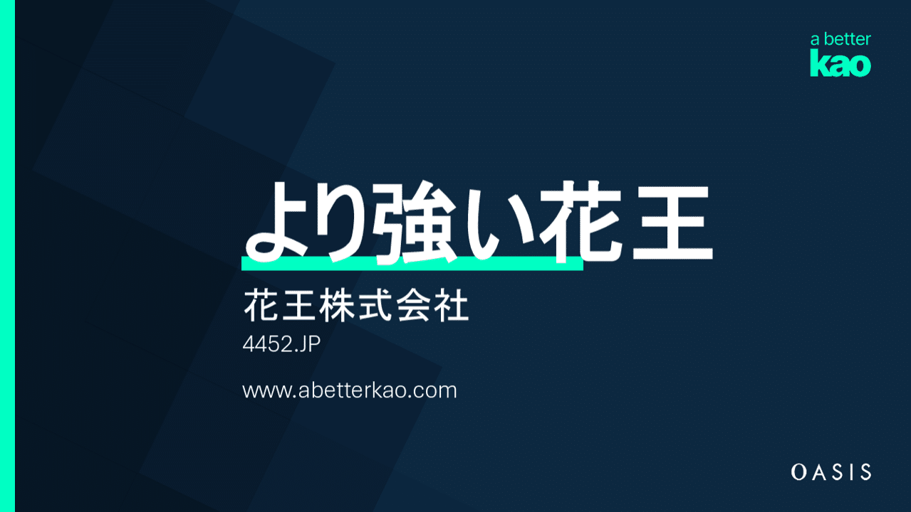
一つ目はオアシスから花王への株主提案スライドを見てみましょう。
オアシス（Oasis Management Company）は香港のアクティビストファンドで、古くから日本の大手企業に対して株主提案をしてきました。
中でも有名なのがフジテック（Fujitec）のケースです。

本件で扱う花王に対する提案はその中でもかなり力の入った提案となっており、一度見ておいた方がいいでしょう。

### オアシスから花王への株主提案スライドの構成

まず見るべきは株主提案の構成です。プレゼン資料の構成は起承転結で示されることが多いですが、最初に花王ブランドに対する経緯が示されたのち、花王のパフォーマンスや経営陣に対する辛辣な指摘が並び、そこから花王のポテンシャルや可能性の話に移り、最後に提案へと進みます。

**起承転結の起：花王への敬意**

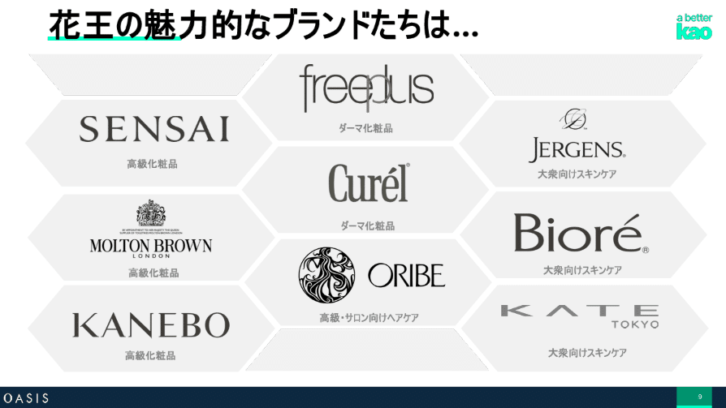
*起承転結の起：花王ブランドへの敬意*

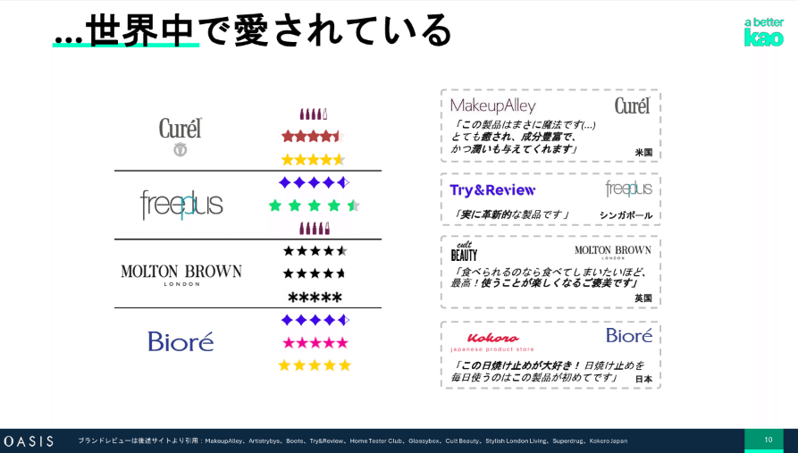
*起承転結の起：花王ブランドへの敬意*

**起承転結の承：分析に基づく指摘**

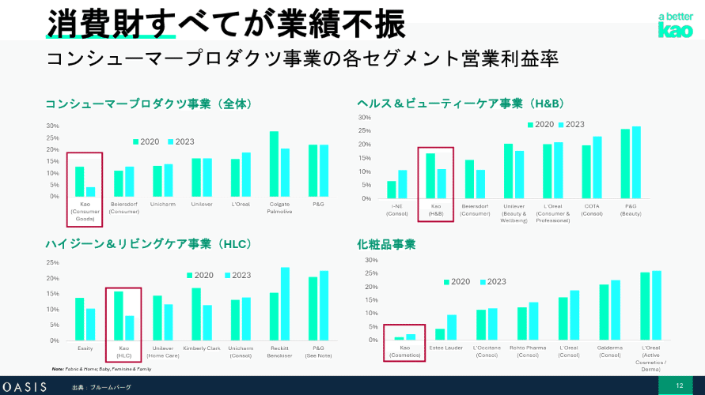
*起承転結の承：数値分析からの指摘*

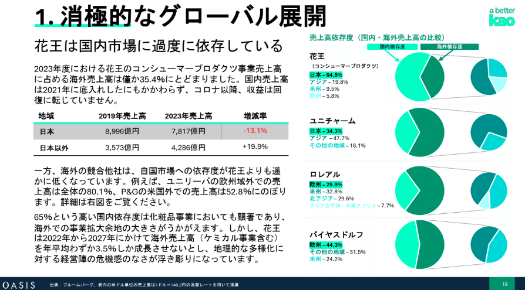
*起承転結の承：競合比較からの指摘*

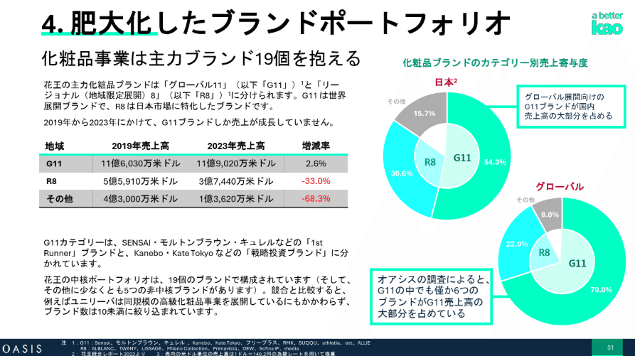
*起承転結の承：事業分析からの指摘*

**起承転結の転：分析に基づくポテンシャルの提示**

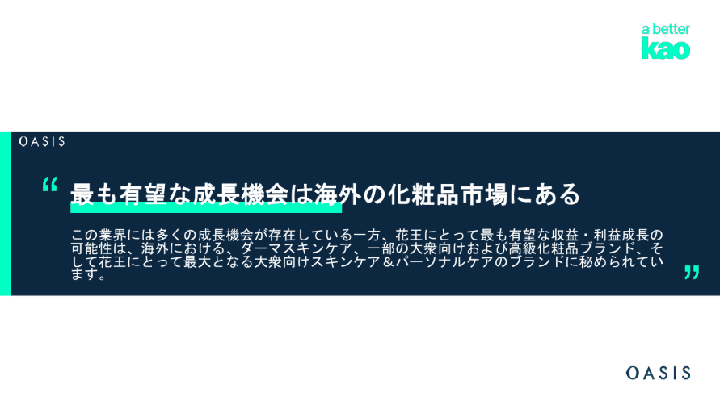
*起承転結の結：花王の成長ポテンシャル*

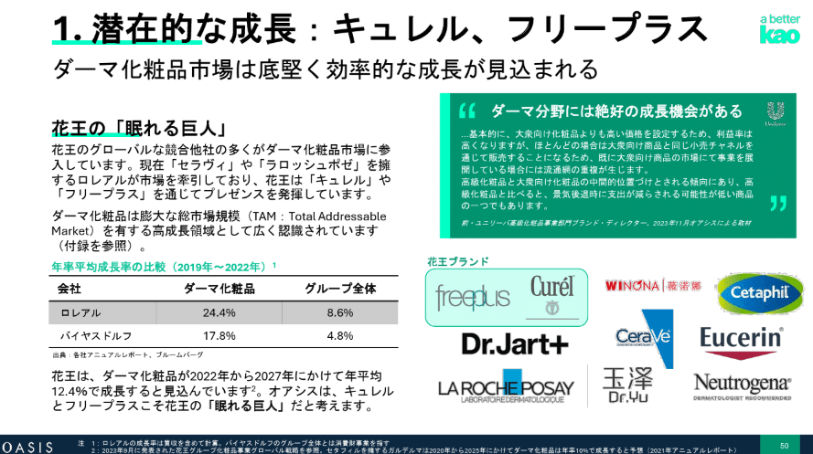
*起承転結の結：花王の成長ポテンシャル*

**起承転結の結：提案内容の説明**

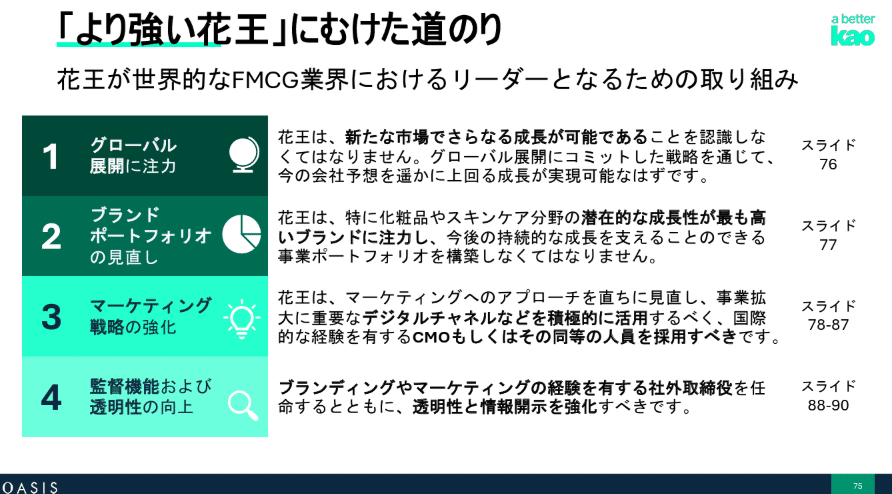
*起承転結の結：提案内容*

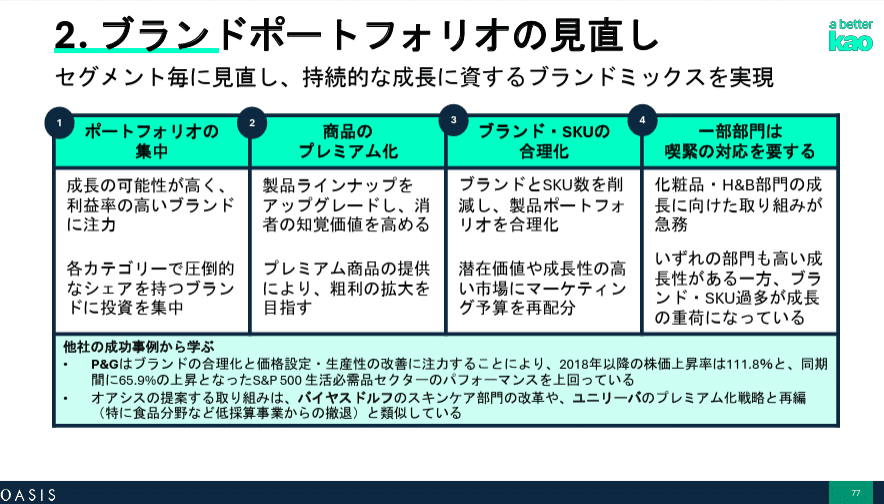
*起承転結の結：提案内容の詳細*

### オアシスから花王への株主提案スライドの作り方

上で大きな流れについて説明しましたが、ここからは説得力を高めるための工夫についてみていきましょう。

オアシスから花王への提案の特徴は、承の部分の指摘が、「花王の欠落した戦略ビジョン」「戦略を描くマーケティング」など極めて強いトーンで行われていることです。
パワポ単体で見ても、各ページで最初に見る左上の部分に、でかでか課題認識が書かれています。「やる気が根本的に欠如している」といった表現はパワポスライドではなかなか見ることができません。

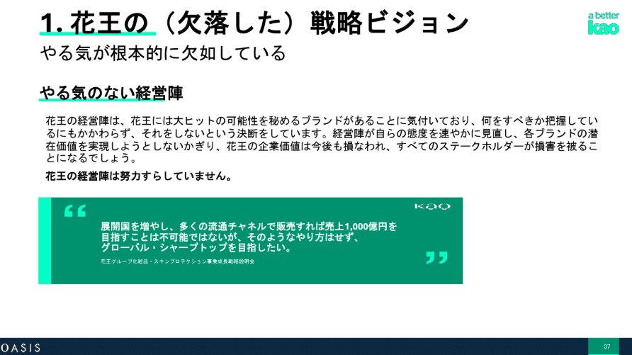
*かなり激しい言葉で非難をしているスライド*

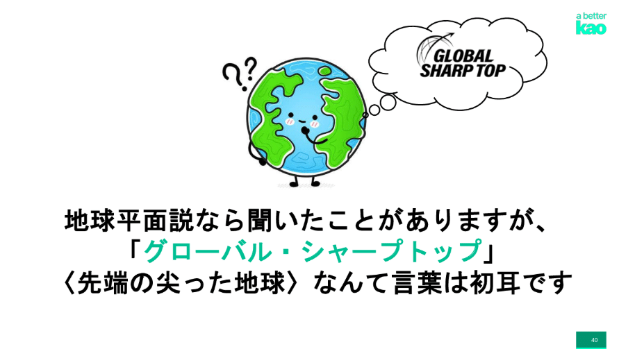
*感情を逆なでするようなスライド*

これは、何も感情を出すのが目的ではありません。花王という日本のトイレタリーのトップブランドを相手に説得していこうとすると、周りの関心を得て動かしていくような、いわば「劇場型」の動きが求められるということですね。

もちろん、激しく批判するだけでは建設的な議論はできませんので、そこから花王のポテンシャルの話、そして最後の提案へと進んでいくわけですね。最後には「花王が世界的なFMCG業界におけるリーダーとなるための取り組み」という形で提案がされています。

*再掲*

### オアシスマネジメントの他の株主提案資料

オアシスは他にもたくさんの株主提案を行っており、Web上で見られる資料も多いので、気になる方は見てみて下さい。なおオアシスは資料公開の目的を、「日本のコーポレート・ガバナンスの向上のため」「対象会社の経営陣以外の方に何らかのアクションをすすめるものではない」と明記しているため、この点は留意の上で資料を閲覧するようにしてください。

[> 太陽HDのコーポレート・ガバナンス改善](https://static1.squarespace.com/static/6811814d5a49f0360b2a80ff/t/681ae47040b8ae3536fc7b0a/1746593030031/Taiyo_Corp_Gov-JvShare.pdf)
[> 小林製薬への株主提案資料](https://static1.squarespace.com/static/673bf5585c2506744e20b273/t/67ceade8ccc58302e7c6cf5f/1741598198326/KobayashiCampaign_AGM_vF_J.pdf)
[> フジテックを守るために](https://static1.squarespace.com/static/628452ce917b956ad3d21980/t/63b2a4d2fbf43c1896aefe64/1672652006593/Protect+Fujitec+JPN+Dec2022.pdf)

*https://ja.oasiscm.com/category/engagement-campaigns/*

## 淡々と経営陣や株主を説得する事例：

## ３Dからサッポロへの株主提案資料

引用元：[https://www.compoundsapporo.com/_files/ugd/65c777_b0c2c05af87448f1a53f4ceaeffa4538.pdf](https://www.compoundsapporo.com/_files/ugd/65c777_b0c2c05af87448f1a53f4ceaeffa4538.pdf)

もう一つは3D Investment Partnersからサッポロへの株主提案スライドを見てみましょう。
3D Investment Partnersはシンガポールのアクティビストファンドです。日本製鉄やNS Solutions、富士ソフトといった企業への株主提案を行っています。

### ３Dからサッポロへの株主提案スライドの構成

こちらも株主提案の構成から見ていきましょう。起承転結でプレゼンの構成を見ると、最初の起でハイレベルな課題認識、その後の承で3Dのこれまでの貢献、転でより踏み込んだ課題指摘、結で株主提案という構成になっています。

**起承転結の起：過去の経営に関する言及**

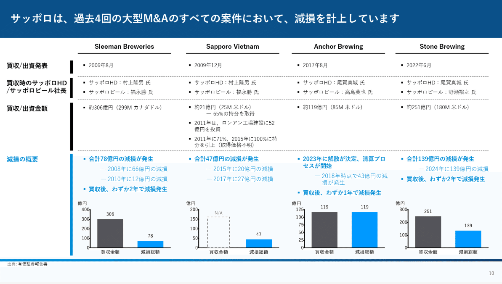
*起承転結の起：過去M&Aの減損への言及*

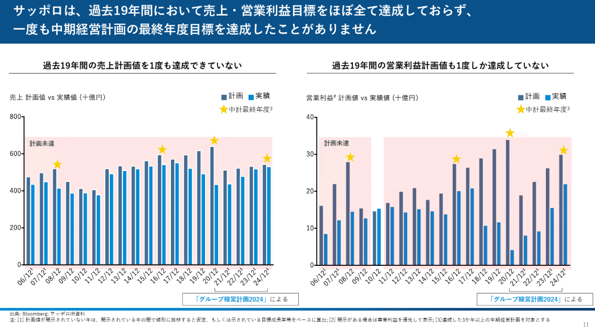
*起承転結の起：営業利益目標未達への言及*

**起承転結の承：３Dの過去の貢献への言及**

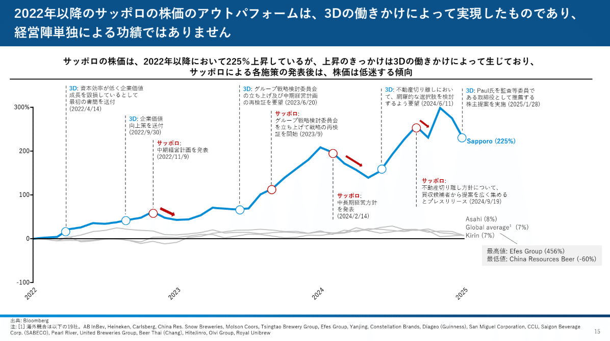
*起承転結の承：過去の3Dの貢献*

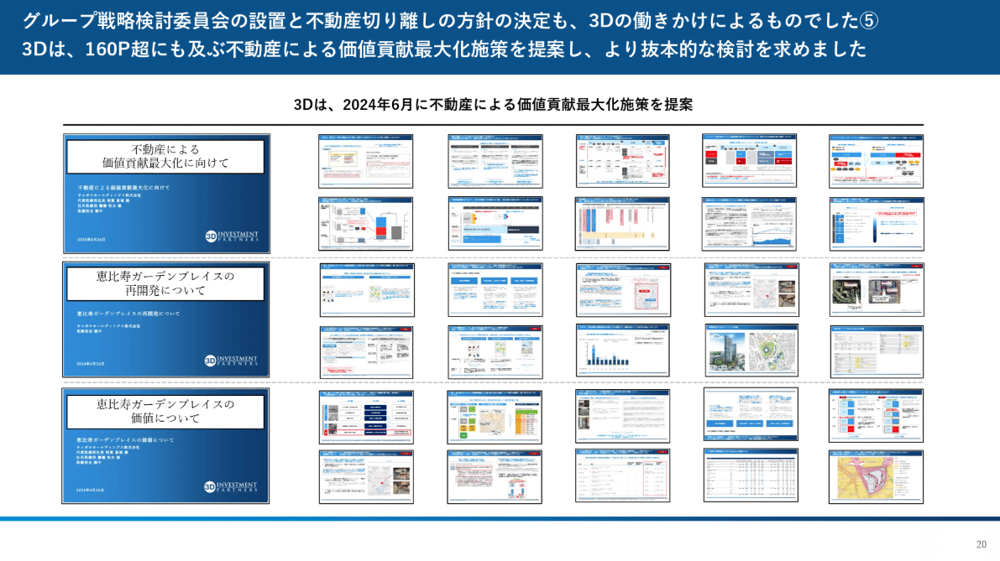
*起承転結の承：過去の3Dの貢献*

**起承転結の転：課題認識の指摘**

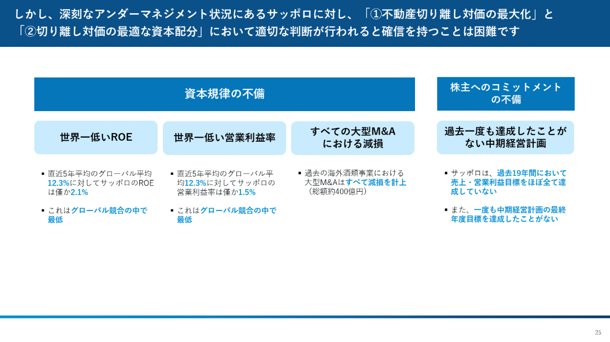
*起承転結の転：課題提起*

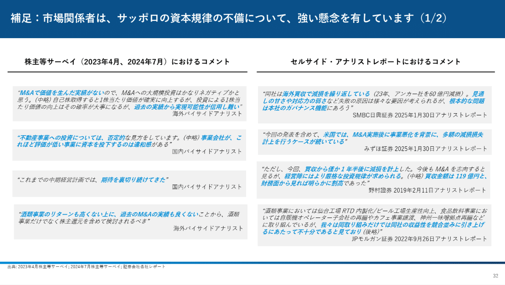
*起承転結の転：課題提起*

**起承転結の結：提案内容の説明**

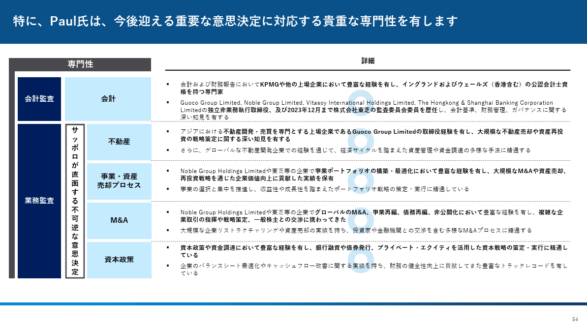
*起承転結の結：取締役の推薦*

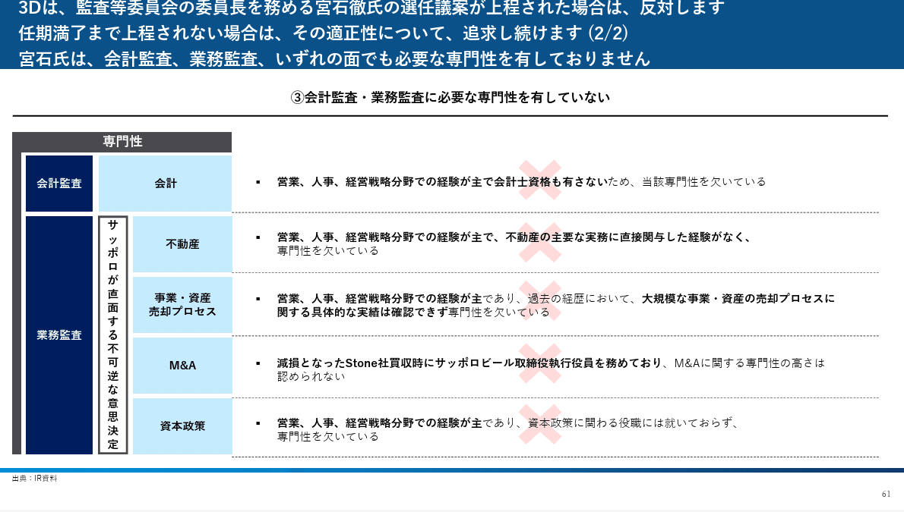
*起承転結の結：取締役の再任拒否*

### ３Dからサッポロへの株主提案スライドの作り方

再び、３Dからサッポロへの提案パワポについて、説得力を高めるための工夫についてみていきましょう。

３Dからサッポロへの提案は、最初の起の時点から「大型M&Aすべて減損」「19年間ほぼ営業利益未達」など枚数は少ないものの重い強烈な一撃をお見舞いし、次の承で3Dの過去の貢献について語り、メインパートの課題認識の共有へと進んでいきます。

起と承が5枚強であるにもかかわらず、転の課題認識の部分は30枚近くあるという構成で、「不動産の切り離しを通じた価値最大化」の実現に向けて不安が残るということを様々な角度から述べています。

このように、ある程度やることが決まっているケースであれば、全体のストーリーよりも、相手の逃げ場がないように課題提案の部分を固めに固めるというスライドの作り方もありということですね。

### ３D Investment Partnersの他の株主提案資料

３D Investment Partnersはサッポロ以外にも株主提案をしており、株主提案資料のパワポがWebにあるため、こちらも時間があれば見てみてください。

[> 日本製鉄の企業価値最大化に向けて](https://www.3dipartners.com/wp-content/uploads/nippon-maximizing-corporate-value-jp-202506.pdf)
[> 日鉄ソリューションズの企業価値最大化のために](https://www.3dipartners.com/wp-content/uploads/nssol-presentation-jp-202503.pdf)
[> 富士ソフトの企業価値最大化に向けて](https://www.3dipartners.com/wp-content/uploads/fujisoft-presentation-on-shareholderproposal-jp-202402.pdf)

*https://www.3dipartners.com/#engagement*

## その他のアクティビストファンドの株主提案スライドの事例

最後に、オアシスと3D以外で、株主提案資料をオープンにしているアクティビストファンドの資料のリンクを載せておきますね。
資料の利用においては、目的や公開されている意図を守ってご利用いただければと思います。

### ダルトン・インベストメンツの株主提案資料

[> 江崎グリコへの株主提案スライド](https://0f150b20-1256-4ec7-bae7-55db80a2a0d7.usrfiles.com/ugd/5612ae_6500252a51ab488280427ab83a7a6c08.pdf)
[> リンナイへの株主提案スライド](https://www.daltoninvestments.com/wp-content/uploads/2022/04/Rinnai-Presentation-April-2022.pdf)

*https://www.daltoninvestments.co.jp/news*

### 日本グローバルグロースインベストメンツ（NHGGP）の株主提案資料

[> 東洋水産株式会社(2875):新中期計画に対する株主の期待](https://nhggp.com/wp-content/uploads/2025/02/NHGGP-Toyo-Suisan-Presentation-February-2025-JPN.pdf)

*https://nhggp.com/ja/engagement/toyo-2875/*

### ストラテジックキャピタルの株主提案資料

[> 日産自動車への株主提案](https://stracap.jp/7201-NISSAN.pdf)
[> ゴールドクレストへの株主提案](https://stracap.jp/8871-GOLDCREST/wp/wp-content/themes/gold_crest/pdf/FSP2025.pdf)

*https://stracap.jp/proposal*

## まとめ

いかがでしたでしょうか。アクティビストの株主提案のスライドはそう多くないものの、増えてきているので、今後も面白い資料があれば追記していきますね。

## パワポ研オリジナルテンプレート

パワポ研では「ビジネスシーンで使える」パワーポイントテンプレートを公開しております。デザインを整えるのみならず、**ロジックやストーリーを整理するのにも役立つパッケージ**になっておりますので、関心のある方は下記ページも併せてご覧ください！

上記の記事のように、noteでは**フォローしているだけでビジネスにおける「資料作成のコツ」と「デザインのセンス」が身に付くアカウント**を目指して情報配信を行っています。
今後もコンスタントに記事を配信しいく予定なので、関心のある方は是非アカウントのフォローをお願いします！

**> Template販売　**[> https://powerpointjp.stores.jp/](https://powerpointjp.stores.jp/%EF%BF%BCnote)
**> note　**[> パワポ研の資料作成術](https://note.com/powerpoint_jp/m/mc291407396da)
**> X（旧Twitter)　**[> https://twitter.com/powerpoint_jp](https://twitter.com/powerpoint_jp)

## レックスアドバイザーズからのお知らせ

パワポ研は株式会社レックスアドバイザーズが運営しています。
レックスアドバイザーズは**経営企画職や経営管理職に特化した転職エージェント**です。
上場企業や上場準備企業を中心に、**経営企画、IR、経理財務、法務、内部監査等の職種の求人**をご紹介しているほか、**CFOなどのコンフィデンシャル求人**もご紹介可能です。
またコンサルティングファームや監査法人、会計事務所の求人も豊富にあるため、プロフェッショナルファームを目指す方のご支援も得意です。
求人紹介やキャリア相談を希望の方は、[**無料転職サポート**](https://www.career-adv.jp/job_search/entryform_exp/)よりサービス利用登録をしてみてください。

**> 求人をご希望の方　**[> 無料転職サポート](https://www.career-adv.jp/job_search/entryform_exp/)**
> 採用支援をご希望の方　**[> 採用サポート](https://www.career-adv.jp/request3/)
**> その他　**[> お問い合わせフォーム](https://www.rex-adv.co.jp/contact)
**> 書籍　**[> 注目企業の実例から学ぶパワポ作成術](https://www.amazon.co.jp/dp/4046060476)

