# 【マネしたい】カッコいいパワポの「TAM SAM SOM」スライド９選

[note原文](https://note.com/powerpoint_jp/n/nff9c09d4535f)

みなさんこんにちは。
資料デザインのリサーチや分析に取り組むパワーポイントのスペシャリスト、パワポ研です。

今回は、**パワポの「TAM SAM SOM」のスライドに焦点を当て、上場企業のIR資料からおしゃれなスライドを紹介**していきます。「TAM SAM SOM」のスライドといえば、特に新規上場時の成長可能性資料や決算説明資料、あるいはM&Aの投資委員会資料などで必須となるスライドです。

「TAM SAM SOM」自体になじみがない方も理解しやすいよう、「TAM SAM SOM」とは何か、スライドを作るうえでどこがポイントになるか等、一つづつ説明していきます。
では早速行きましょう！

## 「TAM SAM SOM」とは

まずはTAM SAM SOMとは何なのかからおさらいしていきましょう。
「TAM SAM SOM」とはその企業が対象とする市場の市場規模の説明をするスライドに使われるテンプレートで、円や四角が拡大していくような図を使います。

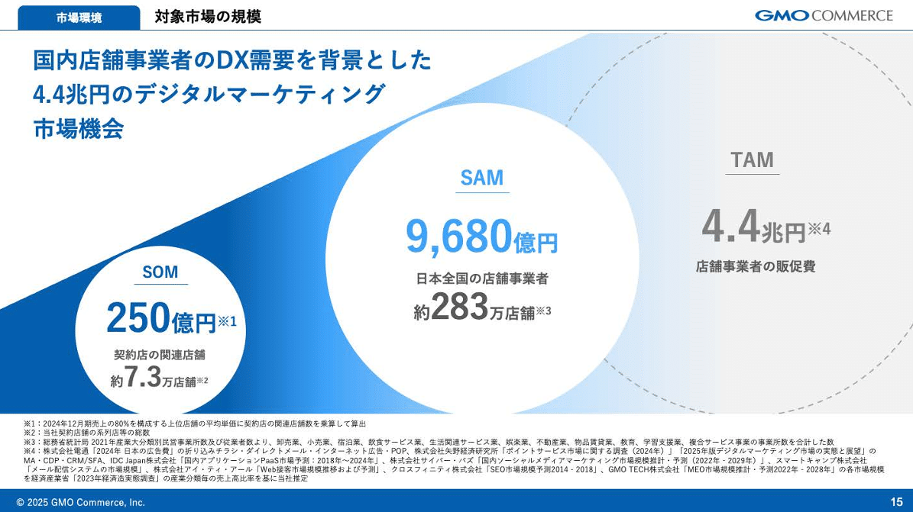
*GMOコマース株式会社の「TAM SAM SOM」のスライド例*

> 引用元：[> 事業計画及び成長可能性に関する事項](https://pdf.irpocket.com/C410A/K2Hn/B572/uhFT.pdf)

*https://ir.gmoc.jp/other/*

「TAM SAM SOM」の定義は以下の通りです。せっかくなのでGMOコマースの資料を参考に具体例も見てみましょう。

- SOM：「Serviceable Obtainable Market」の略で**今現在のサービスで獲得しうる市場の市場規模**を指します。GMOの「TAM SAM SOM」の具体例では既存顧客の関連店舗から期待できる売上をSOMと定義しています。

- SAM：「Serviceable Available Market」の略で、**今現在のサービスで狙いうる市場の最大規模**を指します。GMOの具体例では、日本全国の店舗事業者がサービスを利用した場合の売上をSAMと定義しています。

- TAM：「Target Addressable Market」の略で、**企業が狙いうる市場の最大値**を示します。GMOの具体例では、サービス拡張等を通じて狙いうる市場の最大値は店舗事業者の総販促費だとして、TAMを定義しています。

## 「TAM SAM SOM」の計算方法

続いてTAM SAM SOMの計算方法について説明します。
IR資料において「TAM SAM SOM」のスライドを作るにあたっては、既にある数字を使う場合と、自社で計算する場合の両方があります。

### 「TAM SAM SOM」の数字を引用する方法

「TAM SAM SOM」スライドを作るうえで、一番簡単に計算をする方法が、政府統計や業界団体の統計、経済産業省の委託調査、有料の市場調査レポート等を使うことです。

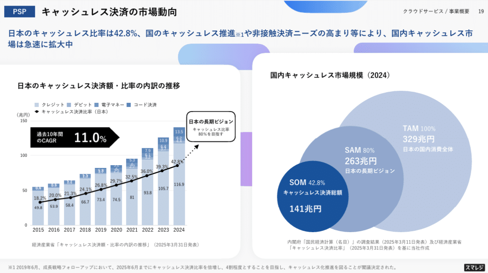
*株式会社スマレジの「TAM SAM SOM」のスライド例*

> 引用元：[> 事業計画及び成長可能性に関する事項](https://ssl4.eir-parts.net/doc/4431/tdnet/2638153/00.pdf)

*https://corp.smaregi.jp/ir/news/*

上の「TAM SAM SOM」の具体例では、内閣府の「国民経済計算（名目）」の調査結果（2025年3月11日発表）及び経済産業省「キャッシュレス決済比率」（2025年3月31日発表）を元に「TAM SAM SOM」を計算しています。
**経済産業省などの信頼性の高いデータがある場合はそのまま使うことができる**ので非常にラッキーです。

### 「TAM SAM SOM」の計算方法

しかしながら、「TAM SAM SOM」スライドにそのまま使える数字が世の中にあるとは限りません。また近しい数字は合っても、ドンピシャではないということもあります。そうした場合は、なんらかの前提をもとに、フェルミ推定などを使って計算します。

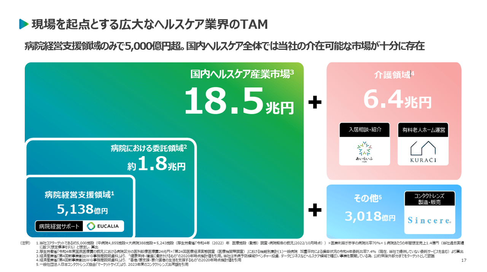
*株式会社ユカリアの「TAM SAM SOM」スライド例*

> 引用元：[> 事業計画及び成長可能性に関する事項について](https://contents.xj-storage.jp/xcontents/AS96593/0eb1e89c/0225/408b/99ce/0b8f406f7a4b/140120241211536793.pdf)

*https://eucalia.jp/ir/news/*

上の「TAM SAM SOM」の具体例では、以下のような計算方法で「TAM SAM SOM」を導き出しています。**厚生労働省や経済産業省などの信頼性の高いデータを使いつつ、赤字の病院比率などの想定を置いて**、フェルミ推定を行って計算しています。

- SOM：当社コアターゲットである約5,000施設（中病院4,855施設+大病院388施設＝5,243施設（厚生労働省「令和4年（2022）年 医療施設（動態）調査・病院報告の概況」2022/10月時点））×医業利益が赤字の病院比率70％×１病院あたりの年間想定売上1.4億円（当社過去実績に基づく想定標準モデル）と想定し、算出

- SAM：厚生労働省「令和4年度国民医療費の概況」における病院区分の医科診療医療費24兆円×「第24回医療経済実態調査（医療機関等調査）」における機能別集計(1)一般病院 加重平均による損益状況の令和4年委託比率7.4％（現在、当社で提供していない委託サービスを含む）より算出

- TAM：経済産業省「第4回新事業創出ＷＧ事務局説明資料」より、 “健康保持・増進に働きかけるもの“の2020年時点推計値を引用。当社は未病予防領域やベンチャー投資、データビジネスなどヘルスケア領域で幅広い事業を展開している為、公的保険外部分までをターゲットとして認識

「TAM SAM SOM」を計算する場合には、**その計算方法について、使ったデータの出典や前提、その根拠などを細かく書く**ことが求められます。上の「TAM SAM SOM」の具体例はまさにお手本のような例といえますね。

ちなみに「TAM SAM SOM」の計算に使える情報源についてもまとめたNoteがありますので、気になる方はこちらもどうぞ。

## 基本形の「TAM SAM SOM」スライド例３選

ではここから「TAM SAM SOM」スライドの具体例を見ていきましょう。
まずは基本形となる「TAM SAM SOM」のスライド例からです。

### 基本となる「TAM SAM SOM」スライド

まずは株式会社ダイブのパワポにおける「TAM SAM SOM」の具体例から見ていきましょう。
2025年6月期 決算説明資料のパワーポイントにある、市場環境と成長余地のスライドです。

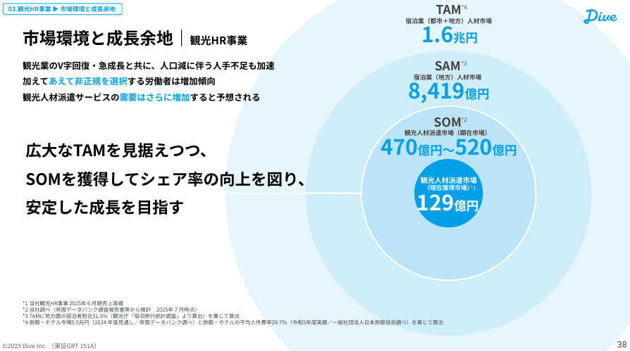
*株式会社ダイブの「TAM SAM SOM」スライド例*

> 引用元：[> 2025年6月期 通期決算説明資料（事業計画及び成長可能性に関する事項）](https://ssl4.eir-parts.net/doc/151A/tdnet/2671665/00.pdf)

*https://dive.design/ir/library/presentation*

「TAM SAM SOM」スライドの特徴としては、**同心円で「TAM SAM SOM」を見せている**点が挙げられます。中心に自社の現在の売上を置き、グラデーションで同心円を拡大していくデザインが非常に見やすい例となっています。

「TAM SAM SOM」は以下のような定義と計算方法になっています。

- TAM：観光業の人件費をTAMと定義。帝国データバンクの旅館・ホテル市場規模と、日本旅館協会の人件費率から計算。

- SAM：TAMのうち地方部分の市場規模をSAMと定義。TAMに観光庁の地方比率のデータを乗じて計算。

- SOM：「観光人材派遣」の市場規模をSOMと定義。計算方法は帝国データバンクからの推計。

### 「TAM SAM SOM」と施策のスライド

続いて株式会社セキュアのパワポにおける「TAM SAM SOM」の具体例を見ていきましょう。
2024年12月期 決算説明資料のパワーポイントにある、高度なセキュリティ・IoT社会に向けた市場展望のスライドです。

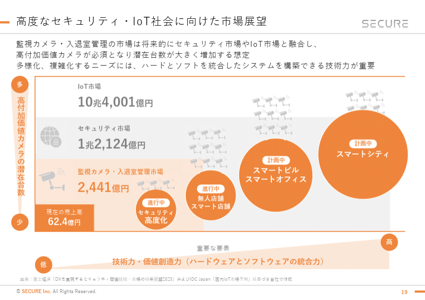
*株式会社セキュアの「TAM SAM SOM」スライド例*

> 引用元：[> 2024年12月期決算説明資料](https://contents.xj-storage.jp/xcontents/AS02669/8c71028c/dd72/470c/8f85/5461d1f34732/140120250214576643.pdf)

*https://secureinc.co.jp/ir/presentations/*

「TAM SAM SOM」スライドの特徴としては２点あります。
一つ目が、**「TAM SAM SOM」を２軸のマトリックスで見せている点**です。縦軸に高付加価値カメラの潜在台数、横軸に技術力・価値創造力を取り、より広い市場を取りに行く上でのハードルをわかりやすく示しています。
もう一つが、**現在の取り組みや計画を円にしてプロットしている**点です。TAMを取りに行くためにどのような取り組みをしているかが明確にわかり、会社として成長に向けてしっかりと取り組んでいることがわかります。

「TAM SAM SOM」の定義は下記のとおりです。計算方法ですが、全て富⼠経済「DXを実現するセキュリティ関連技術・市場の将来展望2023」およびIDC Japan「国内IoT市場予測」をもとに計算しています。

- SOM：監視カメラ・入退室管理市場をSOMと定義。

- SAM：セキュリティ市場をSAMと定義。

- TAM：IoT市場をTAMと定義。

### 「TAM SAM SOM」と外部環境のスライド

次に株式会社Arentのパワポにおける「TAM SAM SOM」の具体例を見ます。
2025年6月期 決算説明資料のパワーポイントにある、成長戦略における市場の広がりのスライドです。

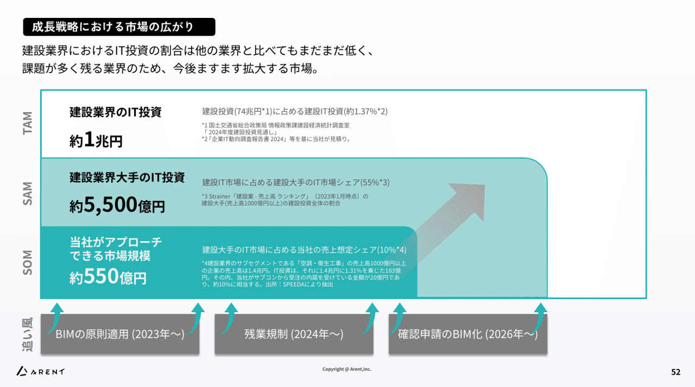
*株式会社Arentの「TAM SAM SOM」スライド例*

> 引用元：[> 2025年6月期 通期決算説明資料](https://ssl4.eir-parts.net/doc/5254/tdnet/2669039/00.pdf)

*https://arent.co.jp/ir/library/presentation/*

「TAM SAM SOM」スライドの特徴としては、**「TAM SAM SOM」拡大の追い風となる要素を外側に記載**している点です。「BIMの原則適用」「残業規制」「確認申請のBIM化」がどのように市場拡大に貢献するかが一目でわかるようになっています。

「TAM SAM SOM」は以下のような定義と計算方法になっています。

- TAM：建設業界のIT投資額をTAMと定義。国土交通省の「建設投資額」と企業IT動向調査の、建設業のIT投資の割合から計算。

- SAM：建設業界大手のIT投資額をSAMと定義。TAMと建設大手の売上げシェアから計算。

- SOM：当社がアプローチできる市場規模をSOMと定義。SAMに対して、当社がとりうる想定シェアから計算。

## 将来予測「TAM SAM SOM」スライド例３選

続いて、「TAM SAM SOM」に市場成長の要素が入っているスライドの例を見ていきましょう。

### 将来の「TAM SAM SOM」のスライド

まずはデジタルグリッド株式会社のパワポにおける「TAM SAM SOM」の具体例です。
2025年7月期 決算説明資料のパワーポイントにある、ターゲットとなる市場規模のスライドになります。

*デジタルグリッド株式会社の「TAM SAM SOM」スライド例*

> 引用元：[> 2025年7月期 通期 決算説明資料（事業計画及び成長可能性に関する事項）の追加資料について](https://ssl4.eir-parts.net/doc/350A/tdnet/2686579/00.pdf)

*https://www.digitalgrid.com/ir/library/presentation/*

「TAM SAM SOM」スライドの特徴としては、**現在のSOMに加えて、2040年の「TAM SAM SOM」が記載されている**点が挙げられます。将来の話なので数値も幅で示しています。

「TAM SAM SOM」は以下のような定義と計算方法になっています。

- TAM：2040年の電力需要をTAMと定義。「2040年度におけるエネルギー需給の見通し、電力調査統計電力需要実績2023年度（資源エネルギー庁）」から計算。

- SAM：2040年の特別高圧・高圧需要をSAMと定義。TAMに資源エネルギー庁の現在の特別高圧・高圧需要の比率をかけて計算。

- SOM：2040年の特別高圧・高圧需要のうち新電力分をSOMと定義。SAMに資源エネルギー庁の新電力のシェアを掛けて計算。

### 「TAM SAM SOM」が短中長期のスライド

続いて株式会社Liberawareのパワポにおける「TAM SAM SOM」の具体例から見ていきましょう。
2025年6月期 決算説明資料のパワーポイントにある、下水道維持管理の市場規模のスライドです。

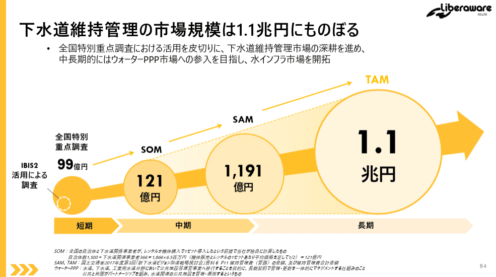
*株式会社Liberawareの「TAM SAM SOM」スライド例*

> 引用元：[> 2025年7月期 通期決算説明資料](https://ssl4.eir-parts.net/doc/218A/tdnet/2687217/00.pdf)

*https://liberaware.co.jp/ir/library/presentation/*

「TAM SAM SOM」スライドの特徴としては、SOMが短期の市場規模、SAMが中期の市場規模、TAMが長期の市場規模というように、**「TAM SAM SOM」と時間軸がリンクしている**点が挙げられます。

「TAM SAM SOM」は以下のような定義と計算方法になっています。

- SOM：：全国の自治体と下水道関係事業者が、レンタルか機体購入する場合の市場規模と定義。自治体数と単価から計算。

- SAM：中期での下水道の維持管理費をSAMと定義。国土交通省2017年度第3回「新下水道ビジョン加速戦略検討会」から計算。

- TAM：長期での下水道の維持管理費をSAMと定義。国土交通省2017年度第3回「新下水道ビジョン加速戦略検討会」から計算。

### 現在と将来のSOMがあるスライド

続いて株式会社タイミーのパワポにおける「TAM SAM SOM」の具体例を見ていきましょう。
事業計画及び成長可能性に関する事項のパワーポイントにある、スポットワークの枠を超えた巨大な市場機会のスライドです。

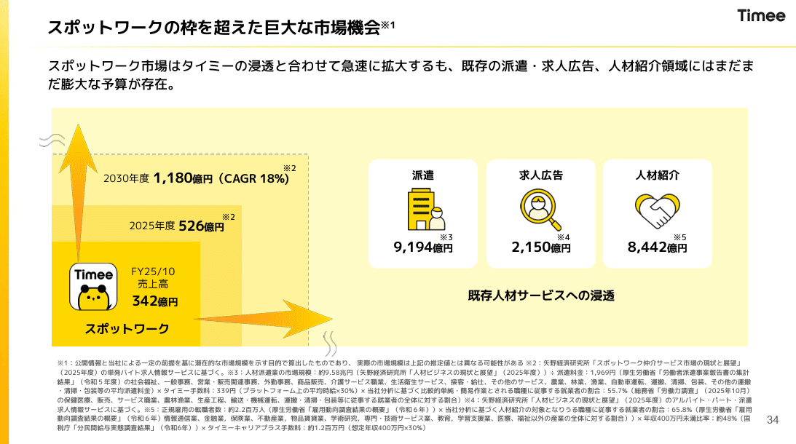
*株式会社タイミーの「TAM SAM SOM」スライド例*

> 引用元：[> 事業計画及び成長可能性に関する事項](https://contents.xj-storage.jp/xcontents/AS05113/edac4ae8/c8d8/4d42/ae51/e2d031c7c2ff/140120251211518011.pdf)

*https://corp.timee.co.jp/ir/*

「TAM SAM SOM」スライドの特徴としては、**SOMを現在と将来に分けて見せている点と、TAMとなりうる市場をいくつかのセグメントで記載している点**が挙げられます。

「TAM SAM SOM」は以下のような定義と計算方法になっています。

- SOM：スポットワークの市場規模をSOMと定義。計算方法は矢野経済研究所「スポットワーク仲介サービス市場の現状と展望」（2025年度）の単発バイト求人情報サービスに基づく。

- TAM：既存人材サービスの市場から当社がとりうる市場をTAMと定義。同矢野経済研究所の資料に加え、厚生労働省や総務省の資料、そしてタイミーの単価等で計算。

## セグメント別「TAM」があるスライド例３選

ここからは「TAM」がセグメント分けされているスライド例を見ていきましょう。「TAM SAM SOM」スライドはたくさん見てきたので、ここからは「TAM」に絞ったスライドが中心です。

### セグメント別「TAM」のスライド

まずはフィットイージー株式会社のパワポにおける「TAM」の具体例から見ていきましょう。
2025年10月期 決算説明資料のパワーポイントにある、フィットネス市場＋アミューズメント市場の可能性のスライドです。

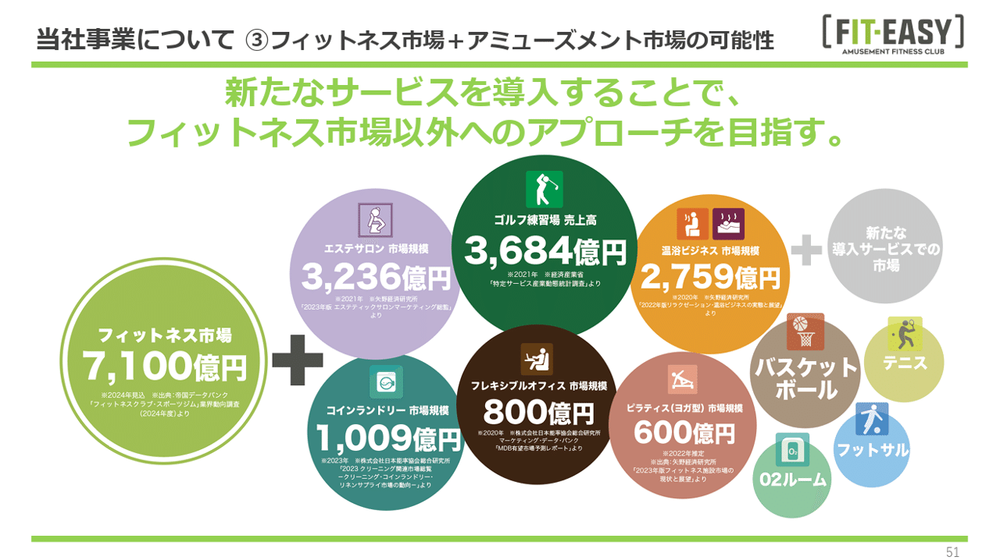
*フィットイージー株式会社の「TAM SAM SOM」スライド例*

> 引用元：[> 2025年10月期　決算説明資料](https://ssl4.eir-parts.net/doc/212A/tdnet/2730775/00.pdf)

*https://fiteasy.co.jp/ir/library/presentation/*

「TAM」スライドの特徴としては、比較的無造作に周辺市場の市場規模が記載されている点が挙げられます。**色などもバラバラですが、あえて「いろいろな機会がある」ということを見せるために乱雑にプロット**しています。

それぞれのマーケットの市場規模が書いてありますが、情報ソースは、帝国データバンク、経済産業省、矢野経済研究所、日本能率協会研究所など様々です。

### バリューチェーン別「TAM」のスライド

続いて株式会社デコルテ・ホールディングスのパワポにおける「TAM」の具体例から見ていきましょう。
2025年9月期 決算説明資料（事業計画及び成長可能性に関する事項）のパワーポイントにある、当社のアプローチする市場（TAM: Total Addressable Market）のスライドです。

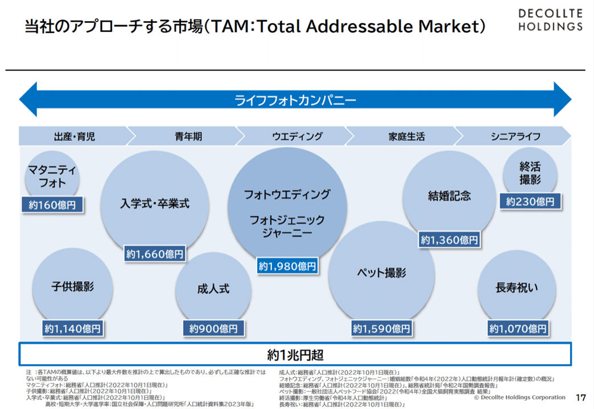
*株式会社デコルテ・ホールディングスの「TAM SAM SOM」スライド例*

> 引用元：[> 2025年9月期 決算説明資料（事業計画及び成長可能性に関する事項）](https://ssl4.eir-parts.net/doc/7372/tdnet/2708580/00.pdf)

*https://ir.decollte.co.jp/news/*

「TAM」スライドの特徴としては、**出産・育児からシニアライフまでの人生のフローに対して、各セグメントのTAMをプロットしている**点が挙げられます。現在のフォトウェディングから左右に拡張余地があることが一目でわかるようになっています。

それぞれのマーケットの市場規模が書いてありますが、総務省や厚生労働省、国立社会保障・人口問題研究所など人口に関する統計に単価をかけ合わせて計算されています。ペットだけはペットフード協会の数字が使われていますね。

### 円グラフの「TAM SAM SOM」のスライド

最後は株式会社TENTIALのパワポにおける「TAM SAM SOM」の具体例を見ていきましょう。【マネしたい】シリーズでは何度か取り上げているスライドですが、そのぐらい素晴らしいスライドです。
2025年8月期 通期決算説明資料（事業計画及び成長可能性に関する資料）のパワーポイントにある、TENTIALが対峙する市場と将来獲得できる市場のスライドです。

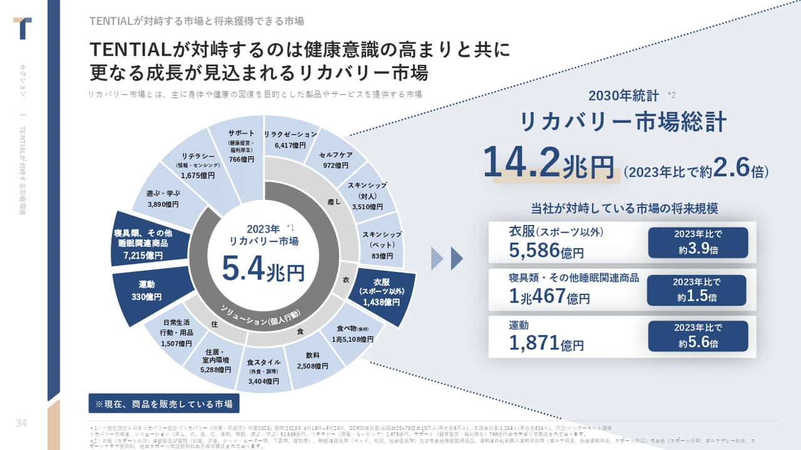
*株式会社TENTIALの「TAM SAM SOM」スライド例*

> 引用元：[> 2025年8月期 通期決算説明資料（事業計画及び成長可能性に関する資料）](https://ssl4.eir-parts.net/doc/325A/tdnet/2698232/00.pdf)

*https://corp.tential.jp/ir/library/presentations/*

「TAM SAM SOM」スライドの特徴としては、円グラフ（サンバースト）でリカバリー市場をセグメント化している点が挙げられます。それだけでなくSOMとなるような主要市場については、2030年の個別の市場規模も記載しています。

「TAM SAM SOM」は一般社団法人日本リカバリー協会『リカバリー（休養・抗疲労）白書2023』をベースに計算されていますね。

## 【マネしたい】カッコいいパワポの「TAM SAM SOM」スライド９選まとめ

以上、様々な資料を見ながら、「TAM SAM SOM」の定義や計算方法などのパターンを紹介してきました。**「TAM SAM SOM」は自社の対峙する市場によっても見せ方が変わってくる**ので、是非いろいろなパターンを試してみてくださいね。

ちなみに**パワポ研で提供しているテンプレート集には、以下のようなそのまま使える「TAM SAM SOM」のテンプレートもあります**ので、気になる方は下で紹介しているオリジナルテンプレートのNoteも見てみてくださいね。

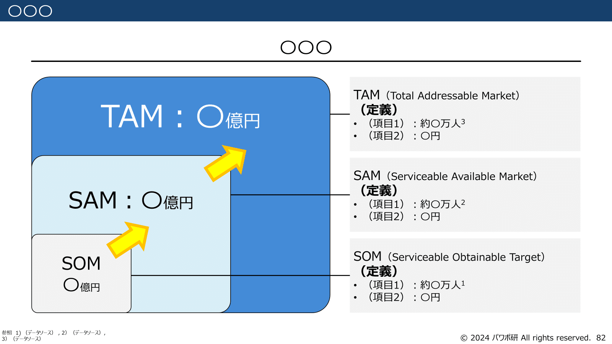
*パワポ研オリジナルテンプレートの「TAM SAM SOM」テンプレート①*

*パワポ研オリジナルテンプレートの「TAM SAM SOM」テンプレート②*

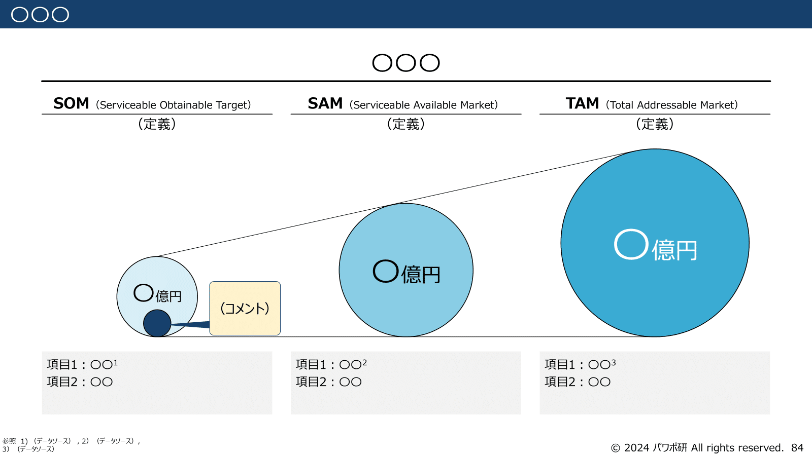
*パワポ研オリジナルテンプレートの「TAM SAM SOM」テンプレート③*

## パワポ研オリジナルテンプレート

パワポ研では「ビジネスシーンで使える」パワーポイントテンプレートを公開しております。デザインを整えるのみならず、**ロジックやストーリーを整理するのにも役立つパッケージ**になっておりますので、関心のある方は下記ページも併せてご覧ください！

上記の記事のように、noteでは**フォローしているだけでビジネスにおける「資料作成のコツ」と「デザインのセンス」が身に付くアカウント**を目指して情報配信を行っています。
今後もコンスタントに記事を配信していく予定なので、関心のある方は是非アカウントのフォローをお願いします！

**> Template販売　**[> https://powerpointjp.stores.jp/](https://powerpointjp.stores.jp/%EF%BF%BCnote)
**> note　**[> パワポ研の資料作成術](https://note.com/powerpoint_jp/m/mc291407396da)
**> X（旧Twitter)　**[> https://twitter.com/powerpoint_jp](https://twitter.com/powerpoint_jp)

## レックスアドバイザーズからのお知らせ

パワポ研は株式会社レックスアドバイザーズが運営しています。
レックスアドバイザーズは**経営企画職や経営管理職に特化した転職エージェント**です。
上場企業や上場準備企業を中心に、**経営企画、IR、経理財務、法務、内部監査等の職種の求人**をご紹介しているほか、**CFOなどのコンフィデンシャル求人**もご紹介可能です。
またコンサルティングファームや監査法人、会計事務所の求人も豊富にあるため、プロフェッショナルファームを目指す方のご支援も得意です。
求人紹介やキャリア相談を希望の方は、[**無料転職サポート**](https://www.career-adv.jp/job_search/entryform_exp/)よりサービス利用登録をしてみてください。

*レックスアドバイザーズのサービスサイトはこちら*

**> 求人をご希望の方　**[> 無料転職サポート](https://www.career-adv.jp/job_search/entryform_exp/)**
> 採用支援をご希望の方　**[> 採用サポート](https://www.career-adv.jp/request3/)
**> その他　**[> お問い合わせフォーム](https://www.rex-adv.co.jp/contact)
**> 書籍　**[> 注目企業の実例から学ぶパワポ作成術](https://www.amazon.co.jp/dp/4046060476)

